# 06.14 — Failure Domains

## Learning Objectives

By the end of this chapter, you will be able to:

- Explain what a failure domain is.
- Distinguish a failure domain from a blast radius.
- Understand why redundancy does not automatically provide resilience.
- Identify common failure domains from process to region.
- Recognize correlated failures.
- Understand how failure-domain placement affects replicas, quorum, and load balancing.
- Design redundancy across sufficiently independent failure domains.
- Evaluate the trade-offs of multi-AZ and multi-region architectures.

---

# Beginner Vocabulary

| Term | Beginner-Friendly Meaning |
|---|---|
| **Failure Domain** | A group of components that can fail together because they share a dependency or failure cause. |
| **Blast Radius** | The part of a system affected when something fails. |
| **Redundancy** | Having additional components that can continue the work when another fails. |
| **Correlated Failure** | Multiple components failing because of the same underlying cause. |
| **Host** | A physical or virtual machine running workloads. |
| **Rack** | A physical structure containing multiple machines and networking equipment. |
| **Availability Zone** | An isolated infrastructure location within a cloud region, designed to reduce shared physical failure. |
| **Region** | A larger geographic infrastructure area containing multiple availability zones. |
| **Single Point of Failure (SPOF)** | A component whose failure can prevent the required system operation. |
| **Isolation** | Separating components so that one failure is less likely to affect another. |
| **Failover** | Moving work from a failed or unavailable component to another component. |
| **Quorum** | The required number of participating nodes for an operation or decision. |
| **Shared Dependency** | A component or service that multiple supposedly independent components depend on. |
| **Resilience** | The ability of a system to continue or recover when failures occur. |
| **Multi-AZ** | Running components across multiple availability zones. |
| **Multi-Region** | Running components across multiple geographic regions. |

---

# 1. What Is a Failure Domain?

A **failure domain** is a set of components that can fail together because they share some underlying dependency or failure cause.

For example:

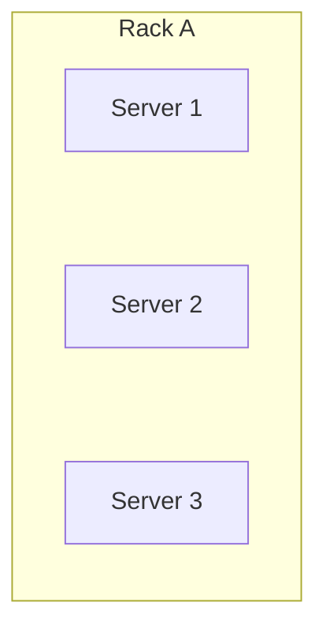

If all three servers depend on the same rack power supply, a power failure can affect all three.

Therefore:

```text
Rack A = Failure Domain
```

The important question is not:

> "How many servers do I have?"

It is:

> **"How independently can these servers fail?"**

That distinction is fundamental to reliable system design.

---

# 2. Why Failure Domains Matter

Suppose an application has three servers:

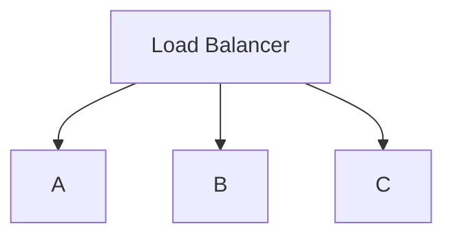

It looks redundant.

But suppose:

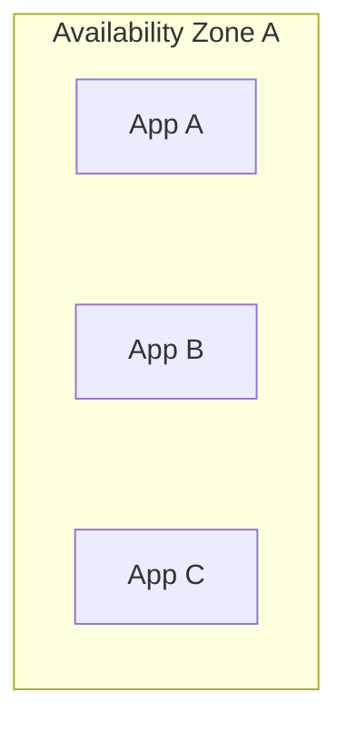

If the entire availability zone becomes unavailable:

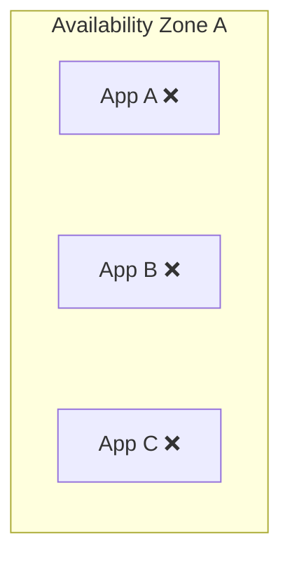

All three instances disappear together.

The system had **three instances**, but effectively only **one failure domain**.

This gives us an important principle:

> **Redundancy protects you only when the redundant components are sufficiently independent.**

---

# 3. Failure Domain vs Blast Radius

These concepts are related but different.

### Failure domain

Describes **what can fail together**.

### Blast radius

Describes **what is affected by the failure**.

For example:

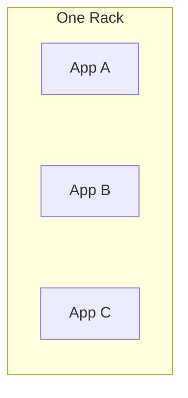

The rack is a failure domain.

If the rack loses power:

```text
App A ❌
App B ❌
App C ❌
```

The blast radius is the three application instances.

So:

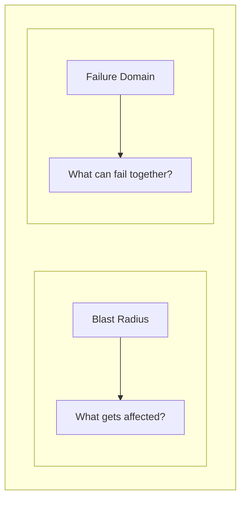

A good architecture tries to keep important redundancy outside the same failure domain and keep the blast radius as small as practical.

---

# 4. Failure Domains Form a Hierarchy

Failures can exist at different levels.

A simplified hierarchy is:

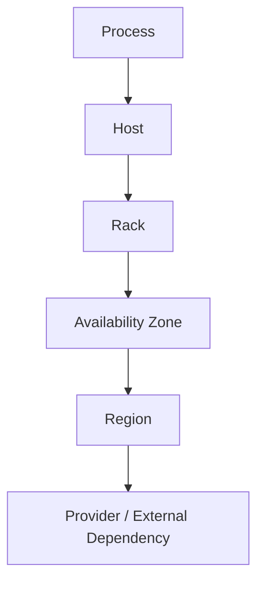

Not every architecture has every layer.

The important idea is that a larger failure can contain smaller failure domains.

For example:

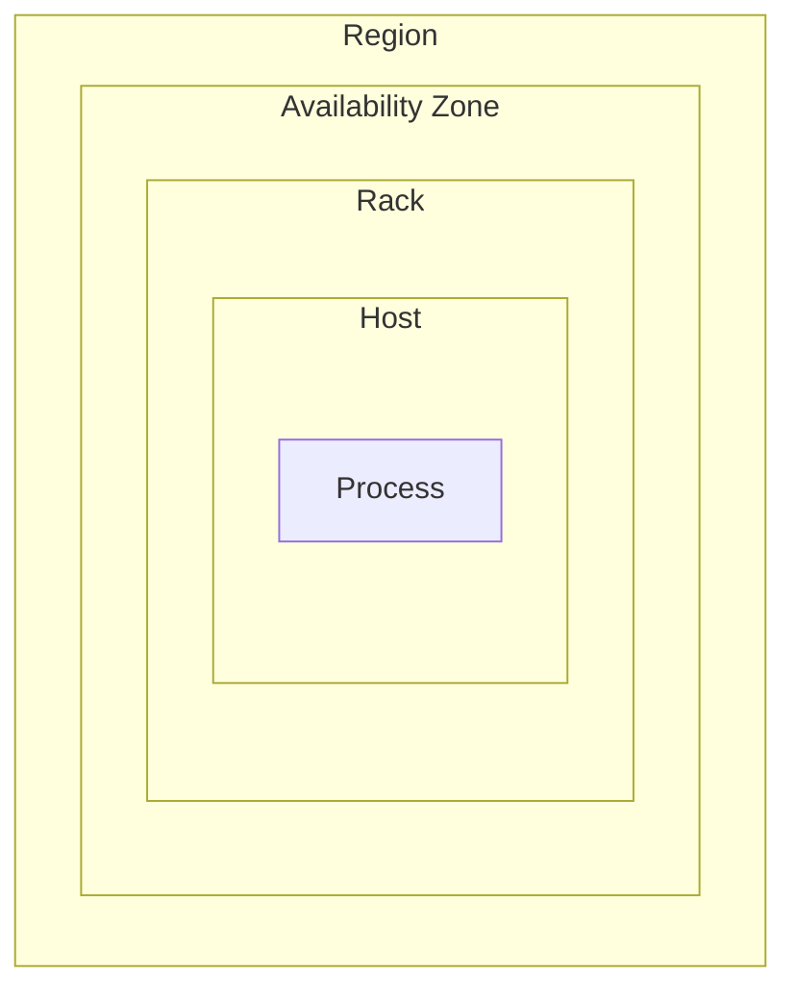

A process failure may affect one application instance.

A host failure may affect several processes.

A rack failure may affect several hosts.

An availability-zone failure may affect many racks.

A region-level failure can affect the entire region.

---

# 5. Process Failure

The smallest practical failure domain may be an individual process.

Example:

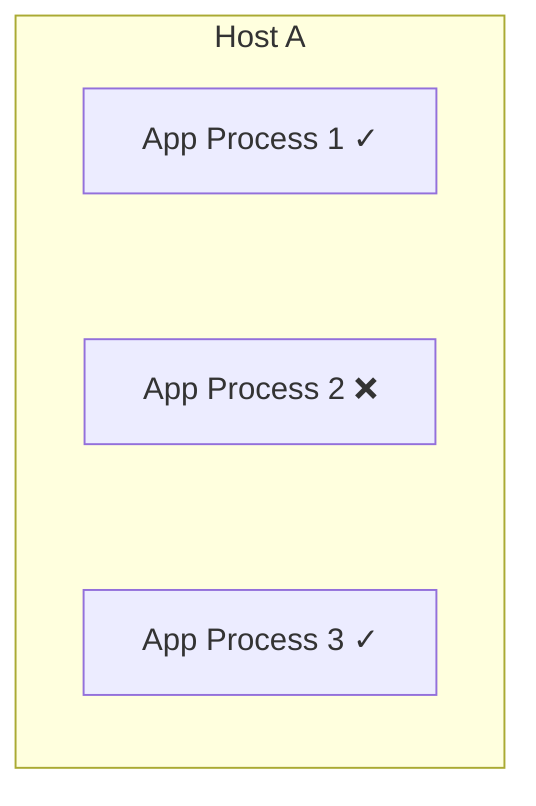

Only one process failed.

A process supervisor or orchestrator may restart it.

If the application has multiple independent processes, the blast radius may be small.

But multiple processes may still share the same host.

That means:

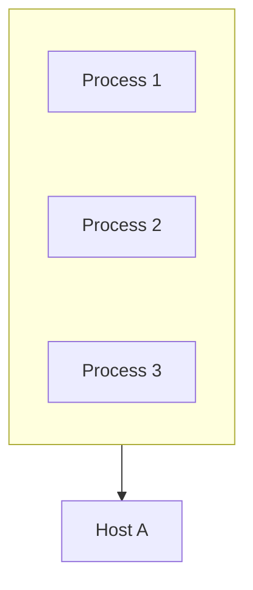

They are not independent from a host-level failure.

---

# 6. Host Failure

A host is a physical or virtual machine.

Suppose:

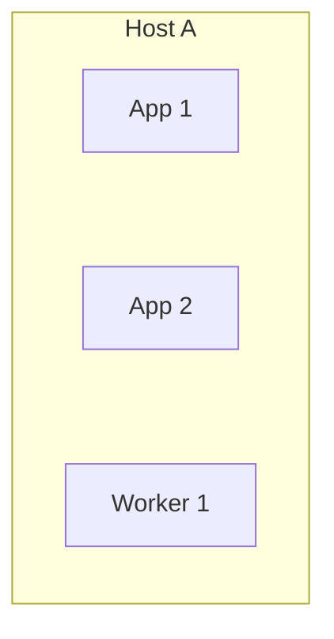

If Host A fails:

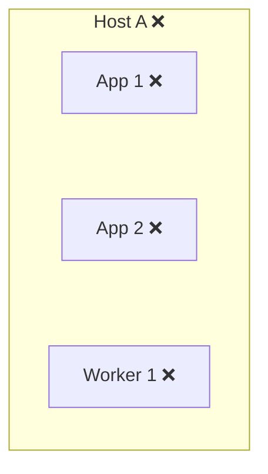

Every workload on that host may disappear simultaneously.

This is why running multiple processes on one host is not equivalent to running those processes across independent hosts.

---

# 7. Rack Failure

In a physical data center, multiple machines may share:

- Power.
- Network equipment.
- Cooling.
- Physical infrastructure.

For example:

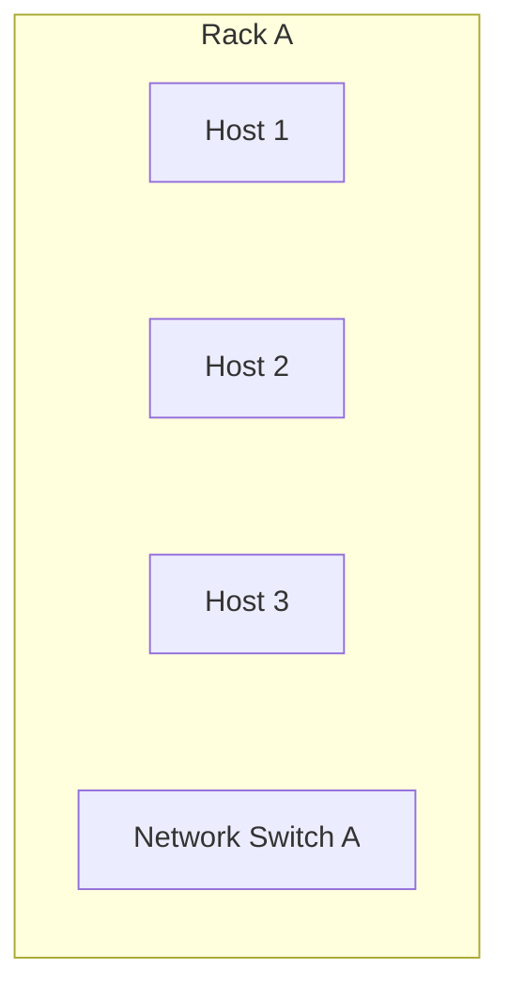

A rack-level problem can affect all of them.

Therefore:

```text
Host 1 ≠ independent
Host 2 ≠ independent
Host 3 ≠ independent
```

if they all depend on the same rack infrastructure.

This is an example of **correlated failure**.

---

# 8. Availability-Zone Failure

Cloud systems commonly provide multiple availability zones within a region.

Conceptually:

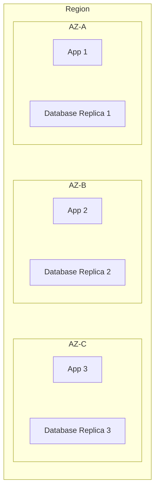

The goal is to reduce the chance that one infrastructure-level problem removes every copy.

Compare:

### Poor placement

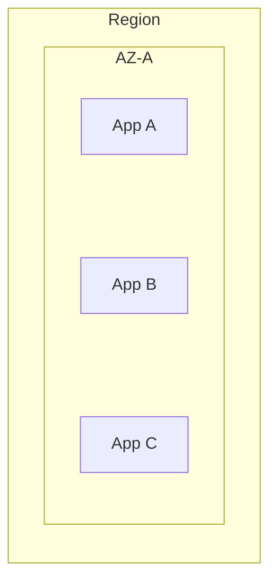

### Better placement

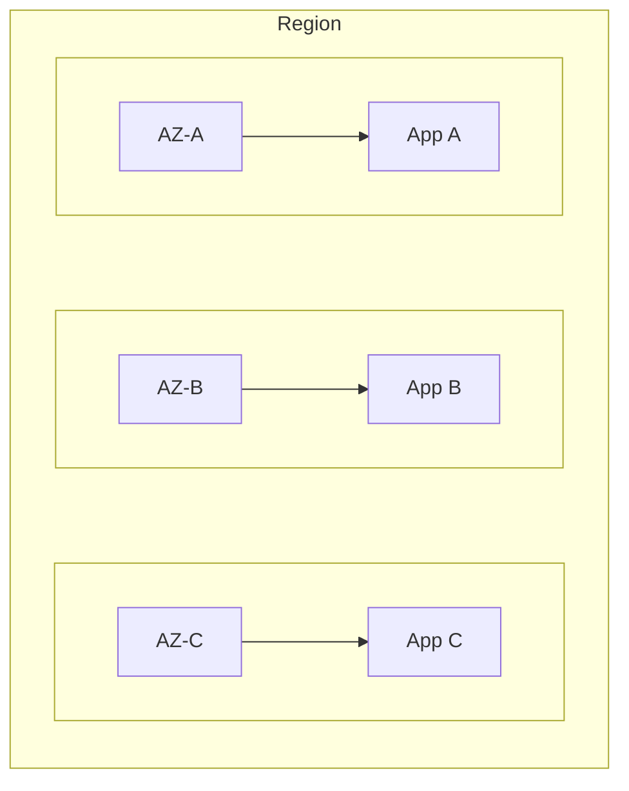

The second design provides stronger protection against an AZ-level failure.

But it also introduces additional network and operational considerations.

---

# 9. Region Failure

A region is a much larger failure domain.

Possible causes include:

- Major infrastructure failures.
- Large-scale networking problems.
- Regional service outages.
- Configuration mistakes.
- Control-plane problems.
- Geographic events.

A multi-region architecture might look like:

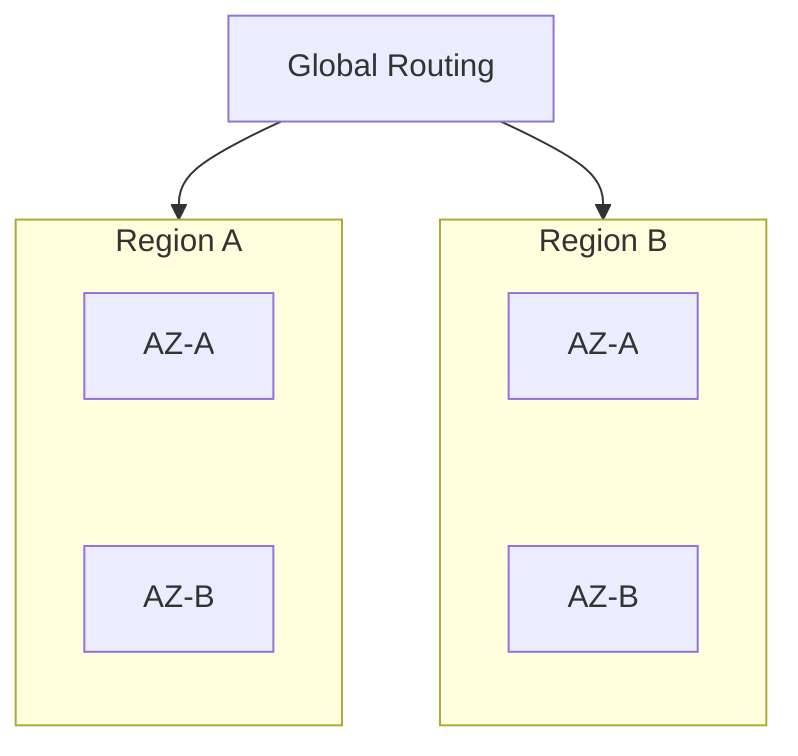

Now a regional failure does not necessarily remove every system component.

However, multi-region architecture is significantly more complicated.

It may introduce:

- Higher network latency.
- Cross-region data replication.
- Data consistency challenges.
- Higher cost.
- More complicated failover.
- More complicated deployments.
- DNS/routing considerations.
- Cross-region recovery requirements.

Multi-region should therefore solve a real requirement rather than simply being added because it sounds more reliable.

---

# 10. Redundancy Is Only Useful Across Independent Failures

Consider:

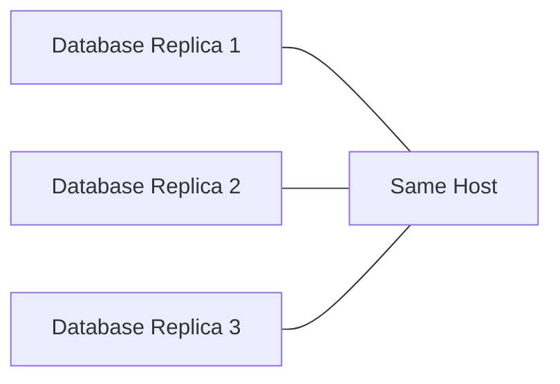

Three replicas exist.

But if the host fails:

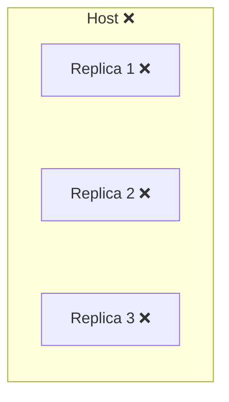

The three replicas did not provide host-level resilience.

A stronger design might be:

```text
Host A → Replica 1
Host B → Replica 2
Host C → Replica 3
```

And potentially:

```text
AZ-A → Replica 1
AZ-B → Replica 2
AZ-C → Replica 3
```

The exact placement depends on the failure being protected against.

---

# 11. Failure-Domain Independence

"Independent" does not mean perfectly independent.

Two servers may be separate machines but still share:

```text
Power
Network
Storage
DNS
Control Plane
Deployment System
Configuration
Credentials
```

For example:

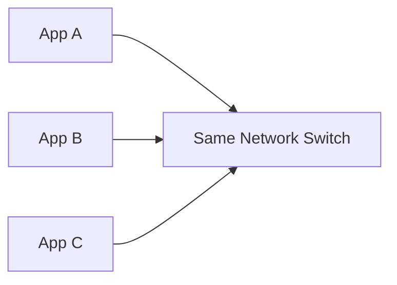

A switch failure can affect all three.

Therefore, resilience should be evaluated against **specific failure assumptions**.

Ask:

> **What failure am I trying to survive?**

Then place redundancy outside that failure domain.

---

# 12. Correlated Failures

A correlated failure happens when multiple components fail because of one underlying cause.

For example:

```mermaid
flowchart TD
  accTitle: Correlated failure
  accDescr: A bad configuration takes down apps A, B, C and D.
  B["Bad Configuration"] --> A["App A<br/>❌"] & X["B<br/>❌"] & C["C<br/>❌"] & D["D<br/>❌"]
```

The applications are on different machines.

They are still vulnerable because they share the same configuration change.

Other examples:

```mermaid
flowchart TD
  accTitle: Other correlated failures
  accDescr: A common software bug, a shared network, shared storage or a bad deployment can each take down many components.
  subgraph W[" "]
    direction TB
    subgraph W0[" "]
      direction TB
      WA0["Common software bug"] --> WB0["Multiple instances fail"]
    end
    subgraph W1[" "]
      direction TB
      WA1["Shared network"] --> WB1["Multiple services unreachable"]
    end
    subgraph W2[" "]
      direction TB
      WA2["Shared storage"] --> WB2["Multiple nodes lose access"]
    end
    subgraph W3[" "]
      direction TB
      WA3["Bad deployment"] --> WB3["Multiple instances become unhealthy"]
    end
    W0 ~~~ W1 ~~~ W2 ~~~ W3
  end
```

This is why simply distributing machines geographically does not eliminate every correlated failure.

---

# 13. Deployment Is Also a Failure Domain

Consider:

```text
Version 1
App A ✓
App B ✓
App C ✓
```

A deployment changes all instances:

```text
Version 2
App A ❌
App B ❌
App C ❌
```

The physical infrastructure did not fail.

The **deployment event** became the common failure cause.

This is why production deployments often use strategies such as:

- Rolling deployments.
- Canary deployments.
- Blue/green deployments.
- Automated health checks.
- Fast rollback.

The details of deployment strategies come later in the curriculum, but the principle is important now:

> **A failure domain can be logical, not only physical.**

---

# 14. Configuration Can Create a Failure Domain

Suppose every application instance reads the same configuration:

```mermaid
flowchart LR
  accTitle: Shared configuration
  accDescr: Apps A, B and C all read the same configuration.
  S0["App A"] & S1["App B"] & S2["App C"] --> T["Configuration"]
```

A bad configuration value can affect every instance.

For example:

```text
Database host = wrong-address
```

Then:

```text
App A → DB ❌
App B → DB ❌
App C → DB ❌
```

The machines are healthy.

The system is still unavailable.

Shared configuration therefore becomes part of the system's failure model.

---

# 15. Load Balancers Have Failure Domains Too

Consider:

```mermaid
flowchart TD
  accTitle: One load balancer
  accDescr: A load balancer in front of apps A, B and C.
  L["Load Balancer"] --> A["App A"] & B["App B"] & C["App C"]
```

If the load balancer is one process on one machine:

```mermaid
flowchart TD
  accTitle: Load balancer fails
  accDescr: The failed load balancer cuts users off (X) from apps A/B/C.
  L["Load Balancer ❌"] --x A["App A/B/C"]
```

The application servers may all be healthy, but users cannot reach them.

The load balancer itself has become a single point of failure.

A more resilient design may use redundant load-balancing infrastructure:

```mermaid
flowchart TD
  accTitle: Redundant load balancers
  accDescr: A load-balancing layer with LB-A and LB-B, both in front of apps A/B/C.
  L["Load Balancing Layer"] --> A["LB-A"] & B["LB-B"]
  A & B --> P["App A/B/C"]
```

The exact implementation varies.

The principle remains:

> **Do not evaluate redundancy only at the application layer. Evaluate the complete request path.**

---

# 16. Database Failure Domains

Database architecture requires especially careful placement.

Consider:

```mermaid
flowchart TD
  accTitle: Database replicas
  accDescr: A primary with replica A and replica B.
  P["Primary"] --> A["Replica A"] & B["Replica B"]
```

Now ask:

```text
Are they on different hosts?
Are they in different racks?
Are they in different AZs?
Do they share storage?
Do they share network infrastructure?
Can one control-plane failure affect all of them?
```

A database with three replicas can still have poor resilience if all three share the same failure domain.

---

# 17. Quorum Placement Matters

Quorum is not just mathematics.

Placement matters.

Suppose there are three nodes:

```mermaid
flowchart TD
  accTitle: Quorum in one zone
  accDescr: AZ-A holds nodes A, B and C.
  subgraph G["AZ-A"]
    direction TB
    I0["Node A"] ~~~ I1["Node B"] ~~~ I2["Node C"]
  end
```

Majority:

```text
2 of 3
```

Mathematically, this is a quorum.

But if AZ-A fails:

```text
Node A ❌
Node B ❌
Node C ❌
```

The entire quorum disappears.

A better placement could be:

```text
AZ-A → Node A
AZ-B → Node B
AZ-C → Node C
```

Now a single AZ failure removes only one node.

This illustrates an important principle:

> **A quorum is only as resilient as the failure domains containing its members.**

---

# 18. Queue and Worker Failure Domains

Consider:

```mermaid
flowchart TD
  accTitle: Queue and workers
  accDescr: A queue with workers A, B and C.
  H["Queue"] --- G
  subgraph G[" "]
    direction TB
    I0["Worker A"] ~~~ I1["Worker B"] ~~~ I2["Worker C"]
  end
```

If all workers run on one host:

```mermaid
flowchart TD
  accTitle: Workers on a failed host
  accDescr: The host fails, taking workers A, B and C with it.
  H["Host ❌"] --- G
  subgraph G[" "]
    direction TB
    I0["Worker A ❌"] ~~~ I1["Worker B ❌"] ~~~ I2["Worker C ❌"]
  end
```

The queue survives, but processing capacity disappears.

If workers are distributed:

```text
Host A → Worker A
Host B → Worker B
Host C → Worker C
```

a single host failure removes only part of the processing capacity.

The queue can retain work while healthy workers continue processing.

This is one reason asynchronous systems can provide useful failure isolation.

---

# 19. Failure Domain vs Scaling Unit

A scaling unit answers:

> "What can I add to increase capacity?"

A failure domain answers:

> "What can fail together?"

These are not always the same.

For example:

```text
Application Instance
```

may be a scaling unit.

But:

```text
Availability Zone
```

may be the relevant failure domain.

A good architecture considers both.

```mermaid
flowchart TD
  accTitle: Scaling vs failure domains
  accDescr: Scaling: how do we add capacity? Failure domains: how do we survive correlated failures?
  subgraph W[" "]
    direction TB
    subgraph W0[" "]
      direction TB
      WA0["Scaling"] --> WB0["How do we add capacity?"]
    end
    subgraph W1[" "]
      direction TB
      WA1["Failure Domains"] --> WB1["How do we survive correlated failures?"]
    end
    W0 ~~~ W1
  end
```

---

# 20. Shared Dependencies Can Destroy Redundancy

Consider:

```mermaid
flowchart TD
  accTitle: Shared DNS
  accDescr: Apps A, B and C all depend on shared DNS.
  A["App A"] --- B["App B"] --- C["App C"] --> D["Shared DNS"]
```

Suppose DNS becomes unavailable.

All three applications may become unreachable or unable to discover dependencies.

The application servers were redundant.

The architecture was not fully redundant.

Other shared dependencies include:

```text
DNS
Identity provider
Certificate authority
Configuration service
Secrets service
Database
Cache
Message broker
Network
Control plane
Deployment pipeline
```

The goal is not to eliminate every shared dependency.

That would often be impractical.

Instead:

> **Know which shared dependencies are critical and what happens when they fail.**

---

# 21. Multi-AZ Architecture

A simplified multi-AZ application might look like:

```mermaid
flowchart TD
  accTitle: Multi-AZ architecture
  accDescr: A load balancer sends traffic to AZ-A (apps A, B) and AZ-B (apps C, D), which share a database cluster.
  L["Load Balancer"] --> ZA & ZB
  subgraph ZA["AZ-A"]
    direction TB
    A["App A"] ~~~ B["App B"]
  end
  subgraph ZB["AZ-B"]
    direction TB
    C["App C"] ~~~ D["App D"]
  end
  ZA & ZB --> DB["Database Cluster"]
```

The purpose is to reduce the impact of an availability-zone failure.

But multi-AZ does not automatically guarantee availability.

You still need to consider:

- Database failover.
- Connection routing.
- Application health.
- Load-balancer behavior.
- Shared dependencies.
- Replication.
- Quorum.
- Deployment failures.
- Configuration failures.

Multi-AZ is an architectural technique, not a guarantee.

---

# 22. Failure Domains and Cost

Increasing failure-domain separation usually costs more.

For example:

```mermaid
flowchart TD
  accTitle: One host
  accDescr: One host: cheap, simple, low network latency, weak host-level resilience.
  H["One host"] --> G
  subgraph G[" "]
    direction TB
    I0["Cheap"] ~~~ I1["Simple"] ~~~ I2["Low network latency"] ~~~ I3["Weak host-level resilience"]
  end
```

versus:

```mermaid
flowchart TD
  accTitle: Multiple hosts
  accDescr: Multiple hosts: more capacity, more resilience, more operational cost.
  H["Multiple hosts"] --> G
  subgraph G[" "]
    direction TB
    I0["More capacity"] ~~~ I1["More resilience"] ~~~ I2["More operational cost"]
  end
```

versus:

```mermaid
flowchart TD
  accTitle: Multiple AZs
  accDescr: Multiple AZs: stronger infrastructure isolation, higher network/cross-az cost, more operational complexity.
  H["Multiple AZs"] --> G
  subgraph G[" "]
    direction TB
    I0["Stronger infrastructure isolation"] ~~~ I1["Higher network/cross-AZ cost"] ~~~ I2["More operational complexity"]
  end
```

versus:

```mermaid
flowchart TD
  accTitle: Multiple regions
  accDescr: Multiple regions: regional resilience, global reach, much higher architectural complexity.
  H["Multiple regions"] --> G
  subgraph G[" "]
    direction TB
    I0["Regional resilience"] ~~~ I1["Global reach"] ~~~ I2["Much higher architectural complexity"]
  end
```

There is no free resilience.

---

# 23. Do Not Optimize for Every Possible Failure

It is tempting to design for:

```text
Process failure
Host failure
Rack failure
AZ failure
Region failure
Provider failure
Internet failure
DNS failure
Deployment failure
Configuration failure
```

all at once.

But this can produce extreme complexity.

Instead, define the actual requirement.

For example:

> "The system must continue serving normal traffic if one application host fails."

That may require:

```text
Multiple App Instances
+
Health Checks
+
Load Balancing
```

You may not need multi-region architecture.

Another system may require:

> "The system must continue accepting orders after an entire availability zone becomes unavailable."

That requires a stronger failure-domain strategy.

---

# 24. Failure-Domain Design Starts With Failure Assumptions

Before designing redundancy, ask:

```mermaid
flowchart TD
  accTitle: Failure assumptions first
  accDescr: What can fail?, then How large can the failure be?, then Which components can fail together?, then What must continue working?, then What state must survive?, then Where should redundancy live?, then What trade-offs are acceptable?.
  N0["What can fail?"] --> N1["How large can the failure be?"] --> N2["Which components can fail together?"] --> N3["What must continue working?"] --> N4["What state must survive?"] --> N5["Where should redundancy live?"] --> N6["What trade-offs are acceptable?"]
```

This is more useful than saying:

> "Let's deploy three servers."

---

# 25. Practical Example — Three Application Servers

### Design A

```mermaid
flowchart TD
  accTitle: Design A
  accDescr: A region where AZ-A holds apps A, B and C.
  subgraph S0["Region"]
    direction TB
    subgraph S1["AZ-A"]
      direction TB
      L0["App A"] ~~~ L1["App B"] ~~~ L2["App C"]
    end
  end
```

Protection:

```text
Process failure ✓
Host failure     maybe
AZ failure       ✗
```

### Design B

```mermaid
flowchart TD
  accTitle: Design B
  accDescr: A region where AZ-A runs app A, AZ-B app B and AZ-C app C.
  subgraph W["Region"]
    direction TB
    subgraph W0[" "]
      direction LR
      WA0["AZ-A"] --> WB0["App A"]
    end
    subgraph W1[" "]
      direction LR
      WA1["AZ-B"] --> WB1["App B"]
    end
    subgraph W2[" "]
      direction LR
      WA2["AZ-C"] --> WB2["App C"]
    end
    W0 ~~~ W1 ~~~ W2
  end
```

Protection:

```text
Process failure ✓
Host failure     ✓
AZ failure       potentially ✓
Region failure   ✗
```

### Design C

```mermaid
flowchart TD
  accTitle: Design C
  accDescr: Region A runs app A in AZ-A and app B in AZ-B; region B runs app C in AZ-A and app D in AZ-B.
  subgraph P[" "]
    direction TB
    subgraph RA["Region A"]
      direction TB
      subgraph RA0[" "]
        direction LR
        RAA0["AZ-A"] --> RAB0["App A"]
      end
      subgraph RA1[" "]
        direction LR
        RAA1["AZ-B"] --> RAB1["App B"]
      end
      RA0 ~~~ RA1
    end
    subgraph RB["Region B"]
      direction TB
      subgraph RB0[" "]
        direction LR
        RBA0["AZ-A"] --> RBB0["App C"]
      end
      subgraph RB1[" "]
        direction LR
        RBA1["AZ-B"] --> RBB1["App D"]
      end
      RB0 ~~~ RB1
    end
    RA ~~~ RB
  end
```

This can provide regional resilience, but requires significantly more architecture around:

- Data replication.
- Traffic routing.
- Failover.
- Consistency.
- Recovery.

The correct design depends on the failure requirement.

---

# 26. Practical Example — Database Replicas

Suppose:

```text
Primary
Replica A
Replica B
```

### Placement 1

```text
Same Host
```

Poor host-failure resilience.

### Placement 2

```text
Different Hosts
Same AZ
```

Better host resilience.

### Placement 3

```text
Different AZs
```

Better AZ-level resilience.

### Placement 4

```text
Different Regions
```

Potential regional resilience, but with greater latency, replication, cost, and consistency complexity.

The number of replicas stayed the same.

The resilience changed because **placement changed**.

---

# 27. Failure Domains and Data

Not every piece of data needs the same failure protection.

Consider:

| Data | Failure Requirement |
|---|---|
| Product image cache | May tolerate rebuilding |
| Session cache | May tolerate some loss depending on design |
| Product catalog | Must remain available and correct |
| Order data | High durability requirement |
| Payment records | Very high correctness and durability requirement |
| Temporary analytics data | May tolerate rebuilding |

This leads to an important system-design idea:

> **Failure-domain strategy should follow business criticality.**

Do not spend the same amount of resilience engineering on every piece of data.

---

# 28. Failure Domains and Graceful Degradation

Suppose the recommendation service fails.

```mermaid
flowchart TD
  accTitle: Optional dependency fails
  accDescr: Checkout depends on payment and order (up) and recommendations (down).
  H["Checkout"] --- G
  subgraph G[" "]
    direction TB
    I0["Payment ✓"] ~~~ I1["Order ✓"] ~~~ I2["Recommendations ❌"]
  end
```

If recommendations are optional:

```text
Checkout continues
Recommendations unavailable
```

The blast radius stays small.

But if checkout cannot function without recommendations:

```mermaid
flowchart TD
  accTitle: Optional dependency made critical
  accDescr: Recommendations ❌, then Checkout ❌, then Orders ❌.
  N0["Recommendations ❌"] --> N1["Checkout ❌"] --> N2["Orders ❌"]
```

A non-critical dependency has become part of the critical failure domain.

This shows that architecture and dependency design can change blast radius.

---

# 29. Failure Domains and Dependency Graphs

A useful mental model is:

```mermaid
flowchart TD
  accTitle: Dependency graph
  accDescr: User, load balancer, apps A, B and C, all using one database.
  U["User"] --> L["Load Balancer"] --> A["App A"] & B["App B"] & C["App C"] --> D["Database"]
```

Now mark shared dependencies.

```mermaid
flowchart LR
  accTitle: Common dependency
  accDescr: Apps A, B and C all use the database.
  S0["App A"] & S1["App B"] & S2["App C"] --> T["Database"]
```

The database becomes a common dependency.

A failure there can affect all applications.

A more resilient architecture may provide:

```mermaid
flowchart LR
  accTitle: Database cluster
  accDescr: Apps A, B and C all use the database cluster.
  S0["App A"] & S1["App B"] & S2["App C"] --> T["Database Cluster"]
```

But the cluster itself must be examined for failure-domain independence.

Reliability analysis therefore moves through the dependency graph.

---

# 30. Hands-On Exercise — Map the Failure Domains

Consider:

```mermaid
flowchart TD
  accTitle: Exercise architecture
  accDescr: Load balancer, apps A, B and C, Redis, then the database with primary and replica.
  L["Load Balancer"] --> A["App A"] & B["App B"] & C["App C"] --> R["Redis"] --> D["Database"] --> P["Primary"] & Q["Replica"]
```

Assume:

```text
App A + App B = same host
App C = different host

Redis = single instance

Database Primary + Replica = same AZ
```

### Task 1

Identify the failure domains.

### Task 2

What happens if the host running App A and App B fails?

### Task 3

What happens if Redis fails?

### Task 4

What happens if the entire AZ fails?

### Task 5

Which components are actually redundant?

### Task 6

What changes would improve resilience against:

1. Host failure?
2. Redis failure?
3. AZ failure?

---

# 31. Exercise Answers

### Host failure

If App A and App B share a host:

```mermaid
flowchart TD
  accTitle: Host failure answer
  accDescr: A host failure takes down apps A and B; app C survives.
  H["Host failure"] --> G
  subgraph G[" "]
    direction TB
    I0["App A ❌"] ~~~ I1["App B ❌"] ~~~ I2["App C ✓"]
  end
```

The application still has one surviving instance.

### Redis failure

If Redis is required for every request:

```mermaid
flowchart TD
  accTitle: Redis required
  accDescr: Redis ❌, then All applications affected.
  N0["Redis ❌"] --> N1["All applications affected"]
```

If Redis is only a cache and applications can safely use the database:

```mermaid
flowchart TD
  accTitle: Redis as a cache
  accDescr: Redis ❌, then Cache miss, then Database.
  N0["Redis ❌"] --> N1["Cache miss"] --> N2["Database"]
```

But database capacity must be sufficient for the fallback traffic.

### AZ failure

If the database primary and replica are both in the same AZ:

```mermaid
flowchart TD
  accTitle: AZ failure answer
  accDescr: An AZ failure takes down both primary and replica.
  H["AZ failure"] --> G
  subgraph G[" "]
    direction TB
    I0["Primary ❌"] ~~~ I1["Replica ❌"]
  end
```

The database has no surviving copy in another AZ.

### Improvements

Host failure:

```text
App A → Host A
App B → Host B
App C → Host C
```

Redis failure:

```text
Use a redundant Redis architecture
+
Define safe fallback behavior
+
Protect database from cache-failure overload
```

AZ failure:

```text
Place database redundancy across appropriate AZs
+
Place application instances across AZs
+
Ensure routing/failover supports the arrangement
```

---

# 32. Lab Challenge — Design for Failure

Design this system:

```mermaid
flowchart TD
  accTitle: Lab system
  accDescr: Load balancer, application, which uses the database and Redis.
  L["Load Balancer"] --> A["Application"] --> D["Database"] & R["Redis"]
```

Requirement:

> The system must continue serving normal requests if **one application host fails**.

You do **not** need to design for regional failure.

Write down:

1. Number of application instances.
2. Their placement.
3. Health-check strategy.
4. Load-balancing behavior.
5. What happens to in-flight requests?
6. What happens to local application state?
7. What happens if the failed host returns?

Then ask:

> **Did you introduce more architecture than the requirement actually needed?**

---

# 33. Practical Failure-Domain Investigation

When investigating a reliability problem, use this sequence:

```mermaid
flowchart TD
  accTitle: Failure-domain investigation
  accDescr: Observe, then Identify failed component, then Identify its failure domain, then Find shared dependencies, then Determine blast radius, then Check redundancy, then Check placement, then Check correlated failures, then Check traffic/load shift, then Check downstream capacity, then Contain failure, then Recover, then Measure again.
  N0["Observe"] --> N1["Identify failed component"] --> N2["Identify its failure domain"] --> N3["Find shared dependencies"] --> N4["Determine blast radius"] --> N5["Check redundancy"] --> N6["Check placement"] --> N7["Check correlated failures"] --> N8["Check traffic/load shift"] --> N9["Check downstream capacity"] --> N10["Contain failure"] --> N11["Recover"] --> N12["Measure again"]
```

Do not stop at:

> "Server X is down."

Ask:

> **"What else can fail because Server X, its host, its network, or its dependencies are part of the same failure domain?"**

---

# 34. Failure-Domain Checklist

For an important component, ask:

### Failure

- What can fail?
- At what levels can it fail?
- Can multiple instances fail together?

### Placement

- Are replicas on different hosts?
- Are they in different racks or AZs?
- Do they share infrastructure?

### Dependencies

- What shared services do they depend on?
- Can one dependency take down all instances?

### Data

- Where is the source of truth?
- Where are copies stored?
- Can state survive the failure?

### Routing

- Can traffic avoid failed instances?
- Is failover automatic or manual?

### Coordination

- Does quorum survive the failure?
- Can a new leader be elected safely?

### Recovery

- How is the failed component restored?
- How does it catch up with current state?

### Cost

- What additional latency, network traffic, and operational complexity does the redundancy introduce?

---

# 35. Common Failure-Domain Mistakes

### Mistake 1 — Counting instances instead of failure domains

```text
3 servers
```

does not necessarily mean:

```text
3 independent failure units
```

---

### Mistake 2 — Putting all replicas together

```mermaid
flowchart TD
  accTitle: Replicas together
  accDescr: Replicas A, B and C share the same failure domain.
  subgraph G[" "]
    direction TB
    I0["Replica A"] ~~~ I1["Replica B"] ~~~ I2["Replica C"]
  end
  G --> T["Same failure domain"]
```

This provides less resilience than the replica count suggests.

---

### Mistake 3 — Ignoring shared dependencies

Three application servers can all depend on one failed database, DNS service, or network.

---

### Mistake 4 — Assuming multi-AZ solves everything

A configuration error, bad deployment, shared dependency, or application bug can still affect every AZ.

---

### Mistake 5 — Ignoring quorum placement

A majority of nodes located in one failure domain can disappear together.

---

### Mistake 6 — Protecting infrastructure but not data

You may have many application servers while having only one durable copy of critical data.

---

### Mistake 7 — Ignoring traffic redistribution

When one instance fails:

```text
Healthy capacity ↓
Traffic per surviving instance ↑
```

The surviving instances may become overloaded.

---

### Mistake 8 — Designing for every possible failure

Excessive redundancy can create unnecessary cost and complexity.

Design against explicit requirements.

---

# 36. System Design View

Failure-domain thinking changes the way we evaluate architecture.

Instead of:

```text
How many servers do we have?
```

ask:

```mermaid
flowchart TD
  accTitle: Failure-domain thinking
  accDescr: What can fail together?, then What must survive?, then Where are the redundant copies?, then Do they share a failure domain?, then What happens when one domain disappears?.
  N0["What can fail together?"] --> N1["What must survive?"] --> N2["Where are the redundant copies?"] --> N3["Do they share a failure domain?"] --> N4["What happens when one domain disappears?"]
```

A useful architecture model is:

```mermaid
flowchart TD
  accTitle: Failure-domain architecture model
  accDescr: The system has failure domains and dependencies (what fails together?); failure domains drive redundancy, blast radius, recovery.
  S["System"] --> F["Failure Domains"] & D["Dependencies"]
  F --> F2["What fails<br/>together?"]
  D --> D2["What fails<br/>together?"]
  F2 --> R0["Redundancy"] --> R1["Blast Radius"] --> R2["Recovery"]
```

---

# 37. The Core Trade-Off

More failure-domain isolation generally provides stronger resilience.

But it also increases:

- Infrastructure cost.
- Network traffic.
- Latency.
- Operational complexity.
- Deployment complexity.
- Monitoring requirements.
- Data-replication complexity.
- Recovery complexity.

Therefore:

> **The goal is not maximum redundancy. The goal is sufficient independence for the failures the system must survive.**

---

# 38. Failure-Domain Decision Framework

Before adding redundancy:

### 1. Define the failure

```text
Process?
Host?
Rack?
AZ?
Region?
Shared dependency?
```

### 2. Define the requirement

```text
What must continue working?
```

### 3. Identify the blast radius

```text
What would fail together?
```

### 4. Place redundancy outside that domain

```text
Primary → Independent failure domain
Replica → Independent failure domain
```

### 5. Test the dependency graph

```text
If X fails:
    What becomes overloaded?
    What becomes unreachable?
    What state becomes unavailable?
```

### 6. Test recovery

```mermaid
flowchart TD
  accTitle: Test recovery
  accDescr: Fail, then Detect, then Route around, then Recover, then Catch up, then Return to normal.
  N0["Fail"] --> N1["Detect"] --> N2["Route around"] --> N3["Recover"] --> N4["Catch up"] --> N5["Return to normal"]
```

### 7. Evaluate cost

Ask:

> Is the additional resilience worth the additional complexity?

---

# 39. Failure Domains in the Bigger Architecture

Failure-domain thinking connects directly to previous chapters:

```mermaid
flowchart TD
  accTitle: Failure domains in the bigger architecture
  accDescr: Replication, quorum, leader election, consensus, load balancing, caching, queues and sharding each raise a failure-domain question.
  subgraph W[" "]
    direction TB
    subgraph W0[" "]
      direction TB
      WA0["Replication"] --> WB0["Where should replicas live?"]
    end
    subgraph W1[" "]
      direction TB
      WA1["Quorum"] --> WB1["Where should quorum members live?"]
    end
    subgraph W2[" "]
      direction TB
      WA2["Leader Election"] --> WB2["Can enough candidates survive?"]
    end
    subgraph W3[" "]
      direction TB
      WA3["Consensus"] --> WB3["Can a majority survive?"]
    end
    subgraph W4[" "]
      direction TB
      WA4["Load Balancing"] --> WB4["Can traffic avoid failed instances?"]
    end
    subgraph W5[" "]
      direction TB
      WA5["Caching"] --> WB5["What happens if the cache fails?"]
    end
    subgraph W6[" "]
      direction TB
      WA6["Queues"] --> WB6["Can workers fail independently?"]
    end
    subgraph W7[" "]
      direction TB
      WA7["Sharding"] --> WB7["Can one shard fail without taking down everything?"]
    end
    W0 ~~~ W1 ~~~ W2 ~~~ W3 ~~~ W4 ~~~ W5 ~~~ W6 ~~~ W7
  end
```

Failure domains therefore affect almost every distributed-system decision.

---

# 40. A Useful Mental Model

Remember four questions:

```text
1. WHAT can fail?

2. WHAT can fail together?

3. WHAT must survive?

4. WHERE should redundancy live?
```

For example:

```mermaid
flowchart TD
  accTitle: Surviving one AZ failure
  accDescr: Requirement: survive one AZ failure. Application across multiple AZs, database replicas across AZs, routing avoids the failed AZ, quorum majority survives, failed components catch up.
  R["Requirement:<br/>Survive one AZ failure"] --> W
  subgraph W[" "]
    direction TB
    subgraph W0[" "]
      direction TB
      WA0["Application"] --> WB0["Multiple AZs"]
    end
    subgraph W1[" "]
      direction TB
      WA1["Database"] --> WB1["Replicas across AZs"]
    end
    subgraph W2[" "]
      direction TB
      WA2["Routing"] --> WB2["Can avoid failed AZ"]
    end
    subgraph W3[" "]
      direction TB
      WA3["Quorum"] --> WB3["Majority survives"]
    end
    subgraph W4[" "]
      direction TB
      WA4["Recovery"] --> WB4["Failed components catch up"]
    end
    W0 ~~~ W1 ~~~ W2 ~~~ W3 ~~~ W4
  end
```

This is failure-domain-aware architecture.

---

# 41. Key Principle

> **Redundancy is only as strong as the independence of the components being used as backups. If supposedly redundant components share the same failure domain, one failure can remove them all. Good system design identifies the failures the system must survive, places critical redundancy outside those failure domains, examines shared dependencies and correlated failures, and keeps the resulting blast radius within acceptable limits.**

---

# Quick Reference

| Concept | Meaning |
|---|---|
| Failure Domain | Components likely to fail together |
| Blast Radius | Components/operations affected by a failure |
| Redundancy | Additional capacity or copies that can survive component failure |
| Correlated Failure | Multiple failures caused by one underlying cause |
| Host Failure | One machine becomes unavailable |
| AZ Failure | Infrastructure within an availability zone becomes unavailable |
| Region Failure | Large geographic infrastructure area becomes unavailable |
| Shared Dependency | Common component that can affect many supposedly independent components |
| Multi-AZ | Distribution across availability zones |
| Multi-Region | Distribution across geographic regions |
| Quorum Placement | Ensuring enough quorum members survive a targeted failure |
| Resilience | Ability to continue or recover after failure |

### Failure-Domain Hierarchy

```mermaid
flowchart TD
  accTitle: Failure-domain hierarchy
  accDescr: Process, then Host, then Rack, then Availability Zone, then Region, then Provider / External Dependency.
  N0["Process"] --> N1["Host"] --> N2["Rack"] --> N3["Availability Zone"] --> N4["Region"] --> N5["Provider / External Dependency"]
```

### Core Mental Model

```mermaid
flowchart TD
  accTitle: Core mental model
  accDescr: Failure, then Failure Domain, then Blast Radius, then Redundancy, then Failover, then Recovery.
  N0["Failure"] --> N1["Failure Domain"] --> N2["Blast Radius"] --> N3["Redundancy"] --> N4["Failover"] --> N5["Recovery"]
```

---

# Knowledge Check

1. What is a failure domain?
2. What is the difference between a failure domain and a blast radius?
3. Why are three servers on the same host not equivalent to three independent servers?
4. What is a correlated failure?
5. Why can a shared database become a failure domain for many application servers?
6. Why does replica placement matter?
7. Why does quorum placement matter?
8. Can multi-AZ architecture still experience a system-wide failure?
9. Why can a cache failure create a larger blast radius than expected?
10. Why should you define the failure requirement before adding redundancy?

### Answers

1. A failure domain is a group of components that can fail together because they share an underlying dependency or failure cause.
2. Failure domain describes what can fail together; blast radius describes what is affected by that failure.
3. A host failure can remove all three servers simultaneously.
4. A correlated failure occurs when multiple components fail because of the same underlying cause, such as a bad deployment or shared network failure.
5. If all applications depend on that database, a database failure can affect all of them simultaneously.
6. Replicas in the same failure domain can disappear together, reducing the protection replication was supposed to provide.
7. If quorum members share one failure domain, that failure may remove enough nodes to prevent quorum.
8. Yes. Shared dependencies, bad deployments, configuration errors, control-plane failures, and application bugs can still affect multiple AZs.
9. A cache failure can cause many cache misses, shifting large traffic to the database and potentially overloading it.
10. Different requirements need different levels of resilience. Designing for larger failures than necessary adds cost and complexity.

---

# Remember

> **Do not count replicas. Count independent failure domains.**

Three copies in one failure domain can be less resilient than two copies placed across independent failure domains.

---

# Next Chapter

## 06.15 — Thundering Herd

Next we will study what happens when a large number of requests suddenly converge on the same resource or dependency.

Topics will include:

- What the Thundering Herd problem is
- Why many clients can wake up simultaneously
- Cache expiration and herd behavior
- Retry-driven herds
- Request synchronization
- Hot keys
- Worker synchronization
- Scheduled jobs
- Cache stampede vs thundering herd
- Jitter
- Request coalescing
- Backoff
- Rate limiting
- Load shedding
- Protecting downstream systems
- Failure scenarios
- Hands-on thundering-herd exercise
- System-design trade-offs
