# 06.15 — Thundering Herd

## Learning Objectives

By the end of this chapter, you will be able to:

- Explain what the **Thundering Herd** problem is.
- Understand why many requests can suddenly converge on the same resource.
- Distinguish a thundering herd from a normal traffic spike.
- Understand how cache expiration, retries, worker wake-ups, and scheduled jobs can create herds.
- Recognize how synchronized clients can overload a healthy dependency.
- Understand how jitter, backoff, request coalescing, rate limiting, and load shedding reduce herd effects.
- Design systems that prevent a temporary synchronization event from becoming a cascading failure.

---

# Beginner Vocabulary

| Term | Beginner-Friendly Meaning |
|---|---|
| **Thundering Herd** | A large number of requests or workers suddenly trying to perform the same work at nearly the same time. |
| **Traffic Spike** | A sudden increase in incoming requests or workload. |
| **Synchronization** | Different clients or processes becoming active at the same time. |
| **Jitter** | Small random variation added to timing so work does not happen simultaneously. |
| **Backoff** | Waiting before trying an operation again. |
| **Retry** | Attempting a failed operation again. |
| **Request Coalescing** | Combining many requests for the same work into one active operation. |
| **Single-Flight** | Allowing one request to perform shared work while others wait for its result. |
| **Load Shedding** | Intentionally rejecting or dropping some work to protect the system. |
| **Rate Limiting** | Restricting how quickly requests are accepted. |
| **Hot Key** | A key receiving much more traffic than other keys. |
| **Cache Stampede** | Many requests simultaneously missing the same cache entry and hitting the origin. |
| **Backlog** | Work waiting to be processed. |
| **Downstream** | A service or dependency that receives work from another component. |
| **Cascading Failure** | One failure or overload causing problems in other components. |
| **Wake-Up** | The moment a sleeping or waiting process becomes active and starts work. |
| **Burst** | A concentrated amount of work arriving within a short period. |

---

# 1. What Is the Thundering Herd Problem?

A **thundering herd** occurs when many clients, processes, or workers become active at nearly the same time and compete for the same resource or dependency.

Imagine:

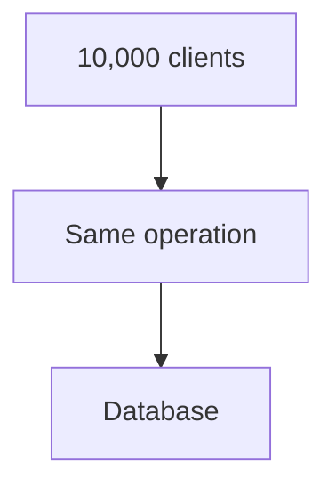

The database may normally handle:

```text
1,000 requests/sec
```

But the synchronized burst creates:

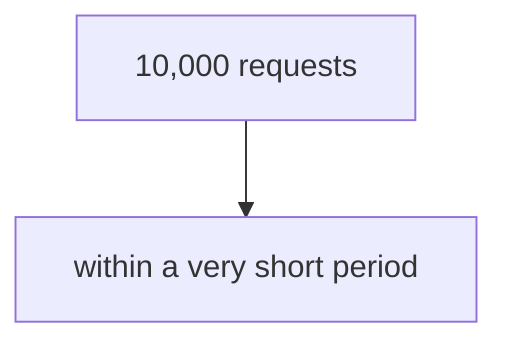

The database may become overloaded.

The important problem is not simply:

> "There are many requests."

It is:

> **"Many requests became active at nearly the same time and concentrated on the same work or dependency."**

---

# 2. Why Is It Called a "Herd"?

Imagine a large group of animals standing quietly.

Then something causes all of them to move simultaneously.

```text
Before

🐑 🐑 🐑 🐑 🐑
🐑 🐑 🐑 🐑 🐑

Trigger

After

🐑 →→→→→
🐑 →→→→→
🐑 →→→→→
🐑 →→→→→
🐑 →→→→→
```

The system equivalent is:

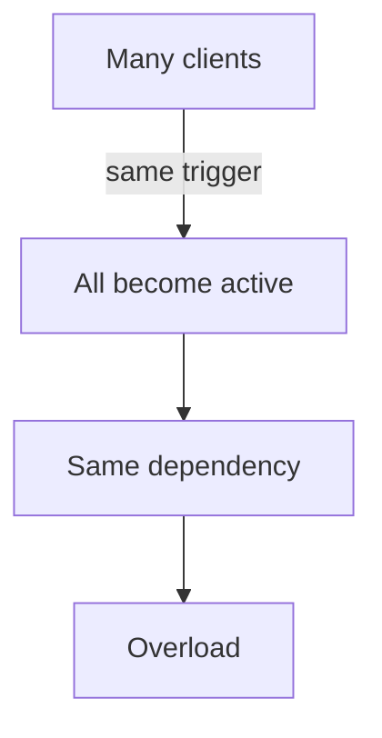

The trigger might be:

- Cache expiration.
- Retry timing.
- Scheduled job.
- Worker wake-up.
- Connection recovery.
- Service recovery.
- Token expiration.
- A popular event.
- A synchronized client request.

---

# 3. Thundering Herd vs Normal Traffic Spike

These are related but not identical.

### Normal traffic spike

```text
Traffic
  |
  |       /\
  |      /  \
  |_____/    \____
       Time
```

More users simply arrive.

### Thundering herd

```text
Traffic
  |
  |          |
  |          |
  |          |
  |__________|____
             Time
```

A large amount of work becomes synchronized around one moment or resource.

The distinction matters because the solutions can differ.

For a sustained traffic increase:

```text
Add capacity
Optimize
Scale
```

For synchronization:

```text
Desynchronize
Coalesce
Back off
Spread work
```

---

# 4. The Basic Thundering-Herd Pattern

The general pattern is:

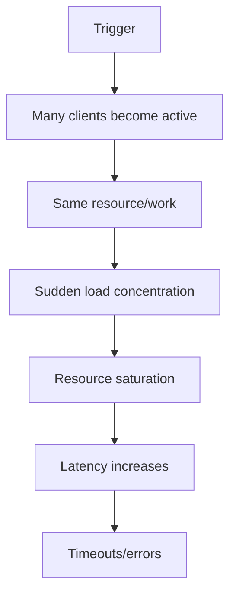

The final stages can create another wave:

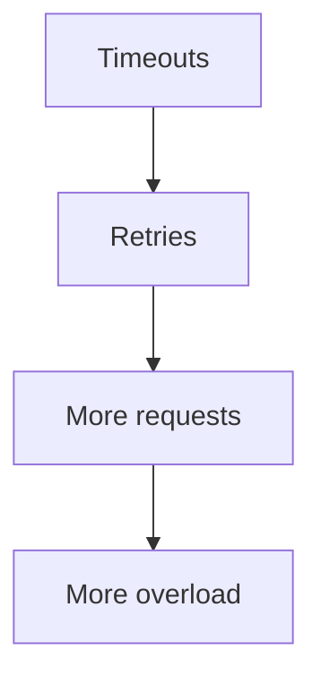

This is where a thundering herd can become a cascading failure.

---

# 5. Example — Cache Expiration

Suppose a popular product is cached:

```text
product:42
```

10,000 users request it.

While cached:

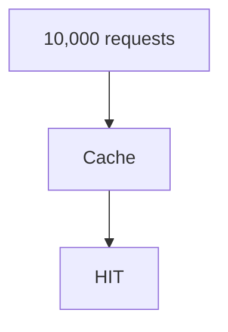

The database receives very little traffic.

Now the cache entry expires.

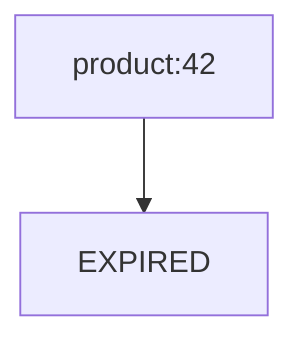

Thousands of requests may miss simultaneously:

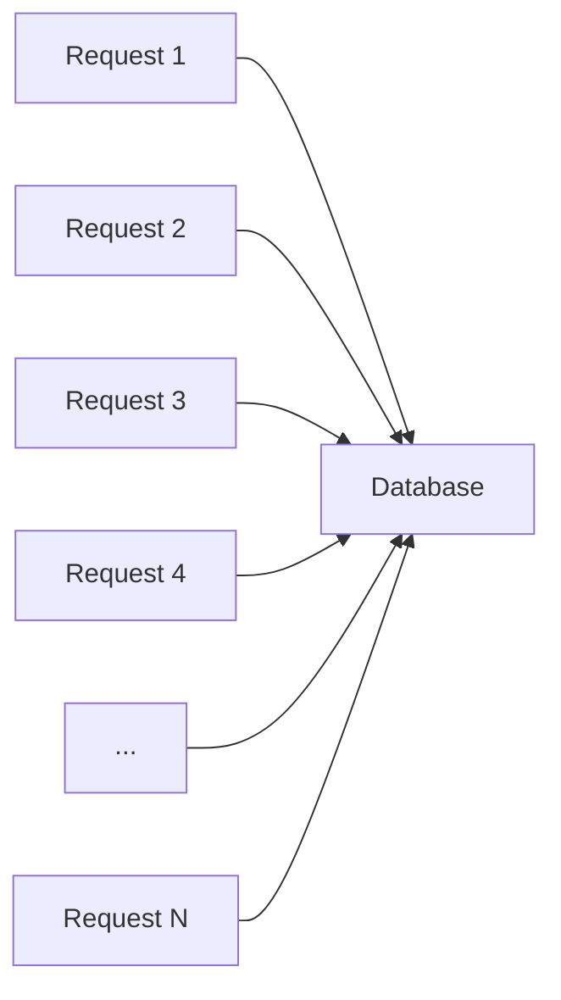

This is a classic cache-stampede situation and also a thundering-herd pattern.

---

# 6. Cache Stampede vs Thundering Herd

These concepts overlap, but they are not identical.

### Cache stampede

Usually refers specifically to:

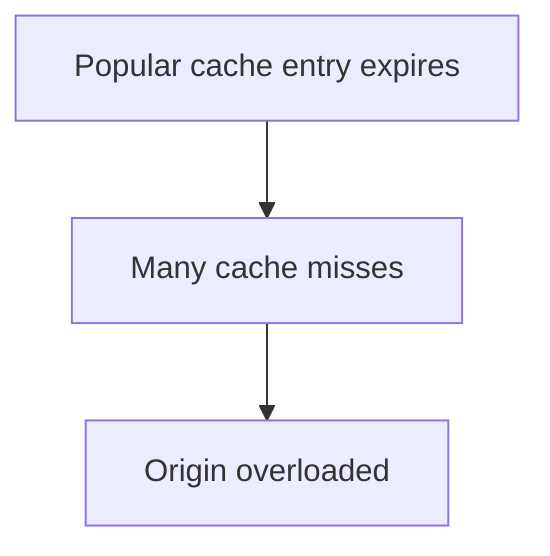

### Thundering herd

Is broader:

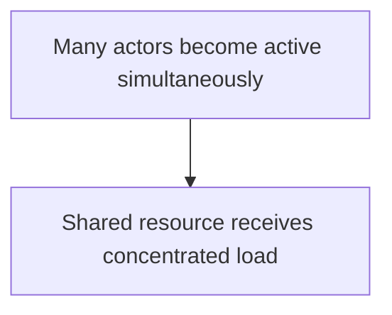

A cache stampede can therefore be a type of thundering herd.

Other thundering-herd situations do not involve caches.

---

# 7. Example — Synchronized Retries

Suppose 5,000 clients call an API.

The API temporarily fails.

All clients retry after exactly 5 seconds:

```text
Time 0s
Requests fail

        ↓

Wait exactly 5s

        ↓

Time 5s
5,000 retries
```

The system sees:

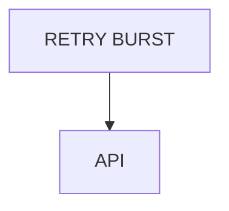

The original problem may have disappeared.

But the retry burst creates a new overload.

This is why **jitter** matters.

---

# 8. Jitter

Suppose every client uses:

```text
Retry after 5 seconds
```

They synchronize.

Instead, use:

```text
Retry after
4.3s
5.1s
4.7s
5.8s
4.5s
...
```

The requests become distributed over time.

```text
Without jitter:

||||||||||||||||||||

With jitter:

||  | ||   || |  | ||
```

Jitter does not reduce the total work by itself.

It reduces **synchronization**.

---

# 9. Example — Scheduled Jobs

Suppose 10,000 clients schedule a job at:

```text
09:00:00
```

At exactly 09:00:

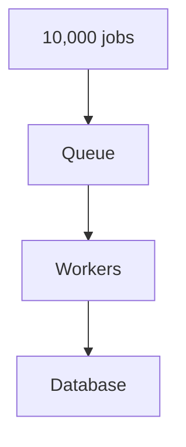

The system experiences a huge burst.

Instead, schedules can be distributed:

```text
08:59:52
09:00:04
09:00:11
09:00:18
09:00:27
...
```

This spreads the workload.

Again:

> **The goal is not necessarily to reduce work. It is to avoid unnecessary synchronization.**

---

# 10. Example — Worker Wake-Up

Suppose a system has 100 workers.

All workers are waiting for work.

A dependency becomes available.

All workers wake simultaneously:

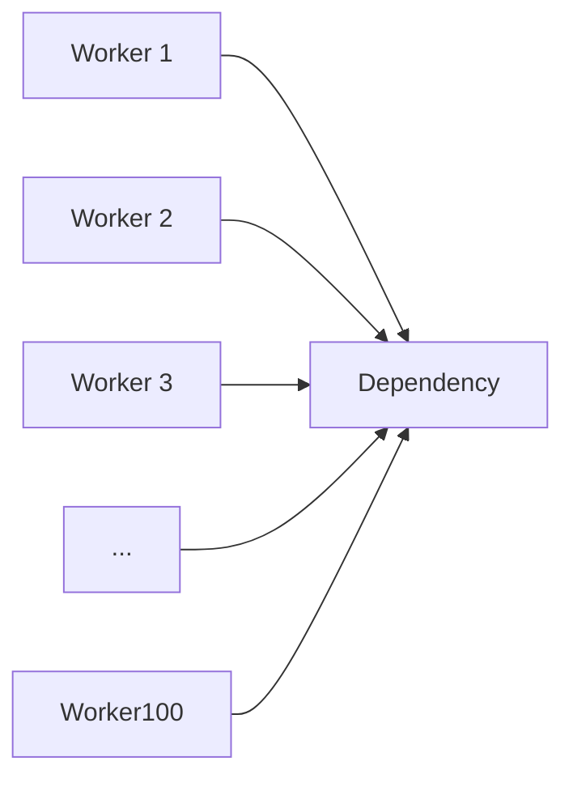

The dependency suddenly receives 100 requests.

This can happen when workers:

- Poll simultaneously.
- Reconnect simultaneously.
- Retry simultaneously.
- Receive a common trigger.
- Wake from a common schedule.

---

# 11. Example — Service Recovery

Suppose a database becomes unavailable.

Applications begin timing out.

The database recovers.

Thousands of waiting/retrying requests immediately attempt to reconnect:

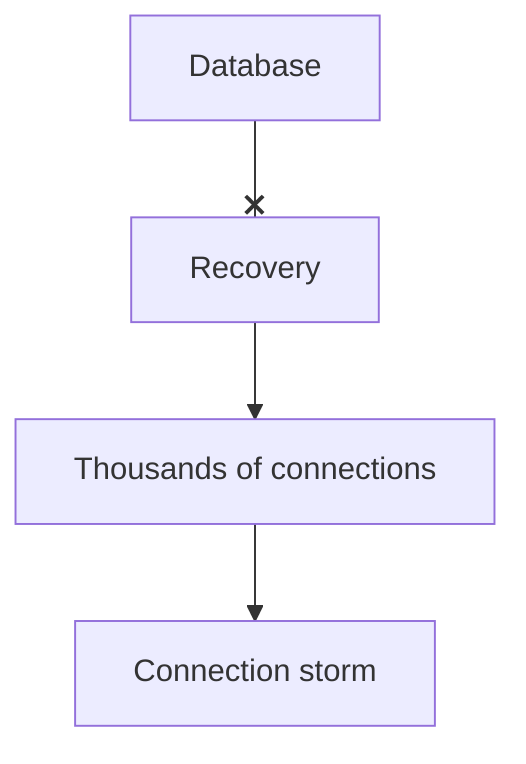

The database may fail again.

This creates:

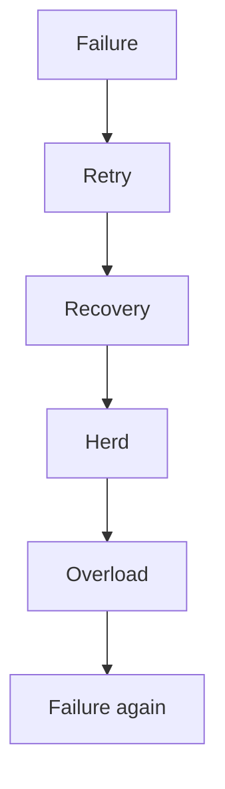

This is a **recovery storm**.

---

# 12. Example — Connection Storm

Suppose:

```text
1,000 application instances
```

restart after an infrastructure event.

Each instance immediately opens:

```text
20 database connections
```

Potential connection demand:

```text
1,000 × 20
= 20,000 connections
```

The database may not be able to accept that many simultaneously.

The application fleet itself has created a thundering herd.

This connects directly to:

- Connection limits.
- Connection pooling.
- Backpressure.
- Failure recovery.

---

# 13. Example — Hot Key

Suppose:

```text
product:popular-phone
```

receives 100,000 requests/sec.

Other products receive:

```text
100 requests/sec
```

The popular key becomes a concentration point.

```text
product:A → 100 req/s
product:B → 120 req/s
product:C → 90 req/s
product:X → 100,000 req/s
```

If the system treats all keys equally, the hot key can dominate a cache, database partition, or service.

A hot key can become part of a thundering-herd problem when many clients simultaneously request it after a failure or expiration.

---

# 14. Synchronization Is the Hidden Enemy

A useful way to think about thundering herd is:

```text
Many actors
     +
Same trigger
     +
Same timing
     +
Same resource
     =
Thundering Herd
```

The actors might be:

- Users.
- Application servers.
- Workers.
- Clients.
- Browsers.
- Scheduled jobs.
- Background processes.

The resource might be:

- Database.
- Cache.
- API.
- File.
- Storage system.
- Lock.
- Service endpoint.

---

# 15. Request Coalescing

One powerful strategy is **request coalescing**.

Suppose 1,000 requests need the same data.

Instead of:

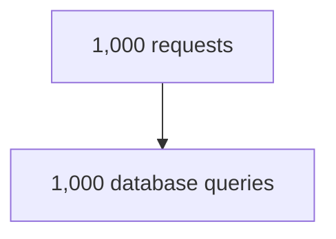

the system can perform:

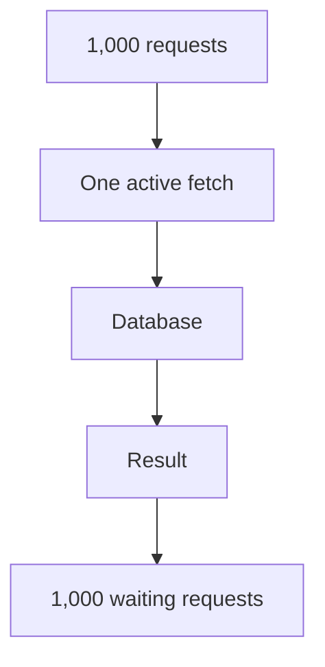

Conceptually:

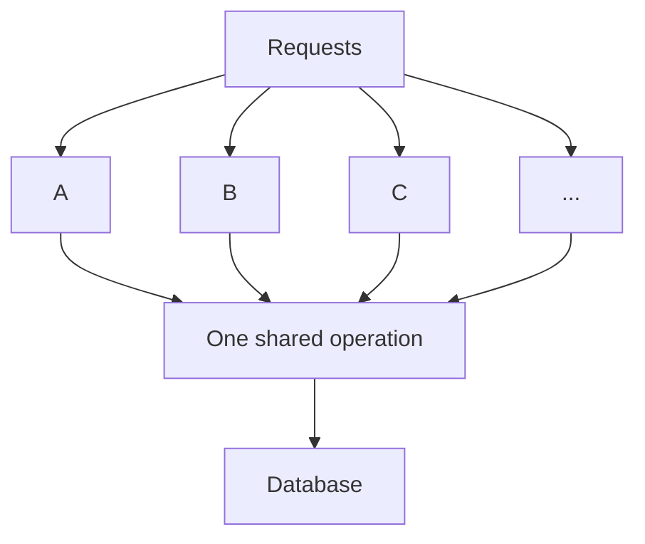

This is sometimes called **single-flight** behavior.

---

# 16. Jitter Is Useful Beyond Retries

Jitter can be applied to many scheduled actions:

```text
Retry delays
Cache TTLs
Health checks
Polling
Scheduled jobs
Connection reconnects
Background refreshes
```

The common principle is:

> **Avoid making large numbers of independent actors follow exactly the same schedule unless synchronization is intentional.**

---

# 17. Rate Limiting

Rate limiting can prevent too much work from entering a system at once.

For example:

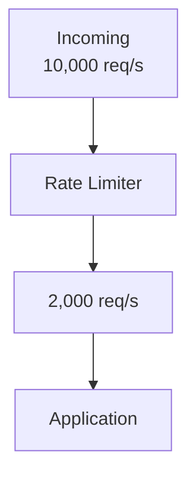

Some requests may be rejected or delayed.

Rate limiting protects the downstream system.

But rate limiting alone does not necessarily eliminate synchronization.

It controls **how much traffic enters**.

Jitter controls **when actors act**.

---

# 18. Load Shedding

Sometimes the system simply cannot process all incoming work.

Instead of allowing everything to overload the system:

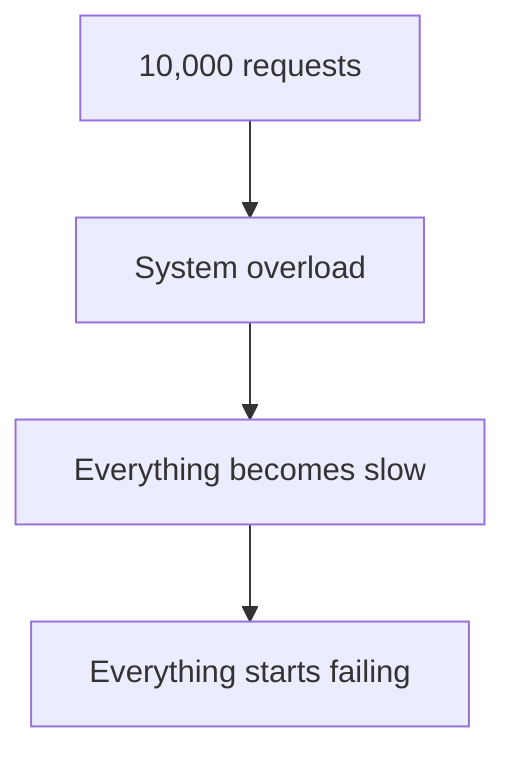

the system may intentionally reject some work:

```mermaid
flowchart TD
  accTitle: Load shedding
  accDescr: 10,000 requests reach load shedding: 2,000 accepted, 8,000 rejected.
  N0["10,000 requests"] --> N1["Load Shedding"] --> A["Accepted<br/>2,000"] & R["Rejected<br/>8,000"]
```

The remaining requests can receive useful service.

This is often better than allowing the entire system to collapse.

---

# 19. Queueing Can Spread Work

A queue can turn:

```text
Huge synchronous burst
```

into:

```mermaid
flowchart TD
  accTitle: Queue spreads work
  accDescr: Producer, then Queue, then Controlled workers, then Dependency.
  N0["Producer"] --> N1["Queue"] --> N2["Controlled workers"] --> N3["Dependency"]
```

For example:

```mermaid
flowchart TD
  accTitle: Image jobs
  accDescr: 10,000 image jobs, then Queue, then Worker pool, then Storage.
  N0["10,000 image jobs"] --> N1["Queue"] --> N2["Worker pool"] --> N3["Storage"]
```

Workers process jobs at a controlled rate.

But remember:

> **A queue absorbs a burst; it does not eliminate the work.**

If work arrives permanently faster than workers can process it:

```mermaid
flowchart TD
  accTitle: Permanent overload
  accDescr: Queue, then Backlog ↑, then Latency ↑.
  N0["Queue"] --> N1["Backlog ↑"] --> N2["Latency ↑"]
```

This connects directly to **05.14 — Backpressure**.

---

# 20. Thundering Herd and Backpressure

Suppose 10,000 requests arrive simultaneously.

Without protection:

```mermaid
flowchart TD
  accTitle: Without protection
  accDescr: 10,000 requests, then Database, then Overload.
  N0["10,000 requests"] --> N1["Database"] --> N2["Overload"]
```

With backpressure:

```mermaid
flowchart TD
  accTitle: With backpressure
  accDescr: 10,000 requests, then Admission / Queue, then Controlled processing, then Database.
  N0["10,000 requests"] --> N1["Admission / Queue"] --> N2["Controlled processing"] --> N3["Database"]
```

The system controls how much work reaches the constrained dependency.

The combination is powerful:

```text
Jitter
  +
Coalescing
  +
Backoff
  +
Rate Limiting
  +
Backpressure
```

But each addresses a different part of the problem.

---

# 21. Failure Domain Interaction

A thundering herd can cross failure domains.

Consider:

```mermaid
flowchart TD
  accTitle: Herd across failure domains
  accDescr: The cache fails (X); app servers send the load to the database.
  C["Cache"] --x A["App Servers"] --> D["Database"]
```

Cache failure causes:

```mermaid
flowchart TD
  accTitle: Blast radius expands
  accDescr: Cache misses, then Many app requests, then Database, then Database overload.
  N0["Cache misses"] --> N1["Many app requests"] --> N2["Database"] --> N3["Database overload"]
```

The original failure was:

```text
Cache
```

But the blast radius expands to:

```text
Database
```

This connects directly to **06.14 — Failure Domains**.

---

# 22. Thundering Herd and Health Checks

Suppose 10,000 application instances perform health checks every 10 seconds:

```text
10,000 × every 10 seconds
```

If all instances start at the same time:

```text
10s → 10,000 checks
20s → 10,000 checks
30s → 10,000 checks
```

The monitoring endpoint itself may receive synchronized traffic.

Jitter can distribute these checks:

```text
10.1s
10.7s
11.3s
11.8s
12.2s
...
```

This is a small example, but the same principle applies at large scale.

---

# 23. Thundering Herd and Locks

Suppose many requests want the same lock:

```mermaid
flowchart LR
  accTitle: Herd on a lock
  accDescr: Requests A to N all want the same lock.
  S0["Request A"] & S1["Request B"] & S2["Request C"] & S3["Request D"] & S4["..."] & S5["Request N"] --> T["Lock"]
```

If all requests repeatedly retry lock acquisition:

```mermaid
flowchart TD
  accTitle: Retrying the lock
  accDescr: Fail, then Retry, then Fail, then Retry.
  N0["Fail"] --> N1["Retry"] --> N2["Fail"] --> N3["Retry"]
```

the lock service itself can become overloaded.

A better design may use:

- Backoff.
- Jitter.
- Queueing.
- Request coalescing.
- Better lock granularity.
- Avoiding the lock entirely where possible.

---

# 24. Avoiding the Herd at the Source

The best solution is often to prevent synchronization before requests reach the dependency.

For example:

```mermaid
flowchart TD
  accTitle: Avoiding the herd at the source
  accDescr: Clients, then Jitter, then Rate Limit, then Coalescing, then Cache, then Application, then Queue, then Database.
  N0["Clients"] --> N1["Jitter"] --> N2["Rate Limit"] --> N3["Coalescing"] --> N4["Cache"] --> N5["Application"] --> N6["Queue"] --> N7["Database"]
```

Different layers can absorb different forms of pressure.

But do not add every mechanism automatically.

Each layer adds complexity.

---

# 25. A Practical Protection Stack

For a popular cache key:

```mermaid
flowchart TD
  accTitle: Protecting a popular cache key
  accDescr: Request to cache: a hit returns; a miss goes through single-flight to the database.
  R["Request"] --> C["Cache"]
  C -->|"HIT"| X["Return"]
  C -->|"MISS"| S["Single-Flight"] --> D["Database"]
```

For retries:

```mermaid
flowchart TD
  accTitle: For retries
  accDescr: Failure, then Exponential Backoff, then Jitter, then Retry Budget, then Retry.
  N0["Failure"] --> N1["Exponential Backoff"] --> N2["Jitter"] --> N3["Retry Budget"] --> N4["Retry"]
```

For background work:

```mermaid
flowchart TD
  accTitle: For background work
  accDescr: Burst, then Queue, then Controlled Workers, then Downstream.
  N0["Burst"] --> N1["Queue"] --> N2["Controlled Workers"] --> N3["Downstream"]
```

For overload:

```mermaid
flowchart TD
  accTitle: For overload
  accDescr: Excess Traffic, then Rate Limiting, then Load Shedding, then Protect Core System.
  N0["Excess Traffic"] --> N1["Rate Limiting"] --> N2["Load Shedding"] --> N3["Protect Core System"]
```

---

# 26. When Should You Worry About a Thundering Herd?

Look for these signals:

- Sudden traffic bursts after expiration.
- Retry traffic synchronized around fixed intervals.
- Large connection spikes after recovery.
- Many workers waking simultaneously.
- Scheduled jobs concentrated at one time.
- Sudden database query bursts after cache failure.
- Large numbers of identical queries.
- High request rates for one key.
- Queue consumers reconnecting simultaneously.
- Service recovery followed by immediate overload.

A useful observation is:

```mermaid
flowchart TD
  accTitle: The signal
  accDescr: Normal load, then Trigger, then Sudden synchronized spike.
  N0["Normal load"] --> N1["Trigger"] --> N2["Sudden synchronized spike"]
```

---

# 27. What Should You Measure?

Useful metrics include:

| Metric | Why It Matters |
|---|---|
| Request rate | Detect sudden bursts |
| Requests per key | Detect hot keys |
| Retry rate | Detect retry amplification |
| Retry timing | Detect synchronization |
| Cache miss rate | Detect cache-driven herd |
| Cache expiration rate | Detect synchronized expiry |
| Database query rate | Detect origin overload |
| Connection creation rate | Detect connection storms |
| Queue depth | Detect accumulated work |
| Worker wake-up rate | Detect worker synchronization |
| Error rate | Detect overload/failure |
| Latency | Detect resource saturation |
| Rejected requests | Detect load shedding/rate limits |

Do not look only at average traffic.

Look at **timing and concentration**.

---

# 28. Practical Investigation Workflow

When you suspect a thundering herd:

```mermaid
flowchart TD
  accTitle: Investigation workflow
  accDescr: Observe, then Find the sudden spike, then Identify what triggered it, then Check timing distribution, then Find the concentrated resource, then Check retries, then Check cache misses, then Check hot keys, then Check worker/client synchronization, then Check downstream capacity, then Contain the burst, then Desynchronize future work, then Measure again.
  N0["Observe"] --> N1["Find the sudden spike"] --> N2["Identify what triggered it"] --> N3["Check timing distribution"] --> N4["Find the concentrated resource"] --> N5["Check retries"] --> N6["Check cache misses"] --> N7["Check hot keys"] --> N8["Check worker/client synchronization"] --> N9["Check downstream capacity"] --> N10["Contain the burst"] --> N11["Desynchronize future work"] --> N12["Measure again"]
```

Ask:

> **What caused many independent actors to become active at the same time?**

That question often reveals the root cause.

---

# 29. Hands-On Exercise — Simulate a Thundering Herd

Create a simple simulation.

Assume:

```text
Clients = 1,000
Retry delay = 5 seconds
```

All clients fail at:

```text
12:00:00
```

### Step 1

Calculate when the retries occur.

Without jitter:

```text
12:00:05 → 1,000 retries
```

### Step 2

Change the retry policy to:

```text
5 seconds ± 2 seconds
```

Now requests may occur between:

```text
12:00:03
and
12:00:07
```

### Step 3

Compare:

```text
Without Jitter
----------------
12:00:05
████████████████████

With Jitter
----------------
12:00:03   ███
12:00:04   █████
12:00:05   ██████
12:00:06   ████
12:00:07   ██
```

The total number of retries may remain similar.

But the peak load is spread over time.

---

# 30. Lab Challenge — Cache Herd

Assume:

```text
1,000 users
```

request:

```text
product:42
```

The cache entry expires at exactly:

```text
10:00:00
```

### Question 1

What happens if all requests miss simultaneously?

### Question 2

What happens if every request independently queries the database?

### Question 3

How could request coalescing help?

### Question 4

How could TTL jitter help?

### Question 5

Would caching solve a hot **write** problem?

No.

Caching is primarily useful for reducing repeated reads. It does not automatically solve concentrated writes.

---

# 31. Lab Challenge — Recovery Herd

Assume:

```text
500 application instances
```

Each normally maintains:

```text
10 database connections
```

The database becomes unavailable.

After recovery, every instance immediately reconnects.

### Questions

1. How many connections could be attempted?
2. What happens if the database can safely accept only a fraction of them?
3. How could connection retry backoff help?
4. How could jitter help?
5. Should every application instance immediately create its maximum pool size?
6. What happens if connection retries continue while the database is already overloaded?

Think about:

```text
Connection Limits
+
Backoff
+
Jitter
+
Pool Sizing
+
Database Capacity
```

---

# 32. Thundering Herd Decision Framework

When you see a synchronized burst, ask:

### 1. What triggered it?

```text
Expiration?
Failure?
Recovery?
Schedule?
Retry?
Reconnect?
Event?
```

### 2. Who became active?

```text
Users?
Clients?
Workers?
Instances?
Jobs?
```

### 3. What became concentrated?

```text
Same key?
Same database?
Same API?
Same lock?
Same partition?
```

### 4. Can the work be spread?

Use:

```text
Jitter
Backoff
Scheduling
```

### 5. Can duplicate work be removed?

Use:

```text
Coalescing
Single-flight
Caching
```

### 6. Can downstream work be controlled?

Use:

```text
Queue
Backpressure
Rate limiting
```

### 7. Can some work be rejected?

Use:

```text
Load shedding
```

### 8. Can the system recover gradually?

Avoid:

```text
Failure → Recovery → Immediate full load
```

Prefer:

```mermaid
flowchart TD
  accTitle: Gradual recovery
  accDescr: Failure, then Recovery, then Controlled ramp-up, then Normal operation.
  N0["Failure"] --> N1["Recovery"] --> N2["Controlled ramp-up"] --> N3["Normal operation"]
```

---

# 33. Common Mistakes

### Mistake 1 — Treating every traffic spike as a capacity problem

A synchronized burst may be the real problem.

---

### Mistake 2 — Using fixed retry delays

```text
Retry after exactly 5 seconds
```

can synchronize thousands of clients.

Use appropriate backoff and jitter.

---

### Mistake 3 — Adding exponential backoff without jitter

Clients can still synchronize around the same backoff schedule.

---

### Mistake 4 — Assuming caching automatically prevents a herd

A cache can become the source of the herd when a popular entry expires.

---

### Mistake 5 — Sending every cache miss to the database

For hot keys, request coalescing can dramatically reduce duplicate work.

---

### Mistake 6 — Ignoring recovery storms

A recovered dependency can be overloaded by clients trying to reconnect simultaneously.

---

### Mistake 7 — Scaling workers without checking downstream capacity

```mermaid
flowchart TD
  accTitle: More workers, more load
  accDescr: Workers ↑, then Database requests ↑, then Database overload.
  N0["Workers ↑"] --> N1["Database requests ↑"] --> N2["Database overload"]
```

More workers are not always better.

---

### Mistake 8 — Assuming a queue eliminates the problem

A queue can absorb bursts, but an unbounded backlog creates latency and resource pressure.

---

### Mistake 9 — Ignoring hot keys

A single popular key can dominate an otherwise balanced system.

---

### Mistake 10 — Adding every protection mechanism

Jitter, queues, rate limits, coalescing, and load shedding all have costs.

Use the smallest set that solves the actual problem.

---

# 34. System Design View

The thundering-herd problem teaches an important distributed-systems lesson:

> **Synchronization can create load even when the total amount of work has not increased.**

Consider:

```text
1,000 requests
spread across 60 seconds
```

versus:

```text
1,000 requests
within 1 second
```

The total work is the same.

The system's instantaneous resource demand is very different.

Therefore:

```text
Total Work
     ≠
Instantaneous Load
```

This distinction is extremely important in system design.

---

# 35. Time Is a System Resource

We often think about:

```text
CPU
Memory
Storage
Network
```

But synchronized timing can also become a resource problem.

For example:

```text
1,000 operations/hour
```

could be harmless if evenly distributed.

But:

```text
1,000 operations
at exactly 09:00
```

could create a severe burst.

Therefore system designers should consider:

> **How is work distributed over time?**

Not only:

> **How much work exists?**

---

# 36. Thundering Herd and Capacity Planning

Capacity planning should consider:

```text
Average Load
Peak Load
Burst Load
Recovery Load
Retry Load
```

For example:

```text
Normal:
1,000 req/s

Peak:
3,000 req/s

Recovery:
8,000 req/s

Retry storm:
15,000 req/s
```

Designing only for:

```text
1,000 req/s
```

may not be sufficient.

But blindly designing for:

```text
15,000 req/s
```

may be unnecessarily expensive.

The better approach is to understand why each load level occurs and control preventable bursts.

---

# 37. Thundering Herd and Failure Recovery

A robust architecture considers the complete lifecycle:

```mermaid
flowchart TD
  accTitle: The complete lifecycle
  accDescr: Normal, then Failure, then Retry, then Recovery, then Traffic Surge, then Stabilization, then Normal.
  N0["Normal"] --> N1["Failure"] --> N2["Retry"] --> N3["Recovery"] --> N4["Traffic Surge"] --> N5["Stabilization"] --> N6["Normal"]
```

The system should remain stable throughout the entire cycle.

This connects several earlier concepts:

```mermaid
flowchart TD
  accTitle: Connected concepts
  accDescr: Timeouts, then Retries, then Jitter, then Backpressure, then Load Shedding, then Recovery.
  N0["Timeouts"] --> N1["Retries"] --> N2["Jitter"] --> N3["Backpressure"] --> N4["Load Shedding"] --> N5["Recovery"]
```

Distributed systems are not designed only for normal operation.

They are designed for **transitions between states**.

---

# 38. A Practical Mental Model

Remember:

```mermaid
flowchart TD
  accTitle: The herd cycle
  accDescr: TRIGGER, then SYNCHRONIZATION, then CONCENTRATION, then SATURATION, then FAILURE, then RETRY, then MORE SYNCHRONIZATION.
  N0["TRIGGER"] --> N1["SYNCHRONIZATION"] --> N2["CONCENTRATION"] --> N3["SATURATION"] --> N4["FAILURE"] --> N5["RETRY"] --> N6["MORE SYNCHRONIZATION"]
```

To break the cycle:

```text
DESYNCHRONIZE
       +
COALESCE
       +
BACKOFF
       +
CONTROL LOAD
       +
PROTECT DEPENDENCIES
```

---

# 39. Key Principle

> **A thundering herd occurs when many independent actors become active at nearly the same time and concentrate work on the same resource or dependency. The trigger may be cache expiration, retries, scheduled jobs, worker wake-ups, reconnects, or service recovery. The goal is not always to reduce total work; it is often to prevent unnecessary synchronization and control instantaneous load using jitter, backoff, request coalescing, queues, rate limiting, backpressure, and load shedding.**

---

# Quick Reference

### Basic Pattern

```mermaid
flowchart TD
  accTitle: Basic pattern
  accDescr: Trigger, then Many actors synchronize, then Same resource, then Load spike, then Saturation, then Failure.
  N0["Trigger"] --> N1["Many actors synchronize"] --> N2["Same resource"] --> N3["Load spike"] --> N4["Saturation"] --> N5["Failure"]
```

### Common Causes

| Cause | Result |
|---|---|
| Cache expiration | Many simultaneous cache misses |
| Fixed retry delay | Synchronized retry burst |
| Worker wake-up | Many workers hit dependency together |
| Scheduled jobs | Large workload at one timestamp |
| Service recovery | Clients reconnect simultaneously |
| Connection recovery | Connection storm |
| Hot key | Many requests concentrate on one resource |

### Main Defenses

| Technique | Main Purpose |
|---|---|
| Jitter | Break synchronization |
| Exponential Backoff | Reduce repeated retry pressure |
| Request Coalescing | Remove duplicate work |
| Single-Flight | One active fetch for shared work |
| Background Refresh | Refresh before mass expiration |
| TTL Jitter | Spread cache expiration |
| Queue | Absorb and control bursts |
| Rate Limiting | Control admission rate |
| Backpressure | Protect downstream capacity |
| Load Shedding | Reject excess work to preserve core service |

---

# Knowledge Check

1. What is a thundering herd?
2. How is a thundering herd different from a normal traffic spike?
3. Why can fixed retry delays create a herd?
4. What does jitter accomplish?
5. How can cache expiration create a thundering herd?
6. What is request coalescing?
7. Why can exponential backoff still synchronize clients?
8. How can a queue help with a herd?
9. Why can service recovery itself create a traffic spike?
10. Why doesn't adding more workers always solve a thundering-herd problem?
11. What is the difference between a cache stampede and the broader thundering-herd problem?
12. Why should failure recovery be treated as a workload event?

### Answers

1. A thundering herd occurs when many actors become active at nearly the same time and concentrate work on the same resource or dependency.
2. A normal spike may simply represent increased traffic; a herd specifically involves synchronization or concentrated workload.
3. If many clients fail at the same time and all wait exactly the same duration, they retry together.
4. Jitter adds timing variation so clients do not perform the same action simultaneously.
5. A popular entry can expire, causing many requests to miss the cache and query the origin at once.
6. Request coalescing combines multiple requests for the same work into one active operation whose result can be shared.
7. If every client follows the same exponential schedule, they can still retry at the same times.
8. A queue can absorb a burst and let workers process work at a controlled rate.
9. Clients that were waiting or retrying may all reconnect immediately when the dependency becomes available.
10. More workers can increase pressure on a constrained dependency instead of removing the bottleneck.
11. Cache stampede is a cache-specific form of concentrated requests after cache misses; thundering herd is the broader synchronization problem.
12. Recovery can trigger synchronized reconnects, retries, cache fills, or queued work, potentially creating a new overload.

---

# Remember

> **A system can have enough total capacity and still fail because too much work arrives at the same moment.**

When investigating a sudden overload, ask:

> **"Why did so many actors become active at the same time?"**

That question often reveals the thundering herd.

---

# Next Chapter

## 06.16 — Distributed System Trade-offs

The final chapter of Level 6 will bring the distributed-systems concepts together:

- Why distributed systems introduce trade-offs
- Scale vs complexity
- Consistency vs availability
- Latency vs coordination
- Strong vs eventual consistency
- Replication trade-offs
- Quorum trade-offs
- Leader-based vs leaderless designs
- Synchronous vs asynchronous communication
- Availability vs correctness
- Redundancy vs cost
- Multi-AZ vs multi-region
- Operational complexity
- Failure handling
- Distributed-system decision making
- Avoiding unnecessary distribution
- A practical distributed-system decision framework
- Hands-on architecture trade-off exercise
- System-design mental model
