# 06.16 — Distributed System Trade-offs

## Learning Objectives

By the end of this chapter, you will be able to:

- Explain why distributed systems always involve trade-offs.
- Understand the relationship between scale, latency, consistency, availability, and complexity.
- Compare synchronous and asynchronous communication.
- Evaluate replication, quorum, and consensus trade-offs.
- Understand when strong or eventual consistency is appropriate.
- Evaluate redundancy, multi-AZ, and multi-region designs.
- Recognize the operational cost of distributing a system.
- Avoid introducing distributed architecture before it is actually needed.
- Make architecture decisions based on requirements and constraints rather than technology popularity.

---

# Beginner Vocabulary

| Term | Beginner-Friendly Meaning |
|---|---|
| **Trade-off** | Gaining something while accepting a cost or limitation somewhere else. |
| **Distributed System** | Multiple independent computers or processes working together over a network. |
| **Consistency** | What different parts of a system are allowed to observe. |
| **Availability** | The ability of a system to successfully respond to requests. |
| **Latency** | Time required for an operation to complete. |
| **Coordination** | Getting multiple components to work together correctly. |
| **Replication** | Keeping multiple copies of data or state. |
| **Quorum** | Minimum participation required for an operation or decision. |
| **Consensus** | A protocol that allows distributed nodes to safely agree on decisions or state. |
| **Redundancy** | Additional components that can continue the work when another fails. |
| **Failure Domain** | Components that can fail together because they share a dependency or cause. |
| **Eventual Consistency** | A model where distributed copies may temporarily differ but can converge later. |
| **Strong Consistency** | A stronger guarantee that reads observe appropriately up-to-date state according to the chosen model. |
| **Partition** | A communication failure separating parts of a distributed system. |
| **Operational Complexity** | The additional work required to deploy, monitor, debug, recover, and maintain a system. |
| **Blast Radius** | The part of a system affected by a failure. |
| **Coordination Cost** | Latency, resource usage, and complexity required to make distributed components agree. |
| **Failure Isolation** | Limiting the effect of one failure so it does not spread through the system. |

---

# 1. What Is a Trade-off?

A trade-off exists when improving one property makes another property more difficult, expensive, or limited.

For example:

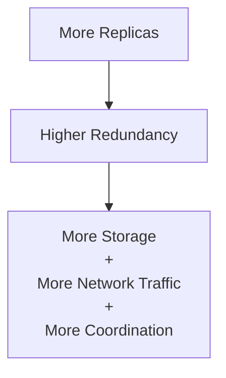

You gained resilience.

You also accepted additional cost and complexity.

This is the central idea of distributed-system design:

> **There is rarely a free improvement.**

---

# 2. Why Distributed Systems Have More Trade-offs

A single-machine application may look like:

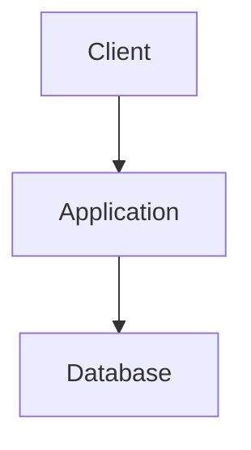

Communication inside one machine is relatively straightforward.

A distributed system may look like:

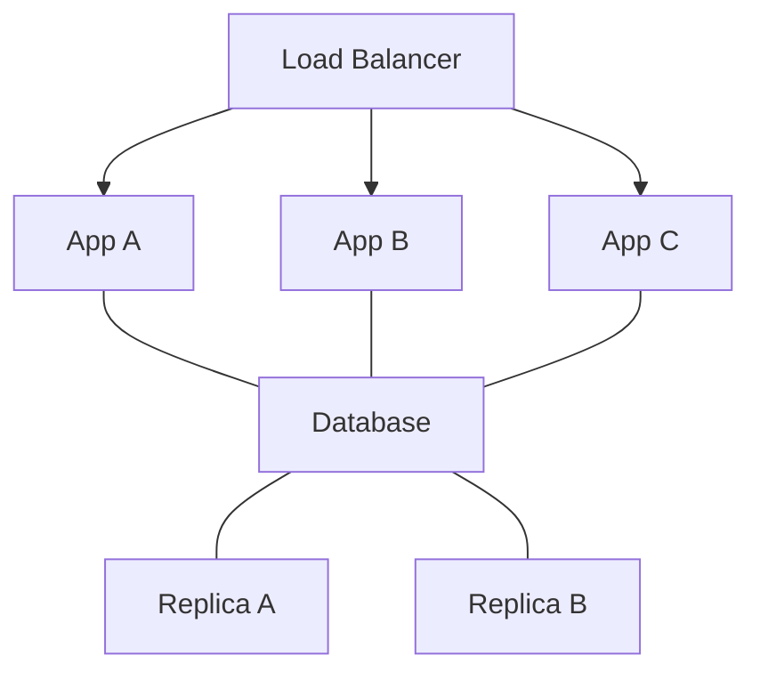

Now components communicate through a network.

The network introduces:

- Latency.
- Failure.
- Timeouts.
- Partial connectivity.
- Retries.
- Ordering problems.
- Duplicate operations.
- Coordination requirements.

Every additional distributed component creates more possible interactions.

---

# 3. The Core Distributed-System Equation

A useful mental model is:

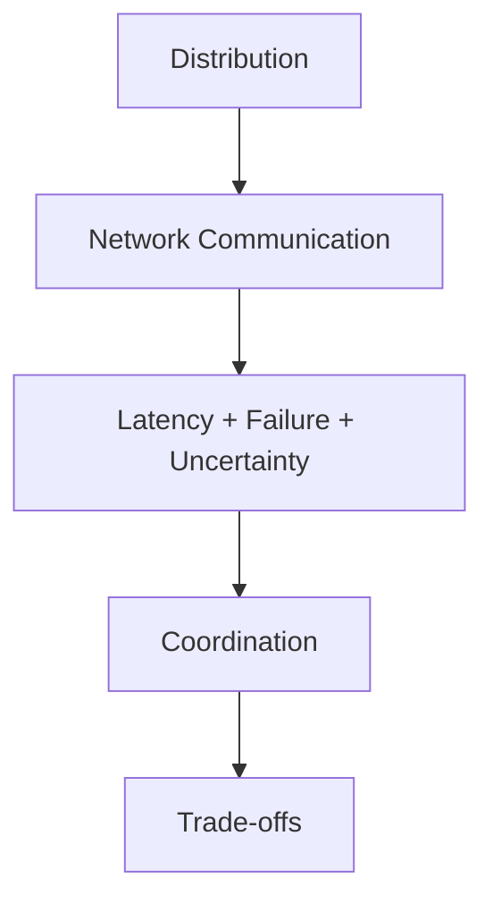

You cannot completely remove these properties.

You can only design around them.

---

# 4. Scale vs Complexity

One of the biggest reasons to distribute a system is scale.

For example:

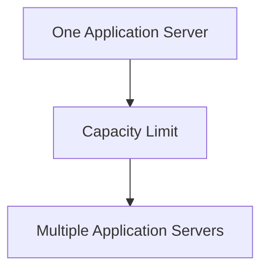

This can increase capacity.

But now you must consider:

```text
Load balancing
Shared state
Sessions
Caching
Database connections
Deployment
Monitoring
Failure handling
```

So:

```text
More Scale
   +
More Complexity
```

This is why horizontal scaling should not be treated as free.

---

# 5. Vertical Scaling vs Distribution

Suppose one database server can handle the current workload.

You could increase its resources:

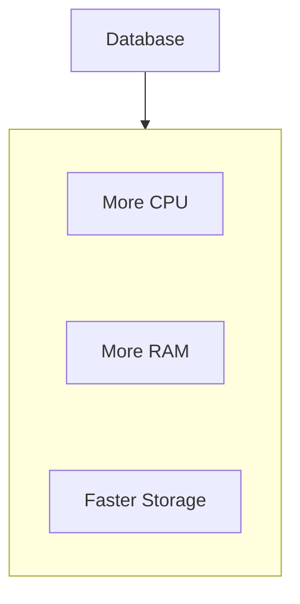

This is simpler than distributing the database.

But eventually the machine may reach practical limits.

Then:

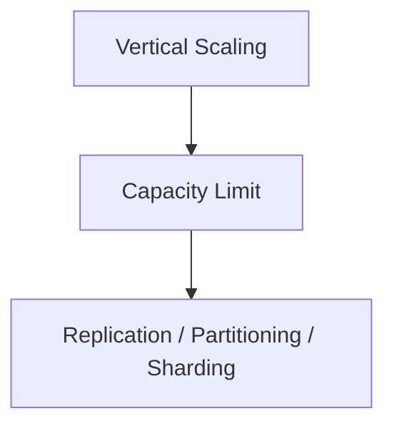

The system gains scalability at the cost of architectural complexity.

This is why:

> **Use the simplest architecture that can satisfy the current requirements and known growth constraints.**

---

# 6. Latency vs Coordination

Distributed components communicate over a network.

Suppose:

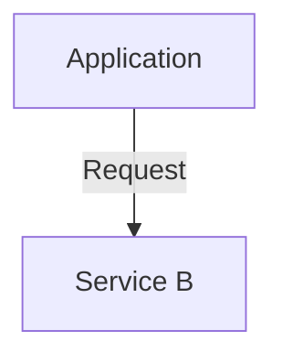

The network call adds latency.

Now suppose the operation requires three services:

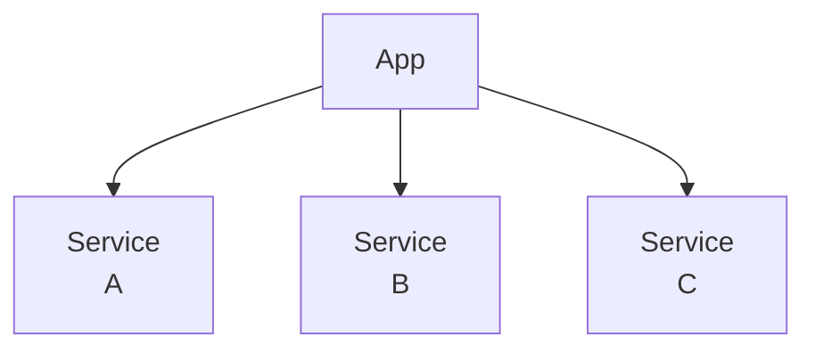

The application may have to wait for multiple operations.

Coordination can therefore increase latency.

This creates a trade-off:

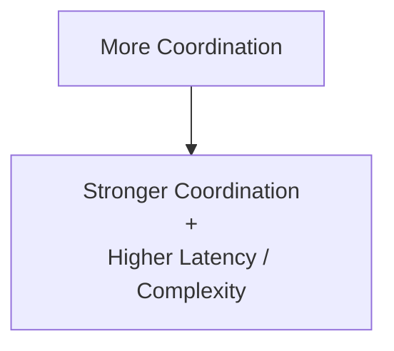

---

# 7. Synchronous vs Asynchronous Communication

### Synchronous

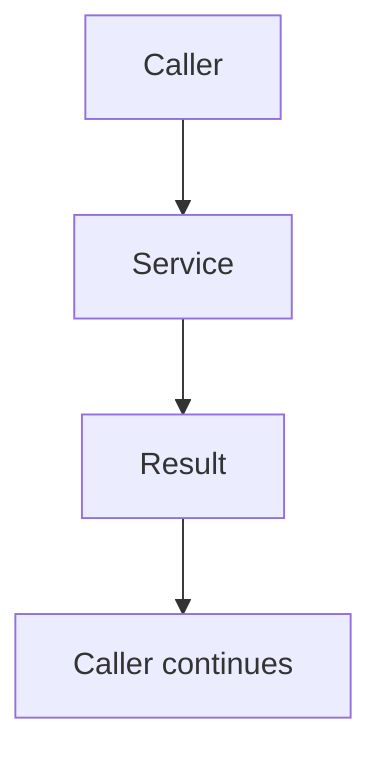

Advantages:

- Immediate result.
- Simpler request flow.
- Easier for operations requiring immediate confirmation.

Costs:

- Caller waits.
- Dependency latency affects request latency.
- Dependency failure can affect caller.

### Asynchronous

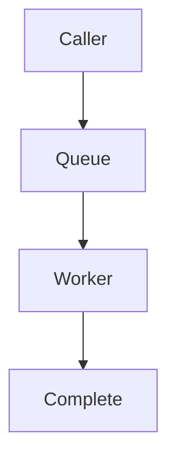

Advantages:

- Decouples timing.
- Absorbs bursts.
- Can isolate failures.
- Allows independent worker scaling.

Costs:

- Delayed completion.
- More complicated state.
- Retries.
- Duplicate processing.
- Ordering concerns.
- Monitoring/recovery requirements.

The choice is not:

> "Which is better?"

The question is:

> **"Does the caller need the work completed before it can safely continue?"**

---

# 8. Consistency vs Availability

Distributed systems often maintain multiple copies.

During normal operation:

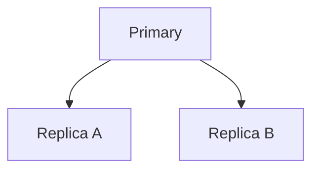

Now imagine a network partition:

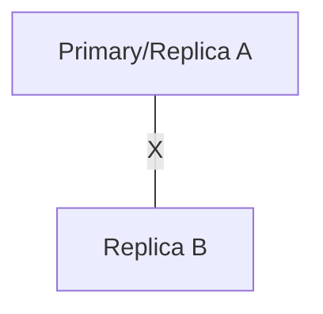

The system must decide what operations remain safe.

It may choose to:

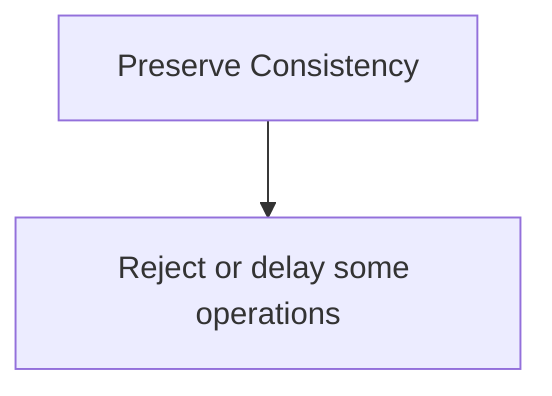

or:

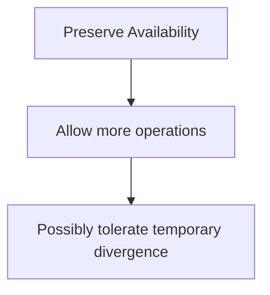

This is the practical CAP trade-off during a partition.

---

# 9. Strong Consistency vs Eventual Consistency

Suppose a user changes their profile name.

### Stronger consistency

The system ensures subsequent reads observe the required current state.

Advantages:

- Easier correctness reasoning.
- Better for critical state.

Costs may include:

- Coordination.
- Higher latency.
- Reduced availability under some failures.

### Eventual consistency

Different copies may temporarily disagree:

```text
Primary: "Ranjit"
Replica: "Old Name"
```

Later:

```text
Replica → "Ranjit"
```

Advantages:

- Can improve availability and scalability.
- Can reduce coordination.

Costs:

- Temporary stale reads.
- More complicated application behavior.
- Reconciliation requirements.

The correct choice depends on the business operation.

---

# 10. Not All Data Needs the Same Consistency

Consider an e-commerce system.

```text
Product description
```

A few seconds of staleness may be acceptable.

But:

```text
Available inventory
```

may require stronger guarantees.

And:

```text
Payment state
```

may require even stricter correctness.

Therefore:

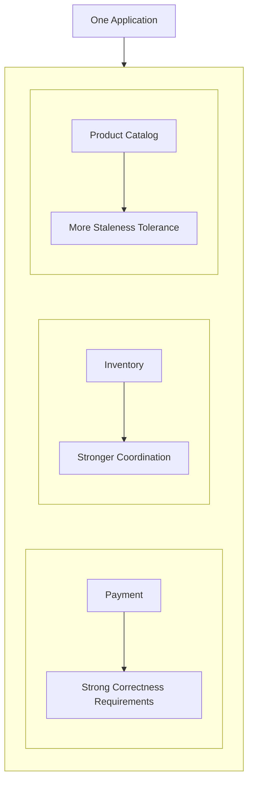

This is a critical architectural principle:

> **Consistency should be chosen per business requirement, not automatically applied at the strongest level everywhere.**

---

# 11. Replication vs Cost

Replication provides additional copies:

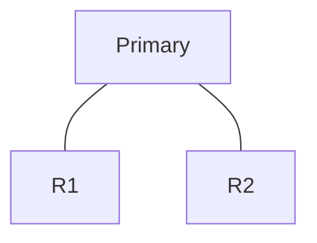

Benefits:

- Availability.
- Read capacity.
- Failover.
- Geographic access.

Costs:

- Storage.
- Network traffic.
- Replication lag.
- Monitoring.
- Recovery.
- Consistency complexity.

More replicas are not automatically better.

---

# 12. Replication vs Write Scaling

A common misconception is:

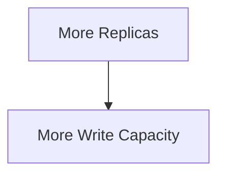

Usually:

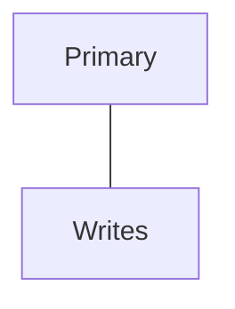

The primary can remain the write bottleneck.

Replicas primarily help with:

- Read scaling.
- Redundancy.
- Failover.
- Geographic reads.

If writes exceed the capacity of one authoritative node, other strategies may be required:

- Sharding.
- Partitioning.
- Different data models.
- Asynchronous processing.
- Workload redesign.

---

# 13. Quorum vs Availability

Suppose a system has five nodes:

```text
A B C D E
```

A majority requires:

```text
3 nodes
```

If two nodes fail:

```text
A B C ✓
D E ❌
```

the system can still achieve quorum.

If three fail:

```text
A B ❌
C D E ❌
```

depending on the protocol, quorum may be unavailable.

A larger quorum can provide stronger coordination but requires more participating nodes.

Therefore:

```mermaid
flowchart TD
  accTitle: Larger quorum
  accDescr: Larger Quorum, then More Coordination + Potentially Higher Latency + Lower Availability During Failures.
  N0["Larger Quorum"] --> N1["More Coordination<br/>+<br/>Potentially Higher Latency<br/>+<br/>Lower Availability During Failures"]
```

The exact guarantees depend on the system's protocol.

---

# 14. Quorum vs Latency

Suppose a write requires acknowledgements from multiple nodes.

```mermaid
flowchart TD
  accTitle: Waiting for acknowledgements
  accDescr: The client writes to the leader, which replicates to A, B and C.
  C["Client"] --> L["Leader"] --> A["A"] & B["B"] & X["C"]
```

If the operation waits for multiple nodes:

```text
Write latency
   ≈
slowest required participant
```

A slow node can increase latency.

Geographic distribution makes this more significant:

```mermaid
flowchart TD
  accTitle: Cross-region coordination
  accDescr: Region A talks to Region B over the network.
  N0["Region A"] -->|"Network"| N1["Region B"]
```

Cross-region coordination can be much slower than communication within one local infrastructure boundary.

---

# 15. Consensus vs Availability

Consensus systems generally require sufficient participating nodes to safely make progress.

Suppose:

```text
5 nodes
Majority = 3
```

During a partition:

```text
A B C | D E
```

The majority side can potentially continue.

The minority side may have to stop making authoritative progress.

This is a deliberate trade-off:

```text
Safety
   ↑
   |
   |     Consensus
   |
   +----------------→ Availability
```

Consensus is valuable when correctness of distributed decisions matters more than allowing every isolated node to continue operating.

---

# 16. Leader-Based vs Leaderless Systems

### Leader-based

```mermaid
flowchart TD
  accTitle: Leader-based
  accDescr: A leader with two followers.
  R["Leader"] --- K0["Follower"] & K1["Follower"]
```

Advantages:

- Clear write authority.
- Easier ordering.
- Easier conflict management.

Costs:

- Leader can become bottleneck.
- Leader failure requires election/failover.
- Geographic writes can be difficult.

### Leaderless

Responsibility is distributed.

Potential advantages:

- No single write leader.
- More flexible distribution.

Costs:

- More complex conflict handling.
- Quorum/read-repair/versioning mechanisms.
- More complicated consistency reasoning.

Neither model is universally better.

---

# 17. Redundancy vs Cost

Suppose:

```text
One instance
```

is cheap.

But it has limited resilience.

Adding another:

```text
Two instances
```

provides redundancy.

Adding more:

```text
Three instances
Five instances
Ten instances
```

may improve resilience and capacity.

But each additional instance costs:

- Compute.
- Storage.
- Network.
- Monitoring.
- Deployment effort.
- Operational attention.

Therefore:

> **Redundancy should be proportional to the failure you need to survive.**

---

# 18. Failure Domains vs Resilience

Three replicas in the same failure domain:

```mermaid
flowchart TD
  accTitle: One failure domain
  accDescr: AZ-A holds the primary, Replica A and Replica B.
  subgraph G["AZ-A"]
    direction TB
    I0["Primary"] ~~~ I1["Replica A"] ~~~ I2["Replica B"]
  end
```

may be less resilient to AZ failure than:

```text
AZ-A → Primary
AZ-B → Replica A
AZ-C → Replica B
```

The second design has greater failure-domain independence.

But it also introduces:

- Cross-AZ traffic.
- Additional latency.
- Additional cost.
- More complex failure handling.

Again:

```mermaid
flowchart TD
  accTitle: Resilience costs
  accDescr: More Resilience, then More Cost / Complexity.
  N0["More Resilience"] --> N1["More Cost / Complexity"]
```

---

# 19. Multi-AZ vs Multi-Region

### Multi-AZ

Useful for protecting against certain infrastructure-level failures.

```mermaid
flowchart TD
  accTitle: Multi-AZ
  accDescr: A region holds AZ-A, AZ-B and AZ-C.
  subgraph G["Region"]
    direction TB
    I0["AZ-A"] ~~~ I1["AZ-B"] ~~~ I2["AZ-C"]
  end
```

Usually offers a useful balance between:

- Resilience.
- Latency.
- Cost.
- Complexity.

### Multi-Region

Provides stronger geographic isolation.

```mermaid
flowchart TD
  accTitle: Multi-region
  accDescr: Region A replicates to Region B.
  N0["Region A"] ---|"Replication"| N1["Region B"]
```

But introduces:

- Greater network latency.
- Cross-region data movement.
- More complex consistency.
- More complicated failover.
- More expensive operations.

Therefore:

> **Multi-region should be a requirement-driven decision, not the default definition of a reliable system.**

---

# 20. Availability vs Cost

You can often increase availability by adding redundancy.

But achieving extremely high availability becomes progressively more expensive.

Conceptually:

```mermaid
flowchart TD
  accTitle: Availability steps
  accDescr: Basic Availability, then Redundant Instance, then Multi-Host, then Multi-AZ, then Multi-Region, then Very High Complexity.
  N0["Basic Availability"] --> N1["Redundant Instance"] --> N2["Multi-Host"] --> N3["Multi-AZ"] --> N4["Multi-Region"] --> N5["Very High Complexity"]
```

Each step addresses larger failure scenarios.

But each step also increases cost and operational burden.

The goal is not:

> "Maximum availability."

The goal is:

> **"The availability level required by the business at an acceptable cost."**

---

# 21. Operational Complexity Is a Real Cost

Architecture diagrams often show:

```text
Service A
Service B
Service C
Kafka
Redis
Database
CDN
Load Balancer
```

The diagram may look impressive.

But every component introduces operational responsibilities.

For example:

```text
Deploy
Monitor
Scale
Backup
Secure
Upgrade
Recover
Debug
Document
```

A component that provides little business value may not justify its operational cost.

This leads to an important principle:

> **Architecture is not only about runtime performance. It is also about the cost of operating the system.**

---

# 22. Distributed Debugging Is Harder

A single request may travel through:

```mermaid
flowchart TD
  accTitle: One request path
  accDescr: Client, then Load Balancer, then App A, then Cache, then Database, then Queue, then Worker, then External API.
  N0["Client"] --> N1["Load Balancer"] --> N2["App A"] --> N3["Cache"] --> N4["Database"] --> N5["Queue"] --> N6["Worker"] --> N7["External API"]
```

If the request is slow, the problem could be anywhere.

You need:

- Logs.
- Metrics.
- Traces.
- Correlation IDs.
- Dependency visibility.
- Timing information.

More distributed components therefore increase observability requirements.

---

# 23. Distributed Systems Increase Failure Combinations

Suppose one component has two states:

```text
Healthy
Failed
```

With one component:

```text
2 states
```

With several interacting components, possible combinations grow rapidly.

For example:

```text
App ✓
DB ✓

App ❌
DB ✓

App ✓
DB ❌

App ❌
DB ❌
```

Add:

```text
Cache
Queue
Network
Replica
```

and the number of possible system states grows considerably.

This is one reason distributed systems are difficult to test exhaustively.

---

# 24. Simplicity vs Resilience

A simple system:

```mermaid
flowchart TD
  accTitle: A simple system
  accDescr: Client, then Application, then Database.
  N0["Client"] --> N1["Application"] --> N2["Database"]
```

may be easier to:

- Understand.
- Deploy.
- Monitor.
- Debug.
- Recover.

A more distributed system:

```mermaid
flowchart TD
  accTitle: A more distributed system
  accDescr: Client, then CDN, then Load Balancer, then App Cluster, then Cache, then Database Cluster, then Queue, then Workers, then External Services.
  N0["Client"] --> N1["CDN"] --> N2["Load Balancer"] --> N3["App Cluster"] --> N4["Cache"] --> N5["Database Cluster"] --> N6["Queue"] --> N7["Workers"] --> N8["External Services"]
```

may provide:

- Higher scale.
- Better resilience.
- Better isolation.
- Better asynchronous processing.

But it also requires much more operational knowledge.

Therefore:

> **Complexity is justified when it solves a real constraint.**

---

# 25. Avoid Distribution for Its Own Sake

A common architectural mistake is:

```mermaid
flowchart TD
  accTitle: Distribution for its own sake
  accDescr: "We are building a serious application.", then "Let's use microservices.", then "Let's add Kafka.", then "Let's add Redis.", then "Let's use multi-region.".
  N0["#quot;We are building a serious application.#quot;"] --> N1["#quot;Let's use microservices.#quot;"] --> N2["#quot;Let's add Kafka.#quot;"] --> N3["#quot;Let's add Redis.#quot;"] --> N4["#quot;Let's use multi-region.#quot;"]
```

without first identifying a problem.

A better sequence is:

```mermaid
flowchart TD
  accTitle: A better sequence
  accDescr: Requirement, then Constraint, then Bottleneck, then Simplest solution, then Measure, then New constraint, then Evolve.
  N0["Requirement"] --> N1["Constraint"] --> N2["Bottleneck"] --> N3["Simplest solution"] --> N4["Measure"] --> N5["New constraint"] --> N6["Evolve"]
```

This is the core philosophy of Systemly.

---

# 26. The Architecture Evolution Principle

A system can evolve gradually:

```mermaid
flowchart TD
  accTitle: Stage 1
  accDescr: Stage 1: Client, then App, then Database.
  subgraph S["Stage 1"]
    direction TB
    N0["Client"] --> N1["App"] --> N2["Database"]
  end
```

Then:

```mermaid
flowchart TD
  accTitle: Stage 2
  accDescr: Stage 2: Client, then Load Balancer, then App A/B, then Database.
  subgraph S["Stage 2"]
    direction TB
    N0["Client"] --> N1["Load Balancer"] --> N2["App A/B"] --> N3["Database"]
  end
```

Then:

```mermaid
flowchart TD
  accTitle: Stage 3
  accDescr: Stage 3: Client, then Load Balancer, then App A/B/C, then Cache, then Database + Replicas.
  subgraph S["Stage 3"]
    direction TB
    N0["Client"] --> N1["Load Balancer"] --> N2["App A/B/C"] --> N3["Cache"] --> N4["Database + Replicas"]
  end
```

Then:

```mermaid
flowchart TD
  accTitle: Stage 4
  accDescr: Stage 4: Client, then Load Balancer, then App Cluster, then Cache, then Database Cluster, then Queue, then Workers.
  subgraph S["Stage 4"]
    direction TB
    N0["Client"] --> N1["Load Balancer"] --> N2["App Cluster"] --> N3["Cache"] --> N4["Database Cluster"] --> N5["Queue"] --> N6["Workers"]
  end
```

Each change should respond to a real constraint.

---

# 27. Trade-Off: Cache vs Database Consistency

Caching provides:

```text
Lower Latency
+
Lower Database Load
```

But introduces:

```text
Stale Data
+
Invalidation Complexity
```

Therefore:

```mermaid
flowchart TD
  accTitle: Cache trade-off
  accDescr: Cache: performance up, database load down, freshness complexity up.
  H["Cache"] --> G
  subgraph G[" "]
    direction TB
    I0["Performance ↑"] ~~~ I1["Database Load ↓"] ~~~ I2["Freshness Complexity ↑"]
  end
```

The correct decision depends on whether stale data is acceptable.

---

# 28. Trade-Off: Synchronous Replication vs Asynchronous Replication

### Synchronous

```mermaid
flowchart TD
  accTitle: Synchronous replication
  accDescr: Write, then Primary, then Replica confirms, then Success.
  N0["Write"] --> N1["Primary"] --> N2["Replica confirms"] --> N3["Success"]
```

Potential benefit:

- Stronger durability/coordination depending on implementation.

Cost:

- Write latency depends on required replicas.
- Availability can decrease when replicas are unreachable.

### Asynchronous

```mermaid
flowchart TD
  accTitle: Asynchronous replication
  accDescr: Write, then Primary, then Success, then Replica catches up.
  N0["Write"] --> N1["Primary"] --> N2["Success"] --> N3["Replica catches up"]
```

Potential benefit:

- Lower write latency.
- More availability during some failures.

Cost:

- Replication lag.
- Possible stale reads.
- More recovery considerations.

---

# 29. Trade-Off: Global Distribution vs Locality

Putting users and infrastructure close together reduces network latency.

For example:

```mermaid
flowchart TD
  accTitle: Locality
  accDescr: User, then Nearby Region.
  N0["User"] --> N1["Nearby Region"]
```

But globally distributed systems introduce:

```text
Cross-region replication
Data consistency
Routing
Failover
Conflict resolution
```

Therefore:

```mermaid
flowchart TD
  accTitle: Global distribution
  accDescr: Geographic Reach ↑, then Latency to users ↓ + Distributed Complexity ↑.
  N0["Geographic Reach ↑"] --> N1["Latency to users ↓<br/>+<br/>Distributed Complexity ↑"]
```

---

# 30. Trade-Off: Strong Coordination vs Independent Progress

Suppose two services need to agree before continuing.

```mermaid
flowchart TD
  accTitle: Agreeing before continuing
  accDescr: Service A calls Service B and Service C.
  R["Service A"] --> K0["Service B"] & K1["Service C"]
```

Strong coordination can provide correctness.

But if B or C is unavailable:

```mermaid
flowchart TD
  accTitle: A dependency is down
  accDescr: A, then B ❌.
  N0["A"] --> N1["B ❌"]
```

A may have to wait or fail.

Less coordination can allow independent progress, but may require:

- Eventual consistency.
- Reconciliation.
- Compensation.
- Idempotency.
- Conflict resolution.

This is one of the deepest distributed-system trade-offs.

---

# 31. Trade-Off: Automation vs Control

Automated systems can:

- Detect failure.
- Promote replicas.
- Scale workers.
- Route traffic.
- Retry operations.

Automation reduces manual work.

But automation can also amplify a bad decision.

For example:

```mermaid
flowchart TD
  accTitle: Automation amplifies a bad deployment
  accDescr: Bad deployment, then Auto-scaling, then More broken instances.
  N0["Bad deployment"] --> N1["Auto-scaling"] --> N2["More broken instances"]
```

or:

```mermaid
flowchart TD
  accTitle: Automation amplifies a failure
  accDescr: Dependency failure, then Automatic retries, then Retry storm.
  N0["Dependency failure"] --> N1["Automatic retries"] --> N2["Retry storm"]
```

Therefore:

> **Automation should be designed with safety limits, not simply maximized.**

---

# 32. Trade-Off: More Capacity vs Downstream Protection

Suppose a queue has:

```text
10 workers
```

and the database can handle their workload.

Increasing to:

```text
100 workers
```

may increase throughput.

But if the database cannot handle 100 concurrent workers:

```mermaid
flowchart TD
  accTitle: More workers, more load
  accDescr: Workers ↑, then DB load ↑, then DB saturation, then Errors, then Retries, then More DB load.
  N0["Workers ↑"] --> N1["DB load ↑"] --> N2["DB saturation"] --> N3["Errors"] --> N4["Retries"] --> N5["More DB load"]
```

Capacity must therefore be considered across the dependency chain.

> **A component cannot safely scale independently of its constrained downstream dependencies.**

---

# 33. Trade-Off: Reliability vs Recovery Complexity

Adding replicas can improve availability.

But now recovery may involve:

```text
Promotion
Routing
State synchronization
Stale node fencing
Client reconnection
Cache refresh
Connection pool changes
```

So:

```text
Reliability ↑
      +
Recovery Complexity ↑
```

A system is not truly resilient if nobody knows how to recover it.

---

# 34. Design for Failure, Not Just Redundancy

A weak design says:

> "We have three replicas."

A stronger design asks:

```text
What happens if one fails?

What happens if two fail?

What happens if the network partitions?

What happens if the leader disappears?

What happens if the surviving nodes disagree?

What happens when the failed node returns?

How does it catch up?

How do clients find the correct authority?
```

This is the difference between:

```text
Redundancy
```

and:

```text
Fault-Tolerant Design
```

---

# 35. A Unified Distributed-System Trade-Off Map

Many concepts from this level can be connected:

```mermaid
flowchart TD
  accTitle: A unified distributed-system trade-off map
  accDescr: Distribution splits into scale (horizontal scale, sharding, partitioning) and resilience (replication, failure domains, failover); both lead to coordination (quorum, consensus), then consistency: strong (more coordination, higher cost) or eventual (more independence, staleness).
  D["DISTRIBUTION"] --- S["SCALE"] & R["RESILIENCE"]
  S --- SL["Horizontal Scale<br/>Sharding<br/>Partitioning"]
  R --- RL["Replication<br/>Failure Domains<br/>Failover"]
  SL & RL --- C["COORDINATION"]
  C --- Q["Quorum"] & K["Consensus"]
  Q & K --- CS["CONSISTENCY"]
  CS --- ST["Strong"] & EV["Eventual"]
  ST --- STL["More Coordination<br/>Higher Cost"]
  EV --- EVL["More Independence<br/>Staleness"]
```

And across all of them:

```text
Latency
Cost
Complexity
Failure Handling
Operational Burden
```

---

# 36. A Practical Architecture Decision Framework

When choosing a distributed architecture, ask these questions in order.

### 1. What problem are we solving?

```text
Scale?
Availability?
Latency?
Geographic reach?
Failure isolation?
```

### 2. What is the actual constraint?

```text
CPU?
Database?
Network?
Storage?
Concurrency?
Dependency?
```

### 3. Can a simpler solution solve it?

Consider:

```text
Optimization
Indexing
Caching
Vertical scaling
Read replicas
Partitioning
```

before introducing significantly more distribution.

### 4. What consistency does the business require?

```text
Strong?
Read-after-write?
Eventual?
Causal?
```

### 5. What failure must we survive?

```text
Process?
Host?
AZ?
Region?
Dependency?
```

### 6. What coordination is required?

```text
None?
Leader?
Quorum?
Consensus?
```

### 7. What happens during a partition?

```text
Reject?
Delay?
Continue?
Reconcile later?
```

### 8. What happens during recovery?

```text
Catch up?
Replay?
Reconcile?
Rebuild?
Promote?
```

### 9. How will we observe it?

```text
Logs
Metrics
Traces
Alerts
Correlation IDs
```

### 10. Can the team operate it?

This final question is often ignored.

---

# 37. Hands-On Exercise — Choose the Architecture

Consider an e-commerce application.

## Scenario 1

Current system:

```mermaid
flowchart TD
  accTitle: Current system
  accDescr: Users, then Application, then PostgreSQL.
  N0["Users"] --> N1["Application"] --> N2["PostgreSQL"]
```

Current workload:

```text
100 requests/sec
```

The application is slow.

Investigation shows:

```text
Database queries are poorly indexed.
```

### Question 1

Should you immediately add:

- Redis?
- Read replicas?
- Sharding?
- Kafka?
- Multi-region?

Or should you first optimize the database queries?

---

## Scenario 2

Traffic grows to:

```text
5,000 requests/sec
```

The application layer becomes CPU-bound.

The database still has sufficient capacity.

### Question 2

What is the simplest likely architectural improvement?

---

## Scenario 3

Reads now dominate:

```text
90% reads
10% writes
```

The primary database is struggling with reads.

### Question 3

What architecture could help?

---

## Scenario 4

One database node can no longer provide enough storage and workload capacity even after optimization, caching, and read scaling.

### Question 4

What larger architectural technique might now become justified?

---

## Scenario 5

The business requires:

> "The system must continue serving customers if one availability zone becomes unavailable."

### Question 5

What should you evaluate?

---

# 38. Exercise Answers

### Scenario 1

Optimize the queries and indexes first.

The bottleneck is known.

Adding infrastructure without fixing the inefficient workload may simply make the system more complicated without solving the root cause.

---

### Scenario 2

Horizontal application scaling:

```mermaid
flowchart TD
  accTitle: Horizontal application scaling
  accDescr: A load balancer in front of three app instances.
  R["Load Balancer"] --- K0["App"] & K1["App"] & K2["App"]
```

if the application can scale safely.

---

### Scenario 3

Read replicas may help:

```mermaid
flowchart TD
  accTitle: Read replicas
  accDescr: A primary with Replica A and Replica B.
  R["Primary"] --- K0["Replica A"] & K1["Replica B"]
```

with appropriate read routing and consistency handling.

---

### Scenario 4

Sharding may become justified if the workload genuinely exceeds the practical capacity of one database node and simpler techniques are insufficient.

---

### Scenario 5

Evaluate:

- Application placement across AZs.
- Database redundancy across AZs.
- Load-balancer behavior.
- Quorum/failover.
- Shared dependencies.
- Connection routing.
- Recovery procedures.
- Failure-domain independence.

Do not simply deploy more instances in one AZ.

---

# 39. Lab Challenge — Explain the Trade-Off

Compare these two architectures.

### Architecture A

```mermaid
flowchart TD
  accTitle: Architecture A
  accDescr: Client, then App, then Database.
  N0["Client"] --> N1["App"] --> N2["Database"]
```

### Architecture B

```mermaid
flowchart TD
  accTitle: Architecture B
  accDescr: Client, then Load Balancer, then App A/B/C, then Redis, then Database Primary, then Replicas, then Queue, then Workers.
  N0["Client"] --> N1["Load Balancer"] --> N2["App A/B/C"] --> N3["Redis"] --> N4["Database Primary"] --> N5["Replicas"] --> N6["Queue"] --> N7["Workers"]
```

For Architecture B, identify:

### Benefits

- What constraints can it solve?
- What failures can it isolate?
- Where can it improve performance?

### Costs

- What new components exist?
- What new failure modes exist?
- Where does consistency become harder?
- What needs monitoring?
- What requires operational expertise?

The goal is not to decide that B is "better."

The goal is to determine:

> **Which architecture is appropriate for the actual requirements?**

---

# 40. The Most Important Distributed-System Question

When designing a system, do not begin with:

> "Should we use Kafka?"

or:

> "Should we use microservices?"

or:

> "Should we use Kubernetes?"

Start with:

> **"What problem are we trying to solve?"**

Then:

```mermaid
flowchart TD
  accTitle: Start with the problem
  accDescr: Problem, then Constraint, then Trade-off, then Architecture, then Technology.
  N0["Problem"] --> N1["Constraint"] --> N2["Trade-off"] --> N3["Architecture"] --> N4["Technology"]
```

Not:

```mermaid
flowchart TD
  accTitle: Not technology first
  accDescr: Technology, then Architecture, then Find a problem.
  N0["Technology"] --> N1["Architecture"] --> N2["Find a problem"]
```

---

# 41. Common Mistakes

### Mistake 1 — Assuming distributed means better

Distribution solves specific problems while introducing new ones.

### Mistake 2 — Maximizing availability without considering cost

Extreme redundancy can be unnecessarily expensive.

### Mistake 3 — Using strong consistency everywhere

Some workloads can safely tolerate eventual consistency.

### Mistake 4 — Using eventual consistency for critical state

Payment, inventory, and security-sensitive operations may require stronger guarantees.

### Mistake 5 — Adding replicas to solve write bottlenecks

Replicas generally improve reads, not authoritative write capacity.

### Mistake 6 — Adding workers without checking downstream capacity

More workers can overload databases and APIs.

### Mistake 7 — Assuming quorum equals consensus

Quorum is a participation rule; consensus is a distributed agreement protocol.

### Mistake 8 — Assuming replication means backup

Replicated mistakes can propagate to every replica.

### Mistake 9 — Ignoring failure domains

Multiple copies in the same failure domain may fail together.

### Mistake 10 — Ignoring operational complexity

Every component must eventually be deployed, monitored, debugged, secured, upgraded, and recovered.

### Mistake 11 — Designing for theoretical scale instead of current constraints

Do not build a million-user architecture for a system currently serving hundreds of users without a real requirement.

### Mistake 12 — Treating architecture as permanent

Good architectures evolve as constraints change.

---

# 42. System Design Mental Model

The entire Level 6 can be summarized as:

```mermaid
flowchart TD
  accTitle: Level 6 in one chain
  accDescr: Multiple Nodes, then Network Communication, then Latency + Partial Failure, then Distributed State, then Replication / Coordination, then Consistency Decisions, then Failure Handling, then Trade-offs.
  N0["Multiple Nodes"] --> N1["Network Communication"] --> N2["Latency + Partial Failure"] --> N3["Distributed State"] --> N4["Replication / Coordination"] --> N5["Consistency Decisions"] --> N6["Failure Handling"] --> N7["Trade-offs"]
```

And the design loop is:

```mermaid
flowchart TD
  accTitle: The design loop
  accDescr: Understand, then Measure, then Identify Constraint, then Choose Smallest Useful Change, then Understand New Trade-offs, then Implement, then Observe, then Recover, then Evolve.
  N0["Understand"] --> N1["Measure"] --> N2["Identify Constraint"] --> N3["Choose Smallest Useful Change"] --> N4["Understand New Trade-offs"] --> N5["Implement"] --> N6["Observe"] --> N7["Recover"] --> N8["Evolve"]
```

---

# 43. The Distributed-System Decision Matrix

| Requirement | Possible Direction | Main Cost |
|---|---|---|
| More application capacity | Horizontal scaling | Routing/state management |
| More read capacity | Read replicas/cache | Stale reads |
| More write/data capacity | Sharding | Routing/cross-shard complexity |
| Better failure resilience | Replication/redundancy | Cost/coordination |
| Strong distributed authority | Consensus/quorum | Latency/availability trade-offs |
| Burst absorption | Queue | Backlog/delayed completion |
| Temporary staleness acceptable | Eventual consistency | Application complexity |
| Lower user latency globally | Multi-region/CDN | Distribution/consistency complexity |
| Protect dependency | Rate limiting/backpressure | Rejected/delayed work |
| Prevent duplicate work | Coalescing/single-flight | Coordination |
| Survive AZ failure | Multi-AZ | Cost/network complexity |
| Survive regional failure | Multi-region | Significant operational complexity |

---

# 44. The Core Trade-Off

There is no universally "best" distributed architecture.

There is only an architecture that is appropriate for:

```text
Requirements
+
Workload
+
Failure assumptions
+
Consistency needs
+
Latency targets
+
Budget
+
Operational capability
```

Two systems solving different problems can legitimately choose very different architectures.

---

# 45. Level 6 Summary

The concepts connect:

```mermaid
flowchart TD
  accTitle: How the concepts connect
  accDescr: Distributed System, then Distributed State, then Replication, then Consistency, then Coordination, then Quorum / Consensus, then Failure Handling, then Resilience, then Trade-offs.
  N0["Distributed System"] --> N1["Distributed State"] --> N2["Replication"] --> N3["Consistency"] --> N4["Coordination"] --> N5["Quorum / Consensus"] --> N6["Failure Handling"] --> N7["Resilience"] --> N8["Trade-offs"]
```

The final lesson is not a technology.

It is a way of thinking.

---

# 46. Key Principle

> **Distributed systems are powerful because they allow a system to scale, survive failures, reduce latency, distribute state, and continue operating across multiple machines or locations. But every distributed capability introduces trade-offs in coordination, consistency, latency, cost, failure handling, and operational complexity. Good system design does not maximize distribution; it introduces the minimum amount of distributed complexity required to satisfy real requirements and evolves the architecture as constraints change.**

---

# Quick Reference

### The Core Questions

```text
1. What problem are we solving?

2. What is the bottleneck?

3. What consistency is required?

4. What failure must we survive?

5. What coordination is necessary?

6. What happens during a partition?

7. What happens during recovery?

8. What does the solution cost?

9. Can the team operate it?

10. Can the architecture evolve?
```

### The Architecture Principle

```mermaid
flowchart TD
  accTitle: The architecture principle
  accDescr: Requirement, then Constraint, then Bottleneck, then Trade-off, then Smallest Useful Architecture, then Measure, then Evolve.
  N0["Requirement"] --> N1["Constraint"] --> N2["Bottleneck"] --> N3["Trade-off"] --> N4["Smallest Useful Architecture"] --> N5["Measure"] --> N6["Evolve"]
```

### Remember

```mermaid
flowchart TD
  accTitle: More distribution
  accDescr: More Distribution, then More Capability + More Coordination + More Failure Modes + More Operational Complexity.
  N0["More Distribution"] --> N1["More Capability<br/>+<br/>More Coordination<br/>+<br/>More Failure Modes<br/>+<br/>More Operational Complexity"]
```

---

# Knowledge Check

1. Why do distributed systems introduce more trade-offs than single-machine systems?
2. Why doesn't adding replicas automatically increase write capacity?
3. What is the trade-off between synchronous and asynchronous communication?
4. Why can strong consistency increase latency or reduce availability?
5. Why might eventual consistency be appropriate for a social feed?
6. Why does quorum size affect availability and latency?
7. Why is replica placement important?
8. Why can adding more workers make a database problem worse?
9. Why is operational complexity an architectural cost?
10. Why should failure recovery be considered during architecture design?
11. Why should multi-region architecture not be the default for every application?
12. What question should you ask before choosing a technology such as Kafka, Redis, or Kubernetes?
13. Why is "more distributed" not automatically "better"?
14. What is the Systemly architecture decision sequence?

### Answers

1. Network communication introduces latency, failures, partial connectivity, coordination, and uncertainty between components.
2. Replicas generally copy authoritative writes; they primarily provide read capacity, redundancy, and failover rather than independent write authority.
3. Synchronous communication provides immediate coordination but makes the caller wait; asynchronous communication decouples timing but introduces delayed completion, retries, ordering, and recovery complexity.
4. Stronger consistency often requires additional coordination, which can increase latency and may prevent progress when required nodes are unavailable.
5. A social feed can often tolerate temporarily stale data, allowing better availability and scalability.
6. Larger quorum requirements generally require more participants, which can increase coordination latency and reduce the ability to operate during failures.
7. Replicas in the same failure domain can fail together, reducing the resilience provided by replication.
8. More workers can generate more simultaneous requests against the already-constrained database.
9. Every additional component must be deployed, monitored, secured, upgraded, debugged, and recovered.
10. A system can be operationally resilient only if it can safely return to a correct state after failure.
11. Multi-region introduces significant cost, latency, replication, consistency, routing, and recovery complexity and should be justified by actual requirements.
12. Ask: **"What problem are we trying to solve?"**
13. Distribution solves specific constraints but introduces network, coordination, consistency, failure, and operational costs.
14. **Requirement → Constraint → Bottleneck → Trade-off → Smallest Useful Architecture → Measure → Evolve.**

---

# Remember

> **Do not ask, "What is the most advanced architecture?"**

Ask:

> **"What is the simplest architecture that satisfies the requirements, and what constraint would force us to evolve it?"**

That question captures the core philosophy of system design.

---

# Level 6 Complete

You have now completed:

```text
LEVEL 6 — DISTRIBUTED SYSTEMS

06.01 What Makes a System Distributed?
06.02 Distributed State
06.03 Partial Failure
06.04 Network Partitions
06.05 Replication
06.06 Quorum
06.07 Leader & Follower
06.08 Leader Election
06.09 Distributed Locks
06.10 Consensus
06.11 Consistency Models
06.12 Eventual Consistency
06.13 Split Brain
06.14 Failure Domains
06.15 Thundering Herd
06.16 Distributed System Trade-offs
```

The next curriculum level is:

```text
LEVEL 7 — SERVICE ARCHITECTURE
```

Beginning with:

## 07.01 — Monolith

The chapter will introduce the architectural starting point for many applications before moving into modular monoliths, service-oriented architecture, microservices, service boundaries, and distributed service communication.
