# 07.01 — Monolith

## Learning Objectives

By the end of this chapter, you will be able to:

- Explain what a monolithic application is.
- Understand how code, business logic, and deployment are organized in a monolith.
- Distinguish a simple monolith from a well-structured modular monolith.
- Understand the advantages and limitations of monolithic architecture.
- Identify when a monolith is a good architectural choice.
- Recognize the signals that a monolith is becoming a constraint.
- Understand how a monolith can evolve toward more distributed architectures.
- Avoid confusing "monolith" with "bad architecture."

---

# Beginner Vocabulary

| Term | Beginner-Friendly Meaning |
|---|---|
| **Monolith** | An application where major application functionality is built and deployed as one unit. |
| **Module** | A logically organized part of an application responsible for a particular area of functionality. |
| **Deployment Unit** | The unit that is released and deployed together. |
| **Codebase** | The collection of source code that makes up the application. |
| **Coupling** | How strongly one part of a system depends on another part. |
| **Cohesion** | How closely related the responsibilities inside a module are. |
| **Boundary** | A defined separation between responsibilities or parts of a system. |
| **Dependency** | Something one component needs in order to work. |
| **Modular Monolith** | A monolith whose internal functionality is deliberately separated into well-defined modules. |
| **Service** | A separately deployable application component responsible for a particular capability. |
| **Deployment** | Releasing and running a particular version of an application. |
| **Scaling** | Increasing resources or instances to handle more workload. |
| **Blast Radius** | The part of a system affected when something fails or changes. |
| **Refactoring** | Changing internal code structure without intentionally changing its external behavior. |
| **Distributed System** | Multiple independent processes or machines communicating over a network. |

---

# 1. What Is a Monolith?

A **monolithic application** is an application where its major functionality is built and deployed as a single application unit.

A simple example:

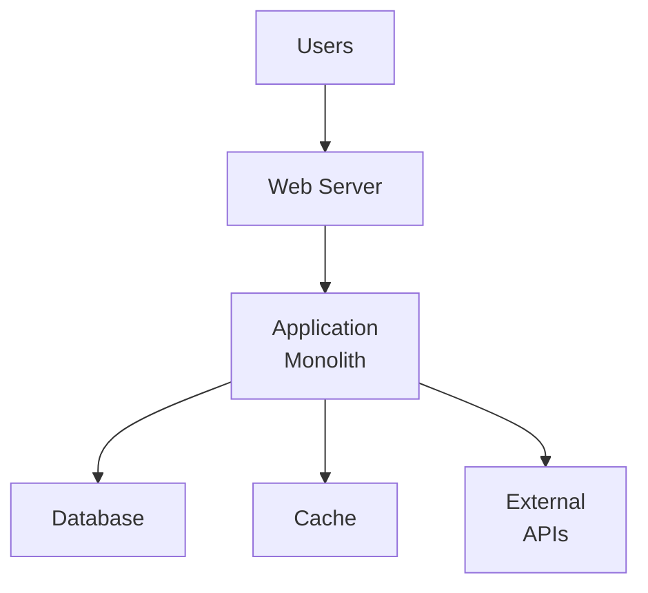

The application may contain:

- Authentication.
- User management.
- Products.
- Orders.
- Payments.
- Notifications.
- Administration.

All of these capabilities can exist inside the same application.

The important characteristic is:

> **The application is primarily developed, deployed, and operated as one application unit.**

A monolith is therefore an architectural structure, not a judgment about quality.

---

# 2. A Simple Example

Imagine an e-commerce application.

Its codebase might look like:

```text
ecommerce/
│
├── auth/
├── users/
├── products/
├── cart/
├── orders/
├── payments/
├── notifications/
└── admin/
```

These are separate areas of functionality.

But they may all be deployed together:

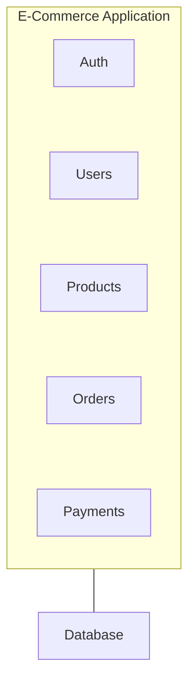

This can still be a monolith.

The presence of multiple modules does not automatically make an application a microservice architecture.

---

# 3. Monolith Does Not Mean "One File"

A common beginner misconception is:

> "A monolith means the entire application is one huge file."

That is incorrect.

A monolith can have hundreds or thousands of files.

For example:

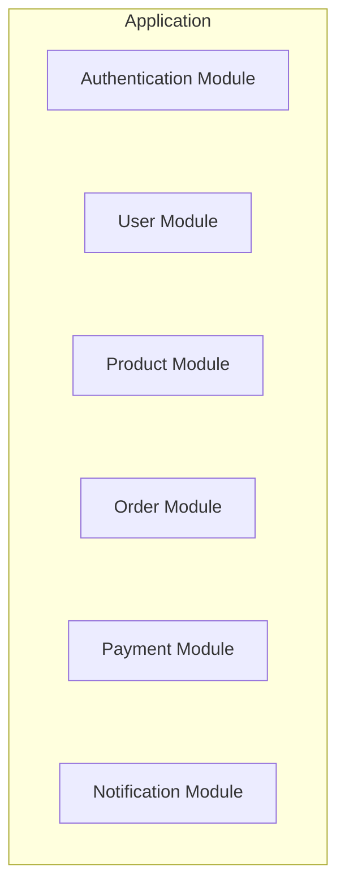

The important question is not:

> "How many files are there?"

It is:

> **"How is the application deployed and how are its major components separated?"**

---

# 4. The Basic Monolithic Architecture

A typical web application might look like:

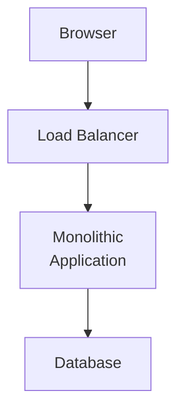

The monolith may internally contain:

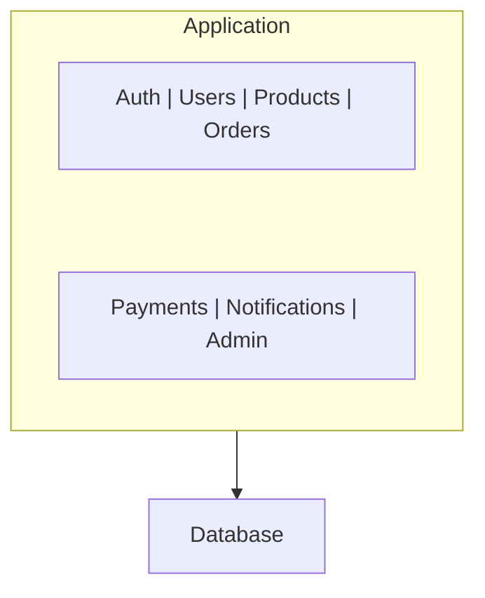

All of those capabilities belong to the same deployable application.

---

# 5. How a Request Travels Through a Monolith

Suppose a user places an order.

```http
POST /api/orders
```

The request may flow through:

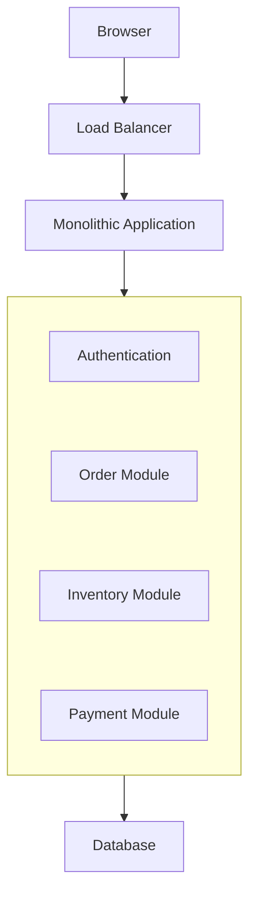

The important point is that these modules communicate **inside the application process** or through local application mechanisms rather than requiring network calls between separately deployed services.

For example:

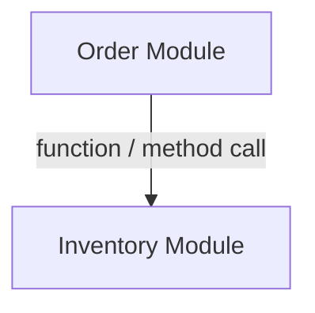

instead of:

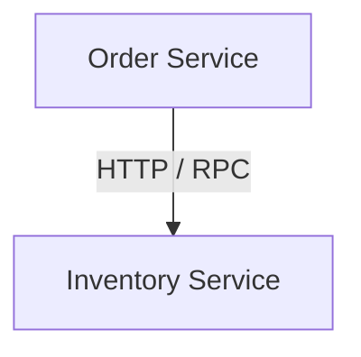

This difference becomes extremely important later when comparing monoliths with microservices.

---

# 6. Monolith vs Distributed Services

### Monolith

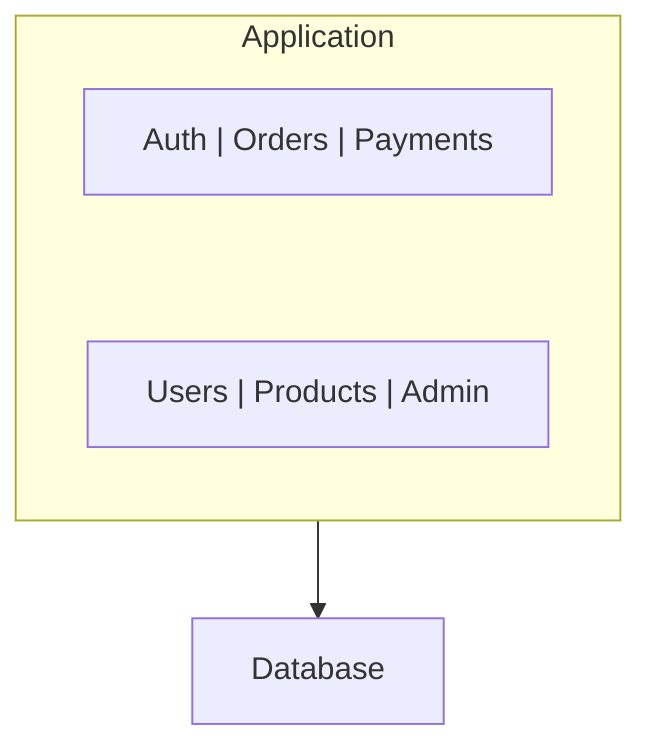

### Distributed services

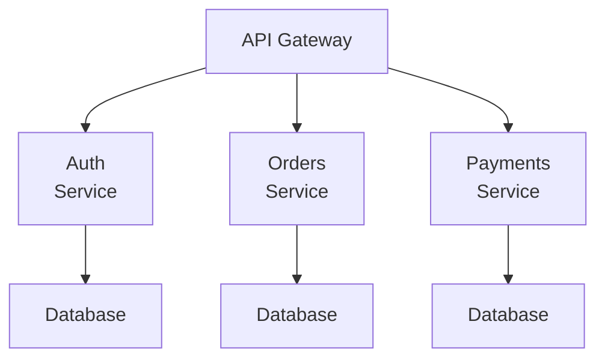

In the distributed version:

- Services communicate over networks.
- Services can be deployed independently.
- Failures can be isolated differently.
- Each service can potentially scale independently.

But the system also inherits distributed-system problems.

For example:

- Network latency.
- Timeouts.
- Retries.
- Partial failures.
- Distributed tracing.
- Service discovery.
- Data consistency.
- Deployment coordination.

This connects directly to **Level 6 — Distributed Systems**.

---

# 7. Why Start With a Monolith?

A monolith is often a good starting architecture because it keeps many things simple.

Consider a new application:

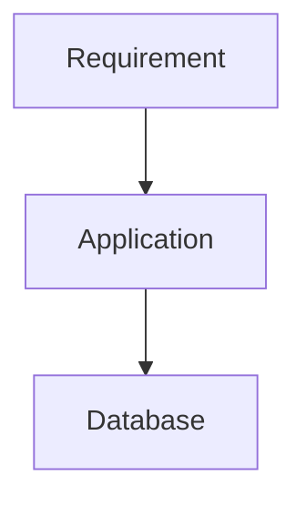

You may not yet know:

- Which features will become heavily used.
- Which modules need independent scaling.
- Which teams will own which areas.
- Which data should be separated.
- Which services need independent deployment.
- Which components will actually become bottlenecks.

Starting with many services forces you to make these decisions early.

A monolith lets you learn about the actual workload first.

> **When the requirements are uncertain, simplicity can be an advantage.**

---

# 8. Monolith Advantages

## 8.1 Simpler Development

Developers work within one application.

They can usually:

- Navigate one codebase.
- Run one application locally.
- Debug one process.
- Test complete workflows more easily.

---

## 8.2 Simpler Deployment

A monolith might be deployed as:

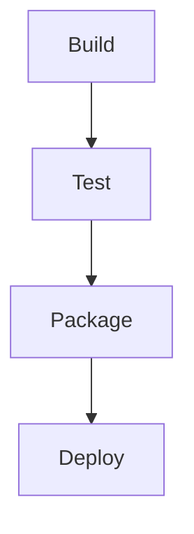

There is one main application deployment unit.

With many services:

```text
Build Service A
Build Service B
Build Service C
Deploy A
Deploy B
Deploy C
Coordinate versions
```

The deployment system becomes more complex.

---

## 8.3 Easier Local Development

A beginner or small team may be able to run:

```text
Application
    +
Database
```

locally.

A microservice system might require:

```text
API Gateway
Auth Service
Order Service
Payment Service
Queue
Redis
Several Databases
Observability Stack
```

before one complete workflow can be tested.

That difference has a significant effect on development speed.

---

# 9. Easier Transactions

Suppose an order operation needs to update several pieces of relational data:

```text
Create Order
     +
Reduce Inventory
     +
Create Payment Record
```

Within a suitable monolithic architecture, these operations may be coordinated using a database transaction.

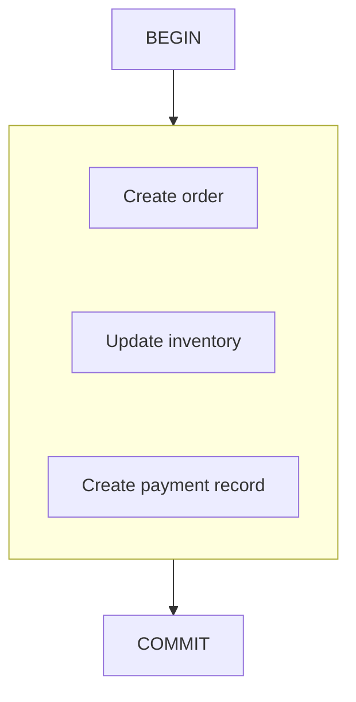

This can be considerably simpler than coordinating state across multiple independently deployed services.

Once data is distributed across service-owned databases, distributed transaction and consistency problems become much harder.

This is one reason:

> **Keeping tightly coupled business operations together can be valuable.**

---

# 10. Easier Debugging

Consider:

```text
POST /orders
```

In a monolith:

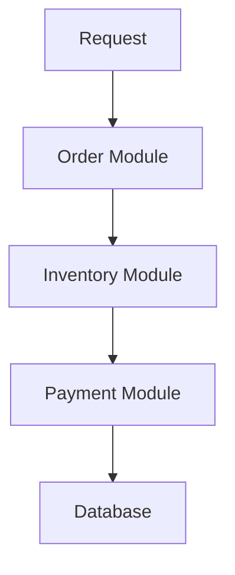

You can often inspect one application process and one codebase.

In a distributed architecture:

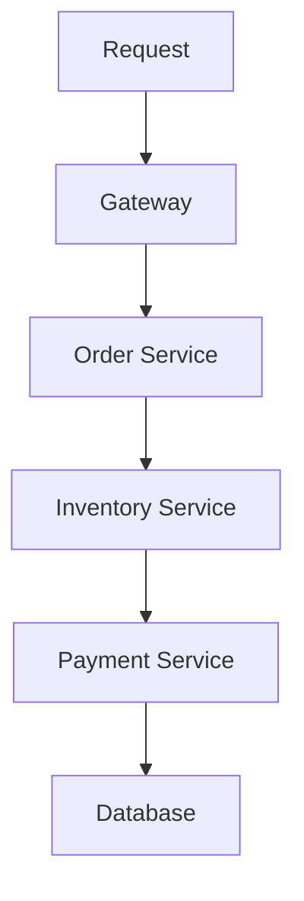

Now debugging may require:

- Logs from multiple services.
- Distributed traces.
- Correlation IDs.
- Network diagnostics.
- Service health information.

Distributed architecture is not automatically harder to debug, but it introduces additional dimensions of failure and observation.

---

# 11. Monoliths Can Scale

Another common misconception:

> "A monolith cannot scale."

It can.

Suppose one instance handles:

```text
100 requests/sec
```

You can run:

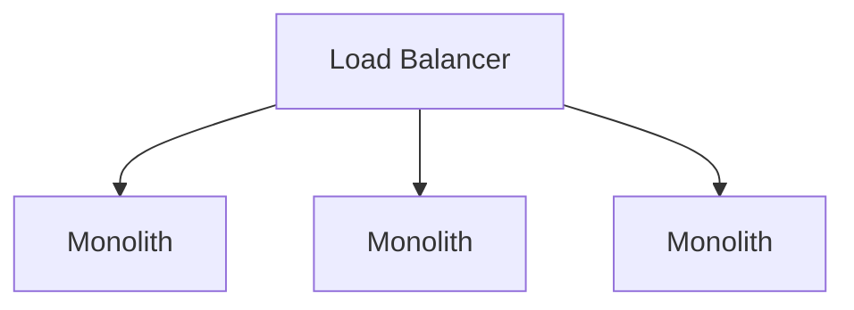

This is horizontal scaling.

The application may need to be stateless enough for this to work effectively.

The database may become the next bottleneck.

This leads to:

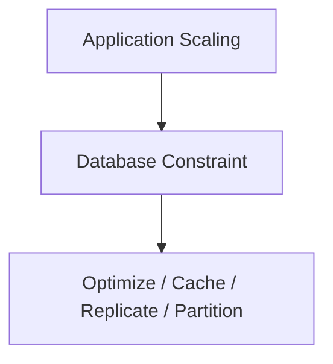

The architecture can evolve without immediately splitting the application into services.

---

# 12. The Monolith Bottleneck

Suppose the application contains:

```text
Auth
Orders
Products
Reports
Payments
```

and reports become extremely CPU-intensive.

You may have:

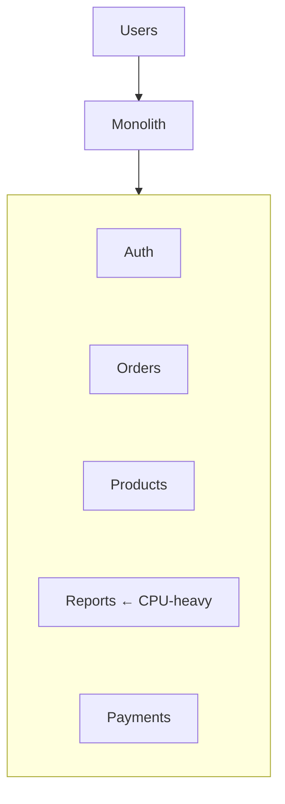

Scaling the entire monolith means scaling everything.

Even if only reports need more CPU:

```text
Monolith × 10
```

may be required.

This is one legitimate reason to eventually separate a component.

But it is a **constraint-driven decision**, not an automatic consequence of having a monolith.

---

# 13. Code Coupling

Another major problem can develop inside a monolith.

Suppose:

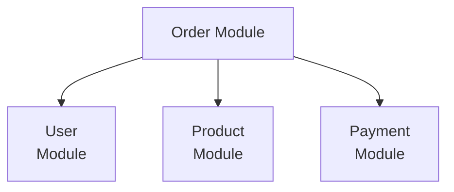

If every module directly depends on every other module:

```text
Auth ←→ Users
 ↑ ↘   ↙ ↓
Orders ←→ Products
 ↑  ↘ ↙  ↓
Payments ← Notifications
```

the application becomes difficult to change.

This is **high coupling**.

High coupling means:

> Changing one part frequently requires understanding or changing many other parts.

---

# 14. A Well-Structured Monolith

A monolith does not need to be tightly coupled.

A better design creates clear internal boundaries:

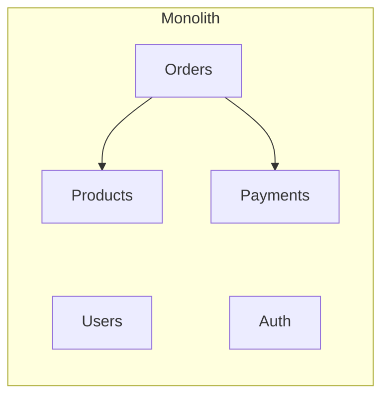

Each module should have:

- Clear responsibility.
- Clear interfaces.
- Limited dependencies.
- High internal cohesion.
- Explicit ownership of important business rules.

This is the foundation of a **modular monolith**.

---

# 15. What Is a Modular Monolith?

A modular monolith is still one deployable application.

But its internal architecture is deliberately separated into modules.

```mermaid
flowchart TD
  accTitle: A modular monolith
  accDescr: One monolith holds the auth, user, product, order and payment modules.
  subgraph G["Monolith"]
    direction TB
    I0["Auth Module"] ~~~ I1["User Module"] ~~~ I2["Product Module"] ~~~ I3["Order Module"] ~~~ I4["Payment Module"]
  end
```

The key difference is:

```text
Monolith
=
One deployment unit

Modular Monolith
=
One deployment unit
+
Strong internal boundaries
```

This is an extremely useful architecture because it can provide much of the organizational simplicity of a monolith while preparing the codebase for future evolution.

---

# 16. Why Modularity Matters

Suppose the order module owns order rules.

Instead of allowing every part of the application to directly manipulate order data:

```mermaid
flowchart TD
  accTitle: Direct table access
  accDescr: Any Module, then orders table.
  N0["Any Module"] --> N1["orders table"]
```

prefer:

```mermaid
flowchart TD
  accTitle: Through the module interface
  accDescr: Other Module, then Order Module Interface, then Order Data.
  N0["Other Module"] --> N1["Order Module Interface"] --> N2["Order Data"]
```

The exact implementation can remain internal to the order module.

This creates a boundary.

Boundaries reduce accidental coupling.

---

# 17. Monolith vs Modular Monolith

| Traditional / Poorly Structured Monolith | Modular Monolith |
|---|---|
| One deployment unit | One deployment unit |
| Can have tightly coupled code | Strong internal boundaries |
| Shared internals everywhere | Explicit module interfaces |
| Changes can spread widely | Changes more localized |
| Easier to become a "big ball of mud" | Easier to maintain |
| Often difficult to extract later | Better candidate for future extraction |

A monolith itself is not the problem.

**Uncontrolled coupling is the problem.**

---

# 18. Monolith vs Microservices

| Monolith | Microservices |
|---|---|
| Usually one deployment unit | Multiple deployment units |
| Often simpler to develop | More distributed development |
| Local communication is simpler | Network communication |
| Easier transactions | Distributed consistency is harder |
| Simpler operations initially | More operational components |
| Scale entire application | Scale services independently |
| Simpler debugging initially | Requires stronger observability |
| Lower infrastructure complexity | Higher infrastructure complexity |
| Can become tightly coupled internally | Can create distributed coupling |

Microservices provide useful capabilities.

But those capabilities come with distributed-system costs.

This is why Level 6 came first.

Before learning microservices, you need to understand what distribution actually costs.

---

# 19. The "Distributed Monolith"

A particularly dangerous architecture is the **distributed monolith**.

It may look like:

```mermaid
flowchart TD
  accTitle: A distributed monolith
  accDescr: Order Service, then Inventory Service, then Payment Service, then Notification Service.
  N0["Order Service"] --> N1["Inventory Service"] --> N2["Payment Service"] --> N3["Notification Service"]
```

but every request requires all services to be available.

For example:

```mermaid
flowchart TD
  accTitle: Every request needs every service
  accDescr: Order, then Inventory, then Payment, then Notification.
  N0["Order"] --> N1["Inventory"] --> N2["Payment"] --> N3["Notification"]
```

If any service fails:

```text
Entire operation fails
```

You now have:

- Multiple deployments.
- Network communication.
- Distributed failures.
- Distributed debugging.

but without gaining much independence.

This can be worse than a well-designed monolith.

> **Splitting code into services does not automatically create good service architecture.**

---

# 20. When Is a Monolith a Good Choice?

A monolith is often appropriate when:

- The product is new.
- Requirements are changing rapidly.
- The team is small.
- Traffic is moderate.
- Business boundaries are not yet well understood.
- One database is sufficient.
- Strong transactions are useful.
- Operational simplicity matters.
- Independent scaling is not yet necessary.

For many applications, this describes the early and even mature stages of the product.

---

# 21. When Can a Monolith Become a Constraint?

A monolith may become difficult when:

### 1. Different workloads need very different scaling

```text
Reports → Heavy CPU
Orders  → Moderate CPU
```

Scaling the entire application becomes inefficient.

### 2. Teams become strongly independent

If many teams constantly interfere with each other's deployments, stronger boundaries may become useful.

### 3. Deployment frequency becomes a problem

A tiny change in one area may require deploying the entire application.

### 4. Fault isolation becomes important

A failure in one workload may affect unrelated functionality.

### 5. Code boundaries become difficult to maintain

The codebase may become highly coupled.

### 6. Geographic or technology requirements differ

One component may require infrastructure or technology that does not fit the rest of the application.

These are signals—not automatic instructions to adopt microservices.

---

# 22. Extracting a Service

Suppose reports become a genuine bottleneck.

Start with:

```mermaid
flowchart TD
  accTitle: Before extraction
  accDescr: The monolith holds Orders, Products, Users, Reports and Auth.
  subgraph G["Monolith"]
    direction TB
    I0["Orders | Products"] ~~~ I1["Users | Reports | Auth"]
  end
```

Then extract only the constrained capability:

```mermaid
flowchart TD
  accTitle: Extracting reports
  accDescr: The monolith keeps Orders, Products, Users and Auth; reports become a separate service.
  subgraph G["Monolith"]
    direction TB
    I0["Orders Products"] ~~~ I1["Users Auth"]
  end
  G --> B["Reports Service"]
```

Now reports can potentially:

- Scale independently.
- Deploy independently.
- Use different infrastructure.
- Fail independently.

But the system has also become distributed.

Therefore the extracted service introduces:

- Network communication.
- Timeouts.
- Retries.
- Observability requirements.
- Data ownership questions.
- Deployment coordination.

The complexity should be accepted because a real constraint justified it.

---

# 23. A Healthy Evolution Path

A common evolution path is:

```mermaid
flowchart TD
  accTitle: A healthy evolution path
  accDescr: Simple Monolith, then Modular Monolith, then Identify Real Bottleneck, then Extract One Capability, then Service + Monolith, then More Services Only Where Justified.
  N0["Simple Monolith"] --> N1["Modular Monolith"] --> N2["Identify Real Bottleneck"] --> N3["Extract One Capability"] --> N4["Service + Monolith"] --> N5["More Services Only Where Justified"]
```

This is often safer than:

```mermaid
flowchart TD
  accTitle: The risky rewrite
  accDescr: Monolith, then Rewrite Everything, then 20 Microservices.
  N0["Monolith"] --> N1["Rewrite Everything"] --> N2["20 Microservices"]
```

The second approach introduces many distributed problems simultaneously.

---

# 24. Real Example — E-Commerce

Imagine a small e-commerce business.

Initial workload:

```text
100 requests/sec
5 developers
1 region
1 database
```

A reasonable architecture might be:

```mermaid
flowchart TD
  accTitle: A reasonable starting architecture
  accDescr: Users, then Load Balancer, then Monolithic Application, then PostgreSQL.
  N0["Users"] --> N1["Load Balancer"] --> N2["Monolithic Application"] --> N3["PostgreSQL"]
```

The team can build:

- Authentication.
- Product catalog.
- Cart.
- Orders.
- Payments.
- Admin.

without introducing unnecessary distributed infrastructure.

---

# 25. The Same System at Larger Scale

Suppose the business grows.

Now:

```text
10,000 requests/sec
Multiple teams
Heavy analytics
Large product catalog
Global users
```

Some constraints may emerge.

The architecture could evolve:

```mermaid
flowchart TD
  accTitle: The same system at larger scale
  accDescr: CDN, then load balancer, which serves the monolith and app workers; the monolith uses a cache and a database with replicas.
  CDN["CDN"] --> LB["Load Balancer"]
  LB --- M["Monolith"] & W["App Workers"]
  M --- C["Cache"] & DB["Database"]
  DB --- R["Replicas"]
```

Later, perhaps analytics becomes independently scalable:

```mermaid
flowchart TD
  accTitle: Extracting analytics
  accDescr: Core Application, then Event Stream, then Analytics Service.
  N0["Core Application"] --> N1["Event Stream"] --> N2["Analytics Service"]
```

Later still, another workload may genuinely justify extraction.

Architecture evolves according to constraints.

---

# 26. Monolith and Database Ownership

A monolith often uses one database:

```mermaid
flowchart TD
  accTitle: One database
  accDescr: Application, then Database.
  N0["Application"] --> N1["Database"]
```

This provides simplicity.

A distributed service architecture may move toward:

```text
Order Service → Order Database

Product Service → Product Database

Payment Service → Payment Database
```

This can improve service ownership.

But it also creates:

- Data duplication.
- Cross-service consistency problems.
- More backups.
- More migrations.
- More operational work.

Therefore:

> **Database separation is not automatically an improvement.**

It should solve a real ownership, scaling, isolation, or autonomy requirement.

---

# 27. Deployment Trade-Off

### Monolith

```mermaid
flowchart TD
  accTitle: Monolith deployment
  accDescr: Code Change, then Build, then Test, then Deploy Application.
  N0["Code Change"] --> N1["Build"] --> N2["Test"] --> N3["Deploy Application"]
```

A small change may affect the entire deployment.

### Multiple Services

```mermaid
flowchart TD
  accTitle: Service deployment
  accDescr: Change Order Service, then Deploy Order Service.
  N0["Change Order Service"] --> N1["Deploy Order Service"]
```

Potentially useful.

But now you need:

- Version compatibility.
- Service contracts.
- Independent deployment pipelines.
- Rollback strategies.
- Monitoring.
- Dependency management.

Independent deployment is valuable only when the organization actually benefits from it.

---

# 28. Failure Isolation Trade-Off

A monolith can have a larger process-level blast radius.

For example:

```mermaid
flowchart TD
  accTitle: Process-level blast radius
  accDescr: The application process fails (X), taking down Auth, Orders, Products and Admin.
  P["Application Process"] --x C["Auth + Orders + Products + Admin"]
```

A process failure can affect many capabilities.

Services can isolate some failures:

```text
Orders ✓
Products ✓
Payments ❌
```

But service isolation is not automatic.

If every service depends synchronously on another:

```mermaid
flowchart TD
  accTitle: Failure still propagates
  accDescr: Orders, then Payments, then External API.
  N0["Orders"] --> N1["Payments"] --> N2["External API"]
```

the failure can still propagate.

Therefore:

> **Architectural separation creates the possibility of isolation; it does not guarantee it.**

---

# 29. Monolith and Team Size

Architecture also has an organizational dimension.

A small team:

```mermaid
flowchart TD
  accTitle: A small team
  accDescr: 5 developers, then 1 codebase, then Simple coordination.
  N0["5 developers"] --> N1["1 codebase"] --> N2["Simple coordination"]
```

may benefit from a monolith.

A large organization:

```mermaid
flowchart TD
  accTitle: A large organization
  accDescr: 100+ developers, then Many teams, then Independent ownership, then Potential need for stronger service boundaries.
  N0["100+ developers"] --> N1["Many teams"] --> N2["Independent ownership"] --> N3["Potential need for stronger service boundaries"]
```

The architecture should reflect not only technical workload but also how people work.

This idea becomes important in later chapters about service boundaries and microservices.

---

# 30. What a Good Monolith Looks Like

A healthy monolith typically has:

```text
Clear Modules
      +
Clear Responsibilities
      +
Controlled Dependencies
      +
Good Tests
      +
Observable Runtime
      +
Simple Deployment
      +
Explicit Data Ownership
```

It may still be large.

Size alone does not make a monolith unhealthy.

The real concern is uncontrolled coupling.

---

# 31. What a Bad Monolith Looks Like

A poorly structured monolith may become:

```text
+----------------------------------+
|                                  |
| Everything depends on everything |
|                                  |
| Shared global state              |
| Shared database access           |
| Circular dependencies            |
| Hidden business rules            |
| No clear ownership              |
|                                  |
+----------------------------------+
```

This is sometimes called a **big ball of mud**.

The problem is not that the system has one deployment unit.

The problem is that nobody can safely change one part without understanding many others.

---

# 32. Hands-On Exercise — Design a Monolith

Design a simple e-commerce application with:

- User registration.
- Login.
- Product catalog.
- Shopping cart.
- Orders.
- Payment records.
- Admin panel.

Start with:

```mermaid
flowchart TD
  accTitle: Start with
  accDescr: Browser, then Web Server, then Monolithic Application, then PostgreSQL.
  N0["Browser"] --> N1["Web Server"] --> N2["Monolithic Application"] --> N3["PostgreSQL"]
```

Now define these modules:

```text
Auth
Users
Products
Cart
Orders
Payments
Admin
```

For each module, identify:

1. Its responsibility.
2. The data it owns.
3. Which other modules it needs.
4. Which operations must be strongly consistent.
5. Which operations could be asynchronous.

The goal is **not** to create microservices.

The goal is to practice creating clear boundaries **inside one application**.

---

# 33. Lab Challenge — Change One Requirement

Start with:

```text
100 requests/sec
5 developers
1 region
One database
One monolithic application
```

Now change only one requirement at a time.

### Change A

Traffic increases to:

```text
10,000 requests/sec
```

Question:

> Does the entire application need to become microservices?

First consider:

- Horizontal scaling.
- Caching.
- Database optimization.
- Read replicas.
- Connection management.

---

### Change B

The reporting workload becomes extremely CPU-intensive.

Question:

> Does the reporting capability need independent scaling?

If yes, consider extracting only reporting.

---

### Change C

Ten development teams now work independently.

Question:

> Would stronger service or module boundaries improve organizational autonomy?

Possibly—but determine whether the organizational benefit justifies distributed complexity.

---

### Change D

Users now require global low-latency access.

Question:

> Is geographic distribution required?

If yes, evaluate CDN, regional deployment, data replication, routing, and consistency requirements before choosing multi-region architecture.

---

# 34. Common Mistakes

### Mistake 1 — Thinking monolith means bad architecture

A monolith can be simple, scalable, maintainable, and highly available.

### Mistake 2 — Thinking microservices are the natural next step

A system should move toward services only when real constraints justify the additional complexity.

### Mistake 3 — Treating a modular monolith as a failure

A modular monolith can be an excellent long-term architecture.

### Mistake 4 — Splitting services by database tables

A service boundary should represent a meaningful business or ownership boundary, not simply a table.

### Mistake 5 — Creating too many services too early

Every service introduces network and operational complexity.

### Mistake 6 — Ignoring internal coupling

A monolith with strong internal boundaries can be healthier than a collection of tightly coupled services.

### Mistake 7 — Assuming independent deployment automatically solves scaling

Independent deployment and independent scaling are related but different benefits.

### Mistake 8 — Forgetting the database

Splitting application code does not automatically solve database bottlenecks or consistency problems.

---

# 35. Key Principle

> **A monolith is not an architectural failure. It is often the simplest useful architecture for a system whose requirements, workload, and boundaries are still evolving. A well-structured monolith can scale, remain maintainable, and provide strong transactional and operational simplicity. Move toward distributed services when a real constraint—such as independent scaling, deployment autonomy, fault isolation, organizational boundaries, or geographic requirements—justifies the additional complexity.**

---

# Quick Reference

| Question | Monolith |
|---|---|
| Deployment | Usually one application unit |
| Communication | Primarily in-process |
| Scaling | Usually scales the application as a whole |
| Development | Often simpler |
| Debugging | Often simpler initially |
| Transactions | Often easier |
| Infrastructure | Lower initial complexity |
| Failure isolation | Potentially broader process-level blast radius |
| Independent scaling | Limited |
| Independent deployment | Limited |
| Internal modularity | Highly recommended |
| Best starting point? | Often, depending on requirements |
| Automatically bad? | No |

### Architecture Progression

```mermaid
flowchart TD
  accTitle: Architecture progression
  accDescr: Simple Monolith, then Modular Monolith, then Real Constraint, then Extract Specific Capability, then Distributed Service.
  N0["Simple Monolith"] --> N1["Modular Monolith"] --> N2["Real Constraint"] --> N3["Extract Specific Capability"] --> N4["Distributed Service"]
```

---

# Knowledge Check

1. What makes an application a monolith?
2. Does a monolith mean all code must be in one file?
3. Can a monolith scale horizontally?
4. Why is communication inside a monolith generally simpler than service-to-service communication?
5. What is a modular monolith?
6. Why can a modular monolith be preferable to premature microservices?
7. What is the main scaling limitation of a monolithic deployment unit?
8. What is a distributed monolith?
9. Why can extracting a service increase system complexity?
10. Name three situations where a monolith may become a genuine constraint.
11. Why is internal coupling more important than simply counting the number of files?
12. Why should service extraction be driven by constraints?
13. What is one major advantage of keeping tightly related operations in the same application?
14. What should you ask before deciding to adopt microservices?

### Answers

1. Major application functionality is built and deployed as one application unit.
2. No. A monolith can contain many files and well-organized modules.
3. Yes. Multiple instances can run behind a load balancer when the application is designed appropriately.
4. Components can communicate through local function/method calls rather than relying on network communication between independently deployed services.
5. A monolith with deliberate internal boundaries between modules while remaining one deployment unit.
6. It preserves much of the development, deployment, transaction, and operational simplicity of a monolith while reducing internal coupling.
7. The entire deployment unit generally scales together, even when only one workload requires additional capacity.
8. A collection of independently deployed services that are technically distributed but remain so tightly dependent that they behave like one application.
9. It introduces network communication, timeouts, retries, observability, data ownership, consistency, and deployment concerns.
10. Independent scaling needs, independent deployment/team ownership, fault isolation requirements, geographic requirements, or difficult internal coupling are examples.
11. High coupling makes changes spread across the application and makes boundaries difficult to maintain, regardless of codebase size.
12. Service extraction adds distributed-system complexity and should therefore solve a real architectural constraint.
13. Related operations can often share local transactions and avoid unnecessary network coordination.
14. **"What problem are we trying to solve?"**

---

# Remember

> **A monolith is not something you automatically need to escape.**

Start simple.

Create clear boundaries.

Measure the real constraints.

Then extract or distribute only what the system has a genuine reason to distribute.

---

# Next Chapter

## 07.02 — Modular Monolith

The next chapter goes deeper into the most important evolution of a healthy monolith:

> **How do you keep one application deployable as a single unit while creating strong internal boundaries that make the system easier to maintain—and potentially easier to split later?**
