# 07.02 — Modular Monolith

## Learning Objectives

By the end of this chapter, you will be able to:

- Explain what a modular monolith is.
- Understand why internal boundaries matter even when an application has one deployment unit.
- Distinguish high cohesion from high coupling.
- Design modules around business responsibilities.
- Control dependencies between modules.
- Understand module ownership of data and business rules.
- Recognize common signs of a poorly modularized monolith.
- Understand how modular boundaries can make future service extraction easier.

---

# Beginner Vocabulary

| Term | Beginner-Friendly Meaning |
|---|---|
| **Module** | A part of an application responsible for a specific business capability. |
| **Modular Monolith** | One deployable application divided into clearly separated internal modules. |
| **Boundary** | A defined line that controls what one part of the application can access from another. |
| **Cohesion** | How closely related the responsibilities inside a module are. |
| **Coupling** | How strongly one module depends on another. |
| **Dependency** | A relationship where one part of the application needs another part to work. |
| **Interface** | A defined way for one module to interact with another. |
| **Encapsulation** | Keeping internal implementation details hidden behind a controlled interface. |
| **Ownership** | Responsibility for a piece of business logic or data. |
| **Domain** | A particular area of business functionality, such as orders or payments. |
| **Invariant** | A rule that must remain true for the system to remain correct. |
| **Refactoring** | Improving internal structure without intentionally changing external behavior. |
| **Circular Dependency** | When modules depend on each other directly or indirectly in a cycle. |
| **Dependency Direction** | The intended direction in which modules are allowed to depend on one another. |
| **Extraction** | Moving a capability from a monolith into a separately deployable service. |

---

# 1. What Is a Modular Monolith?

A **modular monolith** is a single application that is deliberately divided into well-defined internal modules.

The key characteristics are:

```text
One Application
      +
One Deployment Unit
      +
Strong Internal Boundaries
```

For example:

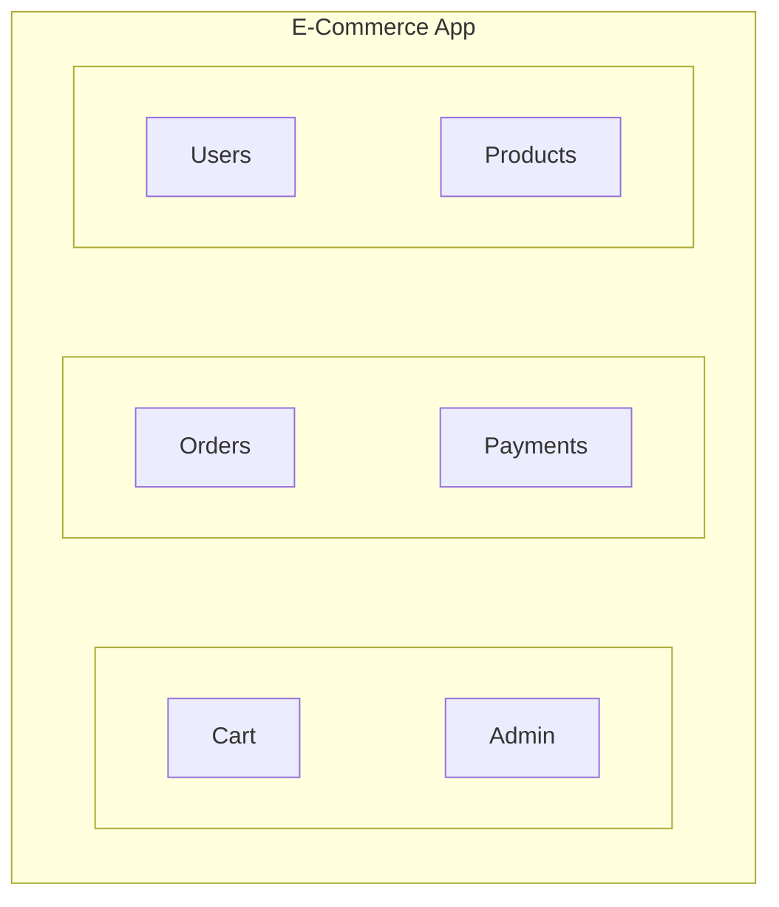

The application is still deployed as one unit.

But the internal structure is intentional.

---

# 2. Why Do Internal Boundaries Matter?

Consider two applications.

### Application A

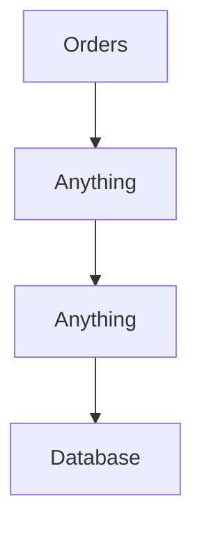

Every module can access everything.

### Application B

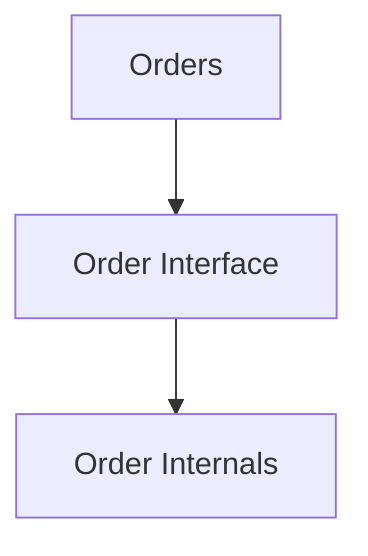

Other modules cannot freely manipulate internal order logic.

The second design creates a boundary.

Boundaries help answer:

> **Who is responsible for this behavior?**

and:

> **Who is allowed to change this data?**

---

# 3. A Module Should Represent a Responsibility

A module should usually represent a meaningful business capability.

For an e-commerce application:

```text
Users
Products
Cart
Orders
Payments
Shipping
Notifications
```

These are better module candidates than arbitrary technical categories such as:

```text
Controllers
Models
Helpers
Functions
Utilities
```

Technical layers can still exist inside modules.

But the module boundary should ideally reflect what the business actually does.

---

# 4. Business-Oriented Structure

Compare these two structures.

### Technical structure

```text
controllers/
models/
services/
repositories/
helpers/
```

This can be useful as an implementation organization.

But it does not immediately show business boundaries.

### Modular structure

```text
modules/
├── users/
├── products/
├── orders/
├── payments/
└── notifications/
```

Now the business capabilities are visible.

Each module can contain its own internal structure:

```text
orders/
├── OrderController
├── OrderService
├── OrderRepository
├── Order
└── OrderRules
```

The exact framework or language is not important.

The architectural idea is.

---

# 5. Cohesion

**Cohesion** describes how closely related the responsibilities inside a module are.

A highly cohesive module:

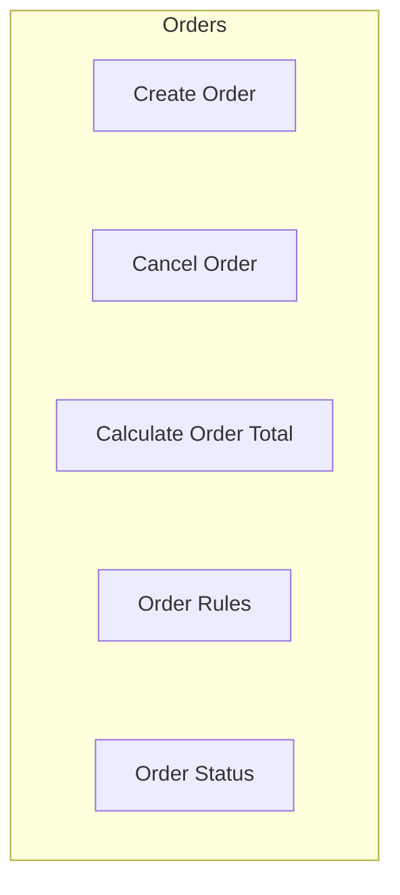

These responsibilities belong together.

A poorly cohesive module might contain:

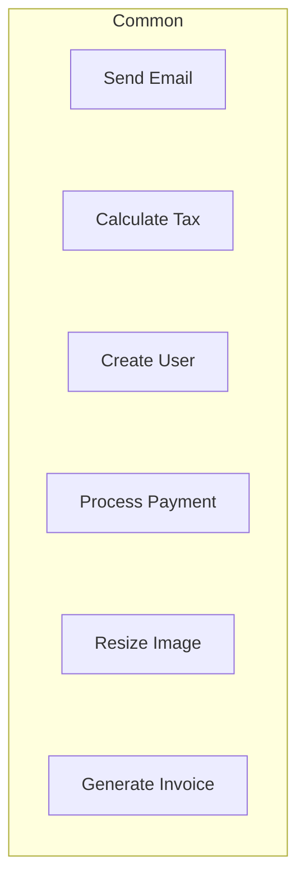

The responsibilities are unrelated.

A useful principle is:

> **Keep closely related behavior together.**

---

# 6. Coupling

**Coupling** describes how strongly one module depends on another.

Low coupling:

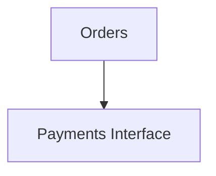

High coupling:

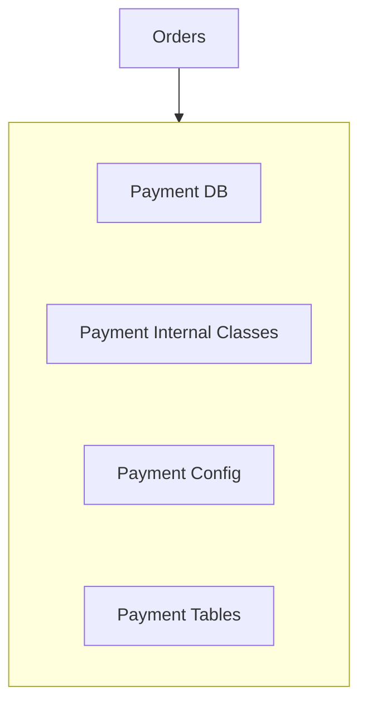

The order module knows too much about payment internals.

If payment changes, orders may also need changes.

This is undesirable.

---

# 7. The Goal: High Cohesion, Controlled Coupling

A useful modularity target is:

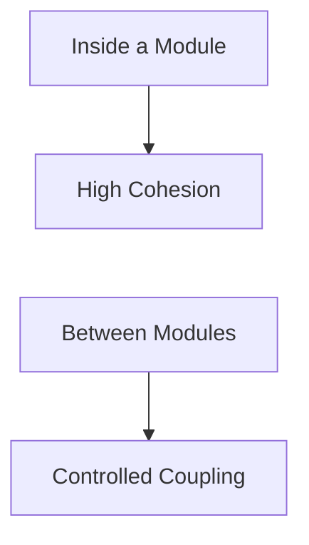

In simple terms:

> **Keep related things together and unrelated things apart.**

This sounds simple, but it is one of the most important architectural ideas in software design.

---

# 8. Encapsulation Inside a Module

Suppose the order module internally stores orders in several tables.

Other modules should not need to know the exact implementation.

Instead:

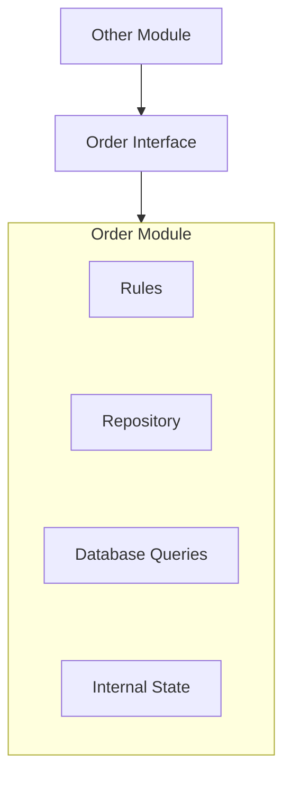

The internals remain hidden.

This is **encapsulation**.

If the database structure changes later, fewer parts of the application need to change.

---

# 9. Module Interface

A module should expose the operations that other modules actually need.

For example:

```text
Order Module

Public:
- createOrder()
- cancelOrder()
- getOrderStatus()

Internal:
- database queries
- order validation details
- persistence implementation
- internal calculations
```

Another module should not directly modify:

```text
orders.status
```

just because it can access the database.

Instead:

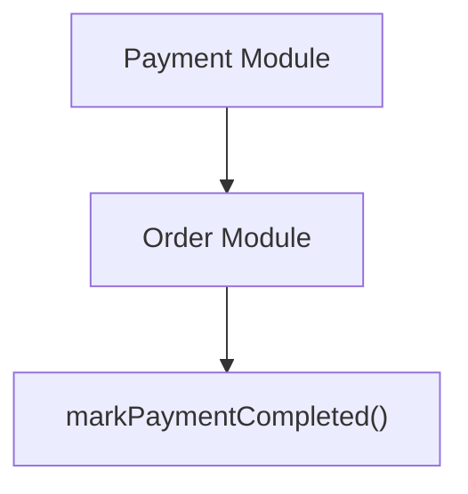

The order module remains responsible for its own business rules.

---

# 10. Data Ownership

A strong modular monolith should establish ownership of important data.

For example:

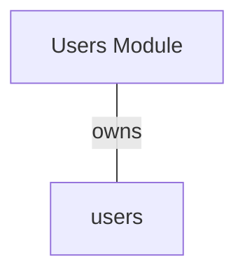

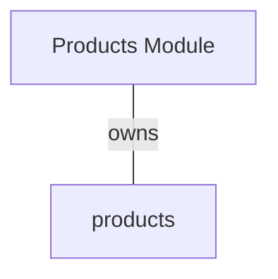

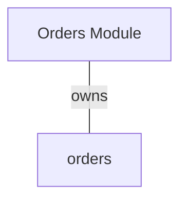

This does not necessarily mean every module must have a separate database.

One database can still be used:

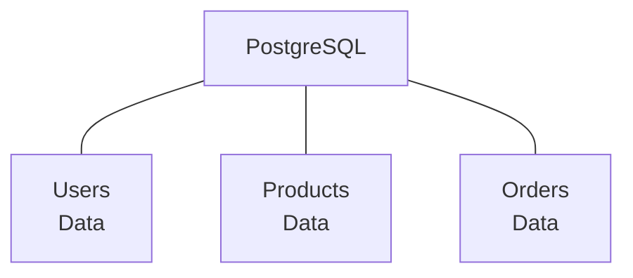

The important idea is logical ownership.

---

# 11. One Database Does Not Mean No Boundaries

A common mistake is:

> "Everything uses the same database, so every module can access every table."

That creates hidden coupling.

For example:

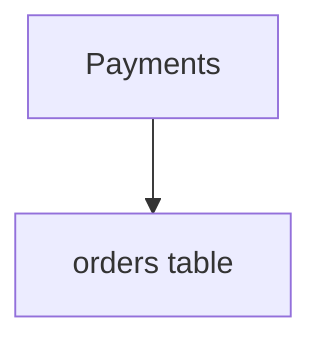

and:

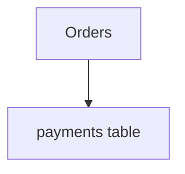

Now both modules depend on each other's internal data.

A better design is:

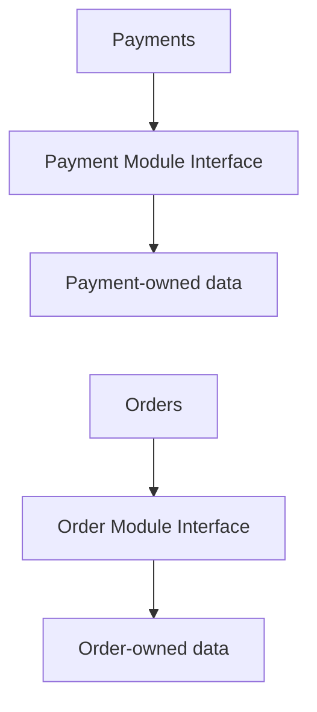

The database may be shared physically while ownership remains separated logically.

---

# 12. Direct Table Access Is a Boundary Leak

Imagine:

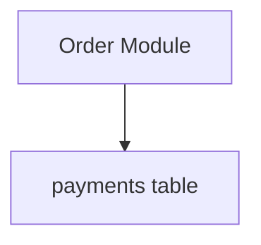

The order module is now dependent on payment storage details.

If payment storage changes:

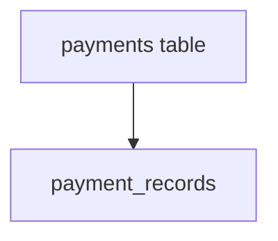

the order module may break.

This is a **boundary leak**.

The safer pattern is:

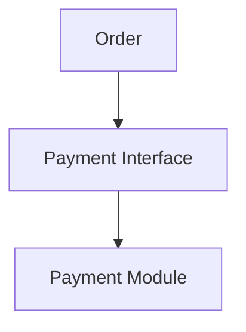

---

# 13. Dependency Direction

Suppose:

```text
Orders → Payments
```

This means orders depend on payment functionality.

Now suppose payments also directly depend on orders:

```text
Orders ↔ Payments
```

You have a bidirectional dependency.

This can become difficult to manage.

A modular architecture should deliberately define dependency direction.

For example:

```mermaid
flowchart TD
  accTitle: Intentional dependency direction
  accDescr: Order, then Payment Interface, then Payment.
  N0["Order"] --> N1["Payment Interface"] --> N2["Payment"]
```

The exact dependency direction depends on the business model.

The important point is:

> **Dependencies should be intentional rather than accidental.**

---

# 14. Circular Dependencies

A circular dependency looks like:

```mermaid
flowchart TD
  accTitle: A circular dependency
  accDescr: Orders, then Payments, then Users, then back to Orders.
  N0["Orders"] --> N1["Payments"] --> N2["Users"] --> N0
```

Or simply:

```mermaid
flowchart TD
  accTitle: A simple cycle
  accDescr: A, then B, then C, then back to A.
  N0["A"] --> N1["B"] --> N2["C"] --> N0
```

This makes changes harder because the modules are no longer independently understandable.

Circular dependencies often indicate:

- Poor boundaries.
- Mixed responsibilities.
- Incorrect ownership.
- Shared logic placed in the wrong module.

The solution is not always "create another service."

Often the first step is to redesign the internal boundaries.

---

# 15. Shared Utilities: Use Carefully

Some functionality genuinely belongs in shared infrastructure:

```text
Logging
Configuration
Date/Time
Metrics
```

But a "shared utilities" module can become a dumping ground.

For example:

```text
utils/
├── sendPayment()
├── createOrder()
├── updateUser()
├── calculateShipping()
└── processNotification()
```

Now business logic is hidden inside a generic utility layer.

A better question is:

> **Which business module owns this behavior?**

---

# 16. Shared Business Logic

Suppose both Orders and Payments need currency conversion.

You might be tempted to put:

```text
currency.php
```

into a giant shared folder.

Sometimes this is appropriate.

But first determine:

- Is currency conversion a generic infrastructure concern?
- Is it part of payment business rules?
- Does order pricing have different rules?

Shared code should be shared because it represents a genuinely shared concept—not merely because two modules happen to use similar code.

---

# 17. Module Boundaries Should Protect Invariants

An **invariant** is a rule that must remain true.

For example:

> An order cannot become `PAID` unless the payment has been successfully confirmed.

If every module can directly modify order state:

```text
Orders
Payments
Admin
Support
```

any of them might accidentally violate the rule.

A stronger design makes the Order module responsible for enforcing it:

```mermaid
flowchart TD
  accTitle: The order module enforces the rule
  accDescr: Payment Confirmed, then Order Module, then Validate Rule, then Mark Order Paid.
  N0["Payment Confirmed"] --> N1["Order Module"] --> N2["Validate Rule"] --> N3["Mark Order Paid"]
```

This is one of the most important reasons to establish ownership.

---

# 18. Transaction Boundaries

A modular monolith can sometimes keep related operations inside one database transaction.

For example:

```mermaid
flowchart TD
  accTitle: One transaction
  accDescr: BEGIN; create order, reserve inventory, record payment state; COMMIT.
  B["BEGIN"] --> G
  subgraph G[" "]
    direction TB
    I0["Create Order"] ~~~ I1["Reserve Inventory"] ~~~ I2["Record Payment State"]
  end
  G --> C["COMMIT"]
```

This can be easier than coordinating multiple databases.

But modular boundaries still matter.

Do not use transactions as an excuse for every module to modify every other module's data.

The goal is:

> **Strong business boundaries with appropriate transaction boundaries.**

---

# 19. Module Communication

There are several ways modules can communicate inside a monolith.

### Direct method call

```mermaid
flowchart TD
  accTitle: Direct method call
  accDescr: Order, then PaymentService.process().
  N0["Order"] --> N1["PaymentService.process()"]
```

Simple, but creates a direct dependency.

### Interface

```mermaid
flowchart TD
  accTitle: Interface
  accDescr: Order, then PaymentInterface, then Payment Implementation.
  N0["Order"] --> N1["PaymentInterface"] --> N2["Payment Implementation"]
```

This can reduce dependency on implementation details.

### Internal event

```mermaid
flowchart TD
  accTitle: Internal event
  accDescr: Order created raises an internal event, handled by email and analytics.
  N0["Order Created"] --> N1["Internal Event"] --> E["Email"] & A["Analytics"]
```

This can reduce direct coupling.

But internal events also introduce:

- Ordering questions.
- Error handling.
- Duplicate handling.
- Debugging complexity.

Use them where they provide real value.

---

# 20. Internal Events Do Not Automatically Make a System Distributed

This is an important distinction.

A monolith can use:

```mermaid
flowchart TD
  accTitle: An event inside one application
  accDescr: Order Created, then Internal Event.
  N0["Order Created"] --> N1["Internal Event"]
```

without using a network message broker.

The event may simply be processed inside the same application.

Therefore:

> **Event-driven communication and distributed architecture are not the same thing.**

Distribution occurs when independent processes or machines communicate across a network.

---

# 21. Module Boundaries and Testing

Good modules make testing easier.

For example:

```mermaid
flowchart TD
  accTitle: Testing one module
  accDescr: The order module has its own unit tests, integration tests and business rules.
  H["Order Module"] --> G
  subgraph G[" "]
    direction TB
    I0["Unit Tests"] ~~~ I1["Integration Tests"] ~~~ I2["Business Rules"]
  end
```

You can test order behavior without understanding the entire application.

A poorly modularized application often requires:

```mermaid
flowchart TD
  accTitle: Testing a poorly modularized application
  accDescr: Start Everything, then Configure Everything, then Run Huge Integration Test.
  N0["Start Everything"] --> N1["Configure Everything"] --> N2["Run Huge Integration Test"]
```

Good boundaries reduce the amount of context required for a change.

---

# 22. Module Boundaries and Team Ownership

Imagine three teams:

```text
Team A → Orders
Team B → Payments
Team C → Products
```

If modules have clear boundaries:

```mermaid
flowchart TD
  accTitle: Teams and modules
  accDescr: The orders team owns the orders module, the payments team the payments module, the products team the products module.
  A0["Orders Team"] --> A1["Orders Module"]
  B0["Payments Team"] --> B1["Payments Module"]
  C0["Products Team"] --> C1["Products Module"]
  A1 ~~~ B0
  B1 ~~~ C0
```

teams can work with less interference.

The codebase is still one application.

This is one reason modular monoliths can work well even as organizations grow.

---

# 23. A Practical Module Structure

A conceptual structure might look like:

```text
application/
│
├── modules/
│   │
│   ├── users/
│   │   ├── api/
│   │   ├── domain/
│   │   ├── application/
│   │   └── infrastructure/
│   │
│   ├── products/
│   │   ├── api/
│   │   ├── domain/
│   │   ├── application/
│   │   └── infrastructure/
│   │
│   ├── orders/
│   │   ├── api/
│   │   ├── domain/
│   │   ├── application/
│   │   └── infrastructure/
│   │
│   └── payments/
│       ├── api/
│       ├── domain/
│       ├── application/
│       └── infrastructure/
│
└── shared/
```

The exact folder structure is not the architecture.

The architecture is the **dependency and ownership rules**.

---

# 24. The Shared Folder Problem

A folder called:

```text
shared/
```

can be useful.

But it can also become:

```text
shared/
├── UserHelper
├── OrderHelper
├── PaymentHelper
├── ProductHelper
├── CommonService
├── CommonManager
└── Misc
```

Eventually everything depends on it.

Then:

```mermaid
flowchart TD
  accTitle: A hidden coupling point
  accDescr: Everything, then Shared, then Everything.
  N0["Everything"] --> N1["Shared"] --> N2["Everything"]
```

The shared layer becomes a hidden coupling point.

Keep shared functionality small and genuinely generic.

---

# 25. The Modular Monolith as a Future Extraction Point

A good modular monolith can make future service extraction easier.

Suppose:

```text
Orders Module
```

already has:

- Clear ownership.
- Clear interfaces.
- Limited dependencies.
- Controlled data access.

Later:

```mermaid
flowchart TD
  accTitle: A real constraint
  accDescr: Orders, then Real Scaling Constraint.
  N0["Orders"] --> N1["Real Scaling Constraint"]
```

You may extract it:

```text
Before:

Monolith
├── Orders
├── Products
└── Payments

After:

Monolith
├── Products
└── Payments

Orders Service
```

The extraction is still difficult.

But a good boundary reduces the work.

---

# 26. Extraction Is Not the Goal

Do not design every module with the assumption:

> "This must eventually become a microservice."

That can create artificial boundaries.

Instead:

> **Design modules around meaningful business responsibilities because good boundaries make the current system easier to understand.**

If a future extraction becomes useful, the boundaries are already there.

If extraction never happens, the modular structure still provides value.

---

# 27. Real Example — E-Commerce Modules

Consider:

```text
E-Commerce Monolith
```

Possible modules:

```text
Users
Products
Cart
Orders
Payments
Shipping
Notifications
Admin
```

A reasonable dependency direction might be:

```text
Cart
  ↓
Products

Orders
  ↓
Cart / Products

Payments
  ↓
Orders

Shipping
  ↓
Orders

Notifications
  ←
Orders / Payments / Shipping
```

But the exact relationships depend on business rules.

The important goal is to avoid:

```text
Everything ↔ Everything
```

---

# 28. Module Boundary Checklist

For each module, ask:

### Responsibility

```text
What does this module own?
```

### Data

```text
Which data does it own?
```

### Rules

```text
Which business rules does it enforce?
```

### Interface

```text
What does it expose?
```

### Dependencies

```text
Which other modules does it need?
```

### Direction

```text
Who depends on whom?
```

### Failure

```text
What happens if this operation fails?
```

### Consistency

```text
Does the caller need an immediate result?
```

### Extraction

```text
Would this boundary still make sense if the module were separated later?
```

The last question is useful—but should not dominate the design.

---

# 29. Hands-On Exercise — Modularize an E-Commerce Monolith

Start with this poorly structured application:

```text
E-Commerce
│
├── Controllers
├── Models
├── Services
├── Helpers
└── Database
```

Everything can access everything.

Redesign it conceptually as:

```text
Modules
│
├── Users
├── Products
├── Cart
├── Orders
├── Payments
├── Shipping
└── Notifications
```

For each module, define:

1. Responsibility.
2. Data ownership.
3. Public operations.
4. Dependencies.
5. Business rules it protects.

Do not create separate services.

The goal is to create a **modular monolith**.

---

# 30. Lab Challenge — Find the Boundary Leak

Consider:

```mermaid
flowchart TD
  accTitle: Find the boundary leak
  accDescr: Orders Module, then payments table.
  N0["Orders Module"] --> N1["payments table"]
```

The Orders module directly changes:

```sql
UPDATE payments
SET status = 'paid'
WHERE id = 42;
```

### Question

What is wrong with this design?

### Better approach

```mermaid
flowchart TD
  accTitle: Better approach
  accDescr: Orders, then Payment Module, then confirmPayment(), then Payment Data.
  N0["Orders"] --> N1["Payment Module"] --> N2["confirmPayment()"] --> N3["Payment Data"]
```

The Payment module remains responsible for payment state and its business rules.

---

# 31. Lab Challenge — Find the Circular Dependency

Consider:

```mermaid
flowchart TD
  accTitle: Find the circular dependency
  accDescr: Orders, then Payments, then Users, then back to Orders.
  N0["Orders"] --> N1["Payments"] --> N2["Users"] --> N0
```

Ask:

1. Why does this make the system harder to understand?
2. Which module actually owns the shared business concept?
3. Can one dependency be replaced by an interface or event?
4. Is one responsibility placed in the wrong module?

Do not solve the problem by immediately creating another service.

First fix the boundary.

---

# 32. Common Mistakes

### Mistake 1 — Calling folders modules

Creating:

```text
orders/
payments/
users/
```

does not automatically create architectural boundaries.

The dependency rules must actually be enforced.

### Mistake 2 — Allowing every module to access every table

A shared database can easily become a shared implementation.

### Mistake 3 — Creating a giant shared module

Shared code should contain genuinely shared concepts, not business logic that nobody knows where to place.

### Mistake 4 — Creating circular dependencies

Circular dependencies usually indicate unclear ownership or boundaries.

### Mistake 5 — Splitting by technical layer only

Controllers, models, and helpers are implementation layers, not necessarily business boundaries.

### Mistake 6 — Making every module completely independent

Some dependencies are legitimate.

The goal is controlled coupling—not zero coupling.

### Mistake 7 — Using events everywhere

Events can reduce coupling, but excessive event-driven communication can make execution flow harder to understand.

### Mistake 8 — Designing everything for future microservices

The current architecture should solve today's actual requirements.

### Mistake 9 — Confusing one database with one shared owner

One physical database can still contain logically owned data.

---

# 33. Modular Monolith vs Microservices

| Property | Modular Monolith | Microservices |
|---|---|---|
| Deployment | One unit | Multiple units |
| Process | Usually one application process or application deployment | Multiple services/processes |
| Communication | Mostly local | Network-based |
| Database | Can share one database with logical ownership | Often service-owned data |
| Failure modes | Simpler initially | Distributed failures |
| Transactions | Often easier | Often distributed |
| Scaling | Usually application-wide | Service-specific |
| Deployment independence | Limited | Stronger |
| Operational complexity | Lower | Higher |
| Internal boundaries | Important | Essential |
| Good starting point | Often | Only when justified |

---

# 34. When Should a Module Become a Service?

Do not use a fixed rule such as:

> "Every module should eventually become a service."

Instead look for evidence.

A module may be a service candidate when:

```text
Independent Scaling
        OR
Independent Deployment
        OR
Fault Isolation
        OR
Team Ownership
        OR
Different Runtime Requirements
        OR
Geographic Requirements
        OR
Data Ownership Requirements
```

And the benefit must justify:

```text
Network Communication
+
Operational Complexity
+
Distributed Consistency
+
Failure Handling
```

---

# 35. Key Principle

> **A modular monolith keeps the operational simplicity of one application while creating strong internal boundaries around business capabilities. The goal is high cohesion inside modules, controlled coupling between modules, clear ownership of data and business rules, and intentional dependency direction. These boundaries improve the current system even if the application never becomes distributed—and they provide a safer foundation if a real constraint later justifies extracting a module into a service.**

---

# Quick Reference

### Modular Monolith

```text
One Deployment
      +
Business Modules
      +
Clear Ownership
      +
Controlled Dependencies
      +
Encapsulation
```

### Good Module

```text
High Cohesion
      +
Clear Responsibility
      +
Owns Its Rules
      +
Owns Its Data
      +
Small Public Interface
      +
Limited Dependencies
```

### Bad Module Structure

```text
Everything
   ↕
Everything
   ↕
Everything
```

### Evolution

```mermaid
flowchart TD
  accTitle: Evolution
  accDescr: Monolith, then Modular Monolith, then Real Constraint, then Selective Extraction, then Service.
  N0["Monolith"] --> N1["Modular Monolith"] --> N2["Real Constraint"] --> N3["Selective Extraction"] --> N4["Service"]
```

---

# Knowledge Check

1. What is a modular monolith?
2. What is the main difference between a monolith and a modular monolith?
3. What does high cohesion mean?
4. What does coupling mean?
5. Why should modules have clear ownership?
6. Why can one database still support a modular monolith?
7. Why is direct access to another module's tables a boundary leak?
8. What is a circular dependency?
9. Why can excessive shared utilities become dangerous?
10. Why are internal events not automatically distributed systems?
11. Why should modules protect business invariants?
12. Why is a modular monolith often easier to evolve than a tightly coupled monolith?
13. Should every module eventually become a microservice?
14. What should justify service extraction?

### Answers

1. A single deployable application divided into clearly defined internal modules with controlled dependencies.
2. A modular monolith deliberately enforces stronger internal boundaries and ownership instead of simply grouping all application code together.
3. High cohesion means the responsibilities inside a module are closely related.
4. Coupling describes how strongly one module depends on another.
5. Ownership ensures that a clear component is responsible for data, rules, and invariants.
6. Physical database sharing does not prevent logical ownership and access boundaries between modules.
7. It makes one module dependent on another module's internal storage implementation.
8. A circular dependency occurs when modules depend on one another in a cycle.
9. They can become hidden coupling points where unrelated business logic accumulates and every module starts depending on them.
10. An internal event can be processed within the same application without network communication between independent processes.
11. Business invariants must remain true; centralized ownership makes it harder for unrelated code to violate them accidentally.
12. Clear boundaries reduce the number of parts that need to change when one capability evolves.
13. No. A module should become a service only when a real requirement justifies the additional distributed complexity.
14. Independent scaling, deployment, fault isolation, team ownership, runtime requirements, geographic requirements, or data ownership can justify extraction.

---

# Remember

> **A modular monolith is not "a monolith pretending to be microservices."**

It is a deliberate architecture:

> **One deployable application, with strong internal boundaries around meaningful business capabilities.**

The goal is not to maximize separation.

The goal is to make responsibilities, ownership, and dependencies clear.

---

# Next Chapter

## 07.03 — Service-Oriented Architecture

The next chapter moves from **modules inside one application** to **services that can be independently organized and deployed**.

We will examine why Service-Oriented Architecture emerged, what a service actually means, how services communicate, how service boundaries differ from modules, and which distributed-system costs appear when the boundary moves across the network.
