# 07.03 — Service-Oriented Architecture

## Learning Objectives

By the end of this chapter, you will be able to:

- Explain what Service-Oriented Architecture (SOA) means.
- Understand why organizations adopted service-based architectures.
- Identify a service boundary around a meaningful business capability.
- Understand service contracts and communication.
- Distinguish SOA from a modular monolith and microservices.
- Explain synchronous vs asynchronous service interaction.
- Understand service-owned data and shared-data trade-offs.
- Recognize the benefits, costs, and governance concerns of SOA.
- Decide when introducing a service boundary is actually justified.

---

# Beginner Vocabulary

| Term | Simple Meaning |
|---|---|
| **SOA** | An architecture where business capabilities are organized as services that communicate through defined contracts. |
| **Service** | A separately organized component that provides a business capability. |
| **Service boundary** | The boundary that defines what a service owns and does. |
| **Contract** | The agreed interface, inputs, outputs, errors, and behavior between services. |
| **Service consumer** | An application or service that uses another service. |
| **Service provider** | The service that provides a capability. |
| **Coarse-grained** | A service exposes a larger business capability rather than tiny operations. |
| **Governance** | Rules and practices for how services are designed, secured, versioned, and operated. |
| **Integration** | Connecting different applications or systems so they can work together. |
| **Orchestration** | One component coordinates a multi-step business workflow. |
| **Choreography** | Services react to events or messages without one central coordinator controlling every step. |
| **ESB** | Enterprise Service Bus; infrastructure that can centralize routing, transformation, and integration between services. |
| **Distributed system** | A system whose components communicate across independent processes or machines. |

---

# 1. What Is Service-Oriented Architecture?

**Service-Oriented Architecture (SOA)** is an architectural approach where business capabilities are organized into services that communicate through defined interfaces or contracts.

Instead of putting every capability inside one application:

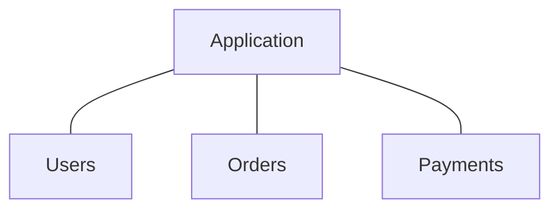

the capabilities may be organized as services:

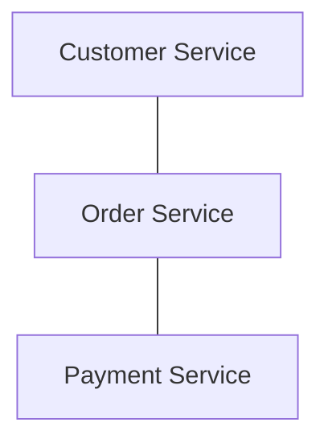

Each service provides a specific capability to other parts of the organization.

The important idea is:

> **A service is organized around a capability that other systems can consume through a defined contract.**

SOA is broader than any single technology.

It can be implemented using different protocols, messaging systems, deployment models, and infrastructure.

There is no single universal SOA implementation.

---

# 2. Why Did SOA Emerge?

Large organizations often do not have just one application.

They may have:

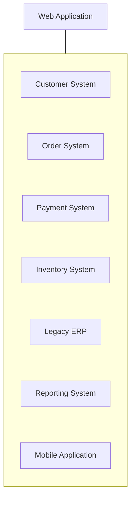

These systems may have been built:

- By different teams.
- At different times.
- Using different technologies.
- For different business departments.
- With different databases.
- For different workloads.

The organization still needs them to communicate.

SOA became useful as a way to organize these capabilities behind service interfaces.

Instead of every application directly understanding every other application's internal implementation:

```text
Application A ---> Database B
Application A ---> Internal code B
Application C ---> Database B
Application D ---> Database B
```

the organization can introduce a service boundary:

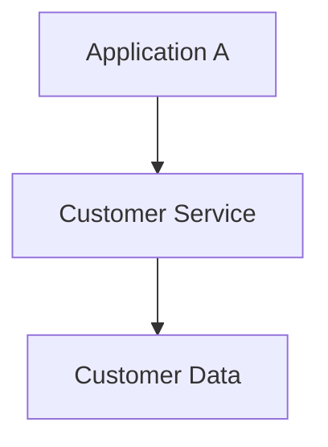

Other applications use the service contract instead of depending directly on internal implementation.

---

# 3. From Modular Monolith to Services

The previous chapter introduced the modular monolith.

Suppose an e-commerce application contains:

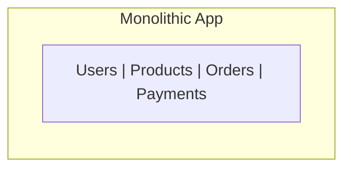

A modular monolith may organize these internally:

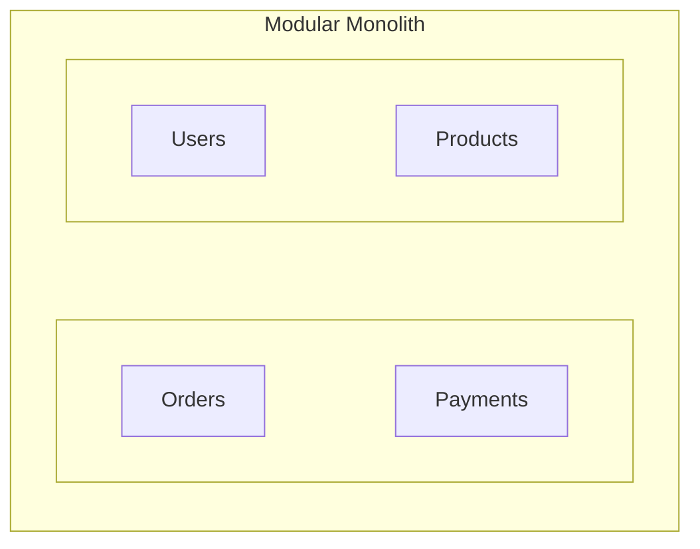

The modules communicate through in-process calls.

For example:

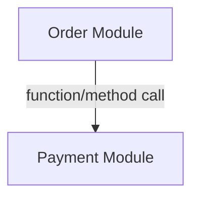

SOA introduces a stronger service boundary.

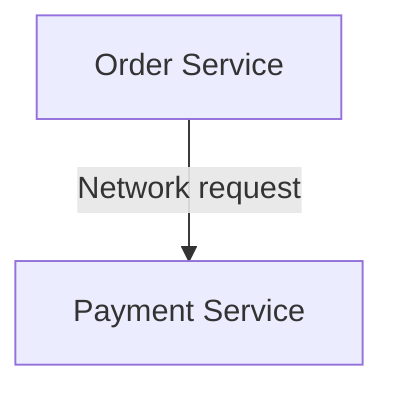

Now communication happens across a service boundary.

That changes the engineering problem.

A function call might fail because of a programming error.

A network call can fail because:

- The remote service is down.
- The network is unavailable.
- The request is delayed.
- The response is lost.
- The remote service is overloaded.
- The contract has changed.
- Authentication fails.

This is the fundamental architectural transition:

> **Moving a boundary across the network turns local interaction into distributed interaction.**

---

# 4. What Is a Service?

A service should represent a meaningful capability.

For an e-commerce platform:

```text
Customer Service
Order Service
Payment Service
Inventory Service
Shipping Service
Notification Service
```

The service should have a clear responsibility.

For example:

```text
Payment Service
----------------
Responsible for:
- Payment authorization
- Payment status
- Refunds
- Payment provider integration
```

A service should not simply exist because a developer found a convenient piece of code to extract.

Compare:

### Weak boundary

```text
UserNameService
AddressValidationService
OrderTotalCalculationService
EmailFieldService
```

These may be too small to justify independent service boundaries.

### More meaningful boundary

```text
Customer Service
Order Service
Payment Service
Shipping Service
```

These represent recognizable business capabilities.

---

# 5. Service Boundaries

A service boundary defines:

```text
What the service owns
What the service does
What it exposes
What other systems are allowed to depend on
```

For example:

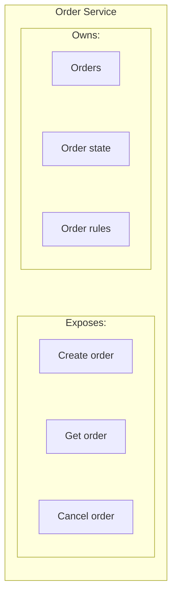

Other services should not need to understand the internal implementation.

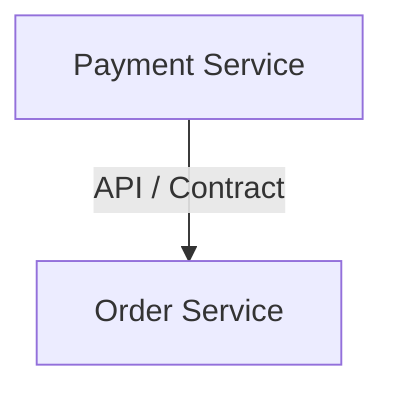

not:

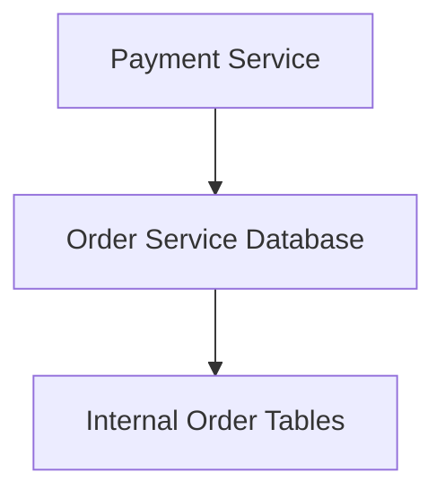

The second design creates strong coupling.

---

# 6. Coarse-Grained Services

SOA traditionally favors **coarse-grained services**.

A coarse-grained service provides a meaningful business capability rather than exposing every tiny internal operation.

For example:

```text
POST /orders
```

is potentially a meaningful business operation.

Compare that with exposing dozens of tiny internal operations:

```text
GET /order-row
GET /customer-row
GET /calculate-tax
GET /update-status
GET /reserve-id
...
```

The smaller the operations become, the more communication and coordination may be required.

A coarse-grained boundary can reduce unnecessary network interactions.

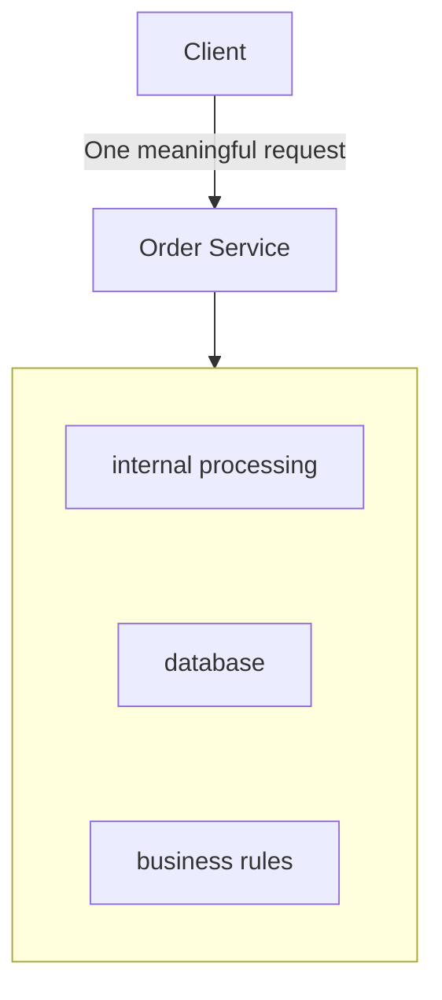

The exact granularity depends on the system.

> **Coarse-grained does not mean "large and badly designed." It means the service exposes a meaningful unit of business capability.**

---

# 7. Service Contracts

Services communicate through contracts.

A contract defines what consumers can expect.

For example:

```text
Create Order

Input:
- customerId
- items
- shippingAddress

Success:
- orderId
- status
- total

Errors:
- invalid customer
- unavailable product
- invalid order
```

The contract should also define relevant behavioral expectations.

For example:

```text
POST /orders
```

might have expectations about:

- Authentication.
- Required fields.
- Response format.
- Error behavior.
- Idempotency.
- Timeouts.
- Compatibility.
- Versioning.

The consumer should not need to know how the service internally implements the operation.

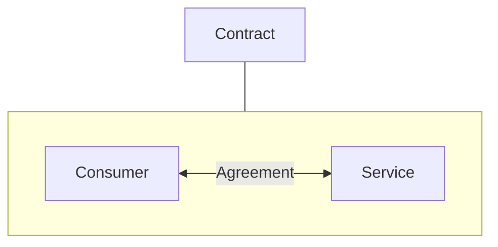

This is one of the most important ideas in service architecture.

---

# 8. Service Communication

Services need some way to communicate.

Common approaches include:

### HTTP APIs

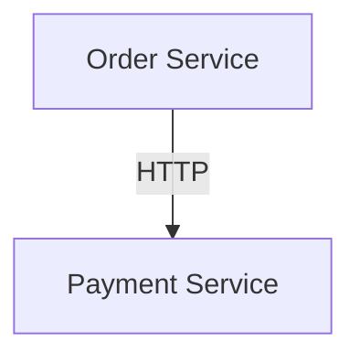

### Messaging

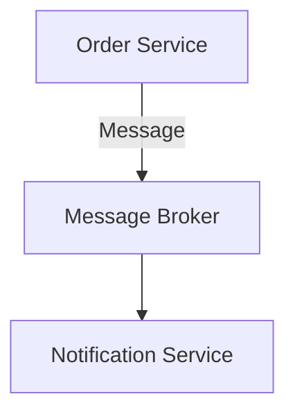

### Other protocols

Organizations may use other communication technologies depending on their requirements.

The technology is less important than understanding the architectural consequence:

> **Communication across a service boundary introduces network behavior.**

That means latency, timeouts, failures, retries, authentication, observability, and versioning become architectural concerns.

Detailed service communication will be covered in:

**07.08 — Service Communication**

---

# 9. Synchronous vs Asynchronous Services

Service communication can be synchronous.

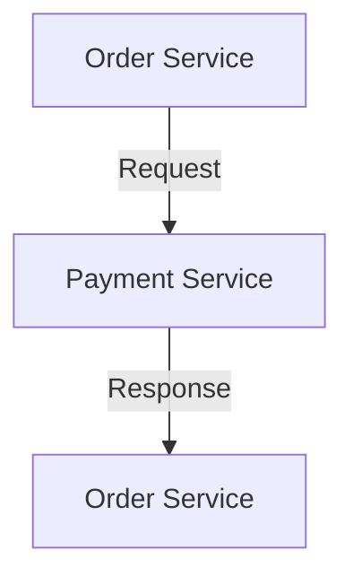

The caller waits for a response.

This is useful when the result is required immediately.

For example:

```text
"Can this payment be authorized?"
```

But the caller now depends on the availability and latency of the payment service.

---

Asynchronous communication separates sending from processing.

The order service does not need to wait for notification processing to finish.

This can improve decoupling and resilience for suitable workflows.

But it introduces additional concerns:

- Delayed processing.
- Message delivery.
- Duplicate processing.
- Ordering.
- Retry handling.
- Eventual consistency.

These topics were covered in the asynchronous-systems section and will become important in service architecture.

---

# 10. Service-Owned Data

A strong service boundary usually has clear data ownership.

For example:

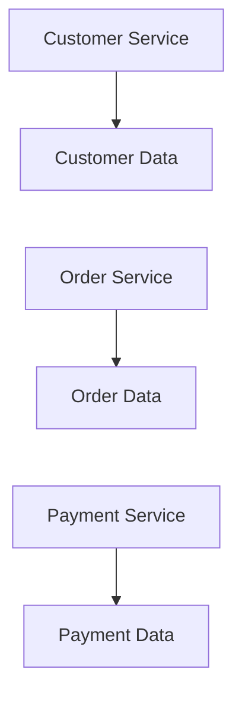

The Payment Service should not normally modify Order Service tables directly.

Instead:

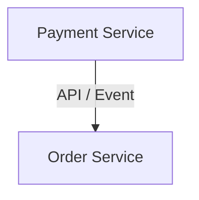

The owning service controls its own business rules and data.

---

# 11. Shared Database: The Hidden Coupling

Consider this architecture:

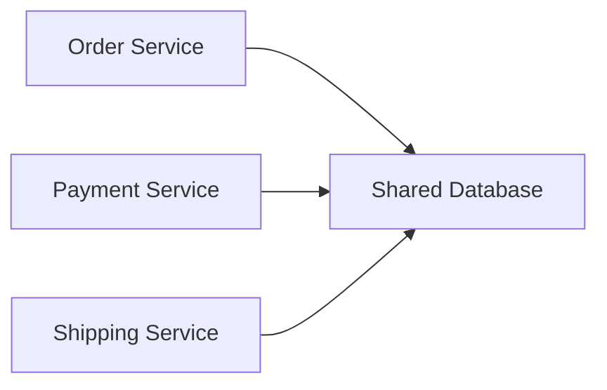

It may look like three services.

But if every service directly reads and writes the same tables, they are tightly coupled.

For example:

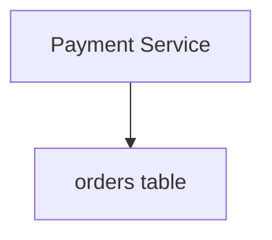

Now a schema change in the Order Service can unexpectedly break the Payment Service.

This creates a hidden dependency.

The services communicate through contracts.

This does not mean every SOA system must have a completely separate physical database for every service.

The important architectural question is:

> **Who owns the data and the rules around that data?**

Physical database separation can be introduced when the requirements justify it.

---

# 12. Service Reuse

One major SOA goal is **reuse**.

Suppose an organization has many applications:

```text
Web App
Mobile App
Admin App
Partner Portal
Internal Tool
```

All need customer information.

Instead of implementing customer logic independently in every application:

```mermaid
flowchart LR
  accTitle: Service reuse
  accDescr: Web, mobile and admin apps, the partner portal and an internal tool all use the customer service.
  S0["Web App"] & S1["Mobile App"] & S2["Admin App"] & S3["Partner Portal"] & S4["Internal Tool"] --> T["Customer Service"]
```

the Customer Service can provide a shared capability.

This can reduce duplication.

But reuse has a trade-off.

If too many systems become dependent on one service:

```mermaid
flowchart LR
  accTitle: A critical dependency
  accDescr: The customer service is used by App A, App B, App C and App D.
  R["Customer<br/>Service"] --> K0["App A"] & K1["App B"] & K2["App C"] & K3["App D"]
```

the service can become a critical dependency.

Changes become harder.

Capacity requirements increase.

An outage can affect many applications.

> **Reuse can reduce duplication, but excessive centralization can create a bottleneck and coordination point.**

---

# 13. Orchestration vs Choreography

These terms describe different ways of coordinating multiple services.

## Orchestration

One component coordinates the workflow.

```mermaid
flowchart TD
  accTitle: Orchestration
  accDescr: The order workflow directs payment, inventory and shipping.
  R["Order Workflow"] --> K0["Payment"] & K1["Inventory"] & K2["Shipping"]
```

The orchestrator decides what happens next.

This can make the workflow easier to understand centrally.

But the orchestrator can become complex if it owns too much business logic.

---

## Choreography

Services react to events or messages.

```mermaid
flowchart TD
  accTitle: Choreography
  accDescr: Order created publishes a message or event; payment and notification react, and payment leads to inventory.
  N0["Order Created"] --> N1["Message/Event"] --> P["Payment"] & N["Notification"]
  P --> I["Inventory"]
```

There is no single component directing every step.

This can reduce direct coordination.

But understanding the complete workflow can become harder.

Orchestration and choreography are architectural choices, not universal rules.

Detailed service communication and interaction patterns are covered later.

---

# 14. Governance

Large organizations often need consistent rules across services.

Governance may define:

- API standards.
- Authentication requirements.
- Security policies.
- Naming conventions.
- Versioning rules.
- Logging requirements.
- Monitoring standards.
- Data ownership rules.
- Deployment practices.
- Compliance requirements.

For example:

```mermaid
flowchart TD
  accTitle: Governance
  accDescr: Governance applies to the customer, order and payment services.
  R["Governance"] --> K0["Customer<br/>Service"] & K1["Order<br/>Service"] & K2["Payment<br/>Service"]
```

Governance can improve consistency.

But excessive central control can slow teams down.

The goal is not to approve every implementation detail.

The goal is to establish the standards that genuinely need organizational consistency.

---

# 15. Enterprise Service Bus

Some SOA environments use an **Enterprise Service Bus (ESB)** or similar centralized integration layer.

Conceptually:

```mermaid
flowchart TD
  accTitle: An enterprise service bus
  accDescr: Application A goes through the ESB, which routes to App B, App C and App D.
  N0["Application A"] --> N1["ESB"] --> B["App B"] & C["App C"] & X["App D"]
```

An ESB may handle capabilities such as:

- Routing.
- Message transformation.
- Protocol translation.
- Integration.
- Centralized policy enforcement.

This can be useful when an organization has many heterogeneous systems.

For example:

```mermaid
flowchart TD
  accTitle: ESB in front of a legacy system
  accDescr: Modern API, then ESB, then Legacy Enterprise System.
  N0["Modern API"] --> N1["ESB"] --> N2["Legacy Enterprise System"]
```

However, central infrastructure can also become:

- A bottleneck.
- A failure hotspot.
- A complex dependency.
- A governance bottleneck.

SOA does not require an ESB.

An ESB is one architectural approach used in some SOA environments.

---

# 16. SOA vs Modular Monolith

These architectures solve different levels of the problem.

| Modular Monolith | SOA |
|---|---|
| One deployable application. | Multiple separately organized services/applications. |
| Modules communicate locally. | Services communicate through contracts. |
| Usually one runtime boundary. | Multiple runtime/process boundaries. |
| Easier local calls. | Network communication introduces failure and latency. |
| Can share one database. | Services are encouraged to have clearer data ownership. |
| Operationally simpler. | More operational complexity. |
| Good internal architecture. | Useful for integration and organizational boundaries. |

---

# 17. SOA vs Microservices

SOA and microservices are related but not identical.

A useful simplification is:

```text
SOA
 |
 |-- broader architectural approach
 |
 +---- Services
       |
       +---- often coarse-grained
       +---- strong contracts
       +---- enterprise integration
       +---- governance
```

Microservices generally push further toward:

```text
Small independently deployable services
        |
        +---- strong ownership
        +---- independent scaling
        +---- decentralized operation
        +---- autonomous teams
```

But **service size alone does not define the difference**.

SOA can use coarse-grained services and centralized governance.

Microservices typically emphasize smaller independently deployable services and greater team/service autonomy.

There is also overlap.

A system can use service-oriented principles without fitting neatly into one label.

The important question is not:

> "Is this SOA or microservices?"

The more useful question is:

> **What problem does separating this capability solve?**

---

# 18. Realistic Example — E-Commerce

Suppose an organization has:

```text
Web Store
Mobile App
Admin Portal
Partner Portal
```

They all need common business capabilities.

A service-oriented architecture might look like:

```mermaid
flowchart TD
  accTitle: A service-oriented e-commerce architecture
  accDescr: The web store calls the order service, which also uses the customer service; the order service calls the payment and inventory services.
  C["Customer<br/>Service"] --> O["Order<br/>Service"]
  W["Web Store"] --> O
  O --> P["Payment<br/>Service"] & I["Inventory<br/>Service"]
```

The mobile application can use the same services:

```mermaid
flowchart TD
  accTitle: The mobile app reuses services
  accDescr: The mobile app uses the customer, order and payment services.
  R["Mobile App"] --> K0["Customer<br/>Service"] & K1["Order<br/>Service"] & K2["Payment<br/>Service"]
```

This can be valuable when multiple applications genuinely need shared business capabilities.

But now a request may cross several network boundaries:

```mermaid
flowchart TD
  accTitle: Several network boundaries
  accDescr: Mobile App, then Order Service, then Payment Service, then Inventory Service.
  N0["Mobile App"] --> N1["Order Service"] --> N2["Payment Service"] --> N3["Inventory Service"]
```

Each boundary introduces latency and failure possibilities.

The architecture has gained reuse and separation.

It has also gained distributed-system complexity.

---

# 19. When SOA Makes Sense

SOA can be a good fit when:

- Multiple applications need the same business capabilities.
- An organization needs enterprise-wide integration.
- Legacy systems must interact with newer systems.
- Different teams own different business capabilities.
- Service contracts provide useful organizational boundaries.
- Independent service organization provides real value.
- The organization can support the operational complexity.

For example:

```mermaid
flowchart TD
  accTitle: A controlled integration boundary
  accDescr: The legacy ERP and the web application both go through the customer service.
  L["Legacy ERP"] --> C["Customer Service"]
  W["Web Application"] --> C
```

The service becomes a controlled integration boundary.

---

# 20. When SOA May Be Unnecessary

SOA may be unnecessary when:

- The product is small.
- One application already satisfies the requirements.
- The team is small.
- Business boundaries are still unclear.
- Network separation provides little benefit.
- Operational simplicity is more valuable.
- The services would constantly call each other.
- A modular monolith already solves the problem.

For example:

```mermaid
flowchart TD
  accTitle: Small Application
  accDescr: Small Application: Browser, then Application, then Database.
  subgraph S["Small Application"]
    direction TB
    N0["Browser"] --> N1["Application"] --> N2["Database"]
  end
```

Turning this into:

```mermaid
flowchart TD
  accTitle: Split into services
  accDescr: Browser, then User Service, then Order Service, then Payment Service, then Database.
  N0["Browser"] --> N1["User Service"] --> N2["Order Service"] --> N3["Payment Service"] --> N4["Database"]
```

does not automatically improve the system.

It may simply introduce more failure points.

---

# 21. Failure and Operational Costs

Once services communicate across networks, failures become part of normal design.

Consider:

```mermaid
flowchart TD
  accTitle: A timeout
  accDescr: The order service sends a request to the payment service, which times out (X).
  O["Order Service"] -->|"request"| P["Payment Service"] --x T["timeout"]
```

The Order Service must decide:

```text
Was payment rejected?

Did payment succeed but the response disappear?

Is the payment service slow?

Should we retry?

Can retrying charge the customer twice?
```

This is why service-oriented systems need concepts such as:

- Timeouts.
- Retries.
- Idempotency.
- Circuit breakers.
- Health checks.
- Observability.
- Versioning.
- Failure isolation.

These are not optional details once distributed boundaries become important.

---

# 22. Service Boundary Exercise

Start with the modular monolith from the previous chapter:

```mermaid
flowchart TD
  accTitle: The modular monolith to start from
  accDescr: The e-commerce application holds users, products, orders, payment, shipping, notifications and admin.
  subgraph G["E-Commerce"]
    direction TB
    I0["Users | Products | Orders | Payment"] ~~~ I1["Shipping | Notifications | Admin"]
  end
```

## Step 1 — Identify capabilities

Ask:

```text
What business capability does each module own?
```

## Step 2 — Identify consumers

Ask:

```text
Which applications need this capability?
```

## Step 3 — Identify coupling

Ask:

```text
Which modules frequently depend on each other's internal data?
```

## Step 4 — Identify network-worthy boundaries

Choose only boundaries where separation provides real value.

For example:

```text
Customer Service
Order Service
Payment Service
```

But perhaps keep:

```text
Product Catalog
Product Search
```

together initially if they have strong coupling and do not need independent scaling.

## Step 5 — Define one contract

For the Order Service:

```text
POST /orders

Input:
- customerId
- items
- shippingAddress

Output:
- orderId
- status
- total
```

Now ask:

> What should happen if the Payment Service is unavailable?

That question reveals the real distributed-system consequences of the boundary.

---

# 23. Architecture Challenge

Imagine the requirements change.

### Initial system

```text
10 requests/sec
One web application
One development team
One region
```

A modular monolith is probably sufficient.

### New requirement

```text
10 applications
Multiple business departments
Legacy ERP integration
Shared customer capability
Independent team ownership
```

Now service boundaries may provide significant value.

### Another change

```text
Global users
Low-latency regional processing
Independent scaling
Thousands of service instances
```

Now additional distributed architecture may become justified.

The important lesson is:

> **Architecture should evolve because constraints change—not because a particular architecture is fashionable.**

---

# 24. System Design View

When evaluating SOA, ask:

```mermaid
flowchart TD
  accTitle: Evaluating SOA
  accDescr: Requirement, business capability, then: service boundary? No: keep local or module. Yes: service contract, communication model, synchronous (dependency) or asynchronous (event or queue), then failure handling, data ownership and operational cost.
  N0["Requirement"] --> N1["Business Capability"] --> Q{"Service Boundary?"}
  Q -->|"No"| K["Keep local/module"]
  Q -->|"Yes"| C["Service Contract"] --> M["Communication Model"]
  M --> S["Synchronous"] & A["Asynchronous"]
  S --> DP["Dependency"]
  A --> E["Event/Queue"]
  DP & E --> F["Failure Handling"] --> DO["Data Ownership"] --> X["Operational Cost"]
```

A service boundary should solve a real problem.

Evaluate:

| Question | Why it matters |
|---|---|
| What capability does this service own? | Prevents arbitrary boundaries. |
| Who consumes it? | Determines whether reuse is valuable. |
| Who owns its data? | Prevents hidden coupling. |
| How does it communicate? | Determines latency and failure behavior. |
| Can it fail independently? | Defines resilience requirements. |
| Does it need independent scaling? | May justify separation. |
| Does a separate team own it? | Organizational boundary may matter. |
| Does the network boundary provide value? | Avoids unnecessary distribution. |
| What happens when it is unavailable? | Reveals dependency risk. |

---

# 25. Common Mistakes

### Mistake 1 — Thinking SOA means "many APIs"

An API alone does not create a useful service architecture.

The service needs a meaningful capability and ownership boundary.

### Mistake 2 — Making services extremely small

Tiny services can create excessive network communication and coordination.

### Mistake 3 — Sharing database tables between services

This creates hidden coupling and weakens service ownership.

### Mistake 4 — Treating SOA as automatically better than a monolith

Distribution introduces real costs.

### Mistake 5 — Assuming every service must deploy independently

Independent deployment is common and valuable in many service architectures, but it is not the single universal definition of SOA.

### Mistake 6 — Assuming an ESB is required

An ESB is one possible integration approach, not a requirement of SOA.

### Mistake 7 — Ignoring contracts

Without stable contracts, consumers become dependent on implementation details.

### Mistake 8 — Reusing everything

A shared service can become a central bottleneck and organizational dependency.

### Mistake 9 — Ignoring failure behavior

Network calls can timeout, fail, duplicate, or return late.

### Mistake 10 — Designing for microservices before understanding the boundary

The goal is not to create the maximum number of services.

The goal is to create useful boundaries.

---

# Key Principle

> **Service-Oriented Architecture organizes meaningful business capabilities behind defined service contracts so that different applications, teams, and systems can interact without depending directly on each other's internal implementation.**

SOA can improve:

- Integration.
- Reuse.
- Organizational boundaries.
- System separation.
- Legacy interoperability.

But service boundaries also introduce:

- Network latency.
- Partial failure.
- Versioning.
- Distributed state.
- Operational complexity.
- Consistency challenges.

Therefore:

> **Do not introduce a service boundary merely to make an architecture look distributed. Introduce it when the boundary solves a real organizational, integration, scaling, ownership, or isolation problem.**

---

# Quick Reference

```mermaid
flowchart TD
  accTitle: Service-oriented architecture at a glance
  accDescr: Applications use the customer, orders and payment services; each service owns its data.
  AP["Applications"] --> C["Customer<br/>Service"] & O["Orders<br/>Service"] & P["Payment<br/>Service"]
  C --> CD["Customer<br/>Data"]
  O --> OD["Orders<br/>Data"]
  P --> PD["Payments<br/>Data"]
```

| Concept | Meaning |
|---|---|
| SOA | Architecture organized around service-based business capabilities |
| Service | Component providing a meaningful business capability |
| Service boundary | Defines ownership and responsibility |
| Service contract | Agreement governing interaction between consumer and provider |
| Coarse-grained service | Service exposing a meaningful business capability |
| Service reuse | Multiple consumers use the same capability |
| Service-owned data | Service controls its data and related business rules |
| Orchestration | Central component coordinates a workflow |
| Choreography | Services coordinate through events/messages and local reactions |
| Governance | Organizational rules for consistent service design and operation |
| ESB | Optional integration infrastructure used in some SOA environments |
| Distributed cost | Latency, failures, consistency, versioning, and operational complexity |

---

# Knowledge Check

### Questions

1. What problem is Service-Oriented Architecture primarily trying to solve?
2. Why is a business capability usually a better service boundary than an arbitrary piece of code?
3. What is a service contract?
4. Why does moving a module across a network change the engineering problem?
5. Why can a shared database weaken service boundaries?
6. What is the difference between orchestration and choreography?
7. Why can excessive service reuse become a problem?
8. Is an ESB required for SOA?
9. How is SOA different from a modular monolith?
10. Why should a system not be divided into services simply because it can be?

### Answers

1. SOA organizes business capabilities into services so different applications and systems can interact through defined boundaries rather than depending directly on internal implementation.
2. Business capabilities usually have clearer ownership, responsibilities, rules, and consumers than arbitrary technical code fragments.
3. A service contract defines how consumers interact with a service, including its interface, inputs, outputs, errors, and relevant behavioral or compatibility expectations.
4. Network communication introduces latency, timeouts, partial failures, retries, authentication, observability, and other distributed-system concerns that local function calls do not normally have.
5. Direct shared-table access allows one service to depend on another service's internal schema, creating hidden coupling.
6. Orchestration uses a coordinator to direct a workflow; choreography allows services to react to events or messages without one central component directing every step.
7. A heavily reused service can become a critical dependency, bottleneck, coordination point, and large blast-radius component.
8. No. An ESB is one possible integration approach used in some SOA environments.
9. A modular monolith has modules inside one deployable application and usually communicates through local calls; SOA separates capabilities into services that communicate through service boundaries and contracts.
10. Every service boundary introduces additional distributed-system complexity. Separation should solve a real problem such as integration, ownership, independent scaling, organizational boundaries, or isolation.

---

# Remember

> **A service boundary is valuable only when the boundary itself solves a problem.**

> **SOA is broader than microservices: think business capabilities, contracts, integration, ownership, and organizational boundaries—not simply small services.**

---

# Next Chapter

**07.04 — Microservices**

The next chapter examines the more autonomous service architecture that emerged from service-oriented thinking, including why teams choose microservices, what makes them different, and what additional complexity they introduce.
