# 07.04 — Microservices

## Learning Objectives

By the end of this chapter, you will be able to:

- Explain what a microservices architecture is.
- Understand how microservices differ from a monolith and SOA.
- Understand service autonomy, ownership, and independent deployment.
- Identify appropriate microservice boundaries.
- Understand why microservices usually own their data.
- Explain the benefits and costs of microservices.
- Recognize when microservices are justified—and when they are not.
- Understand how microservices change development, deployment, scaling, and failure handling.

---

# Beginner Vocabulary

| Term | Simple Meaning |
|---|---|
| **Microservice** | A small, independently deployable service focused on a business capability. |
| **Autonomy** | A service/team can make decisions and operate with limited dependence on other services. |
| **Independent deployment** | Deploying one service without requiring the entire system to be deployed. |
| **Service boundary** | The boundary defining what a service owns and exposes. |
| **Bounded context** | A domain boundary within which concepts and rules have a specific meaning. |
| **Service ownership** | Responsibility for a service's code, behavior, data, and operation. |
| **Decoupling** | Reducing unnecessary dependencies between components. |
| **Contract** | The agreed way services communicate. |
| **Deployment unit** | A component that can be released independently. |
| **Blast radius** | The part of the system affected by a failure. |
| **Distributed transaction** | A business operation involving multiple independently managed services/data stores. |
| **Service mesh** | Infrastructure that can provide service-to-service networking features; not required for microservices. |

---

# 1. What Are Microservices?

**Microservices architecture** organizes an application as a collection of relatively small, independently deployable services.

Each service typically focuses on a specific business capability.

For example:

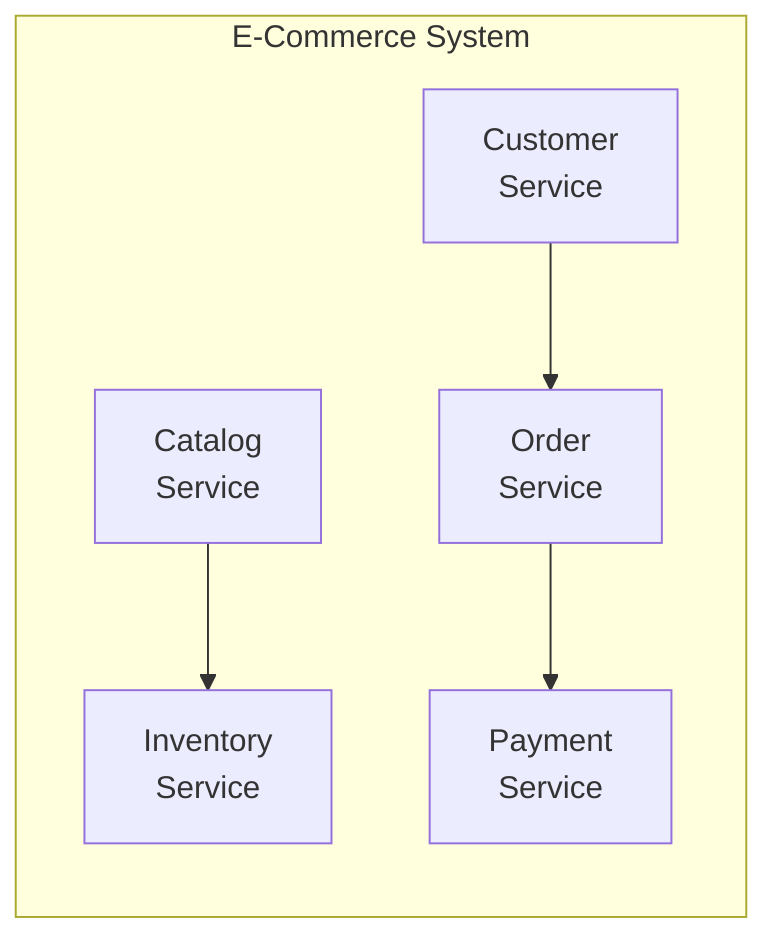

The important characteristics are not simply:

> "There are many services."

A typical microservices architecture emphasizes:

- Business-oriented boundaries.
- Independent deployment.
- Service ownership.
- Operational autonomy.
- Controlled communication.
- Independent scaling where useful.
- Reduced direct dependency on other services' internals.

A system with 50 tiny services but heavy coupling is not necessarily a well-designed microservices architecture.

---

# 2. The Core Idea: Autonomy

The most important word to understand is:

> **Autonomy**

A service should be able to perform its responsibility without requiring unnecessary coordination with many other services.

For example:

```text
Payment Service
----------------
Owns:
- Payment processing
- Payment status
- Refunds
- Payment-provider integration
```

The Payment team should ideally control:

```text
Code
Deployment
Operational configuration
Service behavior
Data ownership
```

Other teams consume the service through its contract.

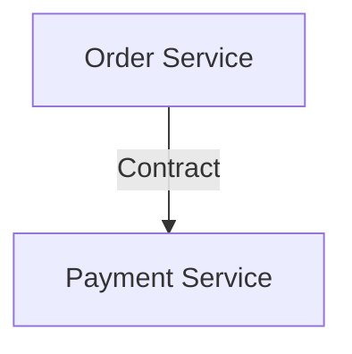

The Order Service should not need to know how the Payment Service internally works.

---

# 3. From Monolith to Microservices

The architectural shift is not:

```text
Few files → Many files
```

It is:

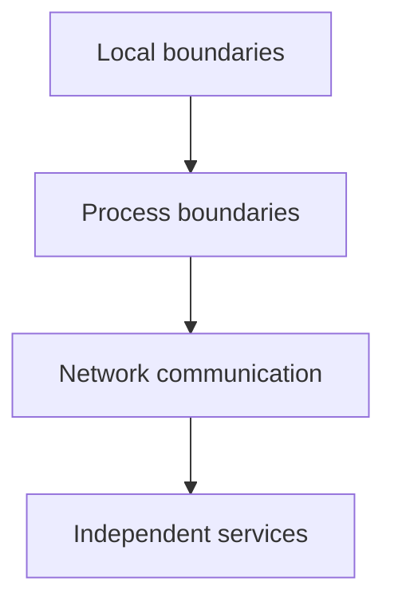

That shift creates both opportunities and costs.

---

# 4. Microservices Are Distributed Systems

This is one of the most important lessons.

A monolith may call another module like:

```text
OrderModule.createPayment()
```

That is an in-process call.

A microservice might call:

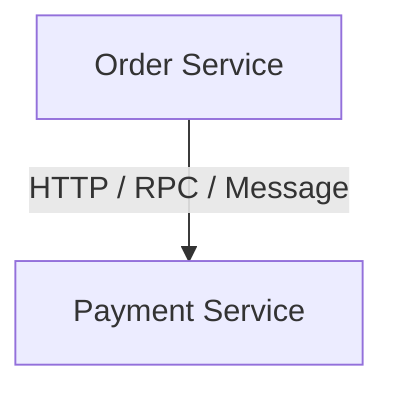

Now the network is involved.

The request can:

- Be delayed.
- Time out.
- Fail.
- Be duplicated.
- Reach an overloaded service.
- Return after the caller has already given up.

Therefore:

> **Microservices inherit the fundamental problems of distributed systems.**

You now need to think about:

- Timeouts.
- Retries.
- Idempotency.
- Service discovery.
- Health checks.
- Observability.
- Failure isolation.
- Data consistency.
- Versioning.

---

# 5. What Makes a Good Microservice?

A useful microservice usually has:

```text
Clear business responsibility
        +
Clear ownership
        +
Clear contract
        +
Controlled dependencies
        +
Independent lifecycle
```

For example:

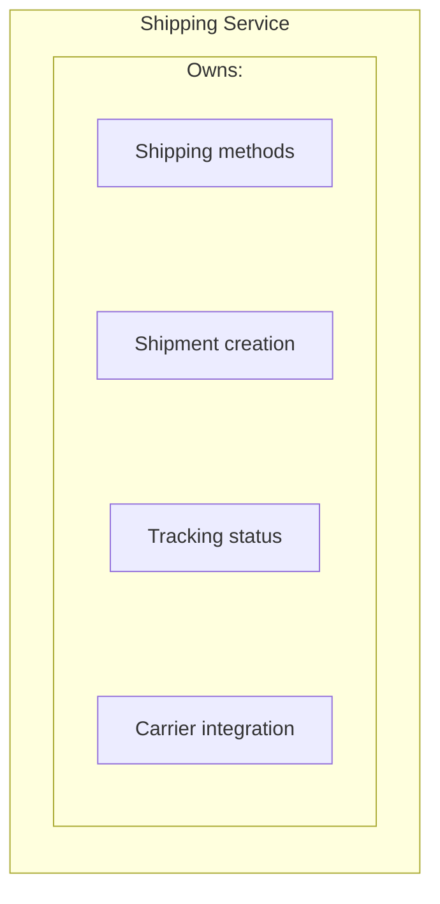

It should not simultaneously own:

```text
User authentication
Product catalog
Payment authorization
Email templates
```

unless those responsibilities genuinely belong together.

A good boundary creates **cohesion**.

---

# 6. Service Size Is Not the Main Definition

The word "micro" can cause confusion.

A microservice does not necessarily mean:

```text
100 lines of code
```

or:

```text
One function
```

or:

```text
One database table
```

A service can contain substantial code.

The important question is:

> **Does this service represent a coherent business capability that can be owned and evolved independently?**

For example:

```text
Order Service
```

may contain:

```text
Order creation
Order validation
Order state
Order cancellation
Order history
Order pricing rules
```

That can still be one coherent service.

---

# 7. Independent Deployment

One major microservices benefit is independent deployment.

Suppose:

```text
Payment Service
```

needs a bug fix.

In a well-designed microservices architecture:

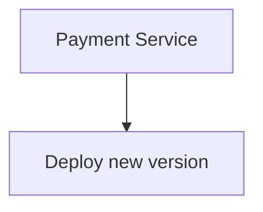

without necessarily redeploying:

```text
Customer
Catalog
Order
Shipping
Notification
```

This can improve release velocity.

Compare with a monolith:

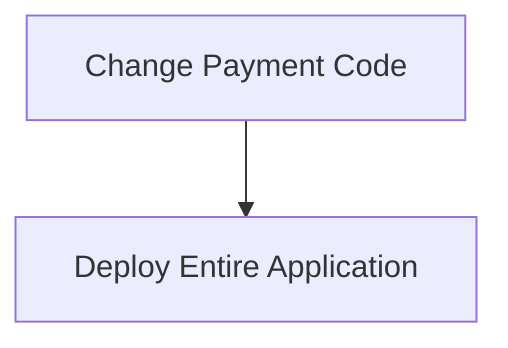

Microservices can reduce the deployment scope.

But independent deployment only works well when contracts and dependencies are managed carefully.

---

# 8. Independent Scaling

Different services may have very different workloads.

Suppose:

```text
Catalog Service
1000 req/sec

Payment Service
50 req/sec

Notification Service
10 req/sec
```

Scaling the entire monolith might mean:

```text
Scale everything
```

Microservices can allow:

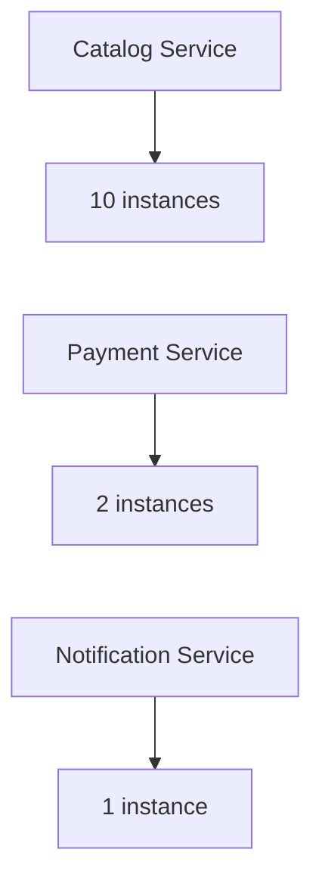

This is useful when workloads differ significantly.

But independent scaling is not automatically beneficial.

More instances also mean:

- More infrastructure.
- More connections.
- More monitoring.
- More deployment complexity.
- More operational overhead.

---

# 9. Database Per Service

You will often hear:

> **Database per service**

This means each service owns its persistent data boundary.

Conceptually:

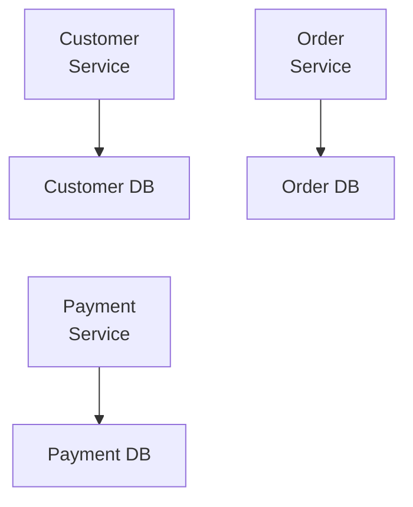

This does **not** necessarily mean every service must use a completely different database technology.

You could have:

```text
Customer Service → PostgreSQL database
Order Service    → PostgreSQL database
Payment Service  → PostgreSQL database
```

or different technologies where justified.

The key idea is:

> **The service owns its data and controls access to it.**

---

# 10. Synchronous Dependencies

Suppose:

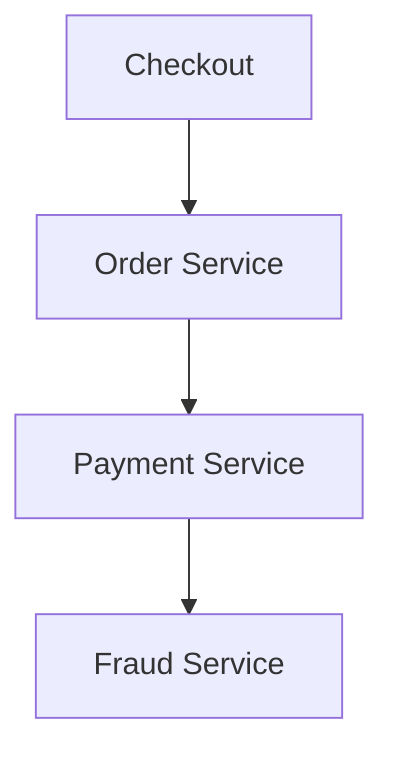

The request may depend on all three services.

If Fraud Service becomes slow:

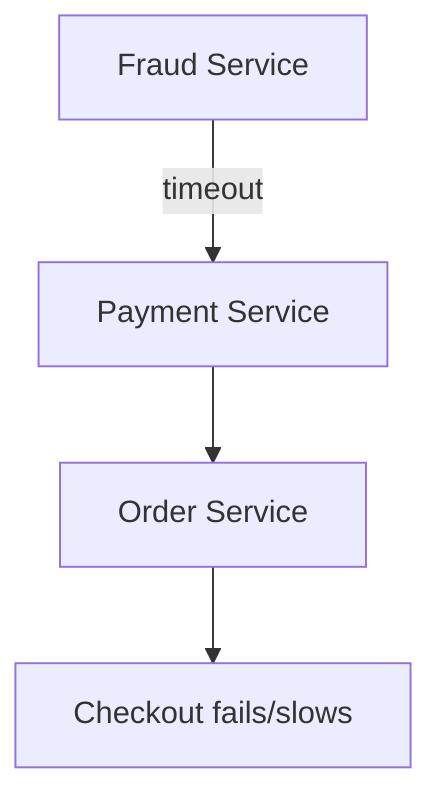

A service architecture can therefore create long dependency chains.

The number of services does not automatically improve performance.

Sometimes it creates additional latency.

---

# 11. Dependency Graph

It is useful to visualize service dependencies.

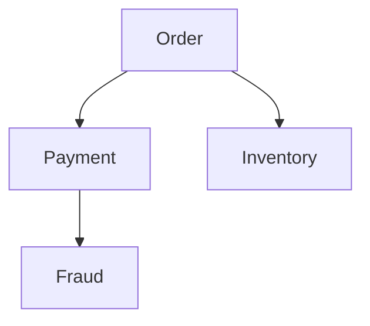

Now ask:

```text
What happens if Fraud fails?
```

This is why service boundaries must be evaluated together with dependency behavior.

A service can be logically independent but operationally critical.

---

# 12. Asynchronous Microservices

Not every operation needs immediate completion.

Suppose an order has been created.

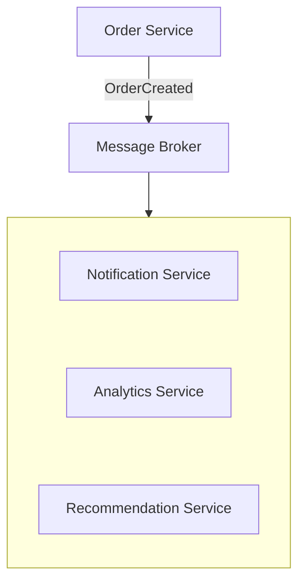

The Order Service does not need to wait for every consumer.

This can reduce synchronous coupling.

But the system now needs to handle:

- Delayed events.
- Duplicate messages.
- Ordering.
- Retries.
- Consumer failures.
- Eventual consistency.

Asynchronous architecture is powerful, but it changes the application's behavior.

---

# 13. Microservices and Transactions

A monolith can often perform a transaction across several modules using one database transaction.

For example:

```text
BEGIN
   Create Order
   Reserve Inventory
   Record Payment
COMMIT
```

With microservices:

```text
Order Service → Order DB
Payment Service → Payment DB
Inventory Service → Inventory DB
```

A single database transaction cannot automatically cover all three.

Now the system may need:

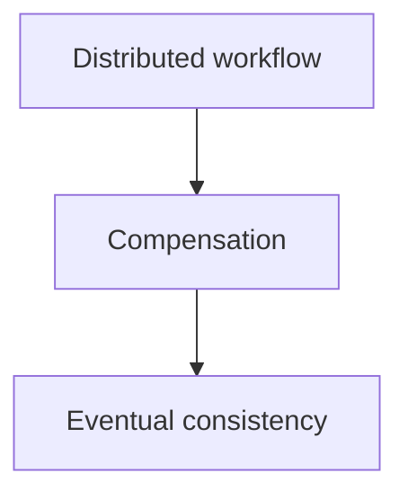

This is a major complexity increase.

Distributed transactions and the Saga pattern are covered later.

---

# 14. Failure Isolation

Microservices can improve failure isolation when boundaries are designed well.

Suppose:

```text
Recommendation Service
        X
```

If recommendations are optional:

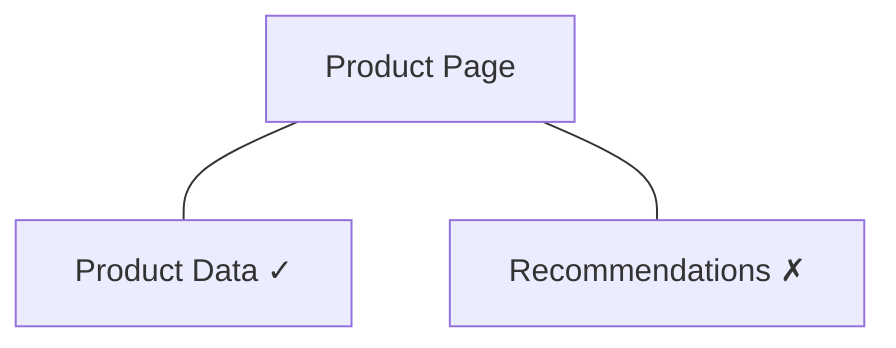

the core application can continue.

But poor architecture can create the opposite result.

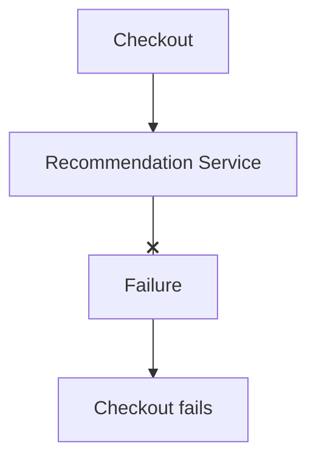

A service boundary alone does not provide resilience.

The system must explicitly design:

- Required vs optional dependencies.
- Timeouts.
- Fallbacks.
- Circuit breakers.
- Queues.
- Isolation.
- Failure handling.

---

# 15. Team Ownership

Microservices are often closely connected to organizational structure.

Imagine:

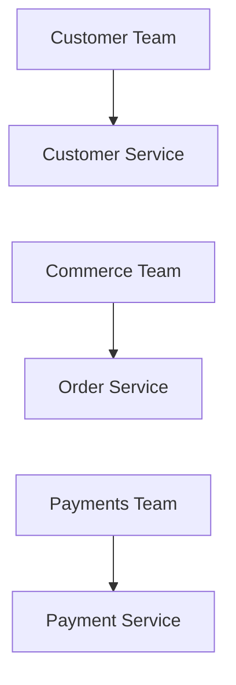

Each team can own its service.

Ownership may include:

```text
Code
Data
Deployment
Monitoring
On-call responsibility
Service documentation
Capacity planning
```

This can reduce coordination between teams.

But simply assigning different teams to different services does not automatically create autonomy.

If every team must coordinate for every change, the architecture is still highly coupled.

---

# 16. Technology Independence

Microservices can allow different services to use different technologies when there is a genuine reason.

For example:

```text
Customer Service → Java
Order Service    → Go
Recommendation   → Python
```

But this does not mean:

> "Use a different language for every service."

Technology diversity introduces:

- More operational knowledge.
- More build systems.
- More libraries.
- More security concerns.
- More debugging complexity.
- More hiring/training requirements.

Therefore:

> **Technology independence is an option, not a goal by itself.**

A consistent technology stack is often easier to operate.

---

# 17. Observability Becomes Essential

In a monolith:

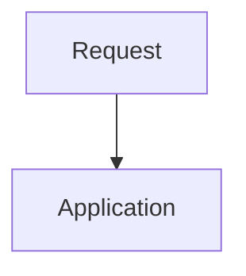

Debugging can often happen within one process.

In microservices:

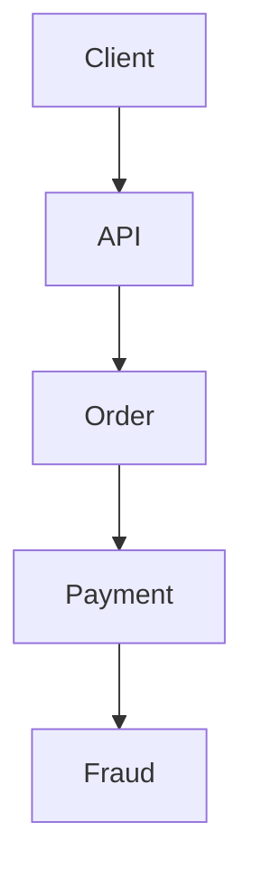

A failure can occur anywhere.

You need visibility into:

```text
Logs
Metrics
Traces
Request IDs
Service health
Latency
Error rates
Dependency behavior
```

For example:

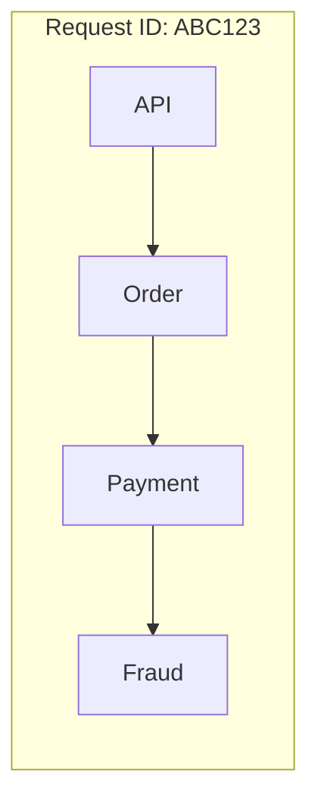

Distributed tracing can show where time was spent.

Observability becomes a fundamental operational requirement rather than an optional convenience.

---

# 18. Versioning and Contracts

Independent deployment creates an important problem.

Suppose:

```mermaid
flowchart TD
  accTitle: Before the contract change
  accDescr: Order Service v1, then Payment Service.
  N0["Order Service v1"] --> N1["Payment Service"]
```

Payment Service changes its contract.

If Order Service has not changed yet:

```mermaid
flowchart TD
  accTitle: An incompatible contract
  accDescr: The order service fails (X) against the incompatible contract.
  O["Order Service"] --x I["Incompatible contract"]
```

Therefore services need compatibility practices.

For example:

```text
Version 1
Version 2
```

or backward-compatible changes.

A useful rule is:

> **A service should evolve its contract without unexpectedly breaking existing consumers.**

Contract management becomes more important as the number of services grows.

---

# 19. Microservices and Operational Complexity

Compare:

### Monolith

```text
1 application
1 deployment
1 main runtime
1 operational unit
```

### Microservices

```text
20 services
20 deployments
20+ runtimes
Many service dependencies
Many logs
Many health checks
Many scaling decisions
```

The second system may provide more autonomy.

But it also creates more things to operate.

You may need:

- CI/CD pipelines.
- Service discovery.
- Centralized logging.
- Distributed tracing.
- Secrets management.
- Configuration management.
- Automated deployment.
- Health checks.
- Alerting.
- Capacity management.

Therefore:

> **Microservices move complexity from inside the application into the architecture and operations of the system.**

---

# 20. Microservices Are Not Automatically More Scalable

Consider a monolith:

```mermaid
flowchart TD
  accTitle: A scaled monolith
  accDescr: A load balancer in front of three app instances.
  R["Load Balancer"] --- K0["App"] & K1["App"] & K2["App"]
```

It can scale horizontally.

Now compare:

```mermaid
flowchart TD
  accTitle: Scaled services
  accDescr: A load balancer in front of the user, order, payment and catalog services.
  L["Load Balancer"] --> G
  subgraph G[" "]
    direction TB
    subgraph R1[" "]
      direction LR
      U["User"] ~~~ O["Order"]
    end
    subgraph R2[" "]
      direction LR
      P["Payment"] ~~~ C["Catalog"]
    end
    R1 ~~~ R2
  end
```

Microservices provide independent scaling.

But if the actual bottleneck is:

```text
Database
```

then adding more service instances may not solve the problem.

For example:

```mermaid
flowchart TD
  accTitle: The bottleneck remains
  accDescr: 20 Order instances, then One overloaded database.
  N0["20 Order instances"] --> N1["One overloaded database"]
```

The bottleneck remains.

This connects directly to the core system-design principle:

> **Scale the actual constraint, not the architecture diagram.**

---

# 21. When Microservices Make Sense

Microservices can make sense when there is a genuine need for:

### Independent scaling

```text
Search workload ≫ Payment workload
```

### Independent deployment

One capability changes much more frequently than others.

### Strong team ownership

Different teams need meaningful autonomy.

### Fault isolation

Some workloads need to fail independently.

### Different runtime requirements

One capability genuinely benefits from a different execution model.

### Large organizational boundaries

Many teams work on a large product and need clearer ownership.

### Domain boundaries

Business capabilities are well understood and relatively independent.

A combination of these factors can justify microservices.

---

# 22. When Microservices Don't Make Sense

Microservices may be a poor choice when:

- The application is small.
- The team is small.
- Requirements change rapidly.
- Domain boundaries are unclear.
- Traffic is modest.
- One database transaction solves the business problem.
- Operational infrastructure is limited.
- Services would constantly call each other.
- Independent deployment provides little value.
- The team cannot support distributed-system operations.

In these situations:

```mermaid
flowchart TD
  accTitle: Often simpler
  accDescr: Modular Monolith, then Often simpler.
  N0["Modular Monolith"] --> N1["Often simpler"]
```

may be the better architecture.

---

# 23. Realistic Example — E-Commerce

Suppose an e-commerce platform has:

```text
Customer
Catalog
Cart
Order
Payment
Shipping
Notification
```

Initially:

```text
Modular Monolith
```

The business grows.

Now:

```text
Catalog traffic = extremely high
Payment team = separate team
Shipping has complex integrations
Notifications can be asynchronous
```

The organization might selectively extract:

```text
Catalog Service
Payment Service
Shipping Service
Notification Service
```

while keeping:

```text
Cart + Order
```

together initially.

Architecture:

```mermaid
flowchart TD
  accTitle: Selective extraction
  accDescr: Catalog and customer services feed the order service, which calls payment and shipping; separately, order created goes through a message broker to notification.
  C["Customer<br/>Service"] --> O["Order<br/>Service"]
  K["Catalog<br/>Service"] --> O
  O --> P["Payment<br/>Service"] & S["Shipping<br/>Service"]
  P & S ~~~ E0
  E0["Order Created"] --> E1["Message Broker"] --> E2["Notification"]
```

This is more realistic than extracting every module immediately.

---

# 24. Hands-On Exercise

Start with this modular monolith:

```mermaid
flowchart TD
  accTitle: The modular monolith to start from
  accDescr: The e-commerce application holds customer, catalog, cart, order, payment, shipping and notification.
  subgraph G["E-Commerce Application"]
    direction TB
    I0["Customer | Catalog | Cart | Order"] ~~~ I1["Payment | Shipping | Notification"]
  end
```

## Task 1 — Identify boundaries

For each module, answer:

```text
What business capability does it own?
```

## Task 2 — Identify candidates

Choose the **two strongest candidates** for extraction.

Consider:

- Independent scaling.
- Independent deployment.
- Team ownership.
- Failure isolation.
- External integrations.
- Data ownership.

## Task 3 — Define ownership

For each selected service:

```text
Service:
Owns:
Data:
Consumers:
```

## Task 4 — Define one contract

For example:

```text
Payment Service

POST /payments

Input:
- orderId
- amount
- paymentMethod

Output:
- paymentId
- status
```

## Task 5 — Identify one failure

Ask:

> What happens if this service takes 5 seconds to respond?

Then decide:

```text
Timeout?
Retry?
Fallback?
Queue?
Fail request?
```

The purpose of the exercise is not to create the maximum number of services.

It is to practice identifying **useful boundaries**.

---

# 25. System Design View

Use this decision sequence:

```mermaid
flowchart TD
  accTitle: Before extracting a service
  accDescr: Requirement, business capability, then: clear boundary? No: keep together. Yes: does separation solve a problem? No: keep modular. Yes: define service, data ownership, service contract, communication model, failure and operations, measure result.
  N0["Requirement"] --> N1["Business Capability"] --> Q1
  subgraph R1[" "]
    direction TB
    Q1{"Clear Boundary?"} -->|"No"| K1["Keep together"]
  end
  subgraph R2[" "]
    direction TB
    Q2{"Does separation solve a problem?"} -->|"No"| K2["Keep modular"]
  end
  Q1 -->|"Yes"| Q2
  Q2 -->|"Yes"| S0["Define service"] --> S1["Data ownership"] --> S2["Service contract"] --> S3["Communication model"] --> S4["Failure + operations"] --> S5["Measure result"]
```

Ask these questions before extracting a service:

| Question | Why it matters |
|---|---|
| What business capability does it own? | Defines the boundary. |
| Does it have clear data ownership? | Prevents hidden coupling. |
| Does it need independent scaling? | Provides a concrete reason for separation. |
| Does it need independent deployment? | Creates release autonomy. |
| Does a team need independent ownership? | Provides organizational value. |
| Can it tolerate network failure? | Tests distributed-system readiness. |
| What happens when it is unavailable? | Reveals dependency risk. |
| Can the organization operate it? | Tests operational feasibility. |

---

# 26. Common Mistakes

### Mistake 1 — "Every module should become a microservice"

No.

Start with boundaries and constraints.

---

### Mistake 2 — Defining services by technical layers

Avoid:

```text
Database Service
Controller Service
Validation Service
Utility Service
```

Prefer meaningful business capabilities.

---

### Mistake 3 — Sharing database tables freely

This creates hidden coupling and weakens ownership.

---

### Mistake 4 — Making services too small

Tiny services can create excessive network calls and coordination.

---

### Mistake 5 — Ignoring synchronous dependency chains

```text
A → B → C → D → E
```

One slow service can affect the entire request.

---

### Mistake 6 — Assuming microservices automatically improve reliability

More services mean more possible failure points.

Reliability requires deliberate isolation and recovery design.

---

### Mistake 7 — Using different technologies everywhere

Technology diversity should solve a real problem.

---

### Mistake 8 — Ignoring operations

Microservices require deployment, monitoring, logging, tracing, configuration, security, and incident-management practices.

---

### Mistake 9 — Calling a distributed monolith "microservices"

If services cannot be changed, deployed, or operated independently because they are tightly coupled, the architecture may have distributed boundaries without meaningful autonomy.

---

### Mistake 10 — Starting with infrastructure instead of boundaries

Kubernetes, service meshes, containers, and gateways do not create good service boundaries.

Architecture comes first.

---

# Key Principle

> **Microservices are not primarily about making services small. They are about creating autonomous service boundaries around meaningful business capabilities so that parts of a system can be owned, deployed, scaled, and evolved with less coordination.**

That autonomy comes at a price:

```mermaid
flowchart TD
  accTitle: The price of autonomy
  accDescr: Autonomy + Independent scaling + Independent deployment + Team ownership, then Network boundaries, then Distributed-system complexity, then Latency Failures Consistency challenges Observability Operations.
  N0["Autonomy<br/>+<br/>Independent scaling<br/>+<br/>Independent deployment<br/>+<br/>Team ownership"] --> N1["Network boundaries"] --> N2["Distributed-system complexity"] --> N3["Latency<br/>Failures<br/>Consistency challenges<br/>Observability<br/>Operations"]
```

Therefore:

> **Use microservices when the benefits of service autonomy outweigh the complexity of distributing the system.**

---

# Quick Reference

```mermaid
flowchart TD
  accTitle: Microservices at a glance
  accDescr: The client reaches the API gateway, which routes to the customer, order and catalog services; the order service calls payment and shipping.
  N0["Client"] --> N1["API / Gateway"] --> C["Customer<br/>Service"] & O["Order<br/>Service"] & K["Catalog<br/>Service"]
  O --> P["Payment<br/>Service"] & S["Shipping<br/>Service"]
```

| Concept | Meaning |
|---|---|
| Microservice | Independently deployable service around a business capability |
| Autonomy | Ability to operate and evolve with limited coordination |
| Service boundary | Defines responsibility and ownership |
| Independent deployment | One service can be released without deploying the entire system |
| Independent scaling | Different services can scale according to their own workload |
| Data ownership | Service controls its own data and related business rules |
| Contract | Defined interaction between services |
| Distributed system | Services communicate across process/network boundaries |
| Database per service | Each service has a clear persistent-data ownership boundary |
| Failure isolation | Limiting how far one service failure spreads |
| Service dependency | One service relying on another service |
| Observability | Understanding system behavior through logs, metrics, and traces |

---

# Knowledge Check

### 1. What is the central idea behind microservices?

**Answer:**  
Organizing a system into autonomous, independently deployable services around meaningful business capabilities.

---

### 2. Does "microservice" mean a service must contain very little code?

**Answer:**  
No. The important property is a coherent business boundary and meaningful autonomy, not a specific number of lines of code.

---

### 3. Why are microservices distributed systems?

**Answer:**  
Their services normally communicate across independent process or network boundaries, introducing network latency, failures, timeouts, retries, and other distributed-system concerns.

---

### 4. Why is data ownership important?

**Answer:**  
Clear data ownership prevents services from depending directly on each other's internal database structures and helps preserve service autonomy.

---

### 5. Why can a shared database undermine microservices?

**Answer:**  
Direct access to shared tables creates schema, transaction, performance, and ownership coupling between services.

---

### 6. What is independent deployment?

**Answer:**  
The ability to deploy one service without requiring the entire application to be deployed at the same time.

---

### 7. Why don't microservices automatically improve scalability?

**Answer:**  
They enable independent scaling, but the actual bottleneck may still be a database, network, external dependency, or another constrained resource.

---

### 8. Why can microservices increase operational complexity?

**Answer:**  
Instead of operating one application, the organization must manage multiple services, deployments, dependencies, health checks, logs, metrics, traces, configurations, and failure scenarios.

---

### 9. Why can asynchronous communication be useful?

**Answer:**  
It can reduce synchronous dependency chains and allow work to be processed independently, although it introduces concerns such as delayed processing, retries, duplicates, and eventual consistency.

---

### 10. When should a modular monolith often remain the preferred architecture?

**Answer:**  
When the application is small or moderately sized, boundaries are still evolving, the team is small, operational simplicity matters, or service separation provides little concrete benefit.

---

# Remember

> **Microservices are a means, not the destination.**

The goal is not:

```text
More services
```

The goal is:

```mermaid
flowchart TD
  accTitle: The goal
  accDescr: Better boundaries, then Clear ownership, then Useful autonomy, then Independent evolution.
  N0["Better boundaries"] --> N1["Clear ownership"] --> N2["Useful autonomy"] --> N3["Independent evolution"]
```

And always remember:

> **Every network boundary is also a failure boundary.**

---

# Next Chapter

**07.05 — When Microservices Make Sense**

The next chapter will turn the architectural ideas from this chapter into a decision framework: **when the benefits of microservices genuinely justify their complexity, and what concrete constraints should trigger the move.**
