# 07.05 — When Microservices Make Sense

## Learning Objectives

By the end of this chapter, you will be able to:

- Identify the real problems microservices can solve.
- Recognize the strongest signals for introducing microservices.
- Distinguish genuine architectural constraints from weak reasons.
- Evaluate independent scaling, deployment, ownership, and fault isolation.
- Understand how organizational structure affects service boundaries.
- Decide whether to extract one service, several services, or none.
- Use a practical decision framework before adopting microservices.
- Explain why a modular monolith may still be the better choice.

---

# Beginner Vocabulary

| Term | Simple Meaning |
|---|---|
| **Constraint** | A limitation the system must work within. |
| **Autonomy** | Ability to operate and evolve with limited coordination. |
| **Independent scaling** | Scaling one part without scaling everything else. |
| **Independent deployment** | Releasing one service without releasing the whole application. |
| **Fault isolation** | Preventing one failure from unnecessarily affecting other parts. |
| **Team ownership** | One team has clear responsibility for a capability. |
| **Bounded context** | A domain boundary where concepts and rules have a specific meaning. |
| **Coupling** | How strongly components depend on one another. |
| **Cohesion** | How closely related the responsibilities inside a component are. |
| **Blast radius** | The part of the system affected by a failure. |
| **Bottleneck** | The component limiting overall system performance or capacity. |
| **Operational overhead** | Additional effort required to deploy, monitor, secure, and operate a system. |

---

# 1. The First Question

Before asking:

> **"Should we use microservices?"**

ask:

> **"What problem are we trying to solve?"**

This is the most important question in this chapter.

Suppose someone says:

```text
"We should use microservices."
```

Ask:

```text
Why?
```

Possible answers:

```text
"We need independent scaling."
"We have multiple teams."
"Deployments are blocking each other."
"One workload has different availability requirements."
"We need stronger fault isolation."
"We have many applications that need shared business capabilities."
```

These are potentially meaningful reasons.

But answers like:

```text
"Everyone uses microservices."
"Microservices are modern."
"Kubernetes is popular."
"Our competitor uses them."
"The application is getting big."
```

are not sufficient by themselves.

> **Architecture should respond to constraints, not fashion.**

---

# 2. The Default Should Not Be Microservices

For a new application, a reasonable starting point is often:

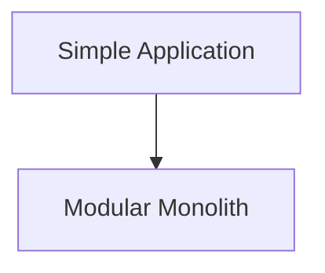

Then measure what happens.

If a real constraint appears:

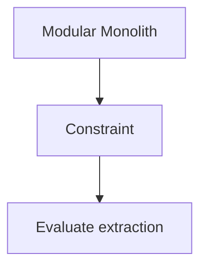

Only then should a service boundary be introduced.

This approach avoids distributing complexity before it is needed.

---

# 3. Signal #1 — Independent Scaling

One of the strongest reasons for microservices is when different parts of the system have dramatically different workloads.

Suppose an e-commerce application has:

```text
Catalog      → 10,000 req/sec
Orders       → 500 req/sec
Payments     → 100 req/sec
Admin        → 10 req/sec
```

With a monolith:

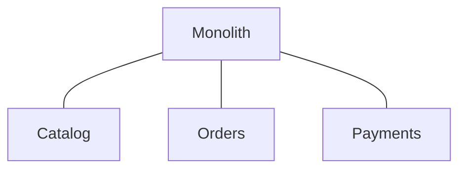

Scaling the application scales everything together.

With services:

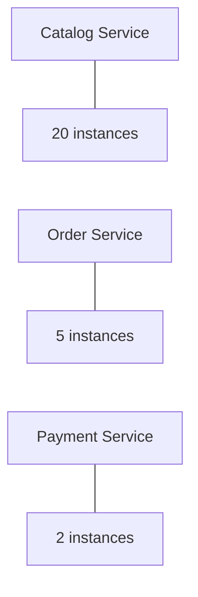

Now capacity can follow workload.

This is valuable when the difference is significant enough to justify the additional operational complexity.

---

# 4. When Independent Scaling Is Not Enough

Suppose the workloads are:

```text
Catalog   → 100 req/sec
Orders    → 80 req/sec
Payments  → 50 req/sec
```

The difference may not justify introducing several services.

You could simply run:

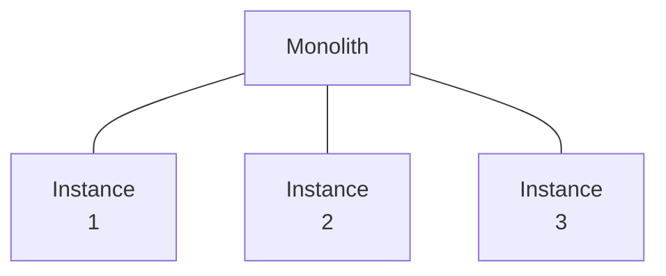

A monolith can scale horizontally.

Therefore:

> **"The system needs to scale" is not enough. The question is whether different parts need to scale independently.**

---

# 5. Signal #2 — Independent Deployment

Consider a large application.

The Payment component changes frequently.

The Catalog component changes rarely.

But every deployment currently requires:

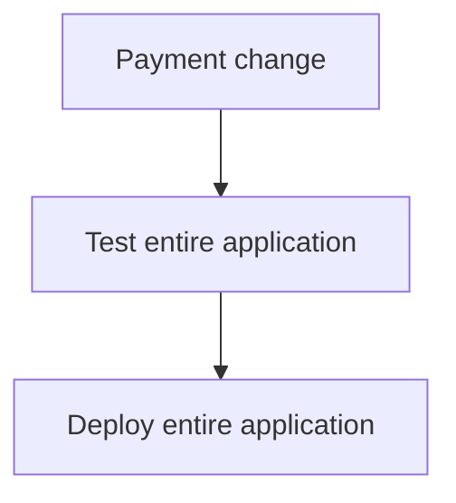

This can create coordination overhead.

With independent services:

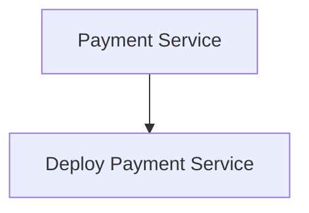

while:

```text
Catalog Service
Order Service
Customer Service
```

remain unchanged.

This can be valuable when:

- Release frequency differs significantly.
- Teams need release autonomy.
- The application is large enough that coordinated deployment is costly.
- Contracts between components are stable enough to support independent releases.

---

# 6. Deployment Independence Has a Requirement

Independent deployment only helps when the service is actually decoupled.

Consider:

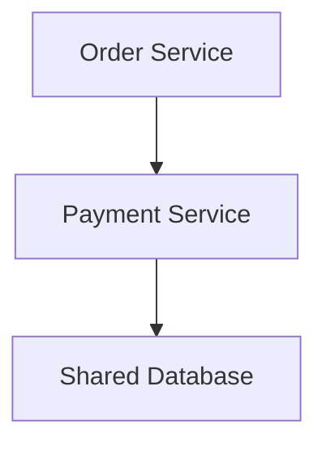

If changing Payment requires changing the shared database schema in a way that breaks Order:

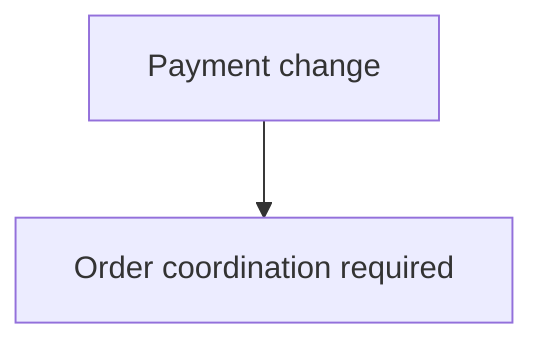

the services are not truly independent.

So ask:

> **Can this service evolve without requiring synchronized changes across the system?**

If not, the boundary may need improvement.

---

# 7. Signal #3 — Team Ownership

Large organizations may have many teams.

For example:

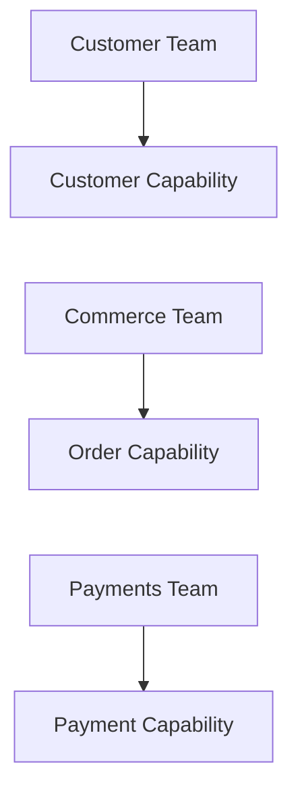

If one application becomes the shared responsibility of dozens of teams:

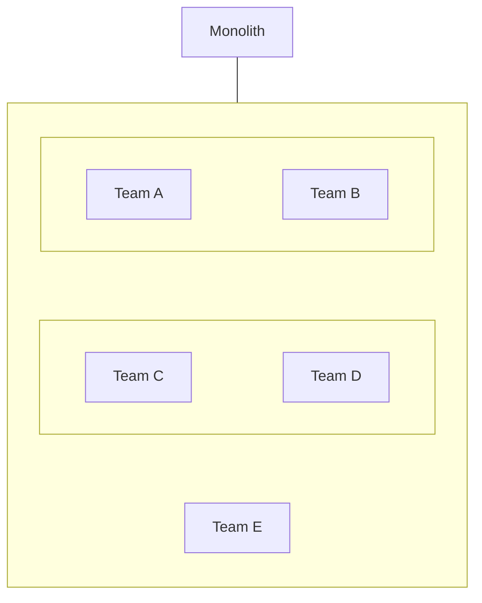

coordination can become expensive.

Clear service boundaries can allow teams to own meaningful capabilities.

For example:

```text
Team A → Customer Service
Team B → Order Service
Team C → Payment Service
```

The architecture can then reflect organizational ownership.

---

# 8. Conway's Law

A useful architectural principle is **Conway's Law**:

> Organizations tend to produce systems that reflect their communication structures.

If teams are organized around clear business capabilities:

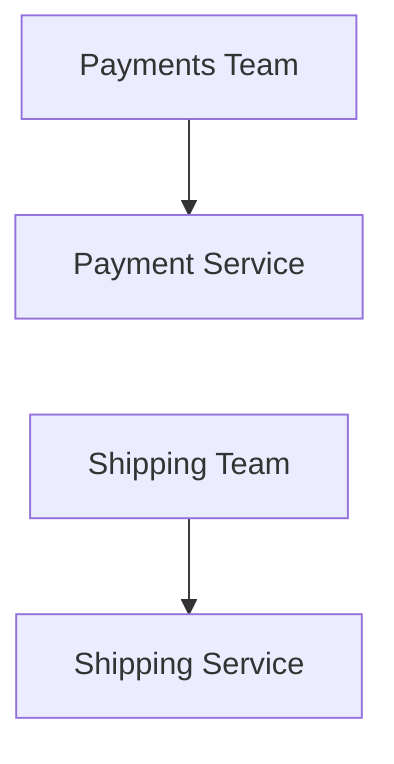

the architecture may naturally develop similar boundaries.

This does not mean:

> "Create one service per team."

That would be too simplistic.

Instead:

> **Service boundaries and team boundaries should be designed with awareness of each other.**

Poorly aligned ownership can create constant coordination.

---

# 9. Signal #4 — Fault Isolation

Suppose an application has:

```text
Video Processing
```

and:

```text
Checkout
```

Video processing can consume large amounts of CPU and memory.

If it runs inside the same application as checkout:

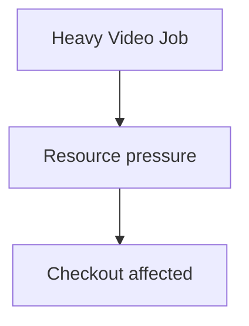

Separating the workload can provide stronger isolation:

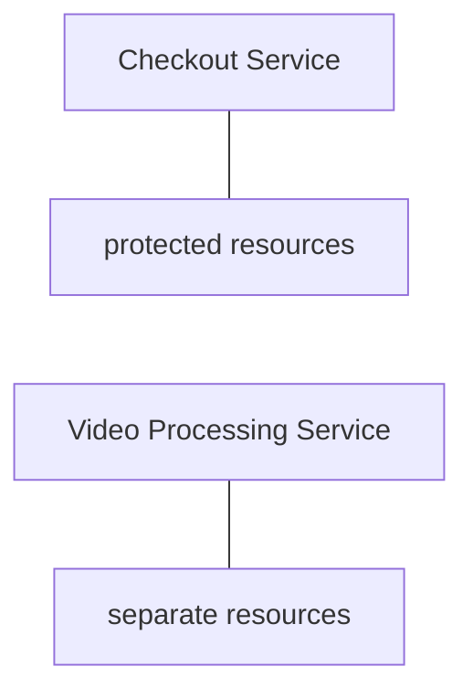

Now a failure or resource spike in video processing is less likely to directly consume checkout capacity.

This is useful when workloads have substantially different resource or reliability characteristics.

---

# 10. Fault Isolation Is Not Automatic

Simply creating a service does not guarantee isolation.

Suppose:

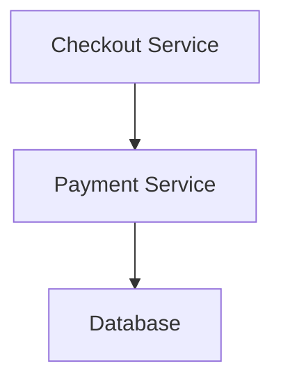

If every service depends on one database:

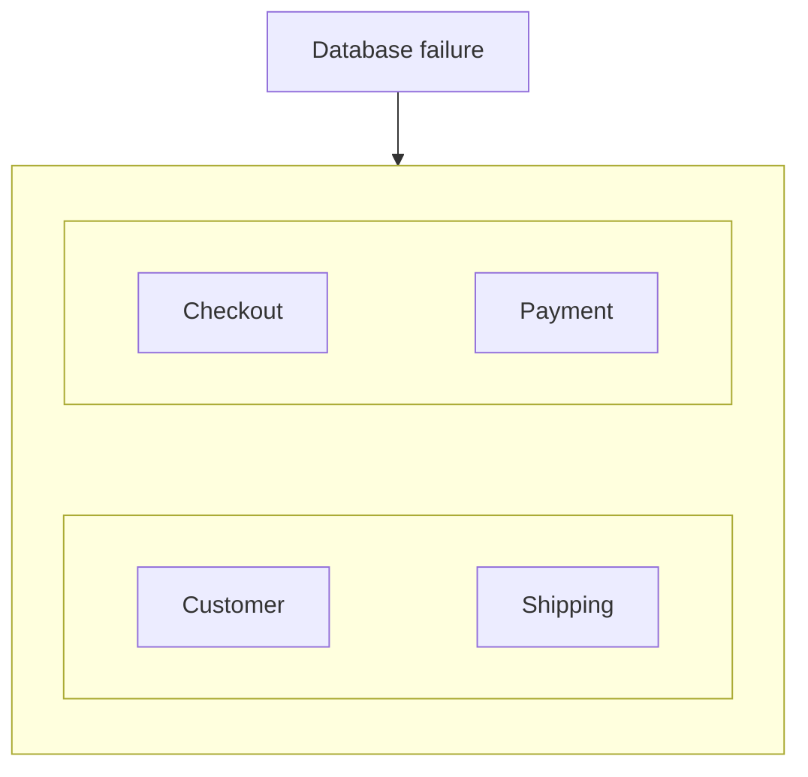

the common dependency still creates a large blast radius.

Therefore:

> **Service boundaries can improve fault isolation only when the surrounding architecture also supports meaningful isolation.**

Consider:

- Compute resources.
- Databases.
- Queues.
- Network paths.
- Failure domains.
- Shared infrastructure.
- External dependencies.

---

# 11. Signal #5 — Strong Business Boundaries

Some business domains have naturally strong boundaries.

For example:

```text
Payment
Shipping
Inventory
```

may have different:

- Rules.
- Teams.
- Data ownership.
- External integrations.
- Security requirements.
- Change rates.

This can make service boundaries easier to define.

A useful question is:

> **Can I clearly explain what this capability owns and what it does not own?**

If yes, a service boundary may be viable.

If the answer is:

```text
"It depends on five other modules."
```

then extraction may be premature.

---

# 12. Signal #6 — Different Technology Requirements

Sometimes one capability genuinely has different technical requirements.

For example:

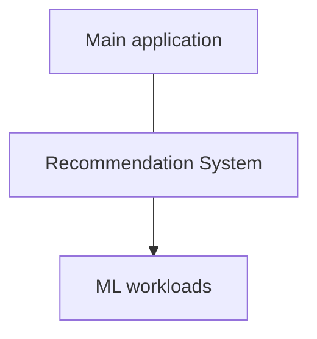

The recommendation system may need:

- Python libraries.
- GPU processing.
- Specialized data pipelines.
- Different scaling characteristics.

Separating it may make sense.

But avoid:

```text
Java Service
Go Service
Python Service
Rust Service
Node.js Service
```

simply because different languages are available.

Technology diversity has a cost.

> **Use technological independence when it solves a real problem, not as an architectural trophy.**

---

# 13. Signal #7 — Legacy System Integration

Large organizations often have existing systems.

For example:

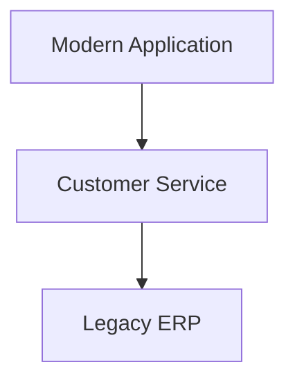

A service can provide a controlled boundary around the legacy system.

Instead of:

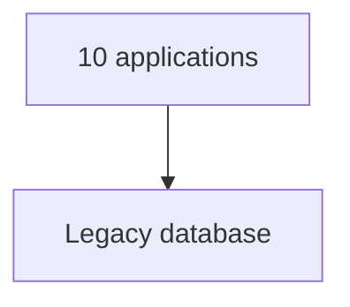

you may have:

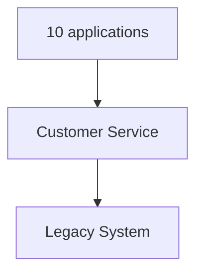

The service can hide legacy implementation details.

This is particularly useful in enterprise environments where replacing existing systems immediately is unrealistic.

---

# 14. Signal #8 — Different Reliability Requirements

Suppose:

```text
Product Recommendations
```

can tolerate occasional failure.

But:

```text
Payment Processing
```

requires much stricter correctness and operational controls.

Separating them can make it easier to apply different:

- Capacity planning.
- Deployment policies.
- Monitoring.
- Access controls.
- Failure handling.
- Recovery strategies.

For example:

```mermaid
flowchart TD
  accTitle: Different reliability requirements
  accDescr: Recommendations use graceful degradation; payment requires strict correctness.
  A0["Recommendations"] --- A1["graceful degradation"]
  B0["Payment"] --- B1["strict correctness"]
  A1 ~~~ B0
```

The boundary can help align architecture with business importance.

---

# 15. Signal #9 — Different Data Ownership

Suppose:

```text
Customer
Order
Payment
```

have clearly different ownership.

A service boundary can make that ownership explicit:

```mermaid
flowchart TD
  accTitle: Explicit data ownership
  accDescr: The customer service owns customer data, the order service order data, the payment service payment data.
  A0["Customer Service"] --> A1["Customer Data"]
  B0["Order Service"] --> B1["Order Data"]
  C0["Payment Service"] --> C1["Payment Data"]
  A1 ~~~ B0
  B1 ~~~ C0
```

This can be especially useful when teams need to evolve their data models independently.

But if the domains constantly require cross-service transactions and shared writes:

```text
A → B → C → D
```

separation may create significant complexity.

---

# 16. A Strong Signal: Pain From the Current Architecture

Sometimes the strongest evidence is operational pain.

For example:

```mermaid
flowchart TD
  accTitle: Pain from the current architecture
  accDescr: The current monolith: deployments take 2 hours, catalog scaling requires scaling everything, payment changes block other teams, video processing consumes checkout resources.
  H["Current Monolith"] --- G
  subgraph G[" "]
    direction TB
    I0["Deployments take 2 hours"] ~~~ I1["Catalog scaling requires scaling everything"] ~~~ I2["Payment changes block other teams"] ~~~ I3["Video processing consumes checkout resources"]
  end
```

Now there are concrete constraints.

You can evaluate:

```text
Which boundary solves which problem?
```

For example:

```mermaid
flowchart TD
  accTitle: Which boundary solves which problem
  accDescr: Catalog scaling problem leads to a catalog service, payment deployment problem to a payment service, video resource isolation problem to a video processing service.
  A0["Catalog scaling problem"] --> A1["Catalog Service"]
  B0["Payment deployment problem"] --> B1["Payment Service"]
  C0["Video resource isolation problem"] --> C1["Video Processing Service"]
  A1 ~~~ B0
  B1 ~~~ C0
```

This is far better than decomposing everything at once.

---

# 17. The Extraction Principle

A useful rule is:

> **Extract the smallest useful boundary that solves a real constraint.**

Suppose:

```mermaid
flowchart TD
  accTitle: A monolith
  accDescr: The monolith holds customer, catalog, orders, payments and shipping.
  subgraph G["Monolith"]
    direction TB
    I0["Customer"] ~~~ I1["Catalog"] ~~~ I2["Orders"] ~~~ I3["Payments"] ~~~ I4["Shipping"]
  end
```

The actual problem is:

```text
Payment requires independent deployment.
```

You do not necessarily need:

```text
Customer Service
Catalog Service
Order Service
Payment Service
Shipping Service
```

You may only need:

```mermaid
flowchart TD
  accTitle: Selective extraction
  accDescr: The monolith alongside one payment service.
  M["Monolith"] --- P["Payment Service"]
```

This is **selective extraction**.

---

# 18. Avoid the "Big Bang" Migration

A common mistake is:

```mermaid
flowchart TD
  accTitle: A big-bang rewrite
  accDescr: Existing Monolith, then Rewrite everything, then 20 Microservices.
  N0["Existing Monolith"] --> N1["Rewrite everything"] --> N2["20 Microservices"]
```

This creates enormous risk.

Instead:

```mermaid
flowchart TD
  accTitle: Incremental extraction
  accDescr: Monolith, extract one capability, measure, extract the next capability if justified, evolve.
  N0["Monolith"] -->|"Extract one capability"| N1["Measure"] -->|"Extract next capability if justified"| N2["Evolve"]
```

This gives the organization an opportunity to learn.

---

# 19. Microservices Readiness

Before introducing microservices, evaluate whether the organization can operate them.

Ask:

### Development

```text
Can teams own services?
```

### Deployment

```text
Can we deploy services safely?
```

### Observability

```text
Can we trace requests across services?
```

### Operations

```text
Can we monitor dozens of independent processes?
```

### Security

```text
Can we manage service identities and credentials?
```

### Data

```text
Can we handle service-owned data and cross-service workflows?
```

### Reliability

```text
Can we handle partial failures?
```

If the answer to most of these is:

```text
No
```

then introducing many microservices may create more problems than it solves.

---

# 20. Organizational Scale Matters

Microservices can be useful for large organizations because coordination itself becomes a constraint.

Imagine:

```text
10 developers
1 application
```

versus:

```text
500 developers
40 teams
1 application
```

The second organization may have problems such as:

```text
Merge conflicts
Release coordination
Ownership confusion
Different release schedules
Different scaling requirements
```

Microservices can provide boundaries around team ownership.

But organizational size alone does not justify microservices.

A well-designed modular monolith can still support a surprisingly large system.

---

# 21. Traffic Scale Is Not the Only Reason

A common misconception is:

> "Microservices are only for huge traffic."

Not necessarily.

A smaller system may need service separation because of:

```text
Team ownership
Legacy integration
Security boundaries
Different workloads
Independent deployment
Fault isolation
```

Conversely, a very high-traffic system may still use a monolith if:

```text
The architecture is well structured
The workload scales uniformly
The team can operate it effectively
```

Therefore:

> **Traffic is one constraint, not the definition of when microservices make sense.**

---

# 22. A Decision Matrix

Use a simple evaluation:

| Requirement | Microservices Value |
|---|---|
| Independent scaling | **High** |
| Independent deployment | **High** |
| Strong team ownership | **High** |
| Fault isolation | **High** |
| Legacy integration | **High** |
| Different technology requirements | **Medium–High** |
| Clear business boundaries | **High** |
| Very small application | **Low** |
| Unclear domain boundaries | **Low** |
| Small team with limited operations | **Low** |
| One simple transaction-heavy workflow | **Low** |
| "Microservices are modern" | **None** |

This is not a mathematical scoring system.

It is a thinking tool.

---

# 23. A Practical Decision Framework

Use this sequence:

```mermaid
flowchart TD
  accTitle: A practical decision framework
  accDescr: Start, what is the problem? Is there a real constraint? No: keep modular architecture. Yes: can a boundary solve it? No: keep local. Yes: define boundary, data ownership, service contract, failure behavior, operational cost, extract small, measure.
  N0["Start"] --> N1["What is the problem?"] --> Q1
  subgraph R1[" "]
    direction TB
    Q1{"Is there a real constraint?"} -->|"No"| K1["Keep modular architecture"]
  end
  subgraph R2[" "]
    direction TB
    Q2{"Can a boundary solve it?"} -->|"No"| K2["Keep local"]
  end
  Q1 -->|"Yes"| Q2
  Q2 -->|"Yes"| S0["Define boundary"] --> S1["Data ownership"] --> S2["Service contract"] --> S3["Failure behavior"] --> S4["Operational cost"] --> S5["Extract small"] --> S6["Measure"]
```

The key decision is not:

```text
Monolith vs Microservices
```

It is:

> **Does this particular service boundary provide enough value to justify its distributed-system cost?**

---

# 24. Example — E-Commerce Evolution

### Stage 1

```text
Traffic: 100 req/sec
Team: 5 developers
Region: 1
```

Architecture:

```text
Modular Monolith
```

No strong reason to distribute.

---

### Stage 2

Catalog traffic becomes:

```text
10,000 req/sec
```

while payments remain:

```text
100 req/sec
```

Now independent scaling becomes useful.

Potential extraction:

```text
Catalog Service
```

---

### Stage 3

The payment team becomes a separate organization with strict deployment and security requirements.

Potential extraction:

```text
Payment Service
```

---

### Stage 4

Shipping integrates with multiple external carriers and has a different operational lifecycle.

Potential extraction:

```text
Shipping Service
```

The resulting system might be:

```mermaid
flowchart TD
  accTitle: The evolved e-commerce system
  accDescr: The catalog and customer services feed the order service, which calls the payment and shipping services.
  K["Catalog<br/>Service"] --> O["Order<br/>Service"]
  C["Customer<br/>Service"] --> O
  O --> P["Payment<br/>Service"] & S["Shipping<br/>Service"]
```

The architecture evolved because constraints appeared.

---

# 25. What If Only One Part Needs Microservices?

That's perfectly valid.

You do not need:

```text
Everything = microservices
```

You can have:

```mermaid
flowchart TD
  accTitle: A hybrid architecture
  accDescr: The modular monolith holds customer, order and admin; a payment service sits beside it.
  subgraph G["Modular Monolith"]
    direction TB
    I0["Customer"] ~~~ I1["Order"] ~~~ I2["Admin"]
  end
  G --- P["Payment Service"]
```

This is a **hybrid architecture**.

The goal is not architectural purity.

The goal is solving real problems.

---

# 26. Hands-On Exercise

Start with:

```mermaid
flowchart TD
  accTitle: The e-commerce monolith
  accDescr: The e-commerce monolith holds customer, catalog, cart, orders, payment, shipping and notification.
  subgraph G["E-Commerce Monolith"]
    direction TB
    I0["Customer | Catalog | Cart | Orders"] ~~~ I1["Payment | Shipping | Notification"]
  end
```

### Scenario A

```text
Traffic:
500 req/sec

Team:
6 developers

Region:
1

Database:
One relational database

Deployment:
Once per week
```

**Question:**

Would you introduce microservices?

Explain why.

---

### Scenario B

Now change the requirements:

```text
Catalog:
20,000 req/sec

Orders:
500 req/sec

Payment:
100 req/sec

Teams:
Catalog, Commerce, Payments are separate teams

Payment:
Requires independent deployment

```

**Question:**

Which services would you consider extracting first?

---

### Scenario C

Add:

```text
Shipping:
10 external carrier integrations

Notification:
Can tolerate delayed processing
```

**Question:**

Would you make both services synchronous dependencies of checkout?

Why or why not?

---

# 27. Lab Challenge

Create a simple decision table:

| Capability | Independent Scaling? | Independent Deployment? | Separate Team? | Strong Boundary? | Extract? |
|---|---:|---:|---:|---:|---:|
| Customer | No | No | No | Medium | ? |
| Catalog | Yes | Yes | Yes | High | ? |
| Orders | No | No | Yes | High | ? |
| Payments | Yes | Yes | Yes | High | ? |
| Notifications | No | Yes | No | High | ? |
| Admin | No | No | No | Low | ? |

For each capability, write one sentence explaining your decision.

The goal is not to maximize the number of "Yes" answers.

The goal is to justify every extraction.

---

# 28. System Design View

When deciding whether microservices make sense, think in this order:

```mermaid
flowchart TD
  accTitle: The order of thinking
  accDescr: Requirement, then Constraint, then Current bottleneck, then Business capability, then Potential service boundary, then Expected benefit, then Distributed-system cost, then Operational readiness, then Smallest useful extraction, then Measure.
  N0["Requirement"] --> N1["Constraint"] --> N2["Current bottleneck"] --> N3["Business capability"] --> N4["Potential service boundary"] --> N5["Expected benefit"] --> N6["Distributed-system cost"] --> N7["Operational readiness"] --> N8["Smallest useful extraction"] --> N9["Measure"]
```

A good architecture decision sounds like:

> "We are extracting Catalog because its workload is 40× larger than the rest of the application and it requires independent scaling."

A weak decision sounds like:

> "We are extracting Catalog because microservices are best practice."

The first is architecture.

The second is fashion.

---

# 29. Cost-Benefit Test

Before extracting a service, compare:

### Benefits

```text
Independent scaling
Independent deployment
Team autonomy
Fault isolation
Technology independence
Clear ownership
```

### Costs

```text
Network communication
Latency
Partial failure
Distributed transactions
Data synchronization
Observability
Deployment infrastructure
Security
Operational overhead
```

Conceptually:

```mermaid
flowchart TD
  accTitle: Benefits against costs
  accDescr: Service extraction has benefits, which must justify the complexity, and costs, which must be accepted and managed.
  S["Service Extraction"] --- B["Benefits"] & C["Costs"]
  B --- BJ["Must justify<br/>the complexity"]
  C --- CA["Must be accepted<br/>and managed"]
```

If the benefits are small:

```text
Keep it modular.
```

If the benefits are substantial:

```text
Consider extraction.
```

---

# 30. Common Mistakes

### Mistake 1 — "The application is large, so we need microservices"

Size alone is not enough.

A large modular monolith can still be effective.

---

### Mistake 2 — "High traffic means microservices"

High traffic may require scaling, but a monolith can scale horizontally.

The important question is whether workloads need independent scaling.

---

### Mistake 3 — "One service per team"

Teams and services should align where useful, but the relationship is not automatically one-to-one.

---

### Mistake 4 — Extracting everything at once

Prefer incremental extraction.

---

### Mistake 5 — Ignoring operational maturity

Multiple services require stronger deployment, monitoring, security, and debugging capabilities.

---

### Mistake 6 — Creating a service without data ownership

If another service still controls its tables, autonomy may be mostly superficial.

---

### Mistake 7 — Ignoring network cost

A local method call becoming a network request is a significant architectural change.

---

### Mistake 8 — Assuming every boundary improves reliability

Shared databases, shared infrastructure, and long dependency chains can still create large blast radii.

---

### Mistake 9 — Optimizing for architecture purity

Hybrid systems are perfectly valid.

---

### Mistake 10 — Starting with tools

Kubernetes, containers, service meshes, and gateways are implementation tools.

They are not reasons to create services.

---

# Key Principle

> **Microservices make sense when a real constraint creates enough value for service autonomy to justify the cost of distributed architecture.**

The strongest reasons usually involve:

```text
Independent scaling
Independent deployment
Team ownership
Fault isolation
Strong business boundaries
Legacy integration
Different operational requirements
```

But no single factor automatically requires microservices.

The correct sequence is:

```mermaid
flowchart TD
  accTitle: The correct sequence
  accDescr: Requirement, then Constraint, then Boundary, then Benefit, then Distributed cost, then Decision.
  N0["Requirement"] --> N1["Constraint"] --> N2["Boundary"] --> N3["Benefit"] --> N4["Distributed cost"] --> N5["Decision"]
```

---

# Quick Reference

| Question | If "Yes" |
|---|---|
| Does this capability need independent scaling? | Strong reason |
| Does it need independent deployment? | Strong reason |
| Does a team need clear ownership? | Strong reason |
| Does it need meaningful fault isolation? | Strong reason |
| Is the business boundary clear? | Good candidate |
| Does it integrate with legacy systems? | Potentially strong reason |
| Does it need a different technology? | Consider carefully |
| Is traffic simply high? | Not enough by itself |
| Is the application simply large? | Not enough by itself |
| Is microservices fashionable? | Not a reason |
| Are boundaries unclear? | Keep modular |
| Is the team too small to operate services? | Prefer simpler architecture |

---

# Knowledge Check

### 1. What should you ask before deciding to use microservices?

**Answer:**  
Ask what concrete problem or constraint the architecture is intended to solve.

---

### 2. Does high traffic automatically require microservices?

**Answer:**  
No. A monolith can scale horizontally. Microservices become particularly useful when different parts of the system need to scale independently.

---

### 3. Why can independent deployment justify a service boundary?

**Answer:**  
If one capability changes frequently or needs to be released independently, separating it can reduce deployment coordination and risk.

---

### 4. How can organizational structure influence service boundaries?

**Answer:**  
Clear service boundaries can give teams ownership of meaningful business capabilities and reduce coordination when teams need to develop and operate those capabilities independently.

---

### 5. Does creating a service automatically provide fault isolation?

**Answer:**  
No. Shared databases, shared infrastructure, network dependencies, and other common failure domains can still create a large blast radius.

---

### 6. Why is selective extraction preferable to a big-bang migration?

**Answer:**  
It limits risk, allows the organization to learn from each extraction, and ensures that new services are created in response to actual constraints.

---

### 7. Is one service per team a good rule?

**Answer:**  
No. Team and service boundaries can align, but the relationship should be based on business capabilities, ownership, dependencies, and organizational needs.

---

### 8. When might a modular monolith be better?

**Answer:**  
When the system has unclear boundaries, modest or uniform workload, a small team, simple transactions, limited operational capacity, or no strong reason for independent services.

---

### 9. What is the strongest general rule for service extraction?

**Answer:**  
Extract the smallest useful boundary that solves a real constraint.

---

### 10. Can a system use both a monolith and microservices?

**Answer:**  
Yes. A hybrid architecture can keep most functionality in a modular monolith while extracting only capabilities that have a strong reason to operate independently.

---

# Remember

> **Do not ask, "Can we turn this into microservices?"**

Ask:

> **"What constraint would become easier to solve if this capability became an independent service?"**

If you cannot identify a convincing answer, the boundary probably does not need to exist yet.

---

# Next Chapter

**07.06 — When Microservices Don't**

The next chapter examines the other side of the decision: **when microservices create more complexity than value, the warning signs of premature decomposition, and why a well-designed modular monolith can remain the better architecture.**
