# 07.06 — When Microservices Don't

## Learning Objectives

By the end of this chapter, you will be able to:

- Recognize situations where microservices create more cost than value.
- Identify the warning signs of premature decomposition.
- Understand why small teams often benefit from simpler architectures.
- Recognize when strong transactions and shared data favor a monolith.
- Understand why unclear business boundaries are dangerous service boundaries.
- Identify operational costs introduced by distributed services.
- Explain why high traffic alone does not require microservices.
- Use a clear framework to decide when to stay with a monolith, adopt a modular monolith, or extract services.

---

# 1. The Important Question

The previous chapter asked:

> **When do microservices make sense?**

This chapter asks the equally important question:

> **When should you NOT use microservices?**

Microservices are powerful, but they are not free.

Moving from:

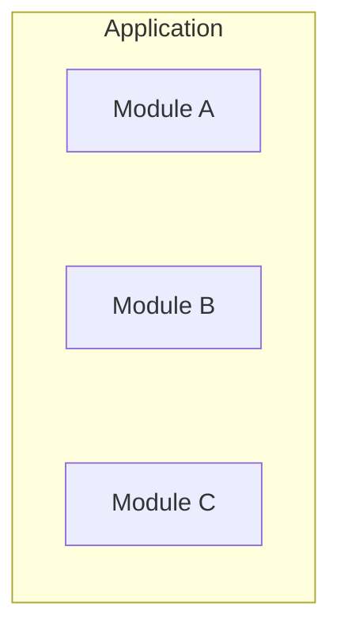

to:

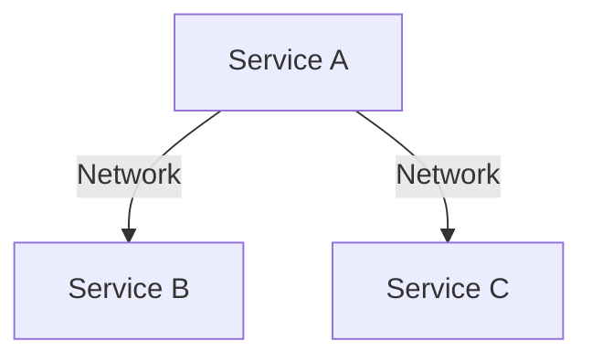

introduces new problems:

- Network latency.
- Timeouts.
- Retries.
- Partial failure.
- Service discovery.
- Distributed tracing.
- Deployment coordination.
- Data consistency.
- Distributed transactions.
- More infrastructure.
- More monitoring.
- More security boundaries.

Therefore:

> **If microservices do not solve a meaningful problem, their distributed-system cost is usually unnecessary.**

---

# Beginner Vocabulary

| Term | Simple Meaning |
|---|---|
| **Premature decomposition** | Splitting an application before there is a real reason to do so. |
| **Distributed complexity** | Additional complexity caused by components communicating over a network. |
| **Coordination cost** | Time and effort required to make multiple components or teams work together. |
| **Coupling** | How strongly one component depends on another. |
| **Transaction** | A group of operations that should succeed or fail as one unit. |
| **Chatty communication** | Excessive back-and-forth communication between services. |
| **Distributed transaction** | A business operation spanning multiple independently managed services. |
| **Operational maturity** | The ability to deploy, monitor, debug, secure, and operate a system reliably. |
| **Service sprawl** | Having more services than the organization can reasonably manage. |
| **Boundary** | A defined separation of responsibility or ownership. |
| **Monolith** | An application deployed as one major unit. |
| **Modular monolith** | One deployment with strong internal business boundaries. |

---

# 2. Microservices Are Not an Upgrade Path

A common mental model is:

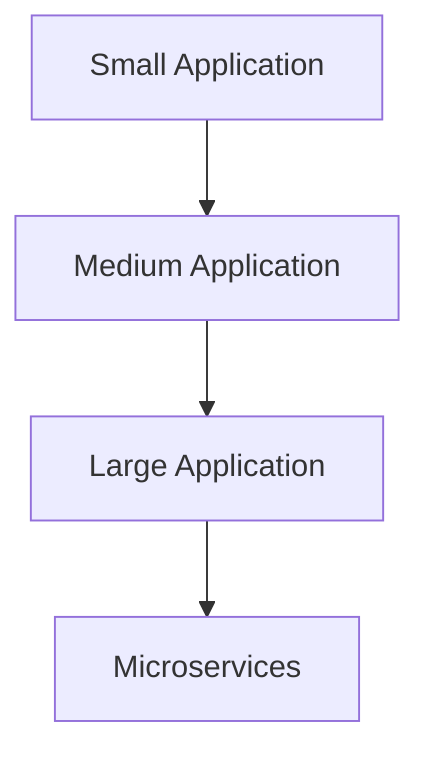

This suggests that every successful application must eventually become microservices.

That is false.

A better model is:

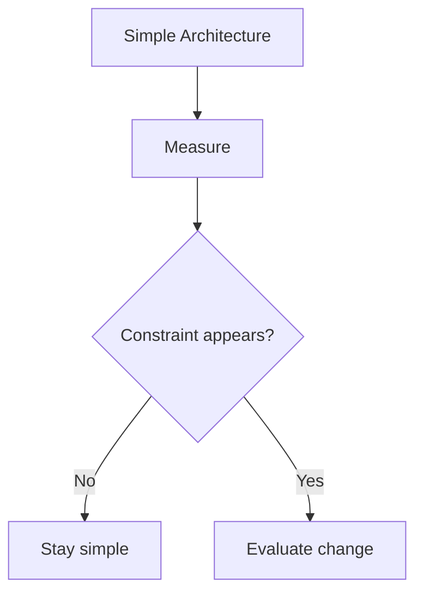

The architecture should evolve because the system's requirements evolve.

Not because the system has reached some imaginary "microservices stage."

---

# 3. When the Team Is Small

Suppose:

```text
Team:
4 developers
```

and the system has:

```text
Customer
Catalog
Orders
Payments
Admin
```

Creating five services means the team now needs to manage:

```text
5 deployments
5 application processes
5 sets of logs
5 monitoring configurations
5 service configurations
5 network boundaries
```

Potentially more infrastructure as well.

Instead:

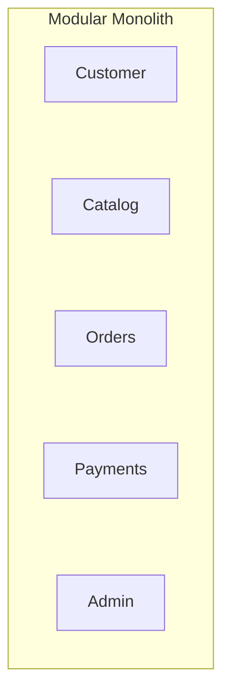

may provide excellent simplicity.

The team can still maintain strong boundaries without introducing network communication.

> **A small team usually benefits more from reducing unnecessary coordination than from creating more distributed components.**

---

# 4. When Boundaries Are Unclear

Consider:

```text
Customer
Order
Cart
Payment
```

Suppose you cannot clearly determine:

```text
Who owns this data?
Who owns this rule?
Which module is responsible?
```

Then creating services may make the problem worse.

You might end up with:

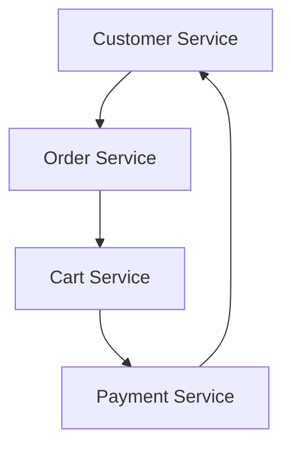

The services constantly depend on each other.

This is a warning sign.

> **If you cannot establish a good module boundary, putting a network boundary there will not magically make it better.**

---

# 5. When the Application Is Transaction-Heavy

Some workflows naturally require several operations to succeed together.

For example:

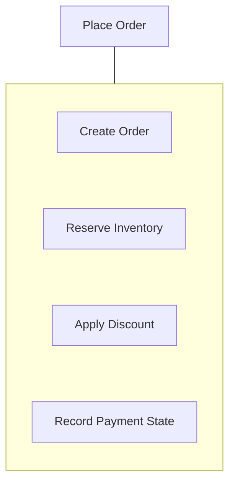

In a monolith, these operations may be handled within a database transaction:

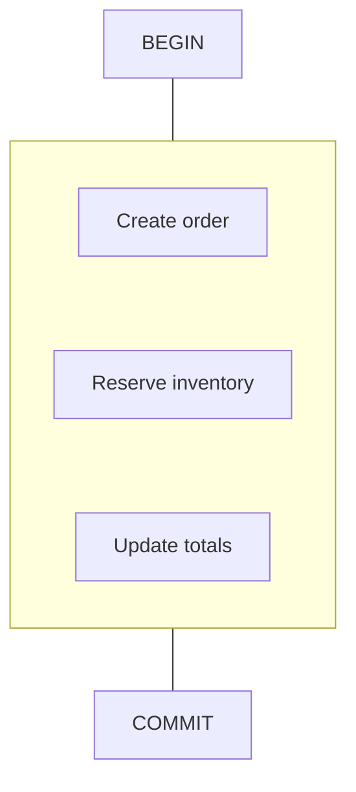

If the application is split:

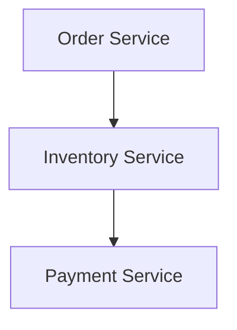

the transaction may now cross service boundaries.

A normal local database transaction cannot automatically make all those network operations atomic.

You may need:

- Saga workflows.
- Compensation.
- Idempotency.
- Event handling.
- Retry management.
- Failure recovery.

These are useful tools, but they are additional complexity.

Therefore:

> **If strong local transactions are central to the application's correctness and there is no strong reason to distribute the workflow, keeping related logic together may be safer.**

---

# 6. When Shared Data Is the Reality

Suppose multiple modules constantly need to read and update the same data.

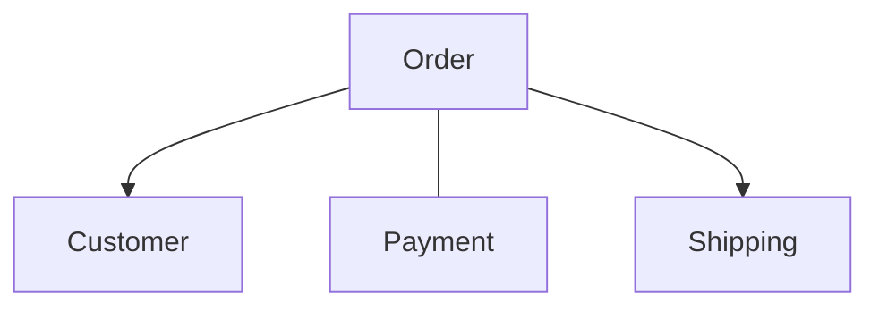

If every operation crosses the same data boundary, service separation may produce a large amount of coordination.

You might end up with:

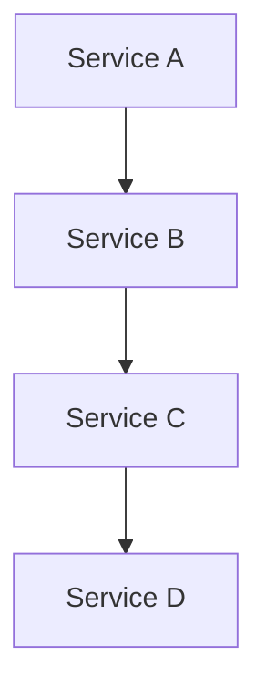

The architecture becomes difficult to reason about.

A modular monolith may allow the system to preserve:

```text
Shared transaction
Shared local data access
Simple consistency
```

while still maintaining internal module boundaries.

---

# 7. When Communication Becomes Too Chatty

Consider:

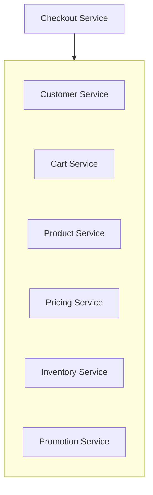

One user request may require many network calls.

This creates:

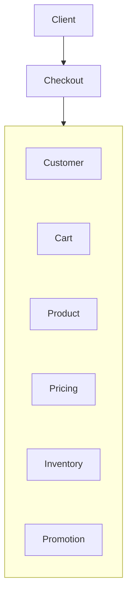

If each call takes 50 ms, the total latency can become significant depending on which calls are sequential, parallel, or on the critical path.

Worse, any dependency can fail or time out.

This is sometimes called a **chatty architecture**.

> **If service boundaries create excessive communication, the boundaries may be wrong.**

---

# 8. Long Synchronous Dependency Chains

Imagine:

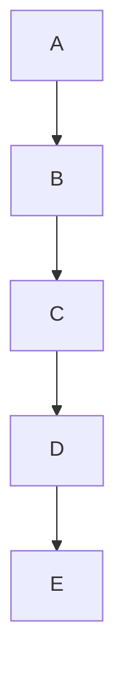

If each service depends synchronously on the next:

```text
A → B → C → D → E
```

the user request depends on the health and latency of the entire chain.

Possible consequences:

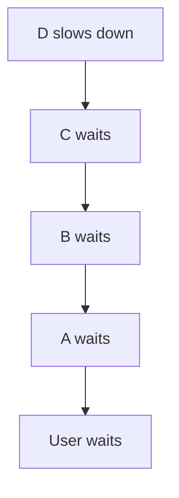

One slow component can affect the whole request path.

Microservices can still use synchronous communication when appropriate, but excessive dependency chains are a warning sign.

---

# 9. When the System Is Simple

Suppose the application is:

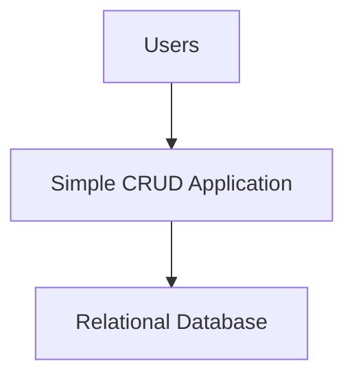

Requirements:

- One team.
- One region.
- Moderate traffic.
- Simple business rules.
- One deployment.
- One database.

There may be no meaningful reason to introduce microservices.

A modular monolith can be:

```text
Simple
Predictable
Easy to test
Easy to deploy
Easy to debug
Easy to operate
```

This simplicity is a feature.

> **Do not solve a distributed-systems problem that your application does not have.**

---

# 10. When Traffic Is High but Uniform

High traffic is often used as an argument for microservices.

But consider:

```text
Catalog → 2,000 req/sec
Orders  → 1,800 req/sec
Users   → 1,900 req/sec
```

The workload is high, but relatively uniform.

A horizontally scaled monolith may work:

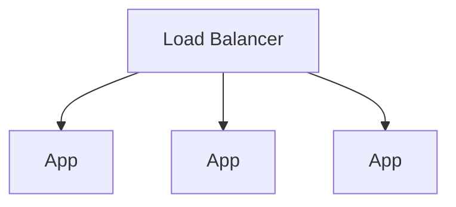

Microservices become more interesting when:

```text
Catalog → 20,000 req/sec
Orders  → 500 req/sec
Admin   → 20 req/sec
```

because independent scaling creates a stronger benefit.

Therefore:

> **High traffic is not the same as a need for independent scaling.**

---

# 11. When Deployment Is Already Simple

Suppose the application:

```text
Deploy time = 3 minutes
```

and:

```text
Release frequency = 2 times/week
```

The team has no significant deployment bottleneck.

Creating multiple services may turn:

```text
One deployment
```

into:

```text
Ten deployments
```

Now the team must manage:

- Version compatibility.
- Service configuration.
- Deployment ordering.
- Rollbacks.
- Contract compatibility.
- Service health.

If independent deployment was not a real problem, the architecture may have become more complicated without a corresponding benefit.

---

# 12. When the Organization Lacks Operational Maturity

Microservices require more than application code.

The organization needs to handle:

```text
Deployment
Monitoring
Logging
Tracing
Alerting
Security
Secrets
Networking
Service discovery
Incident response
Capacity management
```

For example:

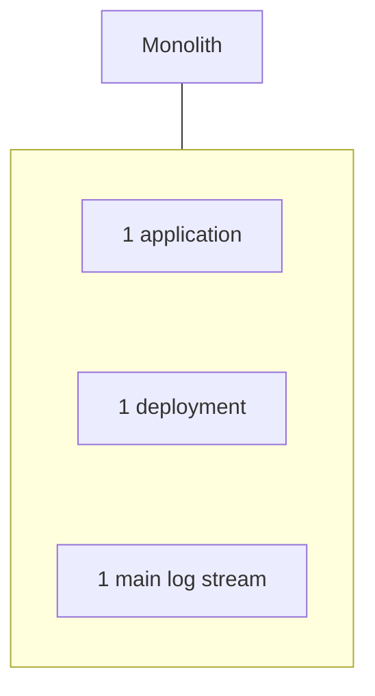

versus:

```text
Service A
Service B
Service C
Service D
Service E
Service F
...
```

Each service becomes another operational unit.

If the organization cannot reliably operate ten services, creating twenty does not improve the situation.

---

# 13. When Debugging Would Become Too Difficult

In a monolith:

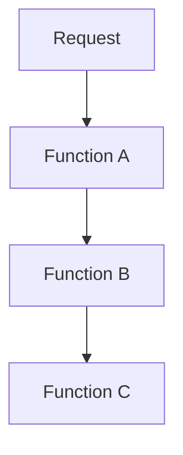

You can often trace the request within one process.

In a distributed system:

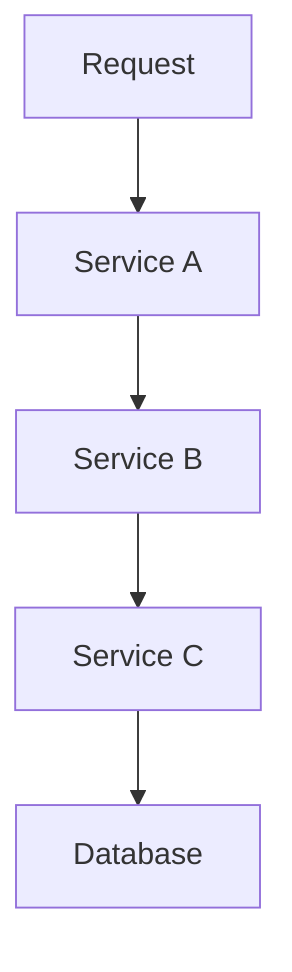

Now you may need:

- Correlation IDs.
- Distributed tracing.
- Centralized logs.
- Metrics.
- Service-level dashboards.

Without these tools, debugging becomes difficult.

Therefore:

> **If you cannot observe the distributed system, creating more services can make failures harder to understand.**

---

# 14. When the Team Wants Different Technologies "Just Because"

Suppose developers say:

```text
"Let's use Go for this service."
"Python for another."
"Rust for another."
"Node.js for another."
```

There may be legitimate reasons.

But every additional technology can introduce:

```text
Different build systems
Different libraries
Different deployment processes
Different debugging tools
Different expertise
Different security updates
Different operational knowledge
```

Technology diversity should solve a problem.

Not create variety for its own sake.

---

# 15. When Service Boundaries Are Too Small

Consider:

```text
Authentication Service
User Profile Service
Address Service
Phone Number Service
Email Service
```

If these components constantly communicate:

```mermaid
flowchart TD
  accTitle: Services that are too small
  accDescr: User calls profile, which calls address; user also calls email and phone.
  U["User"] --> P["Profile"] & E["Email"] & H["Phone"]
  P --> A["Address"]
```

the decomposition may be too fine-grained.

The system has technically achieved "microservices."

But it may have lost architectural simplicity.

> **A service should represent a meaningful capability, not merely a small amount of code.**

---

# 16. When the Team Is Splitting Technical Layers

This is another common mistake:

```text
Frontend Service
Backend Service
Database Service
Authentication Service
Business Logic Service
```

This does not necessarily create useful business boundaries.

A better boundary is often around capabilities:

```text
Orders
Payments
Catalog
Shipping
```

Why?

Because business capabilities provide clearer ownership and evolution boundaries.

Technical-layer decomposition can still leave everything tightly coupled.

---

# 17. When Everyone Needs Everything

Suppose:

```text
Order Team
needs Customer data

Customer Team
needs Order data

Payment Team
needs Order data

Shipping Team
needs Payment data
```

If every service requires many other services' internal information, autonomy becomes weak.

The result may be:

```text
        A
      / | \
     B--C--D
      \ | /
        E
```

instead of:

```text
A → B
B → C
C → D
```

High connectivity increases coordination and failure complexity.

A strong service boundary should reduce unnecessary dependency, not simply rename it.

---

# 18. When a Modular Monolith Solves the Problem

This is perhaps the most important alternative.

Suppose the actual requirement is:

> "We need clearer ownership and better code boundaries."

You may not need microservices.

A modular monolith can provide:

```mermaid
flowchart TD
  accTitle: A modular monolith
  accDescr: The application holds the customer, catalog, order, payment and shipping modules.
  subgraph G["Application"]
    direction TB
    I0["Customer Module"] ~~~ I1["Catalog Module"] ~~~ I2["Order Module"] ~~~ I3["Payment Module"] ~~~ I4["Shipping Module"]
  end
```

with:

- Clear interfaces.
- Data ownership.
- Controlled dependencies.
- Module-level tests.
- Business boundaries.

You get organizational and architectural structure without immediately introducing network communication.

This is often the right intermediate architecture.

---

# 19. A Simple Comparison

| Requirement / Condition | Modular Monolith | Microservices |
|---|---|---|
| Small team | Usually better | Often excessive |
| Unclear boundaries | Better | Risky |
| Strong local transactions | Easier | More complex |
| Moderate traffic | Often enough | May be unnecessary |
| Uniform scaling | Often enough | Less benefit |
| Independent scaling | Limited | Strong advantage |
| Independent deployment | Limited | Strong advantage |
| Many autonomous teams | Can become difficult | Often useful |
| Strong fault isolation requirement | Limited | Potentially useful |
| Legacy integration boundaries | Possible | Often useful |
| Operational maturity | Lower requirement | Higher requirement |
| Debugging simplicity | Easier | Harder |
| Network communication | Minimal | Required between services |
| Distributed consistency | Less complexity | More complexity |

---

# 20. Warning Signs

Watch for these signals:

```text
"No real problem has been identified."
"Let's start with 20 services."
"We need microservices because the codebase is big."
"We need Kubernetes first."
"Every team gets a service."
"Every table gets a service."
"Every class gets a service."
"We can solve transactions later."
"We'll figure out observability later."
"Services can share all tables."
"Everything should communicate synchronously."
```

These are strong indicators of premature decomposition.

---

# 21. The Architecture Smell

A useful test is:

> **If you removed the word "microservices" from the discussion, would there still be a strong business or technical reason for the boundaries?**

If the answer is:

```text
No
```

stop.

Go back to:

```text
Requirements
Constraints
Bottlenecks
Boundaries
```

Then make the decision again.

---

# 22. Monolith → Microservices Decision Framework

Use this framework whenever you are deciding whether an existing application should remain a monolith, become a modular monolith, or evolve toward microservices.

## Step 1 — Start With the Current Architecture

Do not begin by designing services.

Begin with what already exists:

```mermaid
flowchart TD
  accTitle: Start with what exists
  accDescr: The current system: business modules, data, dependencies, deployment, traffic, teams, failure points.
  subgraph G["Current System"]
    direction TB
    I0["Business modules"] ~~~ I1["Data"] ~~~ I2["Dependencies"] ~~~ I3["Deployment"] ~~~ I4["Traffic"] ~~~ I5["Teams"] ~~~ I6["Failure points"]
  end
```

Ask:

> **What is actually hurting us today?**

---

## Step 2 — Identify the Constraint

Classify the problem.

| Constraint | Possible Direction |
|---|---|
| Code is difficult to organize | Modular monolith |
| Boundaries are unclear | Modularize first |
| One capability needs much more capacity | Consider service extraction |
| One capability needs independent releases | Consider service extraction |
| Teams block each other | Consider stronger ownership boundaries |
| One workload threatens another | Consider isolation |
| Legacy system needs a controlled boundary | Consider service boundary |
| Everything scales together | Monolith may be enough |
| Strong local transactions dominate | Keep related logic together |

Do not jump from:

```text
Problem
```

directly to:

```text
Microservices
```

---

## Step 3 — Try the Simplest Solution First

Use this progression:

```mermaid
flowchart TD
  accTitle: Try the simplest solution first
  accDescr: Can the problem be solved locally? Yes: improve monolith. No: strengthen module boundary. Still insufficient? No: modular monolith. Yes: evaluate extraction.
  subgraph R1[" "]
    direction TB
    Q1{"Can the problem be solved locally?"} -->|"Yes"| K1["Improve monolith"]
  end
  subgraph R2[" "]
    direction TB
    Q2{"Still insufficient?"} -->|"No"| K2["Modular monolith"]
  end
  Q1 -->|"No"| S["Strengthen module boundary"] --> Q2
  Q2 -->|"Yes"| E["Evaluate extraction"]
```

This prevents unnecessary distribution.

---

## Step 4 — Evaluate the Candidate Boundary

For a potential service, ask:

```mermaid
flowchart TD
  accTitle: Evaluate the candidate boundary
  accDescr: Does it represent a cohesive business capability?, then Does it have clear ownership?, then Can its data ownership be defined?, then Can its contract be defined?, then Can it operate with limited synchronous dependency?, then Can its failure behavior be understood?, then Does independent deployment/scaling/ownership provide meaningful value?.
  N0["Does it represent a cohesive business capability?"] --> N1["Does it have clear ownership?"] --> N2["Can its data ownership be defined?"] --> N3["Can its contract be defined?"] --> N4["Can it operate with limited synchronous dependency?"] --> N5["Can its failure behavior be understood?"] --> N6["Does independent deployment/scaling/ownership provide meaningful value?"]
```

If most answers are **no**, keep it inside the modular monolith.

---

## Step 5 — Compare Benefit vs Distributed Cost

### Potential benefit

```text
Independent scaling
Independent deployment
Team autonomy
Fault isolation
Legacy isolation
Technology independence
```

### Distributed cost

```text
Network latency
Timeouts
Retries
Partial failure
Observability
Security
Service discovery
Data consistency
Distributed transactions
Deployment complexity
```

Think of the decision as:

```mermaid
flowchart TD
  accTitle: Benefit against cost
  accDescr: Does benefit outweigh cost? No: keep local. Yes: extract.
  Q{"Does Benefit outweigh Cost?"} -->|"No"| K["Keep local"]
  Q -->|"Yes"| E["Extract"]
```

The exact answer is contextual.

---

## Step 6 — Check Operational Readiness

Before extraction, ask:

```text
Can we deploy it independently?
Can we monitor it?
Can we trace requests?
Can we secure it?
Can we handle timeouts?
Can we handle retries?
Can we recover from failure?
Can we manage its data?
Can we roll it back?
```

If the organization cannot do these reliably, the service may be operationally premature.

---

## Step 7 — Extract One High-Value Boundary

Do not begin with:

```text
20 services
```

Start with:

```text
1 service
```

Choose the boundary with the strongest combination of:

```text
High pain
+
Clear ownership
+
Strong boundary
+
Measurable benefit
+
Manageable dependencies
```

For example:

```mermaid
flowchart TD
  accTitle: Extract one service
  accDescr: The monolith alongside one payment service.
  M["Monolith"] --- P["Payment Service"]
```

not:

```mermaid
flowchart TD
  accTitle: Not fifteen at once
  accDescr: The monolith alongside 15 services.
  M["Monolith"] --- P["15 services"]
```

---

## Step 8 — Measure the Result

After extraction, compare:

```text
Before
------
Deployment time
Scaling efficiency
Failure impact
Team coordination
Latency
Operational effort
```

with:

```text
After
-----
Deployment time
Scaling efficiency
Failure impact
Team coordination
Latency
Operational effort
```

If the expected benefit did not appear:

> **Do not automatically extract more services.**

Learn from the result.

---

## Step 9 — Continue Only When Constraints Justify It

This is an important principle:

> **There is no requirement to keep decomposing once the current constraint has been solved.**

---

# 23. Decision Tree

The entire framework can be reduced to one decision tree:

```mermaid
flowchart TD
  accTitle: The decision tree
  accDescr: Start. Is there a real problem? No: keep current architecture. Yes: can the problem be solved locally? Yes: improve/module first. No: is there a strong service boundary? No: keep modular. Yes: does separation provide measurable benefit? No: keep modular. Yes: is the organization ready? No: prepare first. Yes: extract one, measure. Problem solved: stop. Problem remains: re-evaluate.
  ST["START"] --> R1
  subgraph R1[" "]
    direction TB
    Q1{"Is there a real problem?"} -->|"No"| K1["Keep current architecture"]
  end
  subgraph R2[" "]
    direction TB
    Q2{"Can the problem be solved locally?"} -->|"Yes"| K2["Improve/module first"]
  end
  subgraph R3[" "]
    direction TB
    Q3{"Is there a strong service boundary?"} -->|"No"| K3["Keep modular"]
  end
  subgraph R4[" "]
    direction TB
    Q4{"Does separation provide measurable benefit?"} -->|"No"| K4["Keep modular"]
  end
  subgraph R5[" "]
    direction TB
    Q5{"Is the organization ready?"} -->|"No"| K5["Prepare first"]
  end
  R1 -->|"Yes"| R2
  R2 -->|"No"| R3
  R3 -->|"Yes"| R4
  R4 -->|"Yes"| R5
  R5 -->|"Yes"| X["Extract one"] --> M["Measure"]
  M --> PS["Problem solved"] --> STOP["STOP"]
  M --> PR["Problem remains"] --> RE["Re-evaluate"]
```

This gives you three practical outcomes:

```text
1. Stay with the monolith.
2. Strengthen it into a modular monolith.
3. Extract selected capabilities into services.
```

It does **not** force a binary:

```text
Monolith OR Microservices
```

---

# 24. Case Study — Small SaaS Application

Suppose a startup has:

```text
Team: 5 developers

Application:
- Users
- Projects
- Tasks
- Billing
- Notifications

Traffic:
Moderate

Region:
One

Deployment:
Several times per week
```

The team proposes:

```text
User Service
Project Service
Task Service
Billing Service
Notification Service
```

Apply the framework.

### Constraint

```text
No major scaling problem
No deployment bottleneck
No team ownership problem
```

### Simplest solution

```text
Modular Monolith
```

### Decision

```text
Do not extract yet.
```

Later, suppose Billing requires:

```text
Independent deployment
Strict security controls
Separate team ownership
```

Now:

```mermaid
flowchart TD
  accTitle: A reasonable evolution
  accDescr: The modular monolith alongside a billing service.
  M["Modular Monolith"] --- B["Billing Service"]
```

becomes a reasonable evolution.

---

# 25. Case Study — E-Commerce

Suppose:

```text
Catalog → 20,000 req/sec
Orders  → 500 req/sec
Payments → 100 req/sec
```

The monolith currently scales everything together.

### Constraint

```text
Catalog requires much more capacity.
```

### Candidate boundary

```text
Catalog
```

### Expected benefit

```text
Independent scaling
```

### Distributed cost

```text
Network communication
Data ownership
Deployment
Monitoring
Failure handling
```

### Decision

If the scaling benefit clearly outweighs those costs:

```text
Extract Catalog
```

Result:

```mermaid
flowchart TD
  accTitle: Catalog extracted
  accDescr: The load balancer sends traffic to the catalog service, backed by the catalog DB, and to the main application, which holds the other modules.
  L["Load Balancer"] --- C["Catalog Service"] & M["Main Application"]
  C --> CD["Catalog DB"]
  M --> OM["Other Modules"]
```

The rest of the application can remain together.

---

# 26. Case Study — Enterprise Legacy System

Suppose:

```mermaid
flowchart TD
  accTitle: A legacy dependency
  accDescr: Modern Application, then Legacy ERP.
  N0["Modern Application"] --> N1["Legacy ERP"]
```

The legacy ERP has:

- Old APIs.
- Different data models.
- Different release process.
- Specialized ownership.

A dedicated service can act as a boundary:

```mermaid
flowchart TD
  accTitle: An integration boundary
  accDescr: Modern Applications, then ERP Integration Service, then Legacy ERP.
  N0["Modern Applications"] --> N1["ERP Integration Service"] --> N2["Legacy ERP"]
```

Now the legacy complexity is isolated behind a controlled interface.

The goal is not "microservices everywhere."

The goal is:

> **Create a useful boundary around a genuine architectural constraint.**

---

# 27. Common Mistakes

### Mistake 1 — Treating microservices as the mature architecture

Maturity means making appropriate decisions, not using more infrastructure.

### Mistake 2 — Splitting because the codebase is large

Large does not automatically mean distributed.

### Mistake 3 — Splitting because traffic is high

First determine the actual bottleneck and whether workloads need independent scaling.

### Mistake 4 — Splitting unclear boundaries

If ownership is unclear inside the monolith, it may be even harder across a network.

### Mistake 5 — Ignoring transactions

Cross-service transactions are significantly more complicated than local transactions.

### Mistake 6 — Ignoring operational cost

Every service becomes another system to deploy, monitor, secure, and recover.

### Mistake 7 — Creating too many tiny services

More services do not automatically mean better architecture.

### Mistake 8 — Sharing everything

If every service shares the same tables and depends on every other service, the architecture may be a distributed monolith.

### Mistake 9 — Choosing infrastructure first

Do not start with Kubernetes, service mesh, or containers and work backward.

### Mistake 10 — Rejecting monoliths because of fashion

A well-designed modular monolith can be a highly effective production architecture.

---

# Key Principle

> **Do not introduce microservices unless the benefits of service autonomy clearly outweigh the costs of distributed architecture.**

A modular monolith is often the better choice when:

```text
Team is small
        +
Boundaries are unclear
        +
Workloads scale together
        +
Deployments are manageable
        +
Transactions are strongly coupled
        +
Operations are simple
        +
No strong fault-isolation requirement
```

The decision should always be driven by constraints.

---

# Quick Reference

## The three outcomes

| Situation | Recommended Direction |
|---|---|
| Simple system, no major constraints | **Monolith** |
| Need strong internal boundaries but not distribution | **Modular Monolith** |
| Clear capability with measurable benefit from autonomy | **Selective Microservice Extraction** |

## Decision sequence

```mermaid
flowchart TD
  accTitle: Decision sequence
  accDescr: Problem, then Constraint, then Simplest solution, then Modular boundary, then Service candidate, then Benefit vs cost, then Operational readiness, then Extract one, then Measure, then Evolve only if necessary.
  N0["Problem"] --> N1["Constraint"] --> N2["Simplest solution"] --> N3["Modular boundary"] --> N4["Service candidate"] --> N5["Benefit vs cost"] --> N6["Operational readiness"] --> N7["Extract one"] --> N8["Measure"] --> N9["Evolve only if necessary"]
```

---

# Knowledge Check

### 1. Why shouldn't microservices be the default architecture?

**Answer:**  
Because they introduce network, operational, consistency, and failure-management complexity. That complexity should be justified by real system requirements.

### 2. Does a large codebase automatically require microservices?

**Answer:**  
No. A large application can remain a modular monolith if its boundaries, scaling, deployment, and operational requirements do not justify distribution.

### 3. Why can strong transaction requirements favor a monolith?

**Answer:**  
Operations inside one application and database can often use local transactions. Splitting them across services introduces distributed transaction and compensation complexity.

### 4. What is a warning sign of a bad service boundary?

**Answer:**  
The service constantly depends on other services for data and operations, resulting in high coupling and frequent network communication.

### 5. Why is high traffic alone not enough?

**Answer:**  
A horizontally scaled monolith may handle high traffic. Microservices become more valuable when different capabilities need to scale independently or other constraints justify separation.

### 6. Why does microservices architecture require stronger observability?

**Answer:**  
A single user request may cross several processes and networks. Logs, metrics, correlation IDs, and distributed tracing help reconstruct what happened.

### 7. Why can a small team struggle with microservices?

**Answer:**  
The team must operate multiple deployments, services, networks, logs, monitoring systems, security boundaries, and failure scenarios. The operational cost may exceed the benefit.

### 8. What is a modular monolith's main advantage over microservices?

**Answer:**  
It can provide strong internal business boundaries while retaining the simplicity of local communication and a single deployment.

### 9. Why is "we need Kubernetes" not a valid reason for microservices?

**Answer:**  
Infrastructure should support architectural requirements. Choosing an infrastructure technology first reverses the decision process.

### 10. What should you do when you are unsure whether to extract a service?

**Answer:**  
Keep the boundary modular, measure the actual constraint, and extract only when a concrete benefit justifies the distributed-system cost.

---

# Remember

> **A system does not become better simply because it becomes more distributed.**

Before creating a service, ask:

```mermaid
flowchart TD
  accTitle: Before creating a service
  accDescr: What constraint are we solving?, then Could a modular monolith solve it?, then What benefit does distribution provide?, then What new failure and operational costs does it create?, then Is the benefit worth the cost?.
  N0["What constraint are we solving?"] --> N1["Could a modular monolith solve it?"] --> N2["What benefit does distribution provide?"] --> N3["What new failure and operational costs does it create?"] --> N4["Is the benefit worth the cost?"]
```

If you cannot clearly answer those questions:

> **Do not distribute yet.**

---

# Next Chapter

**07.07 — Service Boundaries**

The next chapter focuses on the hardest part of service architecture: **deciding where one service should end and another should begin**, using business capabilities, data ownership, coupling, cohesion, dependencies, and change patterns.
