# 07.07 — Service Boundaries

## Learning Objectives

By the end of this chapter, you should be able to:

- Explain what a service boundary is.
- Identify business capabilities that can form meaningful service boundaries.
- Use cohesion and coupling to evaluate a boundary.
- Define ownership of data, business rules, and invariants.
- Design clear service contracts.
- Identify dependency patterns that create fragile architectures.
- Recognize common bad service boundaries.
- Apply a practical framework for designing and reviewing service boundaries.

---

# 1. What Is a Service Boundary?

A **service boundary** defines what a service is responsible for and what it is not responsible for.

It determines:

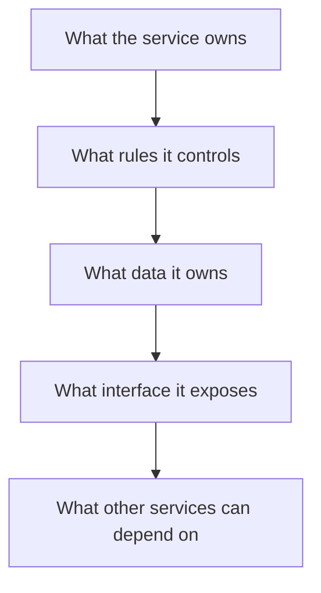

A boundary is therefore more than:

> "This code runs in a separate server."

A useful service boundary combines:

```text
Responsibility
     +
Ownership
     +
Data
     +
Business Rules
     +
Contract
     +
Lifecycle
```

For example:

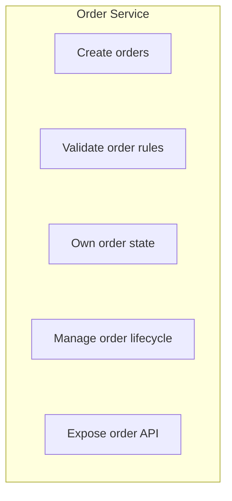

The important question is:

> **What business responsibility does this service own?**

---

# Beginner Vocabulary

| Term | Simple meaning |
|---|---|
| **Service boundary** | The line defining what a service owns and does |
| **Business capability** | Something valuable the business needs to do |
| **Cohesion** | How strongly related the responsibilities inside a component are |
| **Coupling** | How much one component depends on another |
| **Data ownership** | Which component is responsible for changing and protecting particular data |
| **Invariant** | A rule that must remain true |
| **Contract** | The agreed interface between components |
| **Dependency** | Something one component needs from another |
| **Bounded context** | A boundary within which a particular business model and terminology have a consistent meaning |
| **Lifecycle** | How something is created, changed, and eventually completed or removed |
| **Failure boundary** | A boundary within which failures can be contained or understood |
| **Chattiness** | Excessive back-and-forth communication between components |

---

# 2. Business Capability vs Technical Layer

A strong service boundary usually represents a **business capability**.

For example:

```text
E-Commerce

Catalog
Orders
Payments
Shipping
Notifications
```

These represent meaningful things the business does.

A weak decomposition might instead create:

```text
Controller Service
Database Service
Validation Service
Authentication Service
Utility Service
Repository Service
```

These are mostly technical layers.

The problem is that business operations usually cross all of them.

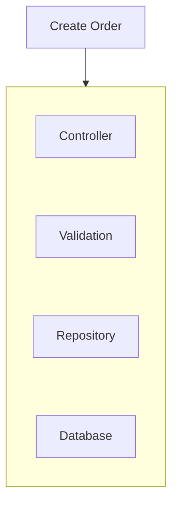

If every technical layer becomes a separate service, the simple operation becomes a network workflow.

A better boundary is usually:

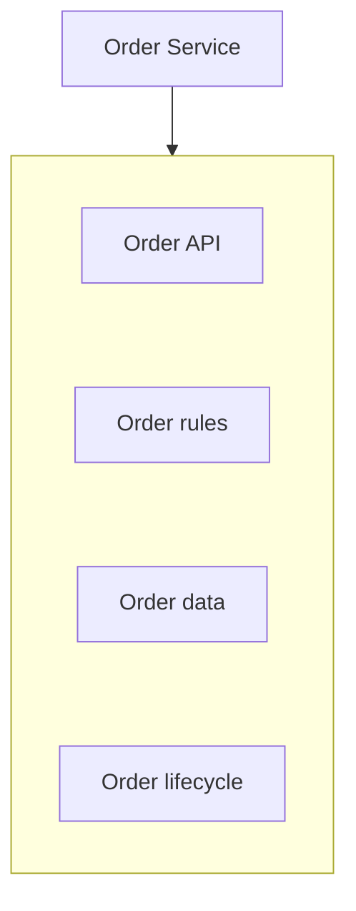

The service owns a meaningful capability.

---

# 3. Cohesion

**Cohesion** describes how closely related the responsibilities inside a component are.

High cohesion:

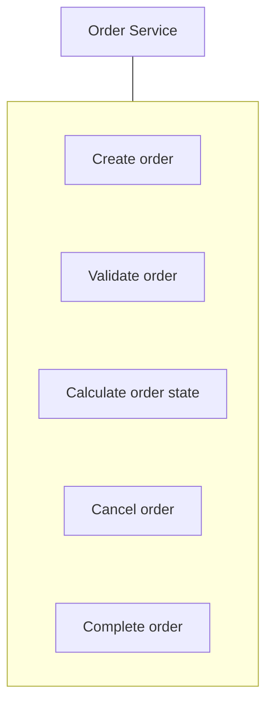

These responsibilities are strongly related.

Low cohesion:

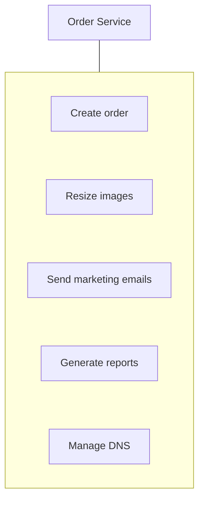

The service has become a collection of unrelated responsibilities.

A useful principle is:

> **Keep things together when they strongly belong together.**

---

# 4. Coupling

**Coupling** describes how strongly components depend on each other.

Consider:

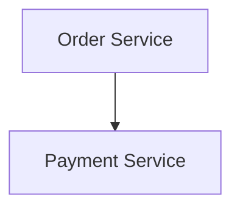

This is a dependency.

That is not automatically bad.

The problem appears when dependencies multiply:

```text
Order → Payment
Order → Shipping
Order → Inventory
Order → Customer
Order → Pricing
Order → Tax
Order → Notification
```

Now one operation may require many remote calls.

The system becomes highly connected.

A highly connected architecture is harder to:

- change
- test
- deploy
- debug
- scale
- recover

So good boundaries aim for:

```text
High cohesion
+
Controlled coupling
```

---

# 5. The Boundary Should Have an Owner

A service should have clear ownership.

For example:

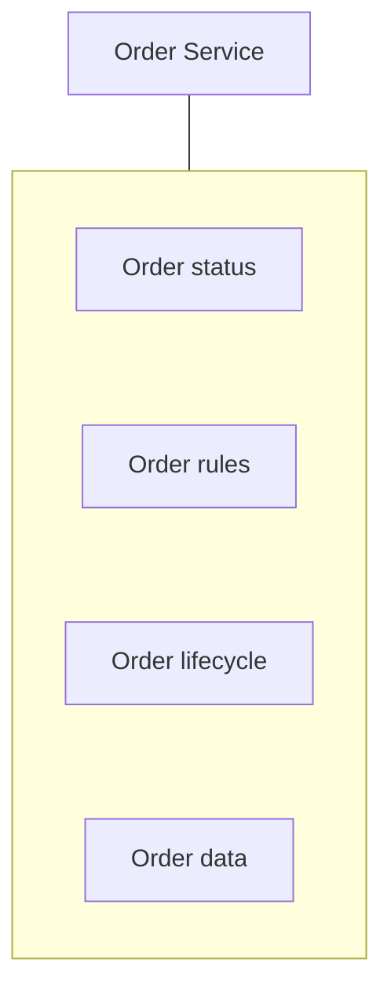

The Order Service should be the authority for questions such as:

```text
Is this order cancellable?
What state is the order in?
Can this order transition to shipped?
```

Other services should not directly modify the order's internal state.

Instead:

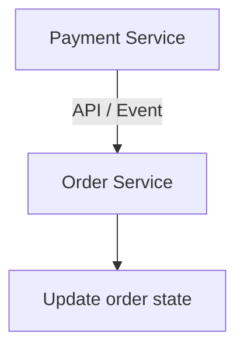

This creates a clear authority boundary.

---

# 6. Data Ownership

Data ownership is one of the most important parts of service boundaries.

Suppose:

```text
Order Service
Payment Service
```

A poor architecture might allow both services to directly modify:

```text
orders
payments
customers
```

Now ownership is unclear.

A better model is:

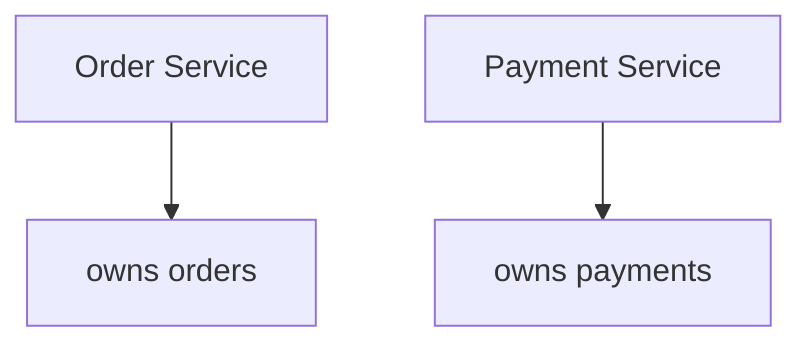

The services communicate through defined contracts.

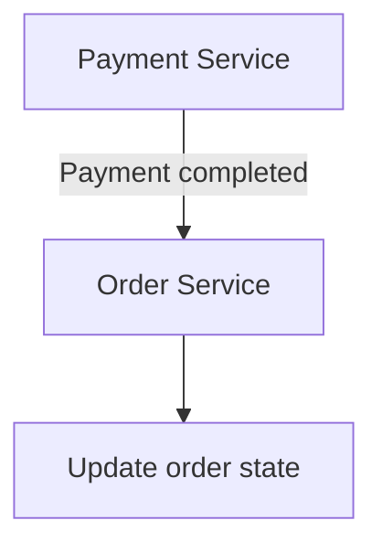

The exact communication mechanism can be synchronous or asynchronous.

We will explore that more deeply in **07.08 — Service Communication**.

---

# 7. Logical Ownership vs Physical Database

"Database per service" is a common microservices pattern.

But the deeper principle is:

> **Clear ownership matters more than physically separate databases.**

For example, several services might initially use one database:

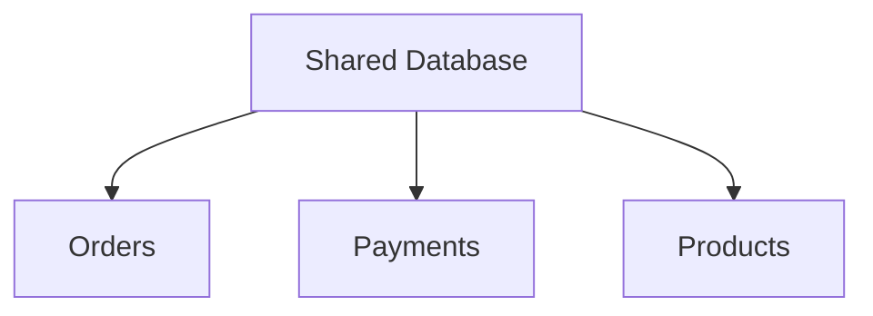

If ownership is clearly defined:

```text
Order Service    → owns order data
Payment Service  → owns payment data
Catalog Service  → owns product data
```

the architecture can still have meaningful boundaries.

The problem occurs when every service freely accesses every table:

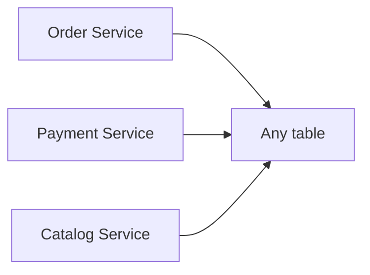

This creates hidden coupling.

Physical separation can strengthen ownership, but it also introduces additional operational complexity.

---

# 8. Business Invariants Need an Owner

An **invariant** is a rule that must remain true.

For example:

```text
An order cannot be shipped before it is paid.
```

Or:

```text
A payment cannot be captured twice.
```

Or:

```text
A product cannot be sold below a protected minimum price.
```

Someone must clearly own these rules.

For example:

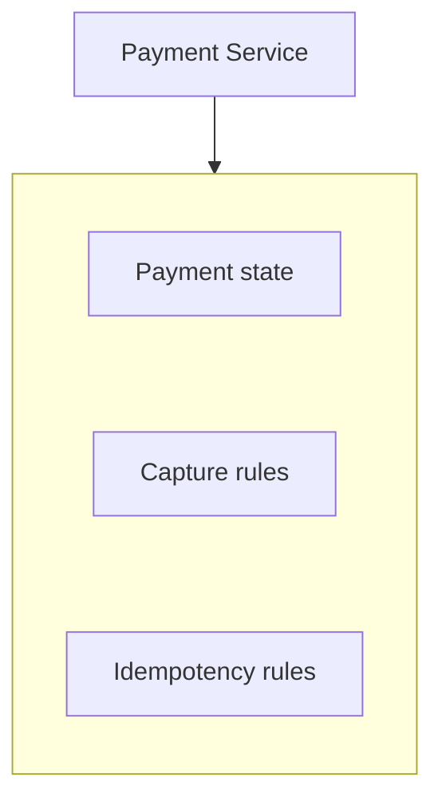

The service responsible for the business invariant should control the operations that can violate it.

If five services independently implement the same rule:

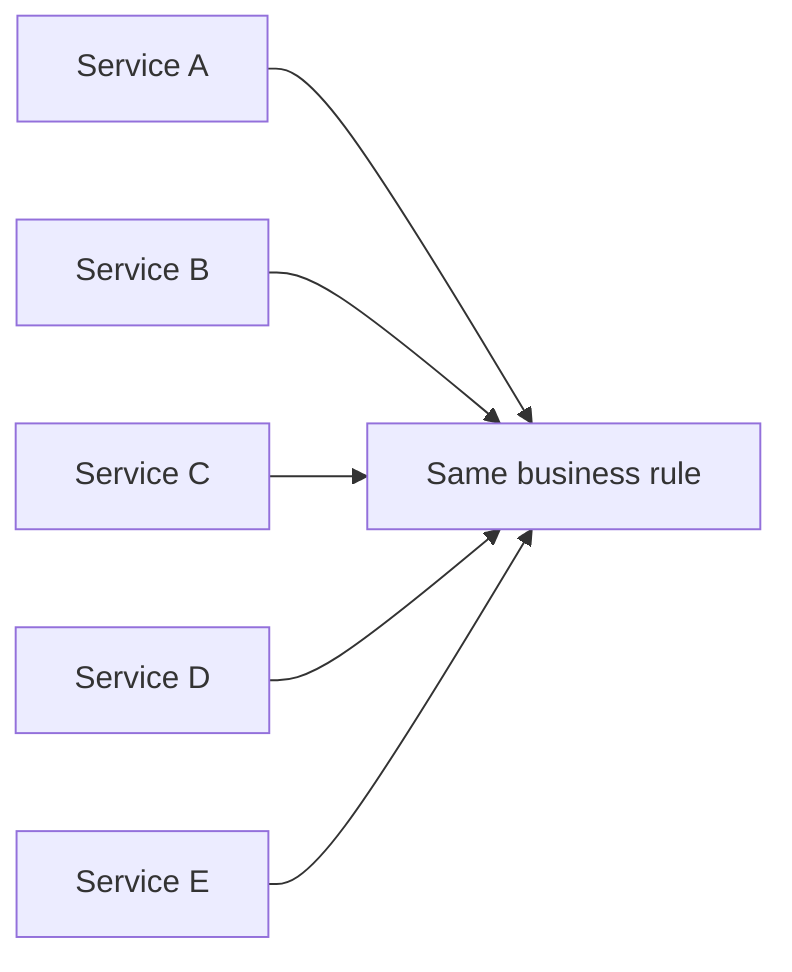

the rule can drift over time.

Central ownership is usually safer.

---

# 9. Domain and Bounded Context

You may encounter the term **bounded context** in Domain-Driven Design.

For this chapter, think of it simply as:

> **A boundary within which a particular business concept and its rules have a consistent meaning.**

For example, the word "Customer" may mean different things in different contexts.

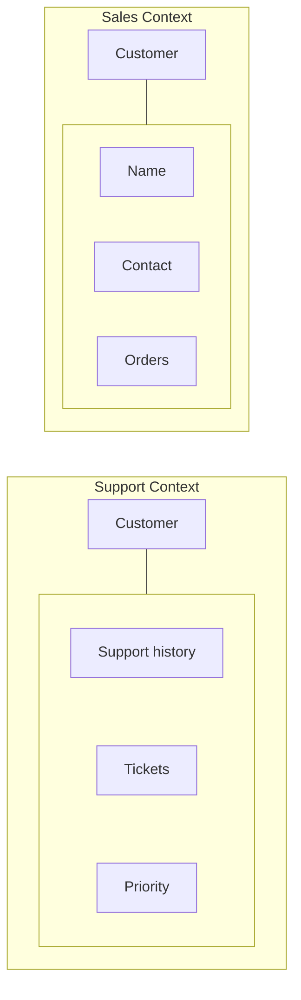

The same real-world person does not necessarily need one giant universal model shared by every service.

The goal is not to duplicate information carelessly.

The goal is to avoid forcing unrelated parts of the system into one tightly coupled model.

For System Design purposes:

> **Use business meaning as a strong signal for boundaries.**

Do not turn this chapter into a full Domain-Driven Design course. The practical goal is simply to recognize meaningful boundaries.

---

# 10. Change Together, Stay Together

One useful boundary signal is **change frequency**.

Suppose two pieces of code almost always change together:

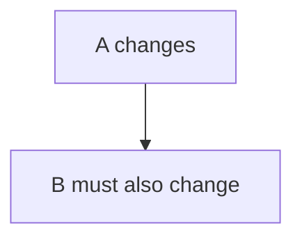

They may belong inside the same boundary.

If:

```text
A changes independently
B changes independently
```

they may be candidates for separate boundaries.

For example:

```text
Catalog pricing rules
Inventory rules
```

If they evolve independently and have different ownership, separating them may make sense.

But if every catalog change requires coordinated inventory changes, splitting them may create unnecessary coupling.

A useful question is:

> **Do these components actually evolve independently?**

---

# 11. Scale Together, Stay Together?

Scaling behavior is another signal.

Suppose:

```text
Catalog
100 requests/sec
```

while:

```text
Search
10,000 requests/sec
```

If they are inside one deployment:

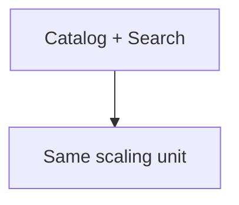

you may have to scale both together.

A separate Search service could allow:

```text
Catalog Service
    2 instances

Search Service
    20 instances
```

But this does **not** mean every differently scaling component should become a service.

The question is:

> **Does independent scaling provide enough benefit to justify the distributed-system cost?**

---

# 12. Team Ownership as a Signal

Architecture and organizational structure influence each other.

A team that owns a capability end-to-end can often make better decisions about its service.

For example:

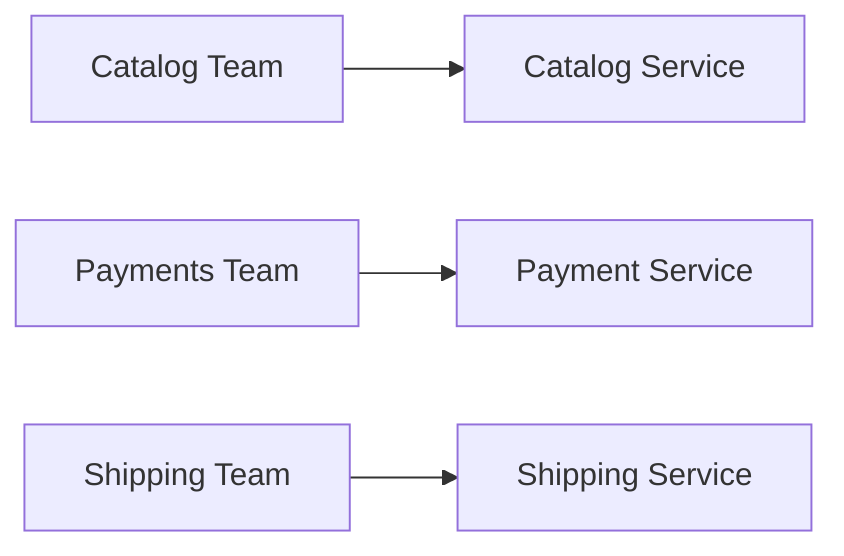

This connects to **Conway's Law**:

> Organizations tend to produce systems that reflect their communication structures.

But team structure alone should not determine boundaries.

Bad reasoning:

> "We have five teams, so we need five services."

Better reasoning:

> "These teams own distinct business capabilities with clear responsibilities and limited coordination."

Team boundaries are a useful signal, not the entire architecture.

---

# 13. Security and Compliance Boundaries

Some capabilities require stronger isolation.

For example:

```text
Payment Data
```

may require different security controls from:

```text
Product Catalog Data
```

A payment-related boundary might therefore own:

```text
Payment rules
Payment state
Payment-provider integration
Sensitive payment-related data
```

The goal is not automatically:

> "Put every sensitive operation into a separate service."

Instead ask:

- What data needs protection?
- Who should access it?
- What operations are allowed?
- What audit requirements exist?
- Does isolation reduce risk?

Security requirements can therefore influence service boundaries.

---

# 14. The Service Contract

A boundary needs a clear **contract**.

A contract defines how other components interact with the service without depending on its internal implementation.

For example:

```text
Order Service

POST /orders
GET  /orders/{id}
POST /orders/{id}/cancel
```

The contract includes more than URLs.

It can include:

```text
Inputs
Outputs
Errors
Authentication
Semantics
Idempotency behavior
Compatibility rules
Versioning
```

Other services should depend on the contract:

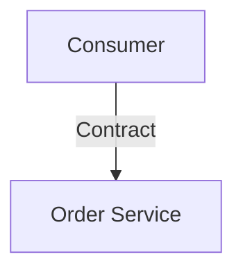

not:

```mermaid
flowchart TD
  accTitle: Depending on internals
  accDescr: The consumer reaches an internal database table, an internal class and an internal implementation detail.
  H["Consumer"] --> G
  subgraph G[" "]
    direction TB
    I0["Internal database table"] ~~~ I1["Internal class"] ~~~ I2["Internal implementation detail"]
  end
```

---

# 15. Contract vs Implementation

Suppose Order Service internally changes:

```mermaid
flowchart TD
  accTitle: An internal change
  accDescr: orders table, then new schema.
  N0["orders table"] --> N1["new schema"]
```

Consumers should not break simply because the internal implementation changed.

Good boundary:

```mermaid
flowchart TD
  accTitle: Good boundary
  accDescr: Consumer, then Stable Contract, then Internal Implementation.
  N0["Consumer"] --> N1["Stable Contract"] --> N2["Internal Implementation"]
```

Bad boundary:

```mermaid
flowchart TD
  accTitle: Bad boundary
  accDescr: The consumer reaches the orders table and internal fields.
  R["Consumer"] --> K0["orders table"] & K1["internal fields"]
```

The second design makes independent evolution much harder.

---

# 16. Dependency Direction

Consider:

```mermaid
flowchart TD
  accTitle: A dependency chain
  accDescr: Order, then Payment, then Customer, then Notification.
  N0["Order"] --> N1["Payment"] --> N2["Customer"] --> N3["Notification"]
```

This is already a chain.

Now consider:

```text
Order ↔ Payment
   ↕      ↕
Customer ↔ Shipping
```

The system has become highly interconnected.

Circular dependencies are particularly dangerous:

```mermaid
flowchart TD
  accTitle: A circular dependency
  accDescr: Service A depends on B, B on C, and C on A again.
  N0["Service A"] --> N1["Service B"] --> N2["Service C"] --> N0
```

Now changing one service may require coordinated changes across several others.

A strong architecture tries to make dependency direction intentional.

> **A simple dependency graph is easier to reason about than a highly connected one.**

---

# 17. Synchronous vs Asynchronous Boundaries

A service boundary does not automatically mean every interaction must be synchronous.

For example:

```mermaid
flowchart TD
  accTitle: A synchronous boundary
  accDescr: Order Service calls Payment Service synchronously.
  N0["Order Service"] -->|"synchronous"| N1["Payment Service"]
```

Or:

```mermaid
flowchart TD
  accTitle: An asynchronous boundary
  accDescr: Order Service sends an event to Notification Service.
  N0["Order Service"] -->|"event"| N1["Notification Service"]
```

If notifications are optional:

```mermaid
flowchart TD
  accTitle: Optional notifications
  accDescr: Order created, then Notification processing.
  N0["Order created"] --> N1["Notification processing"]
```

the order operation may not need to wait for notification delivery.

This can reduce coupling.

But asynchronous communication introduces its own concerns:

- delayed processing
- duplicate messages
- ordering
- retries
- eventual consistency

These are covered in greater detail later.

For now, remember:

> **The communication style should fit the business dependency.**

---

# 18. Failure Boundary

A good service boundary should make failure behavior understandable.

Suppose:

```mermaid
flowchart TD
  accTitle: Required and optional dependencies
  accDescr: The product page calls the Catalog Service and the Recommendation Service.
  R["Product Page"] --> K0["Catalog<br/>Service"] & K1["Recommendation<br/>Service"]
```

Catalog is required.

Recommendations are optional.

If Recommendation Service fails:

```mermaid
flowchart TD
  accTitle: An optional dependency fails
  accDescr: Recommendation Service ❌, then Product page still works.
  N0["Recommendation Service ❌"] --> N1["Product page still works"]
```

This is a useful failure boundary.

But if every request requires:

```text
A → B → C → D → E
```

then one failure can break the entire operation.

A boundary should therefore be evaluated not only by business ownership, but also by:

> **What happens when this dependency is unavailable?**

---

# 19. Good vs Bad Boundaries

| Good Boundary | Bad Boundary |
|---|---|
| Represents a business capability | Represents a technical layer |
| Clear ownership | Shared ownership |
| Owns business rules | Rules duplicated everywhere |
| Clear data ownership | Everyone writes every table |
| Stable contract | Consumers depend on internals |
| High cohesion | Unrelated responsibilities |
| Controlled dependencies | Highly connected graph |
| Can evolve independently | Always changes with another service |
| Failure behavior is understood | Failure cascades unpredictably |
| Meaningful scaling difference | Split only because components are different |

---

# 20. Common Bad Boundary Patterns

## 20.1 One Service per Table

```text
Users Service
Products Service
Orders Service
```

simply because there are three tables.

This is not necessarily meaningful.

A business capability may involve several related data structures.

---

## 20.2 One Service per CRUD Entity

Turning every database entity into a service often produces excessive communication.

```mermaid
flowchart TD
  accTitle: One service per entity
  accDescr: Order calls customer, address, product, price and inventory.
  H["Order"] --> G
  subgraph G[" "]
    direction TB
    I0["Customer"] ~~~ I1["Address"] ~~~ I2["Product"] ~~~ I3["Price"] ~~~ I4["Inventory"]
  end
```

A simple business operation can become a network orchestration problem.

---

## 20.3 Cyclic Dependencies

```text
A → B
B → C
C → A
```

Cycles make ownership and change management difficult.

---

## 20.4 Overly Chatty Services

```text
A → B
A → B
A → B
A → C
A → C
A → D
```

One business operation may require many network calls.

The system becomes sensitive to network latency and dependency failures.

---

## 20.5 Giant Shared Service

Sometimes a team creates:

```text
Common Service
```

and puts everything inside it.

Eventually:

```text
Everything → Common Service
```

The service becomes a central dependency and a bottleneck for both changes and availability.

---

# 21. Example: E-Commerce Boundaries

Consider:

```text
E-Commerce Platform
```

Potential business capabilities:

```text
Catalog
Orders
Payments
Shipping
Notifications
```

A reasonable high-level design is:

```mermaid
flowchart TD
  accTitle: E-commerce boundaries
  accDescr: Catalog connects to Orders. Orders calls Payments, Shipping and Notifications.
  C["Catalog"] --- O["Orders"]
  O --> P["Payments"] & S["Shipping"]
  O --> N["Notifications"]
  P ~~~ N
```

The exact communication pattern depends on the requirements.

The important part is ownership.

---

# 22. Catalog Boundary

Catalog might own:

```text
Product information
Product descriptions
Categories
Catalog pricing rules
Product availability representation
```

But be careful with the word "availability."

Actual inventory ownership may belong elsewhere.

For example:

```mermaid
flowchart TD
  accTitle: Catalog and inventory ownership
  accDescr: Catalog owns product information. Inventory owns stock quantity and reservation state.
  C["Catalog"] --> C1["Product information"]
  I["Inventory"] --> I1["Stock quantity"] & I2["Reservation state"]
  C1 ~~~ I
```

This shows why business meaning matters more than table names.

---

# 23. Order Boundary

Order Service might own:

```text
Order creation
Order state
Order lifecycle
Order cancellation rules
Order totals or order-level pricing decisions
```

Its invariant might include:

```text
Only valid order states can transition to other states.
```

Other services should not directly modify order records.

---

# 24. Payment Boundary

Payment Service might own:

```text
Payment state
Payment attempts
Payment provider integration
Capture/refund rules
Payment idempotency
Payment-related audit information
```

For example:

```mermaid
flowchart TD
  accTitle: Payment states
  accDescr: A payment can be created, authorized, captured, failed or refunded.
  H["Payment"] --> G
  subgraph G[" "]
    direction TB
    I0["Created"] ~~~ I1["Authorized"] ~~~ I2["Captured"] ~~~ I3["Failed"] ~~~ I4["Refunded"]
  end
```

A payment provider may be external:

```mermaid
flowchart TD
  accTitle: An external provider
  accDescr: Payment Service, then Payment Provider.
  N0["Payment Service"] --> N1["Payment Provider"]
```

The external provider should not become part of every other service's implementation.

The Payment Service becomes the boundary around that integration.

---

# 25. Notification Boundary

Notification Service might own:

```text
Email
SMS
Push notifications
Templates
Delivery attempts
Notification preferences
```

A common relationship could be:

```mermaid
flowchart TD
  accTitle: Notifying through an event
  accDescr: Order Service tells Notification Service "Order created".
  N0["Order Service"] -->|"Order created"| N1["Notification Service"]
```

Notification delivery may be asynchronous because the order does not necessarily need to wait for the email provider.

This is a candidate for a loosely coupled boundary.

---

# 26. A Bad E-Commerce Decomposition

Imagine:

```text
Product Table Service
Order Table Service
OrderItem Table Service
Customer Table Service
Address Table Service
Payment Table Service
Email Table Service
```

Now:

```mermaid
flowchart TD
  accTitle: One operation, many tiny services
  accDescr: Create order calls the customer, address, product, order, order item and payment services.
  H["Create Order"] --> G
  subgraph G[" "]
    direction TB
    I0["Customer Service"] ~~~ I1["Address Service"] ~~~ I2["Product Service"] ~~~ I3["Order Service"] ~~~ I4["OrderItem Service"] ~~~ I5["Payment Service"]
  end
```

The system has turned one business operation into a distributed choreography of tiny components.

The boundaries follow storage structures rather than business capabilities.

That is usually a warning sign.

---

# 27. Boundary Design Framework

Use this process when designing a service boundary.

```mermaid
flowchart TD
  accTitle: Boundary design framework
  accDescr: Requirement, then Business Capability, then Responsibilities, then Invariants, then Data Ownership, then Contract, then Dependencies, then Change / Scaling Pattern, then Failure Behavior, then Team Ownership, then Boundary Review.
  N0["Requirement"] --> N1["Business Capability"] --> N2["Responsibilities"] --> N3["Invariants"] --> N4["Data Ownership"] --> N5["Contract"] --> N6["Dependencies"] --> N7["Change / Scaling Pattern"] --> N8["Failure Behavior"] --> N9["Team Ownership"] --> N10["Boundary Review"]
```

Let's make each step practical.

---

## Step 1 — Identify the Business Capability

Ask:

> What meaningful business capability does this service provide?

Example:

```text
Payments
```

not:

```text
PaymentController
```

---

## Step 2 — Define Responsibilities

Write down what belongs inside.

```text
Payment Service
- Create payment
- Authorize payment
- Capture payment
- Refund payment
```

Then identify what does **not** belong there.

---

## Step 3 — Identify Invariants

Ask:

> What rules must always remain true?

Example:

```text
A payment cannot be captured twice.
```

The service owning that invariant should control the relevant state transition.

---

## Step 4 — Define Data Ownership

Ask:

> Which data does this capability own?

```mermaid
flowchart TD
  accTitle: Payment data ownership
  accDescr: The Payment Service owns payment state, payment attempts and refund state.
  H["Payment Service"] --> G
  subgraph G[" "]
    direction TB
    I0["Payment state"] ~~~ I1["Payment attempts"] ~~~ I2["Refund state"]
  end
```

Avoid unclear shared write ownership.

---

## Step 5 — Define the Contract

Ask:

> How should other components interact with it?

For example:

```text
Create Payment
Get Payment Status
Refund Payment
```

The contract should hide internal implementation.

---

## Step 6 — Identify Dependencies

Draw:

```mermaid
flowchart TD
  accTitle: Payment dependencies
  accDescr: Payment depends on order, the payment provider and the fraud system.
  H["Payment"] --> G
  subgraph G[" "]
    direction TB
    I0["Order"] ~~~ I1["Payment Provider"] ~~~ I2["Fraud System"]
  end
```

Then ask:

> Which dependencies are required?

> Which are optional?

> How many synchronous calls are needed?

---

## Step 7 — Look at Change and Scaling

Ask:

```text
Does this change independently?
Does this deploy independently?
Does this scale differently?
Does it require different infrastructure?
```

These are supporting signals.

They should not override a poor business boundary.

---

## Step 8 — Define Failure Behavior

Ask:

> What happens when this service is unavailable?

For example:

```mermaid
flowchart TD
  accTitle: Different failure impact
  accDescr: Recommendation unavailable: continue page. Payment unavailable: cannot complete payment.
  A1["Recommendation unavailable"] --> A2["continue page"]
  B1["Payment unavailable"] --> B2["cannot complete payment"]
  A2 ~~~ B1
```

The business importance is different.

---

## Step 9 — Check Team Ownership

Ask:

> Can a team understand and own this capability end-to-end?

Ownership should include:

```text
Code
Data
Rules
Operations
Failures
Deployment
```

---

## Step 10 — Review the Boundary

Finally ask:

```text
Is it cohesive?
Is ownership clear?
Is coupling controlled?
Is the contract meaningful?
Can it evolve independently?
Is failure behavior understandable?
```

If the answer is mostly "no", the boundary probably needs redesign.

---

# 28. Boundary Strength Test

A quick seven-question test:

### 1. Can you name one business capability?

```text
YES → good signal
NO  → boundary may be artificial
```

### 2. Can one team own it?

```text
YES → good signal
NO  → ownership may be unclear
```

### 3. Can it own its business rules and data?

```text
YES → strong boundary
NO  → investigate shared ownership
```

### 4. Can you define a clear contract?

```text
YES → good signal
NO  → responsibility may be unclear
```

### 5. Can it evolve independently?

```text
YES → good signal
NO  → coupling may be too high
```

### 6. Can you describe its failure behavior?

```text
YES → good signal
NO  → dependency design needs work
```

### 7. Is communication limited and meaningful?

```text
YES → good signal
NO  → boundary may be too fine-grained
```

---

# 29. Boundary Scorecard

Use this simple review:

| Question | Strong Boundary |
|---|---|
| Business capability? | Clearly yes |
| Responsibility? | Focused |
| Cohesion? | High |
| Data ownership? | Clear |
| Business rules? | Clear owner |
| Contract? | Explicit |
| Dependencies? | Limited |
| Change pattern? | Relatively independent |
| Scaling pattern? | Potentially independent |
| Failure behavior? | Understandable |
| Team ownership? | Clear |
| Communication? | Meaningful, not chatty |

This is not a mathematical score.

It is a reasoning tool.

---

# 30. Trade-offs and Failure Modes

| Boundary Decision | Benefit | Risk |
|---|---|---|
| Strong business boundary | Clear ownership | Requires good domain understanding |
| Separate service | Independent lifecycle | Network complexity |
| Shared database | Operational simplicity | Hidden coupling |
| Database ownership | Better isolation | More coordination for cross-domain data |
| Smaller service | Focused responsibility | Can become too fine-grained |
| Larger service | Fewer network calls | May become highly coupled internally |
| Async boundary | Lower synchronous coupling | Eventual consistency and delayed results |
| Independent scaling | Efficient resource usage | More deployment/operations complexity |
| Separate security boundary | Better isolation | More infrastructure and access management |

There is no universally correct boundary size.

The goal is:

> **The smallest boundary that provides meaningful ownership and independence without creating unnecessary distributed complexity.**

---

# 31. Hands-On Exercise

Design service boundaries for this e-commerce system:

```text
Users
Products
Inventory
Cart
Orders
Payments
Shipping
Notifications
Reviews
```

# Step 1 — Group by business capability

Do not immediately create one service per item.

For example:

```text
Catalog
Orders
Payments
Shipping
Notifications
```

Then decide where:

```text
Users
Inventory
Cart
Reviews
```

belong.

---

# Step 2 — Assign ownership

Create a table:

| Capability | Owns |
|---|---|
| Catalog | ? |
| Orders | ? |
| Payments | ? |
| Shipping | ? |
| Notifications | ? |

---

# Step 3 — Identify invariants

Examples:

```text
Order cannot move to shipped incorrectly.

Payment cannot be captured twice.

Inventory cannot become negative.
```

Who owns each rule?

---

# Step 4 — Draw dependencies

For example:

```mermaid
flowchart TD
  accTitle: Order dependencies
  accDescr: Orders depends on payments, inventory and shipping.
  R["Orders"] --> K0["Payments"] & K1["Inventory"] & K2["Shipping"]
```

Then identify which dependencies are required and which can be asynchronous or optional.

---

# Step 5 — Identify bad boundaries

Look for:

```text
One service per table
Technical-layer services
Shared unrestricted database writes
Cycles
Too many synchronous calls
Giant common service
```

---

# Step 6 — Explain your decisions

For each boundary, answer:

```text
Why does this belong together?

Who owns the data?

Who owns the rules?

What is the contract?

What happens if the service fails?
```

The goal is not to produce the "perfect" architecture.

The goal is to practice **reasoning about boundaries**.

---

# 32. Common Mistakes

### Mistake 1 — One service per database table

Tables are storage structures.

Services should usually represent meaningful capabilities.

### Mistake 2 — One service per CRUD operation

This creates excessive network communication.

### Mistake 3 — Splitting technical layers

Controllers, repositories, and validation are implementation concerns, not automatically service boundaries.

### Mistake 4 — Shared ownership

If multiple services can freely change the same business state, authority becomes unclear.

### Mistake 5 — Shared database with unrestricted access

The services may look independent while remaining tightly coupled.

### Mistake 6 — Ignoring invariants

Every important business rule should have a clear owner.

### Mistake 7 — Too many synchronous dependencies

Long dependency chains increase latency and failure propagation.

### Mistake 8 — Using team boundaries alone

Organizational structure is a signal, not a substitute for business boundaries.

### Mistake 9 — Making everything a separate service

More services do not automatically mean better architecture.

### Mistake 10 — Designing boundaries around today's code structure only

A service boundary should reflect business responsibility, ownership, change patterns, and future constraints—not simply the current folder structure.

---

# 33. Key Principle

> **A good service boundary creates clear ownership around a meaningful business capability.**

It should answer:

```text
What does this service do?
What does it own?
What rules does it enforce?
What data does it control?
How do others interact with it?
What does it depend on?
What happens when it fails?
```

The goal is not to create many services.

The goal is to create **useful boundaries**.

---

# 34. Quick Reference

```mermaid
flowchart TD
  accTitle: GOOD SERVICE BOUNDARY
  accDescr: GOOD SERVICE BOUNDARY: Business Capability, then Clear Responsibility, then Clear Data Ownership, then Clear Business Rules, then Stable Contract, then Controlled Dependencies, then Understandable Failure.
  subgraph S["GOOD SERVICE BOUNDARY"]
    direction TB
    N0["Business Capability"] --> N1["Clear Responsibility"] --> N2["Clear Data Ownership"] --> N3["Clear Business Rules"] --> N4["Stable Contract"] --> N5["Controlled Dependencies"] --> N6["Understandable Failure"]
  end
```

### Strong signals

```text
High cohesion
Clear ownership
Independent change
Independent scaling
Clear contract
Limited dependencies
Meaningful business capability
```

---

# 35. Knowledge Check

### 1. What is a service boundary?

**Answer:**  
A boundary defining the responsibility, ownership, data, rules, contract, and lifecycle of a service.

### 2. Why are business capabilities generally better boundaries than technical layers?

**Answer:**  
Business capabilities group related responsibilities and rules around meaningful work, while technical-layer boundaries often force one business operation to cross many network services.

### 3. What does high cohesion mean?

**Answer:**  
The responsibilities inside a component are strongly related and belong together.

### 4. Why is unrestricted shared database access dangerous?

**Answer:**  
It creates hidden coupling and makes data ownership unclear. Any service can change another service's state without going through its contract.

### 5. Does "database per service" always mean every service must have a physically separate database?

**Answer:**  
No. Physical database separation is a common pattern, but clear logical ownership is the deeper principle.

### 6. Why should business invariants have a clear owner?

**Answer:**  
So one component controls the rules that must remain true instead of allowing multiple services to implement conflicting versions of the same rule.

### 7. Why are cyclic service dependencies dangerous?

**Answer:**  
They make changes, deployments, failures, and reasoning more complicated because services become mutually dependent.

### 8. Should every component that scales differently become a separate service?

**Answer:**  
No. Different scaling patterns are a useful signal, but the benefit must justify the additional distributed-system complexity.

### 9. Why is a stable contract important?

**Answer:**  
It allows consumers to depend on the service's public behavior without depending on its internal implementation.

### 10. What is the first question to ask when designing a service boundary?

**Answer:**  

> **What meaningful business capability does this boundary own?**

---

# Remember

> **A service boundary is not a box around some code. It is a boundary around responsibility, ownership, data, rules, and a contract.**

And:

> **Keep strongly related things together. Keep independently changing things separate. Minimize unnecessary dependencies. Give every important business rule and piece of business state a clear owner.**

---

# Next Chapter

**07.08 — Service Communication**

Now that we understand **where service boundaries should be**, the next question is:

> **How should those services communicate across the boundaries?**

We will examine synchronous calls, asynchronous communication, APIs, messaging, latency, failures, timeouts, retries, and dependency chains.
