# 07.08 — Service Communication

## Learning Objectives

By the end of this chapter, you should be able to:

- Explain why service communication is different from in-process function calls.
- Distinguish synchronous and asynchronous communication.
- Understand APIs, requests, responses, events, and messages.
- Identify latency and failure introduced by network communication.
- Understand dependency chains and cascading failures.
- Choose communication patterns based on business requirements.
- Apply timeouts, retries, and idempotency appropriately.
- Recognize overly chatty service communication.
- Design a simple and resilient service communication flow.

---

# 1. What Is Service Communication?

When services are separate processes, they cannot simply call each other's functions directly.

Instead:

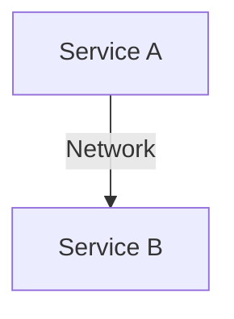

Service A must communicate with Service B through some protocol or messaging mechanism.

Common approaches include:

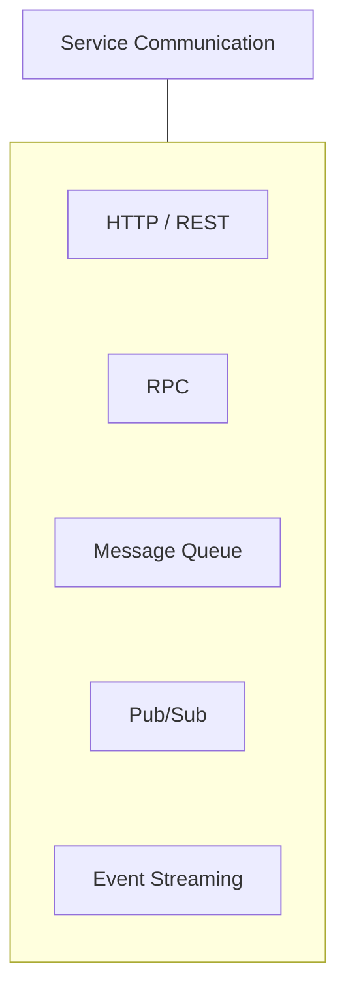

The exact technology is less important initially.

The fundamental change is:

> **A local function call becomes a distributed interaction.**

---

# 2. Local Call vs Service Call

Consider a monolith:

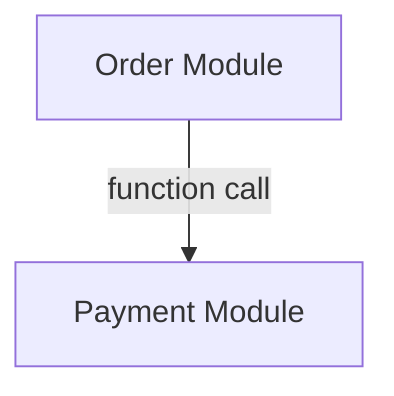

The call happens inside the same application process.

Now separate them:

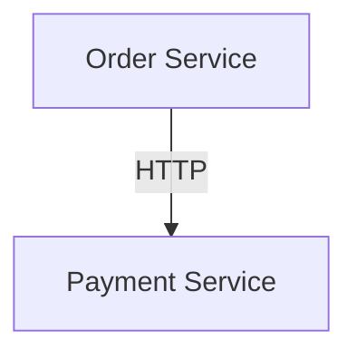

The second design introduces:

- network latency
- connection handling
- serialization
- authentication
- timeouts
- retries
- partial failure
- version compatibility
- observability

This is one of the most important ideas in service architecture:

> **A network boundary is also a failure boundary.**

---

# Beginner Vocabulary

| Term | Simple meaning |
|---|---|
| **Service communication** | How independent services exchange information |
| **Synchronous** | Caller waits for the operation to complete |
| **Asynchronous** | Caller does not need to wait for completion |
| **API** | Defined interface through which a service can be used |
| **Request** | Information asking another service to perform or provide something |
| **Response** | Result returned for a request |
| **Message** | Data sent between components, often through a broker or queue |
| **Event** | A statement that something already happened |
| **RPC** | Calling a remote service in a style similar to a function call |
| **Serialization** | Converting data into a transferable format |
| **Dependency** | A service that another service needs |
| **Dependency chain** | A sequence of services that must interact for one operation |
| **Chattiness** | Excessive back-and-forth communication |
| **Fan-out** | One service calling many other services |
| **Contract** | Agreed rules for how services communicate |
| **Idempotency** | Safe handling of repeated logical operations |

---

# 3. The Basic Communication Model

The simplest service interaction is:

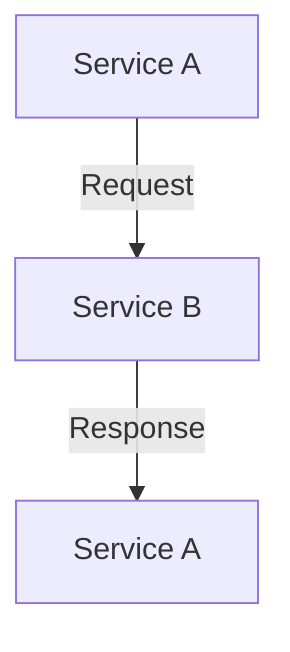

For example:

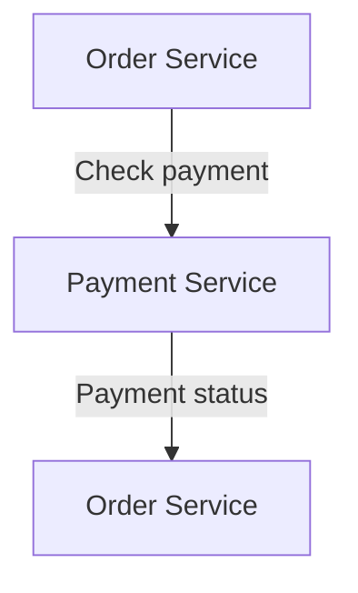

This is a **request-response** interaction.

It is usually synchronous.

---

# 4. Synchronous Communication

In synchronous communication:

> **The caller waits for a result.**

Example:

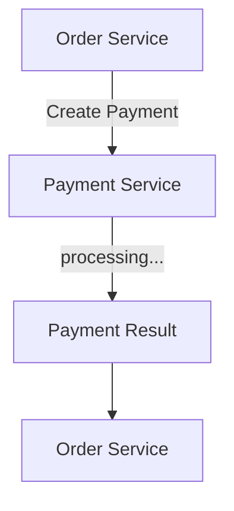

The Order Service cannot complete that particular step until it receives the result.

Typical technologies include:

- HTTP/REST
- gRPC
- other RPC protocols

---

# 5. Why Use Synchronous Communication?

Synchronous communication is useful when the caller immediately needs an answer.

For example:

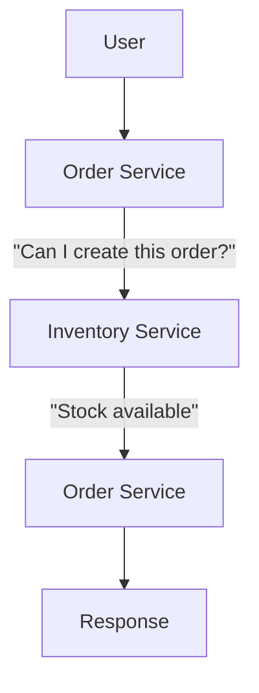

The answer is required before the operation can continue.

Typical examples:

- authentication checks
- retrieving required data
- validating an operation
- payment authorization
- checking permissions

The important question is:

> **Does the caller need the result right now?**

If yes, synchronous communication may be appropriate.

---

# 6. The Cost of Synchronous Communication

Synchronous calls create waiting.

Consider:

```text
A → B
```

If B takes 300 ms:

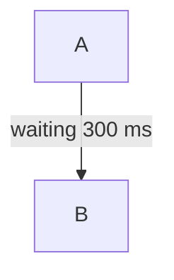

Now:

```text
A → B → C
```

Suppose:

```text
B = 200 ms
C = 300 ms
```

The total dependency time can approach:

```text
200 + 300 = 500 ms
```

plus network and processing overhead.

Long synchronous chains increase latency.

---

# 7. Dependency Chains

Consider:

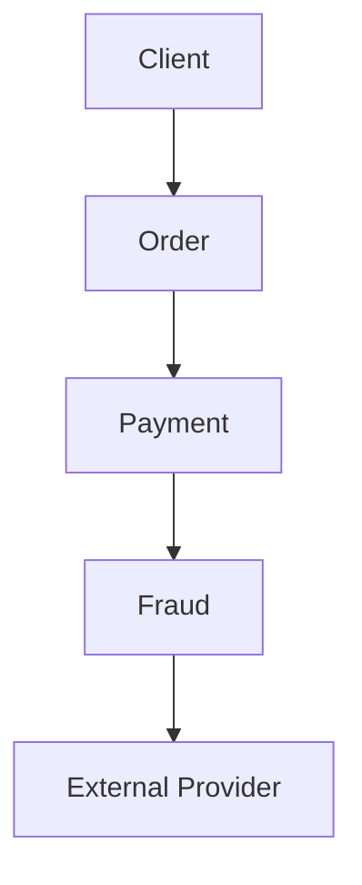

One user request depends on four downstream components.

If the final provider is slow:

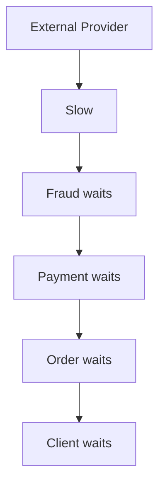

This is a **dependency chain**.

Every additional synchronous dependency increases the potential failure and latency surface.

---

# 8. Fan-Out

Another pattern is **fan-out**.

One service calls many services:

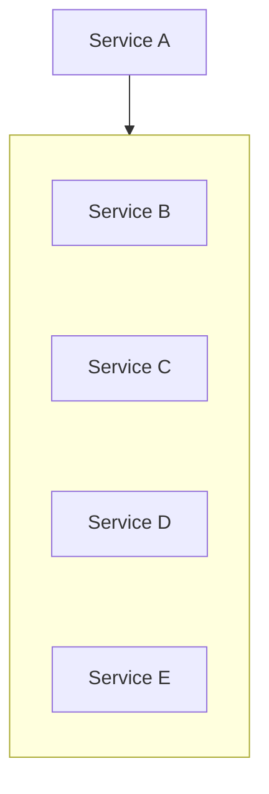

This can be useful.

For example:

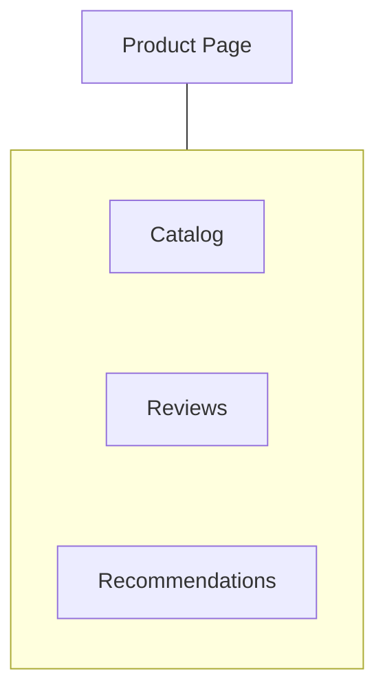

But fan-out creates more dependencies.

If each service has a small probability of failure, the overall request can become more fragile as the number of required dependencies grows.

---

# 9. Required vs Optional Dependencies

Not every dependency needs to block the request.

Consider:

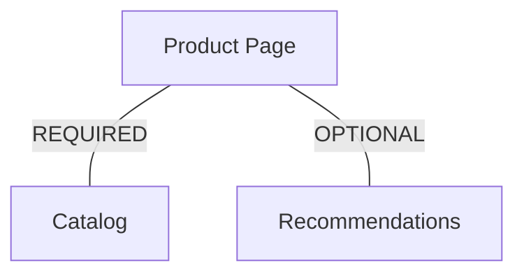

If Catalog fails:

```text
Product page → cannot be built correctly
```

If Recommendations fails:

```text
Product page → still useful
```

Therefore:

> **Separate critical dependencies from optional enhancements.**

This enables graceful degradation.

---

# 10. Asynchronous Communication

In asynchronous communication:

> **The caller can continue without waiting for the final result.**

For example:

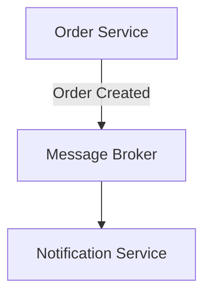

The Order Service does not necessarily wait for the notification to be delivered.

Instead:

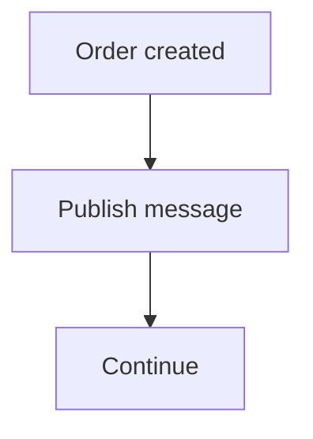

A worker or consumer processes the message later.

---

# 11. Why Use Asynchronous Communication?

Async communication is useful when:

- the result is not immediately required
- work can happen later
- processing may be slow
- temporary bursts need buffering
- multiple consumers need the same event
- the workflow naturally continues in the background

Examples:

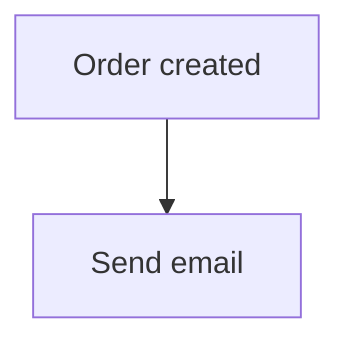

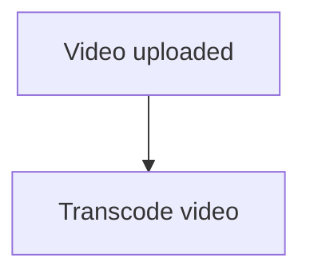

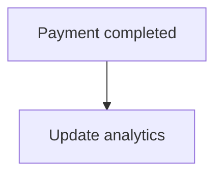

The user does not necessarily need to wait for all of these operations.

---

# 12. Synchronous vs Asynchronous

| Synchronous | Asynchronous |
|---|---|
| Caller waits | Caller can continue |
| Immediate result | Result may come later |
| Simple request-response | Often uses messages/events |
| Lower conceptual complexity | More workflow complexity |
| Can increase latency | Can reduce synchronous latency |
| Dependency failure affects caller directly | Failure can sometimes be isolated |
| Good for required immediate decisions | Good for background/optional work |

Neither is universally better.

The correct question is:

> **Does this business operation require the result immediately?**

---

# 13. Async Does Not Mean Faster

This distinction is important.

Suppose:

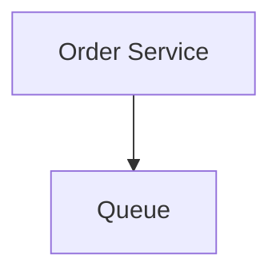

The Order Service returns quickly.

That does not mean the notification was delivered quickly.

It means:

```text
Submission completed
```

not:

```text
Final work completed
```

For example:

```mermaid
flowchart TD
  accTitle: The whole asynchronous path
  accDescr: Order Service publishes an event to a queue; after waiting, a notification worker takes it and calls the email provider.
  N0["Order Service"] -->|"publish event"| N1["Queue"] -->|"waiting"| N2["Notification Worker"] --> N3["Email Provider"]
```

The overall operation may take seconds.

The user-facing request can still finish quickly because it does not wait for the entire workflow.

---

# 14. Async Introduces New Questions

Once work becomes asynchronous, you must think about:

```text
What if the message is duplicated?
What if processing fails?
What if messages arrive out of order?
What if the worker is unavailable?
What if the queue grows?
What if the user needs the result immediately?
```

These are not reasons to avoid async.

They are the trade-offs of removing synchronous waiting.

Many of these topics were covered in Level 5:

- queues
- workers
- retries
- ordering
- delivery semantics
- idempotency
- dead-letter queues
- backpressure

---

# 15. Request vs Event

These concepts are often confused.

### Request

A request asks another component to do something or provide information.

```mermaid
flowchart TD
  accTitle: A request
  accDescr: Order Service asks Payment Service "Get payment status".
  N0["Order Service"] -->|"#quot;Get payment status#quot;"| N1["Payment Service"]
```

### Event

An event communicates that something already happened.

```mermaid
flowchart TD
  accTitle: An event
  accDescr: Order Service sends "OrderCreated" to the message broker.
  N0["Order Service"] -->|"#quot;OrderCreated#quot;"| N1["Message Broker"]
```

The distinction is:

```text
Request → "Please do / tell me something."

Event   → "This already happened."
```

This affects coupling and ownership.

---

# 16. Command vs Event

A command usually expresses intent:

```text
"Charge this payment."
```

An event describes a completed fact:

```text
"PaymentCaptured."
```

Conceptually:

```mermaid
flowchart TD
  accTitle: Command, then event
  accDescr: Command, then Service performs work, then Event.
  N0["Command"] --> N1["Service performs work"] --> N2["Event"]
```

The exact implementation depends on the architecture.

The important distinction is:

> **Intent is different from fact.**

---

# 17. API Communication

A common synchronous pattern is HTTP API communication.

Example:

```http
POST /payments
```

Request:

```json
{
  "orderId": "ORD-123",
  "amount": 1000
}
```

Response:

```json
{
  "paymentId": "PAY-456",
  "status": "authorized"
}
```

The Payment Service exposes the contract.

The caller should not need to know:

```text
Database schema
Internal classes
Internal framework
Internal provider implementation
```

Only the public contract matters.

---

# 18. RPC Communication

RPC means **Remote Procedure Call**.

It tries to make remote communication feel similar to calling a function.

Conceptually:

```mermaid
flowchart TD
  accTitle: A remote procedure call
  accDescr: Order Service calls payment.authorize(...) on Payment Service.
  N0["Order Service"] -->|"payment.authorize(...)"| N1["Payment Service"]
```

Technologies such as gRPC can provide structured contracts and efficient communication.

But RPC does not remove distributed-system problems.

The remote call can still:

- time out
- fail
- become slow
- return an error
- experience network problems

Therefore:

> **RPC may look like a function call, but it behaves like a network operation.**

---

# 19. Serialization

Services need to convert data into a format that can cross the network.

For example:

```mermaid
flowchart TD
  accTitle: Serialization
  accDescr: Application Object, then JSON / Protobuf / Other Format, then Network, then Deserialize, then Application Object.
  N0["Application Object"] --> N1["JSON / Protobuf / Other Format"] --> N2["Network"] --> N3["Deserialize"] --> N4["Application Object"]
```

This adds:

- CPU work
- memory usage
- network payload size
- compatibility considerations

Large payloads can therefore become a performance problem.

---

# 20. Communication Contracts

A service contract should define things such as:

```text
Endpoint / method
Request format
Response format
Errors
Authentication
Timeout expectations
Idempotency behavior
Compatibility
Versioning
```

For example:

```text
POST /payments
```

might define:

```text
Input:
orderId
amount
currency
idempotencyKey

Output:
paymentId
status
```

Consumers should not guess the contract.

---

# 21. Contract Evolution

Services change over time.

Suppose:

```text
Version 1
{
  "name": "Ranjit"
}
```

Later the service needs:

```text
Version 2
{
  "firstName": "Ranjit",
  "lastName": "Karmakar"
}
```

If every consumer assumes the old format, a change can break multiple services.

Therefore service communication needs compatibility thinking.

A safer approach is often:

```mermaid
flowchart TD
  accTitle: A safer contract change
  accDescr: Add new field, then Support old consumers, then Migrate consumers, then Remove old behavior later.
  N0["Add new field"] --> N1["Support old consumers"] --> N2["Migrate consumers"] --> N3["Remove old behavior later"]
```

Avoid making every service change a synchronized deployment.

---

# 22. Backward Compatibility

A service should ideally evolve without unexpectedly breaking consumers.

For example:

```mermaid
flowchart TD
  accTitle: Backward compatibility
  accDescr: Old Consumer, then New Service.
  N0["Old Consumer"] --> N1["New Service"]
```

should continue working when possible.

Adding an optional field is often safer than removing or changing the meaning of an existing field.

Compatibility requirements depend on the protocol and contract.

The broader principle is:

> **A service boundary is valuable only if the contract allows independent evolution.**

---

# 23. Timeouts

Network communication can fail by becoming slow rather than immediately returning an error.

Therefore:

```mermaid
flowchart TD
  accTitle: A timeout
  accDescr: Service A sends a request to Service B; with no response, it times out.
  N0["Service A"] -->|"request"| N1["Service B"] -->|"no response"| N2["Timeout"]
```

Service A should not wait forever.

A timeout protects resources and bounds latency.

But remember:

> **A timeout does not prove that the remote operation failed.**

The operation may have succeeded while the response was delayed or lost.

This becomes particularly important for operations with side effects.

---

# 24. Retries

Suppose a request fails temporarily:

```mermaid
flowchart TD
  accTitle: A temporary failure
  accDescr: Service A sends a request to Service B, which fails.
  N0["Service A"] -->|"request"| N1["Service B ❌"]
```

A retry may help:

```mermaid
flowchart TD
  accTitle: Retry with backoff
  accDescr: Request, then failure, then backoff, then retry.
  N0["Request"] --> N1["failure"] --> N2["backoff"] --> N3["retry"]
```

But retries can also increase load.

If 1,000 callers all retry at the same time:

```text
1,000 original requests
        +
1,000 retries
        +
1,000 more retries
```

the dependency can become even more overloaded.

Therefore retries should generally consider:

- timeout/deadline
- retry limit
- backoff
- jitter
- error type
- idempotency
- retry budget

---

# 25. Idempotency

Suppose:

```mermaid
flowchart TD
  accTitle: A charge request
  accDescr: Order Service asks Payment Service to charge ₹1,000.
  N0["Order Service"] -->|"Charge ₹1,000"| N1["Payment Service"]
```

The request times out.

Did payment happen?

Unknown.

If the Order Service blindly retries:

```mermaid
flowchart TD
  accTitle: A blind retry
  accDescr: Charge ₹1,000, then timeout, then retry, then Charge ₹1,000 again.
  N0["Charge ₹1,000"] --> N1["timeout"] --> N2["retry"] --> N3["Charge ₹1,000 again"]
```

the customer could potentially be charged twice.

Idempotency helps make repeated attempts safe.

For example:

```text
Idempotency Key:
PAYMENT-ORDER-123
```

The Payment Service can recognize that the logical operation was already processed.

This is why communication design cannot be separated from business semantics.

---

# 26. Communication and Business Criticality

Different operations require different communication strategies.

### Payment

```text
High correctness requirement
```

Likely needs:

- clear ownership
- strong contract
- idempotency
- controlled retries
- timeout
- explicit failure handling

### Analytics

```text
Delayed result acceptable
```

Could use:

```mermaid
flowchart TD
  accTitle: Analytics through events
  accDescr: Event, then Queue / Stream, then Analytics processing.
  N0["Event"] --> N1["Queue / Stream"] --> N2["Analytics processing"]
```

### Email

```text
Usually not required to complete order transaction
```

Could be asynchronous.

The communication pattern should follow the business requirement.

---

# 27. Chatty Communication

A service boundary becomes problematic when one operation requires many small calls.

For example:

```mermaid
flowchart TD
  accTitle: Chatty communication
  accDescr: Order Service calls customer, address, product, pricing, inventory, tax, promotion and shipping.
  H["Order Service"] --> G
  subgraph G[" "]
    direction TB
    I0["Customer"] ~~~ I1["Address"] ~~~ I2["Product"] ~~~ I3["Pricing"] ~~~ I4["Inventory"] ~~~ I5["Tax"] ~~~ I6["Promotion"] ~~~ I7["Shipping"]
  end
```

If each requires another network request, latency and failure probability increase.

This is called **chatty communication**.

A useful warning sign is:

> **If completing one business operation requires a large number of tiny cross-service calls, the boundaries may be wrong—or the interaction pattern may need redesign.**

---

# 28. Communication and Data Ownership

Suppose Order Service needs product information.

A tempting approach is:

```mermaid
flowchart TD
  accTitle: A remote lookup on every request
  accDescr: Order Service, then Catalog Service, then Product database.
  N0["Order Service"] --> N1["Catalog Service"] --> N2["Product database"]
```

for every request.

But if the Order needs only the product name and price at order creation, the system may need a deliberate representation of the required data.

For example:

```mermaid
flowchart TD
  accTitle: A historical snapshot
  accDescr: The order keeps the product ID, the product name at purchase and the price at purchase.
  H["Order"] --> G
  subgraph G[" "]
    direction TB
    I0["Product ID"] ~~~ I1["Product name at purchase"] ~~~ I2["Price at purchase"]
  end
```

The order often needs a historical snapshot of relevant information.

This is a business-model decision, not merely a communication optimization.

The broader principle:

> **Do not turn every piece of data access into a remote lookup without considering ownership, consistency, latency, and historical correctness.**

---

# 29. Synchronous Communication Example

Imagine an e-commerce checkout:

```mermaid
flowchart TD
  accTitle: A synchronous checkout
  accDescr: Client, Order Service reserves inventory (available), authorizes payment (authorized), then responds.
  N0["Client"] --> N1["Order Service"] -->|"Reserve inventory"| N2["Inventory Service"] -->|"Available"| N3["Order Service"] -->|"Authorize payment"| N4["Payment Service"] -->|"Authorized"| N5["Order Service"] --> N6["Response"]
```

This may be necessary if the user must know immediately whether the checkout succeeded.

But notice the dependency chain:

```mermaid
flowchart TD
  accTitle: The checkout dependency chain
  accDescr: Client, then Order, then Inventory, then Payment.
  N0["Client"] --> N1["Order"] --> N2["Inventory"] --> N3["Payment"]
```

Each boundary adds another possible failure.

Timeouts, idempotency, and clear failure semantics become important.

---

# 30. Asynchronous Communication Example

Now consider order notifications:

```mermaid
flowchart TD
  accTitle: One event, many consumers
  accDescr: Order Service publishes OrderCreated to a message broker, which feeds an email worker, an SMS worker and an analytics consumer.
  O["Order Service"] -->|"OrderCreated"| B["Message Broker"] --> G
  subgraph G[" "]
    direction TB
    I0["Email Worker"] ~~~ I1["SMS Worker"] ~~~ I2["Analytics Consumer"]
  end
```

The Order Service does not need to wait for all three operations.

This reduces synchronous coupling.

One event can also support multiple consumers.

---

# 31. Eventual Consistency

Asynchronous communication often means state changes become visible later.

For example:

```mermaid
flowchart TD
  accTitle: Changes become visible later
  accDescr: Order Created, then Event published, then Notification processed, then Analytics updated.
  N0["Order Created"] --> N1["Event published"] --> N2["Notification processed"] --> N3["Analytics updated"]
```

There may be a short period where:

```text
Order system = updated
Analytics = not yet updated
```

This is eventual consistency.

The system must decide whether that temporary difference is acceptable.

For analytics:

```text
Usually acceptable
```

For payment authorization:

```text
Usually requires much stricter handling
```

Communication style therefore affects consistency behavior.

---

# 32. Failure Propagation

Consider:

```text
A → B → C → D
```

If D fails:

```mermaid
flowchart TD
  accTitle: Failure propagation
  accDescr: D fails, then C fails/waits, then B fails/waits, then A fails/waits, then User sees error.
  N0["D fails"] --> N1["C fails/waits"] --> N2["B fails/waits"] --> N3["A fails/waits"] --> N4["User sees error"]
```

This is **failure propagation**.

A distributed architecture should try to limit unnecessary propagation.

Techniques include:

- timeouts
- circuit breakers
- retries with limits
- graceful degradation
- asynchronous processing
- bulkheads
- clear critical/optional dependency classification

---

# 33. The Dependency Graph Matters

Do not only look at individual services.

Look at the entire graph:

```mermaid
flowchart LR
  accTitle: A connected dependency graph
  accDescr: A connects to B and C; B and C both connect to D.
  A["A"] --- B["B"] & C["C"]
  B --- D["D"]
  C --- D
```

Highly connected systems are harder to reason about.

A useful service architecture often has:

```text
Clear ownership
+
Limited dependency depth
+
Controlled fan-out
+
Few unnecessary cycles
```

This does not mean the graph must be perfectly simple.

Business workflows naturally create dependencies.

The goal is to avoid accidental complexity.

---

# 34. Communication Pattern Selection

A practical decision flow:

```mermaid
flowchart TD
  accTitle: Choosing a communication pattern
  accDescr: Does the caller need the result immediately? Yes: synchronous, is the dependency critical?, design timeout and failure behavior. No: async, can work be delayed?, queue/event processing.
  Q{"Does the caller need the result immediately?"}
  Q -->|"YES"| S["Synchronous"] --> S2["Is the dependency critical?"] --> S3["Design timeout and failure behavior"]
  Q -->|"NO"| A["Async"] --> A2["Can work be delayed?"] --> A3["Queue/Event processing"]
```

Then ask:

```mermaid
flowchart TD
  accTitle: Then ask
  accDescr: Does it have side effects?, then Do retries need idempotency?, then Can failure be tolerated?, then Can the operation be repeated?, then Is eventual consistency acceptable?.
  N0["Does it have side effects?"] --> N1["Do retries need idempotency?"] --> N2["Can failure be tolerated?"] --> N3["Can the operation be repeated?"] --> N4["Is eventual consistency acceptable?"]
```

---

# 35. Communication Decision Table

| Requirement | Possible Pattern |
|---|---|
| Need immediate answer | Synchronous API/RPC |
| Optional background work | Async message |
| One event → many consumers | Pub/Sub / event |
| Long-running processing | Queue + worker |
| User must know success now | Synchronous workflow |
| Analytics after transaction | Async event |
| Email after order | Async event |
| Critical validation | Often synchronous |
| Large burst of background work | Queue |
| External side effect | Explicit timeout + idempotency strategy |

These are starting points, not universal rules.

---

# 36. Common Mistakes

### Mistake 1 — Treating remote calls like local function calls

Remote calls can fail, timeout, and become slow.

### Mistake 2 — Making everything synchronous

This creates unnecessary dependency chains and user-facing latency.

### Mistake 3 — Making everything asynchronous

Some operations genuinely require an immediate result.

### Mistake 4 — Ignoring timeout behavior

Every synchronous dependency needs a bounded waiting strategy.

### Mistake 5 — Blind retries

Retries can amplify load and duplicate side effects.

### Mistake 6 — No idempotency for retried side effects

A timeout can leave the operation's result unknown.

### Mistake 7 — Excessive fan-out

One request depending on many services becomes fragile.

### Mistake 8 — Chatty communication

Many tiny remote calls can destroy the benefit of service separation.

### Mistake 9 — Breaking contracts casually

A service change can break multiple consumers.

### Mistake 10 — Confusing async submission with completion

Successfully publishing a message does not necessarily mean the final business operation has completed.

---

# 37. Hands-On Exercise

Design communication for this checkout workflow:

```mermaid
flowchart TD
  accTitle: A checkout workflow
  accDescr: Customer, then Order, which calls inventory, payment, notification and analytics.
  C["Customer"] --> O["Order"] --> G
  subgraph G[" "]
    direction TB
    I0["Inventory"] ~~~ I1["Payment"] ~~~ I2["Notification"] ~~~ I3["Analytics"]
  end
```

For each dependency, decide:

| Dependency | Sync or Async? | Why? | Failure behavior |
|---|---|---|---|
| Inventory | ? | ? | ? |
| Payment | ? | ? | ? |
| Notification | ? | ? | ? |
| Analytics | ? | ? | ? |

Then answer:

1. Which dependencies are required before checkout can succeed?
2. Which can happen later?
3. Which operations need idempotency?
4. Where should timeouts exist?
5. Which failures should be visible to the user?
6. Which failures can be handled in the background?
7. Is the dependency graph unnecessarily chatty?

### One possible reasoning direction

A reasonable starting point might be:

```text
Checkout
   |
   +--> Inventory   → synchronous
   |
   +--> Payment     → synchronous
   |
   +--> Notification → asynchronous
   |
   +--> Analytics    → asynchronous
```

But the exact design depends on the business requirements.

The important part is **why** you chose each communication style.

---

# 38. Key Principle

> **Service communication is not just data transfer. It is a distributed dependency.**

Every network call introduces potential:

```text
Latency
Failure
Timeout
Retry
Serialization
Compatibility
Security
Observability
```

Therefore:

> **Use synchronous communication when the caller genuinely needs an immediate result. Use asynchronous communication when work can be decoupled from the caller's request. Keep communication meaningful, minimize unnecessary dependency chains, and design explicitly for failure.**

---

# 39. Quick Reference

### Synchronous

```mermaid
flowchart TD
  accTitle: Synchronous
  accDescr: A sends a request to B and B sends a response to A.
  N0["A"] -->|"request"| N1["B"] -->|"response"| N2["A"]
```

Caller waits.

### Asynchronous

```mermaid
flowchart TD
  accTitle: Asynchronous
  accDescr: A sends a message/event to a broker, which delivers it to B.
  N0["A"] -->|"message/event"| N1["Broker"] --> N2["B"]
```

Caller can continue.

### Request

```text
"Please do this."
```

### Event

```text
"This happened."
```

### Good communication

```text
Meaningful calls
Controlled dependencies
Clear contracts
Bounded waiting
Safe retries
Known failure behavior
```

### Warning signs

```text
Long synchronous chains
Excessive fan-out
Chatty services
Blind retries
No timeouts
No idempotency
Unclear contracts
```

---

# 40. Knowledge Check

### 1. Why is a service call different from a local function call?

**Answer:**  
A service call crosses a network boundary and therefore introduces latency, serialization, failures, timeouts, compatibility concerns, and other distributed-system behavior.

### 2. What is synchronous communication?

**Answer:**  
Communication where the caller waits for the requested operation to produce a result.

### 3. What is asynchronous communication?

**Answer:**  
Communication where the caller can continue without waiting for the final processing result.

### 4. Does asynchronous communication always make the overall operation faster?

**Answer:**  
No. It can reduce user-facing waiting, but the actual background work may still take the same amount of time or longer.

### 5. What is a dependency chain?

**Answer:**  
A sequence of components where one depends on another to continue an operation.

### 6. Why can long synchronous dependency chains be dangerous?

**Answer:**  
They increase latency and create more points where one slow or failed dependency can delay or fail the entire operation.

### 7. Why are retries dangerous for side-effecting operations?

**Answer:**  
A timeout may leave the result unknown. Retrying without idempotency can cause the same logical operation to happen more than once.

### 8. What is fan-out?

**Answer:**  
A pattern where one service communicates with multiple downstream services.

### 9. What is chatty communication?

**Answer:**  
Excessive back-and-forth communication between services, often involving many small network calls for one business operation.

### 10. When is asynchronous communication often useful?

**Answer:**  
When the work does not need to complete before the caller continues, such as notifications, analytics, background processing, and other delayed workflows.

### 11. What is the difference between a request and an event?

**Answer:**  
A request expresses an operation or asks for information; an event communicates that something has already happened.

### 12. What should determine whether communication is synchronous or asynchronous?

**Answer:**  
The business requirement—especially whether the caller genuinely needs the result immediately.

---

# Remember

> **A service boundary separates ownership. Service communication connects those boundaries.**

And:

> **Every network call is a potential source of latency and failure.**

So ask:

```mermaid
flowchart TD
  accTitle: So ask
  accDescr: Does the caller need the result now?, then How critical is the dependency?, then Can the work be asynchronous?, then What happens if the call times out?, then Can it be safely retried?, then What happens if the dependency stays down?, then Are we creating too many dependencies?.
  N0["Does the caller need the result now?"] --> N1["How critical is the dependency?"] --> N2["Can the work be asynchronous?"] --> N3["What happens if the call times out?"] --> N4["Can it be safely retried?"] --> N5["What happens if the dependency stays down?"] --> N6["Are we creating too many dependencies?"]
```

The goal is not to eliminate service communication.

The goal is to make every important cross-service dependency **intentional, bounded, observable, and justified by the business requirement.**

---

# Next Chapter

**07.09 — API Gateway**

Now that we understand **how services communicate**, the next question is:

> **How should clients communicate with many backend services without needing to understand the entire internal service topology?**

That is where the **API Gateway** enters the architecture.
