# 07.09 — API Gateway

## Learning Objectives

By the end of this chapter, you should be able to:

- Explain what an API Gateway is and why it exists.
- Understand where a gateway fits in a service-based architecture.
- Distinguish an API Gateway from a reverse proxy and load balancer.
- Understand common gateway responsibilities.
- Understand authentication, authorization, rate limiting, and API aggregation at the gateway.
- Identify gateway failure modes and scaling concerns.
- Know when an API Gateway is useful and when it is unnecessary.

---

# 1. What Is an API Gateway?

An **API Gateway** is a controlled entry point between clients and backend services.

Instead of clients communicating directly with many internal services:

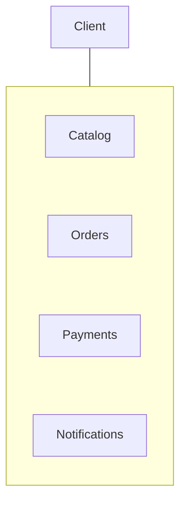

the client can communicate through one gateway:

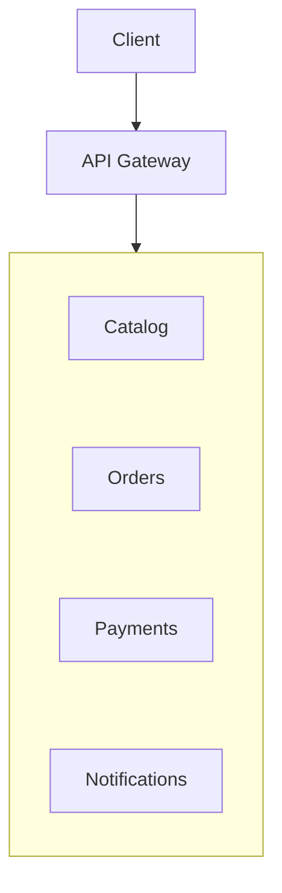

The gateway provides a stable client-facing boundary while the internal service topology can change.

For example, clients can continue calling:

```text
/api/orders
```

even if the Orders service moves from:

```text
10.0.1.20:8080
```

to:

```text
10.0.4.17:9000
```

The client should not need to know.

> **An API Gateway hides internal service topology and provides a controlled entry point for API traffic.**

---

# 2. Why Do We Need One?

Imagine an application with:

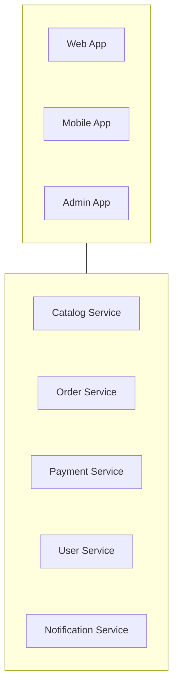

Without a gateway, every client may need to understand:

- where each service lives,
- how each service is authenticated,
- which API version to use,
- how errors are handled,
- which services are allowed,
- how rate limits work.

This creates client-side complexity.

Common API-level policies can be handled at one boundary.

---

# 3. Gateway Responsibilities

An API Gateway can perform several infrastructure/API concerns.

| Responsibility | Purpose |
|---|---|
| Routing | Send requests to the appropriate service |
| TLS termination | Handle HTTPS at the edge |
| Authentication checks | Validate identity/token information |
| Authorization checks | Enforce coarse API access rules |
| Rate limiting | Control request volume |
| Request validation | Reject obviously invalid requests |
| API versioning | Route clients to compatible API versions |
| Transformation | Adapt request/response formats |
| Aggregation | Combine responses from multiple services |
| Observability | Add logging, metrics, tracing information |

Not every gateway needs every capability.

The correct responsibilities depend on the system.

---

# 4. What the Gateway Should Not Own

The gateway should generally **not become the business layer**.

For example:

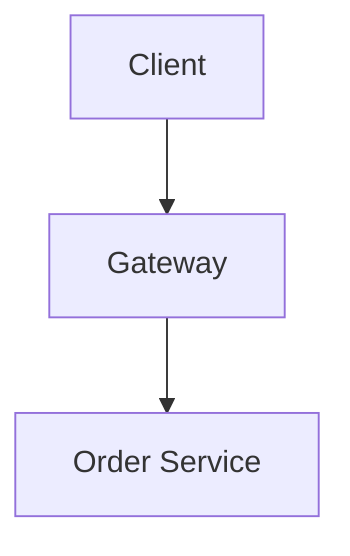

The gateway can determine:

```text
Is this request authenticated?
Is this API allowed?
Where should it go?
```

But the Order Service should determine:

```text
Can this order be cancelled?
Is the order already shipped?
Can this customer receive a refund?
```

Those are domain decisions.

A useful boundary is:

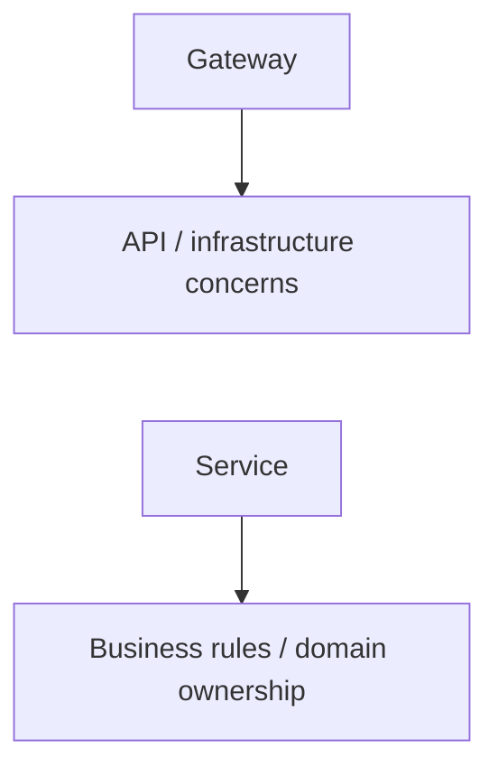

---

# 5. Gateway as a Specialized Reverse Proxy

An API Gateway is closely related to a reverse proxy.

Both can:

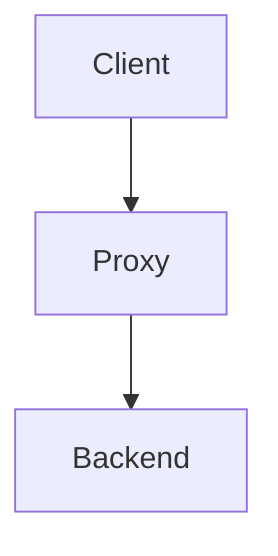

But an API Gateway is usually more focused on **API-level policies and service-based architectures**.

### Reverse Proxy

Typically focuses on:

- forwarding traffic,
- TLS termination,
- static content,
- connection handling,
- infrastructure-level routing.

### API Gateway

Typically focuses on:

- API routing,
- authentication,
- rate limiting,
- API versioning,
- request/response policies,
- service aggregation.

There is overlap.

A reverse proxy can perform many gateway-like functions, and some products can serve both roles.

---

# 6. API Gateway vs Load Balancer

These components can work together.

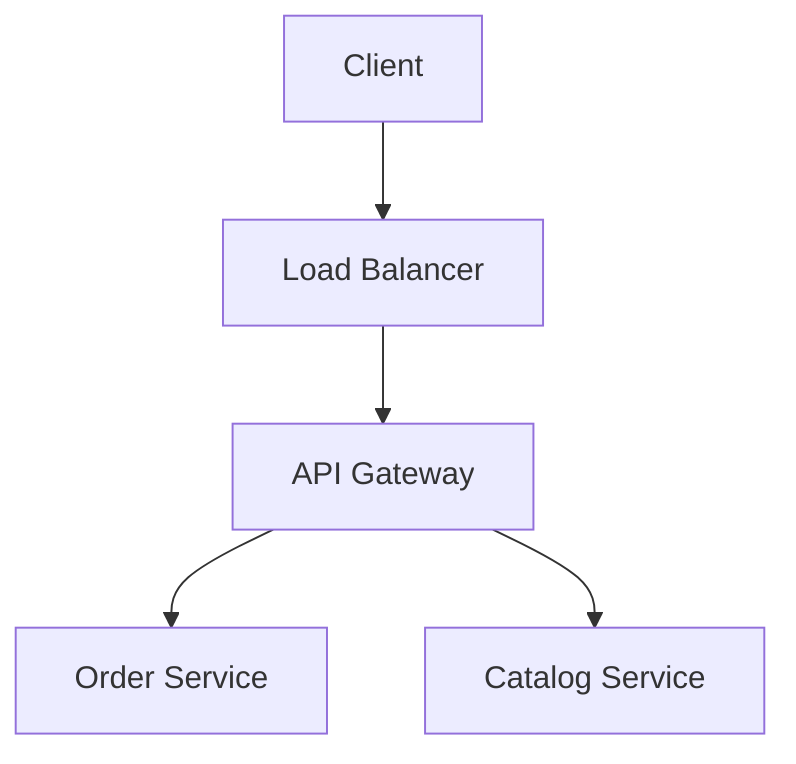

Their primary jobs differ.

| Load Balancer | API Gateway |
|---|---|
| Distributes traffic among instances. | Routes API requests to backend capabilities. |
| Focuses on healthy capacity. | Focuses on API policies and service access. |
| Commonly balances identical service instances. | Can route different API paths to different services. |
| Health checks are central. | Authentication/rate limiting/versioning may be central. |

For example:

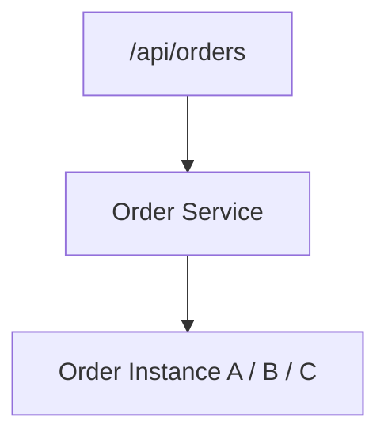

The gateway decides **which service** should receive the request.

The load balancer can then decide **which healthy instance** should handle it.

---

# 7. A Complete Request Flow

Consider:

```http
POST /api/orders
```

A simplified flow is:

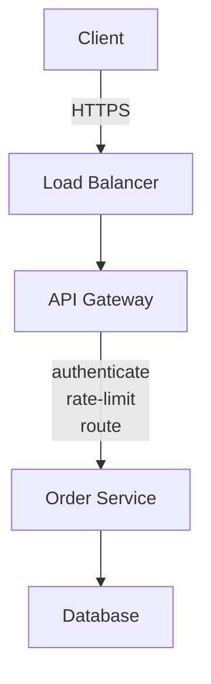

The responsibilities are separated:

```text
Load Balancer
→ distribute traffic

API Gateway
→ apply API-level policies + route

Order Service
→ execute order business logic

Database
→ persist data
```

This separation makes the architecture easier to reason about.

---

# 8. Authentication vs Authorization

A gateway can perform useful authentication checks.

For example:

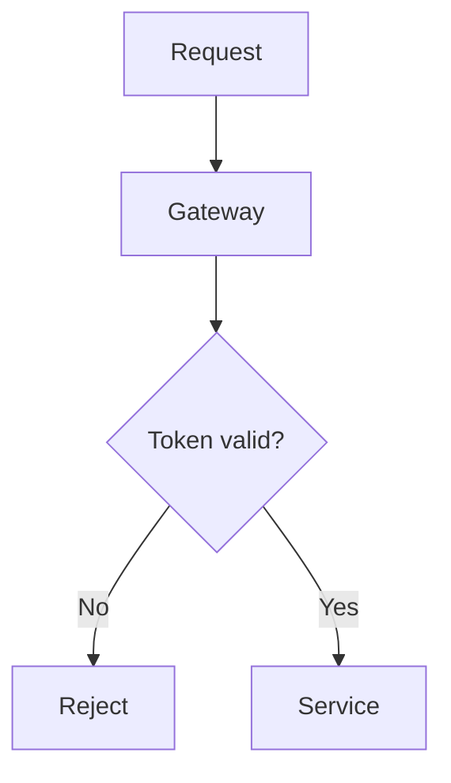

However, authentication and domain authorization are not identical.

The gateway may determine:

```text
Is this request associated with an authenticated user?
```

The owning service may need to determine:

```text
Can this user cancel this particular order?
```

Therefore:

> **The gateway can enforce coarse access policies, but business-specific authorization should remain with the service that owns the business rule.**

---

# 9. Rate Limiting

A gateway is often a convenient place to enforce API-level rate limits.

For example:

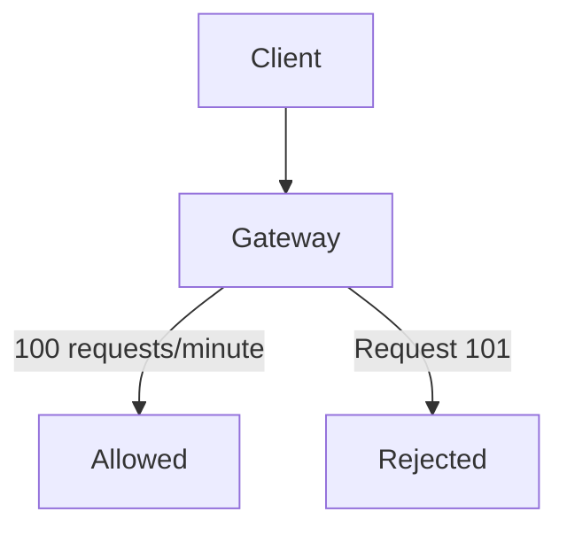

This protects downstream services from excessive traffic.

Rate limiting does not replace capacity planning or service-level protection.

A downstream service may still need its own limits.

---

# 10. Request Validation

The gateway can reject obviously invalid requests early.

For example:

```text
POST /api/orders
Content-Type: application/json
```

The gateway may check:

```text
Required headers?
Payload size?
Basic schema?
Authentication?
```

But business validation belongs in the service.

For example:

```text
"Does this product exist?"
"Is the product available?"
"Can this customer buy it?"
```

Those require domain knowledge.

---

# 11. API Versioning

A gateway can help route different API versions.

For example:

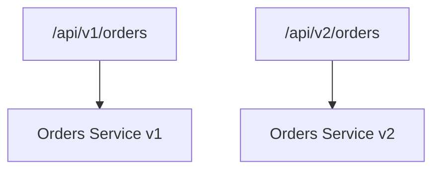

This can help clients migrate gradually.

However, versioning is ultimately an API compatibility problem.

The gateway can route versions, but it cannot eliminate the need for compatible service contracts.

---

# 12. Request and Response Transformation

Different clients may need different representations.

For example:

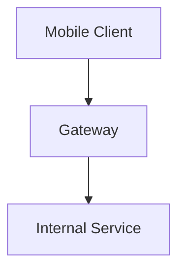

The gateway may transform:

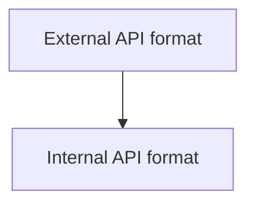

This can be useful when protecting clients from internal implementation details.

But excessive transformation can make the gateway difficult to understand and maintain.

---

# 13. API Aggregation

Sometimes a client needs information from multiple services.

For example, a mobile home screen may require:

```text
User
Orders
Recommendations
Notifications
```

Without aggregation:

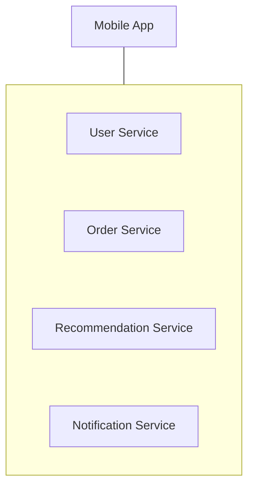

The gateway can combine the results:

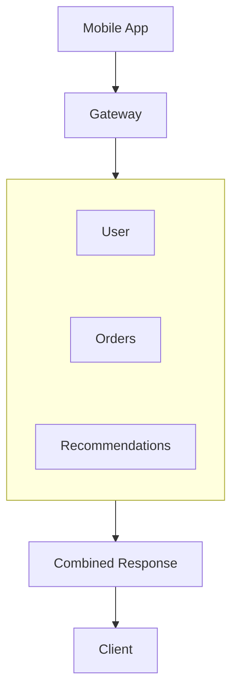

This simplifies the client.

But it creates additional gateway work and failure paths.

If one required dependency is slow:

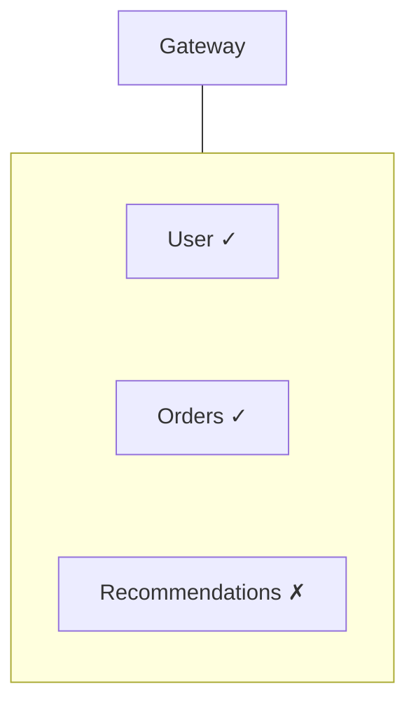

the gateway needs an explicit policy:

```text
Fail entire request?
Return partial response?
Use cached data?
```

Aggregation should therefore be used deliberately.

---

# 14. Gateway and Service Discovery

The gateway needs to know where backend services are running.

For example:

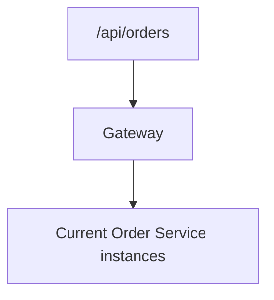

Those instances may change because of:

- scaling,
- deployments,
- failures,
- container restarts,
- infrastructure changes.

The gateway can use service discovery to find eligible instances.

The separation is:

```text
Service Discovery
→ Where are healthy service instances?

Gateway
→ Which API/service should receive this request?

Load Balancing
→ Which eligible instance should receive it?
```

Service discovery is covered in **07.10 — Service Discovery**.

---

# 15. Gateway Failure

The gateway is now part of the request path.

Therefore:

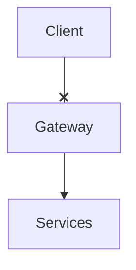

can become a system-wide failure.

A common production design is to run multiple gateway instances:

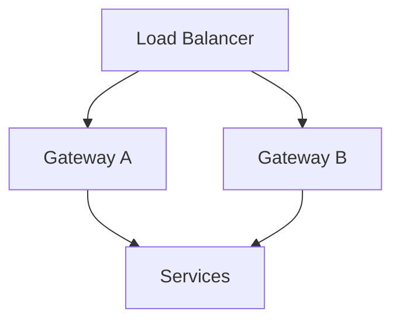

The gateway should therefore be:

- horizontally scalable,
- monitored,
- health-checked,
- deployed redundantly.

A gateway that becomes a single point of failure defeats much of the architecture's resilience.

---

# 16. Gateway as a Bottleneck

Every request may pass through the gateway:

```mermaid
flowchart TD
  accTitle: Everything passes the gateway
  accDescr: 100,000 requests, then Gateway, then Services.
  N0["100,000 requests"] --> N1["Gateway"] --> N2["Services"]
```

Therefore, the gateway must not perform unnecessarily expensive work.

Avoid turning it into:

```mermaid
flowchart TD
  accTitle: A gateway doing too much
  accDescr: The gateway does complex business calculations, large database queries, long-running jobs and heavy transformations.
  H["Gateway"] --- G
  subgraph G[" "]
    direction TB
    I0["complex business calculations"] ~~~ I1["large database queries"] ~~~ I2["long-running jobs"] ~~~ I3["heavy transformations"]
  end
```

Otherwise:

```mermaid
flowchart TD
  accTitle: A slow gateway slows everything
  accDescr: More traffic, then Gateway CPU increases, then Gateway latency increases, then All APIs become slower.
  N0["More traffic"] --> N1["Gateway CPU increases"] --> N2["Gateway latency increases"] --> N3["All APIs become slower"]
```

Keep the gateway focused on its boundary responsibilities.

---

# 17. Timeouts and Retries

Gateway calls to backend services need timeouts.

For example:

```mermaid
flowchart TD
  accTitle: A gateway timeout
  accDescr: Client, gateway, then the order service with a timeout.
  N0["Client"] --> N1["Gateway"] -->|"timeout"| N2["Order Service"]
```

The timeout should fit inside the overall request deadline.

Retries require more care.

A gateway blindly retrying every failed request can increase downstream load:

```mermaid
flowchart TD
  accTitle: Blind retries
  accDescr: The gateway sends a request, a retry and another retry to an already overloaded service.
  H["Gateway"] --- G
  subgraph G[" "]
    direction TB
    I0["Request"] ~~~ I1["Retry"] ~~~ I2["Retry"]
  end
  G --> X["Already overloaded service"]
```

For operations with side effects, retry safety and idempotency are especially important.

> **A gateway should not turn a temporary downstream problem into additional load.**

---

# 18. Gateway Security Boundary

The gateway can provide an important security boundary.

It can centralize:

- TLS handling,
- authentication checks,
- request filtering,
- rate limiting,
- request-size limits,
- API access policies.

But it should not be treated as the **only** security layer.

Services should still enforce appropriate authorization and validate requests.

Think:

```text
Gateway Security
       +
Service Security
       +
Network Security
```

rather than:

```text
Gateway = entire security system
```

---

# 19. Gateway and Observability

Because requests pass through the gateway, it is a useful place to collect API-level information.

For example:

```text
Request ID
User/client identity
Route
Status code
Latency
Rate-limit result
Upstream service
```

A correlation ID can follow the request:

```mermaid
flowchart TD
  accTitle: A correlation ID
  accDescr: Request ID abc123 travels from the client through the gateway and the order service to the database.
  N0["Client"] -->|"Request ID: abc123"| N1["Gateway"] -->|"abc123"| N2["Order Service"] -->|"abc123"| N3["Database"]
```

This makes distributed request tracing easier.

The gateway should add useful observability—not become a giant logging bottleneck.

---

# 20. Large File Uploads

Not every request should pass large payloads through the gateway.

For example:

```mermaid
flowchart TD
  accTitle: A large upload through the gateway
  accDescr: The client sends a large video through the gateway to storage.
  N0["Client"] -->|"Large video"| N1["Gateway"] --> N2["Storage"]
```

can unnecessarily consume gateway bandwidth and resources.

A common alternative is:

```mermaid
flowchart TD
  accTitle: Direct upload
  accDescr: The client requests upload authorization, gets temporary upload permission, then uploads directly to object storage.
  N0["Client"] -->|"Request upload authorization"| N1["Application/Gateway"] -->|"Temporary upload permission"| N2["Client"] -->|"Direct upload"| N3["Object Storage"]
```

The application still controls authorization, while the gateway does not have to proxy the entire file.

---

# 21. When an API Gateway Makes Sense

An API Gateway becomes more valuable when you have:

```text
Multiple services
        +
Multiple clients
        +
Shared API policies
        +
Need to hide internal topology
        +
API aggregation/versioning needs
```

For example:

```mermaid
flowchart TD
  accTitle: Many clients, one gateway
  accDescr: Web, mobile and partner API clients reach the API gateway, which reaches users, catalog, orders and payments.
  subgraph C[" "]
    direction TB
    A0["Web"] ~~~ A1["Mobile"] ~~~ A2["Partner API"]
  end
  C --> H["API Gateway"] --- S
  subgraph S[" "]
    direction TB
    B0["Users"] ~~~ B1["Catalog"] ~~~ B2["Orders"] ~~~ B3["Payments"]
  end
```

The gateway provides a stable external boundary.

---

# 22. When You May Not Need One

If your architecture is simply:

```mermaid
flowchart TD
  accTitle: A simple architecture
  accDescr: Browser, then Web Application, then Database.
  N0["Browser"] --> N1["Web Application"] --> N2["Database"]
```

adding:

```mermaid
flowchart TD
  accTitle: Adding a gateway anyway
  accDescr: Browser, then API Gateway, then Web Application.
  N0["Browser"] --> N1["API Gateway"] --> N2["Web Application"]
```

may provide little value.

It adds:

- another component,
- another deployment,
- another failure point,
- more configuration,
- additional latency/operations.

> **Do not add a gateway merely because the architecture uses modern infrastructure.**

Add it when it solves a real problem.

---

# 23. Gateway vs BFF

A **Backend for Frontend (BFF)** is a backend tailored to a particular client experience.

For example:

```mermaid
flowchart TD
  accTitle: Backends for frontends
  accDescr: Mobile, mobile BFF, orders and catalog. Web, web BFF, orders and catalog.
  M["Mobile"] --> MB["Mobile BFF"] --- MO["Orders"] & MC["Catalog"]
  W["Web"] --> WB["Web BFF"] --- WO["Orders"] & WC["Catalog"]
  MO & MC ~~~ W
```

A BFF can coexist with an API Gateway:

```mermaid
flowchart TD
  accTitle: A gateway in front of BFFs
  accDescr: Client, gateway, then the mobile BFF and the web BFF.
  N0["Client"] --> N1["Gateway"] --- M["Mobile BFF"] & W["Web BFF"]
```

The distinction is useful:

```text
Gateway
→ common API/infrastructure boundary

BFF
→ client-specific backend behavior
```

A BFF should not automatically be added just because multiple clients exist.

---

# 24. Gateway Design Checklist

Before introducing an API Gateway, ask:

### Need

- Do we have multiple backend services?
- Do multiple clients need a common API boundary?
- Do we need centralized API policies?
- Do clients need protection from internal topology?

### Responsibilities

- What exactly belongs in the gateway?
- What business logic stays in services?
- Do we need aggregation?
- Do we need API version routing?

### Reliability

- Can the gateway scale horizontally?
- What happens if it fails?
- Are health checks configured?
- Are timeout budgets defined?

### Security

- Where is authentication checked?
- Where is domain authorization enforced?
- Are services still protected independently?

### Performance

- Is the gateway doing expensive work?
- Could aggregation create excessive fan-out?
- Are large payloads being unnecessarily proxied?

### Operations

- Can we observe gateway latency and errors?
- Can we trace requests through services?
- Can gateway configuration be changed safely?

---

# 25. Common Mistakes

### 1. Turning the gateway into a business layer

```mermaid
flowchart TD
  accTitle: A gateway as business layer
  accDescr: Gateway, then All business logic.
  N0["Gateway"] --> N1["All business logic"]
```

This creates a new monolith at the front of the system.

### 2. Making the gateway a single point of failure

One gateway instance is not enough for a critical production path.

### 3. Blindly retrying requests

Retries can multiply downstream load.

### 4. Excessive aggregation

Large fan-out increases latency and failure complexity.

### 5. Putting all authorization in the gateway

Domain-specific rules belong to the owning service.

### 6. Doing expensive processing at the gateway

The gateway should remain lightweight.

### 7. Adding a gateway without a problem

Extra architecture means extra operational cost.

### 8. Treating the gateway as the entire security system

Services still need appropriate security controls.

---

# 26. Key Principle

> **An API Gateway provides a controlled client-facing boundary to a service-based backend.**

Its value comes from simplifying client access and centralizing appropriate API-level concerns.

It should **not** become the owner of the business domain.

---

# 27. Quick Reference

| Concept | Meaning |
|---|---|
| API Gateway | Client-facing entry point for a service-based backend |
| Routing | Sending an API request to the appropriate backend |
| Aggregation | Combining responses from multiple services |
| Rate Limiting | Controlling request volume |
| API Versioning | Supporting multiple API versions |
| BFF | Backend tailored to a specific client experience |
| Reverse Proxy | General-purpose intermediary forwarding traffic |
| Load Balancer | Distributes traffic across eligible instances |
| Service Discovery | Finds current service instances |
| Gateway Failure | Failure of the shared API entry point |
| Gateway Bottleneck | Gateway capacity limits overall request processing |

---

# 28. Knowledge Check

### Question 1

What is the main purpose of an API Gateway?

To provide a controlled client-facing boundary for routing API traffic and applying appropriate API-level policies.

### Question 2

Is an API Gateway the same as a load balancer?

No.

A load balancer primarily distributes traffic across eligible instances. A gateway focuses on API routing and policies.

### Question 3

Should business rules live in the gateway?

Generally no. Business rules should remain with the service that owns the relevant domain.

### Question 4

Why can aggregation make a gateway more complex?

Because one client request may depend on multiple backend services, increasing fan-out, latency, failure paths, and partial-response decisions.

### Question 5

Can an API Gateway become a bottleneck?

Yes. It sits on the request path and may receive traffic for many services.

### Question 6

Why should gateways be deployed redundantly?

Because gateway failure can prevent clients from reaching otherwise healthy backend services.

### Question 7

When might you not need an API Gateway?

When the system has a simple architecture where the additional routing and policy layer solves no meaningful problem.

---

# Remember

Think of the API Gateway as:

```mermaid
flowchart TD
  accTitle: The API gateway
  accDescr: Clients, API gateway, then three services.
  N0["CLIENTS"] --> N1["API GATEWAY"] --> A["Service"] & B["Service"] & C["Service"]
```

Its job is to provide a **stable API boundary**, not to become another business application.

Ask:

```mermaid
flowchart TD
  accTitle: Ask
  accDescr: What API problem are we solving?, then What belongs at the gateway?, then What belongs inside the service?, then What happens if the gateway fails?, then Does the added complexity justify it?.
  N0["What API problem are we solving?"] --> N1["What belongs at the gateway?"] --> N2["What belongs inside the service?"] --> N3["What happens if the gateway fails?"] --> N4["Does the added complexity justify it?"]
```

> **The API Gateway is the front door to a service-based backend—not the owner of the house.**

**Next: 07.10 — Service Discovery**
