# 07.10 — Service Discovery

## Learning Objectives

By the end of this chapter, you should be able to:

- Explain why service discovery is needed in dynamic service-based systems.
- Understand the difference between **service identity** and an instance's IP/port.
- Explain how a service registry works.
- Distinguish **client-side** and **server-side** discovery.
- Understand registration, health checks, leases, TTLs, and stale entries.
- Understand the relationship between discovery and load balancing.
- Recognize common service-discovery failure modes.
- Decide when service discovery is useful and when simpler mechanisms are enough.

---

# 1. The Problem Service Discovery Solves

In a simple application, you might know exactly where the backend lives:

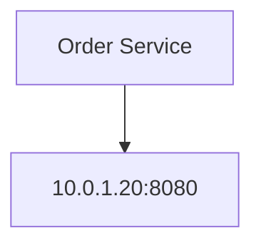

But service-based systems are dynamic.

An Order Service might have multiple instances:

```text
Order Service

10.0.1.20:8080
10.0.1.21:8080
10.0.1.22:8080
```

Then one instance crashes:

```text
10.0.1.20  ✗
10.0.1.21  ✓
10.0.1.22  ✓
```

Later, the system scales:

```text
10.0.1.21
10.0.1.22
10.0.1.23
10.0.1.24
```

Hardcoding IP addresses becomes impractical.

The application needs a way to answer:

> **"Where can I currently find a healthy instance of the Order Service?"**

That is the problem service discovery addresses.

---

# Beginner Vocabulary

| Term | Simple meaning |
|---|---|
| **Service** | A backend capability such as Orders or Payments |
| **Service Instance** | One running copy of that service |
| **Service Identity** | Stable logical name such as `order-service` |
| **Service Registry** | System that keeps track of service instances |
| **Registration** | Adding an instance to the registry |
| **Deregistration** | Removing an instance from the registry |
| **Health Check** | Test used to determine whether an instance is usable |
| **Lease / TTL** | Time-limited registration that must be renewed |
| **Discovery** | Finding currently available service instances |
| **Client-Side Discovery** | Client selects an instance after querying discovery information |
| **Server-Side Discovery** | An intermediary selects an instance for the client |
| **Stale Entry** | Registry information that no longer reflects reality |
| **Load Balancing** | Choosing how traffic is distributed among eligible instances |

---

# 2. Service Name vs IP Address

This distinction is fundamental.

The application should normally depend on:

```text
order-service
```

rather than:

```text
10.0.1.21:8080
```

Why?

Because instances can change.

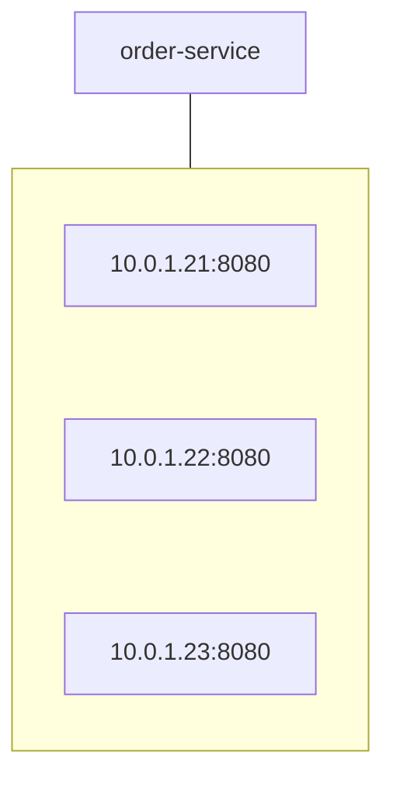

The logical identity stays stable:

```text
order-service
```

while the physical instances can change.

So:

> **Service discovery separates stable service identity from changing service location.**

---

# 3. Static Configuration

The simplest approach is to configure service locations manually.

For example:

```text
order-service = 10.0.1.20:8080
payment-service = 10.0.1.30:8080
```

This can work when infrastructure is small and stable.

But consider scaling:

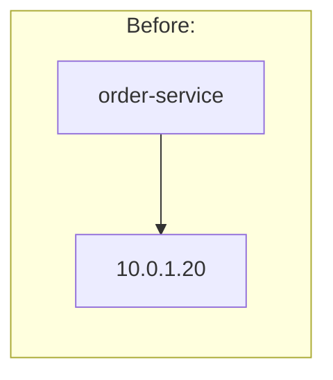

After:

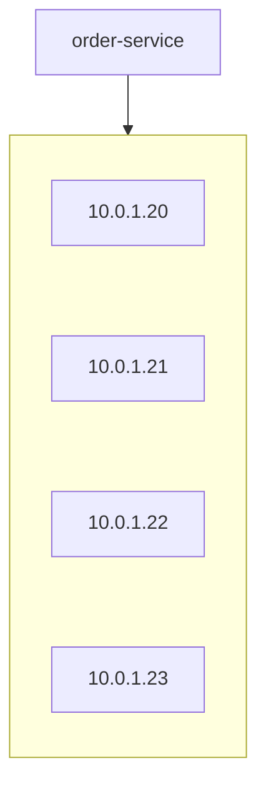

Someone now has to update the configuration.

This becomes increasingly difficult when instances are frequently:

- created,
- destroyed,
- restarted,
- moved,
- replaced,
- scaled.

---

# 4. Dynamic Service Discovery

With dynamic discovery:

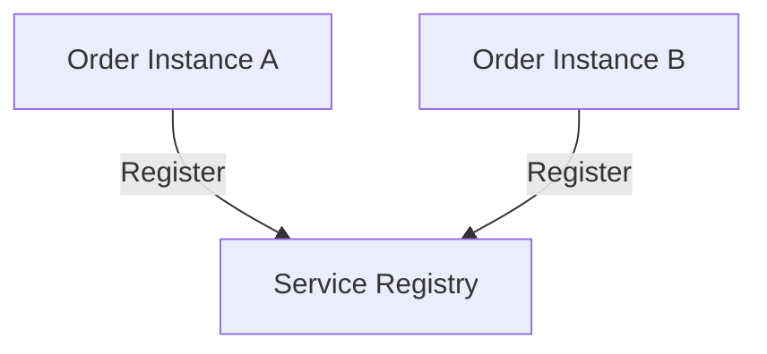

A client can then ask:

```text
"Where are the current Order Service instances?"
```

The registry might return:


The client or an intermediary can then use that information.

---

# 5. Service Registry

A **service registry** maintains information about available service instances.

Conceptually:

```text
+-----------------------------+
|       Service Registry      |
+-----------------------------+
| order-service               |
|   → 10.0.1.21:8080          |
|   → 10.0.1.22:8080          |
|                             |
| payment-service             |
|   → 10.0.2.10:8080          |
|   → 10.0.2.11:8080          |
+-----------------------------+
```

The registry may store information such as:

```text
Service name
IP address
Port
Health status
Metadata
Version
Zone / region
```

The exact information depends on the discovery system.

---

# 6. Registration

When an instance starts, it can register itself.

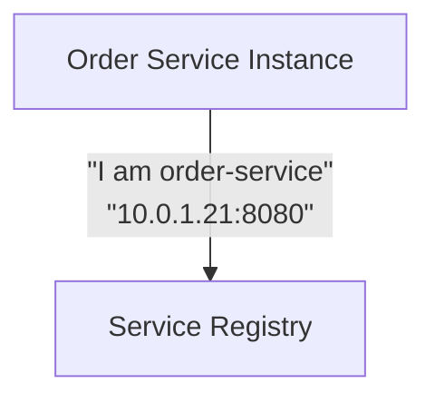

The registry records it.

Now another component can discover it.

This is called **self-registration**.

Another architecture is **third-party registration**, where infrastructure discovers the instance and registers it.

The important idea is:

> **The system needs a reliable way to associate a logical service name with currently available instances.**

---

# 7. Deregistration

When an instance shuts down gracefully, it can remove itself:

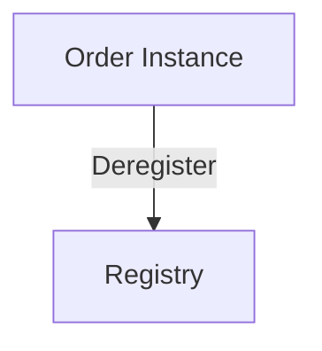

The registry then stops returning that instance.

But graceful shutdown is not guaranteed.

What if:

```text
Order Instance
      X
   crashes
```

It cannot necessarily tell the registry:

> "Please remove me."

This is why service discovery needs health checking or lease expiration.

---

# 8. Health Checks

A registry can check whether an instance is still healthy.

For example:

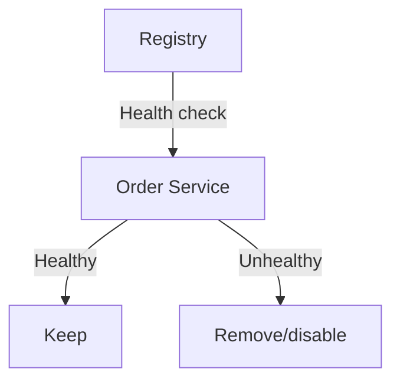

Health checks may test:

- process availability,
- network connectivity,
- application readiness,
- dependency readiness,
- a dedicated health endpoint.

A critical distinction:

> **A process being alive does not necessarily mean it is ready to receive traffic.**

For example:

```text
Process = running
Database connection = unavailable
```

The service may be alive but not ready.

---

# 9. Heartbeats and Leases

Another approach is for service instances to periodically prove that they are still active.

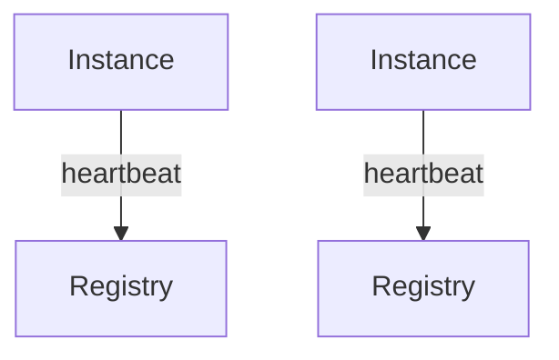

Suppose a registration has a lease:

```text
Lease = 30 seconds
```

The instance must renew it before expiration.

If heartbeats stop:

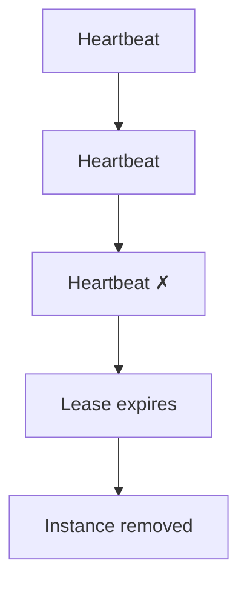

This prevents permanently stale registrations.

The exact mechanism varies between systems.

---

# 10. TTL

A **TTL (Time To Live)** gives information an expiration period.

For example:

```text
Registration TTL = 30 seconds
```

If it is not renewed:

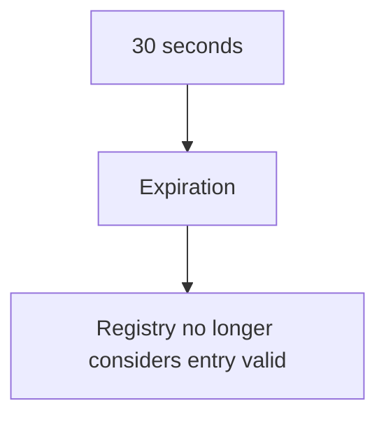

TTL is useful because it provides a failure-recovery mechanism when an instance disappears unexpectedly.

But TTL values involve a trade-off.

### Too short

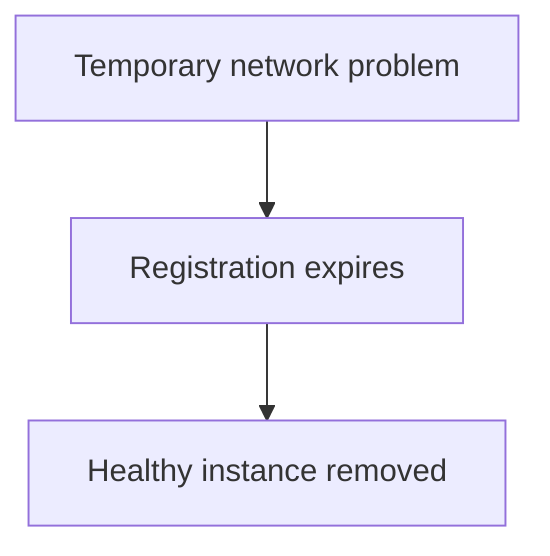

### Too long

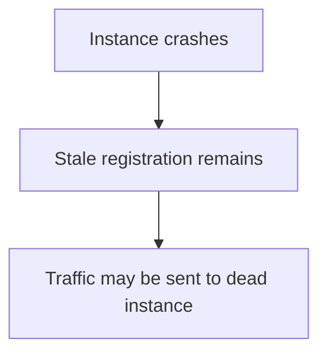

Therefore:

> **Discovery freshness and stability must be balanced.**

---

# 11. Client-Side Discovery

In **client-side discovery**, the client learns the available instances and chooses one.

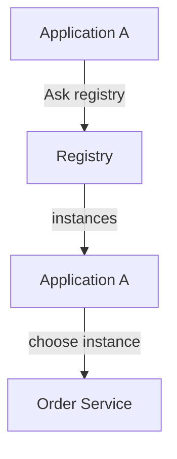

For example:

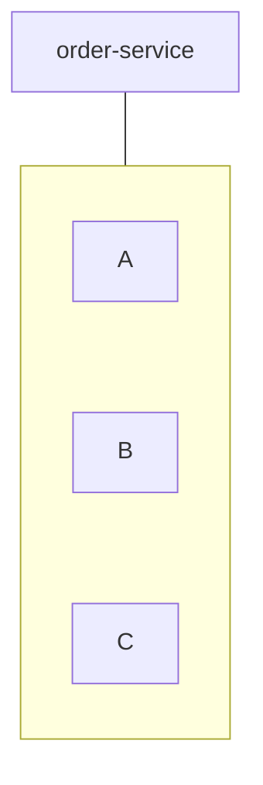

The client may choose:

```text
A
```

using a load-balancing strategy.

The client therefore needs to understand discovery.

---

# 12. Server-Side Discovery

In **server-side discovery**, the client sends the request to an intermediary.

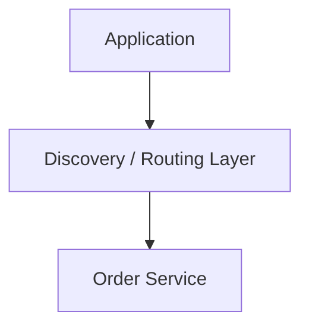

The intermediary finds an eligible instance and routes the request.

Conceptually:

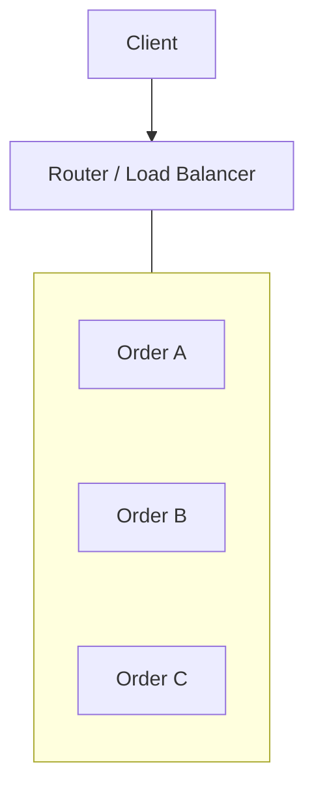

The client does not need to know the individual instance addresses.

This can simplify application code.

---

# 13. Client-Side vs Server-Side Discovery

| Client-Side | Server-Side |
|---|---|
| Client knows discovery mechanism. | Infrastructure handles discovery. |
| Client chooses instance. | Router/intermediary chooses instance. |
| More logic in application. | More infrastructure responsibility. |
| Can provide application-aware routing. | Keeps clients simpler. |
| Client libraries must support discovery. | Requires routing infrastructure. |

Neither approach is universally better.

The choice depends on:

- platform,
- operational model,
- client languages,
- infrastructure,
- routing requirements.

---

# 14. DNS-Based Discovery

DNS can also provide a simple form of service discovery.

For example:

```text
order-service.example.internal
```

may resolve to an address or set of addresses.

Conceptually:

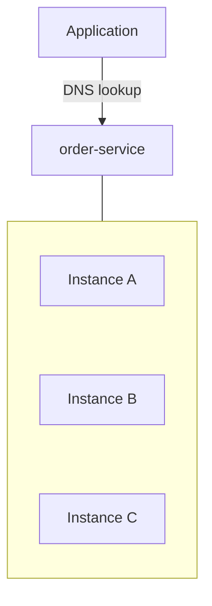

This can be attractive because applications already understand DNS.

However, DNS introduces caching.

A client may continue using an old result for some time.

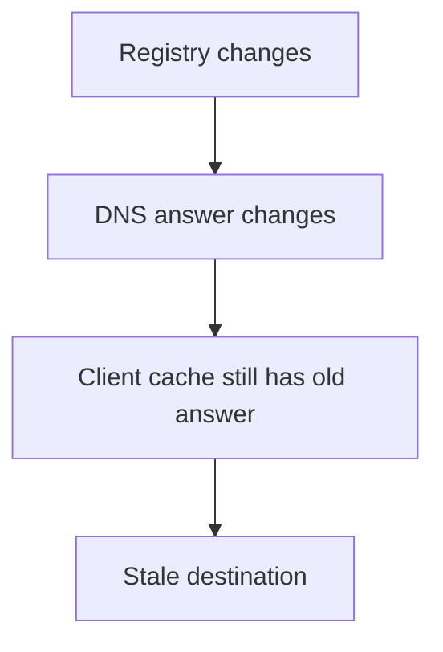

Therefore:

> **DNS-based discovery is simple, but DNS caching affects how quickly changes become visible.**

---

# 15. Discovery and Load Balancing Are Different

These concepts are closely related but not identical.

### Service Discovery

Answers:

> **"Which instances currently exist or are eligible?"**

### Load Balancing

Answers:

> **"Which eligible instance should receive this request?"**

For example:

```mermaid
flowchart TD
  accTitle: Discovery finds candidates
  accDescr: Discovery finds A, B and C.
  R["Discovery"] --> K0["A"] & K1["B"] & K2["C"]
```

Then load balancing chooses:

```text
Request 1 → A
Request 2 → B
Request 3 → C
```

So:

```mermaid
flowchart TD
  accTitle: Two responsibilities
  accDescr: Discovery finds candidates. Load balancing chooses a candidate.
  A0["Discovery"] --> B0["Find candidates"]
  A1["Load Balancing"] --> B1["Choose candidate"]
  B0 ~~~ A1
```

Some infrastructure combines these functions, but the conceptual responsibilities remain different.

---

# 16. Discovery and the API Gateway

The API Gateway from the previous chapter may also need service discovery.

For example:

```mermaid
flowchart TD
  accTitle: The gateway uses discovery
  accDescr: Client, API gateway asks discovery "Where is order-service?", which knows order A, B and C.
  N0["Client"] --> N1["API Gateway"] -->|"#quot;Where is order-service?#quot;"| D["Discovery"] --- G
  subgraph G[" "]
    direction TB
    I0["Order A"] ~~~ I1["Order B"] ~~~ I2["Order C"]
  end
```

The gateway can then route the request to an eligible instance.

This gives us:

```mermaid
flowchart TD
  accTitle: Separate concepts
  accDescr: Client, then API Gateway, then Service Discovery, then Load Balancing, then Service Instance.
  N0["Client"] --> N1["API Gateway"] --> N2["Service Discovery"] --> N3["Load Balancing"] --> N4["Service Instance"]
```

These are separate concepts even when one platform combines them.

---

# 17. What Happens During Scaling?

Suppose:

```text
order-service

Instance A
Instance B
```

Traffic increases.

The system starts:

```text
Instance C
Instance D
```

The new instances register:

```mermaid
flowchart TD
  accTitle: New instances registered
  accDescr: The registry holds A, B, C and D.
  H["Registry"] --- G
  subgraph G[" "]
    direction TB
    I0["A"] ~~~ I1["B"] ~~~ I2["C"] ~~~ I3["D"]
  end
```

Requests can now be distributed across more capacity.

When traffic decreases:

```text
C
D
```

may be removed.

The registry eventually becomes:

```text
A
B
```

This allows service locations to change without requiring application code changes.

---

# 18. What Happens When an Instance Fails?

Suppose:

```mermaid
flowchart TD
  accTitle: An instance fails
  accDescr: The registry: A healthy, B healthy, C failed.
  H["Registry"] --- G
  subgraph G[" "]
    direction TB
    I0["A ✓"] ~~~ I1["B ✓"] ~~~ I2["C ✗"]
  end
```

A health check or expired lease can cause C to become ineligible.

```mermaid
flowchart TD
  accTitle: The failed instance removed
  accDescr: The registry: A healthy, B healthy.
  H["Registry"] --- G
  subgraph G[" "]
    direction TB
    I0["A ✓"] ~~~ I1["B ✓"]
  end
```

New requests should no longer be routed to C.

But there can be a delay:

```mermaid
flowchart TD
  accTitle: Discovery takes time
  accDescr: Failure, then Failure detection, then Registry update, then Clients/intermediaries learn update, then Traffic stops reaching C.
  N0["Failure"] --> N1["Failure detection"] --> N2["Registry update"] --> N3["Clients/intermediaries learn update"] --> N4["Traffic stops reaching C"]
```

This is why discovery is not instantaneous truth.

It is a distributed system component with its own timing and failure behavior.

---

# 19. Stale Discovery Information

Imagine:

```text
Registry says:

A ✓
B ✓
C ✓
```

Then C crashes:

```text
C ✗
```

But a client still has cached information:

```text
A
B
C
```

The client may temporarily send traffic to C.

This is a **stale discovery result**.

The system needs mechanisms such as:

- health checks,
- short-lived registrations,
- TTLs,
- refreshes,
- retries,
- failure-aware routing.

Even then, there can be a small window of inconsistency.

---

# 20. Discovery Is Not Perfect Knowledge

A service registry cannot magically know reality at every instant.

Consider:

```mermaid
flowchart TD
  accTitle: Crash or network failure?
  accDescr: A network failure cuts instance C off from the registry.
  C["Instance C"] --x|"network failure"| R["Registry"]
```

The registry may not immediately know whether:

```text
C crashed
```

or:

```text
The network path to C failed
```

This connects directly to distributed-system concepts from Level 6:

```text
Partial Failure
Network Failure
Timeout
Incomplete Information
```

Therefore:

> **Service discovery provides useful information about service locations; it does not provide perfect, instantaneous knowledge of system state.**

---

# 21. Discovery Registry as a Critical Dependency

If every service depends on one registry:

```mermaid
flowchart LR
  accTitle: One registry for every service
  accDescr: Services A, B and C all depend on the registry.
  A["Service A"] & B["Service B"] & C["Service C"] --> R["Registry"]
```

what happens if the registry fails?

Existing clients may still have cached information.

But new registrations or discoveries may fail.

A resilient system therefore considers:

- registry replication,
- failure domains,
- cached discovery information,
- graceful behavior during temporary registry outages.

The registry itself becomes infrastructure that needs reliability.

---

# 22. Caching Discovery Information

Clients or routing infrastructure may cache discovered instances.

For example:

```mermaid
flowchart TD
  accTitle: Caching discovery results
  accDescr: Registry, then Discovery Cache, then Application.
  N0["Registry"] --> N1["Discovery Cache"] --> N2["Application"]
```

This reduces constant registry requests.

It also means:

```mermaid
flowchart TD
  accTitle: A stale cache
  accDescr: Registry changed, then Cache still contains old data.
  N0["Registry changed"] --> N1["Cache still contains old data"]
```

Therefore, discovery caching introduces the same basic trade-off:

```mermaid
flowchart TD
  accTitle: The caching trade-off
  accDescr: Freshness trades off against reduced lookup overhead.
  F["Freshness"] <--> R["Reduced lookup overhead"]
```

The appropriate strategy depends on how quickly service topology changes and how tolerant the system is of stale information.

---

# 23. Service Discovery and Security

Discovery tells you:

```text
"Where is this service?"
```

It does **not** automatically mean:

```text
"This service is authorized to call that service."
```

For example:

```mermaid
flowchart TD
  accTitle: Discovery is not permission
  accDescr: Order Service discovers Payment Service.
  N0["Order Service"] -->|"Discover"| N1["Payment Service"]
```

Finding Payment Service does not establish permission to use it.

Service-to-service authentication and authorization remain separate concerns.

Security details are covered later in Level 11.

---

# 24. Metadata

A registry can sometimes provide more than an address.

For example:

```text
order-service

Instance A
  zone = ap-south-1a
  version = v2

Instance B
  zone = ap-south-1b
  version = v2

Instance C
  zone = ap-south-1a
  version = v1
```

This can support routing decisions such as:

```text
Prefer same-zone instance
```

or:

```text
Send only compatible API version
```

But adding too much routing intelligence to discovery can make the system harder to reason about.

Keep responsibilities clear.

---

# 25. Health Checks: Alive vs Ready

Consider an application starting up:

```mermaid
flowchart TD
  accTitle: Starting up
  accDescr: Process started, then Application initialization, then Database connection established, then Ready.
  N0["Process started"] --> N1["Application initialization"] --> N2["Database connection established"] --> N3["Ready"]
```

If discovery registers the instance immediately:

```mermaid
flowchart TD
  accTitle: Registered too early
  accDescr: Process started, then Traffic arrives, then Application not ready.
  N0["Process started"] --> N1["Traffic arrives"] --> N2["Application not ready"]
```

requests may fail.

A better model is:

```mermaid
flowchart TD
  accTitle: Ready before traffic
  accDescr: Started, then Initializing, then Ready, then Receive traffic.
  N0["Started"] --> N1["Initializing"] --> N2["Ready"] --> N3["Receive traffic"]
```

This is why **readiness** can be more useful for routing than merely checking whether a process exists.

---

# 26. Registration During Deployment

Suppose version 1 is running:

```text
v1 → A
v1 → B
```

A deployment starts:

```text
v2 → C
```

The discovery system may temporarily contain:

```text
v1 → A
v1 → B
v2 → C
```

If the system supports gradual rollout, traffic can be shifted carefully.

Later:

```text
v1 → removed
v2 → C
v2 → D
```

Service discovery therefore participates in dynamic infrastructure changes.

But deployment strategy itself belongs to a broader release-management design.

---

# 27. Failure Modes

Service discovery introduces its own failure scenarios.

| Failure | Possible Effect |
|---|---|
| Registry unavailable | New discovery/registration may fail |
| Stale registration | Traffic sent to dead instance |
| Health check too slow | Failed instance remains eligible |
| Health check too aggressive | Healthy instance removed unnecessarily |
| DNS cache stale | Clients use old destination |
| Registry inconsistency | Different clients see different instances |
| Network partition | Discovery information may diverge |
| Registration storm | Many instances register simultaneously |
| Deregistration failure | Dead instance remains listed |

The goal is not to eliminate every failure.

The goal is to understand and contain them.

---

# 28. Discovery Storms

Imagine 10,000 instances restart simultaneously.

```mermaid
flowchart TD
  accTitle: A registration storm
  accDescr: 10,000 instances register with the registry at once.
  N0["10,000 instances"] -->|"register"| N1["Registry"]
```

The registry suddenly receives a huge amount of traffic.

Similarly, if every client refreshes discovery information at exactly the same time:

```text
Clients
 ↓ ↓ ↓ ↓ ↓ ↓
Registry
```

this can become a synchronization problem.

The same principles from **06.15 — Thundering Herd** can apply:

- jitter,
- caching,
- backoff,
- controlled refresh intervals.

---

# 29. Client Refresh Strategy

Suppose a client refreshes discovery every:

```text
5 seconds
```

If 100,000 clients all refresh exactly every 5 seconds:

```text
0s    → huge spike
5s    → huge spike
10s   → huge spike
15s   → huge spike
```

Adding jitter spreads the refreshes:

```text
Client A → 4.2s
Client B → 5.1s
Client C → 6.0s
Client D → 4.7s
```

The total work remains similar, but instantaneous load becomes smoother.

---

# 30. Discovery vs Configuration

These concepts can overlap but are different.

### Configuration

Answers:

> **"How should this application behave?"**

Examples:

```text
timeout = 2 seconds
feature_enabled = true
log_level = info
```

### Service Discovery

Answers:

> **"Where is the service currently available?"**

Examples:

```mermaid
flowchart TD
  accTitle: Discovery answers where
  accDescr: order-service is at 10.0.1.21:8080 and 10.0.1.22:8080.
  H["order-service"] --> G
  subgraph G[" "]
    direction TB
    I0["10.0.1.21:8080"] ~~~ I1["10.0.1.22:8080"]
  end
```

Configuration is covered in:

**07.11 — Configuration Management**

---

# 31. A Simple Architecture

A basic service-discovery architecture looks like:

```mermaid
flowchart BT
  accTitle: A simple discovery architecture
  accDescr: The order service registers with the service registry; the payment service discovers through it.
  O["Order Service"] -->|"register"| R["Service Registry"]
  P["Payment Service"] -->|"discover"| R
```

---

# 32. When Service Discovery Makes Sense

Dynamic service discovery becomes valuable when:

```text
Instances change frequently
        +
Horizontal scaling exists
        +
Services move/restart dynamically
        +
Static configuration becomes difficult
```

Typical environments include:

- container platforms,
- orchestrated workloads,
- cloud environments,
- large service-based systems.

But not every application needs a dedicated service registry.

A small application may be perfectly fine with:

```text
DNS
+
Static configuration
+
Load balancer
```

The architecture should match the system's actual needs.

---

# 33. Common Mistakes

### Mistake 1 — Hardcoding instance IP addresses

```text
10.0.1.21
```

becomes fragile when instances change.

### Mistake 2 — Treating discovery as load balancing

Discovery finds candidates.

Load balancing chooses among candidates.

### Mistake 3 — Assuming discovered means healthy

An instance can become unhealthy after discovery information was obtained.

### Mistake 4 — Using extremely long TTLs

This increases stale-information windows.

### Mistake 5 — Using extremely short TTLs

This can create unnecessary registry traffic and instability.

### Mistake 6 — Making the registry a single point of failure

The discovery system itself needs appropriate resilience.

### Mistake 7 — Aggressive health checks

Too many checks can create unnecessary load and false failures.

### Mistake 8 — Ignoring cached discovery information

Clients may continue using stale destinations.

### Mistake 9 — Synchronized refreshes

Thousands of clients refreshing simultaneously can create a discovery storm.

### Mistake 10 — Putting business logic into discovery

A registry should answer service-location questions, not become a business decision engine.

---

# 34. Hands-On Exercise

Build a small conceptual simulation.

Imagine:

```text
Service Registry

order-service
    A
    B
    C
```

# Step 1 — Start three instances

```text
A ✓
B ✓
C ✓
```

# Step 2 — Send requests

Route:

```text
Request 1 → A
Request 2 → B
Request 3 → C
```

# Step 3 — Fail B

```text
A ✓
B ✗
C ✓
```

Remove B from the eligible set.

# Step 4 — Add D

```text
A ✓
C ✓
D ✓
```

# Step 5 — Simulate stale discovery

Let a client continue believing B is available.

Observe:

```text
Client → B → failure
```

# Step 6 — Add TTL

Give each registration:

```text
TTL = 30 seconds
```

Stop B's heartbeat.

Observe when B becomes unavailable to discovery.

## What to learn

The exercise demonstrates:

```mermaid
flowchart TD
  accTitle: What the exercise shows
  accDescr: Dynamic topology, then Registration, then Health / lease, then Discovery, then Routing, then Failure handling.
  N0["Dynamic topology"] --> N1["Registration"] --> N2["Health / lease"] --> N3["Discovery"] --> N4["Routing"] --> N5["Failure handling"]
```

---

# 35. Decision Framework

Before introducing a dedicated discovery system, ask:

```mermaid
flowchart TD
  accTitle: Do we need service discovery?
  accDescr: Are service locations dynamic? No: static configuration / DNS may be enough. Yes: do instances scale/change often? No: simple discovery may be enough. Yes: do we need dynamic registration, health, and routing? Yes: service discovery.
  subgraph R1[" "]
    direction TB
    Q1{"Are service locations dynamic?"} -->|"No"| K1["Static configuration / DNS may be enough"]
  end
  subgraph R2[" "]
    direction TB
    Q2{"Do instances scale/change often?"} -->|"No"| K2["Simple discovery may be enough"]
  end
  subgraph R3[" "]
    direction TB
    Q3{"Do we need dynamic registration, health, and routing?"} -->|"Yes"| K3["Service discovery"]
  end
  R1 -->|"Yes"| R2
  R2 -->|"Yes"| R3
```

Then evaluate:

```text
Registry availability
Health-check strategy
TTL / lease duration
Client caching
Refresh strategy
Failure behavior
Security
Operational complexity
```

---

# 36. Key Principle

> **Service discovery separates stable service identity from changing service location.**

Instead of assuming:

```text
order-service = one fixed IP
```

the system can reason:

```mermaid
flowchart TD
  accTitle: Identity, then instances
  accDescr: order-service, then currently eligible instances.
  N0["order-service"] --> N1["currently eligible instances"]
```

But remember:

> **Discovery is not perfect knowledge.**

Registries can be stale, networks can fail, health checks can lag, and clients can cache old information.

Good service discovery therefore combines:

```text
Dynamic registration
+
Health awareness
+
Appropriate expiration
+
Controlled refresh
+
Failure handling
```

---

# 37. Quick Reference

| Concept | Meaning |
|---|---|
| Service identity | Stable logical name of a capability |
| Service instance | One running copy of a service |
| Service registry | Maintains service-instance information |
| Registration | Adding an instance to discovery |
| Deregistration | Removing an instance |
| Health check | Determines whether an instance is usable |
| Heartbeat | Periodic signal that an instance is alive |
| Lease | Time-limited registration requiring renewal |
| TTL | Expiration period for information |
| Client-side discovery | Client finds and selects an instance |
| Server-side discovery | Infrastructure finds and selects an instance |
| Stale discovery | Discovery information no longer reflects reality |
| Load balancing | Selecting/distributing traffic among eligible instances |

---

# 38. Knowledge Check

### Question 1

Why is hardcoding service IP addresses problematic?

Because service instances can be created, destroyed, restarted, scaled, or moved.

### Question 2

What does service discovery provide?

A mechanism for finding currently available instances of a logical service.

### Question 3

Is service discovery the same as load balancing?

No.

Discovery identifies eligible instances; load balancing determines how requests are distributed among them.

### Question 4

Why are health checks important?

Because an instance may still be registered even after it becomes unavailable or unable to serve requests.

### Question 5

What problem does a TTL or lease help solve?

It allows stale registrations to expire when an instance stops renewing its presence.

### Question 6

What is the main difference between client-side and server-side discovery?

With client-side discovery, the application finds and selects an instance. With server-side discovery, an intermediary performs that work.

### Question 7

Can a service registry itself fail?

Yes. It is infrastructure and therefore needs appropriate availability, redundancy, and failure handling.

### Question 8

Why can DNS-based discovery become stale?

Because clients and intermediate DNS infrastructure can cache answers for some period.

---

# Remember

Think of service discovery as:

```mermaid
flowchart TD
  accTitle: Service discovery
  accDescr: A stable identity, "order-service", goes through discovery to instances A, B and C, all healthy.
  N0["Stable Identity"] --> N1["#quot;order-service#quot;"] --> N2["Discovery"] --> A["A ✓"] & B["B ✓"] & C["C ✓"]
```

The important distinction is:

```text
Service Discovery
→ Where are the eligible instances?

Load Balancing
→ Which eligible instance should receive this request?

Service
→ What business work should be performed?
```

The deeper lesson:

> **A service can move without changing its identity.**

That is what allows dynamic infrastructure to scale, recover, and evolve without forcing every caller to track individual machines.

**Next: 07.11 — Configuration Management**
