# 07.11 — Configuration Management

## Learning Objectives

By the end of this chapter, you should be able to:

- Explain what configuration is and why applications need it.
- Distinguish configuration from application code and secrets.
- Understand static, environment-based, and dynamic configuration.
- Understand configuration scope and precedence.
- Understand how configuration changes affect running systems.
- Identify common configuration-management failure modes.
- Design a basic configuration strategy for a production system.

---

# 1. What Is Configuration?

**Configuration** is information that controls how software behaves without changing the application's core code.

For example:

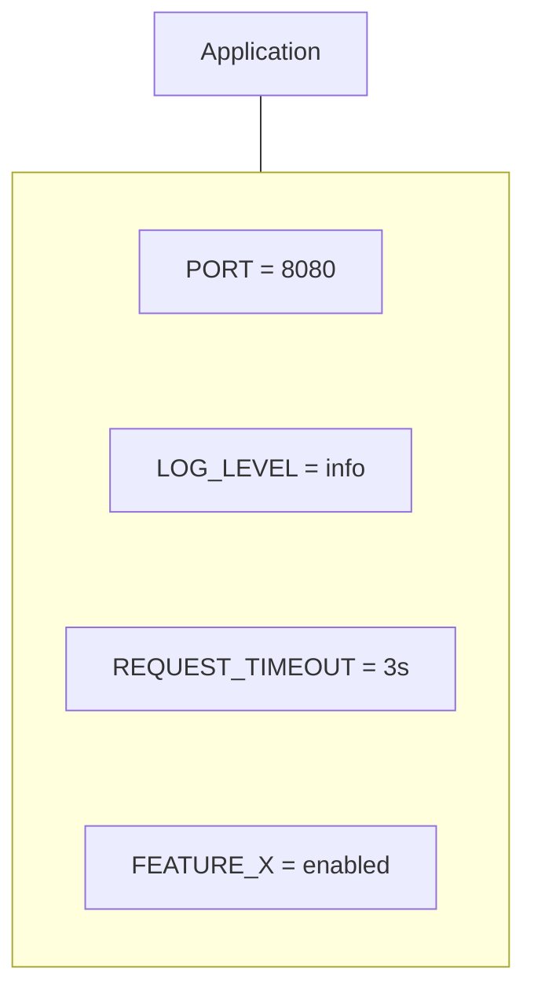

The application code defines **what the system can do**.

Configuration defines **how it should behave in a particular environment or situation**.

For example:

```text
Code:
"Connect to the configured database."

Configuration:
"Use database.example.internal."
```

This separation allows the same application code to run in different environments.

---

# 2. Why Configuration Exists

Imagine the same application running in:

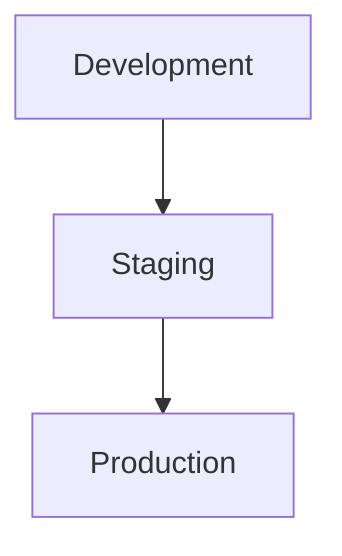

The code may be identical.

But the environment can differ:

```text
Development
DB = localhost
LOG_LEVEL = debug

Production
DB = production-db
LOG_LEVEL = info
```

Without configuration, developers would need to modify application code whenever the environment changed.

That is undesirable.

> **Configuration lets the same application behave appropriately in different environments without changing its core code.**

---

# Beginner Vocabulary

| Term | Simple meaning |
|---|---|
| **Configuration** | Values controlling application behavior |
| **Environment** | A deployment context such as development or production |
| **Environment Variable** | Configuration supplied through the process environment |
| **Default** | Value used when no explicit value is provided |
| **Override** | A higher-priority value replacing another value |
| **Static Configuration** | Configuration loaded at startup or deployment |
| **Dynamic Configuration** | Configuration that can change while the system is running |
| **Configuration Source** | Place from which configuration is obtained |
| **Configuration Store** | System used to centrally store configuration |
| **Feature Flag** | Configuration controlling whether functionality is enabled |
| **Secret** | Sensitive value such as a password or API key |
| **Configuration Drift** | Different environments gradually developing different settings |

---

# 3. Configuration vs Code

Consider:

```text
if (environment == "production") {
    timeout = 5;
}
```

This mixes deployment configuration with application logic.

A cleaner approach is:

```text
timeout = CONFIG.REQUEST_TIMEOUT
```

Then:

```text
Development → 10s
Production  → 5s
```

The code remains the same.

Conceptually:

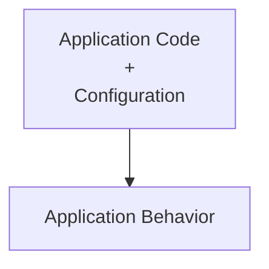

This separation becomes increasingly valuable as systems grow.

---

# 4. Configuration vs Secrets

Configuration and secrets are related but should not automatically be treated the same way.

Normal configuration might be:

```text
LOG_LEVEL=info
MAX_CONNECTIONS=100
REQUEST_TIMEOUT=3s
```

A secret might be:

```text
DATABASE_PASSWORD=...
API_KEY=...
PRIVATE_KEY=...
```

Secrets require stronger protection.

Therefore:

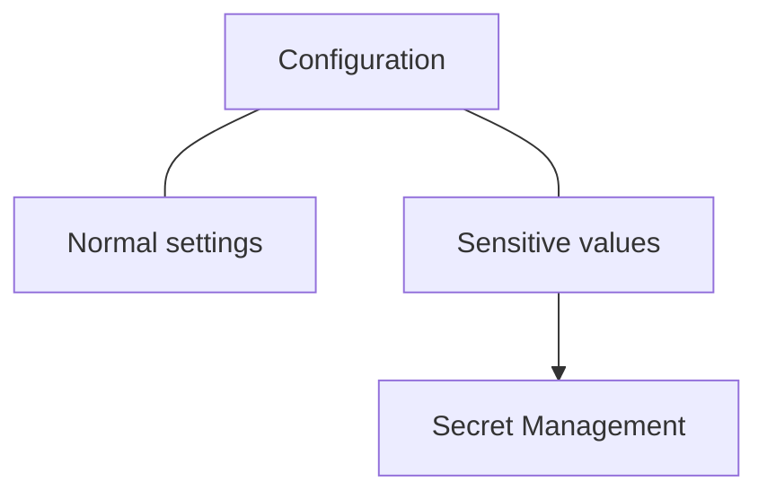

Secrets are covered in:

**07.12 — Secrets Management**

Do not put passwords or private keys into ordinary source-controlled configuration files.

---

# 5. Configuration Sources

Configuration can come from several places.

For example:

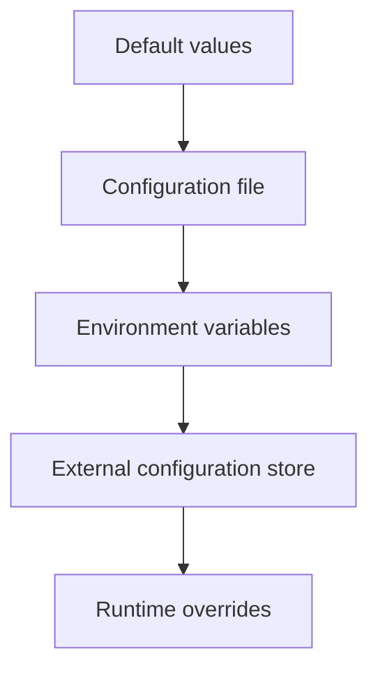

The exact hierarchy depends on the application.

Possible sources include:

- source code defaults,
- configuration files,
- environment variables,
- command-line arguments,
- deployment manifests,
- configuration services,
- feature-flag systems.

The important question is:

> **Which source has authority when multiple values exist?**

---

# 6. Configuration Precedence

Suppose the application defines:

```text
Default:
TIMEOUT = 10s
```

A configuration file says:

```text
TIMEOUT = 5s
```

An environment variable says:

```text
TIMEOUT = 3s
```

If environment variables have higher precedence:

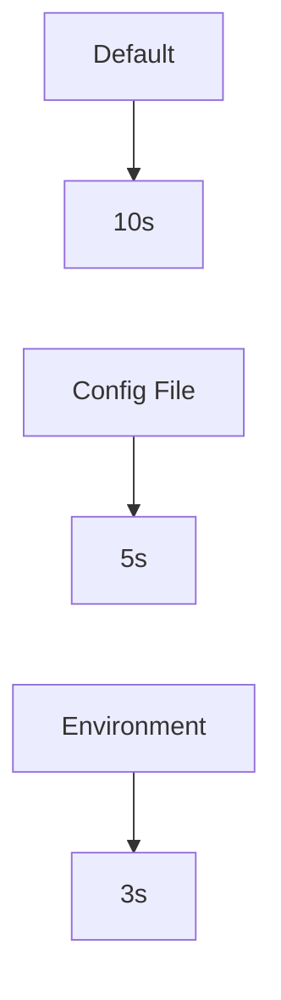

Final value:

```text
TIMEOUT = 3s
```

A production system should document this precedence clearly.

Otherwise, engineers may not know which value is actually active.

---

# 7. Environment Variables

Environment variables are a common way to provide deployment-specific configuration.

For example:

```text
APP_PORT=8080
LOG_LEVEL=info
REQUEST_TIMEOUT=3s
DATABASE_HOST=db.internal
```

The application reads them at startup.

This is particularly useful for:

```text
Development
Staging
Production
```

because the same application artifact can receive different values.

For example:

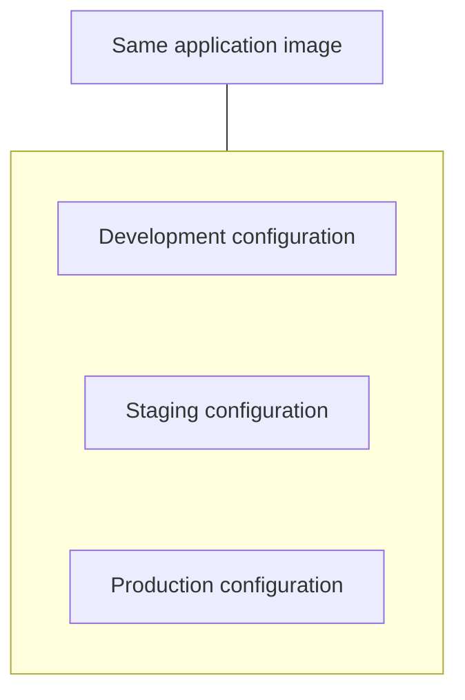

---

# 8. Configuration Files

Applications can also use configuration files.

For example:

```yaml
server:
  port: 8080

logging:
  level: info

timeouts:
  request: 3s
```

Configuration files can make complex settings easier to organize.

However, configuration files introduce questions such as:

- Where is the file stored?
- Who can modify it?
- Is it version controlled?
- How is it deployed?
- Does changing it require a restart?
- Which environment-specific file is active?

The mechanism matters less than having clear ownership and behavior.

---

# 9. Static Configuration

**Static configuration** is normally loaded when an application starts.

For example:

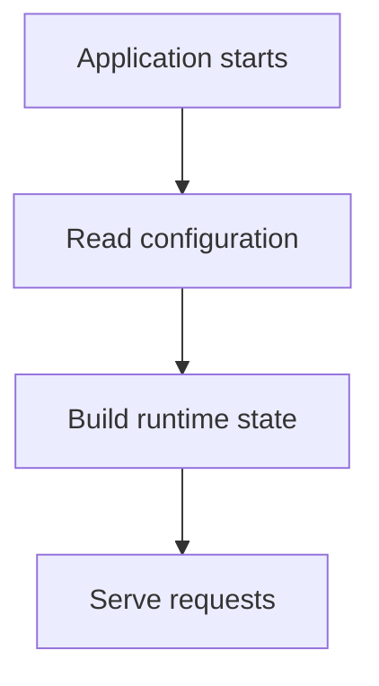

If:

```text
REQUEST_TIMEOUT = 3s
```

changes to:

```text
REQUEST_TIMEOUT = 5s
```

the application may need to restart.

This model is simple and predictable.

It works well for configuration that changes infrequently.

---

# 10. Dynamic Configuration

**Dynamic configuration** can change while the application is running.

For example:

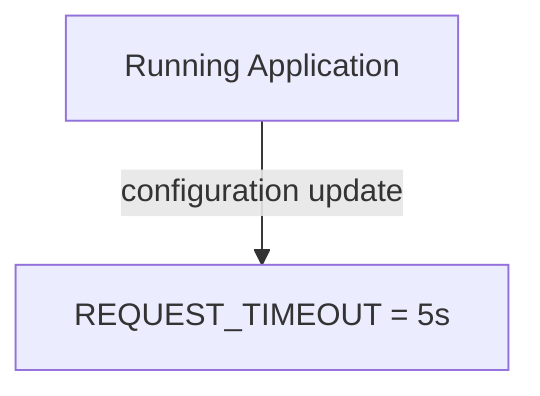

The application detects or receives the new value without a full restart.

This can be useful for:

- feature flags,
- traffic controls,
- operational limits,
- gradual rollouts,
- emergency configuration changes.

But dynamic configuration is more complex.

Now the system must answer:

```text
When does the change take effect?
Which instances received it?
What happens if some instances fail to update?
How is the old value restored?
```

---

# 11. Static vs Dynamic Configuration

| Static | Dynamic |
|---|---|
| Usually loaded at startup | Can change during runtime |
| Simpler | More complex |
| Easy to reason about | Requires propagation/consistency handling |
| Often requires restart | May avoid restart |
| Good for stable settings | Useful for operational controls |

A good default is:

> **Use static configuration unless dynamic updates provide a meaningful operational benefit.**

---

# 12. Configuration Is Distributed State Too

Suppose ten application instances run:

```text
App A
App B
App C
...
App J
```

A configuration change is made:

```text
FEATURE_X = enabled
```

Now the system needs to propagate that value.

Potentially:

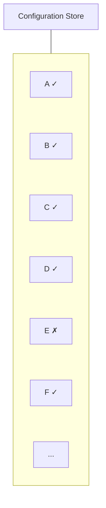

For a period of time, the fleet may not have identical configuration.

This means dynamic configuration introduces distributed-state concerns:

- propagation delay,
- stale configuration,
- partial updates,
- rollback,
- consistency.

This is why configuration management is not merely "put values in a file."

---

# 13. Configuration Scope

Not every setting belongs at the same scope.

Consider:

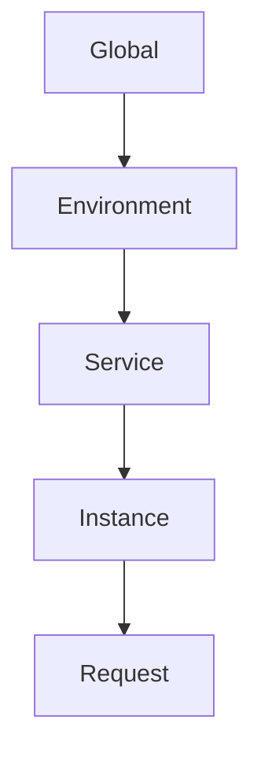

Examples:

### Global

```text
Default timezone
```

### Environment

```text
Production logging level
```

### Service

```text
Order service timeout
```

### Instance

```text
Temporary debugging flag
```

### Request

```text
Per-request timeout/deadline
```

The more specific the setting, the more carefully its precedence should be controlled.

---

# 14. Avoid Configuration Explosion

A system can accumulate hundreds of settings:

```text
TIMEOUT_A
TIMEOUT_B
TIMEOUT_C
CACHE_X
CACHE_Y
FEATURE_A
FEATURE_B
FEATURE_C
...
```

This creates complexity.

Engineers may not know:

- which settings are important,
- which are obsolete,
- which override others,
- which can safely change,
- which values are dangerous.

Therefore:

> **Configuration should be intentional, documented, and minimized.**

Do not make every constant configurable simply because you can.

---

# 15. Good Configuration Candidates

A value is often a good configuration candidate when it legitimately varies between environments or operational situations.

Examples:

```text
Request timeout
Log level
Feature enabled/disabled
Maximum worker count
Cache TTL
External service endpoint
Rate limit
```

A value is usually a poor candidate when it is fundamental to the application's internal correctness.

For example:

```text
ORDER_STATUS_COMPLETED = "completed"
```

should not normally become an arbitrary deployment setting.

Changing it could break business logic.

---

# 16. Configuration and Feature Flags

A **feature flag** is a configuration-controlled switch.

For example:

```text
NEW_CHECKOUT = false
```

The application behaves:

```text
false → Old checkout
true  → New checkout
```

This allows functionality to be released separately from deployment.

A feature flag can support:

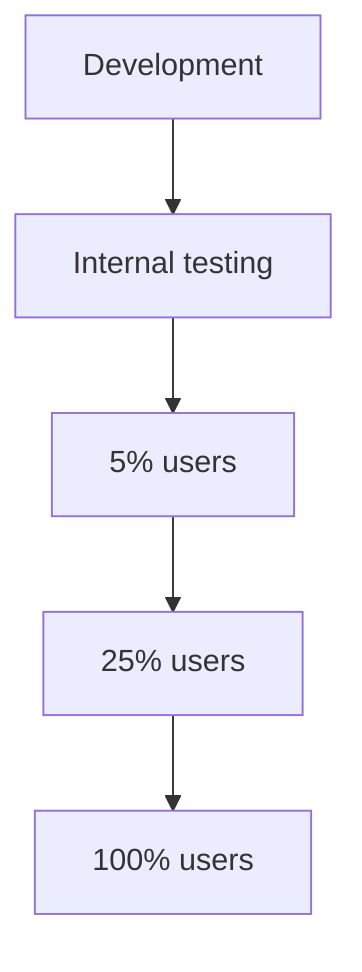

Feature flags are powerful but create lifecycle problems.

Unused flags should eventually be removed.

Otherwise:

```text
Code
 + many old flags
 = confusing decision paths
```

---

# 17. Configuration and Deployments

Configuration often changes alongside deployments.

For example:

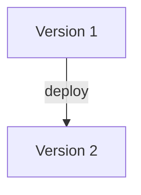

The deployment may require:

```text
NEW_FEATURE=true
```

A dangerous situation occurs when:

```text
New code expects new configuration
```

but:

```text
Old instances still use old configuration
```

This can happen during rolling deployments.

Therefore:

> **Configuration changes must be compatible with the deployment process.**

---

# 18. Backward-Compatible Configuration Changes

Suppose version 1 expects:

```text
TIMEOUT
```

and version 2 expects:

```text
REQUEST_TIMEOUT
```

If both versions run during a rolling deployment:

```text
Instance A → v1
Instance B → v1
Instance C → v2
```

changing the configuration immediately may break v1.

A safer sequence can be:

```text
1. Deploy code that understands both settings
2. Introduce new configuration
3. Switch usage
4. Remove old configuration later
```

This is the same general principle used for backward-compatible API and database changes.

---

# 19. Configuration Validation

Configuration should be validated before the application relies on it.

Suppose:

```text
REQUEST_TIMEOUT = "abc"
```

The application should not discover the problem only after receiving production traffic.

Instead:

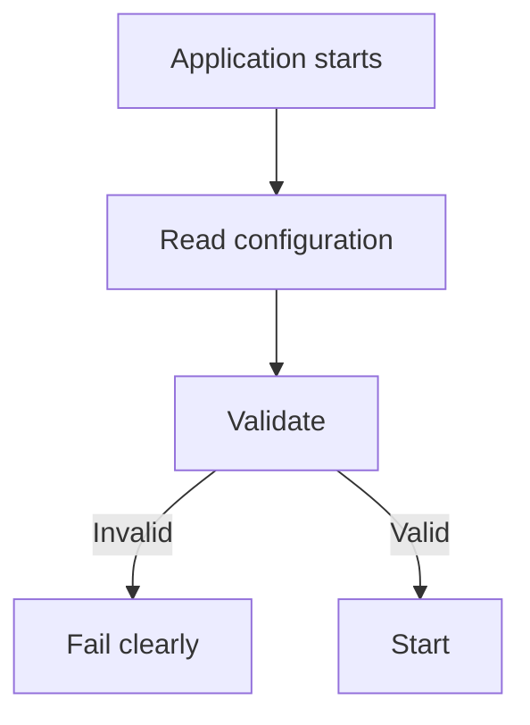

Examples of validation:

```text
PORT must be 1–65535
TIMEOUT must be positive
REQUIRED_URL must exist
WORKER_COUNT must be within allowed range
```

Failing early is usually safer than running with an invalid configuration.

---

# 20. Fail Fast on Invalid Configuration

Imagine a production service starts with:

```text
DATABASE_HOST = missing
```

If the application starts anyway:

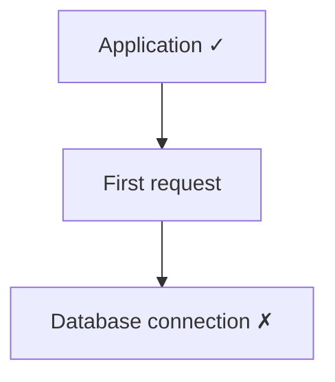

Users discover the configuration problem.

A better approach:

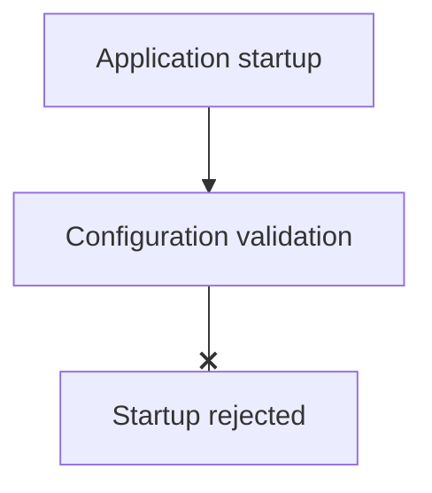

Now the deployment system can detect the failure immediately.

> **Invalid configuration should generally fail close to startup rather than becoming a runtime surprise.**

---

# 21. Configuration Drift

Suppose three production instances should have:

```text
LOG_LEVEL = info
```

But over time:

```text
Instance A → info
Instance B → debug
Instance C → info
```

The system now has **configuration drift**.

This can cause difficult bugs:

```text
Request A → Instance A → behaves normally
Request B → Instance B → behaves differently
```

The same application version can therefore behave differently depending on which instance receives the request.

Centralized and reproducible configuration helps reduce this risk.

---

# 22. Configuration Reproducibility

A good production system should make it possible to answer:

> **"What configuration was this instance running with?"**

For example:

```text
Application Version:
v2.4.1

Configuration Version:
config-184

Environment:
production
```

This makes debugging easier.

Without configuration history:

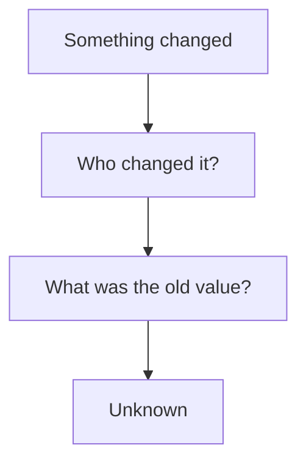

Configuration changes should therefore be observable and preferably auditable.

---

# 23. Configuration Rollback

Suppose a change causes failures:

```text
Old:
RATE_LIMIT = 1000

New:
RATE_LIMIT = 100
```

Traffic starts failing.

A good configuration system should make rollback straightforward:

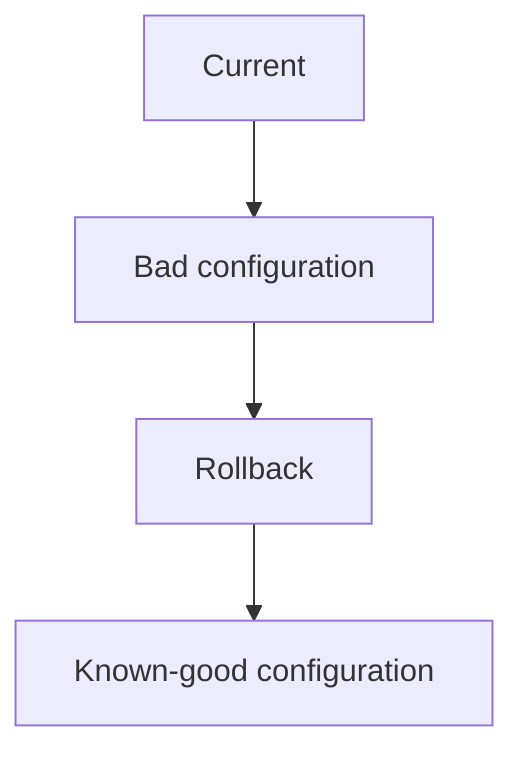

Configuration changes should be treated as production changes, not casual edits.

---

# 24. Dangerous Configuration

Some configuration values can have system-wide consequences.

For example:

```text
MAX_CONNECTIONS = 10,000
```

Increasing it may appear helpful.

But:

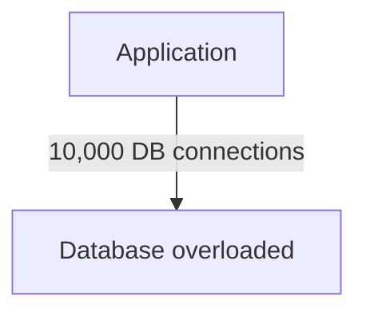

Similarly:

```text
RETRY_COUNT = 20
```

may create excessive downstream traffic.

Configuration can therefore change system behavior dramatically.

> **Configuration is part of system capacity and reliability design.**

---

# 25. Configuration and Resource Limits

Consider:

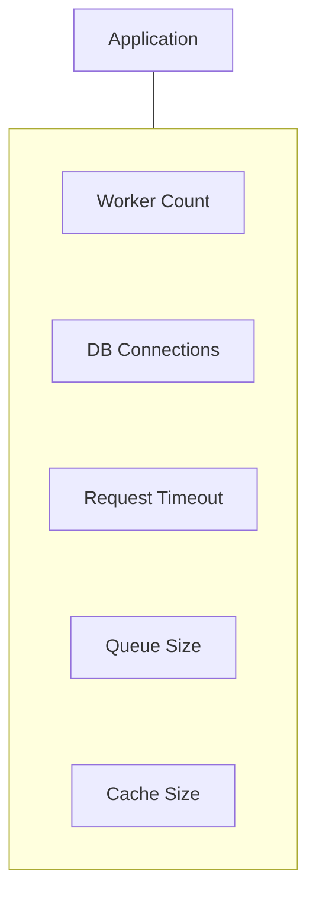

These settings interact.

For example:

```mermaid
flowchart TD
  accTitle: One change ripples
  accDescr: Workers ↑, then Concurrent requests ↑, then Database connections ↑, then Database load ↑.
  N0["Workers ↑"] --> N1["Concurrent requests ↑"] --> N2["Database connections ↑"] --> N3["Database load ↑"]
```

Changing one configuration value can affect other system components.

This is why production configuration should be evaluated as a system, not as isolated variables.

---

# 26. Central Configuration Stores

Large systems may use a dedicated configuration store:

```mermaid
flowchart TD
  accTitle: A central configuration store
  accDescr: A configuration store serves three services.
  R["Configuration Store"] --> K0["Service"] & K1["Service"] & K2["Service"]
```

This can provide:

- centralized management,
- versioning,
- controlled updates,
- dynamic configuration,
- auditing.

But it also introduces another dependency.

If every service must contact the configuration store for every request:

```mermaid
flowchart TD
  accTitle: The store on every request
  accDescr: Request, then Config Store, then Application.
  N0["Request"] --> N1["Config Store"] --> N2["Application"]
```

the configuration system itself can become a bottleneck or failure dependency.

A better pattern is often:

```mermaid
flowchart TD
  accTitle: Local configuration state
  accDescr: Startup / controlled refresh, then Local configuration state, then Requests.
  N0["Startup / controlled refresh"] --> N1["Local configuration state"] --> N2["Requests"]
```

The exact design depends on whether configuration needs to be dynamic.

---

# 27. Configuration Caching

If dynamic configuration is used, applications may cache the current configuration locally:

```mermaid
flowchart TD
  accTitle: Caching configuration
  accDescr: Configuration Store, then Application, then Local Config Cache, then Requests.
  N0["Configuration Store"] --> N1["Application"] --> N2["Local Config Cache"] --> N3["Requests"]
```

If the configuration store becomes temporarily unavailable, the application may continue using its last known configuration.

This improves resilience but creates a freshness question:

```text
How old can configuration safely be?
```

This is another example of a general system-design trade-off:

> **Availability of local state vs freshness of remote state.**

---

# 28. Configuration and Containers

Containerized applications benefit from separating the application image from deployment configuration.

This allows the same artifact to move through environments.

Conceptually:

```mermaid
flowchart TD
  accTitle: Build once, configure per environment
  accDescr: Build Once, then Test, then Deploy Same Artifact, then Different Configuration.
  N0["Build Once"] --> N1["Test"] --> N2["Deploy Same Artifact"] --> N3["Different Configuration"]
```

This reduces environment-specific builds.

---

# 29. Configuration and Infrastructure

Infrastructure also has configuration:

```mermaid
flowchart TD
  accTitle: Configuration at every layer
  accDescr: Application, then Container, then Compute, then Network, then Database.
  N0["Application"] --> N1["Container"] --> N2["Compute"] --> N3["Network"] --> N4["Database"]
```

Examples:

```text
Application → request timeout
Infrastructure → instance size
Network → firewall rule
Database → connection limit
```

These are related but may be managed through different systems.

Infrastructure as Code is covered later in Level 8.

The important point is:

> **Configuration exists at multiple layers of a system.**

---

# 30. A Practical Configuration Strategy

For a typical service:

```mermaid
flowchart TD
  accTitle: A practical configuration strategy
  accDescr: Source code with safe defaults, environment configuration with deployment-specific values, startup validation, then the application runtime.
  N0["Source Code"] -->|"Safe defaults"| N1["Environment Configuration"] -->|"deployment-specific values"| N2["Startup Validation"] --> N3["Application Runtime"]
```

For sensitive values:

```mermaid
flowchart TD
  accTitle: Sensitive values
  accDescr: Secret Store, then Application.
  N0["Secret Store"] --> N1["Application"]
```

For genuinely dynamic operational controls:

```mermaid
flowchart TD
  accTitle: Dynamic operational controls
  accDescr: Configuration Store, then Controlled Runtime Update.
  N0["Configuration Store"] --> N1["Controlled Runtime Update"]
```

Use the simplest mechanism that satisfies the requirement.

---

# 31. Configuration Change Workflow

A production configuration change should follow a controlled process:

```mermaid
flowchart TD
  accTitle: A configuration change workflow
  accDescr: Identify change, then Validate value, then Review impact, then Apply to controlled environment, then Observe, then Roll out gradually if needed, then Monitor, then Rollback if necessary.
  N0["Identify change"] --> N1["Validate value"] --> N2["Review impact"] --> N3["Apply to controlled environment"] --> N4["Observe"] --> N5["Roll out gradually if needed"] --> N6["Monitor"] --> N7["Rollback if necessary"]
```

Do not treat configuration as harmless because it does not modify source code.

Configuration can change production behavior just as dramatically as a code deployment.

---

# 32. Common Mistakes

### 1. Hardcoding environment-specific values

```text
production-db.example.com
```

directly inside application code.

### 2. Committing secrets

Passwords and private keys should not live in normal source-controlled configuration.

### 3. No configuration validation

Invalid values are discovered only after production traffic arrives.

### 4. Too many configuration options

Excessive configurability makes systems difficult to understand.

### 5. Unclear precedence

Engineers cannot determine which value is actually active.

### 6. Dynamic configuration everywhere

Runtime updates introduce propagation and consistency complexity.

### 7. No configuration history

Teams cannot determine what changed during an incident.

### 8. Ignoring configuration during deployments

Old and new application versions may interpret configuration differently.

### 9. Treating configuration changes as harmless

A single value can change capacity, latency, security, or failure behavior.

### 10. Configuration drift

Different instances silently operate with different settings.

---

# 33. Hands-On Exercise

Create a simple application configuration model.

Start with:

```text
APP_ENV = development
LOG_LEVEL = debug
REQUEST_TIMEOUT = 10s
MAX_WORKERS = 4
FEATURE_NEW_CHECKOUT = false
```

## Step 1 — Create production values

```text
APP_ENV = production
LOG_LEVEL = info
REQUEST_TIMEOUT = 3s
MAX_WORKERS = 20
FEATURE_NEW_CHECKOUT = false
```

## Step 2 — Define precedence

For example:

```text
Default
   ↓
Config File
   ↓
Environment Variable
```

## Step 3 — Add validation

Reject:

```text
REQUEST_TIMEOUT = -5s
MAX_WORKERS = abc
```

## Step 4 — Simulate a feature rollout

```mermaid
flowchart TD
  accTitle: Simulated rollout
  accDescr: false, then internal users, then 5%, then 25%, then 100%.
  N0["false"] --> N1["internal users"] --> N2["5%"] --> N3["25%"] --> N4["100%"]
```

## Step 5 — Simulate rollback

If errors increase:

```text
FEATURE_NEW_CHECKOUT = false
```

Observe how configuration changes behavior without changing application code.

---

# 34. Decision Framework

When choosing a configuration mechanism, ask:

```mermaid
flowchart TD
  accTitle: Choosing a configuration mechanism
  accDescr: Does the value vary by environment? No: keep it in code/defaults if appropriate. Yes: does it contain sensitive information? Yes: secret management. No: does it need runtime changes? No: static configuration. Yes: is dynamic control worth the added complexity? No: static. Yes: dynamic configuration.
  subgraph R1[" "]
    direction TB
    Q1{"Does the value vary by environment?"} -->|"No"| K1["Keep it in code/defaults if appropriate"]
  end
  subgraph R2[" "]
    direction TB
    Q2{"Does it contain sensitive information?"} -->|"Yes"| K2["Secret Management"]
  end
  subgraph R3[" "]
    direction TB
    Q3{"Does it need runtime changes?"} -->|"No"| K3["Static configuration"]
  end
  subgraph R4[" "]
    direction TB
    Q4{"Is dynamic control worth the added complexity?"} -->|"No"| K4["Static"]
    Q4 -->|"Yes"| K5["Dynamic configuration"]
  end
  R1 -->|"Yes"| R2
  R2 -->|"No"| R3
  R3 -->|"Yes"| R4
```

The simplest suitable mechanism is usually the best starting point.

---

# 35. Key Principle

> **Configuration separates application behavior from environment- and operation-specific settings.**

Good configuration management makes settings:

```text
Explicit
+
Validated
+
Reproducible
+
Observable
+
Controlled
```

And remember:

> **Configuration is part of system behavior. Changing configuration can change capacity, latency, reliability, security, and user experience.**

---

# 36. Quick Reference

| Concept | Meaning |
|---|---|
| Configuration | Values that control application behavior |
| Environment Variable | Configuration supplied through the process environment |
| Static Configuration | Configuration normally loaded at startup |
| Dynamic Configuration | Configuration that can change during runtime |
| Configuration Precedence | Rules determining which value wins |
| Feature Flag | Configuration controlling functionality |
| Configuration Drift | Different instances/environments using different settings |
| Configuration Store | Central system for managing configuration |
| TTL / Refresh | Mechanisms controlling configuration freshness |
| Configuration Validation | Checking values before relying on them |
| Configuration Rollback | Returning to a known-good configuration |
| Secret | Sensitive configuration requiring stronger protection |

---

# 37. Knowledge Check

### Question 1

What is the purpose of configuration?

To control application behavior without changing the application's core code.

### Question 2

Why shouldn't environment-specific values usually be hardcoded?

Because the same application should be deployable across environments without modifying its core code.

### Question 3

What is the difference between static and dynamic configuration?

Static configuration is generally loaded at startup; dynamic configuration can change while the application is running.

### Question 4

Why is configuration validation important?

It catches invalid settings before they cause runtime failures.

### Question 5

What is configuration drift?

When different instances or environments unexpectedly operate with different configuration values.

### Question 6

Why can dynamic configuration be dangerous?

Because changes must propagate across running instances and can temporarily create inconsistent behavior.

### Question 7

Should secrets be treated exactly like ordinary configuration?

No. Secrets require stronger protection and should be managed through appropriate secret-management mechanisms.

### Question 8

Why should configuration changes be observable and reversible?

Because configuration can change production behavior significantly and may need to be investigated or rolled back during incidents.

---

# Remember

Think of configuration as:

```mermaid
flowchart TD
  accTitle: Configuration in one picture
  accDescr: Application Code + Configuration, then Application Behavior.
  N0["Application Code<br/>+<br/>Configuration"] --> N1["Application Behavior"]
```

A good configuration system makes it possible to answer:

```mermaid
flowchart TD
  accTitle: Questions a configuration system answers
  accDescr: What is the value?, then Where did it come from?, then Why is it set this way?, then Who changed it?, then When did it change?, then Can we safely roll it back?.
  N0["What is the value?"] --> N1["Where did it come from?"] --> N2["Why is it set this way?"] --> N3["Who changed it?"] --> N4["When did it change?"] --> N5["Can we safely roll it back?"]
```

The deeper lesson:

> **Configuration is not "just settings." It is part of the running system.**

Treat important configuration changes with the same care you give code changes.

**Next: 07.12 — Secrets Management**
