# 07.13 — Distributed Transactions

## Learning Objectives

By the end of this chapter, you should be able to:

- Explain what a distributed transaction is.
- Understand why a normal database transaction does not automatically span multiple services.
- Understand the atomicity problem across independent databases.
- Explain the basic idea of **Two-Phase Commit (2PC)**.
- Understand the latency, availability, and failure trade-offs of distributed transactions.
- Distinguish distributed transactions from **Sagas and compensating actions**.
- Decide when a distributed transaction is justified and when it should be avoided.

---

# 1. The Problem

A normal database transaction is relatively straightforward:

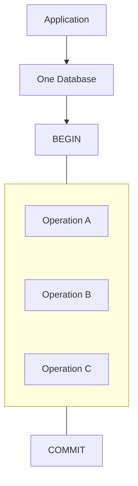

The database can provide atomicity:

> **Either the transaction commits, or its changes are rolled back.**

But service-based systems often look like:

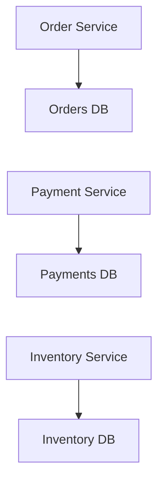

Now consider:

> **Place an order**

The operation may require:

```text
1. Create order
2. Reserve inventory
3. Charge payment
```

These operations involve different services and potentially different databases.

A local database transaction cannot automatically make all three operations atomic.

---

# 2. What Is a Distributed Transaction?

A **distributed transaction** is a transaction whose work spans multiple independent transactional resources.

For example:

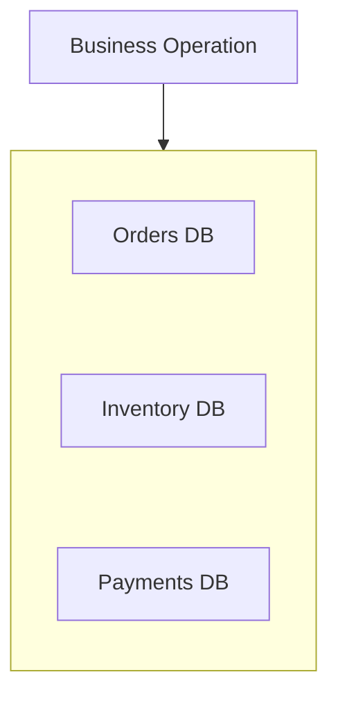

The desired result might be:

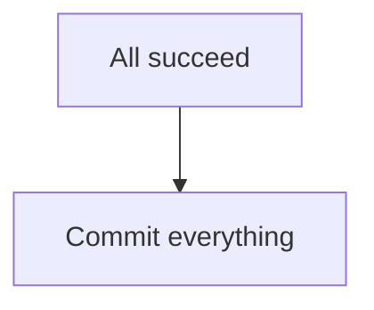

or:

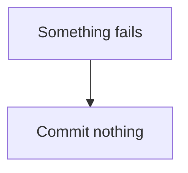

That sounds simple.

The difficulty is coordinating independent systems so they reach the same final decision despite:

- network failures,
- process crashes,
- timeouts,
- participant failures,
- coordinator failures,
- partitions.

---

# 3. Local Transaction vs Distributed Transaction

### Local transaction

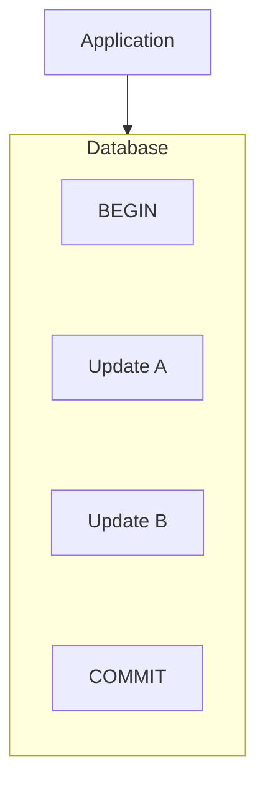

One transactional system controls the operation.

### Distributed transaction

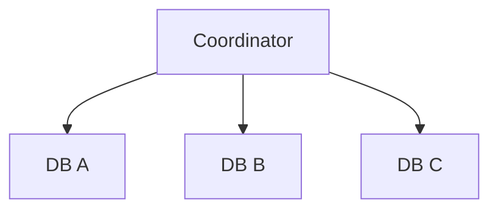

Multiple participants must coordinate.

This introduces a fundamental difference:

> **The database controls a local transaction. A distributed transaction requires coordination across independent systems.**

---

# 4. The Atomicity Problem

Consider:

```text
1. Create order        ✓
2. Reserve inventory   ✓
3. Charge payment      ✗
```

Now the system has:

```text
Order exists
Inventory reserved
Payment not completed
```

The business operation is inconsistent.

What should happen?

```text
Delete order?
Release inventory?
Retry payment?
Ask customer to retry?
```

The system needs a defined recovery strategy.

This is the core distributed transaction problem:

> **How do multiple independent systems agree on the outcome of one logical operation?**

---

# 5. Why a Normal BEGIN / COMMIT Is Not Enough

Suppose:

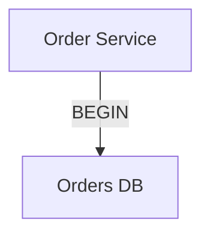

The transaction can protect the Orders DB.

But:

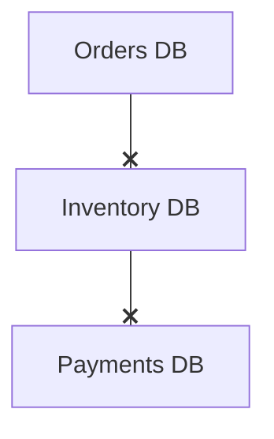

Those databases have their own transactions.

You cannot simply assume:

```sql
BEGIN;

UPDATE orders ...;
UPDATE inventory ...;
UPDATE payments ...;

COMMIT;
```

will work across three independent databases.

Each database controls its own transaction boundary.

---

# 6. The Goal of a Distributed Transaction

Ideally, the participants should reach a common outcome:

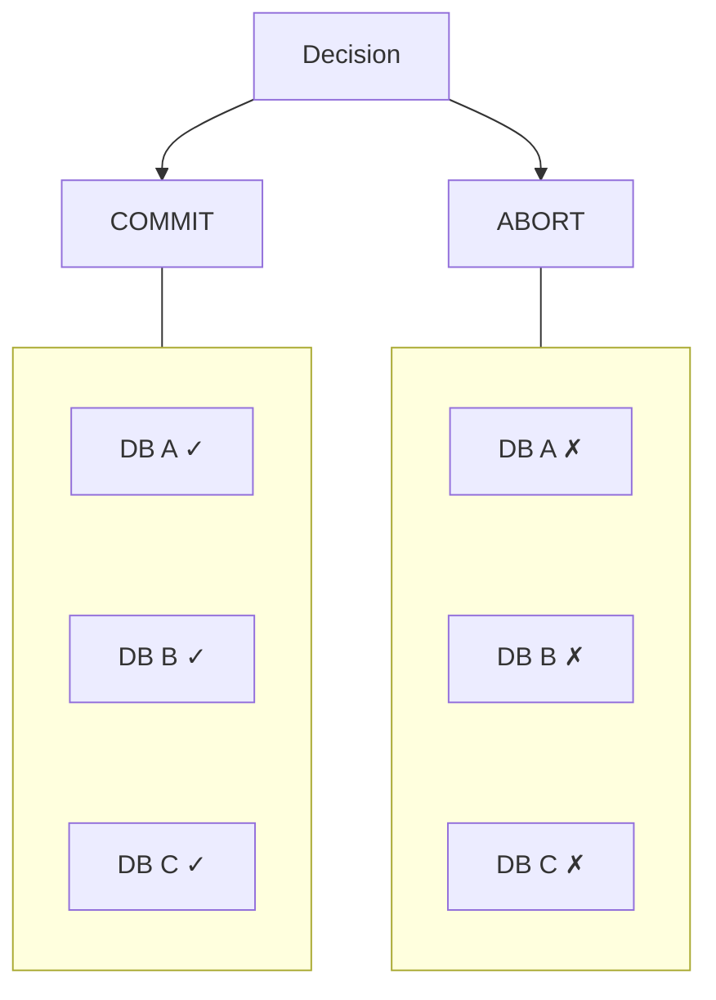

The difficult part is ensuring that participants do not permanently disagree.

For example:

```text
DB A → COMMIT
DB B → ABORT
DB C → COMMIT
```

would violate the desired atomic outcome.

---

# 7. Two-Phase Commit (2PC)

One well-known protocol for distributed transactions is:

> **Two-Phase Commit (2PC)**

It coordinates a group of participants through two major phases.

```text
Phase 1 → Prepare
Phase 2 → Commit
```

Conceptually:

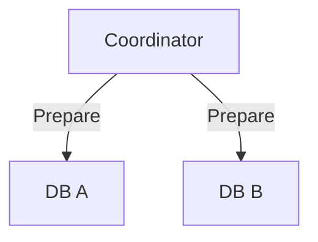

If the participants can commit:

```text
Prepare ✓
Prepare ✓
```

the coordinator can move toward commit.

---

# 8. Phase 1 — Prepare

The coordinator asks participants:

> **"Can you commit this transaction?"**

For example:

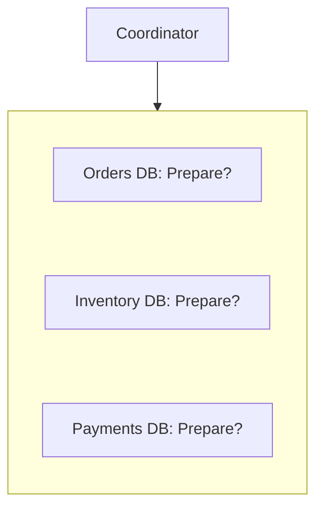

Participants perform the required work and indicate whether they are prepared.

Possible result:

```text
Orders DB      → YES
Inventory DB   → YES
Payments DB    → YES
```

The coordinator now has enough information to proceed.

If any participant says:

```text
NO
```

the transaction must move toward abort.

---

# 9. Phase 2 — Commit

If every participant prepared successfully:

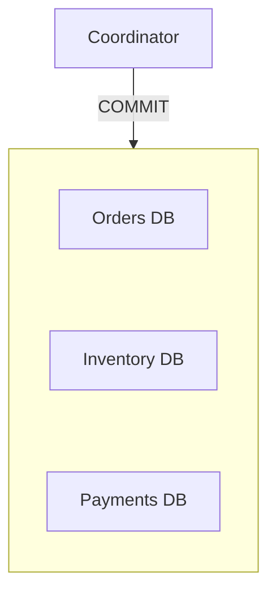

Participants commit their prepared transaction.

Conceptually:

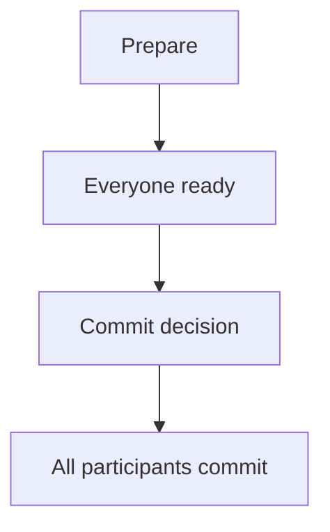

If preparation cannot succeed:

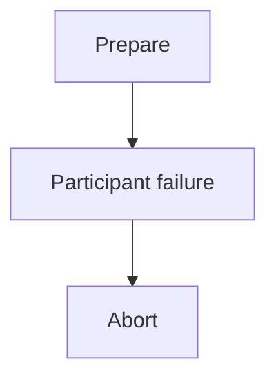

---

# 10. Why 2PC Is Not Free

2PC provides a coordination mechanism, but it introduces significant costs.

| Benefit | Cost |
|---|---|
| Atomic commit across participants | Extra network round trips |
| Coordinated outcome | Higher latency |
| Strong transactional semantics | More infrastructure complexity |
| Participants can agree on commit/abort | Coordinator dependency |
| Useful for some tightly controlled systems | Can block during failures |

The important point is:

> **Distributed atomicity has a real operational cost.**

---

# 11. Coordinator Failure

Consider:

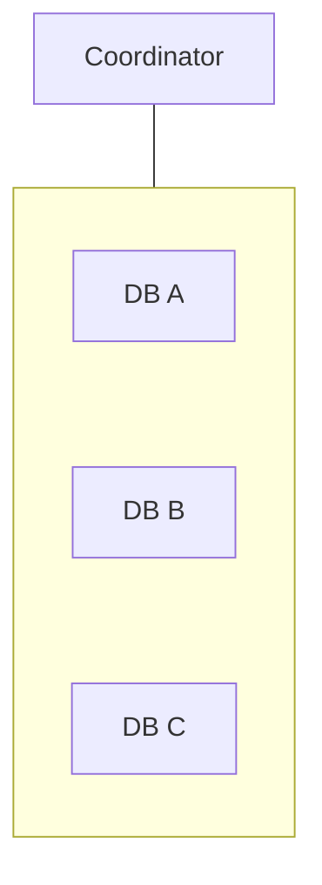

Suppose the coordinator fails after participants have prepared.

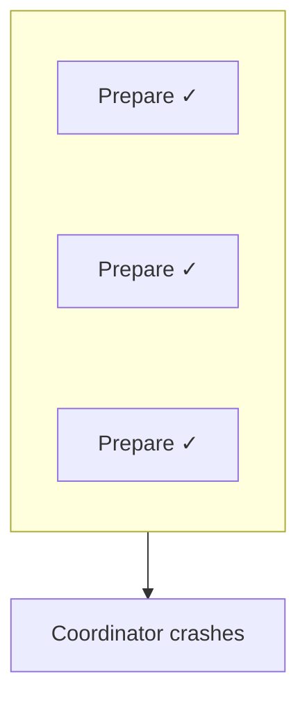

Participants may now be uncertain about the final decision.

```text
"What should I do?"

COMMIT?
ABORT?
WAIT?
```

This is one of the fundamental difficulties with coordination protocols.

The system needs recovery mechanisms and durable transaction state.

---

# 12. Blocking

A classic weakness of 2PC is that participants may have to wait for the coordinator's decision.

Conceptually:

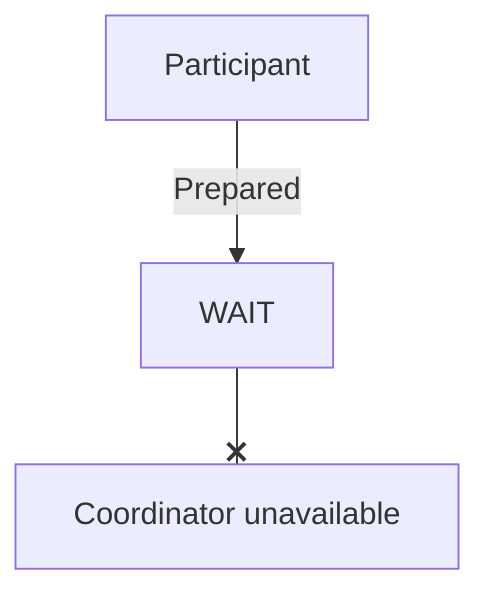

The participant may retain resources while waiting.

That can affect:

- locks,
- connections,
- storage,
- throughput,
- availability.

Therefore:

> **Distributed coordination can turn failures into waiting.**

---

# 13. Network Failure

Suppose:

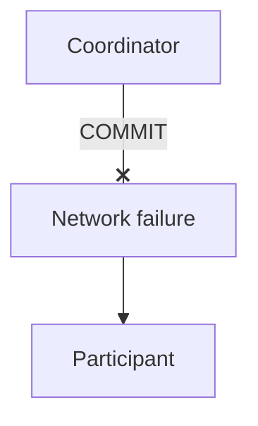

The participant may not know whether the coordinator intended:

```text
COMMIT
```

or:

```text
ABORT
```

A timeout does not automatically answer that question.

This connects directly to the distributed-system concepts from Level 6:

- partial failure,
- network partitions,
- timeouts,
- consensus,
- consistency.

---

# 14. Distributed Transactions Increase Latency

A local transaction may look like:

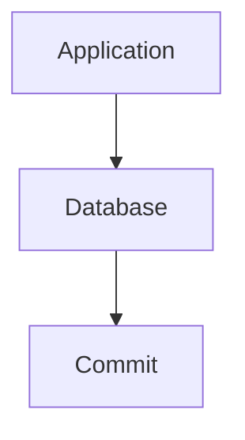

A distributed transaction can involve:

```mermaid
flowchart TD
  accTitle: A distributed commit
  accDescr: The application calls a coordinator, which reaches DB A, B and C over the network.
  A["Application"] --> C["Coordinator"] -->|"Network"| G
  subgraph G[" "]
    direction TB
    I0["DB A"] ~~~ I1["DB B"] ~~~ I2["DB C"]
  end
```

More communication means more opportunities for:

- network latency,
- timeouts,
- retries,
- failures,
- coordination delays.

Therefore:

> **Distributed transactions can make the critical path longer.**

---

# 15. Distributed Transactions and Availability

Suppose the system requires all participants to participate.

```text
DB A ✓
DB B ✓
DB C ✗
```

The transaction cannot safely complete.

That means:

```mermaid
flowchart TD
  accTitle: Availability cost
  accDescr: One unavailable participant, then Whole business operation blocked.
  N0["One unavailable participant"] --> N1["Whole business operation blocked"]
```

This can reduce availability.

The system may intentionally choose this behavior because correctness is more important than availability for that operation.

But it should be a conscious decision.

---

# 16. Distributed Transaction ≠ Saga

This distinction is critical.

### Distributed transaction

Attempts to provide atomic coordination across participants.

```text
A + B + C
   |
   v
All commit
or
All abort
```

### Saga

Breaks a business operation into a sequence of local transactions.

```mermaid
flowchart TD
  accTitle: A saga
  accDescr: Local Tx A, then Local Tx B, then Local Tx C.
  N0["Local Tx A"] --> N1["Local Tx B"] --> N2["Local Tx C"]
```

If something fails, the system performs compensating actions where appropriate.

```mermaid
flowchart TD
  accTitle: Compensation
  accDescr: A and B succeed, C fails, so B is compensated, then A.
  subgraph G[" "]
    direction TB
    I0["A ✓"] ~~~ I1["B ✓"] ~~~ I2["C ✗"]
  end
  G --> B["Compensate B"] --> A["Compensate A"]
```

A Saga does **not** provide the same atomic commit semantics as 2PC.

This distinction is essential.

---

# 17. Business Rollback vs Database Rollback

Suppose:

```text
Inventory reserved ✓
Payment failed ✗
```

A local database transaction could roll back:

```text
UPDATE inventory
```

if inventory and payment were in the same transaction.

But if they are separate services:

```mermaid
flowchart TD
  accTitle: No shared rollback
  accDescr: The inventory and payment databases cannot roll back together.
  I["Inventory DB"] --x P["Payment DB"]
```

you cannot simply issue:

```text
ROLLBACK
```

across both unless using a distributed transaction protocol.

Instead, a Saga might perform:

```mermaid
flowchart TD
  accTitle: A business rollback
  accDescr: Reserve Inventory, then Payment Fails, then Release Inventory.
  N0["Reserve Inventory"] --> N1["Payment Fails"] --> N2["Release Inventory"]
```

The release is a **new business operation**.

It is not the same thing as reversing time.

---

# 18. Compensation Is Not Always Perfect

Suppose:

```mermaid
flowchart TD
  accTitle: A workflow with side effects
  accDescr: Charge Customer, then Send Email, then Create Shipment.
  N0["Charge Customer"] --> N1["Send Email"] --> N2["Create Shipment"]
```

If shipment creation fails, perhaps you can:

```text
Refund Customer
```

But some actions cannot be perfectly reversed.

For example:

```text
Email sent
```

cannot be "unsent."

Or:

```text
External system notified
```

may already have triggered additional work.

Therefore:

> **Compensation is business-specific, not a universal rollback mechanism.**

This is why distributed transaction design must understand business semantics.

---

# 19. When a Distributed Transaction May Make Sense

Distributed transactions can be justified when:

- strong atomicity across participants is genuinely required,
- participants support a suitable protocol,
- the transaction scope is relatively controlled,
- latency is acceptable,
- operational complexity is acceptable,
- consistency requirements are more important than availability for the operation.

For example:

```mermaid
flowchart TD
  accTitle: When atomic coordination is required
  accDescr: Financial or tightly controlled enterprise workflow, then Multiple transactional resources, then Strong atomic coordination required.
  N0["Financial or tightly controlled enterprise workflow"] --> N1["Multiple transactional resources"] --> N2["Strong atomic coordination required"]
```

The point is not:

> "Never use distributed transactions."

The point is:

> **Use them when the required guarantee justifies their cost.**

---

# 20. When to Avoid Them

Avoid introducing distributed transactions merely because:

```text
"We have microservices."
```

or:

```text
"We want everything to be ACID."
```

They may be a poor fit when:

- services can tolerate eventual consistency,
- operations can be asynchronous,
- compensation is acceptable,
- the workflow can be redesigned,
- the system needs high availability across unreliable dependencies,
- transaction scope would become very large,
- services are independently owned and deployed.

Often, the better architecture is:

```text
Local Transactions
       +
Idempotency
       +
Events / Queues
       +
Compensation
```

This is where **Saga Pattern** becomes important.

---

# 21. Keep Transactions Local When Possible

Suppose:

```mermaid
flowchart TD
  accTitle: One service, one database
  accDescr: Order Service, then Orders DB.
  N0["Order Service"] --> N1["Orders DB"]
```

and both:

```text
Create Order
Update Order Status
```

belong to the same service and database.

Prefer:

```text
BEGIN
  Create order
  Update status
COMMIT
```

rather than splitting them across multiple services unnecessarily.

A useful rule is:

> **Keep tightly related atomic work inside one transactional boundary when the business requirements allow it.**

This is one reason service boundaries matter.

---

# 22. Example: E-Commerce Checkout

Suppose checkout involves:

```text
Order Service
Inventory Service
Payment Service
Notification Service
```

A naïve distributed transaction might attempt:

```text
BEGIN
   Create Order
   Reserve Inventory
   Charge Payment
   Send Notification
COMMIT
```

This creates a very large coordination boundary.

Instead, the system might separate the workflow:

```mermaid
flowchart TD
  accTitle: A separated checkout workflow
  accDescr: Create Order, then Reserve Inventory, then Authorize Payment, then Confirm Order, then Publish Order Confirmed, then Send Notification.
  N0["Create Order"] --> N1["Reserve Inventory"] --> N2["Authorize Payment"] --> N3["Confirm Order"] --> N4["Publish Order Confirmed"] --> N5["Send Notification"]
```

Each service performs its own local transaction.

The workflow can handle failures explicitly.

This is the foundation for the next chapter.

---

# 23. Failure Matrix

Consider checkout:

| Step | Result | Possible State |
|---|---|---|
| Create order | ✓ | Order created |
| Reserve inventory | ✓ | Inventory reserved |
| Payment | ✓ | Payment successful |
| Notification | ✗ | Order still valid |
| Payment | ✗ | Inventory may need release |
| Inventory | ✗ | Payment should generally not proceed |

The system must define what each failure means.

For example:

```mermaid
flowchart TD
  accTitle: Business recovery
  accDescr: Payment fails, then Release inventory, then Mark order payment_failed.
  N0["Payment fails"] --> N1["Release inventory"] --> N2["Mark order payment_failed"]
```

This is business recovery rather than database rollback.

---

# 24. Idempotency Matters

Distributed transaction workflows often involve retries.

Suppose:

```mermaid
flowchart TD
  accTitle: An unknown outcome
  accDescr: Payment request, then Timeout.
  N0["Payment request"] --> N1["Timeout"]
```

The caller may not know whether payment succeeded.

Blindly sending another charge request could cause:

```text
Charge #1 ✓
Charge #2 ✓
```

This is dangerous.

Therefore, distributed workflows often need:

```mermaid
flowchart TD
  accTitle: Idempotent payment
  accDescr: Idempotency Key, then Payment Service, then Same logical request, then Do not charge twice.
  N0["Idempotency Key"] --> N1["Payment Service"] --> N2["Same logical request"] --> N3["Do not charge twice"]
```

Idempotency was covered in **05.11** and is especially important here.

---

# 25. Distributed Transaction vs Outbox

Another important distinction:

### Distributed transaction

Coordinates multiple transactional resources.

```text
DB A
 +
DB B
 +
DB C
```

### Outbox pattern

Keeps a database change and an outgoing message reliable within **one local transaction**.

```text
BEGIN
   Update business data
   Insert outbox event
COMMIT
```

Then:

```mermaid
flowchart TD
  accTitle: Publishing from the outbox
  accDescr: Outbox, then Publisher, then Message Broker, then Other Service.
  N0["Outbox"] --> N1["Publisher"] --> N2["Message Broker"] --> N3["Other Service"]
```

The Outbox Pattern is covered in:

**07.15 — Outbox Pattern**

It is often useful when the real requirement is:

> **"Make sure this database change and the fact that it happened are reliably connected."**

rather than:

> **"Atomically commit multiple independent databases."**

---

# 26. Distributed Transaction Decision Framework

Before introducing a distributed transaction, ask:

```mermaid
flowchart TD
  accTitle: Distributed transaction decision framework
  accDescr: 1. What business operation must be atomic?, then 2. Which resources participate?, then 3. Can they belong to one transactional boundary?, then 4. If not, do we truly need atomic commit?, then 5. Can local transactions + events work?, then 6. Can compensation work?, then 7. What happens during partial failure?, then 8. What happens during a timeout?, then 9. What happens if the coordinator fails?, then 10. What availability and latency cost are acceptable?.
  N0["1#46; What business operation must be atomic?"] --> N1["2#46; Which resources participate?"] --> N2["3#46; Can they belong to one transactional boundary?"] --> N3["4#46; If not, do we truly need atomic commit?"] --> N4["5#46; Can local transactions + events work?"] --> N5["6#46; Can compensation work?"] --> N6["7#46; What happens during partial failure?"] --> N7["8#46; What happens during a timeout?"] --> N8["9#46; What happens if the coordinator fails?"] --> N9["10#46; What availability and latency cost are acceptable?"]
```

Only then decide whether distributed coordination is justified.

---

# 27. Distributed Transactions and Service Boundaries

This connects directly to **07.07 — Service Boundaries**.

A poor boundary can create:

```mermaid
flowchart TD
  accTitle: A poor boundary
  accDescr: One business operation, then 5 services, then 5 databases, then Distributed transaction.
  N0["One business operation"] --> N1["5 services"] --> N2["5 databases"] --> N3["Distributed transaction"]
```

A better boundary may allow:

```mermaid
flowchart TD
  accTitle: A better boundary
  accDescr: One cohesive capability, then One service, then One local transaction.
  N0["One cohesive capability"] --> N1["One service"] --> N2["One local transaction"]
```

Therefore:

> **Service decomposition can create distributed transaction problems that did not exist in the original monolith.**

This is an important microservices trade-off.

---

# 28. Common Mistakes

### Mistake 1 — Assuming microservices automatically require distributed transactions

They do not.

Many workflows can use local transactions, events, and compensation.

---

### Mistake 2 — Treating Saga as a distributed ACID transaction

A Saga provides a sequence of local transactions and compensating actions.

It does not provide the same atomic commit semantics as 2PC.

---

### Mistake 3 — Assuming compensation equals rollback

A compensation is a new business action.

It may not perfectly reverse the original operation.

---

### Mistake 4 — Ignoring timeout uncertainty

A timeout does not prove that the remote transaction failed.

---

### Mistake 5 — Forgetting idempotency

Retries can duplicate side effects.

---

### Mistake 6 — Making the transaction boundary too large

More participants mean more coordination, latency, and failure modes.

---

### Mistake 7 — Using distributed transactions to fix poor service boundaries

Sometimes the better solution is to reconsider which operations belong together.

---

### Mistake 8 — Treating 2PC as universally bad

2PC has real costs and failure trade-offs, but it can be appropriate in controlled environments where atomic commit is genuinely required.

---

# 29. Hands-On Exercise

## Build a Simple Checkout Failure Model

You do not need a distributed database for this exercise.

Model three services:

```text
Order
Inventory
Payment
```

Each service maintains its own conceptual state.

Start with:

```text
Order = NEW
Inventory = AVAILABLE
Payment = NOT_CHARGED
```

Now simulate:

### Scenario A — Everything succeeds

```mermaid
flowchart TD
  accTitle: Scenario A
  accDescr: Create Order, then Reserve Inventory, then Charge Payment, then Order = CONFIRMED.
  N0["Create Order"] --> N1["Reserve Inventory"] --> N2["Charge Payment"] --> N3["Order = CONFIRMED"]
```

Final state:

```text
Order     = CONFIRMED
Inventory = RESERVED
Payment   = CHARGED
```

### Scenario B — Payment fails

```text
Create Order ✓
Reserve Inventory ✓
Payment ✗
```

Design the recovery:

```mermaid
flowchart TD
  accTitle: Scenario B recovery
  accDescr: Release Inventory, then Mark Order = PAYMENT_FAILED.
  N0["Release Inventory"] --> N1["Mark Order = PAYMENT_FAILED"]
```

### Scenario C — Payment times out

Now ask:

```text
Did payment fail?
```

You cannot automatically assume that.

Design a safe workflow that can determine or reconcile payment status without accidentally charging twice.

### Questions

1. Which operations need local transactions?
2. Where can partial failure occur?
3. Which operations need idempotency?
4. Which state transitions require compensation?
5. Which operation should be synchronous?
6. Which notification work could be asynchronous?

The goal is not to build a real distributed transaction.

The goal is to learn how **one business operation becomes multiple local transactions with failure boundaries**.

---

# 30. Quick Comparison

| Approach | Main Idea | Strength | Main Cost |
|---|---|---|---|
| Local DB transaction | One transactional boundary | Strong atomicity, simple | Limited to that boundary |
| Distributed transaction / 2PC | Coordinate multiple participants | Atomic commit across participants | Latency, blocking, complexity |
| Saga | Sequence local transactions + compensation | Looser coupling, availability | No global atomic commit |
| Outbox | Commit DB change + event locally | Reliable event publication | Async/eventual behavior |
| Idempotency | Make retries safe | Prevent duplicate effects | Requires operation design |

---

# 31. Key Principle

> **A distributed transaction exists because one logical business operation crosses multiple independent transactional boundaries.**

Before introducing one, ask:

```mermaid
flowchart TD
  accTitle: Before introducing one
  accDescr: Can the operation remain inside one service?, then Can local transactions solve it?, then Can asynchronous processing work?, then Can compensation work?, then Do we truly need atomic commit?.
  N0["Can the operation remain inside one service?"] --> N1["Can local transactions solve it?"] --> N2["Can asynchronous processing work?"] --> N3["Can compensation work?"] --> N4["Do we truly need atomic commit?"]
```

If the answer to the final question is yes, distributed transaction protocols may be justified.

If not, forcing multiple services into one global transaction can create unnecessary coupling and reduce the benefits of service independence.

---

# 32. Quick Reference

| Concept | Meaning |
|---|---|
| Distributed Transaction | Transaction spanning multiple independent transactional resources |
| Participant | Service/database/resource participating in the transaction |
| Coordinator | Component coordinating the distributed transaction |
| 2PC | Two-Phase Commit: prepare, then commit/abort |
| Prepare | Participant confirms it can commit |
| Commit | Final decision to make the prepared work permanent |
| Blocking | Participants may need to wait for a decision |
| Compensation | New business action intended to counteract a previous action |
| Saga | Sequence of local transactions with failure/compensation handling |
| Idempotency | Safe repeated execution of the same logical operation |
| Outbox | Local transaction that stores business change and outgoing event together |
| Atomicity | All-or-nothing property within a defined transaction boundary |

---

# 33. Knowledge Check

### Question 1

Why can a normal database transaction not automatically cover multiple services?

Because each service may own a separate transactional resource and transaction manager.

---

### Question 2

What problem does a distributed transaction try to solve?

Coordinating multiple independent resources so they reach a consistent transaction outcome.

---

### Question 3

What are the two phases of 2PC?

```text
1. Prepare
2. Commit / Abort
```

---

### Question 4

Why can 2PC reduce availability?

A participant may need to wait for coordination, and if required participants or the coordinator are unavailable, the transaction may not safely complete.

---

### Question 5

Is a Saga the same as 2PC?

**No.**

A Saga uses local transactions and compensating actions. It does not provide the same global atomic commit guarantee as 2PC.

---

### Question 6

Why is compensation different from rollback?

Rollback reverses work within a transactional system. Compensation is a new business operation that attempts to counteract a previous operation.

---

### Question 7

Why is idempotency important in distributed transactions?

Because timeouts and retries can cause the same logical operation to be submitted more than once.

---

### Question 8

What should you ask before introducing a distributed transaction?

> **Do we genuinely need atomic commit across independent resources, or can a simpler architecture using local transactions, events, idempotency, and compensation satisfy the requirement?**

---

# Remember

The key question is not:

> **"How do I make all these services behave like one database?"**

Ask:

```mermaid
flowchart TD
  accTitle: Ask
  accDescr: What must actually be atomic?, then Can I keep it in one transactional boundary?, then If not, can local transactions + events work?, then Can failures be compensated?, then Can retries be made idempotent?, then If none of these are sufficient: Do I genuinely need distributed atomic commit?.
  N0["What must actually be atomic?"] --> N1["Can I keep it in one transactional boundary?"] --> N2["If not, can local transactions + events work?"] --> N3["Can failures be compensated?"] --> N4["Can retries be made idempotent?"] --> N5["If none of these are sufficient:<br/>Do I genuinely need distributed atomic commit?"]
```

A distributed transaction can provide powerful guarantees, but those guarantees come with coordination, latency, blocking, and operational complexity.

**Next: 07.14 — Saga Pattern**
