# 07.14 — Saga Pattern

## Learning Objectives

By the end of this chapter, you should be able to:

- Explain what a **Saga** is and why it is used.
- Understand how a business workflow is divided into local transactions.
- Distinguish **orchestration** from **choreography**.
- Understand compensating actions.
- Design a Saga for a realistic workflow such as e-commerce checkout.
- Handle retries, duplicate messages, timeouts, and partial failure.
- Understand the trade-offs between Sagas and distributed transactions.
- Recognize when a Saga is a poor fit.

---

# 1. The Problem a Saga Solves

Suppose an e-commerce checkout involves:

```text
Order Service
Inventory Service
Payment Service
Shipping Service
```

A single business operation crosses multiple services:

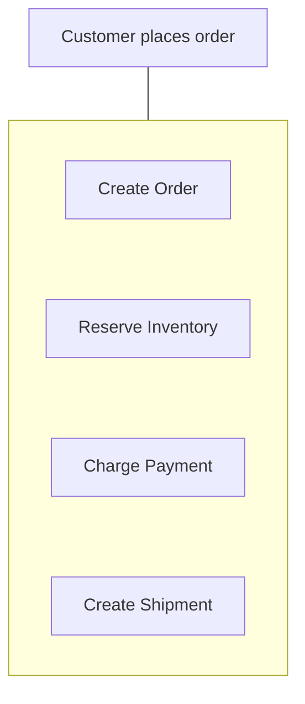

Each service may have its own database.

A normal database transaction cannot automatically cover all of them.

A distributed transaction such as 2PC can provide atomic coordination, but introduces significant coordination and availability costs.

A Saga provides another approach:

> **Break one business operation into a sequence of local transactions and define what should happen when a later step fails.**

---

# 2. Saga Mental Model

Instead of:

```text
BEGIN
   Order
   Inventory
   Payment
   Shipping
COMMIT
```

we use:

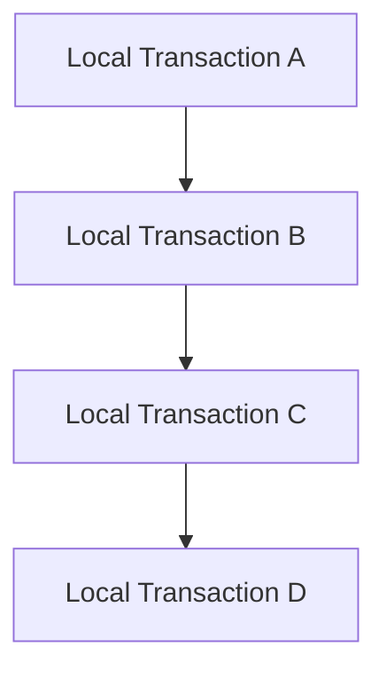

For example:

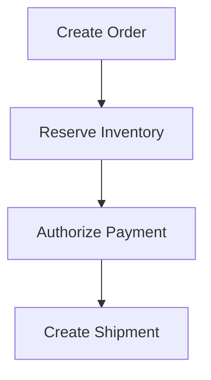

Each step commits independently.

If something fails:

```text
Step A ✓
Step B ✓
Step C ✗
```

the Saga performs appropriate recovery actions:

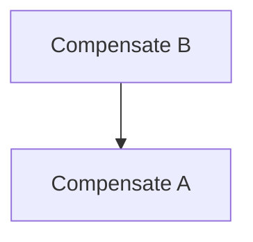

---

# 3. What Is a Saga?

A **Saga** is a sequence of local transactions that together implement one long-running business operation.

Each local transaction:

1. Changes state within its own transactional boundary.
2. Commits independently.
3. Triggers the next step.
4. Has defined failure/recovery behavior.

This gives the system a way to recover without requiring one global database transaction.

---

# 4. Saga Is Not Distributed ACID

This distinction is essential.

### Distributed transaction

Attempts to provide:

```text
All commit
    OR
All abort
```

### Saga

Provides:

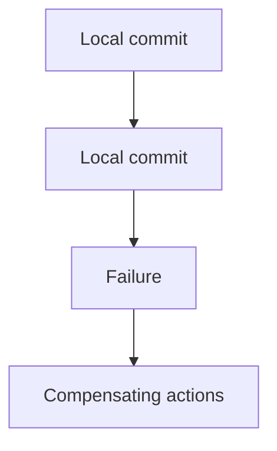

A Saga does **not** provide the same atomicity as a distributed ACID transaction.

There may be periods where the system is temporarily inconsistent.

For example:

```text
Order = CREATED
Inventory = RESERVED
Payment = PENDING
```

The system may eventually reach:

```text
Order = CONFIRMED
Inventory = RESERVED
Payment = PAID
```

or:

```text
Order = CANCELLED
Inventory = AVAILABLE
Payment = NOT_CHARGED
```

The workflow determines the valid states.

---

# 5. Local Transactions Are the Foundation

Suppose the Order Service owns:

```text
orders
```

The service can perform:

```text
BEGIN
   Create Order
   Set status = PENDING
COMMIT
```

This is a normal local database transaction.

The Inventory Service separately performs:

```text
BEGIN
   Reserve inventory
COMMIT
```

And Payment Service:

```text
BEGIN
   Authorize payment
COMMIT
```

The Saga connects these local transactions.

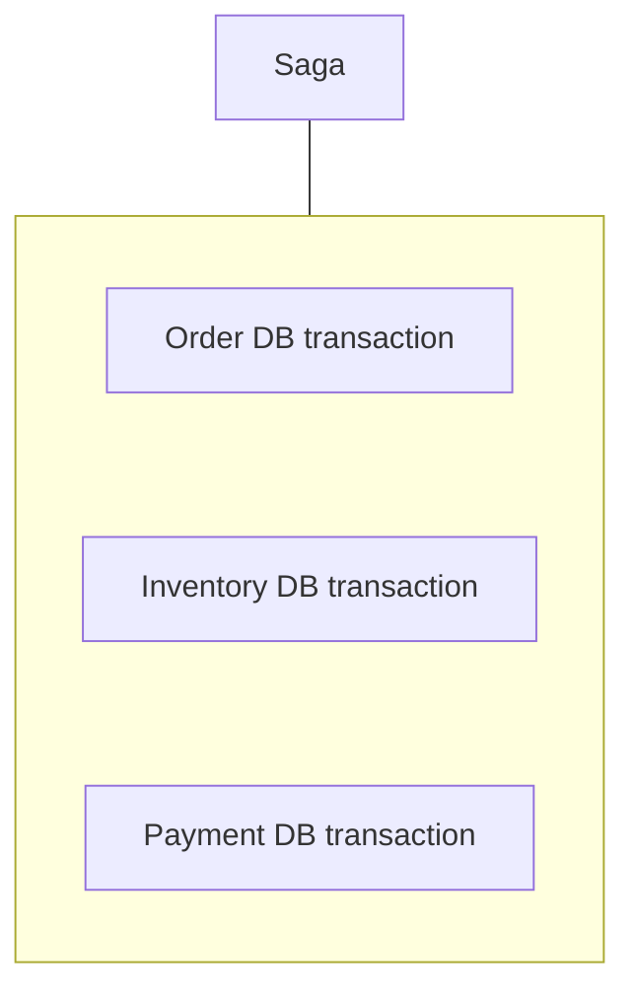

The key design principle is:

> **Keep each local transaction small and owned by the service responsible for that data.**

---

# 6. Example: E-Commerce Checkout

Consider:

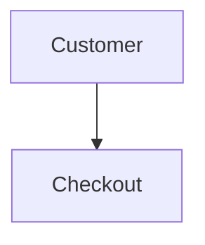

The workflow:

```text
1. Create Order
2. Reserve Inventory
3. Authorize Payment
4. Create Shipment
5. Confirm Order
```

Successful flow:

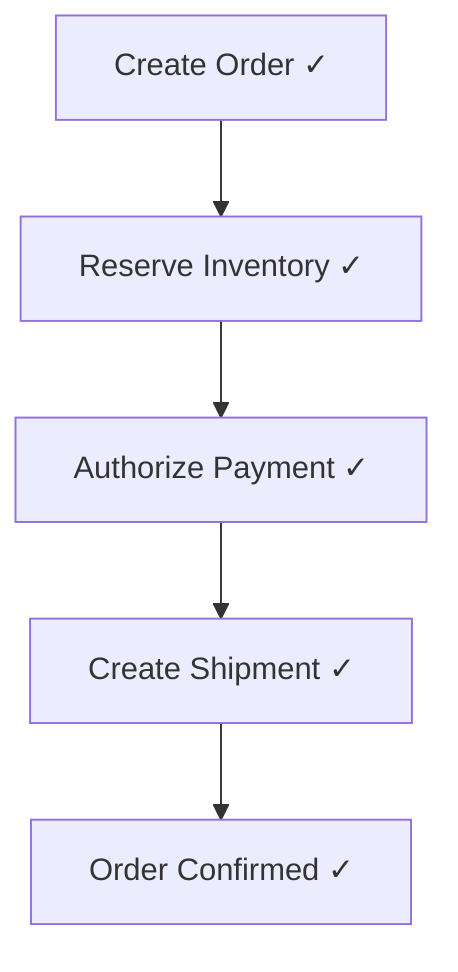

Final state:

```text
Order       = CONFIRMED
Inventory   = RESERVED
Payment     = AUTHORIZED
Shipment    = CREATED
```

---

# 7. What If Payment Fails?

Suppose:

```text
Create Order        ✓
Reserve Inventory   ✓
Authorize Payment   ✗
```

The Saga can execute compensation:

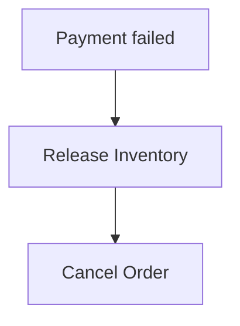

Final state:

```text
Order       = CANCELLED
Inventory   = AVAILABLE
Payment     = NOT_CHARGED
```

The important point:

> **The system did not roll back the previous database transactions. It performed new operations that compensate for their business effects.**

---

# 8. Compensation Is a New Transaction

Suppose inventory was reserved:

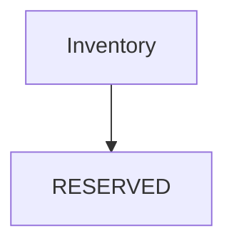

Later payment fails.

The Saga might perform:

```text
Release Inventory
```

This is a new local transaction:

```text
BEGIN
   Change inventory reservation
COMMIT
```

It is not:

```text
ROLLBACK previous transaction
```

The original transaction has already committed.

This distinction is fundamental.

---

# 9. Compensation Is Business-Specific

Not every action has a perfect reverse operation.

For example:

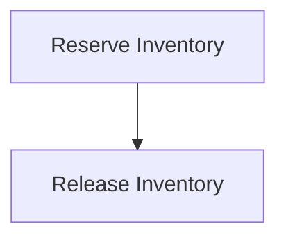

has a relatively clear compensation.

But:

```text
Send Email
```

does not have:

```text
Undo Email
```

Similarly:

```text
Ship Package
```

may not be safely reversible once the package has entered a carrier network.

Therefore:

> **A Saga must be designed around business semantics, not generic rollback rules.**

---

# 10. Not Every Step Needs Compensation

Some operations are:

- reversible,
- retryable,
- naturally idempotent,
- informational,
- asynchronous,
- intentionally final.

For example:

```text
Create Order       → may be cancelled
Reserve Inventory  → may be released
Authorize Payment  → may be voided
Send Notification  → may not be reversible
```

Therefore the Saga should define the correct response for each step.

A useful table is:

| Step | Success | Failure Action |
|---|---|---|
| Create Order | Order created | Stop |
| Reserve Inventory | Inventory reserved | Cancel order |
| Authorize Payment | Payment authorized | Release inventory + cancel order |
| Create Shipment | Shipment created | Cancel/hold workflow depending on business rules |
| Send Notification | Notification sent | Retry or record failure |

The exact actions depend on the business.

---

# 11. Saga State Machine

A Saga is easier to reason about as a state machine.

For checkout:

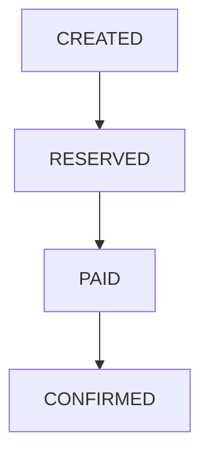

Failure paths:

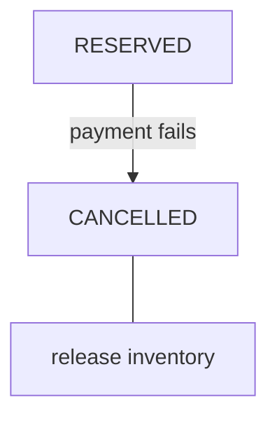

Explicit states are valuable because they make recovery observable and deterministic.

---

# 12. Orchestration vs Choreography

There are two common ways to coordinate a Saga:

```text
1. Orchestration
2. Choreography
```

They solve the same broad problem but organize coordination differently.

---

# 13. Saga Orchestration

An **orchestrator** controls the workflow.

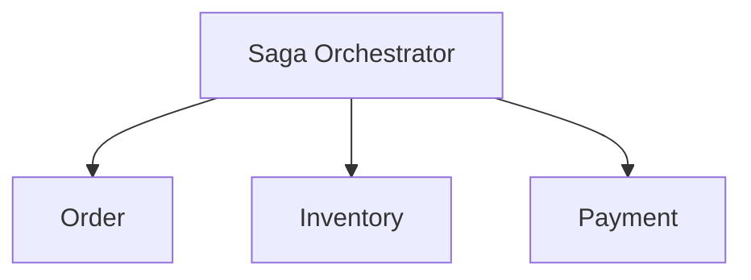

The orchestrator tells each service what to do.

For example:

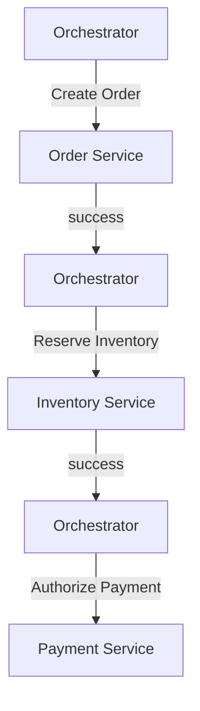

The workflow is centralized.

---

# 14. Orchestration Failure Handling

Suppose payment fails:

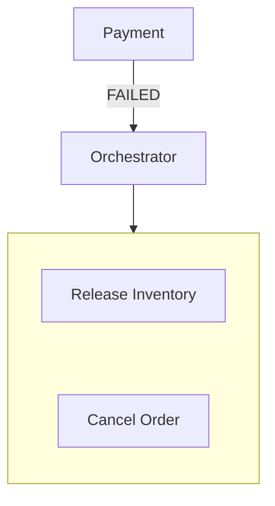

The orchestrator knows the workflow and compensation sequence.

This can make complex workflows easier to understand.

---

# 15. Advantages of Orchestration

| Advantage | Why it helps |
|---|---|
| Central workflow | Easy to see the overall process |
| Explicit failure handling | Compensation logic is visible |
| Easier monitoring | One component can track Saga state |
| Complex workflows | Conditions and branching are easier to manage |
| Less implicit coupling | Services do not need to understand the entire workflow |

But the orchestrator introduces its own operational responsibility.

---

# 16. Orchestration Trade-offs

The orchestrator can become:

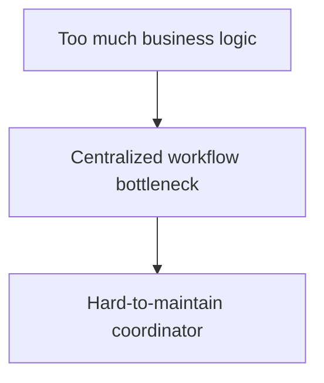

Avoid turning it into a giant service that owns every domain rule.

A good orchestrator should primarily coordinate:

```text
Which step comes next?
What happens on failure?
Which compensation is required?
What is the Saga state?
```

Domain ownership should remain with the relevant services.

---

# 17. Saga Choreography

In **choreography**, there is no central orchestrator controlling every step.

Services react to events.

For example:

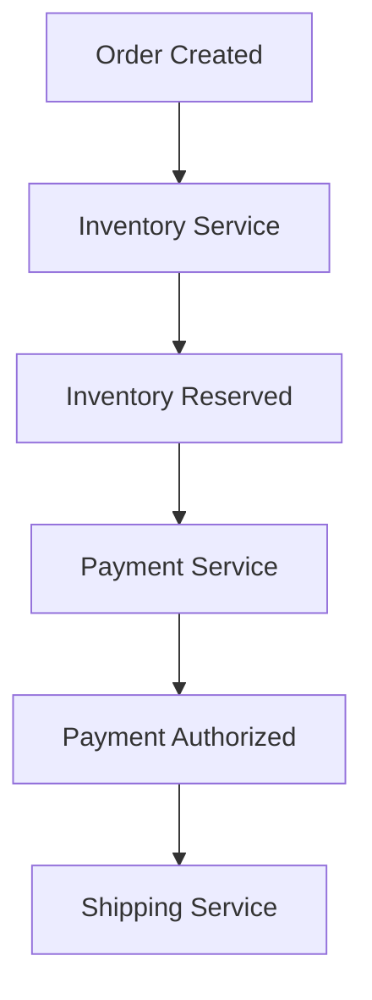

Conceptually:

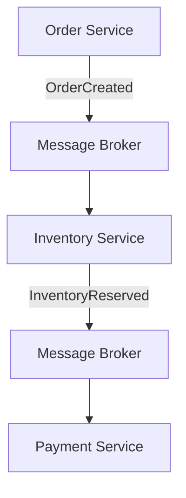

Each service reacts to events and produces new events.

---

# 18. Choreography Failure Handling

Suppose payment fails:

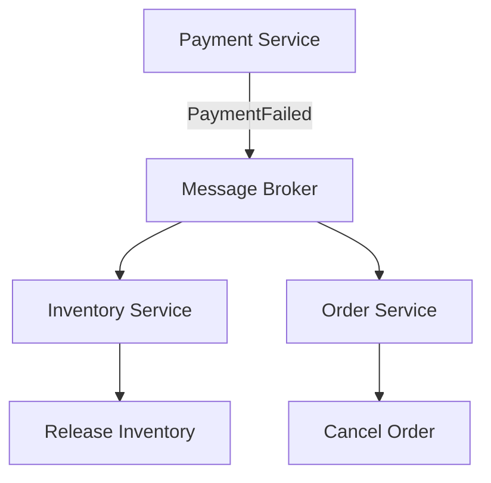

No central component explicitly tells every service what to do.

The services respond to the events they own.

---

# 19. Orchestration vs Choreography

| Orchestration | Choreography |
|---|---|
| Central coordinator | Event-driven collaboration |
| Workflow visible in one place | Workflow distributed across services |
| Easier for complex workflows | Can work well for simple event flows |
| Compensation centrally coordinated | Compensation triggered by events |
| Orchestrator is another component | Broker/events become important infrastructure |
| Can become too centralized | Can become difficult to understand at large scale |

Neither is universally better.

The choice depends on workflow complexity, team boundaries, event infrastructure, and operational needs.

---

# 20. When Choreography Becomes Difficult

Consider:

```mermaid
flowchart TD
  accTitle: A longer event chain
  accDescr: OrderCreated, then Inventory, then Payment, then Shipping, then Notification, then Analytics.
  N0["OrderCreated"] --> N1["Inventory"] --> N2["Payment"] --> N3["Shipping"] --> N4["Notification"] --> N5["Analytics"]
```

Now imagine:

```mermaid
flowchart TD
  accTitle: Who reacts?
  accDescr: PaymentFailed: inventory? order? shipping? notification?
  H["PaymentFailed"] --> G
  subgraph G[" "]
    direction TB
    I0["Inventory?"] ~~~ I1["Order?"] ~~~ I2["Shipping?"] ~~~ I3["Notification?"]
  end
```

As workflows become more complex, understanding the complete behavior becomes harder.

You can end up with:

```mermaid
flowchart TD
  accTitle: Event spaghetti
  accDescr: Service A, then Event, then Service B, then Event, then Service C, then Event, then Service D.
  N0["Service A"] --> N1["Event"] --> N2["Service B"] --> N3["Event"] --> N4["Service C"] --> N5["Event"] --> N6["Service D"]
```

and no single place clearly showing the overall workflow.

This is sometimes called **event spaghetti**.

---

# 21. When Orchestration Becomes Difficult

Orchestration has the opposite risk.

You may create:

```mermaid
flowchart TD
  accTitle: One huge orchestrator
  accDescr: One orchestrator handles order, inventory, payment, shipping, refunds, discounts, notifications, promotions and more.
  H["One huge orchestrator"] --- G
  subgraph G[" "]
    direction TB
    I0["Order"] ~~~ I1["Inventory"] ~~~ I2["Payment"] ~~~ I3["Shipping"] ~~~ I4["Refunds"] ~~~ I5["Discounts"] ~~~ I6["Notifications"] ~~~ I7["Promotions"] ~~~ I8["..."]
  end
```

Now the orchestrator becomes a central business-logic hub.

This can create:

- high coupling,
- difficult changes,
- large deployment scope,
- unclear ownership.

Therefore:

> **Orchestration should coordinate workflows, not absorb every business rule.**

---

# 22. Saga and Idempotency

Sagas often rely on retries.

For example:

```mermaid
flowchart TD
  accTitle: A retried step
  accDescr: Reserve inventory times out and is retried.
  N0["Reserve Inventory"] -->|"timeout"| N1["Retry"]
```

The first request may actually have succeeded.

Without idempotency:

```text
Reserve #1 ✓
Reserve #2 ✓
```

could produce an incorrect result.

Therefore Saga participants should often support:

```text
operation ID
idempotency key
message ID
unique constraint
```

For example:

```text
reserve(order_id = 123)
```

If the same logical request arrives twice:

```text
First request  → reservation created
Second request → recognize duplicate
```

and does not create a second reservation.

---

# 23. Saga and Timeouts

Suppose:

```mermaid
flowchart TD
  accTitle: A timeout in a saga
  accDescr: The orchestrator sends a payment request; Payment Service is processing when the call times out.
  O["Orchestrator"] -->|"Payment request"| P["Payment Service"] --x|"processing..."| T["timeout"]
```

The orchestrator does not automatically know whether:

```text
Payment failed
```

or:

```text
Payment succeeded but response was lost
```

Therefore:

```mermaid
flowchart TD
  accTitle: Handling a timeout
  accDescr: Timeout, then Do not blindly compensate, then Determine/reconcile state.
  N0["Timeout"] --> N1["Do not blindly compensate"] --> N2["Determine/reconcile state"]
```

For payment workflows, the system may need to query payment status or receive an authoritative event before deciding what to do.

This is the same timeout uncertainty discussed in **02.10** and **07.13**.

---

# 24. Saga and Retries

A Saga can retry transient failures:

```mermaid
flowchart TD
  accTitle: A successful retry
  accDescr: Payment request, then timeout, then retry, then success.
  N0["Payment request"] --> N1["timeout"] --> N2["retry"] --> N3["success"]
```

But retries must be controlled.

Use:

- retry limits,
- backoff,
- jitter,
- deadlines,
- idempotency.

Otherwise:

```mermaid
flowchart TD
  accTitle: Uncontrolled saga retries
  accDescr: Service failure, then Saga retry, then More requests, then More load, then Service becomes slower, then More retries.
  N0["Service failure"] --> N1["Saga retry"] --> N2["More requests"] --> N3["More load"] --> N4["Service becomes slower"] --> N5["More retries"]
```

This connects directly to:

- **02.11 — Retries**
- **02.12 — Retry Storms**
- **06.15 — Thundering Herd**

---

# 25. Saga and Eventual Consistency

Because local transactions commit independently, the system can temporarily contain different states.

For example:

```text
Order       = PENDING
Inventory   = RESERVED
Payment     = PENDING
```

Later:

```text
Order       = CONFIRMED
Inventory   = RESERVED
Payment     = AUTHORIZED
```

This is often an example of **eventual consistency across the workflow**.

The important requirement is:

> **Every intermediate state must be valid and recoverable.**

Do not design a Saga assuming every participant changes simultaneously.

---

# 26. Intermediate States Must Be Safe

Suppose:

```text
Order = PENDING
Inventory = RESERVED
Payment = PENDING
```

Can users see this?

If yes, the product should explain it appropriately:

```text
"Payment processing..."
```

If the user sees:

```text
Order = CONFIRMED
Payment = PENDING
```

that may be unacceptable for the business.

Therefore:

> **Saga design is partly a product-state design problem.**

Technical architecture and user-visible states must agree.

---

# 27. Saga State Must Be Durable

Suppose an orchestrator is tracking:

```text
Order 123
Step = Payment
```

Then the orchestrator crashes.

If the state existed only in memory:

```mermaid
flowchart TD
  accTitle: In-memory saga state
  accDescr: Process crashes, then Saga state lost.
  N0["Process crashes"] --> N1["Saga state lost"]
```

The workflow may not know where it was.

Therefore, long-running Sagas often require durable workflow state.

Conceptually:

```mermaid
flowchart TD
  accTitle: Durable saga state
  accDescr: The saga orchestrator stores saga ID, current step, completed steps, retry count and failure state.
  O["Saga Orchestrator"] --> S["Saga State Store"] --- G
  subgraph G[" "]
    direction TB
    I0["Saga ID"] ~~~ I1["Current Step"] ~~~ I2["Completed Steps"] ~~~ I3["Retry Count"] ~~~ I4["Failure State"]
  end
```

The exact implementation varies.

---

# 28. Saga State and Idempotency Together

Suppose:

```text
Saga 123
Step = Reserve Inventory
```

The orchestrator crashes after sending the request.

On restart:

```text
Should it send Reserve Inventory again?
```

The answer may be:

```text
Yes, if the operation is idempotent.
```

The inventory service can safely recognize:

```text
Saga ID = 123
Step = Reserve Inventory
```

and avoid duplicate work.

Therefore:

> **Durable workflow state and idempotent operations complement each other.**

---

# 29. Compensation Ordering

Suppose:

```text
A ✓
B ✓
C ✓
D ✗
```

Possible compensation:

```mermaid
flowchart TD
  accTitle: Reverse-order compensation
  accDescr: Undo C, then Undo B, then Undo A.
  N0["Undo C"] --> N1["Undo B"] --> N2["Undo A"]
```

This resembles reverse-order rollback.

But the correct order is business-specific.

For example:

```text
Shipment created
Payment authorized
Inventory reserved
```

You may need:

```text
Cancel shipment
Void/refund payment
Release inventory
```

The compensation sequence must respect business dependencies.

---

# 30. Compensation Can Also Fail

This is a critical point.

Suppose:

```mermaid
flowchart TD
  accTitle: A failed compensation
  accDescr: Payment failed, then Release Inventory, then Release fails.
  N0["Payment failed"] --> N1["Release Inventory"] --> N2["Release fails"]
```

Now:

```text
Inventory remains reserved
```

The Saga itself is not automatically finished.

The system needs:

- retry,
- delayed retry,
- manual intervention,
- reconciliation,
- alerts,
- dead-letter handling where appropriate.

Therefore:

> **A compensation step is itself distributed work and can fail.**

---

# 31. The Saga Does Not Remove Failure

It changes how failure is handled.

Without a Saga:

```mermaid
flowchart TD
  accTitle: Without a saga
  accDescr: Cross-service workflow, then Partial failure, then Unclear recovery.
  N0["Cross-service workflow"] --> N1["Partial failure"] --> N2["Unclear recovery"]
```

With a Saga:

```mermaid
flowchart TD
  accTitle: With a saga
  accDescr: Cross-service workflow, then Explicit local steps, then Defined failure transitions, then Compensation / retry / reconciliation.
  N0["Cross-service workflow"] --> N1["Explicit local steps"] --> N2["Defined failure transitions"] --> N3["Compensation / retry / reconciliation"]
```

The system still experiences failures.

It simply has a more deliberate recovery model.

---

# 32. Saga vs 2PC

| Aspect | 2PC | Saga |
|---|---|---|
| Main goal | Atomic commit | Business workflow recovery |
| Transactions | Distributed transaction | Multiple local transactions |
| Atomicity | Global atomic commit | No global atomic commit |
| Consistency | Strong coordination | Often eventual across steps |
| Failure handling | Abort/commit protocol | Compensation/retry/recovery |
| Availability | Can be reduced by coordination | Often more flexible |
| Coupling | Higher coordination | Looser service boundaries |
| Business semantics | Less compensation-focused | Compensation is central |
| Complexity | Protocol/coordination complexity | Workflow/recovery complexity |

The choice depends on the actual requirement.

---

# 33. When Sagas Make Sense

Sagas are useful when:

- a business workflow spans multiple services,
- each service owns its own data,
- global ACID transactions are undesirable or unavailable,
- eventual consistency is acceptable,
- business compensation is possible,
- the workflow may run for a significant period,
- retries and recovery need to be explicit.

Examples:

```text
Order processing
Travel booking
Hotel reservation
Payment workflows
Shipment workflows
Account provisioning
```

---

# 34. When Sagas Are a Poor Fit

A Saga may be difficult when:

### 1. Compensation is impossible

```text
Action cannot be meaningfully reversed.
```

### 2. Strong atomicity is mandatory

```text
All changes must become visible together.
```

### 3. Intermediate states are unacceptable

```text
Temporary inconsistency cannot be tolerated.
```

### 4. The workflow is extremely complex

The Saga may become difficult to reason about and operate.

### 5. The services should actually be one transactional boundary

If several operations belong naturally inside one database transaction, splitting them may create unnecessary complexity.

This leads back to a key architectural principle:

> **Do not distribute a transaction boundary without a good reason.**

---

# 35. Practical Saga Design Checklist

Before designing a Saga, identify:

```mermaid
flowchart TD
  accTitle: Saga design checklist
  accDescr: Business operation, then Steps, then Owner of each step, then Local transaction, then Success event/result, then Failure behavior, then Compensation, then Retry policy, then Idempotency, then Timeout behavior, then Durable Saga state, then Reconciliation.
  N0["Business operation"] --> N1["Steps"] --> N2["Owner of each step"] --> N3["Local transaction"] --> N4["Success event/result"] --> N5["Failure behavior"] --> N6["Compensation"] --> N7["Retry policy"] --> N8["Idempotency"] --> N9["Timeout behavior"] --> N10["Durable Saga state"] --> N11["Reconciliation"]
```

This turns an abstract pattern into an operational design.

---

# 36. Hands-On Exercise

## Design a Checkout Saga

Use:

```text
Order
Inventory
Payment
Shipping
```

## Step 1 — Define the happy path

```mermaid
flowchart TD
  accTitle: The happy path
  accDescr: Create Order, then Reserve Inventory, then Authorize Payment, then Create Shipment, then Confirm Order.
  N0["Create Order"] --> N1["Reserve Inventory"] --> N2["Authorize Payment"] --> N3["Create Shipment"] --> N4["Confirm Order"]
```

## Step 2 — Define local transactions

For each service, write:

```text
Input
Local transaction
State change
Success result
```

Example:

```text
Inventory Service

Input:
order_id, product_id, quantity

Transaction:
reserve stock

State:
AVAILABLE → RESERVED
```

## Step 3 — Define compensation

Create a table:

| Step | Failure | Compensation |
|---|---|---|
| Create Order | Failed | Stop |
| Reserve Inventory | Failed | Cancel order |
| Authorize Payment | Failed | Release inventory + cancel order |
| Create Shipment | Failed | Void/refund payment + release inventory + cancel order |

Then ask:

> Are these compensations actually valid for the business?

## Step 4 — Add failure scenarios

Simulate:

```text
Payment timeout
Inventory timeout
Shipping failure
Orchestrator crash
Duplicate message
Compensation failure
```

For each one, define the next state.

## Step 5 — Choose orchestration or choreography

Ask:

```text
Is the workflow simple?

Are there many branching failure paths?

Does one team own the workflow?

Do we already have strong event infrastructure?
```

Then choose the simpler appropriate model.

---

# 37. Common Mistakes

### Mistake 1 — Treating Saga as "distributed rollback"

It is not.

Compensation is a new business action.

---

### Mistake 2 — Forgetting idempotency

Retries can duplicate operations.

---

### Mistake 3 — Blindly compensating after a timeout

The original operation may have succeeded.

---

### Mistake 4 — Making the orchestrator own domain logic

The orchestrator should coordinate the workflow, not become the owner of every business rule.

---

### Mistake 5 — Creating event spaghetti

Too many implicit event chains can make the workflow impossible to understand.

---

### Mistake 6 — Ignoring compensation failure

Compensation can fail and needs its own recovery strategy.

---

### Mistake 7 — Ignoring intermediate states

Users and downstream systems may observe states while the Saga is still running.

---

### Mistake 8 — Using a Saga when one local transaction would work

Do not distribute a problem unnecessarily.

---

### Mistake 9 — Assuming eventual consistency is automatically acceptable

The business must explicitly tolerate the temporary states created by the Saga.

---

# 38. Key Principle

> **A Saga turns one distributed business transaction into a sequence of local transactions with explicit failure and compensation behavior.**

It does not eliminate distributed-system problems.

Instead, it makes them explicit:

```mermaid
flowchart TD
  accTitle: What a saga makes explicit
  accDescr: Local transaction, then Communication, then Failure, then Retry / Compensation, then Recovery, then Final business state.
  N0["Local transaction"] --> N1["Communication"] --> N2["Failure"] --> N3["Retry / Compensation"] --> N4["Recovery"] --> N5["Final business state"]
```

The key question is:

> **Can the business tolerate intermediate states and define safe recovery actions?**

If yes, a Saga can be a powerful alternative to distributed atomic transactions.

---

# 39. Quick Reference

| Concept | Meaning |
|---|---|
| Saga | Sequence of local transactions forming one business workflow |
| Local Transaction | Atomic operation within one service/data boundary |
| Compensation | New operation that counteracts a previous business action |
| Orchestration | Central coordinator controls Saga steps |
| Choreography | Services coordinate through events |
| Saga State | Durable record of workflow progress |
| Intermediate State | Temporary valid state while Saga is executing |
| Idempotency | Safe repeated execution of a logical operation |
| Reconciliation | Process of detecting and correcting unresolved state |
| Eventual Consistency | State becomes consistent after propagation/recovery |
| 2PC | Distributed atomic commit protocol |
| Event Spaghetti | Difficult-to-understand chain of implicit event interactions |

---

# 40. Knowledge Check

### Question 1

What is a Saga?

A sequence of local transactions that together implement a distributed business workflow, with explicit failure and compensation behavior.

---

### Question 2

Does a Saga provide global ACID atomicity?

**No.**

It uses independent local transactions and business-level compensation.

---

### Question 3

What is compensation?

A new business operation intended to counteract the effect of a previous committed operation.

---

### Question 4

What is the difference between orchestration and choreography?

**Orchestration** uses a central coordinator to control the workflow.

**Choreography** uses events so services react to one another without a central workflow controller.

---

### Question 5

Why is idempotency important in a Saga?

Because retries and duplicate messages can cause the same logical operation to execute more than once.

---

### Question 6

Why is a timeout dangerous in a Saga?

Because the caller may not know whether the operation failed or succeeded before the response was lost.

---

### Question 7

Can compensation fail?

**Yes.**

Compensation is itself distributed work and needs retry, reconciliation, monitoring, or manual recovery when necessary.

---

### Question 8

When should you avoid a Saga?

When a local transaction is sufficient, strong global atomicity is mandatory, compensation is impossible, or the business cannot tolerate the intermediate states introduced by the workflow.

---

# Remember

A Saga is not:

```text
"One transaction spread across many databases."
```

Think of it as:

```mermaid
flowchart TD
  accTitle: A saga
  accDescr: Business workflow, three local transactions, failure? Retry or compensate, then recovery and the final state.
  N0["Business Workflow"] --> N1["Local Transaction"] --> N2["Local Transaction"] --> N3["Local Transaction"] --> F{"Failure?"}
  F --> R["Retry"] & C["Compensate"]
  R & C --> V["Recovery"] --> E["Final State"]
```

The most important question is:

> **Can every step have a safe, business-meaningful recovery path?**

If yes, a Saga may let you keep services independently owned while still coordinating a complex business workflow.

**Next: 07.15 — Outbox Pattern**
