# 07.15 — Outbox Pattern

## Learning Objectives

By the end of this chapter, you should be able to:

- Explain the **dual-write problem**.
- Understand what the **Outbox Pattern** is and why it exists.
- Understand how business data and an outbox event are committed atomically.
- Understand how an outbox publisher delivers events to a message broker.
- Handle crashes, retries, duplicate events, and failed publishing.
- Understand why consumers should be idempotent.
- Distinguish the Outbox Pattern from distributed transactions and Sagas.
- Recognize when the Outbox Pattern is useful and when it is unnecessary.

---

# 1. The Problem: Database + Message

Suppose an Order Service needs to:

1. Create an order in its database.
2. Publish an `OrderCreated` event.

The intended flow is:

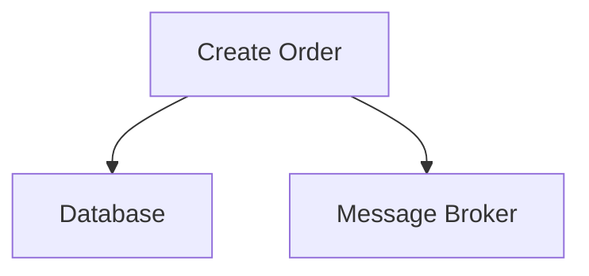

At first this looks simple.

But these are two different systems.

```text
Order Database
Message Broker
```

They normally have separate failure and transaction boundaries.

This creates the **dual-write problem**.

---

# 2. The Dual-Write Problem

Imagine:

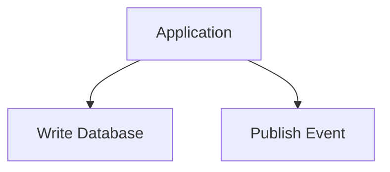

What happens if the database succeeds but publishing fails?

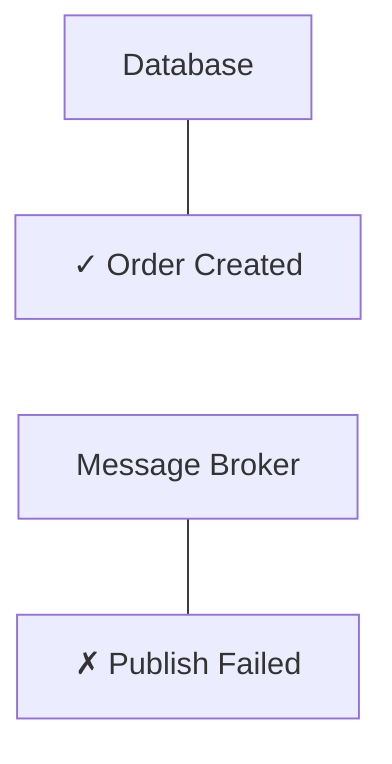

Now:

```text
Order exists
Event does not
```

Another service may never learn that the order was created.

---

# 3. The Opposite Failure

Now reverse the order:

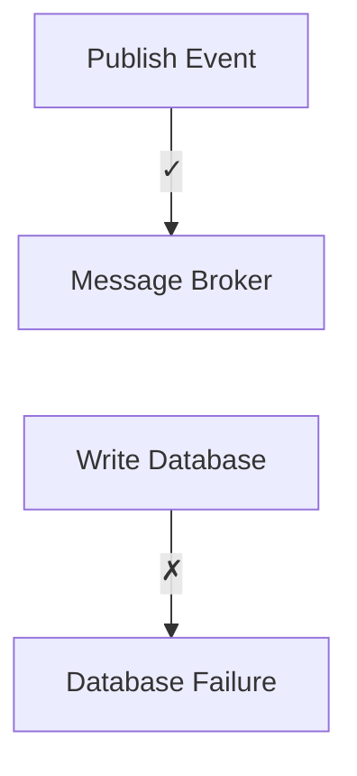

Now:

```text
Event says:
"Order Created"

But:
Order does not exist
```

A consumer may process an event describing state that was never successfully committed.

This is why simply doing:

```text
Write DB
Publish Event
```

or:

```text
Publish Event
Write DB
```

is not enough.

---

# 4. Why Not Use a Distributed Transaction?

One possible solution is to coordinate:

```text
Database
   +
Message Broker
```

inside a distributed transaction.

But that introduces the same kind of distributed coordination problem discussed in:

**07.13 — Distributed Transactions**

The application may not actually need:

> **Atomic commit across two independent systems.**

It may only need:

> **If the database change commits, eventually publish the corresponding event.**

That is a different requirement.

This is where the Outbox Pattern is useful.

---

# 5. What Is the Outbox Pattern?

The **Outbox Pattern** stores the outgoing event in the same database transaction as the business data change.

Instead of:

```text
Database
   +
Message Broker
```

being written independently, the application writes:

```text
Business Data
+
Outbox Event
```

inside one local database transaction.

Conceptually:

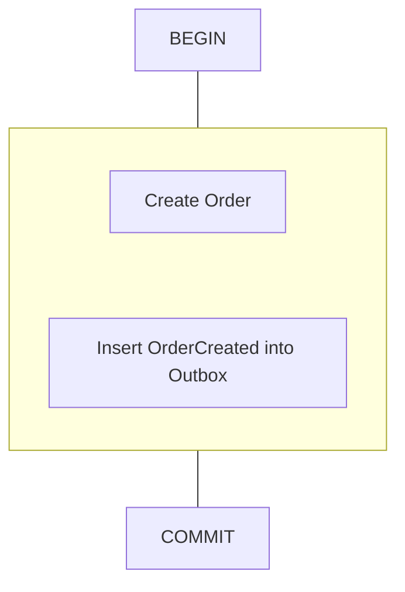

Then a separate publisher sends the outbox event to the broker.

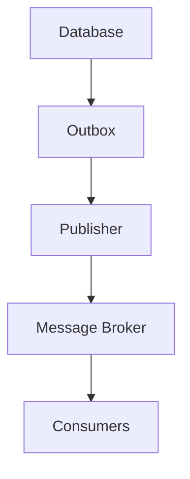

The database becomes the reliable handoff point between:

```text
Business state
```

and:

```text
Event publication
```

---

# 6. The Core Architecture

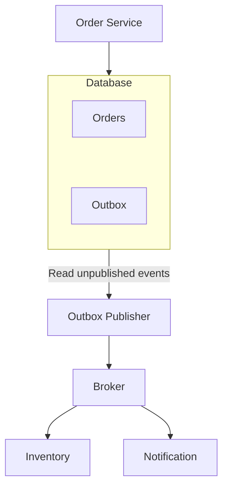

The critical relationship is:

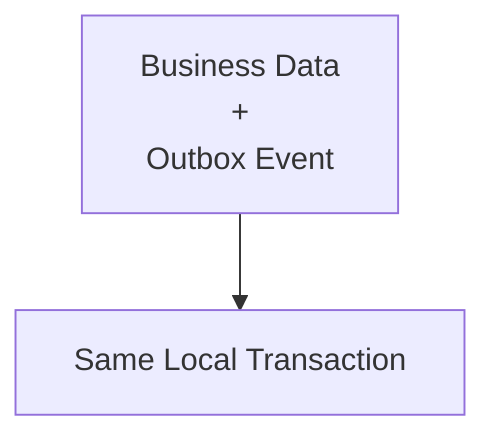

---

# 7. The Local Transaction

Suppose the customer places an order.

The Order Service performs:

```sql
BEGIN;

INSERT INTO orders (...);

INSERT INTO outbox_events (
    event_type,
    aggregate_id,
    payload
) VALUES (
    'OrderCreated',
    123,
    '...'
);

COMMIT;
```

The exact schema and SQL depend on the application and database.

The important idea is:

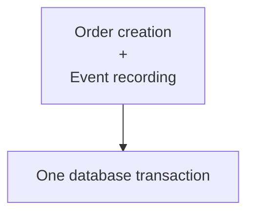

Therefore:

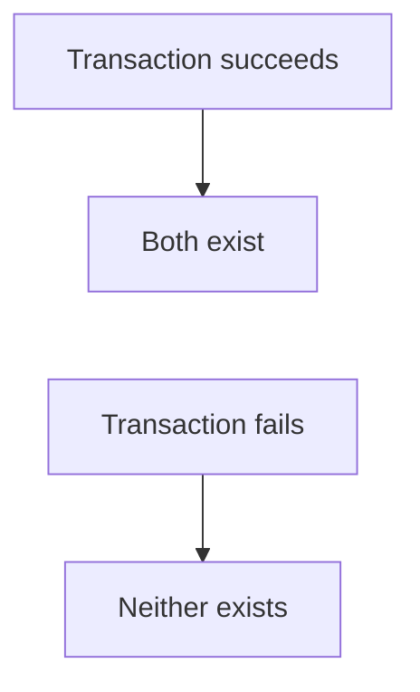

Within that database transaction boundary.

---

# 8. What Happens After Commit?

The message has not necessarily reached the broker yet.

The database contains:

```text
orders
────────────────
id = 123
status = PENDING

outbox_events
────────────────
id = 9001
type = OrderCreated
published = false
```

A separate publisher reads the outbox.

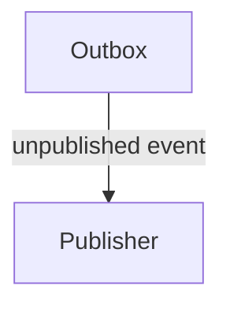

The publisher then sends:

```text
OrderCreated
```

to the message broker.

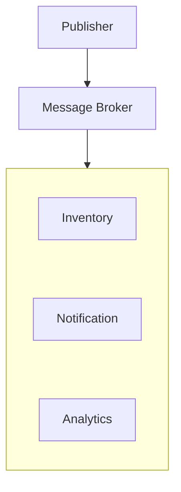

---

# 9. Why This Works

Consider the important failure:

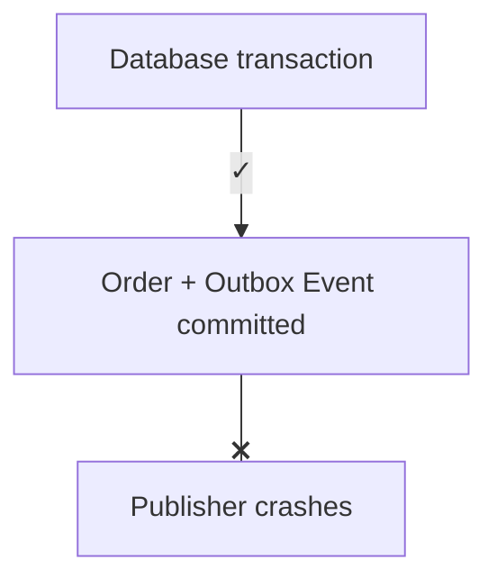

The event is still stored.

When the publisher restarts:

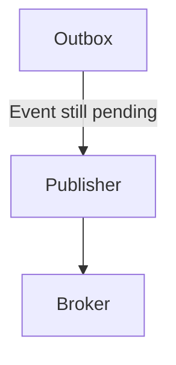

The event can be published later.

The database provides durable storage for the pending event.

---

# 10. The Publisher

The component responsible for reading and publishing outbox records is commonly called an:

```text
Outbox Publisher
```

or:

```text
Relay
```

Conceptually:

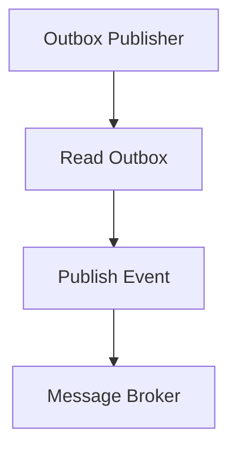

It may run:

- continuously,
- periodically,
- through polling,
- using database notifications,
- through CDC-based infrastructure.

The exact implementation varies.

---

# 11. Polling-Based Outbox

A simple implementation uses polling.

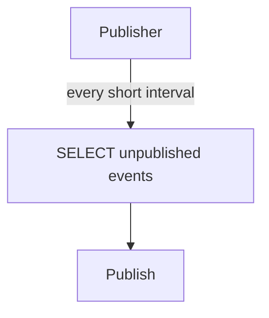

For example:

```text
while running:

    read pending events

    publish events

    mark successful events

    wait
```

This is easy to understand and often sufficient.

But polling introduces:

- database reads,
- polling frequency decisions,
- duplicate handling,
- publisher concurrency considerations.

---

# 12. Change Data Capture

Another approach is to use **Change Data Capture (CDC)**.

Instead of repeatedly asking:

```text
"Are there new outbox rows?"
```

a CDC system observes database changes and forwards relevant records.

Conceptually:

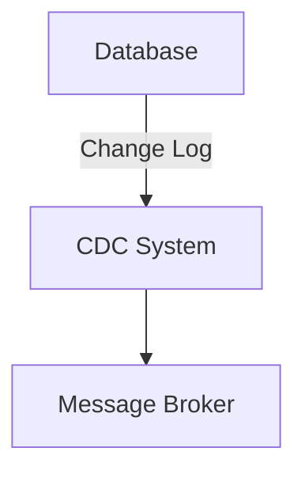

CDC can reduce polling overhead and provide scalable event movement.

However, it introduces additional infrastructure and operational complexity.

For Systemly, remember:

> **Polling is simple. CDC can provide a more specialized event-delivery pipeline. Choose based on scale and operational requirements.**

---

# 13. Outbox Table Design

A typical outbox record might contain:

```text
outbox_events

id
event_type
aggregate_type
aggregate_id
payload
created_at
published_at
attempt_count
```

For example:

```text
id           = 9001
event_type   = OrderCreated
aggregate_id = 123
payload      = {...}
created_at   = ...
published_at = NULL
```

The exact fields vary.

The important information is:

```text
What event?
For which entity?
What data?
When created?
Has it been published?
How many attempts?
```

---

# 14. Event Identity

Every outbox event should have a stable identity.

For example:

```text
event_id = 9001
```

If the publisher retries:

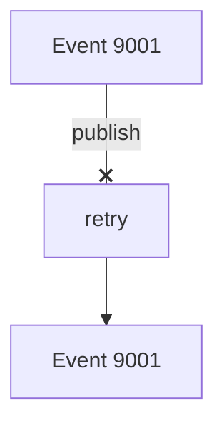

Consumers can recognize that these are the same logical event.

This is important because duplicate delivery is possible.

---

# 15. The Duplicate Publishing Problem

Suppose:

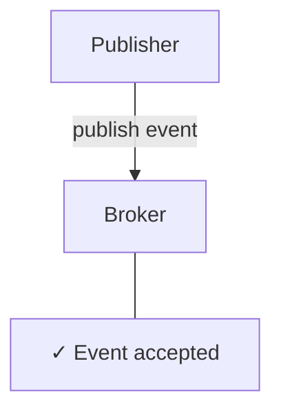

But before the publisher records:

```text
published = true
```

the publisher crashes.

```text
Broker ✓
Publisher crashes
Database still says:
published = false
```

When the publisher restarts:

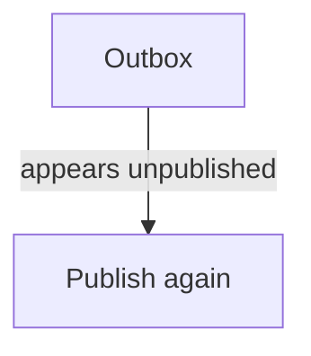

Now the broker may receive:

```text
OrderCreated
OrderCreated
```

This is a fundamental consequence of the pattern.

> **The Outbox Pattern commonly provides at-least-once publication, not automatic exactly-once delivery.**

---

# 16. Consumer Idempotency

Because duplicates can occur, consumers should often be idempotent.

For example:

```text
Event ID = 9001
```

Consumer receives:

```text
9001 → Process
```

Then receives:

```text
9001 → Duplicate
```

The consumer can detect:

```text
"This event was already processed."
```

and avoid repeating the side effect.

Conceptually:

```mermaid
flowchart TD
  accTitle: An idempotent consumer
  accDescr: The consumer checks the event ID: new events are processed, seen events are ignored or safely repeated.
  N0["Event"] --> N1["Consumer"] --> N2["Check Event ID"]
  N2 -->|"New"| P["Process"]
  N2 -->|"Seen"| I["Ignore / safely repeat"]
```

This connects directly to:

**05.11 — Idempotency**

and:

**05.10 — Message Delivery Semantics**

---

# 17. Deduplication Store

A consumer might maintain:

```text
processed_events

event_id
processed_at
```

When an event arrives:

```text
BEGIN

Check event_id

If already processed:
    skip

Otherwise:
    perform business change
    record event_id

COMMIT
```

This can make processing effectively idempotent for that consumer.

A database uniqueness constraint can be useful:

```text
UNIQUE(event_id)
```

The exact design depends on the consumer's business operation.

---

# 18. Outbox Does Not Guarantee Consumer Success

Suppose:

```mermaid
flowchart TD
  accTitle: Published, but not processed
  accDescr: Database, then Outbox, then Broker ✓, then Consumer ❌.
  N0["Database"] --> N1["Outbox"] --> N2["Broker ✓"] --> N3["Consumer ❌"]
```

The event has been published successfully.

But the consumer may:

- crash,
- reject the event,
- timeout,
- fail validation,
- encounter a database error.

The Outbox Pattern does not solve downstream processing.

It solves a narrower problem:

> **Reliably connecting a local database transaction with eventual event publication.**

---

# 19. Outbox + Retries

Suppose publishing fails:

```mermaid
flowchart TD
  accTitle: The broker is unavailable
  accDescr: The publisher reads the outbox but cannot reach the broker.
  O["Outbox"] --> P["Publisher"] --x B["Broker unavailable"]
```

The event remains pending.

The publisher can retry:

```mermaid
flowchart TD
  accTitle: Retrying publication
  accDescr: Retry, then Retry, then Success.
  N0["Retry"] --> N1["Retry"] --> N2["Success"]
```

Use appropriate:

- backoff,
- retry limits,
- jitter where relevant,
- monitoring.

Avoid continuously hammering an unavailable broker.

This connects to:

**02.11 — Retries**

and:

**02.12 — Retry Storms**

---

# 20. What If the Broker Is Down?

Suppose:

```text
Order Database ✓
Outbox ✓
Broker ✗
```

The Order Service can still commit the order if its local database is healthy.

The event remains in the outbox:

```text
outbox_events
────────────────────
OrderCreated
published = false
```

When the broker becomes available:

```mermaid
flowchart TD
  accTitle: When the broker recovers
  accDescr: Broker recovers, then Publisher retries, then Pending events published.
  N0["Broker recovers"] --> N1["Publisher retries"] --> N2["Pending events published"]
```

This gives the system a useful form of decoupling.

However, downstream consumers will experience a delay.

Therefore:

> **Outbox improves reliability of publication, not immediate delivery.**

---

# 21. The Consistency Trade-Off

Suppose:

```mermaid
flowchart TD
  accTitle: A delayed event
  accDescr: Order created, then Outbox committed, then Broker temporarily unavailable.
  N0["Order created"] --> N1["Outbox committed"] --> N2["Broker temporarily unavailable"]
```

The user may see:

```text
Order created
```

while another service has not yet received:

```text
OrderCreated
```

This is temporary inconsistency.

Eventually:

```mermaid
flowchart TD
  accTitle: Eventually consistent
  accDescr: Broker available, then Event published, then Consumers process event.
  N0["Broker available"] --> N1["Event published"] --> N2["Consumers process event"]
```

So Outbox commonly works with:

> **Eventual consistency.**

The business must tolerate this delay.

---

# 22. Outbox and Saga

The Outbox Pattern and Saga often work together.

For example:

```mermaid
flowchart TD
  accTitle: Outbox and saga
  accDescr: Order Service commits the order and OrderCreated to its outbox, the broker delivers it, and Inventory Service commits inventory and InventoryReserved to its own outbox.
  N0["Order Service"] -->|"Local transaction"| N1["Order + OrderCreated"] --> N2["Outbox"] --> N3["Broker"] --> N4["Inventory Service"] -->|"Local transaction"| N5["Inventory + InventoryReserved"] --> N6["Outbox"] --> N7["Broker"]
```

This can create a reliable event-driven Saga.

Conceptually:

```mermaid
flowchart TD
  accTitle: A reliable event-driven saga
  accDescr: Saga, then Local Transaction, then Outbox, then Event, then Next Service, then Local Transaction, then Outbox, then Next Event.
  N0["Saga"] --> N1["Local Transaction"] --> N2["Outbox"] --> N3["Event"] --> N4["Next Service"] --> N5["Local Transaction"] --> N6["Outbox"] --> N7["Next Event"]
```

This is a common architectural combination.

---

# 23. Outbox Does Not Make Publication Atomic

This distinction is important.

With Outbox:

```text
DB change + event record
```

are atomic within the database.

But:

```mermaid
flowchart TD
  accTitle: Not one atomic operation
  accDescr: DB commit, then Broker publication.
  N0["DB commit"] --> N1["Broker publication"]
```

is not one atomic operation.

There can be a delay or duplicate.

Therefore:

> **Outbox provides atomic recording of intent, followed by eventual publication.**

It does not make the database and broker behave like one transactional resource.

---

# 24. Ordering

Suppose the same order produces:

```text
OrderCreated
OrderPaid
OrderShipped
```

The system may need them delivered in the correct order.

The Outbox itself records events in the database.

But end-to-end ordering depends on:

- how events are published,
- concurrency,
- broker partitioning,
- consumer concurrency,
- event keys.

For example, events for one order might use:

```text
partition key = order_id
```

so they can remain ordered within an appropriate broker partition.

But:

> **An Outbox does not automatically guarantee global event ordering.**

---

# 25. Multiple Publishers

Suppose there are:

```text
Publisher A
Publisher B
Publisher C
```

all reading the same outbox.

This can improve throughput and availability.

But now you need to safely coordinate:

```text
Who owns this outbox row?
```

Possible approaches include database mechanisms such as:

- row locking,
- claiming records,
- leasing,
- partitioning work.

The exact approach depends on the database and implementation.

The key concern is:

> **Multiple publishers must not create uncontrolled duplicate work.**

Even with careful claiming, consumers should still be designed for duplicate delivery.

---

# 26. Outbox Growth

Suppose publishing fails for a long time.

```text
Outbox
────────────────────
Event 1
Event 2
Event 3
...
Event 1,000,000
```

The outbox can grow significantly.

This creates:

- storage pressure,
- larger scans,
- maintenance work,
- operational complexity.

Therefore the system needs an event-retention strategy.

For example:

```mermaid
flowchart TD
  accTitle: Outbox retention
  accDescr: Pending events must remain. Successfully published events can eventually be archived or deleted.
  A0["Pending events"] --> B0["Must remain"]
  A1["Successfully published"] --> B1["Can eventually be archived/deleted"]
  B0 ~~~ A1
```

Retention requirements depend on:

- recovery needs,
- audit requirements,
- replay requirements,
- compliance,
- whether another durable event log exists.

---

# 27. Cleanup Must Be Safe

Do not simply delete:

```text
all old outbox rows
```

without considering whether they are still needed.

You need to know:

```text
Was it successfully published?
Is it still required for recovery?
Does another system retain the event?
Do consumers need replay?
```

A common lifecycle is:

```mermaid
flowchart TD
  accTitle: The outbox event lifecycle
  accDescr: Created, then Pending, then Published, then Retained for required period, then Archived / Deleted.
  N0["Created"] --> N1["Pending"] --> N2["Published"] --> N3["Retained for required period"] --> N4["Archived / Deleted"]
```

The exact lifecycle is system-specific.

---

# 28. Large Payloads

An outbox event may contain:

```json
{
  "orderId": 123,
  "customerId": 42,
  "items": [...],
  "total": 5000
}
```

Large payloads increase:

- database size,
- replication traffic,
- broker message size,
- serialization cost.

Avoid turning the outbox into a second copy of large business datasets unnecessarily.

Often an event contains:

```text
Event type
Entity ID
Relevant metadata
Required event data
```

Consumers can sometimes retrieve additional data if appropriate.

But doing so creates additional dependencies.

The event design should match the business requirement.

---

# 29. Transaction Boundary

A good Outbox design asks:

> **What must be committed together?**

For example:

```text
Order status = CONFIRMED
+
OrderConfirmed event recorded
```

These belong together if the event means:

> "The database has committed the order as confirmed."

Then:

```text
BEGIN
   Update order
   Insert OrderConfirmed event
COMMIT
```

This creates a reliable relationship between state and event.

---

# 30. Outbox Event Semantics

An event should describe something that has actually happened.

For example:

```text
OrderCreated
```

should mean:

```text
The order was successfully created.
```

Avoid recording:

```text
OrderWillProbablyBeCreated
```

The event should represent a committed business fact or a well-defined message intent.

This makes consumers easier to reason about.

---

# 31. Event vs Command

An Outbox can contain different kinds of messages.

### Event

```text
OrderCreated
```

means:

> "This happened."

### Command

```text
ReserveInventory
```

means:

> "Please perform this action."

Both can be transported through messaging infrastructure.

But their semantics differ.

This distinction matters when designing workflows.

---

# 32. Security Considerations

Outbox events may contain sensitive business information.

For example:

```text
customer_id
email
order details
payment metadata
```

Do not automatically copy every database field into the event.

Ask:

```text
What does the consumer actually need?
```

Apply:

- least privilege,
- appropriate access controls,
- encryption where required,
- data minimization,
- careful logging.

Never log full sensitive event payloads casually.

---

# 33. Outbox Failure Scenarios

A useful way to understand the pattern is through failures.

| Failure | Result | Recovery |
|---|---|---|
| DB transaction fails | Business data + outbox event do not commit | Retry/request fails |
| Publisher crashes before publish | Event remains in outbox | Publish later |
| Broker unavailable | Event remains pending | Retry later |
| Broker accepts then publisher crashes | Event may be duplicated | Consumer idempotency |
| Consumer crashes | Event remains available according to broker semantics | Consumer retry |
| Outbox grows too large | Storage/processing pressure | Fix publisher + retention |
| Consumer permanently fails | Event processing remains unresolved | Retry/DLQ/reconciliation |

This table captures the core operational model.

---

# 34. When Outbox Makes Sense

Use the Outbox Pattern when:

- a service changes database state and must publish an event/message,
- losing the event would be harmful,
- database and broker are separate systems,
- eventual publication is acceptable,
- distributed transactions are undesirable,
- consumers can tolerate or handle duplicates.

Common examples:

```text
Order created
Payment completed
User registered
Shipment created
Account activated
Inventory changed
```

---

# 35. When Outbox May Be Unnecessary

You may not need Outbox when:

### 1. No event needs to be published

```text
DB only
```

### 2. Losing the message is acceptable

For example, purely best-effort analytics in some systems.

### 3. The system already has a reliable transactional event mechanism

Some databases/platforms provide alternatives.

### 4. The application is intentionally simple

Do not add infrastructure without a real reliability requirement.

### 5. Another architecture better fits the workload

For example, a CDC-based architecture may already provide the required event propagation.

The principle is:

> **Use Outbox when the database change and the corresponding message must remain reliably connected.**

---

# 36. Hands-On Exercise

## Build a Conceptual Order Outbox

You can perform this exercise using any relational database.

Create:

```text
orders
outbox_events
```

## Step 1 — Create an order

Inside one transaction:

```sql
BEGIN;

INSERT INTO orders (
    id,
    customer_id,
    status
)
VALUES (
    1001,
    42,
    'PENDING'
);
```

## Step 2 — Record the event

In the same transaction:

```sql
INSERT INTO outbox_events (
    id,
    event_type,
    aggregate_id,
    payload,
    published_at
)
VALUES (
    5001,
    'OrderCreated',
    1001,
    '{"orderId":1001}',
    NULL
);
```

## Step 3 — Commit

```sql
COMMIT;
```

Now verify:

```mermaid
flowchart TD
  accTitle: Verify the commit
  accDescr: orders: order 1001 exists. outbox_events: OrderCreated exists.
  A0["orders"] --> B0["Order 1001 exists"]
  A1["outbox_events"] --> B1["OrderCreated exists"]
  B0 ~~~ A1
```

---

## Step 4 — Simulate Publisher

Conceptually:

```text
SELECT *
FROM outbox_events
WHERE published_at IS NULL;
```

Take the event and publish it to your chosen message system or simply simulate publication.

Then mark it:

```text
published_at = current time
```

---

## Step 5 — Simulate Failure

Before marking:

```text
published_at
```

simulate:

```text
Publisher crashes
```

Then run the publisher again.

Observe:

```text
Event still exists
```

This demonstrates why the outbox survives publisher failure.

---

## Step 6 — Simulate Duplicate Delivery

Pretend:

```text
Event 5001
```

was published successfully but the publisher crashed before marking it published.

Publish it again.

Now design the consumer so:

```text
Event 5001
```

does not cause the business operation to happen twice.

---

# 37. Common Mistakes

### Mistake 1 — Thinking Outbox means exactly-once delivery

It does not.

Duplicates can occur.

---

### Mistake 2 — Marking the event published before broker confirmation

If publication fails afterward, the event may be lost.

---

### Mistake 3 — Assuming the consumer will only receive an event once

Design for duplicate delivery where the messaging system provides at-least-once behavior.

---

### Mistake 4 — Putting huge payloads into the outbox

This can create unnecessary database and messaging costs.

---

### Mistake 5 — Keeping outbox records forever

Retention needs to be designed.

---

### Mistake 6 — Ignoring outbox growth

A failed broker or publisher can create a large backlog.

---

### Mistake 7 — Treating Outbox as a replacement for Saga

Outbox reliably publishes events.

Saga coordinates a multi-step business workflow.

They solve different problems and can be combined.

---

### Mistake 8 — Using Outbox when no reliability requirement exists

Every pattern adds complexity.

---

### Mistake 9 — Forgetting event identity

Stable event IDs are important for deduplication and troubleshooting.

---

# 38. Key Principle

> **The Outbox Pattern makes a database change and its corresponding event record atomic within one local transaction, then publishes that event asynchronously.**

Think:

```mermaid
flowchart TD
  accTitle: The outbox pattern
  accDescr: Business Change + Event Record, then ONE LOCAL TRANSACTION, then Outbox, then Publisher, then Broker, then Consumer.
  N0["Business Change<br/>+<br/>Event Record"] --> N1["ONE LOCAL TRANSACTION"] --> N2["Outbox"] --> N3["Publisher"] --> N4["Broker"] --> N5["Consumer"]
```

The important guarantee is:

> **If the business transaction commits, the intent to publish the corresponding event is durably recorded.**

The event may be delayed or delivered more than once, so the rest of the system must handle:

```text
Retry
Duplicate
Delay
Failure
```

---

# 39. Quick Reference

| Concept | Meaning |
|---|---|
| Dual-Write Problem | Difficulty keeping a database change and message publication reliably synchronized |
| Outbox Pattern | Store business change and outgoing event in one local DB transaction |
| Outbox Event | Durable record of a message that should be published |
| Publisher / Relay | Reads outbox records and sends them to the broker |
| At-Least-Once | Message may be delivered one or more times |
| Event ID | Stable identity used for deduplication/tracing |
| Consumer Idempotency | Processing duplicate events safely |
| Polling | Publisher periodically checks for unpublished records |
| CDC | Captures database changes and feeds them into downstream systems |
| Outbox Backlog | Accumulated unpublished events |
| Compensation | Business action used to counteract a previous action in a Saga |
| Eventual Consistency | Downstream systems become updated after asynchronous propagation |

---

# 40. Knowledge Check

### Question 1

What problem does the Outbox Pattern solve?

It helps reliably connect a committed database change with the eventual publication of a corresponding event or message.

---

### Question 2

What is the dual-write problem?

It is the risk that a database write and a message publication succeed or fail independently.

---

### Question 3

What makes the Outbox Pattern reliable?

The business data change and the outbox event are written in the same local database transaction.

---

### Question 4

Does the Outbox Pattern guarantee exactly-once delivery?

**No.**

Publishing may be repeated, so consumers should often be idempotent.

---

### Question 5

What happens if the publisher crashes after the database transaction commits but before publishing?

The event remains in the outbox and can be published later.

---

### Question 6

What happens if the broker accepts the event but the publisher crashes before marking it published?

The event may be published again. This is why stable event IDs and idempotent consumers are important.

---

### Question 7

Does Outbox make the database and broker one atomic transaction?

**No.**

It makes the database change and outbox record atomic locally, then relies on asynchronous publication.

---

### Question 8

How does Outbox work with Saga?

Each Saga participant can use a local transaction + Outbox to reliably publish the event that advances the workflow.

---

### Question 9

What is the main trade-off of Outbox?

It improves reliability between database state and event publication, but introduces asynchronous delivery, eventual consistency, duplicate handling, backlog management, and additional infrastructure/operational complexity.

---

# Remember

Without Outbox:

```mermaid
flowchart TD
  accTitle: Without outbox
  accDescr: DB Write + Message Publish, then Two independent failures.
  N0["DB Write<br/>+<br/>Message Publish"] --> N1["Two independent failures"]
```

With Outbox:

```mermaid
flowchart TD
  accTitle: With outbox
  accDescr: A DB transaction holds the business change and the outbox event, commits, then the publisher, broker and consumer.
  T["DB Transaction"] --- G
  subgraph G[" "]
    direction TB
    I0["Business Change"] ~~~ I1["Outbox Event"]
  end
  G --> C0["COMMIT"] --> C1["Publisher"] --> C2["Broker"] --> C3["Consumer"]
```

The core idea is simple:

> **Make the database change and the intent to publish atomic locally; make delivery reliable asynchronously.**

And remember:

> **Outbox solves reliable event publication. It does not solve every distributed transaction, delivery, or workflow problem.**

**Next: 07.16 — CQRS**
