# 07.16 — CQRS

## Learning Objectives

By the end of this chapter, you should be able to:

- Explain what **CQRS** means.
- Understand why reads and writes may need different models.
- Distinguish **commands** from **queries**.
- Understand the basic CQRS architecture.
- Understand synchronous and asynchronous CQRS.
- Recognize the consistency and synchronization trade-offs.
- Distinguish CQRS from caching, read replicas, and event sourcing.
- Decide when CQRS is useful and when ordinary CRUD is better.

---

# 1. What Is CQRS?

**CQRS** stands for:

> **Command Query Responsibility Segregation**

The central idea is simple:

> **Separate the model used to change state from the model used to read state.**

Instead of forcing one model to handle both:

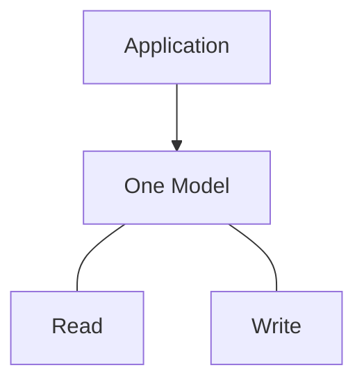

CQRS separates them:

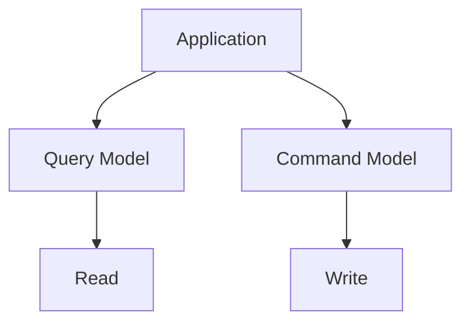

The read side is optimized for:

> **Getting information.**

The write side is optimized for:

> **Changing state safely.**

---

# 2. Command vs Query

The distinction comes from a simple rule.

### Command

A **command** asks the system to perform an action.

Examples:

```text
CreateOrder
CancelOrder
ReserveInventory
ChangeAddress
ApproveRefund
```

A command changes state.

### Query

A **query** asks for information.

Examples:

```text
GetOrder
ListOrders
SearchProducts
GetCustomerProfile
GetOrderHistory
```

A query should not intentionally change business state.

Mental model:

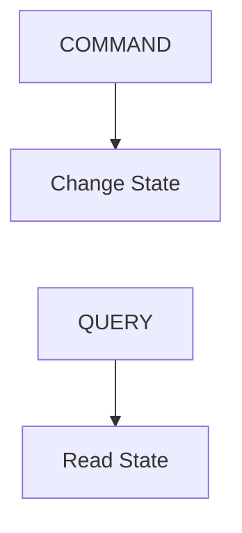

---

# 3. Why Separate Them?

Imagine an e-commerce system.

The write model may need to carefully enforce:

```text
Inventory rules
Payment rules
Order invariants
Authorization
Transactions
```

But the customer-facing order history may need:

```text
Order number
Product names
Images
Prices
Shipment status
Payment status
```

The read requirements can be very different from the write requirements.

Trying to make one database model serve both perfectly can create unnecessary complexity.

CQRS says:

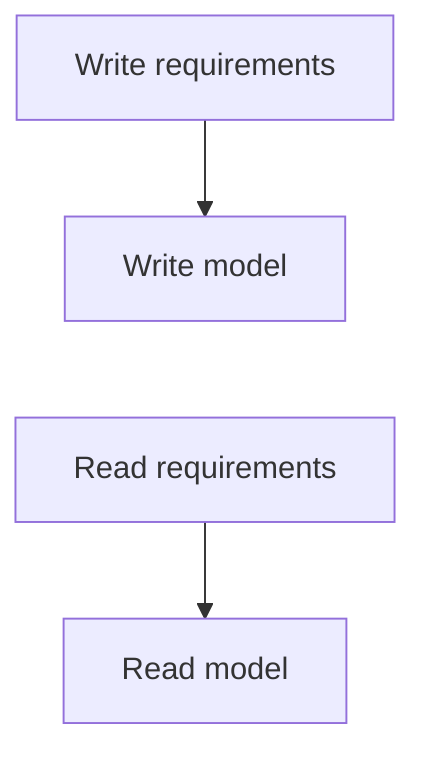

---

# 4. Traditional CRUD

A simple application might use:

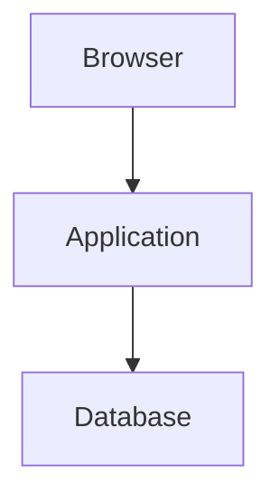

Both reads and writes use the same model:

```text
Users Table
Orders Table
Products Table
```

For many applications, this is completely appropriate.

For example:

```text
GET /products/42
```

and:

```text
POST /products
```

can both use the same database.

You do **not** need CQRS merely because an application has both reads and writes.

---

# 5. Basic CQRS Architecture

A simplified CQRS system looks like:

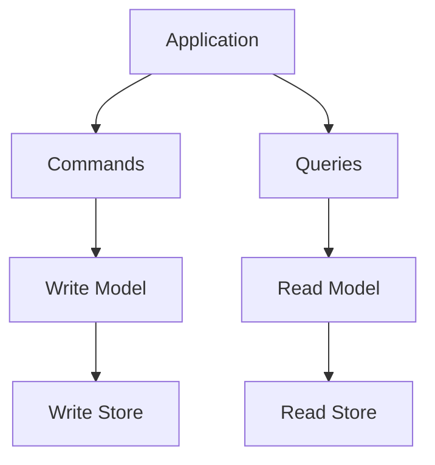

The two models may use:

```text
Same database
```

or:

```text
Different databases
```

This distinction is important.

> **CQRS does not require separate databases.**

It is primarily a separation of responsibilities and models.

---

# 6. CQRS With One Database

The simplest form can be:

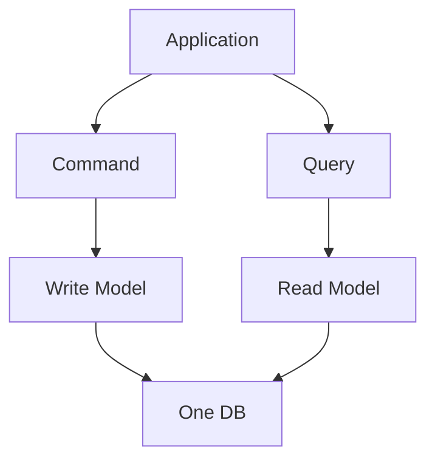

The write and read models are logically separated, even though they share storage.

For example:

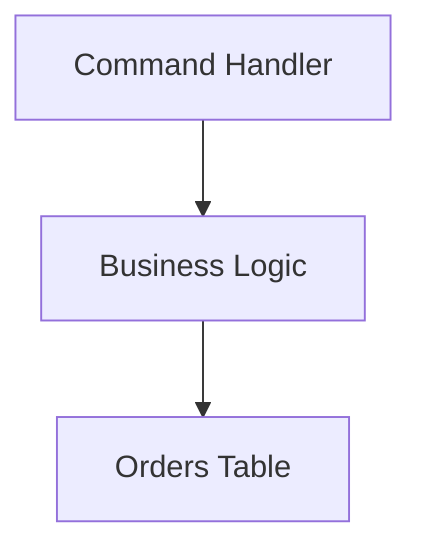

while:

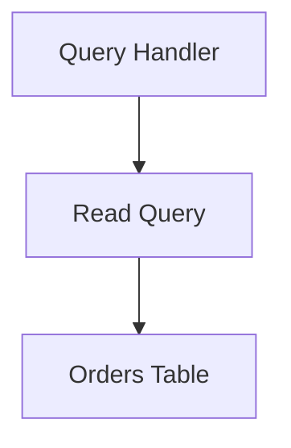

This can provide some CQRS benefits without introducing distributed infrastructure.

---

# 7. CQRS With Separate Stores

At larger scale, the read and write sides may use separate storage:

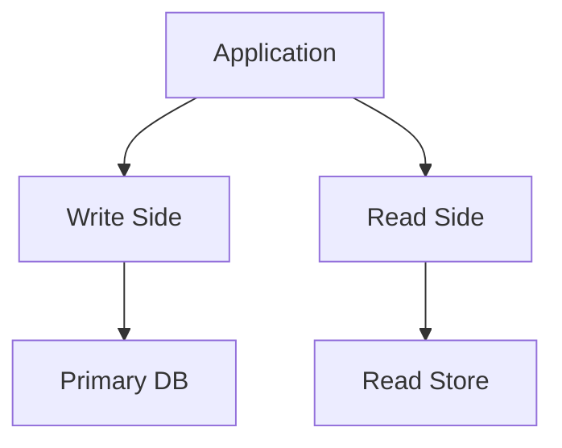

For example:

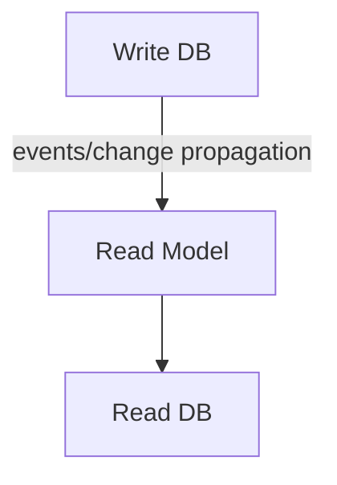

Now the read side can be designed specifically for query performance.

This is where CQRS becomes more architecturally significant.

---

# 8. Why Would the Read Model Be Different?

Suppose the write model looks like:

```text
orders
order_items
products
customers
payments
shipments
```

This may be a good normalized representation for maintaining correctness.

But the order-history page might need:

```text
Order #
Customer
Product names
Total
Payment status
Shipment status
Created date
```

A read model could store:

```text
order_history_view
────────────────────────
order_id
customer_name
product_names
total
payment_status
shipment_status
created_at
```

Now the read operation may require fewer joins.

The read model is shaped around:

> **How the application needs to read the data.**

---

# 9. Synchronous CQRS

CQRS does not automatically mean asynchronous processing.

A synchronous implementation could be:

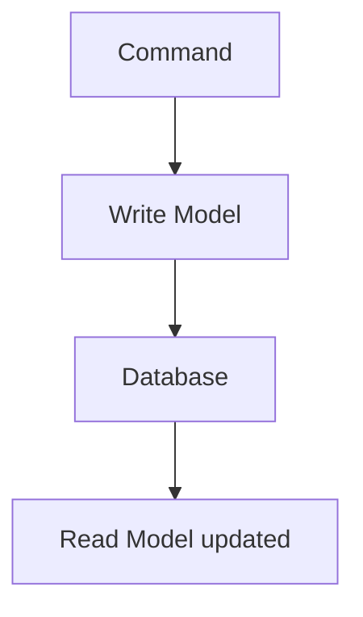

The application may update both sides during the same request or through tightly controlled processing.

The exact implementation varies.

The important point:

> **CQRS is about separating command and query responsibilities, not about requiring asynchronous messaging.**

---

# 10. Asynchronous CQRS

A more distributed architecture may use events:

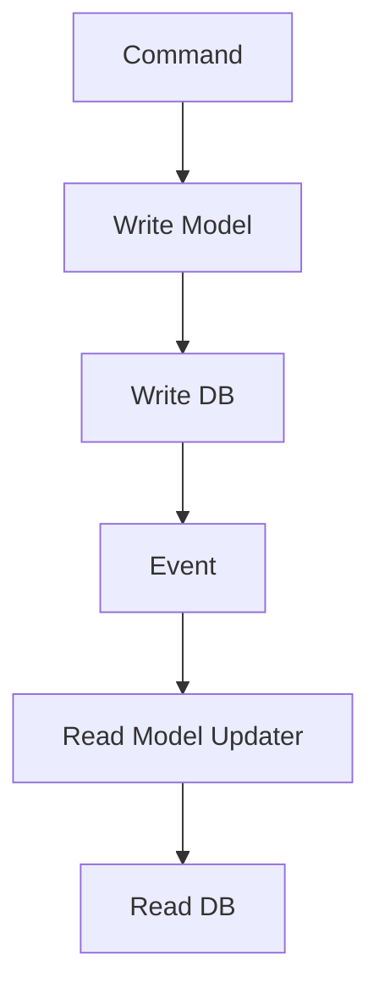

For example:

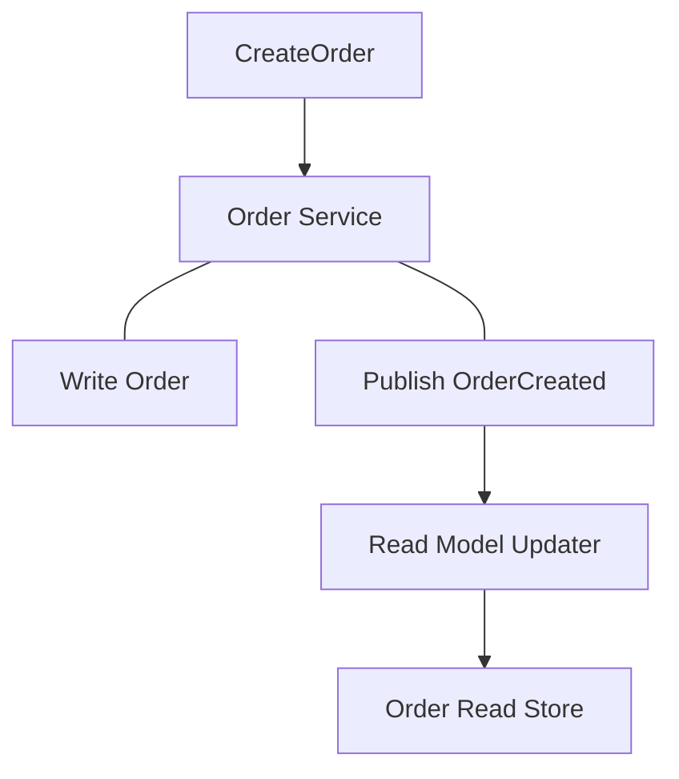

This allows the read model to evolve independently.

But it introduces eventual consistency.

---

# 11. Eventual Consistency

Suppose:

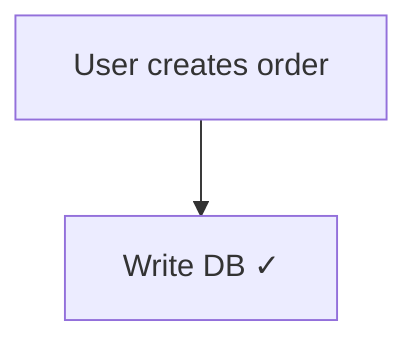

The read model has not updated yet:

```text
Write DB = Order 123 exists
Read DB  = Order 123 not visible yet
```

For a short period:

```text
Write Side ≠ Read Side
```

Later:

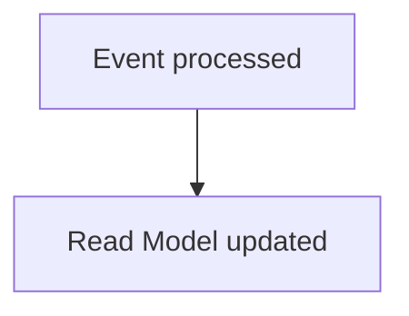

Now:

```text
Write Side = Read Side
```

Therefore:

> **Asynchronous CQRS commonly introduces eventual consistency between the write and read models.**

The business must tolerate that delay.

---

# 12. Read-After-Write Problem

Suppose a customer creates an order and immediately visits:

```text
GET /orders/123
```

The command succeeded:

```text
Create Order ✓
```

But the read model is still catching up:

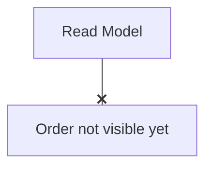

The customer may see:

```text
"Order not found"
```

even though the order was successfully created.

This is a classic CQRS consistency issue.

Possible approaches include:

- read from the write side for critical immediate reads,
- route the user temporarily to an authoritative source,
- track version/sequence information,
- wait until the read model catches up,
- design the UI around processing states.

The right solution depends on the requirement.

---

# 13. CQRS and Events

Events are commonly used to update read models.

For example:

```text
OrderCreated
OrderPaid
OrderShipped
OrderCancelled
```

The read side consumes these events:

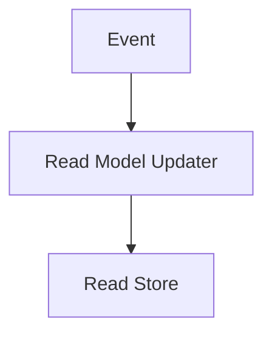

The events describe changes that the read model needs to understand.

But:

> **CQRS does not require event-driven architecture.**

Events are one implementation technique.

---

# 14. CQRS and the Outbox Pattern

If the write side needs to reliably publish events, the Outbox Pattern from **07.15** can help.

For example:

```text
BEGIN
   Create Order
   Insert OrderCreated into Outbox
COMMIT
```

Then:

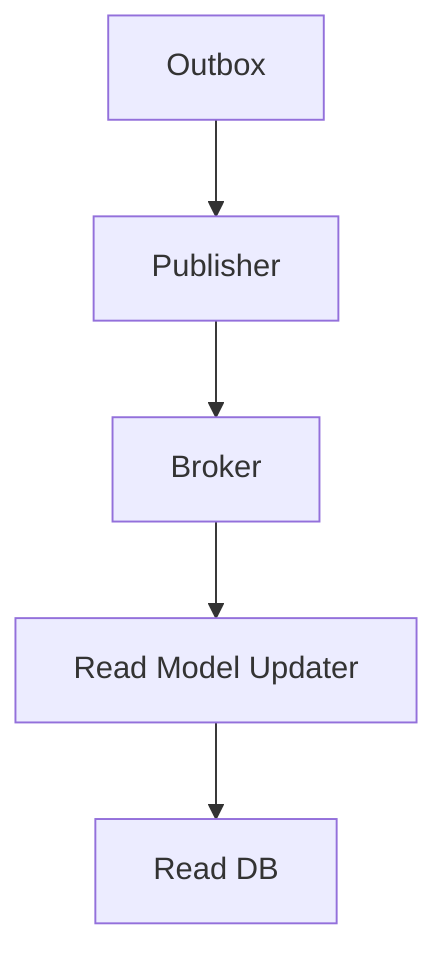

This gives a reliable path from:

```text
Write state
```

to:

```text
Read model update
```

without requiring one distributed transaction.

---

# 15. CQRS Does Not Mean Two Applications

You do not necessarily need:

```text
Application A
Application B
```

CQRS can exist inside one application:

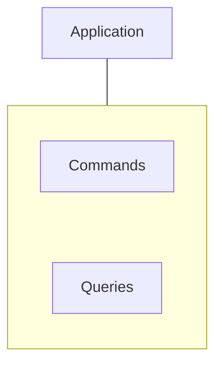

Or it can become more distributed:

```mermaid
flowchart TD
  accTitle: Distributed CQRS
  accDescr: A command service uses the write DB; a query service uses the read DB.
  A0["Command Service"] --> B0["Write DB"]
  A1["Query Service"] --> B1["Read DB"]
  B0 ~~~ A1
```

The architecture should match the requirement.

---

# 16. CQRS vs Read Replicas

These concepts are often confused.

### Read Replica

Copies the database's data:

```mermaid
flowchart TD
  accTitle: A read replica
  accDescr: Primary DB, then Read Replica.
  N0["Primary DB"] --> N1["Read Replica"]
```

The replica generally represents the same database model.

### CQRS Read Model

Can have a **different data shape** optimized for specific queries:

```mermaid
flowchart TD
  accTitle: A CQRS read model
  accDescr: Write Model, then Transformation, then Read Model.
  N0["Write Model"] --> N1["Transformation"] --> N2["Read Model"]
```

For example:

```mermaid
flowchart TD
  accTitle: A different data shape
  accDescr: Normalized write schema, then Denormalized order-history read model.
  N0["Normalized write schema"] --> N1["Denormalized order-history read model"]
```

Therefore:

> **A read replica copies the database model; a CQRS read model is designed around read requirements.**

They can also be combined.

---

# 17. CQRS vs Caching

A cache stores data temporarily to avoid repeated computation or database access.

```mermaid
flowchart TD
  accTitle: A cache
  accDescr: A request checks the cache: a hit returns, a miss goes to the database.
  N0["Request"] --> N1["Cache"]
  N1 -->|"Hit"| H["Return"]
  N1 -->|"Miss"| M["Database"]
```

CQRS creates a separate model for reading:

```mermaid
flowchart TD
  accTitle: A separate read model
  accDescr: Write Model, then Read Model.
  N0["Write Model"] --> N1["Read Model"]
```

A CQRS read model is usually treated as a durable representation of read-oriented state, not merely a temporary cache.

You may still put a cache in front of a CQRS read model.

```mermaid
flowchart TD
  accTitle: A cache in front of the read model
  accDescr: Client, then Cache, then CQRS Read Store.
  N0["Client"] --> N1["Cache"] --> N2["CQRS Read Store"]
```

---

# 18. CQRS vs Event Sourcing

Another common confusion:

```text
CQRS ≠ Event Sourcing
```

### CQRS

Separates:

```text
Commands
```

from:

```text
Queries
```

### Event Sourcing

Stores state changes as events:

```text
OrderCreated
OrderPaid
OrderShipped
```

and can reconstruct state from those events.

You can have:

```text
CQRS without Event Sourcing
```

and:

```text
Event Sourcing without full CQRS
```

They are often combined, but neither requires the other.

Event Sourcing is covered in:

**07.17 — Event Sourcing**

---

# 19. CQRS and Business Rules

The command side is where state changes should be validated.

For example:

```mermaid
flowchart TD
  accTitle: The command side enforces rules
  accDescr: Cancel order: can this order be cancelled? Yes: cancel. No: reject.
  C["Cancel Order"] --> Q{"Can this order be cancelled?"}
  Q -->|"YES"| Y["Cancel"]
  Q -->|"NO"| N["Reject"]
```

The command model protects business invariants.

The query model should generally not become another place where business state is independently modified.

This separation can make responsibilities clearer.

---

# 20. Command Handlers

A command handler receives a command and performs the required business operation.

Conceptually:

```mermaid
flowchart TD
  accTitle: A command handler
  accDescr: A command reaches the command handler, which validates, authorizes, executes business rules, updates state and records an event.
  C["Command"] --> H["Command Handler"] --- G
  subgraph G[" "]
    direction TB
    I0["Validate"] ~~~ I1["Authorize"] ~~~ I2["Execute Business Rules"] ~~~ I3["Update State"] ~~~ I4["Record Event"]
  end
```

For example:

```text
CreateOrder
```

may result in:

```text
OrderCreated
```

The command itself is an instruction.

The resulting event represents something that happened.

---

# 21. Query Handlers

A query handler retrieves data.

For example:

```mermaid
flowchart TD
  accTitle: A query handler
  accDescr: GetOrderHistory, then Query Handler, then Read Model, then Result.
  N0["GetOrderHistory"] --> N1["Query Handler"] --> N2["Read Model"] --> N3["Result"]
```

It does not need to reconstruct the complete domain model if the read model already contains the required representation.

This can simplify read-heavy APIs.

---

# 22. Query-Specific Read Models

Different screens may need different representations.

For example:

```mermaid
flowchart TD
  accTitle: Query-specific read models
  accDescr: The customer dashboard, admin dashboard and analytics each get their own view.
  A0["Customer Dashboard"] --> B0["CustomerDashboardView"]
  A1["Admin Dashboard"] --> B1["AdminOrderView"]
  A2["Analytics"] --> B2["OrderAnalyticsView"]
  B0 ~~~ A1
  B1 ~~~ A2
```

Instead of forcing one universal model to satisfy every query:

```mermaid
flowchart TD
  accTitle: One universal model
  accDescr: One Huge Model, then Everything.
  N0["One Huge Model"] --> N1["Everything"]
```

CQRS allows specialized read models.

This is sometimes called **polyglot read modeling** when different storage technologies are used for different read needs.

---

# 23. Multiple Read Models

A single write model can feed multiple read models:

```mermaid
flowchart TD
  accTitle: Multiple read models
  accDescr: The write model emits events that feed customer, admin and analytics read models.
  N0["Write Model"] --> N1["Events"] --> G
  subgraph G[" "]
    direction TB
    I0["Customer Read Model"] ~~~ I1["Admin Read Model"] ~~~ I2["Analytics Read Model"]
  end
```

For example:

```text
Customer View
→ optimized for customer-facing queries

Admin View
→ optimized for operational queries

Analytics View
→ optimized for aggregation
```

This is powerful.

But every additional read model introduces:

- synchronization work,
- storage,
- processing,
- monitoring,
- schema evolution,
- recovery requirements.

---

# 24. Read Model Rebuilding

Suppose the read model becomes corrupted.

If the source of truth remains available:

```mermaid
flowchart TD
  accTitle: Rebuilding a read model
  accDescr: Write State, then Rebuild Process, then Read Model.
  N0["Write State"] --> N1["Rebuild Process"] --> N2["Read Model"]
```

The system may be able to reconstruct the read model.

This is one reason event history or reliable source data can be valuable.

However, rebuilding depends on what information is retained and how the read model is constructed.

---

# 25. Read Model Lag

In asynchronous CQRS, measure:

```mermaid
flowchart TD
  accTitle: Measuring lag
  accDescr: Write Event Time, then Read Model Update Time.
  N0["Write Event Time"] --> N1["Read Model Update Time"]
```

The difference is:

```text
Read Model Lag
```

For example:

```mermaid
flowchart TD
  accTitle: Read model lag
  accDescr: The read model updates 150 ms after OrderCreated.
  N0["OrderCreated"] -->|"150 ms"| N1["Read Model Updated"]
```

Under load:

```text
150 ms
→ 500 ms
→ 2 sec
→ 30 sec
```

Large lag can become a user-visible problem.

Therefore:

> **If the read model is asynchronous, its freshness is an operational property that should be monitored.**

---

# 26. Read Model Failure

Suppose:

```text
Write DB ✓
Broker ✓
Read Model Updater ✗
```

The write side may continue functioning.

But:

```mermaid
flowchart TD
  accTitle: A stale read model
  accDescr: Read Model, then Stale.
  N0["Read Model"] --> N1["Stale"]
```

This can be an advantage:

```mermaid
flowchart TD
  accTitle: Independent sides
  accDescr: Read-side failure, then Write-side may continue.
  N0["Read-side failure"] --> N1["Write-side may continue"]
```

But eventually:

```mermaid
flowchart TD
  accTitle: Growing lag
  accDescr: Read Model Lag, then Growing, then User-visible stale data.
  N0["Read Model Lag"] --> N1["Growing"] --> N2["User-visible stale data"]
```

The system needs:

- monitoring,
- retry,
- recovery,
- replay/rebuild where appropriate.

---

# 27. Write Model Scaling

CQRS does not automatically solve write scaling.

Suppose:

```text
Write workload = 10,000 commands/sec
```

The write side can still become the bottleneck.

You may need:

- database optimization,
- partitioning,
- sharding,
- batching,
- asynchronous processing,
- domain-specific scaling.

CQRS primarily allows the read side and write side to evolve independently.

---

# 28. Read Scaling

Suppose:

```text
Reads = 100,000/sec
Writes = 1,000/sec
```

A specialized read model may allow:

```mermaid
flowchart TD
  accTitle: Scaling reads
  accDescr: The write DB emits events into read DB A and read DB B.
  W["Write DB"] --> E["Events"] --> A["Read DB A"] & B["Read DB B"]
```

The read side can scale independently.

This is one of the strongest practical motivations for CQRS in read-heavy systems.

---

# 29. CQRS and Consistency

The central trade-off is often:

```mermaid
flowchart TD
  accTitle: The central trade-off
  accDescr: Independent Read Model, then Better read optimization, then Possible synchronization delay.
  N0["Independent Read Model"] --> N1["Better read optimization"] --> N2["Possible synchronization delay"]
```

So ask:

```text
Can the user tolerate stale data?

How stale can it be?

Which operations require immediate consistency?

Can critical reads use the authoritative write side?
```

Not every read needs the same freshness.

For example:

```text
Product recommendations
→ stale for a few seconds may be acceptable

Account balance
→ stale data may be unacceptable
```

CQRS should follow business consistency requirements.

---

# 30. CQRS Does Not Mean "Never Read the Write Database"

Sometimes the authoritative write store is the correct place to read from.

For example:

```text
Immediately after:
Change Password
```

you may want:

```text
GET current security settings
```

from authoritative state.

A read model can be excellent for:

```text
Search
Dashboard
History
Reporting
```

while critical consistency-sensitive operations may require another path.

---

# 31. CQRS and Authorization

Separating reads and writes does not remove authorization requirements.

Commands need:

```text
Can this user perform this action?
```

Queries need:

```text
Can this user see this data?
```

For example:

```mermaid
flowchart TD
  accTitle: Queries need authorization
  accDescr: Admin Query, then Can user access admin data?, then YES / NO.
  N0["Admin Query"] --> N1["Can user access admin data?"] --> N2["YES / NO"]
```

Do not assume:

> "It's only a query, so it is safe."

Read access can expose sensitive information.

---

# 32. When CQRS Makes Sense

CQRS becomes attractive when:

### 1. Read and write workloads differ significantly

```text
100,000 reads
1,000 writes
```

### 2. Read and write models have very different shapes

```mermaid
flowchart TD
  accTitle: Different shapes
  accDescr: Normalized writes, then Denormalized reads.
  N0["Normalized writes"] --> N1["Denormalized reads"]
```

### 3. Read performance needs specialized optimization

For example:

```text
Search
Dashboards
Complex reporting
Large query workloads
```

### 4. Multiple read representations are useful

```text
Customer View
Admin View
Analytics View
```

### 5. The domain has complex write rules

The command side can protect business invariants independently from read concerns.

### 6. Event-driven architecture already exists

CQRS can naturally integrate with events and asynchronous processing.

---

# 33. When CQRS Does Not Make Sense

Avoid CQRS when:

- the application is simple CRUD,
- read and write models are naturally similar,
- traffic does not require separate scaling,
- consistency must be immediate everywhere,
- the team does not need the additional architecture,
- operational complexity would outweigh the benefit.

For example:

```mermaid
flowchart TD
  accTitle: A simple app
  accDescr: Small Admin CRUD App, then One Database, then Simple Queries.
  N0["Small Admin CRUD App"] --> N1["One Database"] --> N2["Simple Queries"]
```

Adding:

```text
Events
Broker
Read Store
Projection Service
```

would probably be unnecessary.

---

# 34. CQRS Complexity

A simple CRUD system:

```mermaid
flowchart TD
  accTitle: Simple CRUD
  accDescr: Application, then Database.
  N0["Application"] --> N1["Database"]
```

CQRS can become:

```mermaid
flowchart TD
  accTitle: CQRS complexity
  accDescr: Command, then Write Service, then Write DB, then Event, then Broker, then Read Updater, then Read DB, then Query.
  N0["Command"] --> N1["Write Service"] --> N2["Write DB"] --> N3["Event"] --> N4["Broker"] --> N5["Read Updater"] --> N6["Read DB"] --> N7["Query"]
```

Now you have additional components and failure modes.

For example:

```text
Broker unavailable
Read model lag
Duplicate events
Projection failure
Read model corruption
Rebuild complexity
Schema evolution
```

Therefore:

> **CQRS is an architectural trade-off, not a default best practice.**

---

# 35. CQRS Decision Framework

Before introducing CQRS, ask:

```mermaid
flowchart TD
  accTitle: CQRS decision framework
  accDescr: 1. Are reads and writes genuinely different?, then 2. Do they need different models?, then 3. Do they need independent scaling?, then 4. Is read-model lag acceptable?, then 5. Would denormalized/specialized reads provide real value?, then 6. Can the team operate the additional infrastructure?, then 7. Can ordinary CRUD or a read replica solve the problem?, then 8. What is the smallest CQRS design that provides the benefit?.
  N0["1#46; Are reads and writes genuinely different?"] --> N1["2#46; Do they need different models?"] --> N2["3#46; Do they need independent scaling?"] --> N3["4#46; Is read-model lag acceptable?"] --> N4["5#46; Would denormalized/specialized reads provide real value?"] --> N5["6#46; Can the team operate the additional infrastructure?"] --> N6["7#46; Can ordinary CRUD or a read replica solve the problem?"] --> N7["8#46; What is the smallest CQRS design that provides the benefit?"]
```

Possible outcomes:

```mermaid
flowchart TD
  accTitle: Stay CRUD
  accDescr: Simple CRUD, then Stay CRUD.
  N0["Simple CRUD"] --> N1["Stay CRUD"]
```

or:

```mermaid
flowchart TD
  accTitle: Maybe a replica or cache
  accDescr: CRUD + optimized queries, then Maybe read replica/cache.
  N0["CRUD + optimized queries"] --> N1["Maybe read replica/cache"]
```

or:

```mermaid
flowchart TD
  accTitle: CQRS
  accDescr: Different read/write models, then CQRS.
  N0["Different read/write models"] --> N1["CQRS"]
```

---

# 36. Example: E-Commerce Order History

Suppose an e-commerce platform has:

```text
5 million customers
50 million orders
```

The write model needs:

```text
Order invariants
Payment state
Inventory state
Transaction safety
```

The customer-facing order history needs:

```text
Order ID
Date
Products
Total
Payment status
Shipment status
```

A CQRS architecture could be:

```mermaid
flowchart TD
  accTitle: An order-history CQRS architecture
  accDescr: Order Commands, then Order Service, then Write DB, then Outbox, then Events, then Order Read Updater, then Read Database, then Order History Query.
  N0["Order Commands"] --> N1["Order Service"] --> N2["Write DB"] --> N3["Outbox"] --> N4["Events"] --> N5["Order Read Updater"] --> N6["Read Database"] --> N7["Order History Query"]
```

The write model remains focused on correctness.

The read model is shaped specifically for customer queries.

---

# 37. Hands-On Exercise

## Build a Small CQRS Model

Use an `orders` example.

## Step 1 — Define commands

```text
CreateOrder
CancelOrder
ConfirmOrder
```

## Step 2 — Define queries

```text
GetOrder
GetCustomerOrders
GetOrderHistory
```

## Step 3 — Define the write model

```text
orders
order_items
payments
```

Ask:

```text
What business rules must the write side enforce?
```

## Step 4 — Design a read model

For customer order history:

```text
order_history
────────────────────────
order_id
customer_id
product_names
total
payment_status
shipment_status
created_at
```

## Step 5 — Connect them

Conceptually:

```mermaid
flowchart TD
  accTitle: Connecting the models
  accDescr: Command, then Write DB, then OrderCreated, then Read Model Updater, then Read DB.
  N0["Command"] --> N1["Write DB"] --> N2["OrderCreated"] --> N3["Read Model Updater"] --> N4["Read DB"]
```

## Step 6 — Simulate lag

Delay the read-model updater.

Observe:

```mermaid
flowchart TD
  accTitle: Simulated lag
  accDescr: Write DB: order exists. Read DB: order not visible yet.
  A0["Write DB"] --> B0["Order exists"]
  A1["Read DB"] --> B1["Order not visible yet"]
  B0 ~~~ A1
```

Then process the event.

Observe:

```mermaid
flowchart TD
  accTitle: Caught up
  accDescr: Read DB, then Order appears.
  N0["Read DB"] --> N1["Order appears"]
```

## Step 7 — Answer

1. Which data must be immediately consistent?
2. Which data can tolerate delay?
3. What happens if the read updater crashes?
4. How would you rebuild the read model?
5. Could a read replica solve the problem instead?
6. Does CQRS actually provide enough benefit to justify the extra complexity?

---

# 38. Common Mistakes

### Mistake 1 — Thinking CQRS means two databases

It does not.

---

### Mistake 2 — Thinking CQRS requires asynchronous events

It does not.

---

### Mistake 3 — Confusing CQRS with Event Sourcing

They are separate patterns that can be combined.

---

### Mistake 4 — Calling a cache a CQRS read model

A cache is usually temporary acceleration; a read model is a deliberately maintained representation for queries.

---

### Mistake 5 — Assuming read replicas are CQRS

A replica usually preserves the same database model.

CQRS can use a different model.

---

### Mistake 6 — Ignoring read-model lag

Asynchronous CQRS commonly introduces eventual consistency.

---

### Mistake 7 — Forgetting duplicate events

Event-driven read-model updates must often be idempotent.

---

### Mistake 8 — Creating too many read models

Every read model adds storage, synchronization, monitoring, and maintenance.

---

### Mistake 9 — Using CQRS for simple CRUD

Complexity should have a measurable reason.

---

### Mistake 10 — Assuming CQRS solves write scaling

It primarily separates read and write concerns. The write side can still be the bottleneck.

---

# 39. CQRS vs Related Patterns

| Concept | Main Purpose |
|---|---|
| **CRUD** | Simple shared model for reading and writing |
| **CQRS** | Separate command and query responsibilities/models |
| **Read Replica** | Scale reads using copies of the same database model |
| **Cache** | Temporarily avoid repeated expensive reads/computation |
| **Outbox** | Reliably connect local DB changes with event publication |
| **Saga** | Coordinate multi-step business workflows |
| **Event Sourcing** | Store state changes as events |
| **Materialized View** | Precomputed representation optimized for queries |

These can be combined.

For example:

```text
CQRS
 +
Outbox
 +
Events
 +
Read Model
 +
Cache
```

But each solves a different problem.

---

# 40. Key Principle

> **CQRS separates the responsibilities of changing state and reading state so each side can use the model and scaling strategy that best fits its workload.**

But:

> **CQRS is not automatically better than CRUD.**

Use it when:

```text
Read requirements
       ≠
Write requirements
```

in a way that creates meaningful architectural value.

If the application is simple:

```text
One model
One database
CRUD
```

may be the better design.

If the system has:

```text
Complex writes
+
Very different read models
+
High read scale
+
Specialized queries
```

CQRS may provide significant benefits.

---

# 41. Quick Reference

| Concept | Meaning |
|---|---|
| CQRS | Command Query Responsibility Segregation |
| Command | Instruction that changes system state |
| Query | Request for information without intentionally changing state |
| Command Model | Model responsible for processing state changes |
| Read Model | Representation optimized for querying |
| Write Model | Representation optimized for state changes/business rules |
| Projection | Process that builds or updates a read model from source changes |
| Read Model Lag | Delay between source-state change and read-model update |
| Denormalization | Combining/repeating data to optimize access |
| Eventual Consistency | Read model may temporarily lag behind authoritative state |
| Read Replica | Copy of a database used to serve reads |
| Materialized View | Precomputed query-oriented representation |
| Event Sourcing | Storing state changes as events |

---

# 42. Knowledge Check

### Question 1

What does CQRS stand for?

**Command Query Responsibility Segregation.**

---

### Question 2

What is the fundamental idea behind CQRS?

Separate the responsibilities and models used for changing state from those used for reading state.

---

### Question 3

Does CQRS require separate databases?

**No.**

The read and write models can share one database.

---

### Question 4

Does CQRS require asynchronous processing?

**No.**

CQRS can be implemented synchronously or asynchronously.

---

### Question 5

What problem can asynchronous CQRS introduce?

The read model can temporarily lag behind the write model, creating eventual consistency.

---

### Question 6

How is CQRS different from a read replica?

A read replica usually contains a copy of the same database model. CQRS can use a differently shaped read model optimized for particular queries.

---

### Question 7

How is CQRS different from caching?

A cache is primarily a temporary performance mechanism. A CQRS read model is a deliberately maintained representation designed for reading.

---

### Question 8

Is CQRS the same as Event Sourcing?

**No.**

They are separate patterns that can be combined.

---

### Question 9

When might CQRS be unnecessary?

When the application is simple CRUD, read/write requirements are similar, immediate consistency is required everywhere, and the additional architecture provides little measurable benefit.

---

### Question 10

What should you ask before introducing CQRS?

> **Are the read and write requirements different enough that separate models provide more value than the complexity they introduce?**

---

# Remember

CQRS is not:

```text
"Always use two databases."
```

It is:

```mermaid
flowchart TD
  accTitle: What CQRS is
  accDescr: Different read requirements + Different write requirements, then Separate responsibilities/models.
  N0["Different read requirements<br/>+<br/>Different write requirements"] --> N1["Separate responsibilities/models"]
```

A simple system may remain:

```mermaid
flowchart TD
  accTitle: A simple system
  accDescr: Application, then One Model, then One Database.
  N0["Application"] --> N1["One Model"] --> N2["One Database"]
```

A more demanding system may evolve toward:

```mermaid
flowchart TD
  accTitle: A more demanding system
  accDescr: Commands, then Write Model, then Write DB, then Events, then Read Model, then Read DB, then Queries.
  N0["Commands"] --> N1["Write Model"] --> N2["Write DB"] --> N3["Events"] --> N4["Read Model"] --> N5["Read DB"] --> N6["Queries"]
```

The deeper lesson is:

> **Separate read and write architecture only when the difference between reading and writing creates a real system constraint or a meaningful design benefit.**

**Next: 07.17 — Event Sourcing**
