# 07.17 — Event Sourcing

## Learning Objectives

By the end of this chapter, you should be able to:

- Understand what **Event Sourcing** is.
- Distinguish between storing **current state** and storing **state-changing events**.
- Understand how current state can be rebuilt by replaying events.
- Understand event streams, ordering, sequence numbers, and immutability.
- Understand snapshots and why they are useful.
- Understand event versioning and schema evolution.
- Distinguish Event Sourcing from CQRS, Outbox, and audit logging.
- Recognize the operational costs and situations where Event Sourcing is or is not appropriate.

---

# 1. What Is Event Sourcing?

In a traditional application, we usually store the **current state**.

For example:

```text
orders

id     status       total
────────────────────────────
101    shipped      ₹2,500
```

The database tells us:

> "Order 101 is currently shipped."

But it may not directly tell us the complete sequence of business changes that produced that state.

With **Event Sourcing**, the system stores the sequence of meaningful state-changing events.

For example:

```text
OrderCreated
ItemAdded
PaymentAuthorized
OrderPacked
OrderShipped
```

The current state is derived from those events.

> **Event Sourcing stores the history of meaningful state changes as an ordered sequence of immutable events and derives the current state by replaying those events.**

Conceptually:

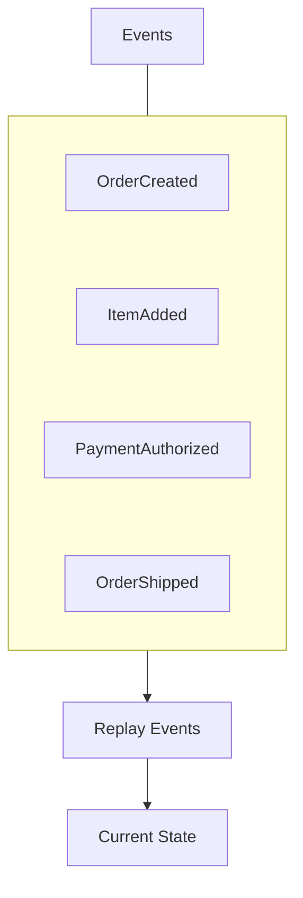

---

# 2. Current State vs Event History

### Traditional state storage

```text
Database

Order 101
status = shipped
total  = ₹2,500
```

You primarily store:

```text
What is true now?
```

### Event Sourcing

```text
Event Store

1. OrderCreated
2. ItemAdded
3. PaymentAuthorized
4. OrderShipped
```

You store:

```text
What happened?
```

and derive:

```text
What is true now?
```

This is the fundamental difference.

---

# 3. A Simple Analogy

Imagine a bank account.

Traditional approach:

```text
Current Balance = ₹8,000
```

Event-sourced approach:

```text
Deposit ₹10,000
Withdraw ₹2,000
```

Replay:

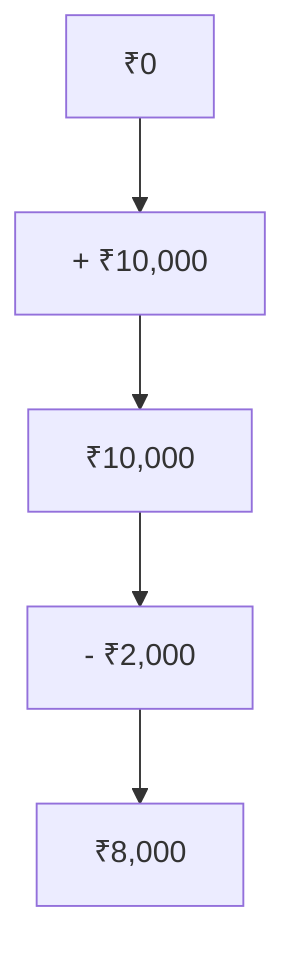

The events provide the history from which the current balance can be reconstructed.

---

# 4. Events Represent Facts

An event should normally describe something that **already happened**.

Examples:

```text
OrderCreated
PaymentAuthorized
ItemAddedToCart
OrderShipped
UserRegistered
```

These are facts.

Compare:

```text
AuthorizePayment
```

This sounds like a command:

> "Please authorize the payment."

Whereas:

```text
PaymentAuthorized
```

means:

> "The payment was authorized."

This distinction matters.

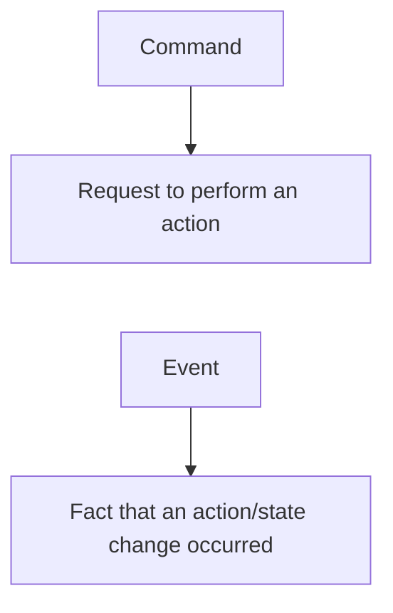

---

# 5. Event Sourcing Is Not "Save Every Database Update"

This is an important distinction.

You should not simply convert:

```sql
UPDATE orders
SET status = 'shipped';
```

into:

```text
DatabaseUpdated
```

and call that Event Sourcing.

Useful domain events describe meaningful business facts:

```text
OrderShipped
```

rather than low-level implementation details such as:

```text
orders.status changed from 4 to 5
```

The event should represent something meaningful to the domain.

---

# 6. Event Stream

Events are usually associated with a particular entity or **aggregate**.

For example:

```text
Order 101
────────────────────────────

1 → OrderCreated
2 → ItemAdded
3 → PaymentAuthorized
4 → OrderPacked
5 → OrderShipped
```

This sequence is an **event stream** for that order.

Another order has its own stream:

```text
Order 102
────────────────────────────

1 → OrderCreated
2 → ItemAdded
3 → OrderCancelled
```

A useful mental model is:

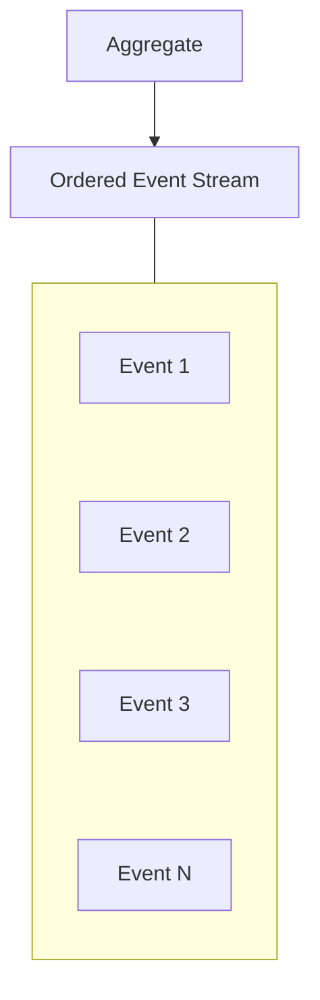

---

# 7. Event IDs and Sequence Numbers

Events should have enough metadata to identify and order them.

A conceptual event might contain:

```json
{
  "eventId": "evt_123",
  "aggregateId": "order_101",
  "sequence": 4,
  "type": "OrderShipped",
  "occurredAt": "2026-09-30T10:30:00Z",
  "data": {
    "carrier": "..."
  }
}
```

Important fields can include:

- Event ID
- Aggregate/entity ID
- Event type
- Sequence number
- Timestamp
- Event payload
- Schema/version information

The exact structure depends on the implementation.

---

# 8. Ordering Matters

Suppose:

```text
OrderCreated
```

happens before:

```text
OrderShipped
```

The system must preserve the relevant ordering.

Correct:

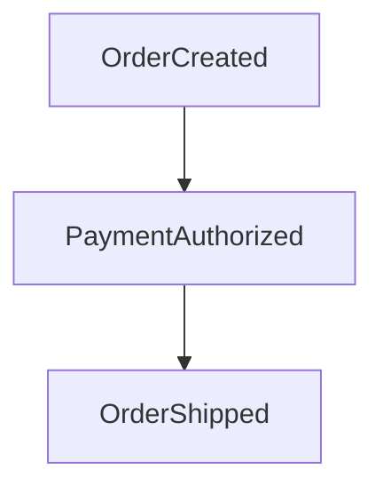

Incorrect:

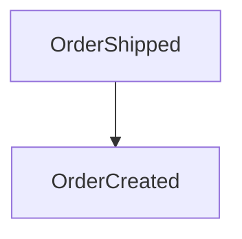

For a particular event stream, a monotonically increasing sequence number can help detect missing or out-of-order events.

For example:

```text
1
2
3
4
```

If the consumer receives:

```text
1
2
4
```

it knows that something is missing.

---

# 9. Events Are Immutable

An event represents a fact about the past.

Once recorded:

```text
PaymentAuthorized
```

you generally do not edit it into:

```text
PaymentFailed
```

Instead, a new event represents the correction or subsequent fact.

For example:

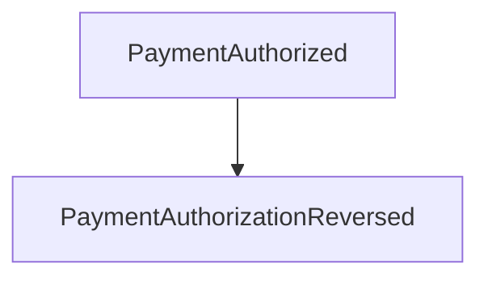

The history remains visible.

This is one of the defining properties of Event Sourcing:

> **Past events are treated as immutable facts; corrections are represented by new events.**

---

# 10. Rebuilding State

Suppose the event stream is:

```text
1. OrderCreated
2. ItemAdded
3. PaymentAuthorized
4. OrderShipped
```

The system can replay them:

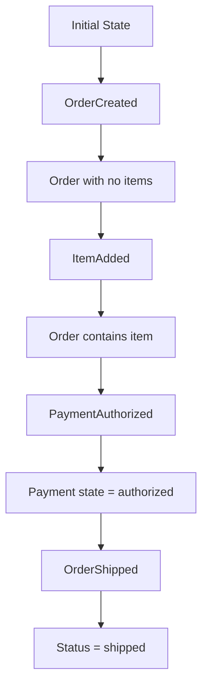

The final state is derived from the complete event history.

Conceptually:

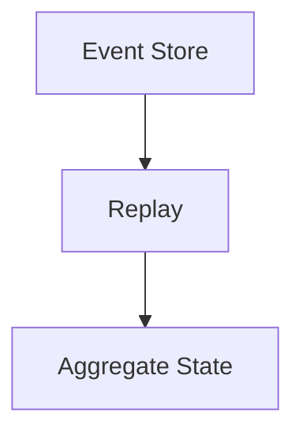

---

# 11. Why Replay Is Powerful

Suppose your original application only needed:

```text
Current order status
```

Later you want:

```text
Total order value over time
```

or:

```text
When did the order become paid?
```

or:

```text
How long did payment take?
```

If the required information exists in the event history, you can potentially derive new views from the existing events.

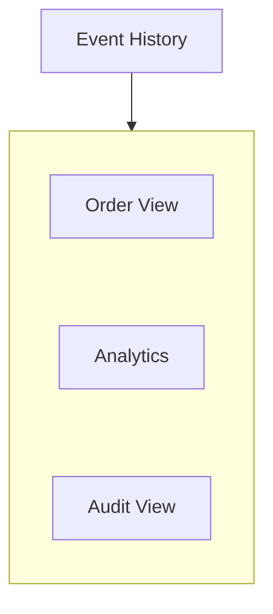

This is one reason Event Sourcing can be attractive for systems with rich historical requirements.

---

# 12. Projections

A **projection** is a derived representation built from events.

For example:

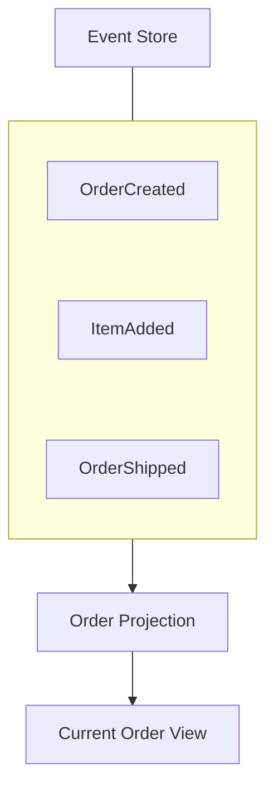

Another projection could produce:

```text
Daily Sales
```

and another:

```text
Customer Order History
```

So:

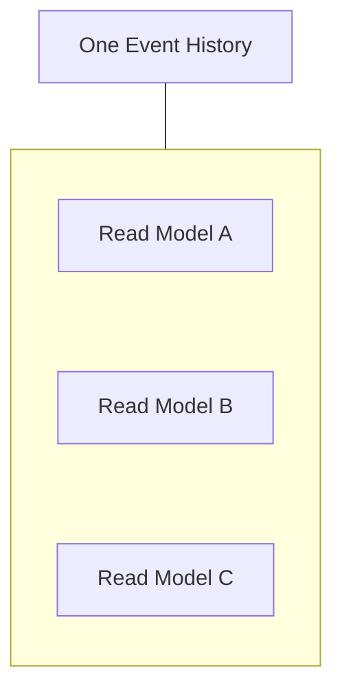

This connects naturally with **CQRS**.

---

# 13. Event Sourcing + CQRS

Event Sourcing and CQRS are separate patterns.

They can be used independently.

### CQRS

Separates:

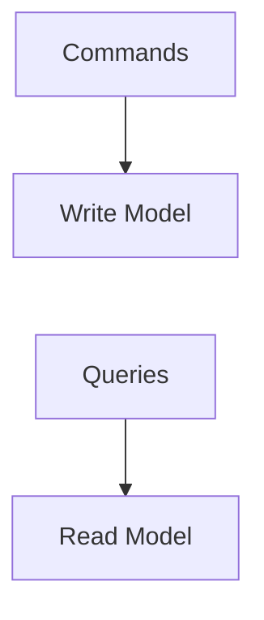

### Event Sourcing

Stores:

```text
State-changing events
```

and derives state by replaying them.

They can be combined:

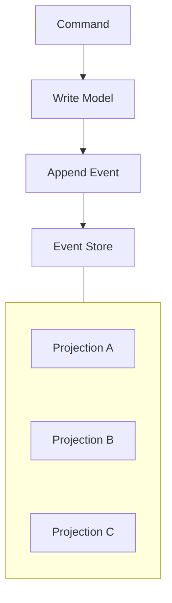

This is a powerful architecture.

But:

> **CQRS does not require Event Sourcing, and Event Sourcing does not require CQRS.**

---

# 14. Event Sourcing + Outbox

The Outbox Pattern solves a different problem.

Outbox:

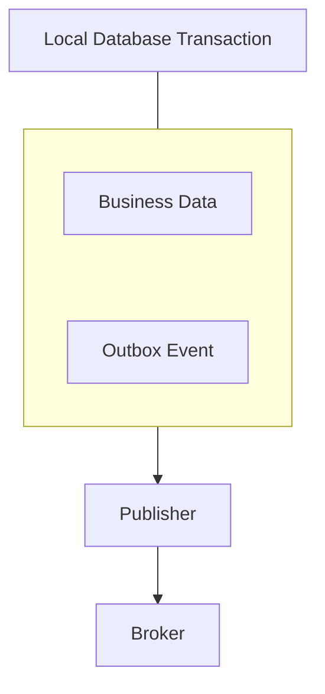

Event Sourcing:

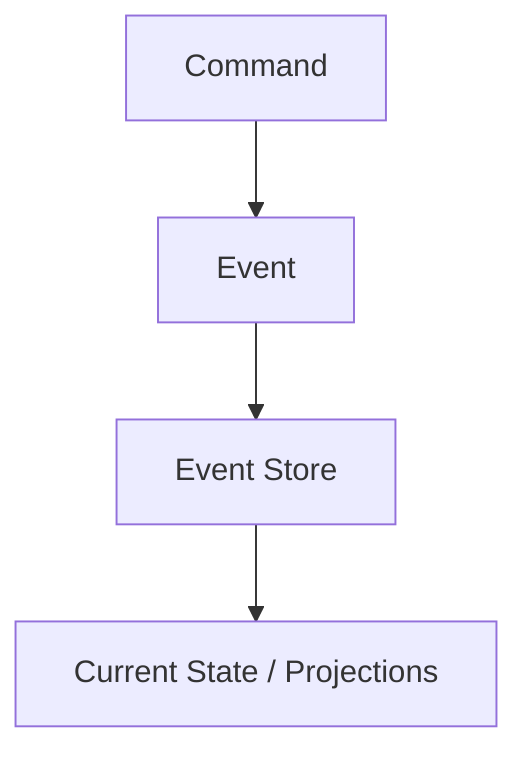

An event-sourced system may still need reliable publication of events to external systems.

Depending on the architecture, the event store itself may serve as the durable event source, or an additional publication mechanism may be required.

The key distinction is:

> **Outbox reliably connects a local transactional state change to event publication. Event Sourcing makes the event history itself the source of truth for the application's state.**

They can also be combined in appropriate architectures.

---

# 15. Event Sourcing vs Audit Log

These concepts are related but not identical.

### Audit log

Records information such as:

```text
User 42 changed order 101
Old status = paid
New status = shipped
```

Its purpose is primarily:

```text
Traceability
Compliance
Investigation
```

### Event Sourcing

The events are part of the application's state model.

```text
OrderCreated
ItemAdded
PaymentAuthorized
OrderShipped
```

The system can use those events to reconstruct state.

Therefore:

> **An audit log records history for traceability; an event-sourced event stream can be the source of truth from which application state is derived.**

An audit log is not automatically sufficient to rebuild application state.

---

# 16. Snapshots

Replaying thousands or millions of events every time an entity is loaded can become expensive.

Suppose:

```text
Order 101

1
2
3
...
10,000
```

Replaying all 10,000 events may be unnecessary.

A **snapshot** stores the state at a particular point.

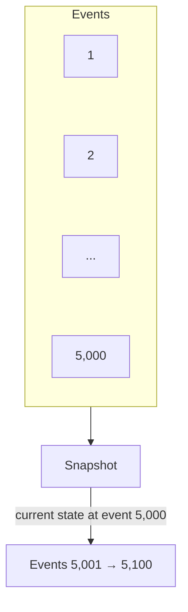

To rebuild:

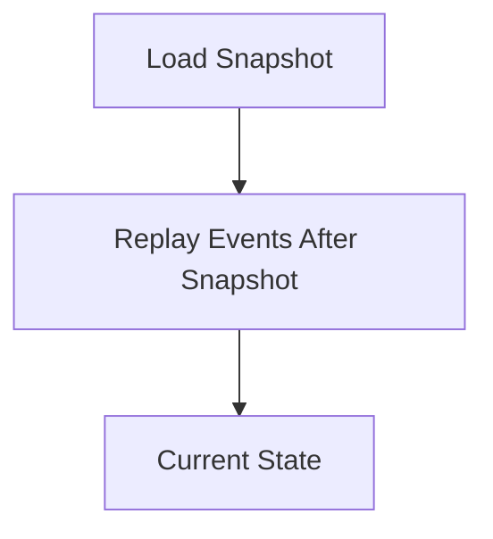

This reduces replay work.

---

# 17. Snapshot Is Not the Source of Truth

A snapshot is an optimization.

The underlying event history remains authoritative in an event-sourced design.

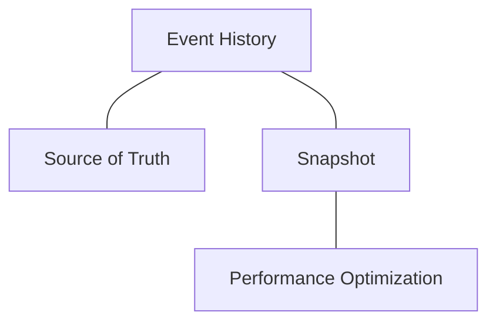

If a snapshot is corrupted, the state can potentially be reconstructed by replaying events again.

---

# 18. Event Versioning

Event schemas evolve.

Suppose version 1 contains:

```json
{
  "event": "OrderCreated",
  "customerId": 42
}
```

Later you need:

```json
{
  "event": "OrderCreated",
  "customerId": 42,
  "currency": "INR"
}
```

But old events do not contain `currency`.

The system must handle historical event formats.

Possible strategies include:

- versioned event schemas,
- upcasting,
- backward-compatible fields,
- event transformation,
- maintaining multiple readers.

The important point is:

> **Events live for a long time, so event schema design must consider the future.**

---

# 19. Why Event Versioning Is Different

With ordinary database state, you might migrate:

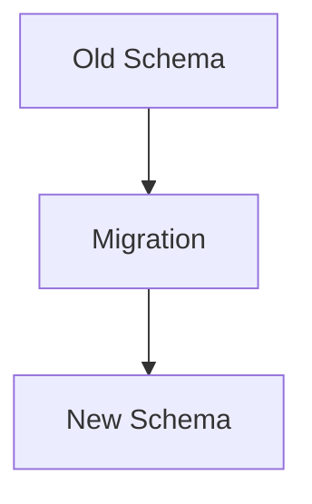

With Event Sourcing:

```text
Event 1 → Old Schema
Event 2 → Old Schema
Event 3 → New Schema
Event 4 → New Schema
```

Historical events may remain in their original form.

Therefore, your event consumers may need to understand multiple versions.

This creates a significant long-term maintenance responsibility.

---

# 20. Event Replay and Side Effects

Suppose:

```text
OrderShipped
```

originally caused:

```text
Send shipping email
```

Now you replay the event stream to rebuild a projection.

You do **not** want replaying historical events to send thousands of emails again.

Therefore:

```mermaid
flowchart TD
  accTitle: Replay without side effects
  accDescr: Event replay rebuilds projections but must not repeat external side effects.
  H["Event Replay"] --- G
  subgraph G[" "]
    direction TB
    I0["Rebuild Projection ✓"] ~~~ I1["Repeat External Side Effect ❌"]
  end
```

A good design separates:

```text
State reconstruction
```

from:

```text
External side effects
```

This is a critical operational concern.

---

# 21. Idempotency Still Matters

Event Sourcing does not eliminate duplicate processing.

A consumer may receive:

```text
OrderShipped
```

more than once.

For example:

```mermaid
flowchart TD
  accTitle: A duplicate delivery
  accDescr: Event, then Consumer processes, then Crash before acknowledgement, then Event delivered again.
  N0["Event"] --> N1["Consumer processes"] --> N2["Crash before acknowledgement"] --> N3["Event delivered again"]
```

The consumer should safely handle duplicates where the delivery model permits them.

This connects directly to:

- **05.10 — Message Delivery Semantics**
- **05.11 — Idempotency**
- **07.15 — Outbox Pattern**

---

# 22. Optimistic Concurrency

Consider two commands targeting the same order:

```mermaid
flowchart TD
  accTitle: Two commands, one version
  accDescr: Command A and command B both target order version 10.
  A0["Command A"] --> B0["Order version 10"]
  A1["Command B"] --> B1["Order version 10"]
  B0 ~~~ A1
```

Both cannot safely append events based on the same expected state without coordination.

A common approach is optimistic concurrency:

```mermaid
flowchart TD
  accTitle: Optimistic concurrency
  accDescr: Expected version = 10, then Append event, then If current version != 10, then Reject / retry / resolve.
  N0["Expected version = 10"] --> N1["Append event"] --> N2["If current version != 10"] --> N3["Reject / retry / resolve"]
```

Conceptually:

```text
Event Stream

Version 10
    ↓
Command A → Version 11 ✓

Command B expected 10
    ↓
Actual version = 11
    ↓
Conflict
```

This prevents two writers from silently producing an invalid sequence.

---

# 23. Event Store

An event-sourced system needs durable storage for the event history.

Conceptually:

```text
Event Store
────────────────────────────
Aggregate
Sequence
Event Type
Payload
Timestamp
Version
────────────────────────────
```

An event store should support the properties required by the system, such as:

- durable storage,
- ordered event streams,
- append operations,
- concurrency control,
- efficient retrieval,
- appropriate retention and recovery.

A generic message broker is not automatically an event-sourcing database.

For example:

```text
Kafka
```

can transport and retain events, but:

> **Using a log or broker does not automatically make an application Event Sourced.**

The application still needs durable event semantics and a clear source-of-truth model.

---

# 24. Event Sourcing and Event Streaming Are Not the Same

These concepts are related.

### Event Streaming

Focuses on:

```text
Continuous movement of events
```

For example:

```mermaid
flowchart TD
  accTitle: Event streaming
  accDescr: Producer, then Kafka, then Consumers.
  N0["Producer"] --> N1["Kafka"] --> N2["Consumers"]
```

### Event Sourcing

Focuses on:

```text
Events as the authoritative history of state changes
```

For example:

```mermaid
flowchart TD
  accTitle: Event sourcing
  accDescr: Command, then Event Store, then Replay, then State.
  N0["Command"] --> N1["Event Store"] --> N2["Replay"] --> N3["State"]
```

A system can use event streaming without Event Sourcing.

Likewise, an event-sourced system may publish its events to a streaming platform.

---

# 25. Event Sourcing and Consistency

Projections are often updated asynchronously.

For example:

```mermaid
flowchart TD
  accTitle: Asynchronous projections
  accDescr: Command, then Event Store, then Event Published, then Projection.
  N0["Command"] --> N1["Event Store"] --> N2["Event Published"] --> N3["Projection"]
```

There may be a delay:

```mermaid
flowchart TD
  accTitle: Projection delay
  accDescr: Write succeeds, then Projection catches up, then Read model updated.
  N0["Write succeeds"] --> N1["Projection catches up"] --> N2["Read model updated"]
```

During that period:

```text
Write State = New
Read Model  = Old
```

This can create **eventual consistency** in derived views.

However:

> **Event Sourcing itself does not automatically require eventual consistency.**

A projection can sometimes be updated synchronously.

The consistency model is an architectural choice.

---

# 26. Temporal Queries

One attractive capability of Event Sourcing is the ability to ask historical questions.

For example:

```text
What was the order status yesterday?

When was payment authorized?

What changed before cancellation?

What did the system know at a particular point?
```

Because the event history is preserved, the system may be able to reconstruct previous states.

Conceptually:

```text
Event History
      │
      ├── Replay to T1 → State at T1
      ├── Replay to T2 → State at T2
      └── Replay to Now → Current State
```

This can be valuable in domains where history itself is important.

---

# 27. Storage Growth

Event history grows continuously.

Suppose:

```text
1 million events/day
```

and every event is retained.

Over time:

```mermaid
flowchart TD
  accTitle: Storage growth
  accDescr: 1 day: 1 million. 30 days: 30 million. 1 year: 365 million.
  A0["1 day"] --> B0["1 million"]
  A1["30 days"] --> B1["30 million"]
  A2["1 year"] --> B2["365 million"]
  B0 ~~~ A1
  B1 ~~~ A2
```

The exact numbers depend on workload.

Event Sourcing therefore requires decisions about:

- storage capacity,
- archival,
- retention,
- compression,
- snapshots,
- event size,
- backup,
- disaster recovery.

---

# 28. Event Size Matters

An event should contain enough information to represent the business fact without unnecessarily embedding huge amounts of data.

Poor:

```text
OrderUpdated
+ entire 20 MB customer profile
+ entire product catalog
+ unrelated data
```

Better:

```text
OrderShipped
{
    orderId: 101,
    shipmentId: 5001,
    carrier: "..."
}
```

Smaller events generally reduce:

- storage,
- network transfer,
- replay cost,
- processing overhead.

But the event must still contain enough information for the consumers and reconstruction model that depend on it.

---

# 29. Privacy and Sensitive Data

Event history can live for a long time.

This creates an important challenge when events contain:

- personal information,
- payment-related information,
- addresses,
- tokens,
- other sensitive data.

If an event is immutable and retained for years, simply "deleting the current record" may not remove historical copies.

Therefore, Event Sourcing requires careful data design.

Possible strategies can include:

- minimizing sensitive data in events,
- tokenizing references,
- separating sensitive data,
- controlled retention,
- encryption and access controls,
- privacy-aware event design.

The exact approach depends on legal, business, and system requirements.

---

# 30. Event Sourcing Failure Modes

| Problem | Consequence |
|---|---|
| Event schema changes badly | Historical events become difficult to read |
| Event stream grows very large | Replay becomes expensive |
| Events are duplicated | Projections may become incorrect without idempotency |
| Events arrive out of order | Derived state can become invalid |
| Projection fails | Read model becomes stale |
| Event store unavailable | Writes or reconstruction may fail |
| External side effects replayed | Duplicate emails/payments/actions |
| Poor event design | History becomes difficult to interpret |
| Sensitive data in events | Long-term privacy/security exposure |
| Weak concurrency control | Conflicting state transitions |

---

# 31. When Event Sourcing Makes Sense

Event Sourcing can be useful when:

### 1. History is a first-class requirement

For example:

```text
Financial transactions
Order lifecycle
Inventory movements
```

### 2. The domain has meaningful state transitions

```text
Created
Reserved
Authorized
Shipped
Cancelled
```

### 3. Multiple projections are valuable

```text
Operational View
Analytics View
Customer View
Audit View
```

### 4. Reconstructing past state matters

```text
"What was true at this point in time?"
```

### 5. The team can manage event evolution

The long-term operational and development discipline is important.

---

# 32. When Event Sourcing Does Not Make Sense

Avoid it simply because:

```text
"Events are modern."
```

It may be unnecessary for:

```text
Simple CRUD application
```

where you only need:

```text
Current user profile
Current product details
Current settings
```

If the requirement is simply:

```text
Store current state
Read current state
Update current state
```

ordinary relational persistence may be much simpler.

Event Sourcing introduces:

- event design,
- replay,
- versioning,
- projections,
- storage growth,
- operational complexity,
- recovery considerations.

Do not pay those costs without a meaningful reason.

---

# 33. Event Sourcing vs Traditional CRUD

| Traditional CRUD | Event Sourcing |
|---|---|
| Stores current state | Stores state-changing events |
| Updates state directly | Appends new events |
| History may require separate audit log | History is part of the event stream |
| Simple reads | Current state often derived/projected |
| Schema migration is usually straightforward | Historical event versions must be handled |
| Usually simpler | More operational complexity |
| Good for many applications | Useful when history/domain events are important |

Neither is universally better.

---

# 34. Event Sourcing Decision Framework

Before adopting Event Sourcing, ask:

```mermaid
flowchart TD
  accTitle: Should we adopt event sourcing?
  accDescr: Do we need complete state-change history? No: CRUD may be sufficient. Yes: are events meaningful domain facts? No: reconsider. Yes: do we need multiple projections, historical reconstruction, can the team manage event versioning, replay, idempotency, storage growth and operational recovery, and is the benefit worth the added complexity?
  subgraph R1[" "]
    direction TB
    Q1{"Do we need complete state-change history?"} -->|"No"| K1["CRUD may be sufficient"]
  end
  subgraph R2[" "]
    direction TB
    Q2{"Are events meaningful domain facts?"} -->|"No"| K2["Reconsider"]
  end
  subgraph T["Can the team manage:"]
    direction TB
    I0["event versioning"] ~~~ I1["replay"] ~~~ I2["idempotency"] ~~~ I3["storage growth"] ~~~ I4["operational recovery?"]
  end
  R1 -->|"Yes"| R2
  R2 -->|"Yes"| C0["Do we need multiple projections?"] --> C1["Do we need historical reconstruction?"]
  C1 --> T --> Z["Is the benefit worth the added complexity?"]
```

The final question is the most important.

---

# 35. Hands-On Exercise

Build a small conceptual event-sourced **Order**.

## Step 1 — Define Events

Start with:

```text
OrderCreated
ItemAdded
PaymentAuthorized
OrderShipped
```

---

## Step 2 — Create the Event Stream

```text
Order 101

1 → OrderCreated
2 → ItemAdded
3 → PaymentAuthorized
4 → OrderShipped
```

---

## Step 3 — Replay

Start with:

```text
State = empty
```

Apply:

```text
OrderCreated
```

Result:

```text
status = created
```

Apply:

```text
ItemAdded
```

Result:

```text
items = 1
```

Apply:

```text
PaymentAuthorized
```

Result:

```text
payment = authorized
```

Apply:

```text
OrderShipped
```

Result:

```text
status = shipped
```

---

## Step 4 — Add a Snapshot

After event 3:

```text
Snapshot:

status  = paid
items   = 1
version = 3
```

Now replay only:

```text
Event 4
```

instead of:

```text
Events 1 → 4
```

---

## Step 5 — Test Failure

Simulate:

```text
Event 4 processed
Projection update succeeds
Consumer crashes before acknowledgement
```

Then:

```text
Event 4 delivered again
```

Ask:

> **Can the projection safely process Event 4 twice?**

If not, introduce an idempotency mechanism.

---

## Step 6 — Test Version Conflict

Two commands both expect:

```text
version = 3
```

First command succeeds:

```text
version = 4
```

Second command still expects:

```text
version = 3
```

It should detect the conflict rather than blindly append an event.

---

# 36. Operational Questions

Before using Event Sourcing in production, answer:

### Storage

```text
How quickly will events grow?
How long are they retained?
How are they backed up?
```

### Recovery

```text
Can the event store be restored?
Can projections be rebuilt?
How long does replay take?
```

### Evolution

```text
How will event schemas change?
How are old events interpreted?
```

### Consumers

```text
How are duplicates handled?
What happens when a consumer falls behind?
```

### Side effects

```text
How do we prevent replay from repeating external actions?
```

### Concurrency

```text
How do concurrent commands targeting one aggregate behave?
```

These are production concerns, not optional details.

---

# 37. Common Mistakes

### Mistake 1 — Treating Event Sourcing as an audit log

An audit log records history.

Event Sourcing uses event history as part of the state model.

---

### Mistake 2 — Assuming CQRS requires Event Sourcing

It does not.

CQRS can use ordinary databases.

---

### Mistake 3 — Treating every database update as an event

Events should represent meaningful domain facts.

---

### Mistake 4 — Editing historical events

Historical facts should generally remain immutable.

Represent corrections with new events.

---

### Mistake 5 — Ignoring event versioning

Events may live much longer than application code versions.

---

### Mistake 6 — Replaying external side effects

Replaying:

```text
PaymentAuthorized
```

must not accidentally charge the customer again.

---

### Mistake 7 — Ignoring duplicate delivery

Consumers should be designed for the delivery semantics they actually operate under.

---

### Mistake 8 — Assuming Event Sourcing is automatically scalable

It can support powerful architectures, but storage, replay, projections, consumers, and operational complexity still require capacity planning.

---

### Mistake 9 — Using Event Sourcing for simple CRUD

If current state is all you need, traditional persistence may be much simpler.

---

### Mistake 10 — Assuming a message broker is automatically an event store

A broker transports/retains messages according to its semantics.

Event Sourcing requires a durable authoritative event history with appropriate state and concurrency semantics.

---

# 38. Key Principle

> **Event Sourcing treats meaningful state-changing events as the source of truth and derives current state by replaying those events.**

It provides powerful capabilities:

```mermaid
flowchart TD
  accTitle: What event sourcing provides
  accDescr: Complete history, then Replay, then Multiple projections, then Historical reconstruction.
  N0["Complete history"] --> N1["Replay"] --> N2["Multiple projections"] --> N3["Historical reconstruction"]
```

But it also introduces:

```text
Event versioning
Storage growth
Replay cost
Projection management
Concurrency concerns
Operational complexity
```

Therefore:

> **Use Event Sourcing when the value of preserving and deriving state from event history justifies the additional complexity.**

---

# 39. Quick Reference

| Concept | Meaning |
|---|---|
| Event Sourcing | Storing state changes as immutable events |
| Event | Immutable fact about something that happened |
| Event Stream | Ordered events belonging to an entity/aggregate |
| Event Store | Durable storage for authoritative event history |
| Replay | Applying historical events to reconstruct state |
| Projection | Derived representation built from events |
| Snapshot | Stored state used to reduce replay work |
| Event Version | Version of an event schema |
| Upcasting | Converting older event representations for current consumers |
| Event ID | Unique identifier for an event |
| Sequence Number | Ordering/version number within an event stream |
| Optimistic Concurrency | Detecting conflicting writes using expected versions |
| CQRS | Separating command and query responsibilities |
| Outbox | Reliable publication mechanism from a local transaction |
| Audit Log | Historical record primarily intended for traceability |

---

# 40. Knowledge Check

### Question 1

What is the fundamental idea behind Event Sourcing?

Store meaningful state-changing events as the source of truth and derive current state by replaying them.

---

### Question 2

Are events the same as commands?

No.

```text
Command → request to perform an action

Event → fact that something happened
```

---

### Question 3

Why are events generally immutable?

Because they represent facts about the past. Corrections are normally represented by new events rather than changing historical facts.

---

### Question 4

Why are snapshots useful?

They reduce the amount of historical events that must be replayed to reconstruct current state.

---

### Question 5

Does Event Sourcing require CQRS?

No.

They are separate patterns that can be combined.

---

### Question 6

Does CQRS require Event Sourcing?

No.

CQRS can use a conventional database and separate read/write models.

---

### Question 7

Why is event versioning important?

Historical events may remain stored for a long time, so newer application versions must still be able to interpret older event formats.

---

### Question 8

Why can replaying events be dangerous?

Because replay should rebuild state without accidentally repeating external side effects such as sending emails or charging payments.

---

### Question 9

Why does idempotency matter?

Events may be delivered or processed more than once, so consumers need to safely handle duplicates where required.

---

### Question 10

When should you avoid Event Sourcing?

When the application mainly needs simple current-state CRUD and the benefits of historical event-based state do not justify the additional complexity.

---

# Remember

Traditional persistence asks:

> **"What is the current state?"**

Event Sourcing asks:

> **"What happened, and what state results from those events?"**

The mental model is:

```mermaid
flowchart TD
  accTitle: The event sourcing mental model
  accDescr: A command goes through domain logic to a new event in the event store; the immutable event history feeds projections (a read model, analytics) and replay (the current state).
  N0["COMMAND"] --> N1["Domain Logic"] --> N2["New Event"] --> N3["Event Store"] --> N4["Immutable Event History"] --> P1["Projection"] & P2["Projection"] & R["Replay"]
  P1 --> M["Read<br/>Model"]
  P2 --> A["Analytics"]
  R --> C["Current<br/>State"]
```

The most important lesson is:

> **Event Sourcing is not "using events because events are modern." It is a deliberate decision to make event history the authoritative representation of state.**

If the business genuinely benefits from that history, replayability, and multiple derived views, the complexity can be worthwhile.

If not, simpler state-based persistence is usually the better architecture.

**Next: Level 8 — Cloud Architecture**
