# 08.01 — Why Cloud?

## Learning Objectives

By the end of this chapter, you should be able to:

- Explain what cloud computing is and why it exists.
- Understand the difference between traditional infrastructure and cloud infrastructure.
- Distinguish cloud computing from simply renting a virtual machine.
- Understand on-demand provisioning, elasticity, and managed services.
- Recognize the benefits, costs, and limitations of cloud adoption.
- Decide when cloud infrastructure is useful and when it may not be necessary.

---

## 1. What Is Cloud Computing?

Every application needs infrastructure to run.

For example, an online store may require:

- Computing resources to execute application code.
- Storage for images and documents.
- A database for orders and customers.
- Networking to connect components.
- Backup and recovery mechanisms.

Traditionally, an organization might purchase physical servers, install them in a data center, and maintain the infrastructure itself.

Cloud computing provides access to computing resources over a network, typically with on-demand provisioning and usage-based pricing.

> **Cloud computing lets you obtain and operate computing resources without having to own and manage all the underlying physical infrastructure yourself.**

Instead of purchasing every server in advance, you can provision resources when needed, adjust capacity, and pay according to the provider's pricing model.

---

## 2. Traditional Infrastructure vs Cloud

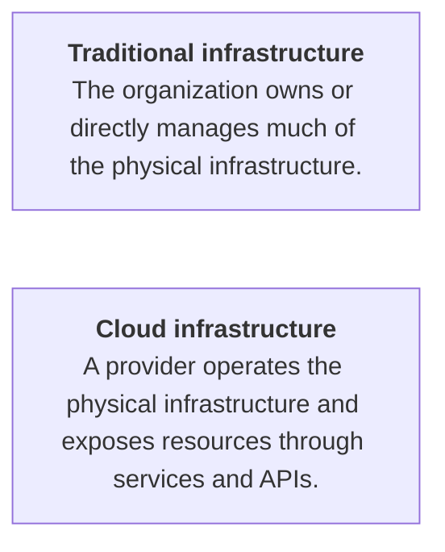

Consider launching a new web application.

**Traditional approach**

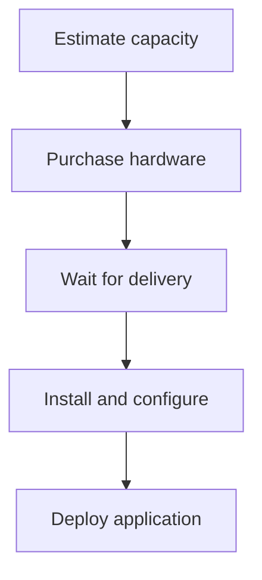

**Cloud approach**

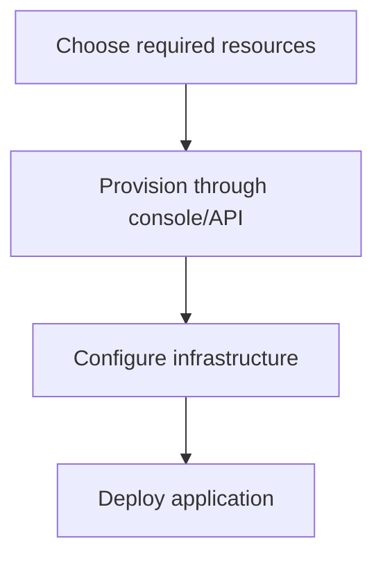

Cloud provisioning can be much faster, although application setup, networking, security, and deployment still require work.

The key difference is how infrastructure is acquired, provisioned, and operated.

---

## 3. What Problems Does Cloud Solve?

Cloud computing addresses several infrastructure challenges.

| Traditional challenge | Cloud capability |
|---|---|
| Large upfront hardware investment | Provision resources without purchasing physical servers |
| Capacity difficult to change quickly | Increase or decrease provisioned capacity |
| Physical hardware maintenance | Provider manages underlying facilities and hardware |
| Setting up infrastructure manually | APIs and automation support repeatable provisioning |
| Building every supporting system yourself | Managed databases, storage, messaging, and other services |
| Planning for uncertain demand | Scale resources according to workload and policy |

Cloud does not eliminate these problems completely. It changes how much of the work you perform and which responsibilities the provider assumes.

For example, a managed database reduces infrastructure-management work, but your team may still be responsible for schema design, access control, query performance, and data recovery requirements.

---

## 4. On-Demand Provisioning

**On-demand provisioning** means creating or obtaining resources when they are needed, rather than purchasing all physical capacity in advance.

Imagine you need a server for a new application.

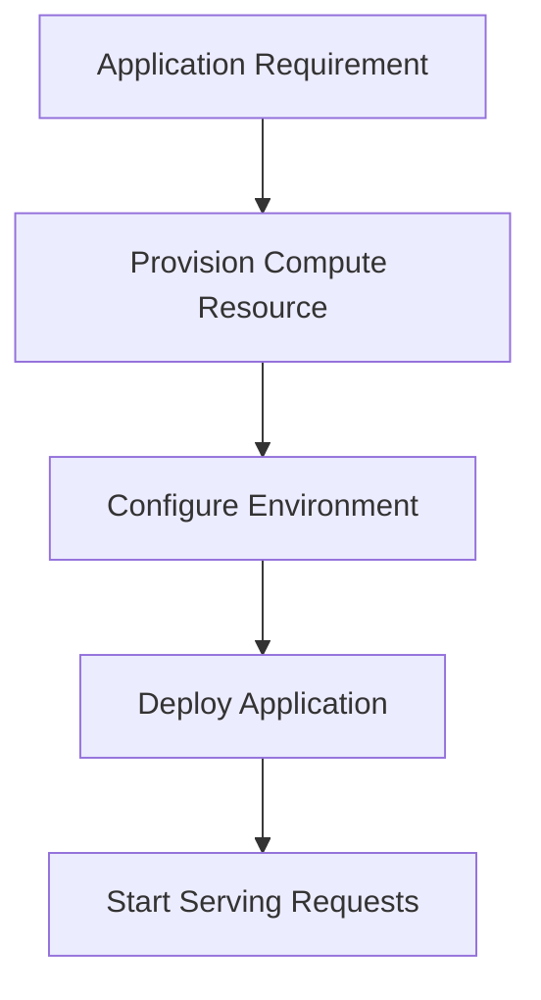

Later, you can provision additional resources or remove resources you no longer need.

This makes experimentation and infrastructure changes easier.

However, provisioning is not always instantaneous. Resource availability, configuration, quotas, deployment automation, and startup time can affect how quickly a system becomes usable.

---

## 5. Elasticity vs Scalability

These concepts are related, but they are not identical.

**Scalability** is a system's ability to handle increased workload by using additional resources or more capable resources.

**Elasticity** is the ability to adjust resources to changing demand.

For example:

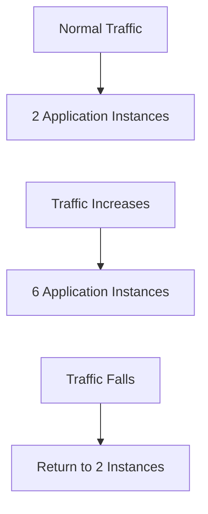

This illustrates elasticity when capacity can be adjusted safely as demand changes.

A system can be scalable without automatically scaling up and down. Elasticity concerns how capacity responds to workload changes.

Cloud platforms can provide the mechanisms for elasticity, but the application must still be designed to scale correctly.

---

## 6. Cloud Does Not Automatically Mean Auto-Scaling

Suppose your application runs on one cloud virtual machine.

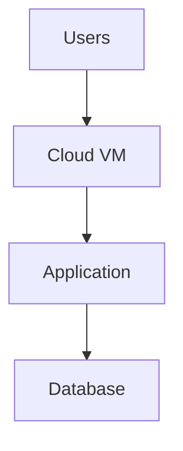

You are using cloud infrastructure, but the application may still have a fixed capacity.

If traffic grows beyond that capacity, the system can become slow or fail.

Cloud resources make it easier to provision more capacity, but automatic scaling requires additional configuration and suitable application architecture.

For example, scaling application instances may require:

- A load balancer.
- Application instances that can operate independently.
- Appropriate shared state storage.
- Health checks.
- Capacity limits and scaling policies.
- Sufficient database and downstream capacity.

**Cloud provides capabilities; architecture determines how effectively you use them.**

---

## 7. The Shared Responsibility Model

Cloud adoption does not mean the provider is responsible for every part of your application.

Responsibilities are divided between the provider and the customer. The exact boundary depends on the service.

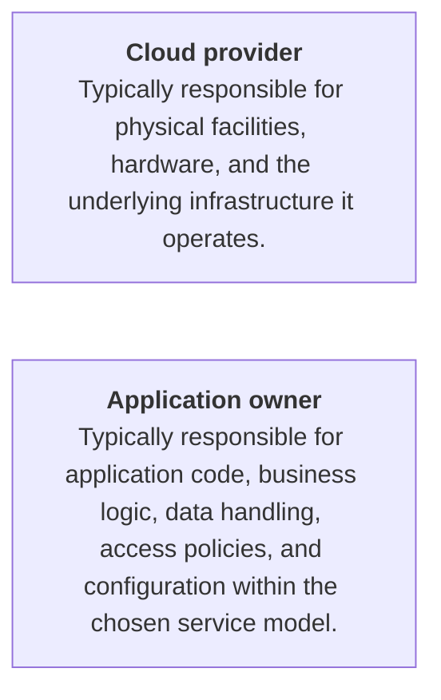

For example, with a virtual machine, you may manage the operating system, patches, runtime, and application.

With a managed application platform, the provider may handle more of the operating environment.

With a managed database, the provider may operate the database infrastructure, but your team still needs to configure access, understand backup guarantees, and design for the required consistency and performance.

> **Using a cloud service changes your responsibilities; it does not eliminate responsibility.**

---

## 8. Managed Services

A managed service lets you use a capability while the provider handles some of the underlying operational work.

Examples include:

- Managed relational databases.
- Managed caching.
- Managed message brokers.
- Object storage.
- Managed monitoring services.

Consider running a database yourself.

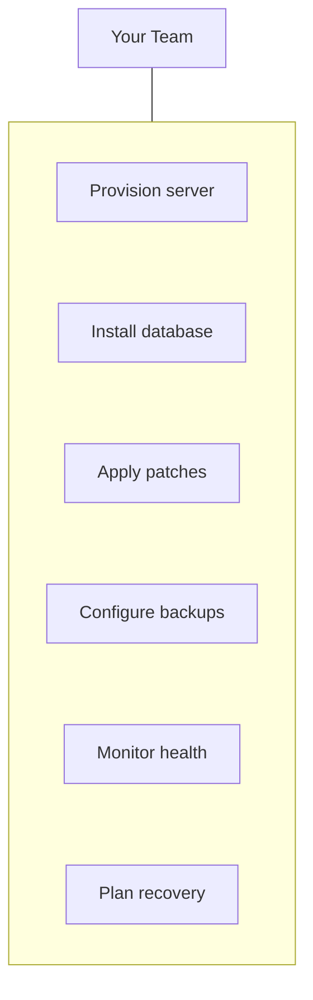

With a managed database, the provider can handle some infrastructure and maintenance tasks.

Your team still needs to make decisions about data modeling, indexes, connection usage, query performance, access permissions, and recovery requirements.

Managed services reduce certain operational burdens, but they may introduce service limits, pricing constraints, configuration restrictions, and provider dependencies.

---

## 9. Cloud Economics: Pay for Usage

Cloud services often charge according to resource usage, capacity provisioned, requests made, or data transferred.

This can reduce upfront investment, but it does not guarantee lower total cost.

Consider an application that receives unpredictable traffic.

```text
Demand
  ↑
  │          /\
  │    /\   /  \
  │___/  \_/    \____
  └──────────────────→ Time
```

With suitable elasticity, the system may use more resources during busy periods and fewer during quiet periods.

But costs can still arise from:

- Resources left running unnecessarily.
- Overprovisioned databases.
- Data transfer between regions or services.
- Storage and retained backups.
- Excessive logging.
- High request volume.
- Managed-service pricing and support.

The important question is not simply:

> "Is cloud cheaper?"

Ask:

> **"What is the total cost of meeting this workload's performance, reliability, security, and operational requirements?"**

---

## 10. Cloud and Infrastructure Automation

Cloud resources can often be created and configured through APIs and automation.

Instead of manually configuring infrastructure each time:

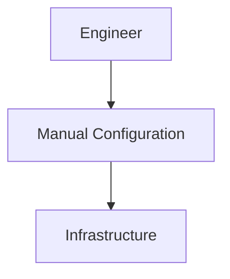

you can define infrastructure in code:

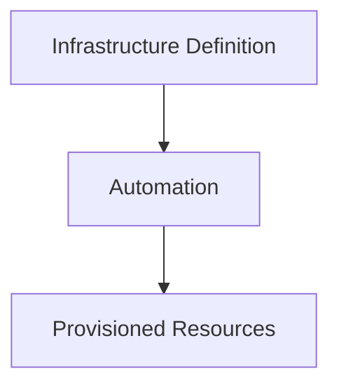

This supports repeatability, review, version control, and safer changes.

Infrastructure as Code is covered later in **08.14 — Infrastructure as Code**.

For now, remember that automation is a major cloud advantage, not an automatic property of every cloud deployment.

---

## 11. Cloud Does Not Remove Bottlenecks

Suppose your application has three components:

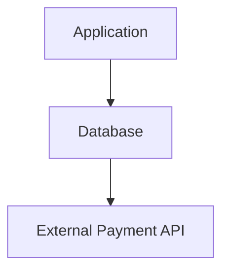

The application becomes overloaded, so you increase its capacity.

But the database is already saturated.

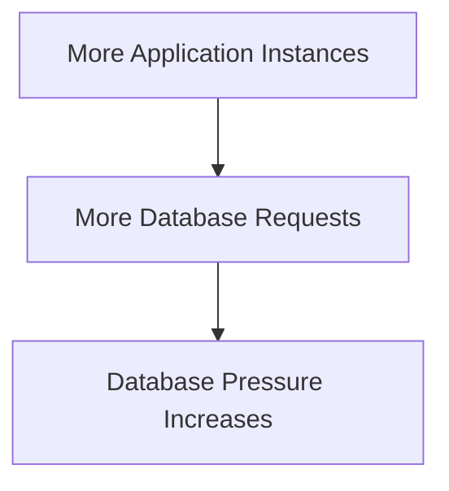

The result may be worse rather than better.

Cloud makes it easier to add resources, but it does not change the fundamental rule:

> **Scaling a component in front of a bottleneck does not necessarily remove the bottleneck.**

Measure the system, identify the constraint, and scale the relevant part.

---

## 12. Cloud Failure Is Still Failure

Cloud infrastructure can experience:

- Instance failures.
- Network problems.
- Service disruptions.
- Configuration errors.
- Regional outages.
- Account or quota limitations.
- Provider control-plane problems.

A cloud-hosted application can still fail if all its instances depend on one unavailable database or one shared failure domain.

For example:

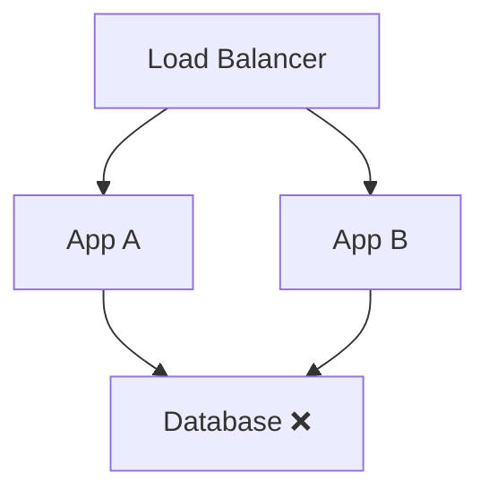

Both application instances may be healthy, but the application can still be unable to serve requests if the database is unavailable.

Cloud reliability requires deliberate design: redundancy, backups, health checks, recovery plans, and appropriately independent failure domains.

These topics are covered in the Reliability level.

---

## 13. Cloud Lock-In and Portability

Cloud services differ in their APIs, configuration models, pricing, operational behavior, and capabilities.

Using a provider-specific managed service can simplify development and operations.

However, replacing it later may require changes to:

- Application code.
- Data models and export/import processes.
- Identity and access policies.
- Deployment automation.
- Monitoring.
- Operational procedures.

For example, moving from a provider-managed messaging service to another broker may require more than changing a connection URL.

This does not mean provider-specific services should always be avoided.

> **Lock-in is a trade-off to understand, not automatically a problem to eliminate.**

A useful decision compares the benefits of the managed service with the likely cost and difficulty of replacing it.

---

## 14. When Cloud Makes Sense

Cloud can be especially useful when a system needs:

- Fast infrastructure provisioning.
- Variable or growing capacity.
- Managed databases, storage, or messaging.
- Geographic reach.
- Repeatable infrastructure automation.
- Access to specialized infrastructure without owning hardware.
- A small team to operate a substantial system.

Cloud may be less attractive when:

- Workloads are stable and predictable enough that owned infrastructure is economical.
- Strict physical or operational control is required.
- Connectivity to the provider is unreliable for the use case.
- Provider constraints conflict with requirements.
- Migration and ongoing operational costs outweigh the benefits.

Some systems use a hybrid model, keeping certain workloads on owned infrastructure while using cloud services for others.

There is no universal winner. The right choice depends on workload, cost, operational capability, risk, and requirements.

---

## 15. Hands-On Exercise

Imagine you are deploying a small e-commerce application.

Its components are:

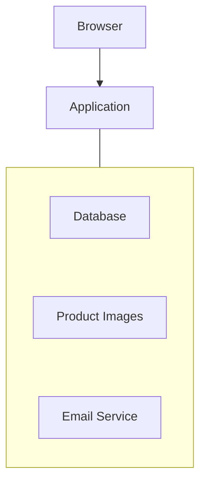

For each component, decide whether you would initially manage it yourself or use a managed cloud service.

**Choose your starting architecture**

There is no universally correct answer. Choose based on your requirements and explain your trade-offs.

| Component | Option 1 | Option 2 |
|---|---|---|
| Application compute | Managed application platform | Virtual machine I manage |
| Database | Managed database | Database installed and managed by my team |
| Product images | Object storage service | Store images on the application server |
| Email delivery | External email delivery service | Operate my own email infrastructure |

**Primary decision factor**

- Reduce operational work for a small team
- Minimize ongoing cost for predictable traffic
- Maximize control and portability

When reviewing your choices, consider:

- Who handles patching and backups?
- How will images be served if the application scales to multiple instances?
- What happens if the database becomes unavailable?
- How will costs change as traffic grows?
- How difficult would it be to replace a provider-specific service?

---

## 16. System Design View

Cloud is an infrastructure and service delivery model, not a complete architecture by itself.

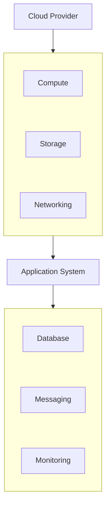

The architecture still needs decisions about:

- How components communicate.
- Where persistent data lives.
- How capacity changes with demand.
- How failures are detected and recovered.
- How access is controlled.
- How the system is observed.
- How much operational responsibility the team retains.

The cloud provider supplies capabilities. Your system design determines how those capabilities are combined.

---

## 17. Common Mistakes

- **Assuming cloud means cheaper:** Total cost depends on usage, architecture, and operational requirements.
- **Assuming cloud means automatically scalable:** Scaling needs suitable design and configuration.
- **Assuming managed means responsibility-free:** Application and data responsibilities remain.
- **Moving everything to cloud without a reason:** Migration has cost and risk.
- **Ignoring provider lock-in:** Managed-service convenience can make future replacement harder.
- **Scaling only the application:** Shared dependencies may remain the bottleneck.
- **Assuming a cloud provider cannot fail:** Redundancy and recovery still matter.
- **Choosing services before defining requirements:** Start with the workload and constraints.

---

## 18. Key Principle

> **Cloud computing changes how infrastructure is provisioned, operated, and paid for. It does not remove the need for sound system design.**

The practical decision sequence is:

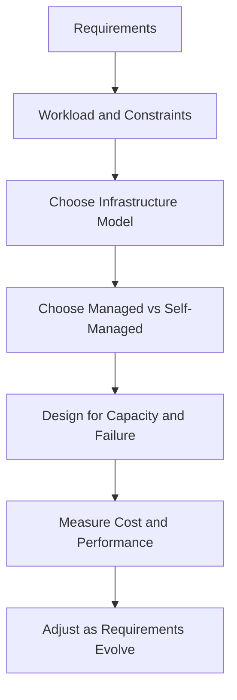

---

## 19. Quick Reference

| Concept | Meaning |
|---|---|
| Cloud computing | Accessing computing resources and services through a provider |
| On-demand provisioning | Obtaining resources when needed |
| Scalability | Ability to handle more workload |
| Elasticity | Adjusting capacity as demand changes |
| Managed service | Provider operates part of the underlying service |
| Shared responsibility | Provider and customer have different security and operational duties |
| Infrastructure as Code | Defining and provisioning infrastructure through version-controlled code |
| Cloud lock-in | Cost or difficulty of moving away from provider-specific capabilities |
| Hybrid infrastructure | Combining cloud and non-cloud infrastructure |

---

## 20. Knowledge Check

1. What is the main idea behind cloud computing?
2. How is elasticity different from scalability?
3. Does using cloud infrastructure automatically make an application scalable?
4. What responsibilities remain when using a managed database?
5. Why can a cloud application still have a single point of failure?
6. Why is cloud not automatically cheaper than owned infrastructure?
7. What trade-off can come with using provider-specific managed services?
8. Why should you identify bottlenecks before increasing cloud capacity?

---

## Remember

Cloud computing lets you obtain infrastructure and capabilities without owning every underlying physical resource.

But it does not automatically solve performance, reliability, security, or cost.

> **Choose cloud capabilities to satisfy real requirements. Understand what the provider manages, what your team still owns, what the service costs, and how the architecture behaves when something fails.**

**Next: 08.02 — Compute**
