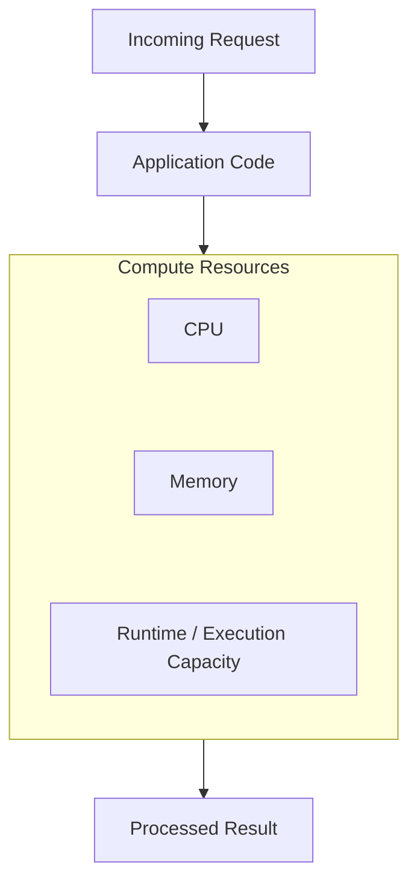
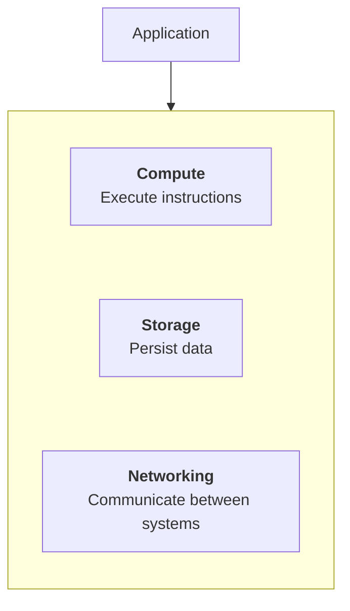
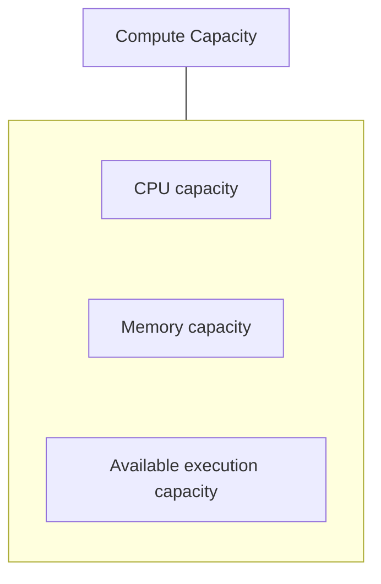
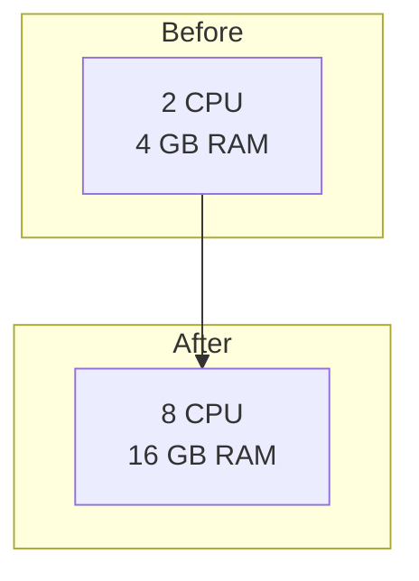
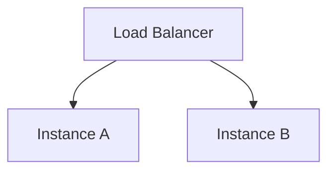
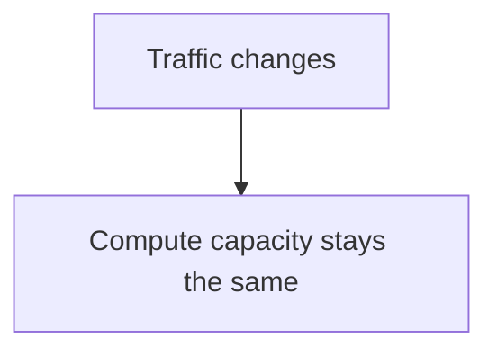
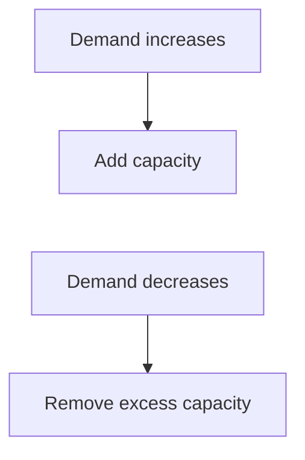
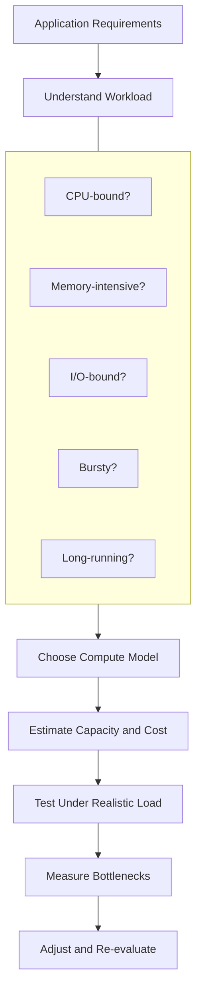
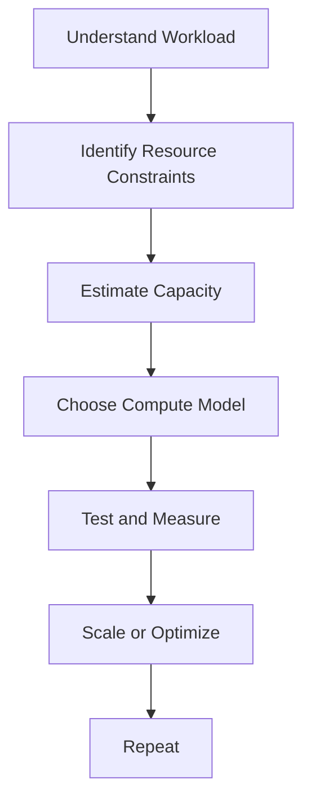

# 08.02 — Compute

## Learning Objectives

By the end of this chapter, you should be able to:

- Explain what compute means in cloud architecture.
- Understand how CPU, memory, and concurrency affect application capacity.
- Distinguish compute capacity from storage and networking.
- Understand the difference between provisioned capacity and actual workload demand.
- Recognize common compute bottlenecks and scaling options.
- Understand the trade-offs between dedicated capacity and elastic capacity.
- Choose an appropriate starting compute strategy for a workload.

---

## 1. What Is Compute?

**Compute is the processing capacity used to execute instructions and perform work.**

When your application receives a request, something must execute its code.

For example, an e-commerce application might need to:

- Validate a customer's request.
- Calculate an order total.
- Apply business rules.
- Process uploaded images.
- Generate a report.
- Coordinate database operations.

These operations consume compute resources.



In cloud architecture, compute refers to the resources or services that provide this execution capability.

Examples include virtual machines, containers, and serverless execution services. Their implementation and management responsibilities differ; those options are covered in later chapters.

> **Compute answers the question: Where and with what resources will this work execute?**

---

## 2. Compute Is Not the Entire Application

A running application depends on more than compute.



These resources serve different purposes:

| Resource | Primary responsibility | Example |
|---|---|---|
| Compute | Execute instructions | Process an order |
| Storage | Retain data | Store product images |
| Networking | Transfer data | Send a request to a database |
| Database service | Store and retrieve structured data | Read order records |

The boundaries can overlap in a product's implementation, but the responsibilities remain conceptually distinct.

A system can have sufficient compute and still be slow because its database, network, or external dependency is the bottleneck.

---

## 3. The Main Compute Resources

### CPU

The CPU executes instructions and performs calculations.

Examples:

- Business logic.
- Compression and encryption.
- Image processing.
- Data transformation.
- Complex calculations.

CPU-intensive workloads may need more processing capacity or more efficient algorithms.

### Memory

Memory holds the data and program state that an application needs while running.

Examples:

- Application objects.
- Request data.
- In-memory caches.
- Working data for reports.

Insufficient memory can lead to allocation failures, garbage-collection pressure, swapping in some environments, or process termination.

### Execution capacity

An application also needs a way to make progress on work.

Depending on its runtime, this may involve processes, threads, event loops, or worker pools.

More execution capacity can help handle concurrent requests, but it also consumes resources and can increase pressure on shared dependencies.



These dimensions interact. Increasing one does not automatically solve a shortage in another.

---

## 4. Compute Capacity vs Workload Demand

Imagine an application receives 100 requests per second.

Under a particular workload, one instance can safely handle approximately 120 requests per second while meeting the required latency target.

```text
Demand:    100 requests/sec
Capacity:  120 requests/sec
```

The instance has some headroom.

Now traffic increases:

```text
Demand:    200 requests/sec
Capacity:  120 requests/sec
```

The workload exceeds the available capacity.

Requests may queue, latency may rise, or errors may increase.

```calculator
title: Illustrative compute utilization
description: Move the workload slider to see how demand relates to a fixed capacity of 120 work units.
inputs:
  - id: demand
    label: Workload demand
    unit: "%"
    min: 10
    max: 200
    step: 10
    value: 80
result:
  label: Demand relative to capacity
  operation: product
  digits: 0
  unit: "%"
meter: 100
bands:
  - below: 80
    tone: success
    message: Illustrative headroom remains.
  - upTo: 100
    tone: warning
    message: Capacity is becoming more heavily utilized.
  - tone: danger
    message: Demand exceeds capacity. Work may queue, slow down, or fail.
caption: This is a conceptual workload model, not a prediction of actual CPU utilization or requests per second.
```

The important relationship is:

> **Compute capacity must be evaluated against the workload the application actually performs—not simply the number of users or requests.**

Two applications receiving the same request rate may need very different amounts of compute.

---

## 5. Why Request Count Is Not Enough

Consider two endpoints.

```text
GET /health
```

This may perform a very small amount of work.

Now consider:

```text
POST /reports/generate
```

This may process millions of records, calculate aggregates, and generate a large file.

Both count as one request, but their compute requirements can differ dramatically.

A better capacity investigation asks:

- How much CPU work does each request require?
- How much memory does it use?
- How long does it occupy execution resources?
- Does it wait for a database or network?
- How many requests arrive concurrently?
- What latency must the system maintain?

Request rate is useful, but **work per request** matters too.

---

## 6. CPU-Bound vs I/O-Bound Work

Compute planning starts by understanding the workload.

**CPU-bound workload**

Most execution time is spent computing.

Examples: image transformation, compression, complex calculations, and large data transformations.

**Likely investigation:** algorithm efficiency, CPU capacity, and whether work can be distributed.

**I/O-bound workload**

A significant part of the time is spent waiting for input/output.

Examples: database queries, network requests, and file access.

**Likely investigation:** dependency latency, connection availability, and unnecessary waiting.

Adding more CPU can help CPU-bound work. It may do little for a request waiting on a slow database.

Worse, adding application instances to an I/O-bound system can increase the number of simultaneous requests sent to an already overloaded dependency.

---

## 7. Vertical and Horizontal Compute Scaling

There are two fundamental ways to increase available compute capacity.

### Vertical scaling

Increase the resources available to an instance.



Potential benefits:

- Simpler application topology.
- More resources without adding another application instance.
- Useful when the workload benefits from a larger machine.

Trade-offs:

- Larger instances can cost more.
- There are practical size limits.
- A single instance may remain a failure point.
- More capacity does not fix unrelated bottlenecks.

### Horizontal scaling

Add more instances that share the workload.



Potential benefits:

- More aggregate capacity.
- Potentially better availability.
- Independent instance replacement or scaling.

Trade-offs:

- Requires suitable request distribution.
- Shared state and dependencies need careful design.
- More instances increase operational and dependency pressure.
- Horizontal scaling does not make every workload easy to distribute.

The dedicated scaling chapters in Level 2 cover these concepts in more depth.

---

## 8. Fixed Capacity vs Elastic Capacity

Cloud compute can be provisioned in different ways.

### Fixed capacity



This can be reasonable for stable workloads with predictable demand.

### Elastic capacity



Elasticity can improve resource efficiency, but scaling has limits.

For example:

- New instances need time to start.
- Requests may arrive faster than capacity can be added.
- The database may not scale at the same rate.
- Scaling policies may react too late or too aggressively.
- Sudden traffic bursts can overwhelm the system before new capacity becomes ready.

For this reason, elastic systems often need a baseline capacity, sensible limits, monitoring, and a strategy for unexpected bursts.

---

## 9. Compute as a Cost Decision

Cloud compute pricing may depend on factors such as:

- Instance size.
- Runtime duration.
- Number of requests or executions.
- Provisioned capacity.
- Operating system or licensing.
- Region and pricing model.

The lowest price per compute unit does not necessarily mean the lowest cost for a working application.

For example, an inefficient algorithm may require many expensive instances, while improving the algorithm reduces both compute demand and cost.

A useful comparison is:

```text
Total Cost
    =
Resources Provisioned
    +
Time Used
    +
Supporting Infrastructure
    +
Operational Overhead
```

This is a conceptual model; actual provider billing rules vary.

> **Optimize the amount of work required before assuming that buying more compute is the best solution.**

---

## 10. Managed Compute vs Self-Managed Compute

Cloud compute services differ in how much infrastructure responsibility they leave with you.

| Approach | What you typically control | Main trade-off |
|---|---|---|
| Virtual machine | OS, runtime, application, and much of the configuration | More control, more operational work |
| Container platform | Application container and its runtime configuration; platform details vary | Consistent packaging, additional orchestration considerations |
| Serverless execution | Application code and execution settings within provider limits | Less infrastructure management, more platform constraints |

These are broad categories. Actual responsibilities vary by service and deployment model.

The next chapters examine these approaches individually:

- **08.03 — Virtual Machines**
- **08.04 — Containers**
- **08.05 — Serverless**

---

## 11. Common Compute Bottlenecks

| Symptom | Possible cause | What to investigate |
|---|---|---|
| CPU consistently saturated | Heavy computation or inefficient code | Profiling, algorithms, CPU capacity |
| Memory pressure | Large working sets, leaks, excessive caching | Memory profiles, object lifetimes, instance memory |
| High latency with low CPU | Waiting on dependencies or queues | Database, network, locks, connection pools |
| Slow startup | Initialization, large dependencies, cold execution environment | Startup path and readiness |
| More instances but no improvement | Database or another dependency is saturated | End-to-end request path |
| Traffic bursts cause errors | Capacity cannot become ready quickly enough | Baseline capacity, scaling delay, admission controls |

A symptom suggests where to investigate; it does not prove the root cause.

---

## 12. Hands-On Exercise

Imagine a report-generation API has the following characteristics:

- Normal traffic: 20 requests per second.
- Peak traffic: 80 requests per second.
- Each request performs significant CPU computation.
- One instance handles 30 requests per second while meeting the required latency.
- The report output is saved to object storage.

Estimate the required instance count using a simple capacity calculation.

At peak traffic:

$$
\text{Minimum instances} =
\left\lceil \frac{80}{30} \right\rceil = 3
$$

Three instances provide a nominal combined capacity of 90 requests per second under the stated assumptions.

However, that leaves little headroom for traffic variation, uneven distribution, instance failure, or changes in workload.

Now consider:

1. Would three instances meet the peak requirement with enough safety margin?
2. What happens if one instance fails?
3. Would vertical scaling be simpler?
4. Does object storage need to scale with compute in the same way?
5. How would you verify the estimate with load testing?

The calculation is only a starting point. Real capacity depends on workload distribution, latency targets, resource contention, and downstream limits.

---

## 13. System Design View

Compute selection should follow the workload and constraints.



Avoid starting with a provider product or machine size.

Start by understanding what the application does, how often it does it, and what performance and reliability requirements it must meet.

---

## 14. Common Mistakes

- **Choosing compute by user count alone:** Work per request can vary widely.
- **Treating CPU as the only resource:** Memory and dependency waits can dominate.
- **Adding instances without checking dependencies:** More compute can overload the database.
- **Assuming elasticity is instantaneous:** Provisioning and startup take time.
- **Provisioning only for average traffic:** Peaks and failures require additional consideration.
- **Buying larger instances before profiling:** The underlying problem may be inefficient code or I/O.
- **Assuming horizontal scaling is always possible:** Stateful or tightly coupled workloads may require changes.
- **Ignoring cost after deployment:** Idle and overprovisioned capacity can accumulate expense.

---

## 15. Key Principle

> **Compute is the execution capacity available to perform a workload. Good compute design matches that capacity to actual work, performance targets, failure requirements, and cost.**

The decision sequence is:



---

## 16. Quick Reference

| Concept | Meaning |
|---|---|
| Compute | Resources used to execute instructions and perform work |
| CPU-bound | Work primarily limited by computation |
| I/O-bound | Work substantially limited by waiting for input/output |
| Vertical scaling | Increasing resources on an instance |
| Horizontal scaling | Adding instances to distribute workload |
| Elasticity | Adjusting capacity as demand changes |
| Provisioned capacity | Resources made available to the workload |
| Headroom | Capacity reserved beyond expected demand |
| Managed compute | Compute service where the provider manages part of the execution infrastructure |
| Workload | The actual processing, requests, and operations a system must perform |

---

## 17. Knowledge Check

1. What does compute provide to an application?
2. Why can two applications with the same request rate need different compute capacity?
3. How does vertical scaling differ from horizontal scaling?
4. Why might adding CPU fail to improve a database-bound request?
5. What is the difference between scalability and elasticity?
6. Why should peak demand and failure scenarios be considered when estimating compute?
7. How can inefficient application code increase cloud costs?
8. Why does adding application instances sometimes make overall performance worse?

---

## Remember

Compute is where application work executes, but the best compute choice depends on the workload—not simply the number of users or the popularity of a cloud service.

**Measure the work. Identify the constraint. Choose the smallest compute model that satisfies the requirements, and evolve it when evidence shows that it needs to change.**

**Next: 08.03 — Virtual Machines**
