# 08.03 — Virtual Machines

## Learning Objectives

By the end of this chapter, you should be able to:

- Explain what a Virtual Machine (VM) is and why it exists.
- Understand the role of a hypervisor.
- Distinguish physical machines, virtual machines, and containers.
- Understand how CPU, memory, storage, and networking are allocated to VMs.
- Explain how cloud providers use VMs to deliver compute resources.
- Recognize VM isolation, scaling, and failure limitations.
- Decide when VMs are an appropriate compute choice.

---

## 1. What Is a Virtual Machine?

A **Virtual Machine (VM)** is a software-defined computer that behaves like an independent computer.

It has virtualized resources such as:

- CPU capacity.
- Memory.
- Storage.
- Network interfaces.
- An operating system.

For example, imagine you need to run a web application on a Linux server.

Traditionally, you might purchase a physical computer and install Linux directly on it.

With virtualization, software allows multiple virtual computers to run on the same physical machine.

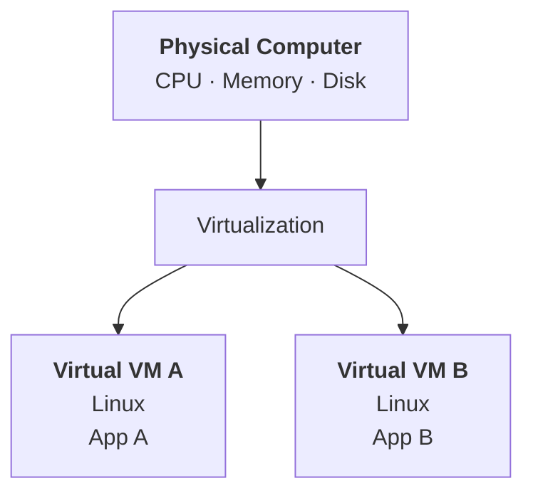

Each VM has its own operating system environment and behaves like a separate computer, even though the VMs share underlying physical hardware.

> **A VM lets software divide physical computing resources into separate virtual computers.**

---

## 2. Why Virtual Machines Exist

Without virtualization, an organization might need a separate physical server for each workload.

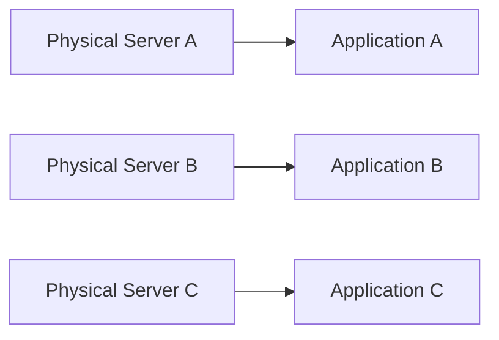

This can waste capacity when each application uses only a small portion of its server.

Virtualization allows multiple workloads to share a physical host:

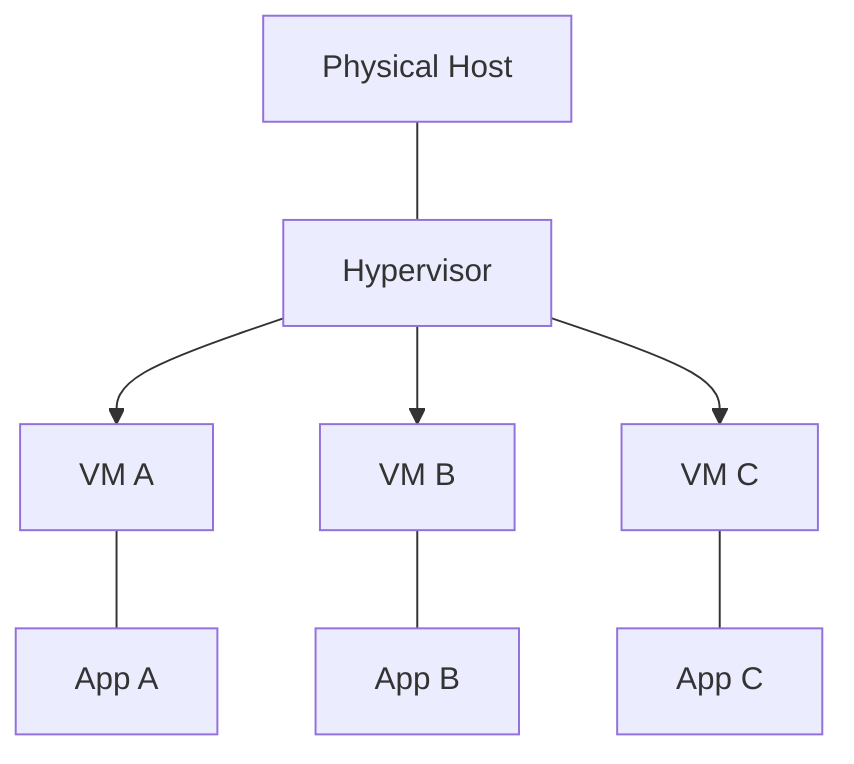

Potential benefits include:

- Better utilization of physical hardware.
- Separate operating system environments.
- Flexible allocation of resources.
- Easier creation and replacement of server environments.
- A foundation for cloud compute services.

Virtualization does not guarantee perfect resource isolation or eliminate hardware failures. The physical host remains a shared dependency.

---

## 3. What Is a Hypervisor?

A **hypervisor** is the software layer responsible for creating and managing virtual machines.

It coordinates access to physical resources and presents virtual hardware to each VM.

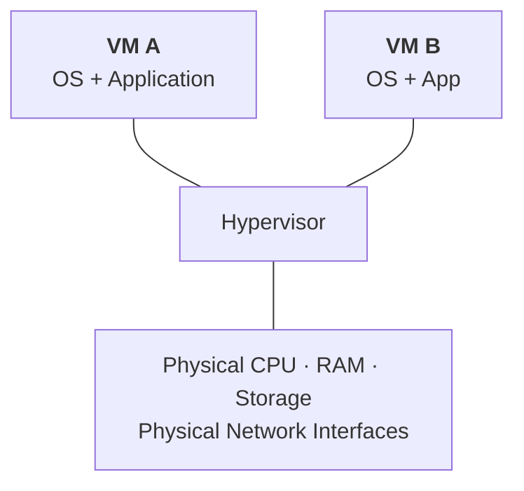

There are two common categories.

| Type | Basic idea |
|---|---|
| Type 1 | Runs directly on the physical hardware |
| Type 2 | Runs on top of a host operating system |

Type 1 hypervisors are common in server virtualization and data centers. Type 2 hypervisors are common for desktop development and testing.

The exact implementation varies by platform.

---

## 4. What Does a VM Contain?

A VM typically has a virtual hardware configuration and a guest operating system.

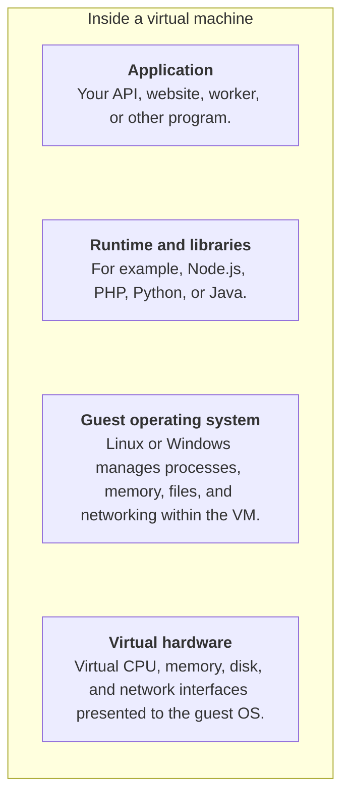

For example, you might create a Linux VM, install Nginx and PHP, configure a database connection, and deploy your web application.

The VM provides the server environment; the application still needs to be installed, configured, secured, and maintained according to your deployment model.

---

## 5. How Cloud VMs Work

Cloud providers operate physical infrastructure and use virtualization or related isolation technologies to offer compute instances.

A simplified view:

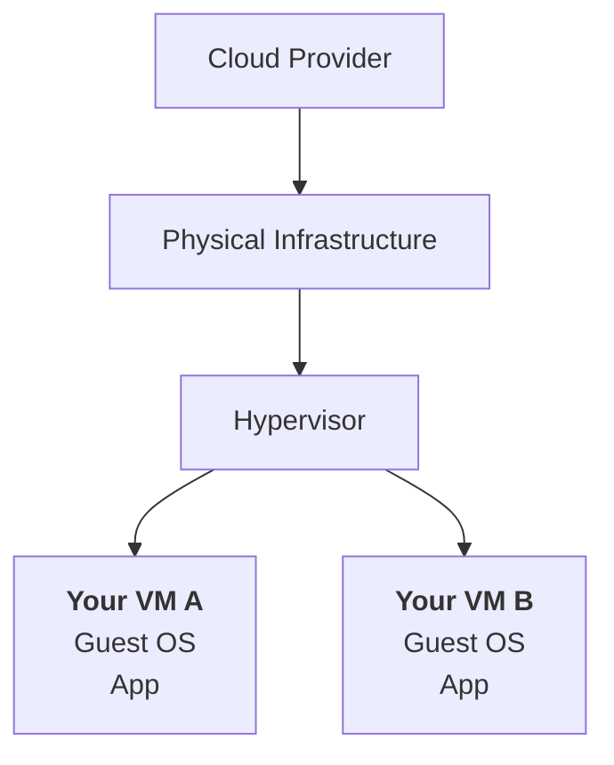

You choose a VM configuration, such as its CPU and memory capacity, and the provider makes a virtual machine available.

The provider generally manages the physical hardware and underlying virtualization infrastructure. Your responsibility for the guest operating system and application depends on the service and management model.

For example, in a typical cloud VM service, you may still need to:

- Patch the operating system.
- Install application runtimes.
- Configure firewall rules and access.
- Manage application deployment.
- Monitor performance and logs.
- Plan backups and recovery.

> **A cloud VM gives you a virtual server; it does not automatically operate your application for you.**

---

## 6. VM Resources: CPU and Memory

When creating a VM, you select a resource configuration.

For example:

```text
VM Configuration
──────────────────────
Virtual CPU:  2
Memory:       4 GB
Storage:      50 GB
Network:      Virtual interface
```

These are illustrative values, not a recommendation for every workload.

A larger VM may help when the workload needs more CPU or memory. But increasing VM size does not automatically solve a database bottleneck, a slow external API, or inefficient application logic.

Also, virtual CPU allocation does not necessarily mean exclusive ownership of a physical CPU core. The provider's implementation and instance type determine how physical resources are allocated and shared.

---

## 7. Storage Attached to a VM

A VM needs storage for its operating system, installed software, temporary files, and potentially application data.

Conceptually:

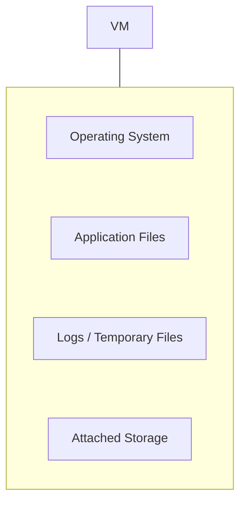

Storage may be local to the physical host or provided through a separate storage system, depending on the platform and configuration.

This distinction matters for failure and recovery.

For example, data stored only on temporary or instance-local storage may not survive a VM replacement or host failure. Persistent cloud volumes may offer different durability and recovery characteristics.

**Never assume that all VM storage is persistent.** Check the specific storage type and its documented behavior.

Object storage, block storage, and other cloud storage models are covered in later chapters.

---

## 8. VM Networking

A VM usually has a virtual network interface that allows it to communicate with other systems.

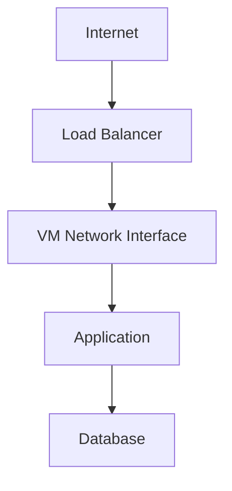

Network configuration determines which systems can reach the VM and what the VM can access.

Depending on the cloud platform, configuration may involve:

- Virtual networks and subnets.
- Private and public addresses.
- Firewall rules or security groups.
- Routing.
- Network access controls.

A VM does not have to be directly reachable from the public internet. In many architectures, application VMs sit behind a load balancer in a private network.

---

## 9. Isolation: What a VM Does and Does Not Guarantee

VMs provide a separate guest operating system environment and a virtualization boundary.

For example:

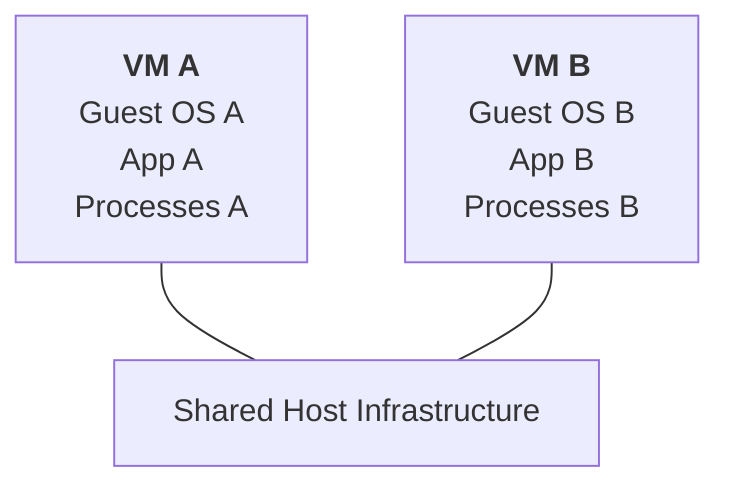

A process inside one VM normally operates within that VM's operating system environment rather than directly managing the other VM's processes.

However, isolation is not absolute in every threat model. Hypervisor vulnerabilities, incorrect configuration, shared resource exhaustion, and physical-host failures can still affect multiple VMs.

Therefore, virtualization is one layer of isolation—not a substitute for application security, access controls, or resilient architecture.

---

## 10. VM Failure and the Shared Host

Imagine two VMs running on one physical host.

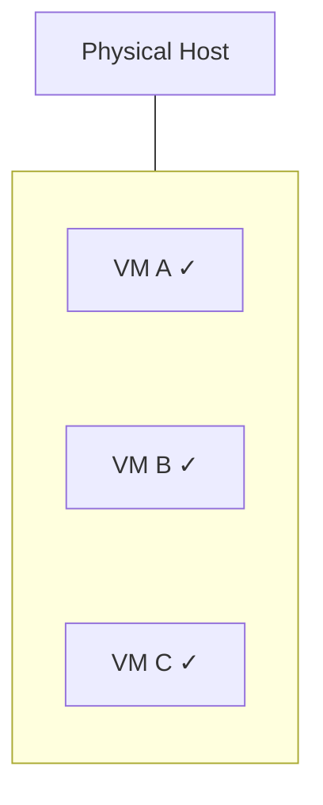

If an individual VM or its guest operating system fails, the other VMs may continue operating.

But if the physical host experiences a failure:

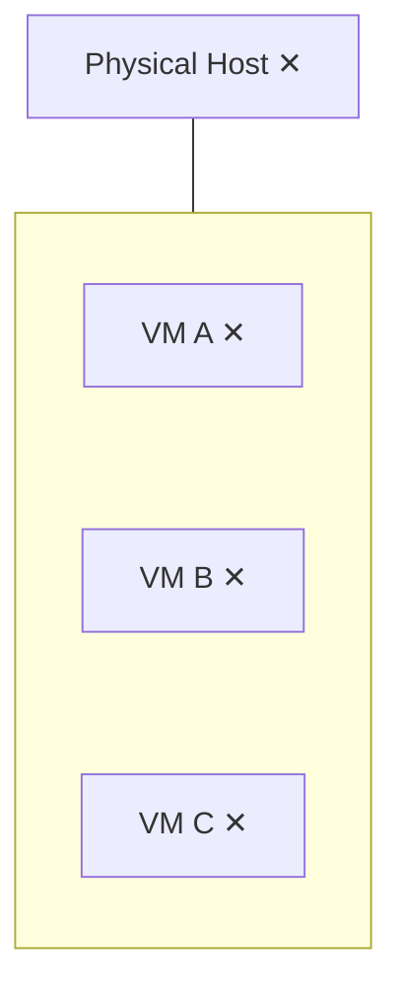

Multiple VMs may become unavailable together.

This is a **shared failure domain**.

Running three VMs does not automatically provide three independent failure domains. Their placement and the provider's infrastructure matter.

For important workloads, consider how instances are distributed across independent hosts or availability zones and how the application behaves when one is lost.

---

## 11. Scaling a VM-Based Application

Suppose your application runs on one VM:

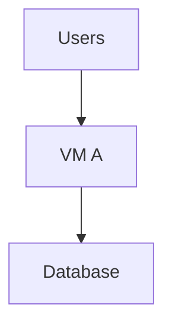

If the workload grows, you have two common options.

**Option A: Increase the VM's resources**

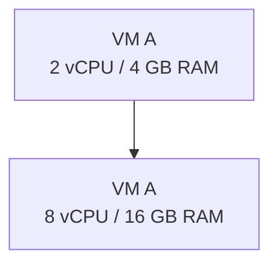

This is vertical scaling.

**Option B: Add more VMs**

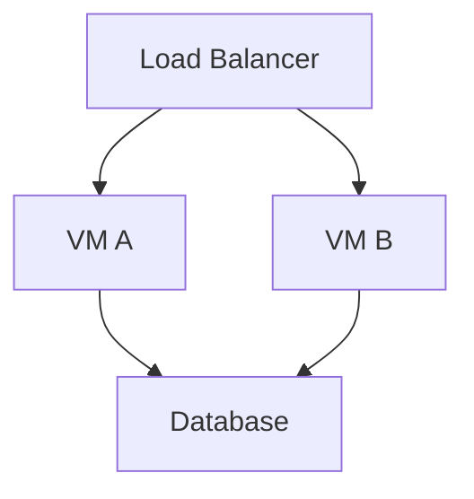

This is horizontal scaling.

Horizontal scaling requires more than copying the application to another VM. You must consider request distribution, shared state, deployments, health checks, and the capacity of dependencies.

These are extensions of the scaling concepts already covered in Level 2.

---

## 12. VM Images and Repeatability

Creating every VM manually can lead to inconsistent environments.

For example:

```text
VM A → PHP 8.2, configuration A
VM B → PHP 8.3, configuration B
VM C → Missing extension
```

This can create deployment and debugging problems.

A **VM image** is a reusable template from which a VM can be created. Depending on the platform, it may include an operating system and preinstalled software.

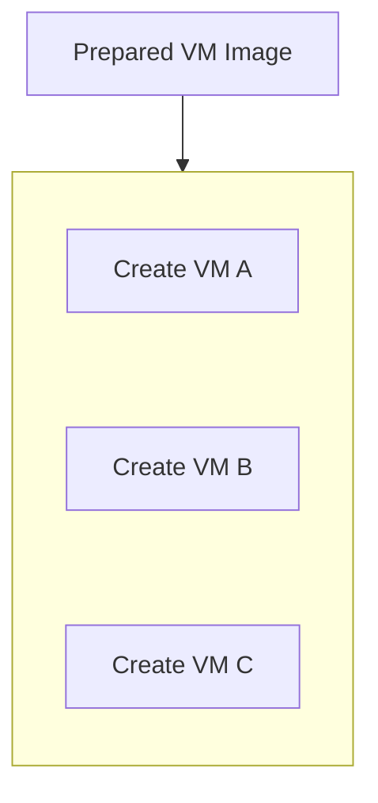

Images can help make environments more consistent, but they still need maintenance, patching, versioning, and secure configuration.

Infrastructure as Code and automated image pipelines can improve repeatability; those practices are covered later.

---

## 13. Operational Responsibilities

VMs offer considerable control, but that control comes with responsibilities.

| Area | Typical consideration |
|---|---|
| Operating system | Patching, updates, and supported versions |
| Application | Deployment, configuration, and rollback |
| Security | Identity, permissions, firewall rules, and hardening |
| Monitoring | CPU, memory, disk, network, logs, and application health |
| Capacity | Instance sizing, headroom, and scaling |
| Recovery | Images, persistent storage, backups, and replacement |
| Availability | Redundant instances and independent failure domains |
| Cost | Instance runtime, attached storage, network transfer, and other charges |

The provider may automate some of these tasks, but the responsibility boundary must be understood rather than assumed.

---

## 14. When Virtual Machines Make Sense

VMs can be a good choice when you need:

- Strong control over the operating system environment.
- Support for legacy applications or specific OS dependencies.
- Custom system packages or background processes.
- A familiar server administration model.
- Workloads that run continuously.
- A straightforward migration from an existing physical server.
- Flexible installation and configuration of application software.

VMs may be less attractive when you want to minimize operating-system maintenance, deploy many small independently managed workloads, or run short-lived tasks without maintaining server environments.

Other compute models may fit those requirements better. We will compare them in the following chapters.

---

## 15. Hands-On Exercise

Imagine you are deploying a PHP and MySQL application.

Your initial design is:

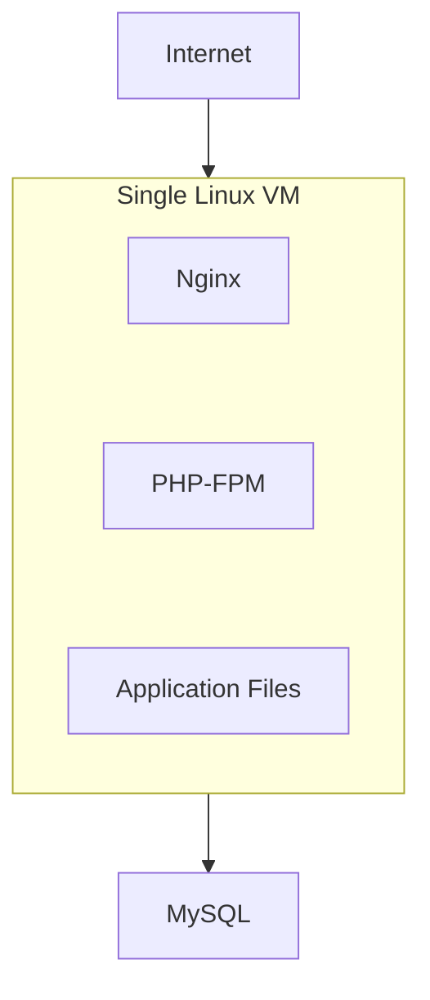

Review the design by answering these questions:

1. What happens if the VM's operating system crashes?
2. What happens if the physical host fails?
3. Where are the database files stored?
4. Are the database files on persistent storage?
5. How would you deploy a replacement VM with the same configuration?
6. What happens when the application needs more compute capacity?
7. How would you prevent the VM from being exposed unnecessarily to the public internet?

Now consider this alternative:

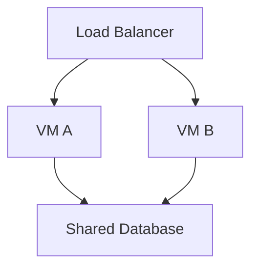

Ask:

- Does having two VMs protect against every failure?
- Are both VMs in the same failure domain?
- Can both VMs safely access the same application state?
- Is the database itself a single point of failure?

The goal is not to build the most complicated architecture. It is to identify the failure scenarios your requirements justify handling.

---

## 16. Trade-Offs at a Glance

| Advantage | Cost or limitation |
|---|---|
| Separate guest OS environments | Each VM requires resources and operating-system management |
| Flexible software installation | More patching and configuration responsibility |
| Familiar server model | Manual management can create configuration drift |
| Vertical and horizontal scaling options | Scaling requires capacity and deployment planning |
| VM images support repeatability | Images need patching and version management |
| Cloud providers manage physical infrastructure | Shared host and provider-level dependencies remain |
| Broad workload compatibility | Often more overhead than lighter-weight execution models |

---

## 17. Common Mistakes

- **Treating a VM as a physical server with guaranteed dedicated hardware:** Virtual CPU and other resources depend on the platform's allocation model.
- **Assuming all storage persists:** Storage behavior depends on the storage type and configuration.
- **Running multiple VMs on one host and assuming full redundancy:** Shared failure domains still matter.
- **Exposing every VM directly to the internet:** Use appropriate network boundaries and access controls.
- **Manually configuring every instance:** Reusable images and automation reduce drift.
- **Scaling VM capacity without measuring:** The bottleneck may be elsewhere.
- **Assuming the cloud provider manages the guest OS:** Responsibilities depend on the chosen service.
- **Forgetting replacement and recovery:** A VM should be replaceable when the architecture requires it.

---

## 18. Key Principle

> **A Virtual Machine provides a virtual computer with its own operating system environment and allocated resources. It gives you control and isolation, but also creates operating-system, security, capacity, and recovery responsibilities.**

Choose a VM when that control is valuable. Design explicitly for shared dependencies, failure domains, and replacement.

---

## 19. Quick Reference

| Concept | Meaning |
|---|---|
| Virtual Machine (VM) | Software-defined computer with virtualized resources |
| Hypervisor | Layer that creates and manages VMs |
| Host | Physical computer providing underlying resources |
| Guest OS | Operating system running inside a VM |
| VM image | Reusable template for creating VMs |
| Virtual CPU | CPU capacity presented to a VM |
| Persistent storage | Storage designed to retain data beyond an instance's temporary lifecycle, according to its guarantees |
| Failure domain | Components that may fail together |
| Vertical scaling | Increasing resources assigned to an instance |
| Horizontal scaling | Adding instances to distribute workload |

---

## 20. Knowledge Check

1. What is a Virtual Machine?
2. What role does a hypervisor perform?
3. How is a guest operating system different from the host infrastructure?
4. Why can multiple VMs share one physical failure domain?
5. Does a VM automatically provide persistent storage?
6. What is the trade-off between VM control and operational responsibility?
7. How can VM images improve deployment consistency?
8. Why is running multiple VMs not enough to guarantee high availability?

---

## Remember

A VM is a virtual computer, not a complete reliability strategy.

It gives you a flexible environment for running applications, while the provider manages the underlying physical infrastructure according to the service model.

**Next: 08.04 — Containers**
