# 08.04 — Containers

## Learning Objectives

By the end of this chapter, you should be able to:

- Explain what a container is and why containers exist.
- Distinguish a container image from a running container.
- Understand how containers differ from virtual machines.
- Explain the role of container runtimes and image registries.
- Understand container networking, configuration, and persistent storage.
- Recognize the benefits, costs, and security considerations of containers.
- Understand when containerization is useful in system design.

---

## 1. What Is a Container?

Suppose you build a Node.js application on your computer. It works perfectly.

You deploy it to a server, but it fails because the server has a different Node.js version or is missing a required library.

The problem is an environment mismatch.

A **container** packages an application with its runtime and required dependencies into a consistent, isolated execution environment.

Instead of configuring every server manually, you can run the application using the same container image across compatible environments.

> **A container packages an application's execution environment so it can run consistently across compatible systems.**

Containers are widely used for deploying web applications, APIs, background workers, and other services.

## 2. How Does a Container Work?

In the common Linux container model, containers share the host operating system's kernel while receiving isolated process, filesystem, networking, and resource views.

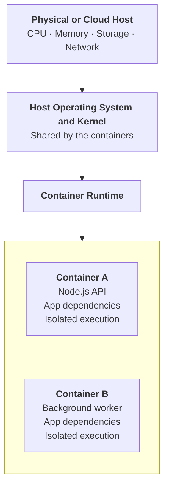

Containers are not complete virtual computers. They use operating-system isolation mechanisms to run processes with separate environments while sharing the host kernel.

This shared-kernel design is a major reason containers are typically lightweight.

---

## 3. Container Image vs Container

These two terms are related, but they mean different things.

**Container image**

The packaged template.

Contains the application, runtime, required libraries, and filesystem content needed to start a container. Images are commonly built in layers and distributed through registries.

**Container**

A running instance of an image.

When you start an image, the runtime creates a container with its own execution state and, commonly, a writable layer.

Think of it this way:

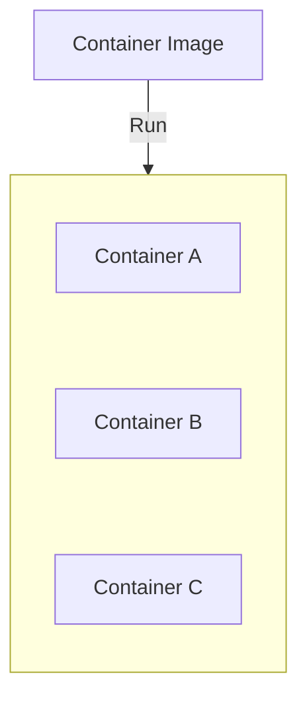

One image can be used to start multiple containers.

For example, you might run three identical API containers to handle incoming traffic.

---

## 4. The Container Lifecycle

A typical container deployment follows this flow:

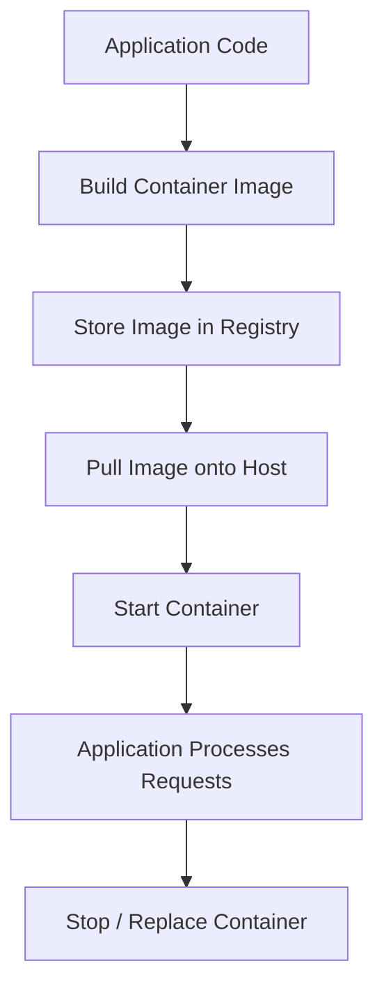

A **container registry** stores and distributes images. It may be public or private.

A **container runtime** is responsible for creating and running containers. Docker is a popular container platform and tooling ecosystem, but containers are a broader technology.

The important distinction is that you build and distribute the image, then run containers from it.

---

## 5. Containers vs Virtual Machines

You have already learned about virtual machines in **08.03**. The key difference is how the execution environment is provided.

**Virtual machines**

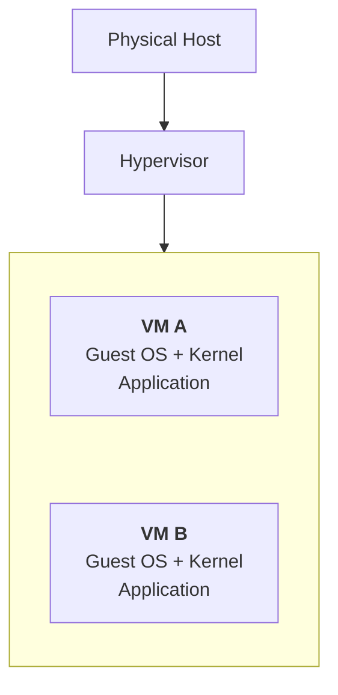

**Containers**

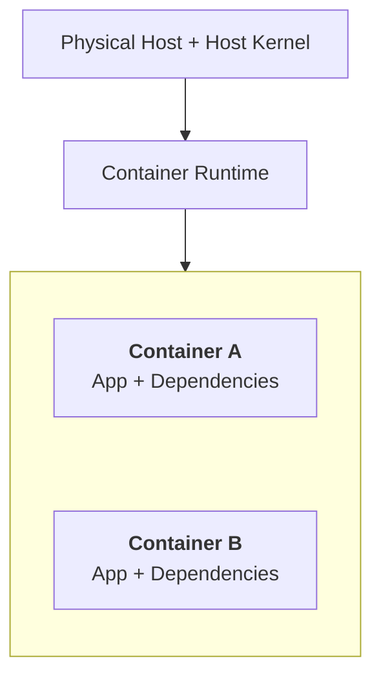

Simplified conceptual diagrams. Actual virtualization and container-runtime stacks vary by platform.

| Dimension | Virtual Machine | Container |
|---|---|---|
| Operating system | Each VM has its own guest OS and kernel | Commonly shares the host kernel |
| Typical overhead | Higher, partly due to guest OS resources | Lower, often allowing greater workload density |
| Startup | Usually slower | Usually faster |
| Isolation | Virtualized machine boundary | Operating-system-level isolation |
| OS flexibility | Can run a different supported guest OS | Must be compatible with the host kernel |
| Best fit | OS-level control, different guest OS needs, traditional workloads | Consistent packaging, repeatable deployment, application services |

Containers are not automatically as strongly isolated as virtual machines. Both can be secure when configured appropriately, but they have different isolation boundaries and threat models.

**Important:** Linux containers require a compatible Linux kernel. On Windows or macOS, Docker commonly uses a Linux virtual machine to run Linux containers.

---

## 6. Why Use Containers?

Containers help solve several practical deployment problems.

- **Consistency:** Package the runtime and dependencies with the application.
- **Repeatability:** Build an image and deploy the same artifact to different environments.
- **Resource efficiency:** Run multiple isolated workloads without requiring a separate guest OS for each container.
- **Deployment flexibility:** Replace or roll back application versions by deploying different image versions.
- **Scaling:** Start additional container instances when more capacity is needed.
- **Automation:** Integrate image building and deployment into CI/CD pipelines.

For example:

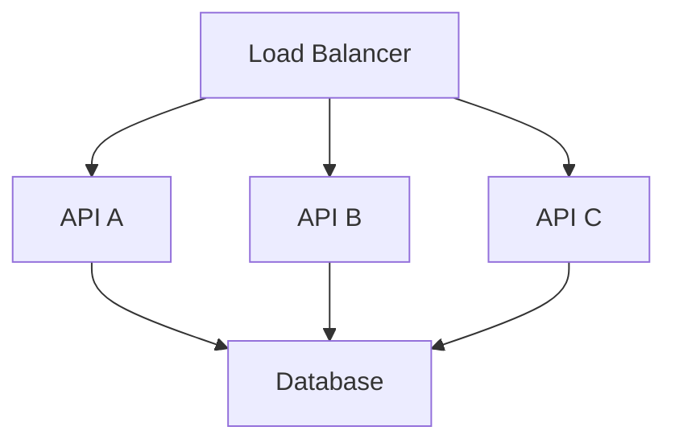

The three API instances can run from the same image. Each container handles requests independently, while the database remains a shared dependency.

But containers do not automatically provide load balancing, automatic scaling, or high availability. Those capabilities require additional infrastructure and configuration.

---

## 7. Containers Are Usually Replaceable

A container should generally be treated as **disposable execution capacity**, not as the permanent home of important data.

Suppose a container stores uploaded files only in its writable layer:

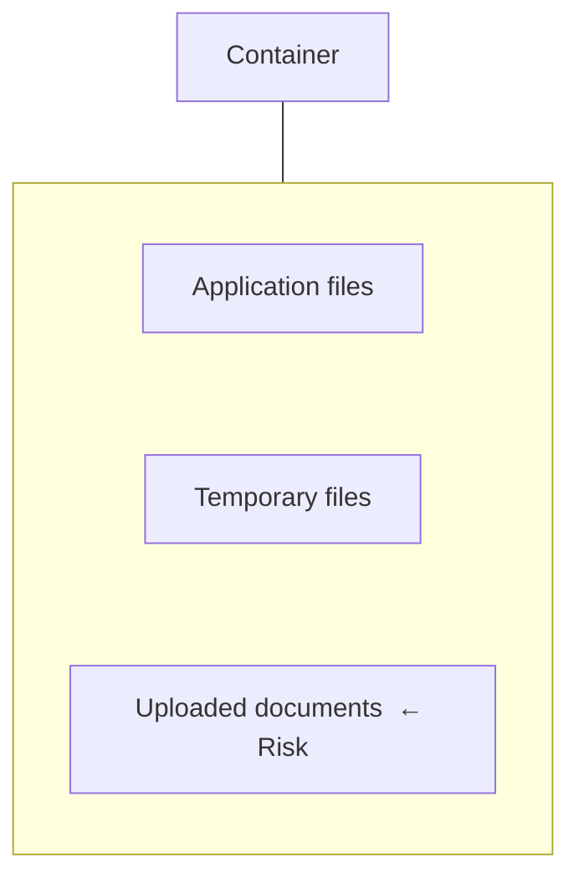

If the container is removed and replaced, data in that writable layer may be lost.

A safer architecture separates application execution from persistent data:

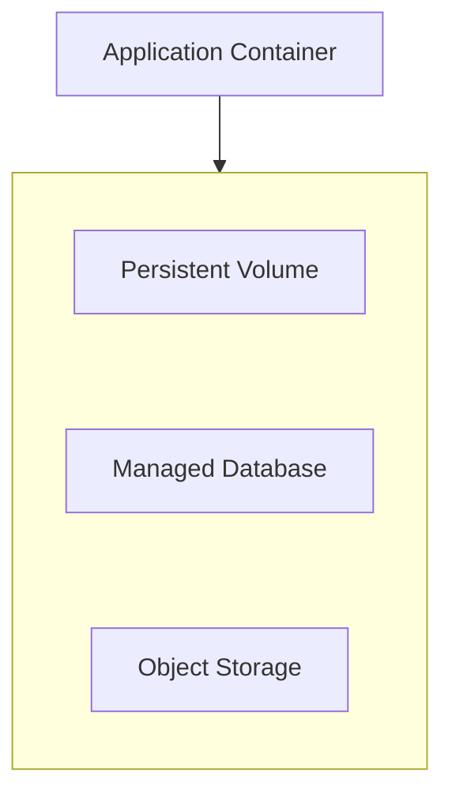

Choose the storage system based on the data:

| Data | Common choice |
|---|---|
| Temporary files | Container filesystem |
| Database records | Database service or properly managed database storage |
| User uploads and media | Persistent storage or object storage |
| Shared files | Shared persistent storage, when appropriate |

Containers can run stateful workloads, too. The key is to design persistence and recovery explicitly rather than assuming the container's writable layer will survive replacement.

---

## 8. Configuration and Secrets

The image should contain the application and its required dependencies, not environment-specific settings or production secrets.

For example, the same image may be deployed to development and production:

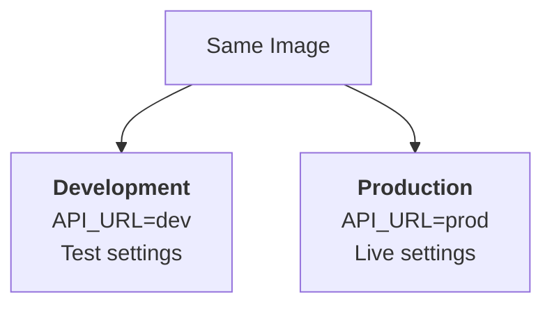

Provide environment-specific configuration at runtime through the deployment environment or a suitable configuration mechanism.

Passwords, API keys, and database credentials require a proper secrets-management approach. **Do not bake production secrets into an image or commit them into its source files.** Anyone with access to the image may be able to inspect its contents or history.

Related chapters: **07.11 — Configuration Management** and **07.12 — Secrets Management**.

---

## 9. Networking and Resource Limits

A container is isolated, but it still needs to communicate with other components.

For example:

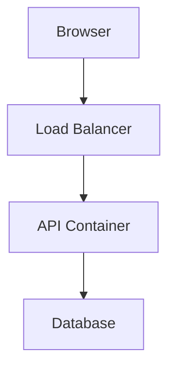

Container networking and port configuration determine how the API can be reached and how it communicates with dependencies.

Containers should also have appropriate CPU and memory limits where supported. Without sensible resource management, one workload may consume too much of the host's capacity and affect other workloads.

Common operational considerations include:

- Health checks and restart behavior.
- CPU and memory limits.
- Network and port exposure.
- Logs and metrics.
- Image versioning and vulnerability scanning.
- Access permissions and least privilege.

The exact configuration depends on the runtime and deployment platform.

---

## 10. Trade-offs and Failure Modes

| Benefit | Cost or risk |
|---|---|
| Consistent application packaging | Images must be built, stored, scanned, and updated |
| Lightweight execution | Containers still consume CPU, memory, and storage |
| Fast replacement | Local writable data may disappear |
| Shared host resources | Host or kernel failure can affect multiple containers |
| Process isolation | Shared-kernel isolation is not equivalent to a separate VM |
| Easy replication | Replicas can overload a shared database or API |
| Automated deployment | Orchestration and operations add complexity |

One container failing does not necessarily mean the host has failed. Conversely, two containers on the same host do not represent two independent physical failure domains.

Containers improve packaging and deployment. They do not remove the need for reliability, security, capacity planning, or observability.

---

## 11. Hands-On Exercise

You can use Docker or another compatible container tool to explore the concepts with a small PHP or Node.js application.

### Step 1 — Package the application

Create a container image containing:

- Your application code.
- The required runtime.
- Necessary dependencies.

A Dockerfile describes how to build an image. You do not need to master every Dockerfile instruction yet.

### Step 2 — Build and run

Build the image, then start a container from it.

Verify that the application works.

### Step 3 — Replace the container

Stop and remove the container, then create a new one from the same image.

Observe which application state returns and which temporary changes disappear.

### Step 4 — Test persistence

Write a test file into the container's writable layer. Remove and recreate the container.

Then repeat using a persistent volume or an external storage service.

Observe the difference.

### Step 5 — Test configuration

Run the same image with different non-secret configuration values supplied at runtime.

Confirm that you do not need a different application image for each environment.

### Reflection

- What belongs in the image?
- What should survive container replacement?
- Which settings change between environments?
- What happens if the host fails?
- How would you run multiple instances without overloading the database?

The goal is to understand the deployment model, not simply memorize commands.

---

## 12. Common Mistakes

- **Treating a container as a VM:** Containers commonly share the host kernel.
- **Storing permanent data only inside a container:** Replacement may lose writable-layer changes.
- **Baking secrets into images:** Image access can expose credentials.
- **Assuming containers guarantee scalability:** Additional instances still depend on available compute and downstream capacity.
- **Assuming multiple containers mean high availability:** They may share the same host or other failure domains.
- **Confusing containers with microservices:** A container is a packaging and execution mechanism; it can run part of a monolith, a service, or a worker.
- **Assuming portability is absolute:** Host kernel, CPU architecture, runtime, and platform compatibility still matter.

---

## 13. System Design View

Containers answer this question:

> **How can we package and run application workloads consistently without managing a separate guest operating system for every application instance?**

They are one layer in the architecture, not the architecture itself.

A containerized application still needs decisions about:

- Where it runs.
- How it receives traffic.
- How it stores persistent data.
- How configuration and secrets are supplied.
- How it scales and recovers.
- How its resource consumption is controlled.

Start with a container when consistent packaging and deployment are useful. Add orchestration or more complex infrastructure when the workload and operational requirements justify it.

## Key Principle

> **A container packages and isolates application execution, not an entire machine. Treat containers as replaceable, keep persistent state outside their writable layer, and manage configuration and secrets separately from the image.**

## Quick Reference

| Term | Meaning |
|---|---|
| Container image | Packaged template used to create containers |
| Container | Running instance of an image |
| Container runtime | Software that creates and runs containers |
| Image registry | Storage and distribution system for images |
| Host kernel | Operating-system kernel commonly shared by containers |
| Writable layer | Container-specific writable filesystem layer |
| Persistent volume | Storage designed to outlive a container |
| Containerization | Packaging and running applications in containers |
| Orchestration | Coordinating deployment, placement, scaling, and recovery of many containers |

## Knowledge Check

1. What is the difference between a container image and a running container?
2. Why are containers typically lighter than virtual machines?
3. Why can data disappear when a container is replaced?
4. Why should production secrets not be baked into a container image?
5. Do three containers on one host provide three independent failure domains?
6. Does containerization automatically make an application scalable?
7. Can a monolithic application run in a container?

### Answers

1. An image is the packaged template; a container is a running instance created from it.
2. Containers commonly share the host kernel rather than each running a separate guest OS.
3. Data stored only in the container's writable layer may not survive removal or replacement.
4. People with access to the image may be able to inspect its contents or history and discover the secrets.
5. No. A shared host failure can affect all three containers.
6. No. Scaling also depends on traffic routing, capacity, application behavior, and downstream dependencies.
7. Yes. Containers are a packaging and execution mechanism, not a requirement to use microservices.

## Remember

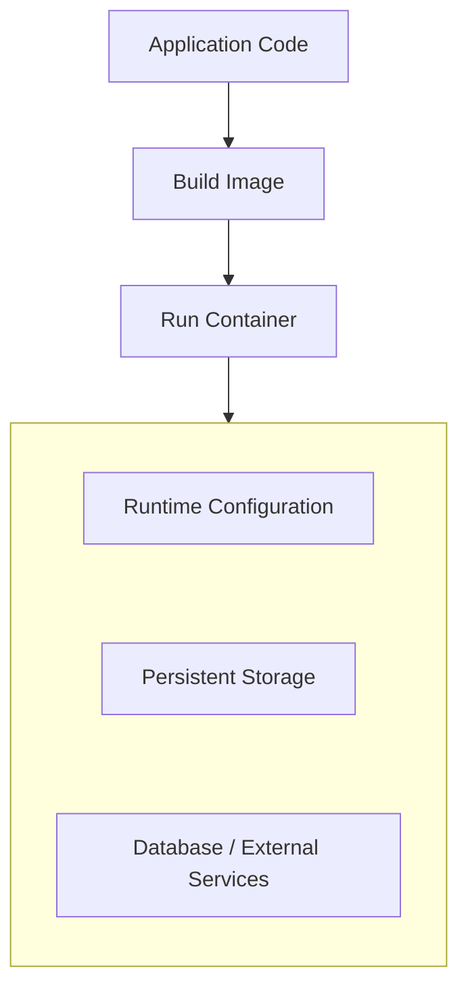

Containers make application deployment more consistent and replaceable. They do not eliminate infrastructure responsibilities or guarantee isolation, persistence, or availability.

**Next: 08.05 — Serverless**
