# 08.05 — Serverless

## Learning Objectives

By the end of this chapter, you should be able to:

- Explain what serverless computing means.
- Understand how serverless differs from virtual machines and containers.
- Distinguish Functions as a Service (FaaS) from other serverless services.
- Understand invocation, execution, scaling, and billing at a high level.
- Recognize cold starts, execution limits, and concurrency constraints.
- Identify when serverless is a good fit and when it may not be.
- Understand how serverless applications depend on databases, queues, storage, and other services.

---

## 1. What Is Serverless?

Every application needs computing resources to execute its code. Traditionally, a team might provision a virtual machine, install the runtime, configure the application, and maintain the environment.

Containers can simplify packaging, but the team still needs somewhere to run them.

Serverless computing moves more of the underlying infrastructure management to a cloud provider.

> **Serverless lets you use computing capabilities without directly managing the underlying servers in the traditional way.**

The servers still exist. The cloud provider manages much of the infrastructure, while you focus on application code, configuration, permissions, and business logic.

For example, imagine a service that generates a thumbnail whenever a user uploads an image.

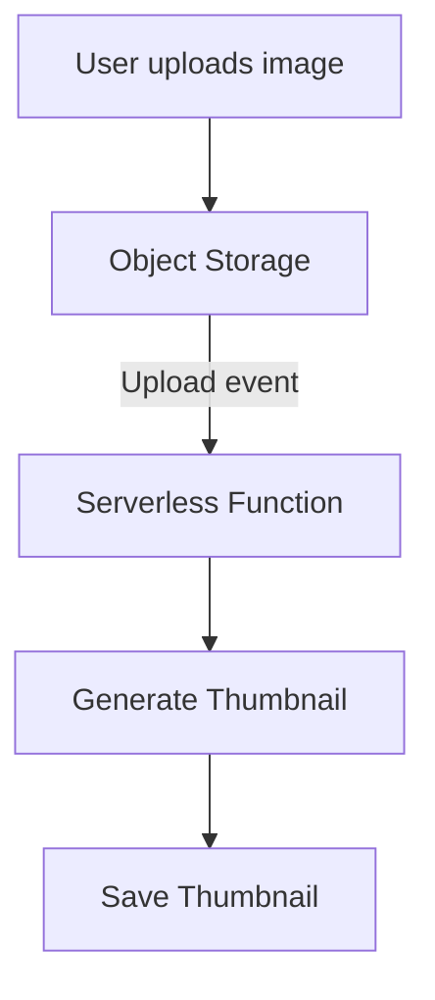

The function runs when triggered. You don't necessarily need to keep a dedicated application server running just to wait for the next upload.

---

## 2. How Does Serverless Work?

A common serverless execution model uses a function that runs in response to an event or request.

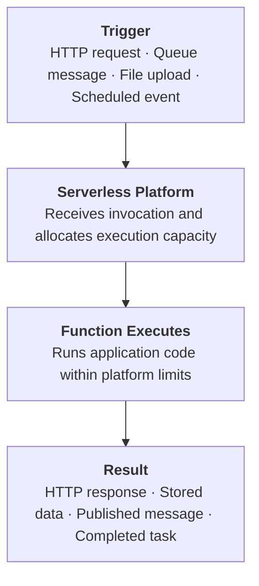

The platform handles much of the execution infrastructure. Depending on the service, it may also handle instance provisioning, scaling, patching of the underlying environment, and execution isolation.

You remain responsible for the correctness and security of your application and its data.

---

## 3. What Does "Serverless" Actually Mean?

Serverless does **not** mean:

- There are no servers.
- Code executes without CPU or memory.
- Applications never need scaling decisions.
- Everything is automatically secure.
- The application cannot fail.
- You never pay when using the service.

It means the provider abstracts away much of the server management.

You typically specify what code or workload should run and configure limits such as memory, concurrency, timeout, and permissions, depending on the platform.

---

## 4. Serverless vs VMs vs Containers

You have now studied virtual machines and containers. Serverless is another way to consume compute.

**Virtual machine**

You manage the guest OS and application environment; the provider or hypervisor manages the underlying physical infrastructure in a cloud VM service.

**Container**

You package the application into an image. You also need a runtime or platform to schedule and run its containers.

**Serverless function**

You supply the code and execution settings. The platform manages much of the infrastructure required to invoke and run it.

| Dimension | VM | Container platform | Serverless function |
|---|---|---|---|
| Infrastructure control | High | Depends on platform | Lower |
| OS management | Often your responsibility | Depends on platform | Mostly provider-managed |
| Execution model | Long-running processes are common | Long-running or task-based workloads | Commonly request/event-driven |
| Scaling | Manual or automated | Manual or automated orchestration | Often automatic within configured limits |
| Billing model | Often provisioned capacity over time | Platform-dependent | Often based on invocations and execution resources |
| Operational work | More OS and infrastructure work | Image, runtime, and platform work | More focus on code, triggers, permissions, and service integration |

These are common patterns, not absolute rules. Some managed container services and serverless platforms overlap considerably.

---

## 5. Functions as a Service (FaaS)

**Functions as a Service (FaaS)** is a common serverless model in which the cloud platform executes a function in response to an invocation.

For example:

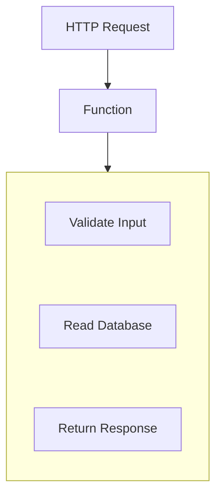

The function is usually designed around a relatively focused task or handler.

Typical use cases include:

- Processing uploaded files.
- Handling lightweight API requests.
- Responding to queue messages.
- Sending notifications.
- Running scheduled maintenance tasks.
- Performing event-driven data transformations.

FaaS is only one part of serverless. Managed databases, object storage, messaging, and other cloud services may also provide serverless consumption models.

---

## 6. Invocation and Execution

An **invocation** is an event or request that causes a function to run.

Consider a thumbnail generator:

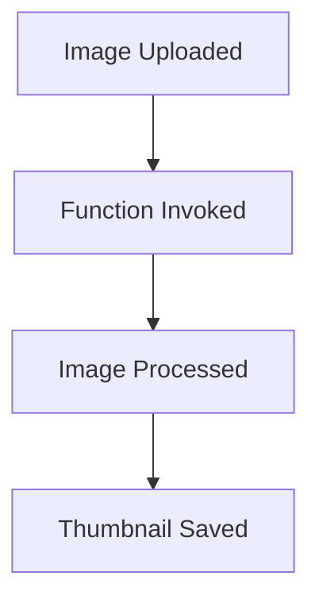

Depending on the platform, the function may run in an existing execution environment or the platform may need to initialize one.

The same function may be invoked many times. The platform may use multiple execution environments to process concurrent invocations.

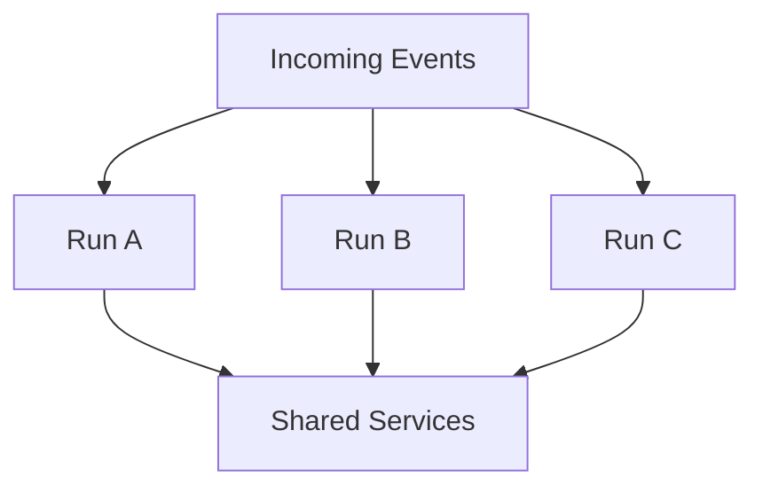

The number of simultaneous executions is affected by platform limits, account quotas, configured concurrency, and downstream capacity.

**Automatic scaling does not mean unlimited scaling.**

---

## 7. Cold Starts

A **cold start** occurs when a platform needs to initialize an execution environment before handling an invocation.

That setup may include preparing the runtime and loading application code or dependencies.

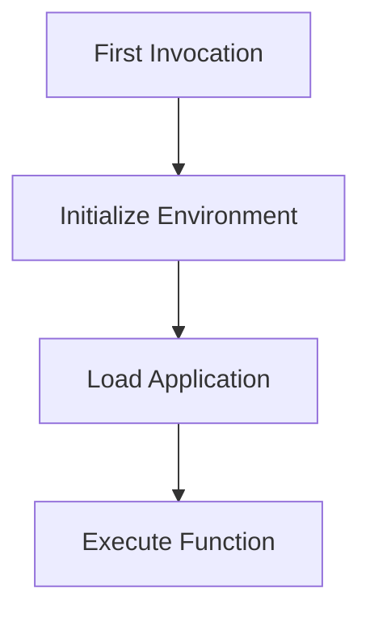

A later invocation may reuse a warm environment, depending on the platform's lifecycle decisions.

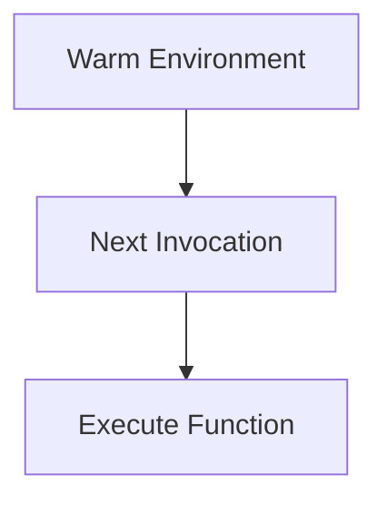

This means some invocations may have higher latency than others.

Cold-start behavior varies by provider, runtime, package size, configuration, and workload. Some platforms offer features to reduce initialization latency, sometimes at additional cost.

### When does this matter?

It can matter for latency-sensitive operations such as user-facing APIs.

It may matter less for background jobs where a small initialization delay is acceptable.

---

## 8. Stateless Execution and Temporary State

A function should not assume that local memory or temporary files will survive indefinitely between invocations.

The platform may reuse an execution environment, but it may also replace it.

Therefore, distinguish between:

- **Temporary state:** Intermediate files or data needed only during execution.
- **Persistent state:** Orders, customer records, uploaded documents, and other data that must survive replacement.

A safer design is:

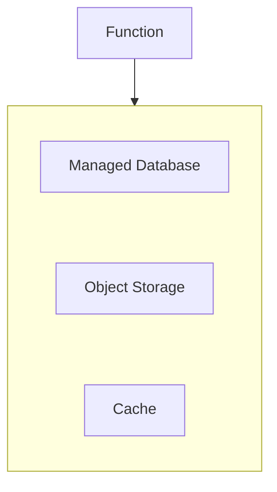

You can use in-memory variables or temporary storage during execution, but important state should live in a suitable persistent service.

Do not depend on one function instance's local memory as the authoritative source of application state.

---

## 9. Timeouts and Execution Limits

Serverless functions commonly have execution-duration limits, along with resource and concurrency constraints.

For example, imagine a function that must finish within its configured execution deadline.

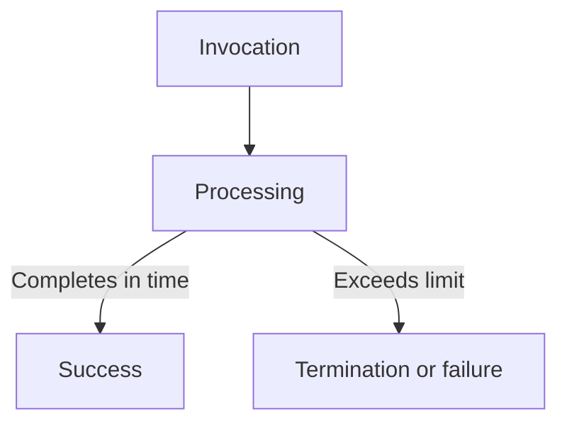

Exact limits differ by provider and service.

This makes serverless a good fit for bounded tasks, but potentially a poor fit for work that must run for a very long time.

A common design for longer work is:

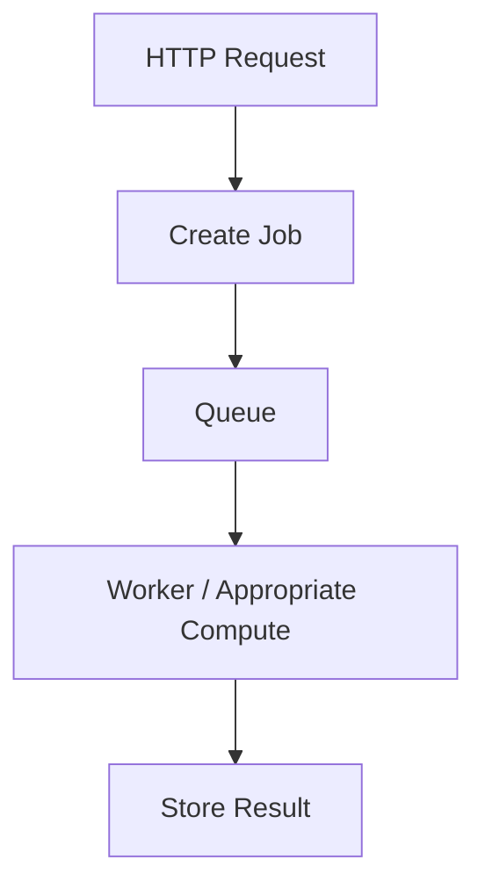

A short-lived function can accept or schedule work without requiring the user's HTTP request to remain open until the entire job finishes.

Related topic: **02.10 — Timeouts**.

---

## 10. Cost Model

Serverless services often charge according to a combination of invocations, execution duration, allocated resources, and other service-specific factors.

This can be attractive when workloads are intermittent.

Consider a function that runs only when an image is uploaded:

```text
Most of the time:
Few or no invocations

During upload activity:
More invocations
```

You may avoid paying for a dedicated application instance that must remain provisioned solely to wait for work.

However, serverless is **not automatically cheaper**.

Costs may grow due to:

- High invocation volume.
- Long execution durations.
- Larger memory or compute allocations.
- Excessive retries.
- Data transfer.
- Requests to other managed services.
- Logging, networking, and supporting infrastructure.

A continuously busy workload may be cheaper or more predictable on provisioned compute, depending on its requirements and pricing.

### Compare the workload, not just the headline price.

---

## 11. A Simple Cost Thought Experiment

Imagine two workloads.

**Workload A**

Occasional processing

Runs when files arrive, with long idle periods.

Serverless may avoid paying for idle compute capacity.

**Workload B**

Continuous processing

Runs at high utilization throughout the day.

Provisioned compute may be competitive or easier to predict.

These are starting hypotheses, not universal cost rules. Measure actual usage and compare the complete bill, including dependent services.

---

## 12. Serverless and Databases

One common failure occurs when serverless concurrency grows faster than database connection capacity.

Imagine each function invocation opens a new database connection.

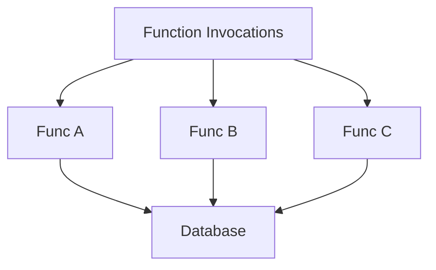

If hundreds of functions run concurrently, they may create too many connections or too much database work.

The function platform may scale successfully while the database becomes overloaded.

Possible design choices include:

- Using a database connection-management feature suited to the platform.
- Reusing connections where the runtime and lifecycle make that safe.
- Limiting function concurrency.
- Batching database operations.
- Reducing unnecessary queries.
- Using asynchronous processing to control load.

The correct solution depends on the database, runtime, and deployment platform.

> **Serverless compute can scale faster than its dependencies can safely handle.**

This connects directly to **01.12 — Connection Pooling** and **02.15 — Connection Limits**.

---

## 13. Serverless Is More Than Functions

Not every serverless architecture is built around a function.

A serverless application may combine managed services:

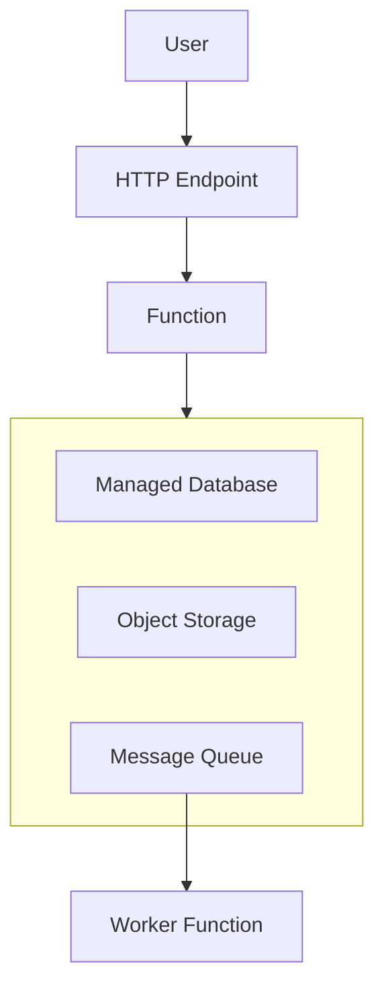

The provider manages much of the underlying infrastructure for these services.

The system designer still decides:

- How components communicate.
- Where persistent data lives.
- How failures are handled.
- How access is controlled.
- How operations are monitored.
- How costs are bounded.

Serverless changes the infrastructure-management model; it does not remove system design.

---

## 14. Reliability and Failure Modes

Serverless functions can fail just like other application components.

| Failure or constraint | Possible consequence | Design consideration |
|---|---|---|
| Cold start | Higher latency for some invocations | Measure latency; reduce initialization work where worthwhile |
| Execution timeout | Function does not complete successfully | Bound work or move long jobs to a suitable worker model |
| Concurrency limit | Invocations are delayed or throttled | Understand quotas and configure capacity appropriately |
| Dependency overload | Database or API becomes saturated | Apply concurrency controls and protect downstream services |
| Duplicate event delivery | Work may run more than once | Make handlers idempotent where duplicate processing is possible |
| Provider or regional outage | Function or dependent services may become unavailable | Design recovery according to business requirements |
| Cost spike | Unexpected bill | Monitor usage, set budgets/alerts where available, and apply limits |

The provider operates much of the execution infrastructure, but application-level retries, data correctness, access control, and dependency behavior remain important.

---

## 15. Security Responsibilities

A serverless platform does not automatically make your application secure.

You still need to consider:

- **Permissions:** Give each function only the access it needs.
- **Secrets:** Retrieve credentials through an appropriate secrets-management mechanism.
- **Input validation:** Treat incoming requests and event payloads as untrusted.
- **Network access:** Restrict access to databases and internal services.
- **Dependencies:** Update and scan libraries and deployment packages.
- **Logging:** Avoid exposing passwords, tokens, or sensitive user data.

For example, an image-processing function should not receive unrestricted access to every database table if it only needs permission to read uploaded files and write thumbnails.

Related topics: **07.12 — Secrets Management** and **11.12 — Least Privilege**.

---

## 16. When Is Serverless a Good Fit?

Serverless is often worth considering when:

- Work is triggered by requests or events.
- Traffic is intermittent or variable.
- Tasks have clear boundaries.
- The workload fits the platform's execution limits.
- The team wants to reduce infrastructure operations.
- Managed services fit the application's requirements.
- The cost model is attractive for the actual workload.

Examples include:

- Image resizing after uploads.
- Sending notifications from queue messages.
- Scheduled reports.
- Lightweight API handlers.
- Event-driven data processing.

## 17. When Might Serverless Be a Poor Fit?

Consider other compute models when:

- Work must run continuously for long periods.
- Execution duration or resource needs exceed platform limits.
- Low and highly predictable latency is essential, and initialization delays cannot be acceptably managed.
- The workload needs specialized hardware or OS-level control unavailable on the platform.
- Heavy, constant utilization makes provisioned compute more attractive.
- Platform constraints or pricing make the design unsuitable.
- Vendor-specific integrations create unacceptable lock-in.

These are not automatic reasons to reject serverless. They are reasons to evaluate the workload carefully.

---

## 18. Hands-On Exercise

Design a small serverless image-processing workflow.

### Scenario

A user uploads a profile image. Your application must create a smaller thumbnail.

### Step 1 — Define the flow

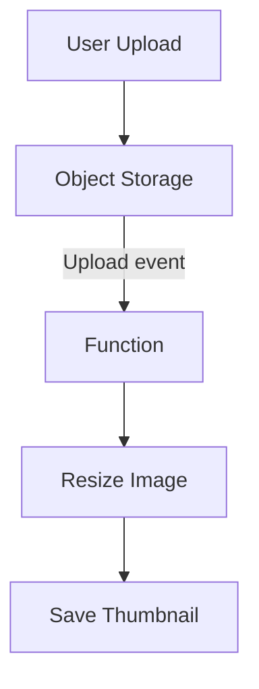

### Step 2 — Identify responsibilities

Write down which component handles:

- Receiving the upload.
- Storing the original file.
- Triggering processing.
- Resizing the image.
- Saving the thumbnail.
- Recording metadata.

### Step 3 — Consider failure cases

Ask:

- What if the function times out?
- What if the same upload event is delivered twice?
- What if object storage is temporarily unavailable?
- What if a large upload takes too long to process?
- What if many images arrive simultaneously?

### Step 4 — Protect dependencies

Decide how you would prevent excessive concurrent processing from overloading storage or a database.

### Step 5 — Estimate cost drivers

List the likely contributors:

- Number of invocations.
- Execution duration.
- Allocated resources.
- Storage.
- Data transfer.
- Logging and dependent services.

**Goal:** Design the workflow and its failure behavior before choosing a particular provider.

---

## 19. Common Mistakes

- **Thinking serverless means no servers:** Servers still exist; the provider manages much of the infrastructure.
- **Assuming scaling is unlimited:** Quotas, concurrency limits, and downstream capacity still apply.
- **Assuming serverless is always cheaper:** Usage and dependent-service costs can accumulate.
- **Keeping important state in function memory:** Execution environments can be replaced.
- **Running long jobs in short-lived handlers:** Use an execution model suited to the job duration.
- **Ignoring database connections:** A burst of invocations can overwhelm a database.
- **Ignoring duplicate events:** Design side-effecting handlers to tolerate repeated processing when required.
- **Treating serverless as an architecture by itself:** It is a compute and service-consumption model; data flow, boundaries, and reliability still need design.

---

## 20. System Design View

VMs, containers, and serverless are different ways to run workloads. They are not mutually exclusive choices for an entire application.

For example:

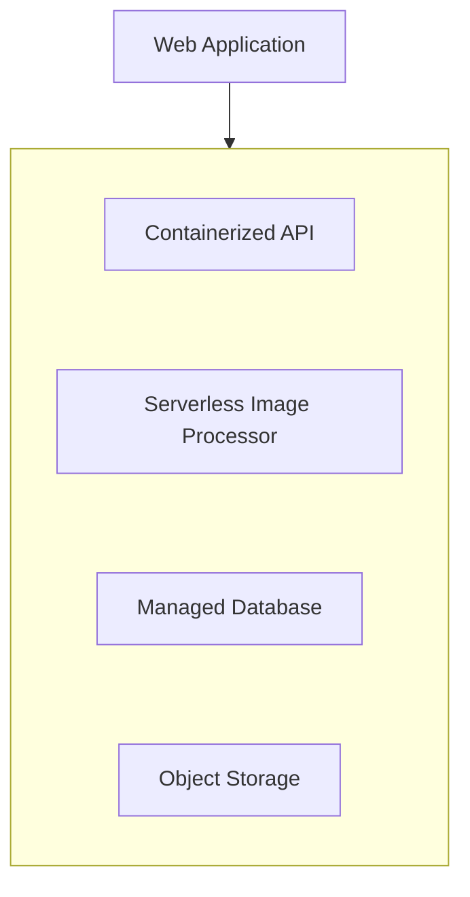

You can choose different execution models for different parts of the same system.

The right decision depends on:

- Workload shape.
- Execution duration.
- Latency requirements.
- Operational capability.
- Scaling behavior.
- Dependency capacity.
- Cost.
- Portability and lock-in.

### Key Principle

> **Serverless reduces the need to manage execution infrastructure, but it does not remove responsibility for application behavior, dependencies, security, reliability, or cost.**

## Quick Reference

| Term | Meaning |
|---|---|
| Serverless | Cloud model that abstracts much of the underlying server management |
| FaaS | Functions executed in response to invocations |
| Invocation | Request or event that triggers function execution |
| Cold start | Initialization work before an invocation can execute |
| Concurrency | Number of executions happening at the same time |
| Execution limit | Platform constraint on duration or resources |
| Managed service | Service where the provider operates much of the underlying infrastructure |
| Idempotency | Property that allows repeated processing without unintended duplicate effects |
| Downstream dependency | Service the function calls or relies on |
| Vendor lock-in | Difficulty moving away from provider-specific capabilities |

## Knowledge Check

1. What does serverless mean if servers still exist?
2. What is the difference between a VM, a container, and a serverless function?
3. What is a cold start?
4. Why should important state not depend on a function's local memory?
5. How can serverless scaling overload a database?
6. Why is serverless not automatically cheaper?
7. Why might a long-running task need a different execution model?
8. Can one application combine containers and serverless functions?

### Answers

1. The provider manages much of the underlying infrastructure, so the team does not manage servers in the traditional way.
2. A VM provides a virtual computer, a container packages an isolated application environment, and a serverless function runs code through a provider-managed invocation model.
3. Initialization work required before an invocation can execute in a new or unprepared environment.
4. The platform may replace the environment, so local state is not reliable persistent storage.
5. Concurrent functions can create too many connections or requests for the database to handle.
6. High invocation volume, long execution times, and dependent-service costs can make the total cost high.
7. The function may exceed execution-duration or resource limits; a queue and suitable worker or compute service may fit better.
8. Yes. Different workloads can use different execution models within the same architecture.

## Remember

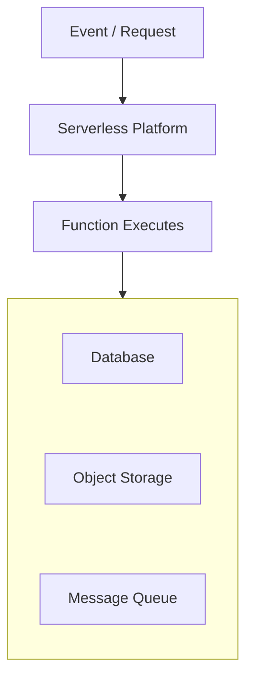

Serverless is useful when the execution model fits the workload and its constraints. The provider manages much of the infrastructure, but you still design the behavior, dependencies, limits, and failure handling.

**Next: 08.06 — Storage**
