# 08.06 — Storage

## Learning Objectives

By the end of this chapter, you should be able to:

- Explain why applications need different types of storage.
- Distinguish block, file, and object storage.
- Understand ephemeral versus persistent storage.
- Choose an appropriate storage type for common workloads.
- Understand durability, availability, latency, and storage capacity.
- Recognize common storage failure modes and cost trade-offs.
- Understand how storage decisions affect application architecture.

---

## 1. What Is Storage?

Applications constantly create and use data.

An e-commerce application might store:

- Customer records.
- Product information.
- Uploaded product images.
- Application logs.
- Database files.
- Temporary processing files.
- Backups.

These data types have different requirements.

A database needs reliable access to structured records. A user-uploaded image needs durable file storage. A virtual machine may need a disk for its operating system.

Trying to use one storage model for every requirement can create unnecessary complexity or poor performance.

> **Storage is the infrastructure that retains data so applications and systems can access it when needed.**

The key question is not simply, "Where can I save this file?"

It is:

**What kind of data am I storing, how will it be accessed, and how long must it survive?**

---

## 2. Three Common Storage Models

Cloud architecture commonly distinguishes three storage models.

**Block storage**

Provides storage as addressable blocks that an operating system can use as a disk.

Common use: VM disks, database volumes, operating-system filesystems.

**File storage**

Organizes data as files and directories accessed through a filesystem.

Common use: shared files, team directories, workloads expecting filesystem semantics.

**Object storage**

Stores data as objects identified by keys, typically accessed through an API.

Common use: images, videos, documents, backups, and static assets.

These models differ in how applications access data, not merely in where the data physically resides.

---

## 3. Block Storage

Block storage presents storage capacity as a block device. An operating system can format it with a filesystem, and applications can then use that filesystem.

For example, a cloud virtual machine might have:

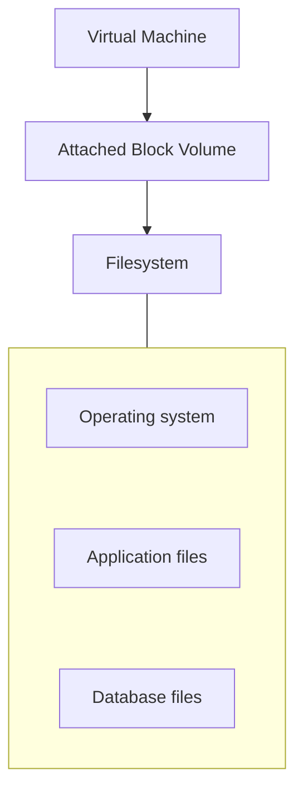

Block storage is useful when software expects disk-like access and control over the filesystem.

Common uses include:

- VM boot disks.
- Database storage volumes.
- Application disks.
- Workloads requiring block-level reads and writes.

### Important considerations

- Performance can depend on volume type, size, configuration, and provisioned limits.
- A volume may survive a VM replacement, depending on how it is configured and managed.
- Attaching a volume to another machine does not automatically make every filesystem or database safe for concurrent access.
- Storage durability and backup are separate considerations.

**A disk that survives a machine failure is not necessarily a backup.**

---

## 4. File Storage

File storage organizes data into directories and files.

For example:

```text
/shared
   |
   +---- reports/
   |       +---- sales.csv
   |
   +---- uploads/
   |       +---- user-42.pdf
   |
   +---- team-documents/
```

Applications access files through familiar filesystem operations, such as opening, reading, writing, and listing files.

File storage can be local to a machine or provided through a network filesystem.

### When is file storage useful?

- Multiple servers need access to shared files.
- Existing software expects normal filesystem paths.
- Teams need shared directories.
- Applications need directory-based organization and file operations.

### Trade-offs

Network file storage can simplify sharing, but it introduces network dependencies, permissions management, and potential latency or throughput constraints.

Also, a filesystem shared across multiple application instances must be designed for the required concurrency and consistency behavior.

---

## 5. Object Storage

Object storage stores data as objects inside containers commonly called *buckets*.

An object typically consists of:

- The data itself.
- An identifier or key.
- Metadata.

For example:

```text
Bucket: product-images

   products/keyboard.jpg
   products/mouse.jpg
   users/42/avatar.png
   invoices/2026/INV-1001.pdf
```

Applications usually access objects through HTTP APIs, SDKs, or compatible interfaces.

Conceptually:

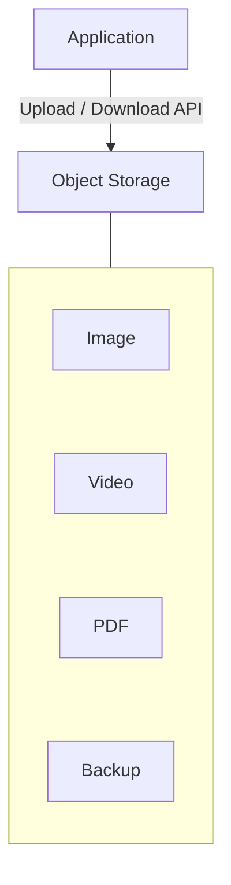

Object storage is designed for large amounts of unstructured data and is widely used for files that should remain available independently of an application server.

### Why not store every upload on the application server?

Imagine three application instances:

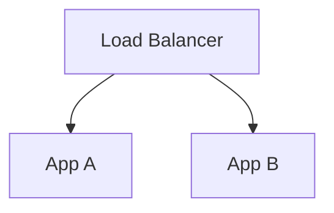

If a user uploads an image only to App A's local disk, a later request reaching App B may not find it.

With shared object storage:

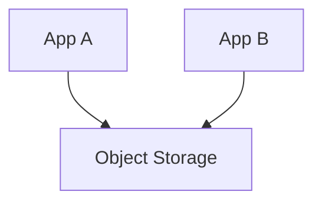

Both instances can access the same stored object, subject to their permissions.

### Important limitations

Object storage is not simply a remote hard drive. Its API and consistency semantics differ from a conventional filesystem.

For example, applications should not assume that they can modify arbitrary byte ranges exactly as they would on a disk. Some object stores support specific update patterns, multipart uploads, or specialized features, but the details vary by provider.

Object storage is an excellent fit for uploaded media and backups, but it is not a universal replacement for block storage, file storage, or a database.

---

## 6. Block vs File vs Object Storage

| Dimension | Block | File | Object |
|---|---|---|---|
| Data access | Blocks through a device | Files and directories | Objects through keys/APIs |
| Typical interface | Disk device | Filesystem or network filesystem | HTTP API or SDK |
| Common workloads | VM disks, database volumes | Shared directories, filesystem-based applications | Media, documents, backups |
| Organization | Managed by the filesystem or application | Directories and filenames | Object keys and metadata |
| Sharing | Depends on attachment and filesystem support | Designed for file sharing in suitable configurations | Multiple clients can access objects through authorized APIs |
| Typical design focus | I/O performance and volume behavior | Filesystem semantics and shared access | Durability, object access, scale, lifecycle |

No model is universally fastest or cheapest. Performance and cost depend on the specific service, configuration, access pattern, and workload.

---

## 7. Persistent vs Ephemeral Storage

Another important distinction is whether data survives the replacement of the resource using it.

**Persistent storage** is designed to retain data beyond the lifetime of a particular application process or compute instance.

**Ephemeral storage** is temporary storage whose contents may disappear when the environment is stopped, replaced, or terminated.

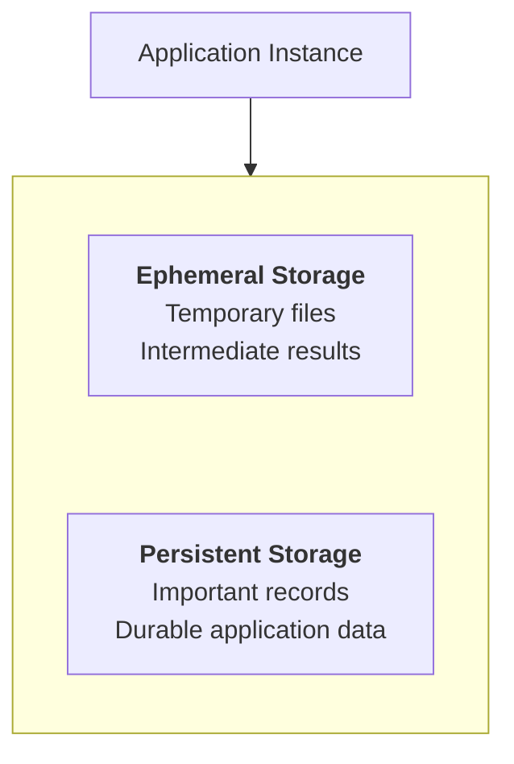

Examples of ephemeral storage include temporary directories and container writable layers.

Examples of persistent storage include appropriately configured attached volumes, managed databases, and object storage.

However, the word *persistent* does not mean *indestructible*. Persistent storage can still be deleted, corrupted, misconfigured, or made inaccessible.

> **Persistence, durability, availability, and backup are related but different properties.**

---

## 8. Four Storage Properties to Understand

| Property | Question it answers |
|---|---|
| **Persistence** | Does the data survive the replacement of a process or compute instance? |
| **Durability** | How well is the data protected against loss over time? |
| **Availability** | Can the application access the data when required? |
| **Performance** | How quickly can the data be read or written under the expected workload? |

A storage service may offer strong durability but still become temporarily unavailable.

A volume may persist after a VM is deleted but still be lost if someone deletes the volume itself.

A fast disk may not provide sufficient throughput for a large analytics workload.

Storage design must consider the properties that matter to the application.

---

## 9. Storage and Databases

A database is not the same thing as a storage type.

A database is a system that manages data and provides capabilities such as queries, indexes, transactions, and consistency rules.

Its underlying data may be stored using block storage, distributed storage, or other provider-managed mechanisms.

Conceptually:

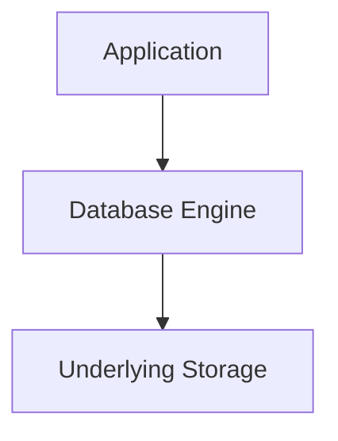

In a managed database service, the provider handles much of the underlying infrastructure and storage operation. The exact responsibilities depend on the service.

For an application designer, the important decision is usually whether to use a suitable database service—not to manually manage its internal disk layout without a clear reason.

See **08.09 — Managed Databases** for more detail.

---

## 10. Capacity and Growth

Storage requirements grow as an application accumulates data.

Suppose a service stores 20,000 uploaded files per day, with an average size of 2 MB.

Daily raw storage growth is:

$$
20{,}000 \times 2\text{ MB} = 40{,}000\text{ MB}
$$

That is approximately **40 GB per day** using decimal units, before accounting for metadata, replicas, backups, transformations, or compression.

Over 30 days:

$$
40\text{ GB/day} \times 30 = 1{,}200\text{ GB}
$$

That is approximately **1.2 TB of new raw data per month**.

This simple estimate helps you ask the next questions:

- How long must the files be retained?
- Are older files accessed frequently?
- Do backups create additional copies?
- Can older data move to a lower-cost storage tier?
- Are there legal or business retention requirements?

Storage capacity planning is about both present needs and future growth.

---

## 11. Performance: Latency vs Throughput

Storage performance has more than one dimension.

**Latency** is how long an individual operation takes.

**Throughput** is how much data or work can be transferred over a period of time.

For example:

```text
Workload A
Small random reads
Concern: per-operation latency

Workload B
Large sequential file transfer
Concern: throughput
```

A database with many small random reads may have different requirements from a video-processing pipeline that reads large files.

Other important factors include:

- Number of concurrent requests.
- Read/write ratio.
- File or object size.
- Request patterns.
- Network distance.
- Storage service limits.

Choose storage based on the real access pattern rather than a generic label such as "high performance."

---

## 12. Storage and Availability

Consider an application that stores uploaded files only on one VM's local disk.

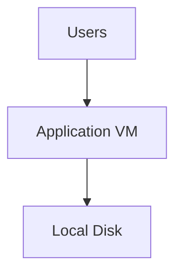

If the VM becomes unavailable, the application may lose access to those files. Depending on the disk and failure, the data may or may not remain recoverable.

A design that separates compute from persistent storage can make replacement easier:

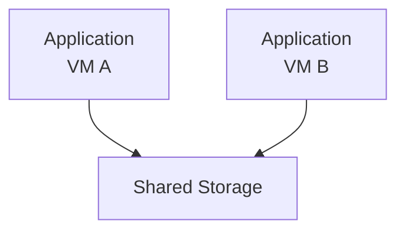

But shared storage can itself become unavailable, misconfigured, or overloaded.

**Moving data outside a VM removes one dependency on that VM; it does not eliminate all storage failure modes.**

For important data, consider redundancy, backups, access permissions, recovery procedures, and testing.

---

## 13. Backups Are a Separate Design Decision

A persistent volume is not automatically a backup.

Suppose your application writes important data to a persistent disk. If the data is accidentally deleted, corrupted, or encrypted by malicious software, persistence alone may not help.

A backup strategy asks:

- What data must be recoverable?
- How frequently should backups be taken?
- How long should backups be retained?
- Are backups isolated from ordinary application credentials?
- How quickly must recovery happen?
- Have restores actually been tested?

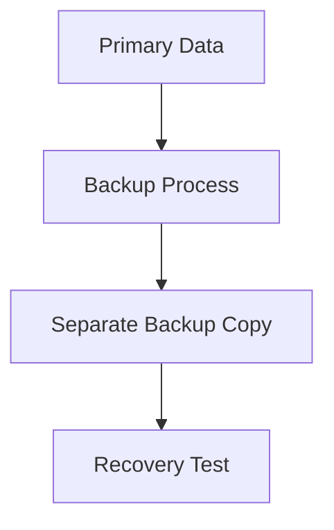

A backup that has never been tested may not provide the recovery capability you expect.

Disaster recovery is covered in **Level 9 — Reliability**.

---

## 14. Storage Costs

Storage costs involve more than the amount of data saved.

Depending on the service, costs may include:

- Capacity consumed.
- Read and write operations.
- Data retrieval.
- Network transfer.
- Replication.
- Backups and snapshots.
- Minimum storage-duration rules.
- Management and monitoring.

For example, storing millions of rarely accessed documents in a high-performance storage configuration may be unnecessary.

A lifecycle policy may move older data into a lower-cost tier, if the service and access requirements support it.

But cheaper storage can involve slower retrieval, minimum retention periods, or additional access costs.

> **Optimize storage for the data's access pattern and retention needs, not just its initial storage price.**

---

## 15. Choosing the Right Storage

Use this decision guide as a starting point.

- **Does the workload need disk-like access for an OS, VM, or database volume?** → Consider block storage.
- **Does the application need shared files and directory-based filesystem operations?** → Consider file storage.
- **Does the application store uploads, media, documents, or backups accessed through APIs?** → Consider object storage.
- **Does the application need searchable records, relationships, or transactions?** → Consider an appropriate database.

Real systems often combine these options. For example, an e-commerce application may use a managed database for orders, object storage for product images, and block storage inside its database infrastructure.

---

## 16. Hands-On Exercise

Design storage for a small e-commerce application.

The application needs to store:

- Customer and order records.
- Product images.
- Temporary image-processing files.
- Database backups.
- Shared reports used by multiple application instances.

Choose a storage approach for each item.

**1. Customer and order records**

- Object storage
- Database
- Temporary local disk

<details>
<summary>Answer</summary>

**Database.** A database provides structured records, queries, and transactional behavior.

</details>

**2. Product images**

- Object storage
- Local container layer only
- Database indexes

<details>
<summary>Answer</summary>

**Object storage.** Object storage is commonly suited to durable user-uploaded media accessed through APIs.

</details>

**3. Temporary image-processing files**

- Ephemeral storage
- Backup archive
- Primary database

<details>
<summary>Answer</summary>

**Ephemeral storage.** Temporary intermediate files can use ephemeral storage if they can safely be recreated.

</details>

**4. Database backups**

- Only the same live database
- Separate backup storage
- Temporary container layer

<details>
<summary>Answer</summary>

**Separate backup storage.** A separate backup copy supports recovery from deletion, corruption, or other failures.

</details>

**5. Shared reports used by multiple instances**

- Only one VM's local disk
- Suitable shared file or object storage
- CPU cache

<details>
<summary>Answer</summary>

**Suitable shared file or object storage.** Shared file storage fits directory-style access; object storage can fit reports accessed by keys or APIs.

</details>

After choosing the storage models, answer these design questions:

1. Which data must survive an application instance being replaced?
2. What happens if object storage becomes temporarily unavailable?
3. How will backups be retained and restored?
4. Which storage operations could become expensive as traffic grows?

---

## 17. Common Mistakes

- **Treating all storage as equivalent:** Block, file, and object storage have different access models.
- **Keeping important uploads on one application instance:** Other instances may not be able to access them.
- **Assuming persistent means indestructible:** Persistent data can still be deleted, corrupted, or become unavailable.
- **Assuming a volume is a backup:** Recovery needs a separate, appropriate backup strategy.
- **Ignoring access patterns:** Many small random operations differ from large sequential transfers.
- **Ignoring retention and retrieval costs:** Old data can accumulate and become expensive.
- **Using object storage as a universal filesystem:** Its API and semantics differ from ordinary filesystem operations.

---

## 18. System Design View

Storage decisions influence more than where bytes are kept.

They affect:

- Application architecture.
- Compute replacement and scaling.
- Data durability and recovery.
- Request latency and throughput.
- Security and access control.
- Long-term operating costs.
- Portability and provider dependence.

A practical design separates responsibilities:

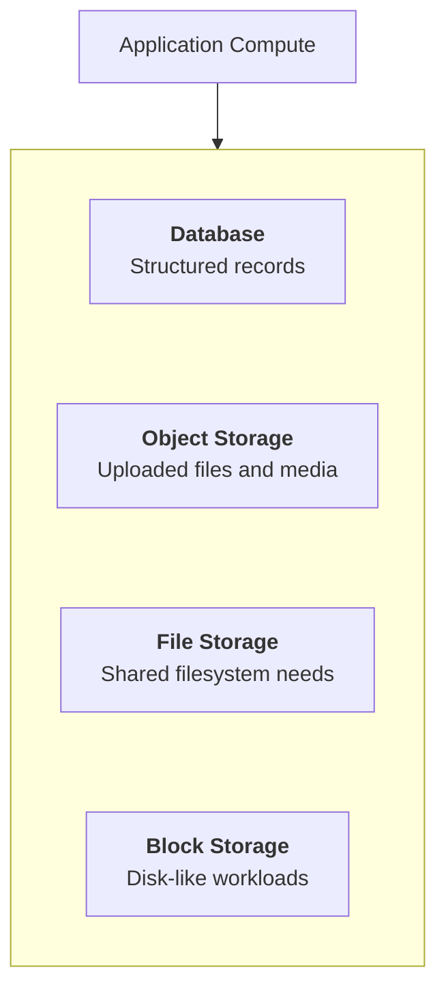

You do not need every storage type in every application. Choose only what the workload requires.

## Key Principle

> **Choose storage according to how data is accessed, how long it must survive, and what happens if it becomes unavailable or is lost.**

## Quick Reference

| Concept | Meaning |
|---|---|
| Block storage | Disk-like storage accessed through blocks |
| File storage | Storage organized as files and directories |
| Object storage | Storage organized as objects accessed through keys/APIs |
| Ephemeral storage | Temporary storage that may disappear with its environment |
| Persistent storage | Storage intended to outlive a particular process or compute instance |
| Durability | Resistance to permanent data loss |
| Availability | Ability to access a service or data when required |
| Throughput | Amount of data transferred per unit of time |
| Backup | Separate recoverable copy of data |
| Lifecycle policy | Rules for transitioning or deleting data as it ages |

## Knowledge Check

1. What is the main difference between block, file, and object storage?
2. Why should uploaded files not necessarily live on an application's local disk?
3. Does persistent storage guarantee that data can never be lost?
4. Why is a persistent volume not the same as a backup?
5. Which storage model is commonly suitable for product images and documents?
6. Why should storage decisions consider both latency and throughput?
7. Can an application use multiple storage models together?

### Answers

1. Block storage provides disk-like blocks, file storage provides files and directories, and object storage provides objects accessed through keys or APIs.
2. Other application instances may not have access to the local files, and the instance may be replaced.
3. No. Persistent data can still be deleted, corrupted, or become inaccessible.
4. A volume may be affected by deletion or corruption; a separate backup provides another recovery source.
5. Object storage is commonly suitable.
6. Different workloads have different requirements for individual-operation response time and total transfer capacity.
7. Yes. Combining storage models is common when each serves a different purpose.

## Remember

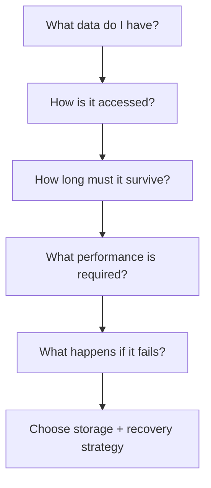

Storage is an architectural decision, not merely a disk-size setting. Choose the access model first, then design persistence, recovery, performance, and cost around the actual workload.

**Next: 08.07 — Object Storage**
