# 08.07 — Object Storage

## Learning Objectives

By the end of this chapter, you should be able to:

- Explain how object storage organizes and retrieves data.
- Understand buckets, objects, keys, metadata, and object versions.
- Trace an upload and download workflow.
- Understand how applications securely access stored objects.
- Recognize presigned URLs, lifecycle policies, and multipart uploads.
- Understand object storage durability, consistency, and cost considerations.
- Decide when object storage is appropriate and when another storage model is better.

---

## 1. What Is Object Storage?

In **08.06 — Storage**, you learned three common storage models:

- Block storage for disk-like access.
- File storage for files and directories.
- Object storage for data accessed as objects through an API.

Object storage is designed to store large amounts of data without requiring applications to manage traditional disks or directory-based filesystems.

Common examples include:

- User-uploaded images.
- Videos and audio files.
- PDF documents.
- Backups and archives.
- Application exports.
- Static website assets.
- Data used by analytics pipelines.

> **Object storage stores data as objects identified by keys, usually inside buckets, and exposes them through an API.**

The application can upload, retrieve, list, and delete objects according to its permissions.

---

## 2. How Object Storage Organizes Data

Object storage commonly uses three main concepts.

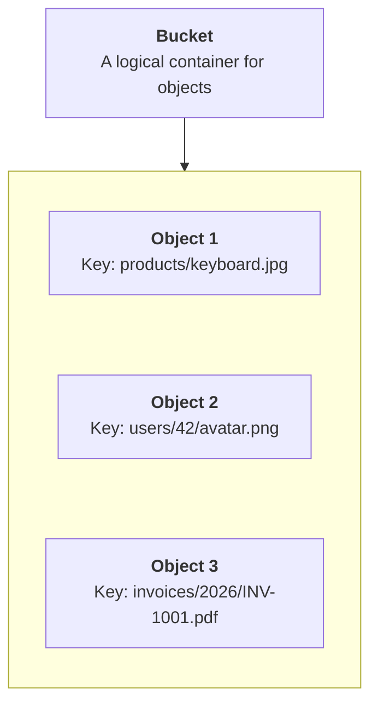

### Bucket

A logical container used to organize and manage objects. Depending on the provider, bucket-level settings may include access policies, versioning, lifecycle rules, and other controls.

### Object

The stored data together with its associated metadata and identifier.

### Object key

The name used to identify an object within its bucket.

For example:

```text
Bucket: product-media

Key: products/keyboard.jpg
```

Together, the bucket and key identify the object within the storage service.

**Important:** A key such as `products/keyboard.jpg` often looks like a filesystem path, but object storage does not necessarily contain real directories. The slashes are usually part of the object's key. Some interfaces display these prefixes as folders for convenience.

---

## 3. Beginner Analogy: A Parcel Warehouse

Imagine a large warehouse that stores millions of packages.

Each package has:
- **A unique tracking code** to identify it.
- **The actual contents** inside the package.
- **Labels or metadata** describing it.

Object storage works in a similar way.

| Warehouse | Object Storage |
|---|---|
| Warehouse | Bucket |
| Package | Object |
| Tracking code | Object key |
| Contents of the package | File data |
| Package labels | Metadata |

For example, an online learning platform uploads a course video.

```text
Bucket: course-media

Object key:
videos/course-101/lesson-01.mp4

Object data:
The actual video file

Metadata:
Content type, size, upload time
```

The application can use the object's key to request the video from storage.

### How is this different from a traditional folder?

A key might look like a folder path:

```text
videos/course-101/lesson-01.mp4
```

But object storage often treats this as a **single object identifier**, not as a real file path inside a traditional filesystem.

Think of the key as the package's tracking code: its format can look meaningful, but its main job is to identify the object.

**Remember:** A bucket is where objects are organized, an object contains the data and metadata, and the object key identifies it.

---

## 4. What Does an Object Contain?

An object typically has three important parts:

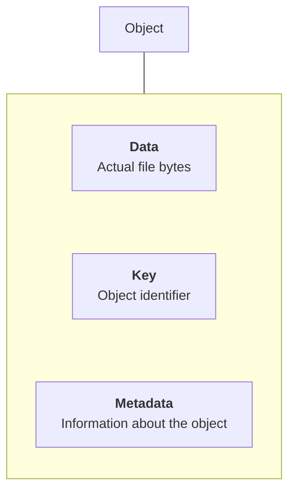

For example, an uploaded image might have:

| Property | Example |
|---|---|
| Key | `products/keyboard.jpg` |
| Data | JPEG image bytes |
| Content type | `image/jpeg` |
| Size | 2.4 MB |
| Custom metadata | `product-id: 42` |

The exact metadata features depend on the storage service.

Applications should not assume that all custom metadata can be searched like database columns. Object storage is primarily designed for object access, not general-purpose relational queries.

If you need to search products by category, price, or owner, a database is usually a better place for that structured information.

---

## 5. Uploading an Object

Imagine a user uploads a profile image.

A simple flow is:

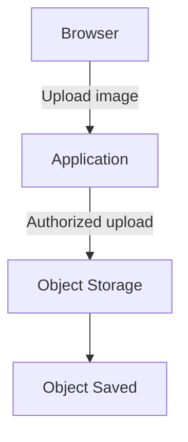

The application might:

1. Authenticate the user.
2. Validate the request and permitted file type.
3. Decide where the object should be stored.
4. Upload the file.
5. Save the object's key and related information in the database.
6. Return the result to the browser.

For example, the database might store:

```text
users
--------------------------------
id    name       avatar_key
42    Priya      users/42/avatar.png
```

The image bytes live in object storage. The database stores the reference and other information needed by the application.

This separation keeps large file content out of ordinary application records.

---

## 6. Downloading an Object

When the user requests the image, the application needs a way to retrieve it.

There are two common approaches.

### Approach A — Application-mediated download

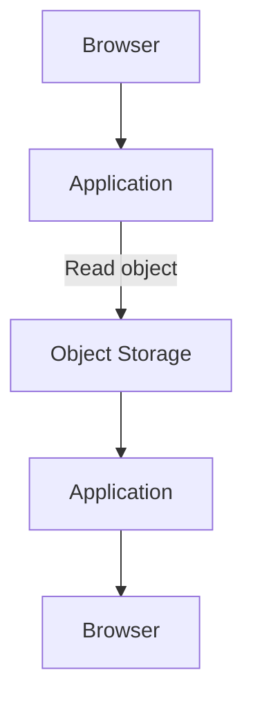

The application retrieves the object and sends it to the browser.

This provides control over authorization and response behavior, but the application handles the data transfer and may consume additional bandwidth and compute.

### Approach B — Direct download

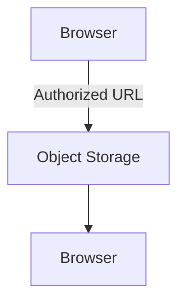

The application authorizes access and then allows the browser to download the object directly.

This can reduce application-server work, especially for large files.

The URL may be public, authenticated, or temporarily authorized, depending on the design.

---

## 7. Presigned URLs

A **presigned URL** is a URL that grants time-limited permission to perform a specific operation on an object, according to the storage provider's rules.

It can be useful when a browser should upload or download a file without sending the file bytes through your application server.

### Direct upload example

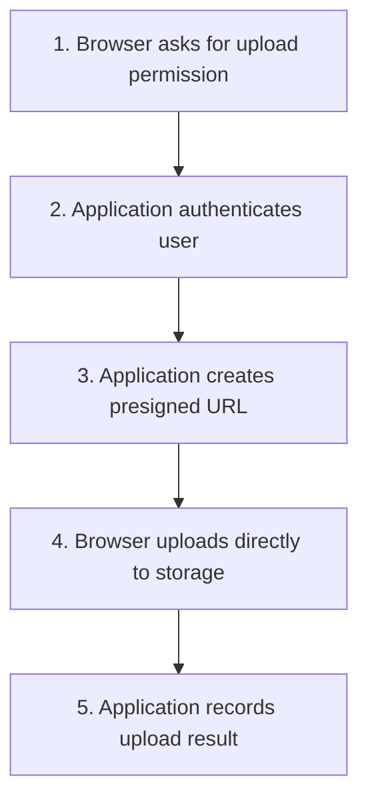

The application can restrict the URL by factors such as:

- Expiration time.
- Target object or key.
- Allowed operation.
- Other provider-supported conditions.

Exact restrictions vary by provider and signing mechanism.

### Security considerations

A presigned URL is a **bearer capability**: anyone who obtains a valid URL may be able to use the permission it grants until it expires or becomes invalid under the provider's rules.

Therefore:

- Use short, appropriate expiration periods.
- Avoid logging or exposing URLs unnecessarily.
- Restrict which objects can be targeted.
- Validate file size and type through suitable controls.
- Do not assume that an upload URL makes the uploaded content safe.

A presigned URL does not replace application authentication or authorization. It is issued after the application decides what access to grant.

---

## 8. Object Storage and the Database

A common design stores file content and business metadata separately.

For example, an e-commerce application might use:

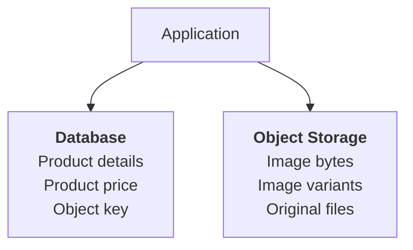

The database might contain:

```text
product_id: 42
name: Mechanical Keyboard
price: 2499
image_key: products/42/main.jpg
```

This separation provides several benefits:

- Large files do not need to be stored in ordinary database rows.
- Object storage can handle file transfers independently.
- Database records can be queried using indexes.
- File access can use storage-specific permissions and delivery mechanisms.

However, the database record and object upload are usually separate operations.

Suppose the upload succeeds but saving the database record fails:

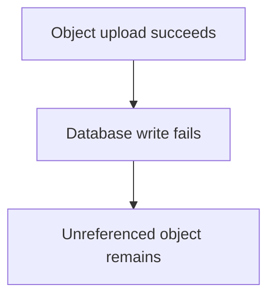

The reverse can also happen: a database record exists, but the referenced object is missing.

Your application should handle these partial-failure cases through appropriate cleanup, retries, reconciliation, or workflow design.

---

## 9. Object Keys and Naming Strategy

Object keys should be predictable enough for the application to manage, but designed to avoid accidental collisions and unauthorized access patterns.

Examples:

```text
users/42/avatar.png
products/42/main.jpg
invoices/2026/INV-1001.pdf
```

For user-generated uploads, a unique identifier can help prevent filename collisions:

```text
uploads/8f2a.../original.jpg
```

Avoid using a user's original filename as the sole identifier when two users may upload files with the same name.

Also remember:

> **A hard-to-guess object key is not a substitute for access control.**

If an object is private, enforce authorization through the storage policy or an authorized access mechanism.

Do not assume that hiding a URL makes its contents secure.

---

## 10. Object Versioning

Some object storage services support **versioning**, which retains multiple versions of an object when it is overwritten or deleted.

For example:

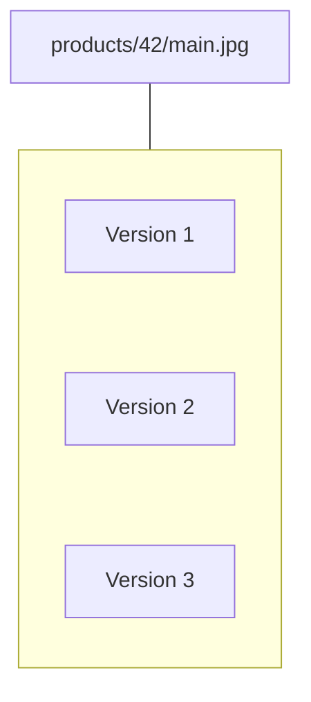

This can help recover from accidental overwrites or deletions, depending on the service configuration.

However, versioning can increase storage costs because older versions may remain stored.

Versioning is also not a complete substitute for backups or disaster recovery. A compromised account or an incorrect policy can still threaten stored data and versions.

Use versioning when recovery from object-level changes is valuable, and define lifecycle rules for older versions where appropriate.

---

## 11. Multipart Uploads

Large files can be inconvenient to upload as one uninterrupted request.

Many object storage services support **multipart uploads**, where a file is split into parts that are uploaded separately and then combined into the final object by the storage service.

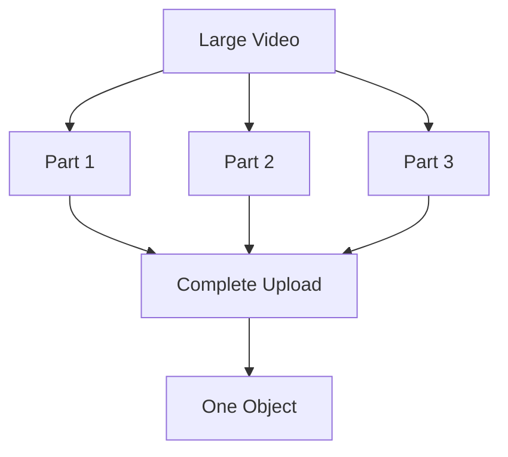

Depending on the service, multipart uploads can support:

- Parallel part uploads.
- Retrying failed parts.
- Resuming certain interrupted uploads.
- Handling large objects more efficiently.

But incomplete multipart uploads may leave temporary stored parts behind. Configure suitable cleanup or lifecycle rules if the provider supports them.

Multipart upload is especially relevant for large media files, backups, and other substantial objects.

---

## 12. Lifecycle Policies

Not every object needs to remain in the same storage class forever.

For example:

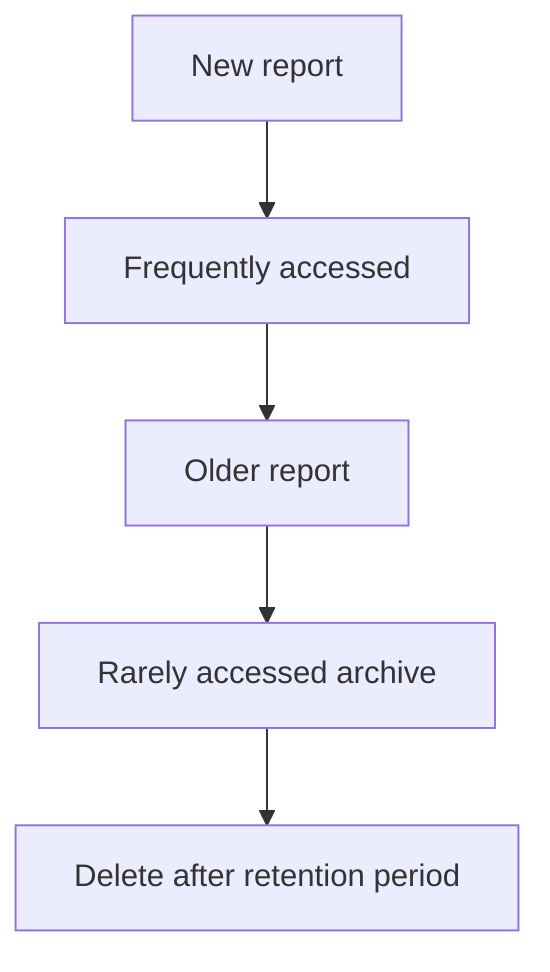

A **lifecycle policy** automates actions based on rules such as object age, storage class, or version status, where supported.

Possible actions include:

- Moving objects to a lower-cost storage tier.
- Transitioning older versions.
- Expiring temporary files.
- Deleting data after an approved retention period.
- Cleaning up incomplete multipart uploads.

### The trade-off

Cheaper archival storage may have higher retrieval latency, retrieval charges, or minimum storage-duration requirements.

Before applying a policy, understand the business and legal retention requirements.

Do not automatically delete old objects merely because they are rarely accessed.

---

## 13. Durability, Availability, and Consistency

These properties describe different aspects of object storage.

| Property | Meaning |
|---|---|
| Durability | How well the service protects data against permanent loss |
| Availability | How often data can be accessed successfully |
| Consistency | What behavior clients observe after a write, overwrite, or delete |
| Performance | How quickly requests complete and how much data can be transferred |

A provider may offer high durability while a particular request still fails temporarily.

Likewise, strong consistency does not mean the service is always available.

Object storage behavior differs by provider and operation. Some services provide strong read-after-write consistency for specified operations; others may have different semantics or constraints.

**Do not assume all object stores behave identically.** Check the selected service's guarantees before relying on them for application correctness.

---

## 14. Security and Access Control

Object storage often contains sensitive files, including invoices, personal documents, backups, and user uploads.

A secure design should consider:

- Private-by-default access where appropriate.
- Least-privilege permissions for applications and users.
- Encryption in transit and at rest, according to the service and requirements.
- Appropriate key and credential management.
- Public-access restrictions.
- Audit logs and monitoring.
- File validation and malware scanning when relevant.
- Retention and deletion requirements.

For example, an invoice should not become publicly accessible merely because the application stores it in a bucket.

A safer flow is:

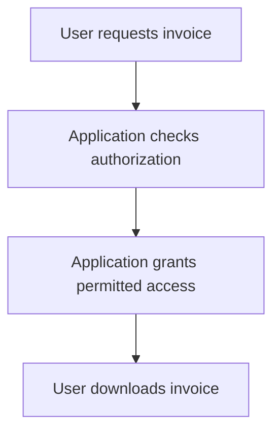

**Public access, authentication, and authorization are separate decisions.** A URL that works is not proof that access is appropriately controlled.

---

## 15. Performance and Cost

Object storage is commonly suited to large files, but total performance depends on more than the storage service itself.

Factors include:

- File size.
- Number of concurrent uploads or downloads.
- Network distance.
- Request rate.
- Multipart strategy.
- Storage tier.
- Metadata and permission checks.
- Whether content is cached near users.

Costs may include:

- Stored data volume.
- API requests.
- Retrieval operations.
- Data transfer out of the service.
- Replication and versioning.
- Storage-class retrieval charges.
- Incomplete multipart uploads.

For frequently accessed public images, a CDN may reduce repeated requests to the origin storage and improve delivery latency. That introduces cache behavior and invalidation considerations.

See **03.13 — CDN** for the delivery layer.

---

## 16. Common Failure Scenarios

| Scenario | Possible consequence | Design response |
|---|---|---|
| Upload succeeds, database write fails | Unreferenced object | Cleanup or reconciliation workflow |
| Database record exists, object is missing | Broken download | Validate references and repair inconsistencies |
| Access policy is too broad | Sensitive files exposed | Least privilege and access-policy review |
| Presigned URL leaks | Unauthorized access within its granted scope | Short expiration, limited permissions, careful handling |
| Large upload is interrupted | Failed or incomplete upload | Multipart upload and retry support where appropriate |
| Old versions accumulate | Unexpected storage cost | Lifecycle policy and retention rules |
| Storage request fails temporarily | Upload or download error | Appropriate timeout, retry, and error-handling strategy |
| Region or service becomes unavailable | Data temporarily inaccessible | Recovery design matched to availability requirements |

Object storage simplifies handling large files, but the surrounding workflow still needs to account for partial failure and security.

---

## 17. Hands-On Exercise

Design file storage for a small learning platform.

The platform stores:

- Public course thumbnails.
- Private student certificates.
- Large recorded lessons.
- Temporary export files.
- Historical backups.

For each type, decide:

1. What object key structure should be used?
2. Should the object be public or private?
3. Does it need versioning?
4. How long should it be retained?
5. Should it be delivered directly, through a presigned URL, or through an application-mediated download?
6. What should happen if uploading the object succeeds but the database update fails?

### Suggested design

| Data | Access approach | Important consideration |
|---|---|---|
| Public course thumbnails | Public or controlled delivery through a CDN | Cache behavior and image updates |
| Student certificates | Private object with authorized access | Student-level authorization |
| Recorded lessons | Controlled access; CDN may help | Large transfers and bandwidth cost |
| Temporary exports | Private objects with limited retention | Automatic expiration and cleanup |
| Historical backups | Restricted access and suitable retention | Recovery testing and protection from deletion |

These are starting points. Final decisions depend on the platform's privacy, performance, and retention requirements.

---

## 18. Common Mistakes

- **Treating object keys as real directories:** Prefixes often simulate directory organization.
- **Making every bucket public:** Private access is appropriate for many business files.
- **Assuming an unpredictable key is security:** Authorization is still required.
- **Storing searchable business data only in object metadata:** Use a database for structured queries.
- **Ignoring partial failure:** Object and database operations may not succeed together.
- **Ignoring old versions and incomplete uploads:** They can increase storage costs.
- **Treating versioning as a complete backup strategy:** Recovery requires broader protection and testing.
- **Assuming object storage is a universal filesystem:** Access semantics differ from block and file storage.

---

## 19. System Design View

Object storage is particularly useful when an application needs to store large amounts of file-based data independently of application compute.

A common architecture looks like this:

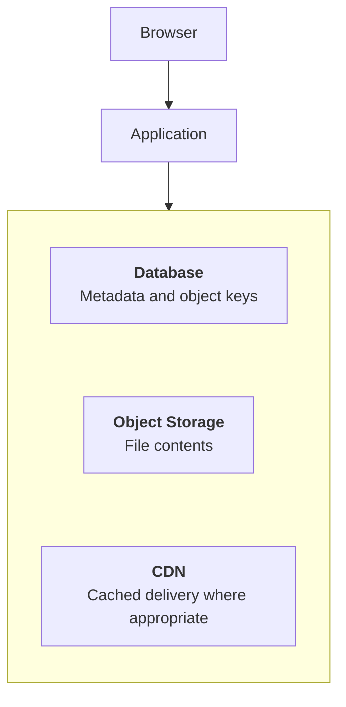

This separates three responsibilities:

- **Database:** Structured information and relationships.
- **Object storage:** Durable storage and retrieval of file content.
- **CDN:** Delivery of eligible content closer to users.

The services complement one another; they are not interchangeable.

## Key Principle

> **Store file content in object storage when its access model fits, keep searchable business metadata in the right database, and design access control, lifecycle, and recovery explicitly.**

## Quick Reference

| Term | Meaning |
|---|---|
| Bucket | Logical container for objects |
| Object | Stored data with an identifier and metadata |
| Object key | Identifier used to address an object |
| Metadata | Information describing an object |
| Presigned URL | Time-limited URL granting specified access |
| Versioning | Retaining multiple versions of an object |
| Multipart upload | Uploading a large object in separate parts |
| Lifecycle policy | Automated transition, retention, or deletion rules |
| Object storage | API-based storage model for objects |
| CDN | Delivery layer that can cache and serve content closer to users |

## Knowledge Check

1. What are the main parts of an object?
2. Why does an object key that looks like a path not necessarily represent a real directory?
3. How can presigned URLs reduce application-server work?
4. Why is a presigned URL sensitive?
5. What problem does object versioning help address?
6. Why can a database record and an uploaded object become inconsistent?
7. What is the purpose of a lifecycle policy?
8. Is object storage a replacement for every filesystem and database?

### Answers

1. Object data, key, and associated metadata.
2. The slash-separated structure is commonly part of the key rather than a real filesystem hierarchy.
3. The browser can upload or download directly from storage after receiving authorized access.
4. Anyone holding a valid URL may be able to use the permission it grants until it expires or becomes invalid.
5. It can help recover from certain accidental overwrites or deletions.
6. Uploading the object and writing the database record are separate operations that can fail independently.
7. It automates actions such as transitioning older objects or deleting data according to defined rules.
8. No. Object storage has different access semantics and is best suited to workloads that fit its object-based model.

## Remember

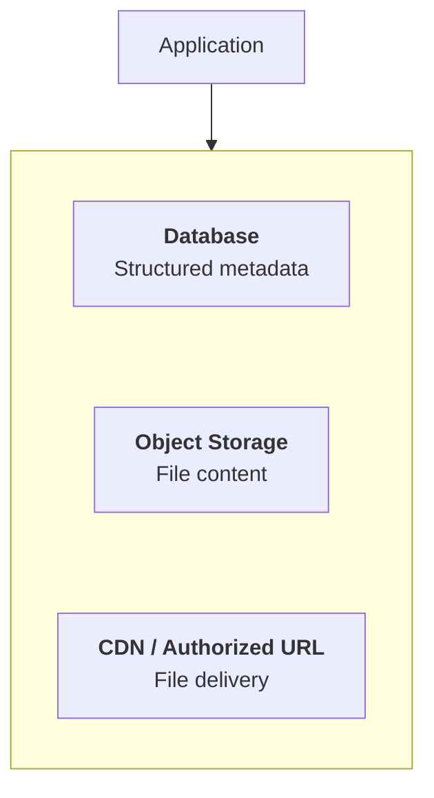

Object storage provides a scalable way to store and retrieve files, but correct architecture still requires secure access, clear ownership, lifecycle management, and a recovery strategy.

**Next: 08.08 — Cloud Networking**
