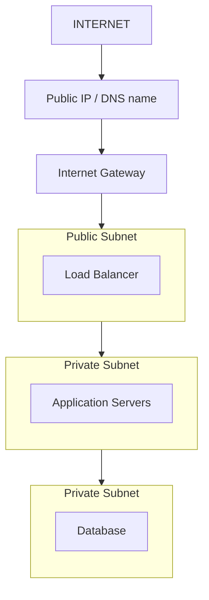
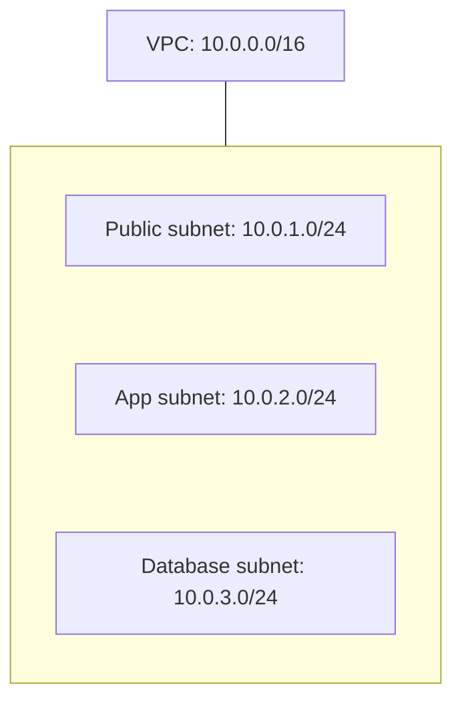
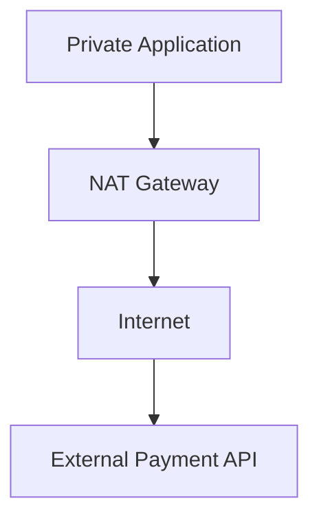
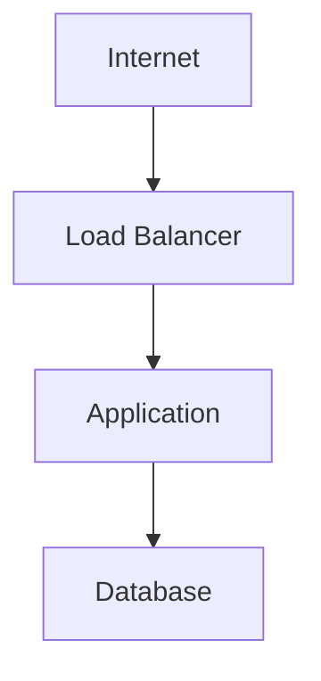
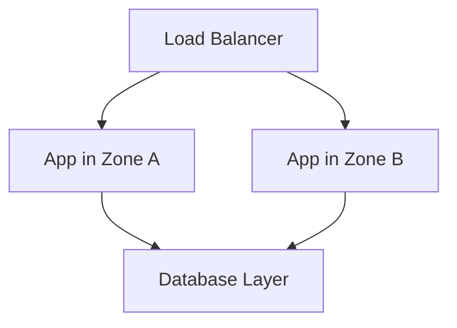
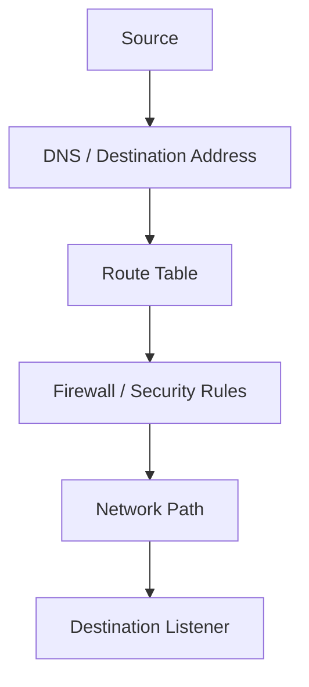
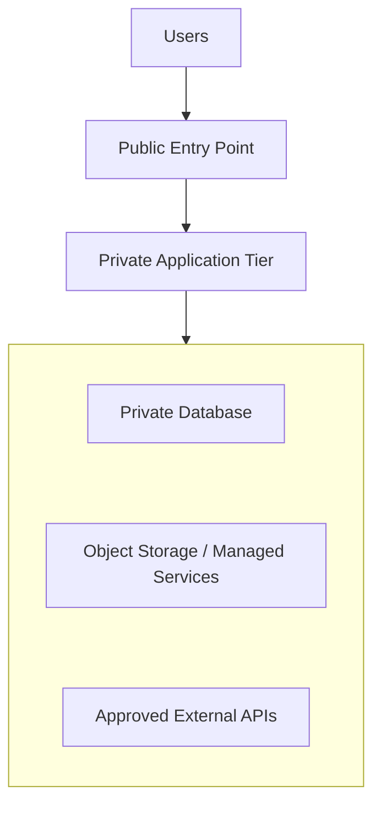

# 08.08 — Cloud Networking

## Learning Objectives

By the end of this chapter, you should be able to:

- Explain why cloud applications need virtual networks.
- Understand VPCs, subnets, route tables, and public vs private networks.
- Understand the roles of internet gateways and NAT gateways.
- Explain how network rules control which components can communicate.
- Design a basic network for a web application.
- Recognize common networking failures, security risks, and costs.

---

## 1. What Is Cloud Networking?

Imagine deploying an application to the cloud.

You have:

- A load balancer that receives user requests.
- Application servers that execute business logic.
- A database that stores customer information.
- Object storage that holds images and documents.

These components need to communicate, but **not every component should be reachable by everyone**.

For example:

- Users should be able to reach the public website.
- The application should be able to reach the database.
- The database should not accept direct connections from the public internet.
- Application servers may need outbound access to external APIs.

Cloud networking defines **how components connect, where traffic can travel, and which connections are allowed**.

> **Cloud networking is the design and control of communication paths between cloud resources and external networks.**

---

## 2. Beginner Analogy: A Secure Office Campus

Imagine a company campus with different areas.

- The **main entrance** is open to visitors.
- The **office floor** is accessible to employees.
- The **records room** is restricted to authorized staff.
- Security gates control movement between areas.

A cloud network works similarly.

| Office campus | Cloud networking |
|---|---|
| Company campus | Virtual private cloud (VPC) or equivalent |
| Separate areas | Subnets |
| Signs showing where people can go | Route tables |
| Security gates | Firewalls and network rules |
| Main entrance | Public-facing entry point |
| Restricted records room | Private database subnet |

The goal is not to connect everything to everything.

The goal is to create **the necessary connections and restrict unnecessary ones**.

---

## 3. The Basic Architecture

Consider a typical three-tier web application:



This is a conceptual architecture. Exact components and configuration differ between cloud providers.

The key idea is that the public entry point can receive internet traffic while application servers and databases remain on private network paths.

---

## 4. VPC: Your Virtual Network

A **Virtual Private Cloud (VPC)** is an isolated virtual network in a cloud environment. Other providers use equivalent concepts, sometimes with different names.

Think of it as your application's network campus.

Within it, you can define:

- IP address ranges.
- Subnets.
- Routes.
- Network security rules.
- Connections to other networks.

For example:

```text
VPC: 10.0.0.0/16
```

This is an example private IP range for a virtual network, not a required value.

The VPC provides a structure for organizing cloud resources and controlling their network communication.

**Important:** A VPC is a logical network boundary, not a guarantee that every resource inside it is automatically secure.

---

## 5. IP Addresses: How Resources Are Identified

Resources communicate using network addresses.

For example:

```text
Application Server: 10.0.2.15
Database:           10.0.3.20
```

These are example private IP addresses.

A resource may have:

- A **private IP address** for communication within connected private networks.
- A **public IP address** for communication through public internet routing, where supported and configured.

A public IP alone does not necessarily make a service reachable. Routes, firewall rules, addressing, and the service's listening configuration also matter.

---

## 6. Subnets: Dividing the Network

A **subnet** is a smaller IP address range within a larger network.

For example:



Each subnet receives part of the VPC's address space.

Subnets help organize resources by role, location, and network policy.

For example:

- Public-facing entry points can be placed in public subnets.
- Application servers can be placed in private subnets.
- Databases can be placed in private subnets with stricter access rules.

Cloud providers differ in how subnets relate to availability zones and other network features. In many common cloud designs, a subnet belongs to one availability zone.

---

## 7. Public vs Private Subnets

The terms *public* and *private* describe network reachability, not simply whether a resource has a public IP.

### Public subnet

A public subnet typically has a route that permits internet traffic through an internet gateway.

A resource still needs appropriate addressing and security configuration to be reachable from the internet.

### Private subnet

A private subnet does not have a direct route for unsolicited inbound connections from the public internet.

Its resources may still communicate with other private resources, and they may have outbound internet access through a NAT gateway or another configured path.

| Question | Public-facing resource | Private resource |
|---|---|---|
| Direct public access | May be allowed when configured | Usually not allowed |
| Typical example | Public load balancer | App server or database |
| Security goal | Allow only intended traffic | Restrict access to required sources |

**Remember:** A subnet being called “public” does not mean every resource inside it must be exposed.

---

## 8. Route Tables: Where Should Traffic Go?

A **route table** defines where network traffic should be sent based on its destination.

Think of it as a set of directions.

For example:

```text
Destination             Next hop
----------------------------------------
10.0.0.0/16             Local VPC routing
0.0.0.0/0               Internet Gateway
```

In this simplified example:

- Traffic destined for the VPC's own address range follows the local route.
- Other IPv4 traffic follows the default route to the internet gateway.

The exact behavior depends on the routing configuration and other controls.

A private subnet might instead use a default route to a NAT gateway, if outbound internet access is required.

**Key distinction:**

- A **route table** determines where traffic can go.
- A **firewall rule** determines whether particular traffic is permitted.

Both may be needed for a connection to succeed.

---

## 9. Internet Gateway vs NAT Gateway

These serve different purposes.

### Internet gateway

Provides a path between a virtual network and the public internet, subject to routing, addressing, and security configuration.

### NAT gateway

Allows resources in a private network to initiate connections to external destinations without giving those resources direct public inbound reachability through that NAT path.

For example, a private application server might need to contact an external payment API.



The response traffic can return through the established connection.

A NAT gateway is **not** a general-purpose firewall and does not replace security rules.

Names and implementation details differ by provider.

---

## 10. Network Security Rules

Networking is not just about creating paths. It is also about controlling them.

Suppose the architecture is:



A reasonable starting policy might be:

| Resource | Allow | Avoid |
|---|---|---|
| Public load balancer | Required web traffic, commonly HTTPS | Unnecessary exposed ports |
| Application servers | Requests from the load balancer | Direct public access unless required |
| Database | Connections from approved application resources | Direct public database access |

The exact ports depend on the application and configuration. For example, HTTPS commonly uses TCP port 443, while a database might use a database-specific port.

### Security groups and network ACLs

Some cloud providers offer both:

- **Security groups:** commonly stateful rules associated with network interfaces or resources.
- **Network ACLs:** commonly stateless rules applied at subnet boundaries.

These are not identical, and not every provider uses the same terminology or behavior.

For a beginner, focus on the principle:

> **Permit only the traffic each component needs, from the sources that should be allowed to send it.**

---

## 11. East-West and North-South Traffic

Two useful terms describe traffic direction.

**North-south traffic** moves between the application environment and external networks.

Examples:
- A browser sends a request to the website.
- An application calls an external API.

**East-west traffic** moves between resources inside the environment.

Examples:
- An application server connects to a database.
- One internal service calls another.

Both need appropriate controls.

Private traffic is not automatically trustworthy. A compromised application server should not automatically be able to reach every database or internal service.

---

## 12. Connecting to Cloud Services Privately

An application may need to access managed cloud services such as object storage without routing that traffic over a public internet path.

Depending on the provider and service, options may include:

- Private endpoints.
- Service endpoints.
- Private service connectivity.

These mechanisms can provide private routes to supported services.

They have provider-specific setup, limitations, and costs.

The design question is:

> **Does this resource need public internet access, or can it reach its dependency through a private network path?**

---

## 13. Availability Zones and Network Resilience

Cloud providers commonly divide regions into **availability zones** or equivalent isolated locations.

Deploying resources across zones can reduce the risk that one zone-level failure takes down the entire application.

For example:



This only improves resilience if the surrounding architecture supports it.

Consider:

- Are both application instances healthy?
- Can traffic reach the surviving instance?
- Is the database also resilient?
- Does the network depend on one critical gateway?
- Are security rules and routes configured in both zones?

**Multiple instances do not automatically mean independent failure domains.**

---

## 14. Common Networking Failures

| Failure | Possible consequence |
|---|---|
| Incorrect route table | Traffic cannot reach its destination |
| Missing security rule | A legitimate connection is blocked |
| Overly broad rule | Unnecessary exposure |
| NAT or egress path failure | Private resources cannot reach external dependencies |
| IP address exhaustion | New resources may fail to obtain addresses |
| DNS or endpoint misconfiguration | Resources cannot resolve or reach a dependency |
| Availability-zone failure | Resources in that zone may become unreachable |
| Unexpected cross-zone traffic | Increased latency or transfer costs |

When a connection fails, investigate the complete path:



A failure at any stage can prevent communication.

---

## 15. Networking Has a Cost

Cloud networking can introduce costs beyond the compute resources themselves.

Examples include:

- NAT gateway usage.
- Public IP addresses, depending on provider and configuration.
- Data transferred out to the internet.
- Cross-zone or cross-region data transfer.
- Private connectivity services.
- Network monitoring and security services.

For example, placing an application and database in different regions may increase latency and transfer costs.

Keeping components close can help, but geographic proximity should not override availability, security, or business requirements.

**Measure and check provider pricing rather than assuming network traffic is free.**

---

## 16. Hands-On Exercise: Design a Secure Web Application Network

Imagine you're deploying an online learning platform with:

- A public website.
- Two application instances.
- A database.
- Course videos stored in object storage.
- An external email API.

Design the network using the following checklist.

### Step 1 — Place the resources

- [ ] Put the public entry point where internet users can reach it.
- [ ] Put application instances in private subnets.
- [ ] Keep the database private.
- [ ] Decide how the application accesses object storage.
- [ ] Decide whether private application instances need outbound internet access.

### Step 2 — Define allowed traffic

- [ ] Internet users can reach only the intended public entry point.
- [ ] The application accepts requests from the intended source.
- [ ] The database accepts connections only from approved application resources.
- [ ] Outbound access is limited to what the application requires.

### Step 3 — Test failure scenarios

Ask yourself:

1. What happens if a route is missing?
2. What happens if a security rule blocks the database connection?
3. Can a database be reached directly from the public internet?
4. What happens if one availability zone becomes unavailable?
5. Can the application reach the email API if its outbound path fails?

You don't need to deploy a cloud environment to complete this exercise. A correct network diagram and clear traffic rules are a useful first design.

---

## 17. Common Mistakes

- **Exposing the database publicly:** Keep it private unless a carefully justified requirement says otherwise.
- **Confusing routes with permissions:** A route does not automatically authorize traffic.
- **Assuming private means isolated from everything:** Private resources may still communicate with other networks or use outbound paths.
- **Opening every port to every source:** Narrow access to the required source, destination, and protocol.
- **Assuming a public IP guarantees reachability:** Routes, rules, and listening services matter too.
- **Ignoring egress costs:** Outbound and cross-zone traffic can affect the bill.
- **Assuming multiple zones guarantee resilience:** Every critical dependency and network path must be considered.

---

## 18. System Design View

Cloud networking connects the architecture's components and enforces boundaries between them.



For each connection, ask:

1. **Reachability:** Is there a valid route?
2. **Permission:** Is the traffic allowed?
3. **Necessity:** Does this component need the connection?
4. **Resilience:** What happens if the path fails?
5. **Cost:** Does the route introduce transfer or gateway charges?

These questions help turn a network diagram into an operational design.

---

## 19. Quick Reference

| Concept | Meaning |
|---|---|
| VPC / virtual network | Logical private network for cloud resources |
| Subnet | Smaller IP address range within a network |
| Route table | Rules that direct traffic toward destinations |
| Public subnet | Subnet with a route that can support public internet access |
| Private subnet | Subnet without direct public internet routing for inbound access |
| Internet gateway | Network path between a virtual network and the internet |
| NAT gateway | Allows private resources to initiate outbound connections without direct public inbound reachability through that path |
| Security group / firewall | Controls permitted network traffic |
| Network ACL | Subnet-level filtering in providers that support it |
| East-west traffic | Communication between internal resources |
| North-south traffic | Communication between internal resources and external networks |
| Private endpoint | Private connectivity to a supported service |
| Availability zone | Isolated cloud location used as a failure-domain boundary |

---

## 20. Knowledge Check

**1. What does a VPC provide?**

A logical network boundary for organizing cloud resources, address ranges, routes, and network controls.

**2. Does a public subnet automatically make every resource inside it publicly reachable?**

No. Addressing, routing, security rules, and service configuration also matter.

**3. What is the difference between a route table and a firewall rule?**

A route table determines where traffic should go. A firewall rule determines whether specified traffic is allowed.

**4. Why might a private application server need a NAT gateway?**

It may need to initiate outbound connections to external services without being directly exposed to unsolicited inbound internet connections through that path.

**5. Should a database usually accept connections directly from the public internet?**

No. It should generally remain private and allow database traffic only from approved sources.

**6. Does deploying application instances in two availability zones guarantee high availability?**

No. Network paths, dependencies, health checks, data services, and failure handling must also support resilience.

---

## Remember

> **Cloud networking is a combination of paths and policies: routes determine where traffic can travel, while security rules determine what traffic is permitted.**

Keep internal data private, expose only the necessary entry points, allow only required connections, and design for network failures as well as normal operation.

**Next: 08.09 — Managed Databases**
