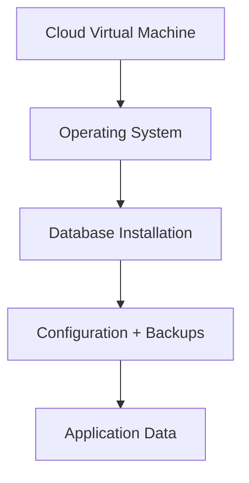
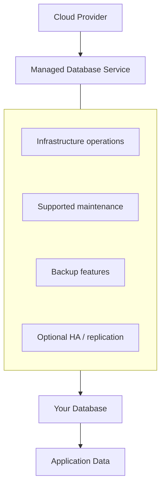
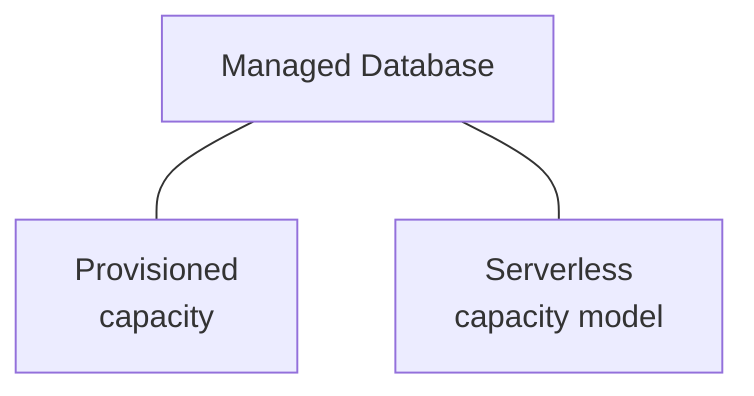
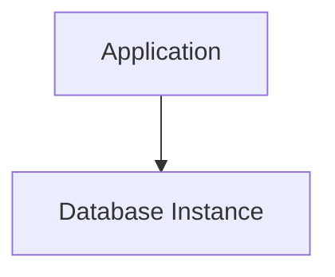
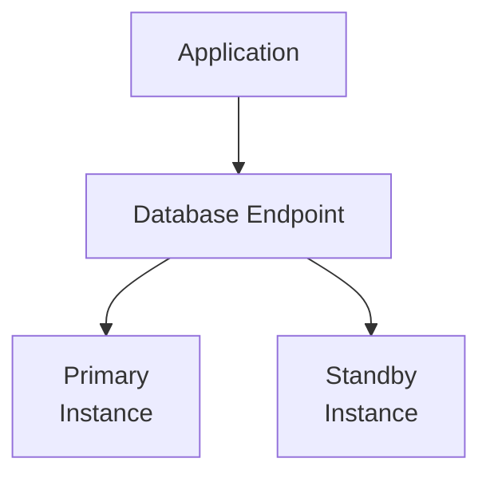
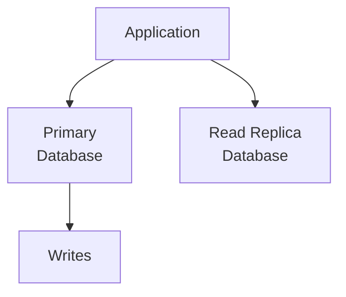
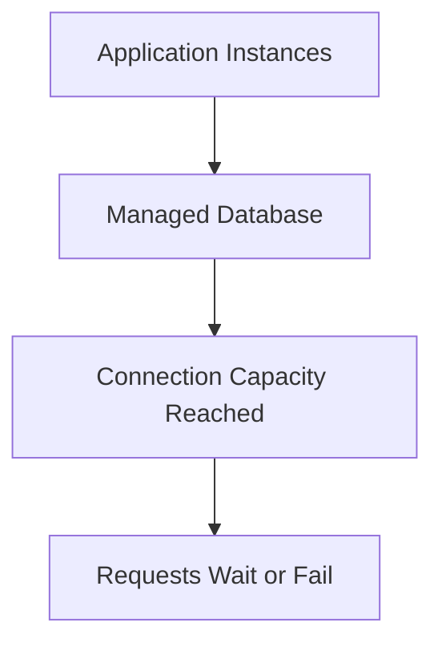
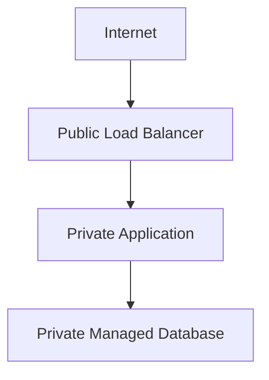
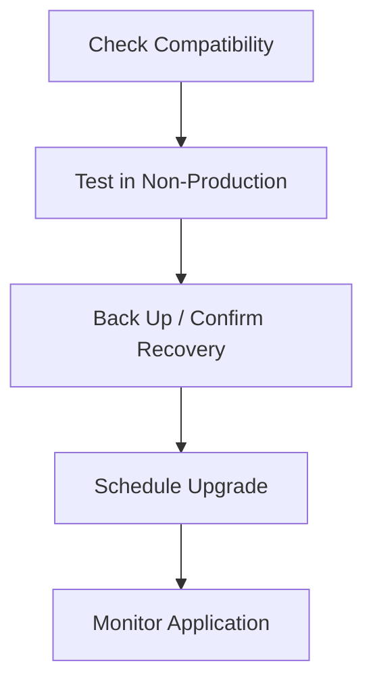
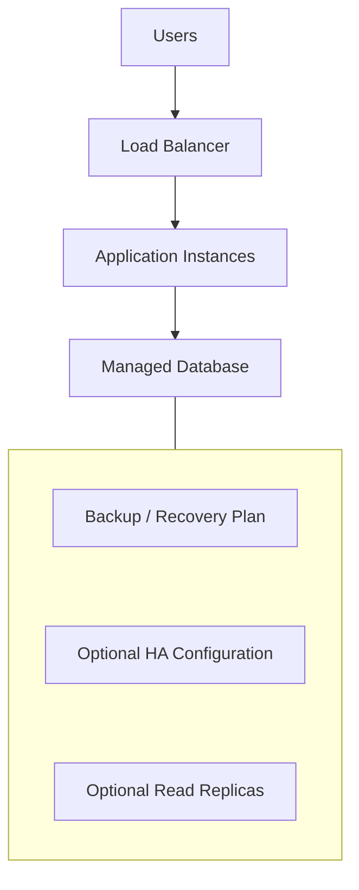

# 08.09 — Managed Databases

## Learning Objectives

By the end of this chapter, you should be able to:

- Explain what a managed database is and how it differs from self-managed databases.
- Understand which operational responsibilities the cloud provider handles—and which remain yours.
- Compare managed databases with databases running on virtual machines.
- Understand automated backups, replication, maintenance, and high availability.
- Recognize the trade-offs involving cost, control, performance, and vendor lock-in.
- Choose when a managed database is appropriate for an application.

---

## 1. What Is a Managed Database?

Every application that stores persistent information needs a data-storage solution.

For example, an e-commerce application may store:

- Customer accounts
- Product information
- Orders and payments
- Inventory
- Transaction history

You could install a database on a virtual machine and manage it yourself.

Or you could use a **managed database service** offered by a cloud provider.

A managed database is a database service where the provider operates some of the underlying infrastructure and database-management tasks.

Depending on the service, the provider may handle:

- Database installation and provisioning
- Infrastructure maintenance
- Software patching
- Automated backups
- Monitoring and recovery features
- Replication and high-availability options

You still remain responsible for important decisions involving data, access, queries, capacity, and recovery requirements.

> **A managed database reduces the operational work required to run a database. It does not eliminate database engineering or responsibility for your data.**

---

## 2. Beginner Analogy: Renting a Managed Office

Imagine you need an office for your business.

### Option A — Build and maintain your own office

You arrange the building, electricity, maintenance, security equipment, and repairs.

You have greater control, but more responsibilities.

### Option B — Rent a serviced office

The provider maintains the building and handles many shared facilities. You focus more on running your business.

A managed database is similar to the second option.

| Office analogy | Database equivalent |
|---|---|
| Building and facilities | Underlying infrastructure |
| Building maintenance | Infrastructure maintenance |
| Office access controls | Database access configuration |
| Business operations | Application and data management |
| Emergency recovery planning | Backup and disaster-recovery strategy |

The provider handles some operational responsibilities, but you still decide how your business operates.

Similarly, a managed database does not automatically design your tables, optimize every query, or guarantee that your application can recover from every failure.

---

## 3. Self-Managed vs Managed Database

Consider two deployment models.

### Self-managed database



Your team manages much of the stack, including operating-system maintenance and database operations.

### Managed database



The provider manages the underlying service according to its product and configuration. You still configure the database and operate your application around it.

---

## 4. Who Is Responsible for What?

Responsibilities vary by provider and service tier, but the general distinction looks like this:

| Responsibility | Managed database | Self-managed database |
|---|---|---|
| Physical infrastructure | Provider | Provider, if using cloud infrastructure |
| Operating-system maintenance | Generally provider-managed | Your team |
| Database installation | Generally provider-managed | Your team |
| Database engine configuration | Shared responsibility | Your team |
| Schema and data model | Your team | Your team |
| Query optimization | Your team | Your team |
| Application credentials and permissions | Your team | Your team |
| Backup configuration and recovery testing | Shared responsibility | Your team |
| Capacity planning | Shared responsibility | Your team |
| Application-level data correctness | Your team | Your team |

**Important:** Managed services differ. Always check which responsibilities are included rather than assuming that every task is handled automatically.

---

## 5. Managed Does Not Mean Serverless

These concepts are related but different.

A managed database may still run on provisioned database instances with configured CPU, memory, and storage.

A serverless database offering may adjust capacity automatically or use a different consumption model.



Both can reduce operational work, but their scaling behavior, pricing, limits, and performance characteristics may differ.

You will evaluate managed caching and messaging separately in **08.10** and **08.11**.

---

## 6. Common Managed Database Categories

Managed database services are not limited to relational databases.

| Category | Typical use |
|---|---|
| Managed relational database | Orders, payments, structured business records |
| Managed document database | Document-oriented application data |
| Managed key-value database | Fast access using known keys |
| Managed analytical database | Large-scale analytical queries |

The right choice depends on the data model, query patterns, consistency needs, workload, and operational requirements.

A managed service does not make an unsuitable database model suitable.

---

## 7. Backups: Useful, but Not Magic

Managed database services often provide automated backup features.

Depending on the service, these may include:

- Scheduled backups
- Transaction-log retention
- Point-in-time recovery
- Snapshot creation

**Point-in-time recovery** can allow restoration to a supported point within a configured retention window.

For example:

```text
10:00  Normal operation
10:15  Accidental data deletion
10:30  Problem discovered
```

If the service supports suitable backups and transaction-log recovery, you may be able to restore the database to a point before the deletion.

But backups have limits:

- Retention may be limited.
- Recovery takes time.
- Restoring may create a separate database instance.
- Backups can incur additional costs.
- Permissions or configuration mistakes may affect recoverability.

> **A backup is useful only if it can be restored successfully within your recovery requirements.**

Test recovery rather than relying only on a dashboard that says backups are enabled.

---

## 8. High Availability Is a Separate Decision

A managed database is not automatically highly available.

A basic deployment might have one database instance:



If that instance becomes unavailable, database access may stop until recovery or replacement completes.

A high-availability configuration may provide a standby or another supported failover mechanism:



The standby may be maintained through replication, with failover behavior determined by the service.

The exact architecture varies. Some services use synchronous replication, others use different mechanisms, and not every standby is available for ordinary read traffic.

**High availability and backups solve different problems:**

- High availability helps maintain or restore service when a component fails.
- Backups help recover data from deletion, corruption, or other recovery scenarios.

You may need both.

---

## 9. Read Replicas and Scaling

A database may become a bottleneck when many application requests perform reads.

Some managed database services support read replicas.



In a common arrangement:

- Writes go to the primary database.
- Selected read queries go to replicas.

This can increase read capacity, but introduces trade-offs:

- Replicas may lag behind the primary.
- Recent writes might not appear immediately.
- More replicas can increase cost.
- Replicas do not automatically solve write bottlenecks.
- Application routing must distinguish appropriate read and write operations.

Read replicas, replication, and consistency are covered in more detail in **04.10–04.12**.

---

## 10. Capacity and Performance Still Matter

A managed database still has finite resources.

Its performance depends on factors such as:

- CPU and memory
- Storage capacity and throughput
- Connection limits
- Query efficiency
- Indexes
- Lock contention
- Network latency
- Concurrent workload

For example:



Adding application instances may increase the number of database connections and make the problem worse.

A managed service can simplify infrastructure operations, but it cannot automatically fix inefficient queries or an unsuitable connection strategy.

Before scaling the database, measure the bottleneck.

---

## 11. Security and Network Access

Managed databases should normally be accessible only to approved application resources and administrators.

A typical arrangement is:



Important controls include:

- Private network placement where appropriate
- Restricted inbound network rules
- Strong authentication
- Least-privilege database permissions
- Encryption in transit and at rest where supported
- Secure credential storage
- Audit logging where required

A managed database is not automatically secure just because the cloud provider operates it.

Network design is covered in **08.08 — Cloud Networking**, and identity and access management is covered in **08.13 — IAM**.

---

## 12. Maintenance and Version Upgrades

Database software needs maintenance.

Managed services may provide supported maintenance windows and automated patching options.

However, upgrades can still affect applications.

For example, a major database version change may introduce:

- Removed or changed features
- Query-plan differences
- Driver compatibility issues
- Configuration changes
- Different performance behavior

A sensible process is:



Provider-managed patching reduces operational work, but compatibility testing remains important.

---

## 13. Cost: What Are You Paying For?

Managed database pricing may include several components:

- Provisioned compute or consumed capacity
- Database storage
- Backup storage
- Replication or standby resources
- Data transfer
- Additional monitoring or management features

A managed database may cost more than the raw virtual-machine resources alone.

But the comparison is not simply:

```text
VM price vs Managed Database price
```

It should also consider the engineering time and operational risk required to manage the database yourself.

| Managed database | Self-managed database |
|---|---|
| Less infrastructure administration | More operational control |
| Service fees may be higher | Infrastructure cost may be lower |
| Provider-specific limits and features | Greater responsibility for maintenance |
| Easier access to supported managed features | More flexibility for specialized configurations |

Neither option is universally cheaper. The answer depends on workload, team capability, availability requirements, and total operating cost.

---

## 14. Vendor Lock-In

A managed database can make operations easier while increasing dependence on a provider's features.

Lock-in may arise from:

- Provider-specific APIs
- Proprietary extensions
- Backup and recovery formats
- Replication mechanisms
- Serverless scaling behavior
- Monitoring and automation integrations

Using a widely supported database engine may improve portability, but does not guarantee a painless migration.

Consider portability when it matters, but don't reject useful managed services solely because some lock-in exists.

The right question is:

> **Does the operational benefit justify the migration cost and provider dependence?**

---

## 15. When Should You Use a Managed Database?

A managed database is often a strong choice when:

- Your team wants to focus on application development.
- You need supported backup and recovery capabilities.
- You need managed maintenance or high-availability options.
- You prefer not to operate database infrastructure directly.
- Your workload fits the service's supported engine and limits.

A self-managed database may make sense when:

- You require operating-system or database-level control unavailable in managed offerings.
- You need unusual extensions or specialized configuration.
- You have the expertise and resources to operate it safely.
- A specific workload or cost model justifies the additional responsibility.

Do not choose only by habit. Compare requirements, responsibilities, and trade-offs.

---

## 16. Hands-On Exercise: Choose a Database Deployment

Imagine you're building an online learning platform with:

- Student accounts
- Course information
- Enrollment records
- Payment history
- A growing number of users

Answer these questions:

1. Would you choose a self-managed database on a VM or a managed relational database? Why?
2. Which component should be able to connect to the database?
3. What backup retention and recovery requirements would you define?
4. Would you need high availability from the beginning?
5. What metrics would you monitor to identify a bottleneck?
6. At what point might read replicas help?
7. What provider-specific features could make a future migration harder?

Then sketch the architecture:



There is no single correct answer without workload, budget, and recovery requirements. The objective is to explain your decision.

---

## 17. Common Mistakes

- **Assuming managed means fully handled:** Your application, data, access policies, and recovery requirements still need attention.
- **Confusing backups with high availability:** Backups recover data; HA helps maintain or restore service during failures.
- **Assuming replicas solve every bottleneck:** Read replicas primarily help suitable read workloads.
- **Ignoring connection limits:** More application instances can overwhelm database connections.
- **Skipping restore tests:** A configured backup is not proof of successful recovery.
- **Ignoring version compatibility:** Managed upgrades can still affect application behavior.
- **Comparing only infrastructure prices:** Include operational effort, support, recovery, and risk.
- **Assuming managed means secure:** Access controls and network exposure still require careful configuration.

---

## 18. System Design View

A managed database changes **who operates parts of the database infrastructure**, not the fundamental responsibilities of data architecture.

Before selecting a service, ask:

1. **Data:** What data model and query patterns do we need?
2. **Performance:** What capacity and latency are required?
3. **Availability:** What level of interruption is acceptable?
4. **Recovery:** How much data loss and downtime can we tolerate?
5. **Security:** Who can connect and what can they do?
6. **Operations:** Which responsibilities should the provider handle?
7. **Cost:** What is the total cost at current and expected scale?
8. **Portability:** How difficult would a future migration be?

These questions turn a cloud product choice into a system-design decision.

---

## 19. Quick Reference

| Concept | Meaning |
|---|---|
| Managed database | Database service where the provider handles some operational responsibilities |
| Self-managed database | Database whose infrastructure and operations are primarily managed by your team |
| Automated backup | Provider-supported process for preserving recoverable data |
| Point-in-time recovery | Restoring to a supported time within the recovery window |
| High availability | Design that helps keep a service available or restore it after failure |
| Read replica | Copy used to serve suitable read workloads |
| Database capacity | Available compute, memory, storage, and connection resources |
| Managed serverless database | Database offering with a provider-managed elastic or consumption-based capacity model |
| Vendor lock-in | Cost or difficulty associated with moving away from a provider's technology |

---

## 20. Knowledge Check

**1. What is the main benefit of a managed database?**

It reduces some infrastructure and operational responsibilities so the team can focus more on the application and data.

**2. Does a managed database automatically optimize queries?**

No. Query design, indexing, data modeling, and workload tuning remain important.

**3. Are backups and high availability interchangeable?**

No. They address different failure and recovery needs.

**4. Can a managed database still become a bottleneck?**

Yes. It has finite capacity, connection limits, and workload-dependent performance.

**5. Why might a read replica help?**

It can serve suitable read queries and reduce some load on the primary, subject to replication lag and workload constraints.

**6. Why should you test backups?**

To verify that recovery actually works and meets the required recovery objectives.

**7. Is a managed database always cheaper?**

No. Compare service costs, operational effort, required capabilities, and total risk.

---

## Remember

> **A managed database reduces the work of operating database infrastructure, but it does not remove responsibility for data correctness, query performance, access control, capacity, or recovery.**

Choose a managed service when its operational benefits justify its cost and constraints. Then configure it for the actual workload and test how the system behaves when things go wrong.

**Next: 08.10 — Managed Caching**
