# 08.10 — Managed Caching

## Learning Objectives

By the end of this chapter, you should be able to:

- Explain what managed caching is and how it differs from self-managed caching.
- Understand how a managed cache fits into a cloud application.
- Distinguish cache availability, persistence, replication, and eviction.
- Understand common managed cache deployment models.
- Recognize cache-specific performance, consistency, security, and cost trade-offs.
- Decide when a managed cache is useful—and when it adds unnecessary complexity.

---

## 1. What Is Managed Caching?

Imagine an application repeatedly requests the same product information from a database.

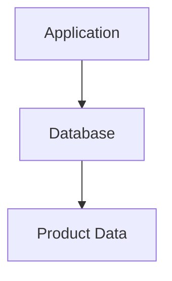

If the same data is requested frequently, repeatedly querying the database can add latency and load.

A cache stores a temporary copy of data so the application can retrieve it more quickly.

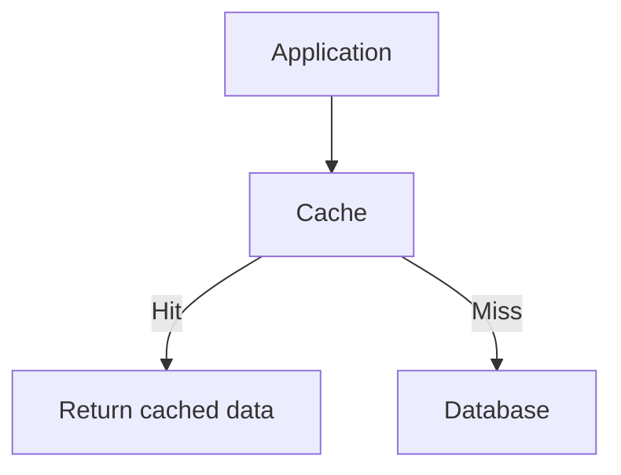

With a **managed cache**, a cloud provider operates much of the underlying caching infrastructure.

Depending on the service, the provider may handle:

- Provisioning cache nodes
- Infrastructure maintenance
- Supported software updates
- Monitoring and health information
- Replication and failover options
- Scaling features

Your team still decides what to cache, how long data remains useful, how cache misses are handled, and what happens when the cache becomes unavailable.

> **Managed caching reduces some infrastructure work around a cache. It does not automatically design a correct caching strategy.**

---

## 2. Beginner Analogy: A Frequently Used Notebook

Imagine a shopkeeper who frequently checks the prices of popular products.

Without a notebook:

1. A customer asks for a price.
2. The shopkeeper searches the main inventory register.
3. The shopkeeper finds the price.
4. The shopkeeper answers.

With a notebook containing recently checked prices, the shopkeeper can answer many questions immediately.

The notebook is the cache.

The inventory register is the database.

A managed cache is like having someone else maintain the notebook's storage infrastructure, while you still decide what information belongs in it and when it must be refreshed.

**Important:** If the notebook is lost, the shopkeeper can consult the main register again. This works only because the register remains the authoritative source.

---

## 3. Where Does a Managed Cache Fit?

Consider an online store:

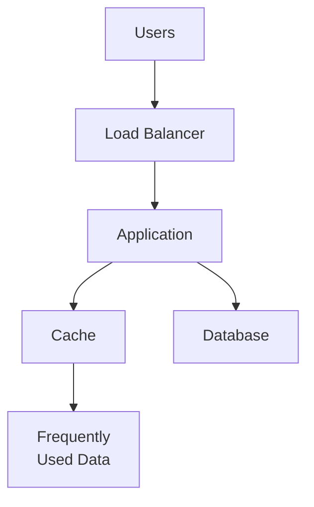

Examples of data that might be cached include:

- Product details
- Category lists
- Configuration values
- Session data, if the design supports it
- Results of expensive calculations

Not every request should use a cache. Frequently changing, highly sensitive, or rarely accessed data may require a different approach.

---

## 4. Managed vs Self-Managed Cache

### Self-managed cache

Your team installs and operates caching software on its own VM or container infrastructure.

You may be responsible for:

- Installation and upgrades
- Resource sizing
- Replication setup
- Monitoring
- Failure recovery
- Security configuration

### Managed cache

The provider operates the underlying service and offers supported configuration and management features.

| Area | Managed cache | Self-managed cache |
|---|---|---|
| Initial provisioning | Often simpler | Your team sets it up |
| Infrastructure maintenance | Provider handles supported tasks | Your team |
| Replication and failover | May be available as managed features | Your team configures and operates them |
| Configuration and access control | Shared responsibility | Your team |
| Cache keys and expiration policy | Your team | Your team |
| Application cache logic | Your team | Your team |
| Cost and control | Service-specific pricing and limits | More direct control, more operational work |

Managed services reduce some operational burden, but they do not remove the need to understand caching behavior.

---

## 5. Managed Does Not Mean Automatically Highly Available

A managed cache can still become unavailable.

A basic configuration may have one cache node:

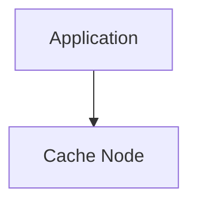

If the node fails, the application may experience cache misses, errors, or temporary performance degradation.

A service with supported replication or failover may provide another arrangement:

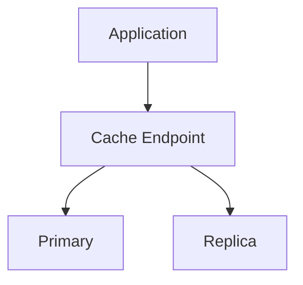

This is a conceptual illustration. Actual topologies and failover behavior vary by service.

Even when a managed cache supports failover, you must consider:

- Whether recently written cache data can be lost
- How quickly failover occurs
- Whether the application reconnects correctly
- What happens to request latency during recovery
- Whether the database can handle the additional load

**Managed service availability does not guarantee that your complete application remains available.**

---

## 6. Cache Data Is Not Automatically Durable

A cache is generally designed to improve access speed, not to replace authoritative storage.

For example:

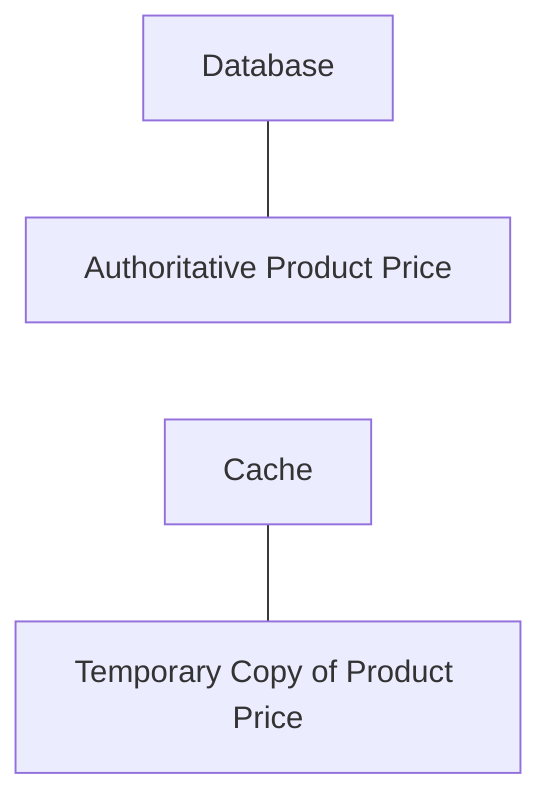

The cache may lose data because of:

- Node failure
- Eviction
- Expiration
- Restart or failover
- Configuration changes

Some cache products support persistence or snapshots, but these features do not automatically make a cache the right place for critical business records.

For most ordinary cache designs, the application should be able to recover cached data from the authoritative source.

> **Treat cached data as replaceable unless the chosen system and design explicitly require otherwise.**

---

## 7. Cache-Aside Still Applies

Using a managed cache does not change the fundamental cache-aside pattern.

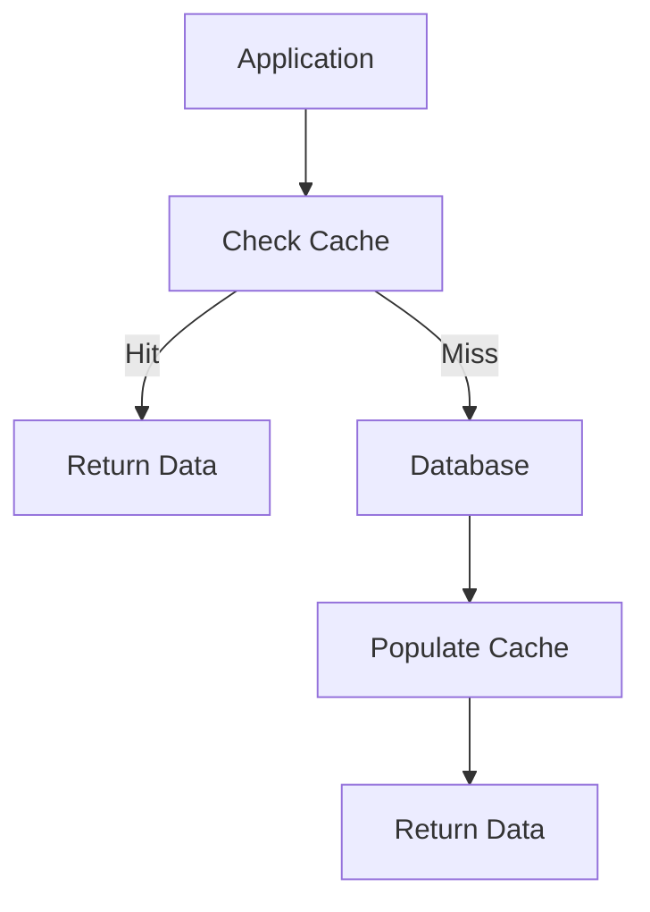

For example, a product page might request product `42`.

1. The application checks the cache for `product:42`.
2. If found, it returns the cached value.
3. If absent, it queries the database.
4. It stores the result in the cache with an appropriate expiration.
5. It returns the result.

The application still needs correct behavior for cache misses, errors, stale data, and concurrent requests.

See **03.05 — Cache-Aside** for the detailed pattern.

---

## 8. Cache Expiration and Eviction

Two concepts are important.

### Expiration

An entry may have a time-to-live (TTL).

For example:

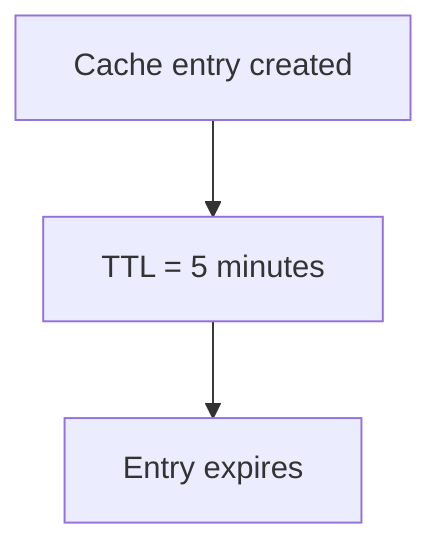

Expiration limits how long the entry remains valid under the configured policy.

### Eviction

A cache may remove entries before their TTL expires because it needs space or follows an eviction policy.

For example:

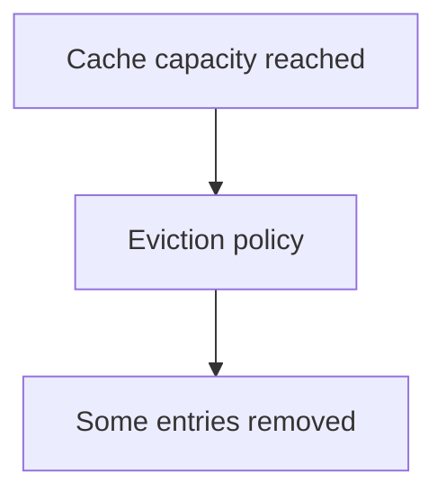

Expiration and eviction are not the same.

A managed cache still needs appropriate memory sizing, expiration policies, and an understanding of its eviction behavior.

---

## 9. Memory Is Still Limited

Suppose your cache has a memory limit of 4 GB, but the application attempts to keep 8 GB of cache entries.

The cache cannot retain everything in memory under that configuration.

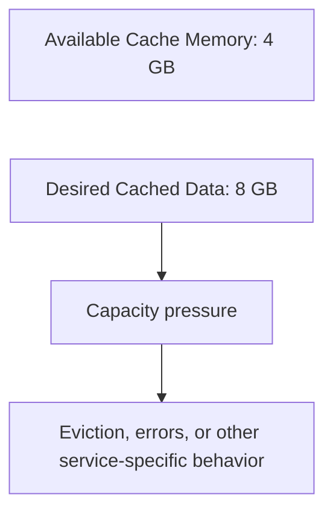

The outcome depends on the cache engine and configuration.

Possible consequences include:

- More cache misses
- Increased database traffic
- Memory-related errors
- Reduced hit rate
- Higher latency

A managed service does not remove finite resource limits. Monitor memory use, hit rate, evictions, latency, and connection behavior.

---

## 10. Cache Failure and Database Pressure

One important failure scenario is a cache outage.

Normally:

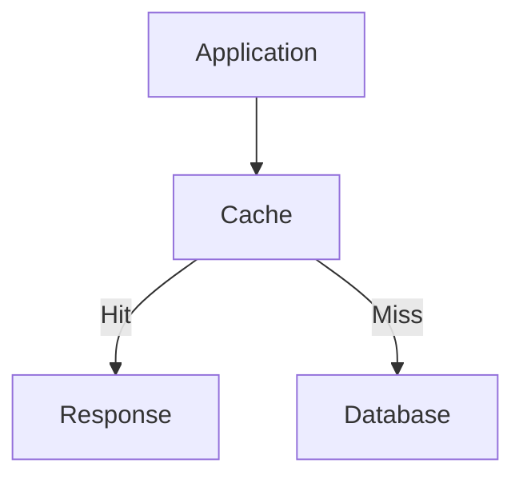

If the cache becomes unavailable, the application may need to query the database directly.

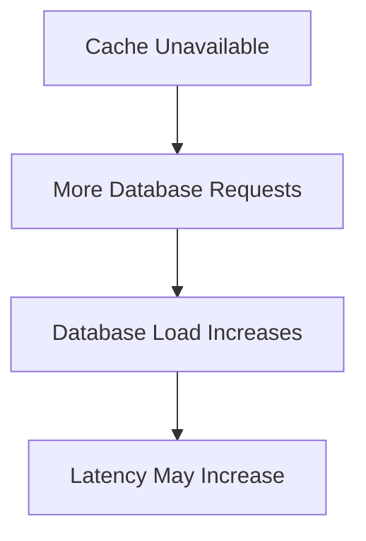

If the database was already near capacity, this can create a second failure.

Before relying on a cache, decide:

- Can the application bypass it temporarily?
- Which errors should be treated as cache misses?
- How much extra database traffic can be tolerated?
- Should some requests fail rather than overload the database?
- How will the cache recover without creating a traffic spike?

A cache is an optimization, but its failure can affect the rest of the system.

---

## 11. Cache Stampede

Suppose a popular cache entry expires while thousands of users request it.

Many requests may observe the miss simultaneously and query the database.

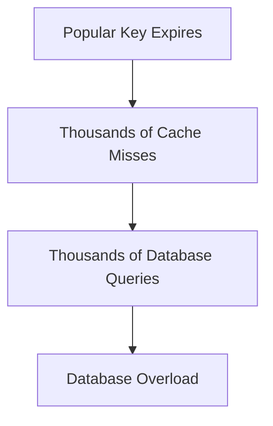

This is commonly called a **cache stampede**.

Possible mitigations include:

- Request coalescing or single-flight behavior
- Refreshing entries before expiration
- TTL jitter
- Short-lived stale responses where acceptable
- Rate-limiting cache-miss work

Managed caching alone does not prevent a stampede. The application and cache policy must be designed to handle it.

See **03.10 — Cache Stampede** for the detailed treatment.

---

## 12. Security and Network Access

A managed cache may contain data that should not be publicly accessible.

Examples include:

- Session information
- User-specific results
- Internal configuration
- Temporary authorization-related data

A typical design places the cache on a private network path accessible only to approved application resources.

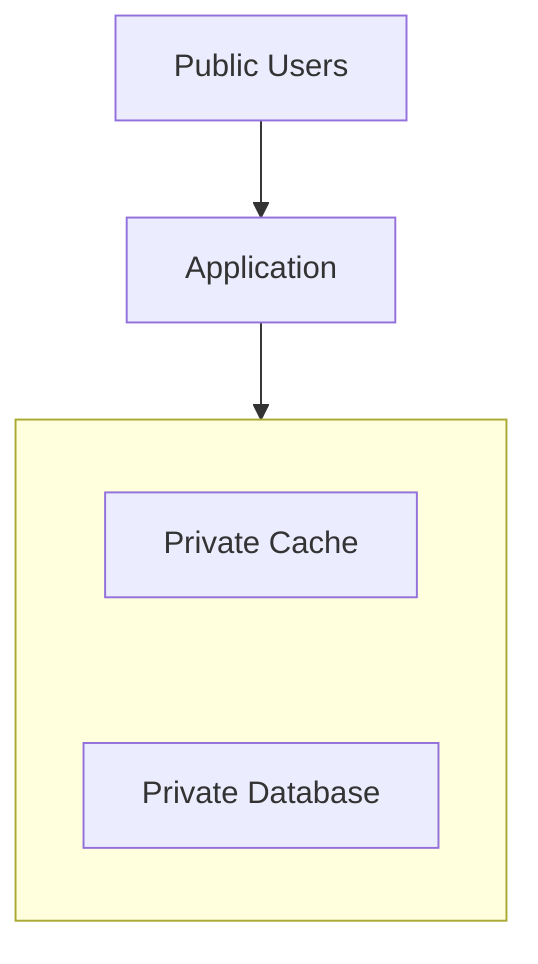

Apply appropriate controls:

- Restrict network access.
- Require authentication where supported.
- Use encryption in transit where appropriate.
- Store credentials securely.
- Avoid placing secrets in cache keys or logs.
- Prevent one tenant or user from reading another user's cached data.

A private network alone does not replace authentication or authorization.

---

## 13. Cost and Capacity Planning

Managed cache costs may include:

- Cache-node or provisioned capacity
- Memory size and instance count
- Replicas and high-availability options
- Network transfer
- Monitoring or additional service features

The cache may reduce database load, but the cost is worthwhile only if the benefit justifies it.

Consider two situations.

### Situation A — Good candidate

A product catalog is read frequently and changes relatively infrequently.

Caching may reduce repeated database work.

### Situation B — Weak candidate

A small table is rarely queried and its results are cheap to retrieve.

A cache may add infrastructure and consistency complexity without providing meaningful benefit.

Before adding or enlarging a cache, measure:

- Cache hit rate
- Cache miss rate
- Database load
- Request latency
- Memory utilization
- Eviction rate
- Cache operation errors
- Total cost

**Do not optimize for cache hit rate alone.** A high hit rate is useful only if it improves the system's actual performance or cost objectives.

---

## 14. Choosing Managed Caching

A managed cache is often appropriate when:

- Repeated reads create measurable database pressure.
- Low-latency access to temporary data is valuable.
- Your team wants to reduce cache infrastructure operations.
- The workload fits the service's memory, throughput, and connection limits.
- The benefits justify the cost and additional failure modes.

It may be unnecessary when:

- The application is small and the database performs well.
- Data is rarely reused.
- The data is expensive to regenerate or cannot safely be treated as disposable.
- Cache invalidation would be more complex than the original data access.
- The additional infrastructure would not improve a measured problem.

Start without a cache when possible, measure the workload, and add one when the evidence justifies it.

---

## 15. Hands-On Exercise: Cache a Product Catalog

Imagine an online store with a product catalog.

The database stores:

```text
Product ID
Name
Price
Description
Stock Quantity
```

Design a caching policy.

### Step 1 — Choose what to cache

- [ ] Product name and description
- [ ] Product price
- [ ] Stock quantity
- [ ] User-specific cart contents

Decide which fields change frequently and which can tolerate slightly stale data.

### Step 2 — Define the cache behavior

For each field, decide:

- What key identifies the cached value?
- How long should it remain cached?
- What happens after a cache miss?
- How is the entry refreshed after an update?
- What happens when the cache is unavailable?

### Step 3 — Test failure scenarios

1. What happens when the cache node fails?
2. Can the database handle the increased traffic?
3. What happens when a popular entry expires?
4. Could a user see an outdated price?
5. Could stale stock information allow an invalid order?

**Important:** The final stock and price checks for an order should rely on authoritative business data and appropriate transaction rules, not merely on an old cached value.

---

## 16. Common Mistakes

- **Assuming managed means failure-proof:** Managed services can still fail or reach capacity limits.
- **Treating cache as the source of truth:** The authoritative data must remain correct.
- **Ignoring cache-unavailable behavior:** A database may become overloaded if every request bypasses the cache.
- **Confusing expiration with eviction:** Entries can be removed for different reasons.
- **Assuming replicas guarantee zero data loss:** Failover and replication guarantees depend on the service.
- **Ignoring memory limits:** Cache capacity must match the workload.
- **Adding caching without measuring:** The cache may add cost and complexity without meaningful improvement.
- **Ignoring consistency:** Stale data can cause incorrect application behavior.
- **Assuming a high hit rate guarantees success:** Latency, correctness, database load, and cost matter too.

---

## 17. System Design View

Managed caching is a trade-off between faster repeated access and additional operational, consistency, and failure-management complexity.

Before introducing it, ask:

1. **Bottleneck:** Is repeated data access actually a problem?
2. **Reuse:** Is the data requested frequently enough to benefit?
3. **Correctness:** How stale can the data safely be?
4. **Capacity:** Can the cache hold the useful working set?
5. **Failure:** Can the application operate safely if the cache disappears?
6. **Security:** Which resources and identities can access the cache?
7. **Cost:** Does the reduction in database work justify the service cost?
8. **Operations:** Which management responsibilities does the provider actually handle?

---

## 18. Quick Reference

| Concept | Meaning |
|---|---|
| Managed cache | Cache service with provider-operated infrastructure and supported management features |
| Cache hit | Requested data is found in the cache |
| Cache miss | Requested data is not found in the cache |
| TTL | Time-to-live; configured lifetime of a cache entry |
| Eviction | Removing entries to satisfy a cache policy or resource constraints |
| Cache persistence | A mechanism for retaining cache data across certain restarts or failures, where supported |
| Replication | Maintaining copies of cache data across nodes |
| Failover | Switching service operation to an alternative after a failure |
| Cache stampede | Many simultaneous misses trigger excessive work against the underlying data source |
| Cache hit rate | Fraction of cache requests that are served by hits |
| Authoritative source | The system responsible for the correct, primary version of the data |

---

## 19. Knowledge Check

**1. What is a managed cache?**

A caching service in which the provider operates some of the underlying infrastructure and management tasks.

**2. Does managed caching eliminate cache design work?**

No. The application still needs appropriate keys, expiration, invalidation, failure handling, and consistency rules.

**3. Is a cache automatically a durable source of truth?**

No. Cache data may be evicted, expire, or be lost during failures.

**4. What can happen if a cache becomes unavailable?**

The application may generate more database requests, increasing latency and database load.

**5. What is the difference between expiration and eviction?**

Expiration follows an entry's lifetime policy. Eviction removes entries according to memory or cache-policy requirements, potentially before their TTL expires.

**6. Why is a high cache hit rate not enough to prove success?**

The cache must also improve meaningful outcomes such as latency, database load, correctness, or total cost.

**7. When should you add a managed cache?**

When measurements show that repeated data access is a meaningful bottleneck and the benefits justify the cost and complexity.

---

## Remember

> **Managed caching reduces some infrastructure work, but the application still owns the caching strategy.**

Cache data that is worth reusing, choose an appropriate expiration and invalidation policy, protect the cache, and plan for cache failure before it happens.

**Next: 08.11 — Managed Messaging**
