# 08.11 — Managed Messaging

## Learning Objectives

By the end of this chapter, you should be able to:

- Explain what managed messaging is and why cloud applications use it.
- Distinguish a managed message broker from a self-managed broker.
- Understand the responsibilities a cloud provider handles versus those your team retains.
- Recognize how queues, topics, producers, and consumers fit together.
- Understand delivery guarantees, retries, duplicate messages, and dead-letter queues.
- Evaluate the trade-offs involving reliability, throughput, cost, and vendor lock-in.

---

## 1. What Is Managed Messaging?

Imagine an e-commerce application that needs to send an order-confirmation email whenever a customer places an order.

One approach is to send the email during the customer's request.

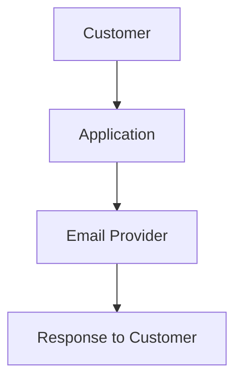

If the email provider is slow, the order request may also become slow.

A different approach is to publish a message describing the order. A background worker processes that message and sends the email separately.

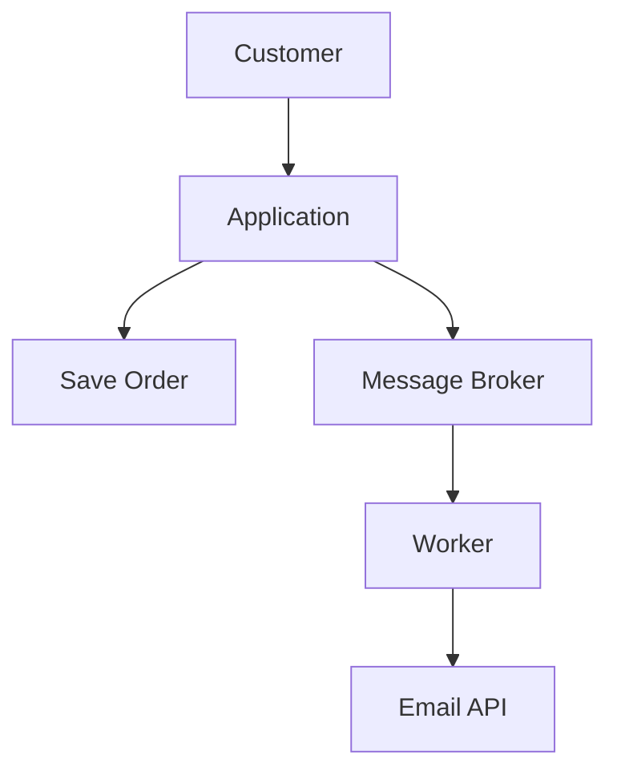

A **managed messaging service** provides messaging infrastructure operated by a cloud provider.

Depending on the service, the provider may manage:

- Broker infrastructure and provisioning
- Software maintenance
- Supported replication and availability features
- Monitoring and service health
- Scaling options
- Some aspects of message storage and recovery

Your team still designs message flows, delivery handling, retries, permissions, consumer behavior, and business correctness.

> **Managed messaging reduces some infrastructure-management work. It does not eliminate the need to design reliable message processing.**

---

## 2. Beginner Analogy: A Managed Postal Service

Imagine a business that receives thousands of orders.

Instead of asking each employee to personally deliver every task to another department, the business uses a postal service.

1. A department prepares a package.
2. The postal service accepts it.
3. The package waits in the delivery system.
4. The receiving department collects it.
5. The department processes the contents.

In messaging:

| Postal service | Messaging system |
|---|---|
| Sender | Producer |
| Package | Message |
| Postal sorting and delivery system | Broker or messaging service |
| Delivery destination | Queue or topic, depending on the model |
| Receiving department | Consumer |
| Failed-delivery handling | Retry and dead-letter handling |

The postal service manages much of the delivery infrastructure, but the sender must still provide meaningful information, and the receiver must know how to process it.

**Important:** A message being accepted by a service does not necessarily mean the business operation described by that message has completed.

---

## 3. Where Managed Messaging Fits

Consider an online store:

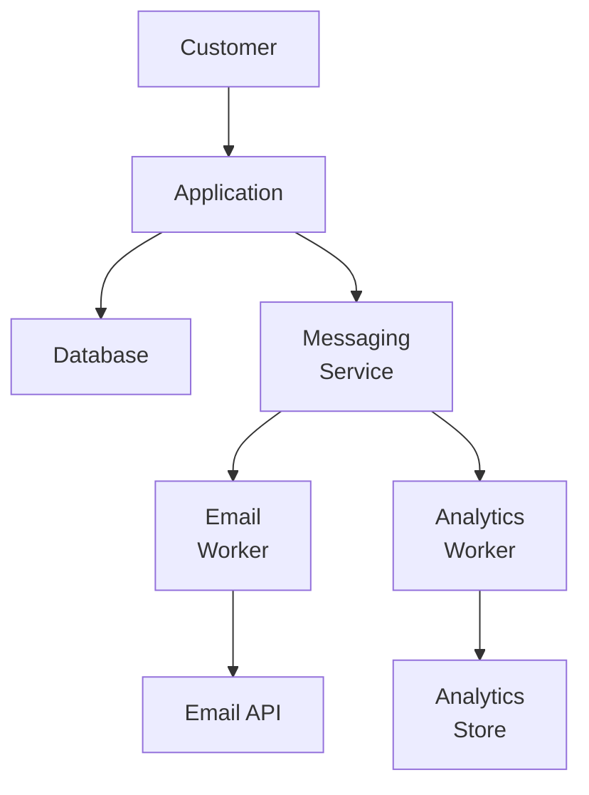

The application handles the immediate request while independent workers process suitable background tasks.

Examples include:

- Sending emails and SMS messages
- Processing uploaded files
- Generating reports
- Updating search indexes
- Delivering notifications
- Collecting analytics events
- Coordinating asynchronous workflows

Messaging is especially useful when work can happen independently of the original request.

---

## 4. Managed vs Self-Managed Messaging

### Self-managed messaging

Your team deploys a broker on VMs or containers and operates it.

Responsibilities may include:

- Installing and upgrading broker software
- Managing storage and capacity
- Configuring replication
- Handling broker failures
- Monitoring queues and consumers
- Planning recovery and scaling

### Managed messaging

The provider operates the underlying service and offers supported management features.

| Area | Managed messaging | Self-managed messaging |
|---|---|---|
| Infrastructure provisioning | Often simpler | Your team |
| Broker software maintenance | Provider-managed tasks | Your team |
| Replication and availability | Supported service options | Your team configures and operates them |
| Message semantics | Defined by service and configuration | Defined by broker and configuration |
| Consumer logic | Your team | Your team |
| Retry and failure handling | Shared responsibility | Your team |
| Capacity and cost | Service limits and pricing apply | More direct control, more operational work |

Managed services can reduce the operational burden, but they do not guarantee correct message delivery or successful business processing.

---

## 5. Queues and Topics

Managed messaging services may support queues, topics, streams, or combinations of these models.

### Queue

A queue commonly distributes messages among competing consumers.

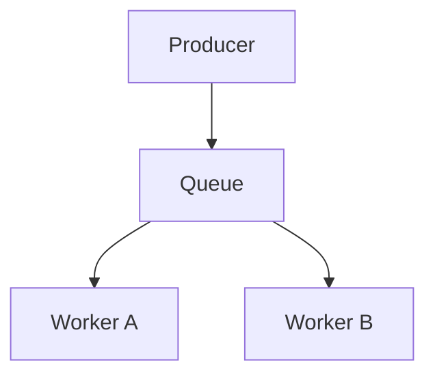

Depending on the queue and delivery configuration, a message is typically assigned to one consumer for processing at a time. Redelivery may occur if processing fails.

This model is useful for distributing tasks.

### Topic / publish-subscribe

A topic commonly allows multiple subscribers to receive the same published event.

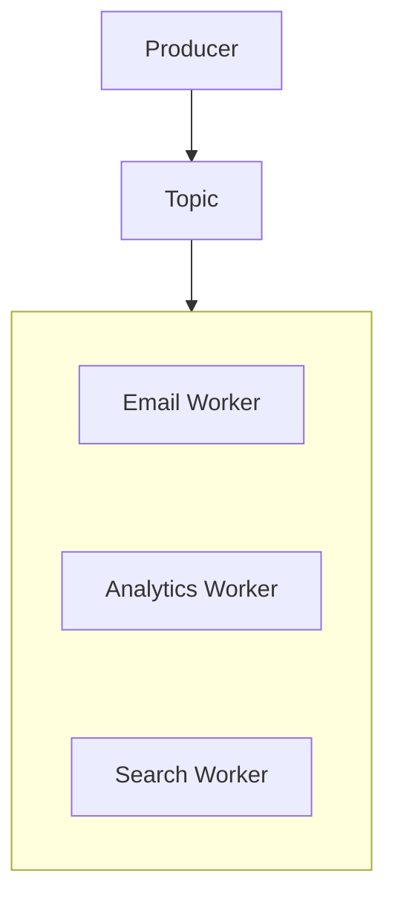

The actual delivery model depends on the service. Some systems create separate subscriptions or queues for each subscriber.

This model is useful when multiple independent components need to react to the same event.

For detailed fundamentals, see **05.03 — Message Queue** and **05.06 — Pub/Sub**.

---

## 6. Acknowledgment and Message Delivery

Suppose a worker receives a message:

```text
Message: Send order confirmation
```

The worker begins processing it.

The messaging system needs some way to determine whether the message has been handled successfully.

Many systems support an acknowledgment or equivalent completion signal.

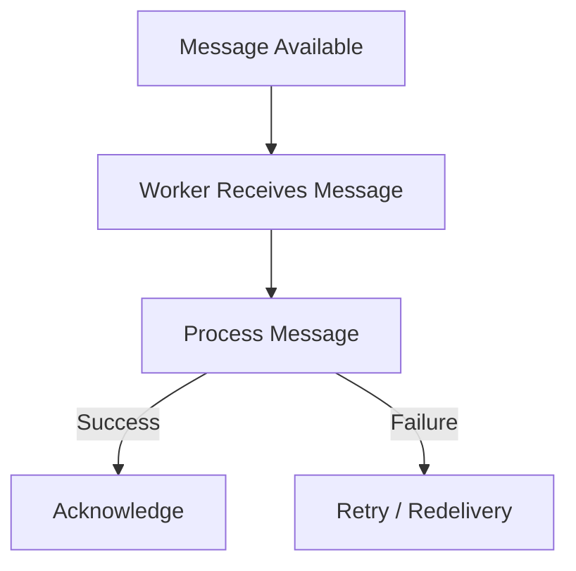

The exact acknowledgment rules differ by service.

The important point is that **receiving a message is not the same as completing its work**.

If a worker crashes after performing an operation but before acknowledging the message, the system may deliver it again.

---

## 7. Duplicate Messages and Idempotency

Managed messaging services may provide at-least-once delivery or other delivery modes, depending on the product and configuration.

With **at-least-once delivery**, a message may be delivered more than once.

For example:

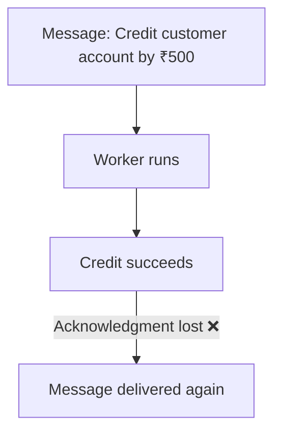

If the worker blindly performs the operation again, the customer could receive an incorrect second credit.

This is why consumers often need **idempotent processing**.

An idempotent consumer can recognize repeated processing attempts and prevent duplicate business effects.

Possible techniques include:

- Unique message or operation IDs
- Deduplication records
- Database uniqueness constraints
- Transactional state changes
- Idempotency keys for external APIs, where supported

> **Managed messaging can manage delivery infrastructure, but your application must still protect business operations against duplicate processing.**

See **05.10 — Message Delivery Semantics** and **05.11 — Idempotency**.

---

## 8. Retries and Dead-Letter Queues

A message can fail because of:

- Temporary database unavailability
- External API timeouts
- Invalid or unexpected data
- A software bug
- Permission or configuration errors

A retry policy can allow temporary failures another opportunity to succeed.

However, retrying a permanently invalid message forever wastes resources.

A **dead-letter queue (DLQ)** or equivalent failure destination can hold messages that exceed the configured retry or delivery policy.

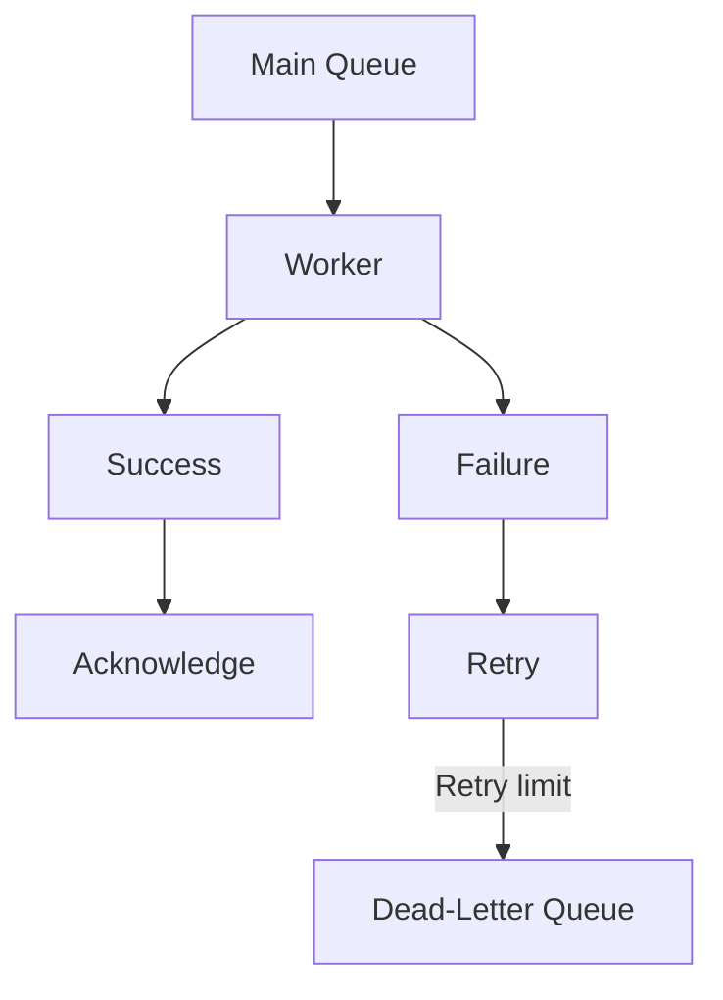

A DLQ does not fix the problem automatically.

Teams still need to:

- Monitor the DLQ
- Investigate failure reasons
- Correct invalid data or code
- Decide whether and how to replay messages
- Ensure replaying does not duplicate business effects

Retry limits, backoff, and DLQ behavior depend on the service and configuration.

---

## 9. Ordering and Message Durability

Not every messaging service provides the same ordering guarantees.

Some preserve ordering only within a particular group or partition. Others may provide different ordering scopes.

If your application requires messages to be processed in a particular order, verify the service's exact guarantees and design consumers accordingly.

For example:

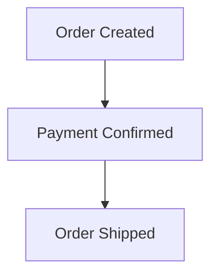

Processing `Order Shipped` before `Payment Confirmed` could violate the business workflow.

Message durability also depends on the service, configuration, acknowledgment state, replication, and retention settings.

Do not assume that every managed service preserves every message indefinitely or guarantees identical behavior during every failure.

---

## 10. Scaling Consumers

Suppose messages arrive faster than one worker can process them.

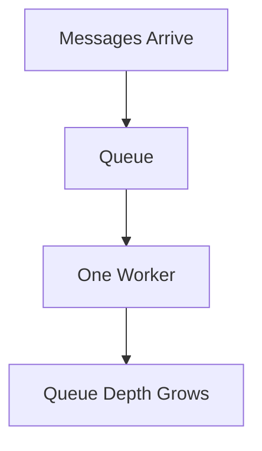

Adding consumers may increase processing capacity:

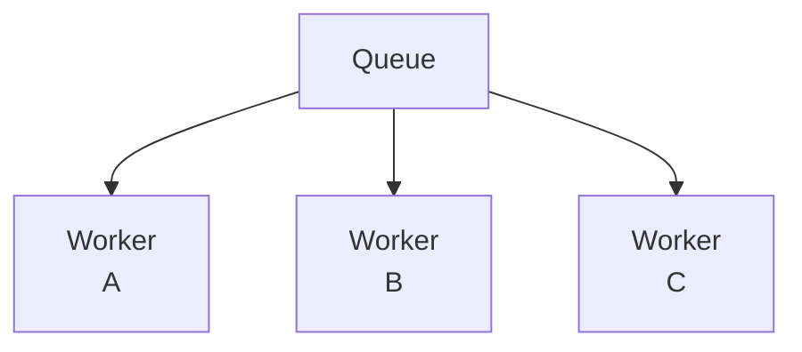

But adding workers helps only when the workload can be processed concurrently and downstream dependencies have enough capacity.

For example, ten workers can overwhelm a database if every worker creates heavy database load.

Useful measurements include:

- Queue depth
- Message age
- Processing rate
- Failure and retry rates
- Consumer utilization
- Downstream latency
- Processing cost

A growing queue is a signal to investigate, not automatic proof that you need more workers.

---

## 11. Backpressure and Queue Growth

A queue can absorb a temporary burst of work, but it cannot solve a permanent capacity mismatch by itself.

Suppose:

```text
Incoming: 1,000 messages/sec
Processing: 600 messages/sec
```

The backlog grows by approximately 400 messages per second while those rates persist.

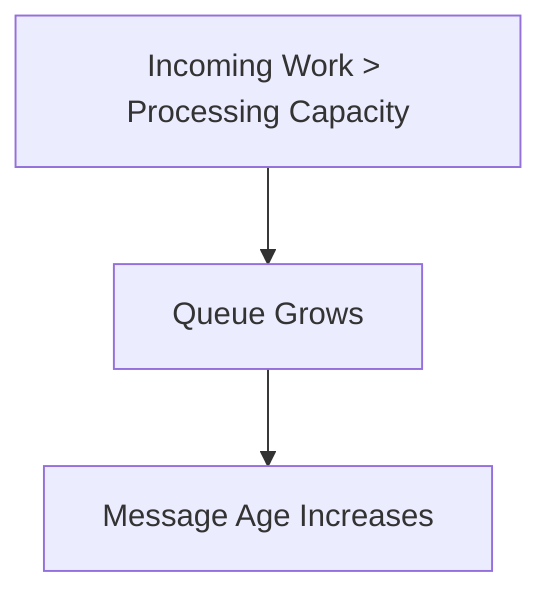

Eventually, storage, retention, deadlines, or business requirements may become constraints.

Possible responses include:

- Scaling consumers safely
- Reducing unnecessary work
- Improving processing efficiency
- Applying producer-side rate limits
- Prioritizing important messages
- Rejecting or deferring work when capacity is exhausted

Managed infrastructure does not eliminate the need to manage overload.

---

## 12. Security and Access Control

Messaging services often contain sensitive information or trigger important operations.

For example, a message might contain an order ID, customer identifier, or event details.

Important controls include:

- Restricting which identities can publish messages
- Restricting which consumers can read or delete messages
- Encrypting messages where supported
- Protecting credentials
- Avoiding unnecessary sensitive data in payloads
- Setting suitable retention policies
- Auditing administrative access where required

For example, an analytics worker may need to read order events but should not necessarily have permission to publish payment commands.

Apply least privilege rather than granting every service unrestricted access.

IAM is covered in **08.13 — IAM**.

---

## 13. Cost and Capacity

Managed messaging costs may depend on:

- Number of requests or operations
- Message volume and size
- Throughput or provisioned capacity
- Retention and stored messages
- Replication and availability options
- Data transfer
- Consumer and worker compute

A queue that is inexpensive at low volume may cost more as traffic, message size, retention, or consumer count grows.

Poor message design can also increase cost.

For example, publishing a 5 MB payload repeatedly may be less efficient than storing the large file in object storage and sending a small message containing its identifier.

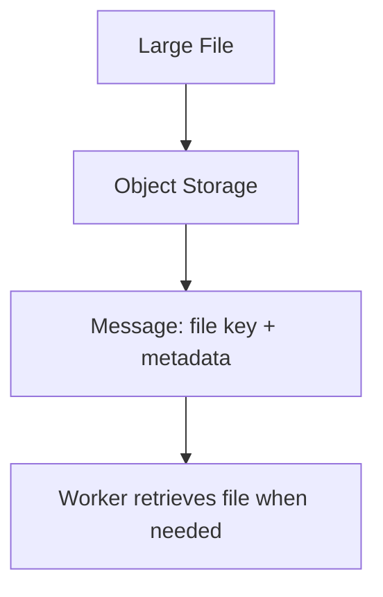

This design can reduce message size, although it introduces a dependency on the object being available when the worker processes the message.

Choose based on workload, delivery needs, and total cost—not only the service's headline price.

---

## 14. When Should You Use Managed Messaging?

Managed messaging is often a good fit when:

- Work can happen asynchronously.
- Several components need to communicate without tight timing dependencies.
- You need durable message handling supported by the chosen service.
- Traffic arrives in bursts.
- You want to reduce broker infrastructure operations.
- The service's delivery, ordering, retention, and scaling features match your requirements.

It may be unnecessary when:

- A simple synchronous request is sufficient.
- There is no meaningful background workload.
- A queue would add complexity without solving a real constraint.
- The service's guarantees or cost do not fit the application.
- The team has not yet designed how failures and duplicate processing will be handled.

**Do not add messaging merely because an application is deployed in the cloud.** Use it when asynchronous communication solves a real problem.

---

## 15. Hands-On Exercise: Design Order Notifications

Imagine an e-commerce application that needs to send confirmation emails after an order is created.

Design the flow:

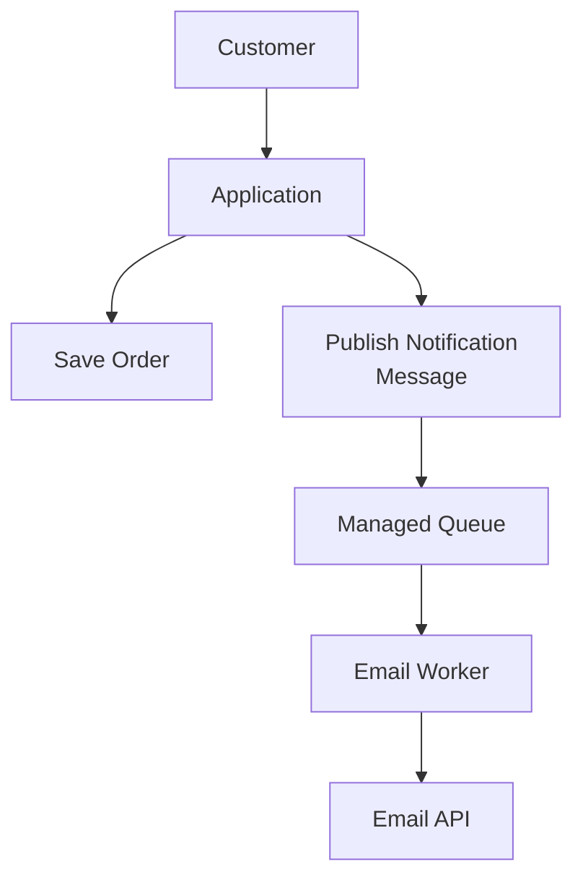

Answer these questions:

1. What information should the message contain?
2. What happens if the email API times out?
3. How many times should the worker retry?
4. What happens if the worker sends the email but crashes before acknowledging the message?
5. How will you identify and investigate messages that repeatedly fail?
6. What happens if the queue grows faster than workers can process it?
7. How will you prevent the notification workflow from losing required work when an order is saved?

For the last question, consider the gap between saving an order and publishing its message. The **Outbox Pattern** in **07.15** addresses this kind of dual-write problem.

---

## 16. Common Mistakes

- **Assuming managed means guaranteed delivery:** Guarantees depend on the service, configuration, and failure scenario.
- **Confusing acceptance with completion:** A broker accepting a message does not mean its business operation succeeded.
- **Ignoring duplicate delivery:** Consumers must handle repeated attempts safely.
- **Retrying forever:** Permanently invalid messages need a bounded failure strategy.
- **Ignoring queue age:** A large or old backlog can violate business deadlines even if no messages are lost.
- **Adding consumers blindly:** More workers can overload downstream services.
- **Ignoring ordering requirements:** Concurrent processing may violate workflow assumptions.
- **Ignoring the database-to-message gap:** Saving business data and publishing a message are separate operations unless a suitable atomic design is used.
- **Assuming a DLQ fixes failures:** Dead-lettered messages still require investigation and an intentional recovery process.

---

## 17. System Design View

Managed messaging separates the production of work from its processing and reduces some infrastructure responsibilities.

Before choosing a service, ask:

1. **Workload:** Does this work need to happen asynchronously?
2. **Delivery:** What delivery guarantees are required?
3. **Ordering:** Which messages, if any, must be processed in order?
4. **Duplicates:** Can the consumer process a message more than once safely?
5. **Failure:** What happens after repeated processing failures?
6. **Capacity:** Can consumers keep up with incoming work?
7. **Recovery:** Can messages be retained, replayed, or investigated as required?
8. **Security:** Who can publish, consume, or administer the service?
9. **Cost:** How do volume, size, retention, and processing affect total cost?
10. **Portability:** How much does the application depend on provider-specific messaging features?

---

## 18. Quick Reference

| Concept | Meaning |
|---|---|
| Managed messaging | Messaging infrastructure operated in part by a cloud provider |
| Producer | Component that publishes a message |
| Consumer | Component that processes a message |
| Broker | Component or service that accepts, stores, and routes messages |
| Queue | Messaging structure commonly used to distribute work |
| Topic | Publish-subscribe mechanism for distributing events to subscribers |
| Acknowledgment | Signal that a message has been handled according to the delivery protocol |
| At-least-once delivery | Delivery model that permits redelivery and therefore duplicates |
| Idempotency | Processing repeated attempts without repeating the business effect |
| Retry policy | Rules controlling when and how failed processing is attempted again |
| Dead-letter queue | Destination for messages that exceed a failure or retry policy |
| Backpressure | Mechanisms that prevent incoming work from overwhelming processing capacity |
| Queue depth | Number of messages waiting for processing |
| Message age | How long a message has been waiting or retained, depending on the metric |

---

## 19. Knowledge Check

**1. What is a managed messaging service?**

A provider-operated messaging service that reduces some of the work involved in running broker infrastructure.

**2. Does accepting a message mean the business operation is complete?**

No. A consumer may still need to process the message and confirm successful handling.

**3. Why should consumers handle duplicates?**

A message may be redelivered after a timeout, crash, or lost acknowledgment. Idempotency helps prevent duplicate business effects.

**4. What is a dead-letter queue used for?**

It holds messages that exceed a configured failure or retry policy so they can be investigated or intentionally recovered.

**5. Can adding consumers always solve queue growth?**

No. Downstream capacity, message-processing cost, concurrency constraints, and ordering requirements may limit the benefit.

**6. Why is the Outbox Pattern relevant to messaging?**

It helps coordinate a database change and the corresponding event record in one local transaction, reducing the risk of saving data without publishing the required event.

**7. When should you choose managed messaging?**

When asynchronous communication, buffering, or independent processing provides a meaningful benefit and the service's guarantees and costs fit the requirements.

---

## Remember

> **Managed messaging reduces the burden of operating messaging infrastructure, but reliable asynchronous processing still depends on your application's delivery, retry, idempotency, security, and recovery design.**

Choose messaging when it solves a real coordination or workload problem. Then design for duplicate messages, failed consumers, growing backlogs, and downstream limits before production traffic exposes those weaknesses.

**Next: 08.12 — CDN & Edge**
