# 08.12 — CDN & Edge

## Learning Objectives

By the end of this chapter, you should be able to:

- Explain how a Content Delivery Network (CDN) improves content delivery.
- Understand edge locations, origin servers, cache hits, and cache misses.
- Distinguish a CDN from a traditional cache and a reverse proxy.
- Understand how cache policies affect freshness, performance, and cost.
- Recognize when content should not be cached publicly.
- Understand common CDN failure modes and security considerations.
- Decide when a CDN is useful for a cloud application.

---

## 1. What Is a CDN?

Imagine your application is hosted in one region, but its users are spread across the world.

A user in India requests an image from a server located in the United States.

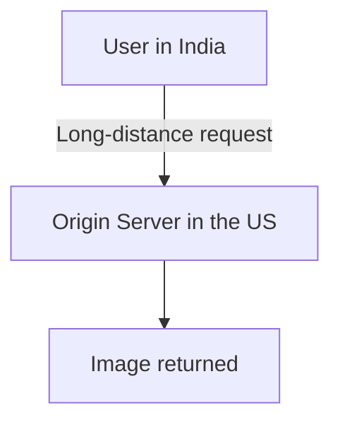

Even if the origin server is powerful, the physical distance can add network latency.

A **Content Delivery Network (CDN)** distributes content through a network of geographically distributed locations, allowing users to retrieve eligible content from a nearby edge location.

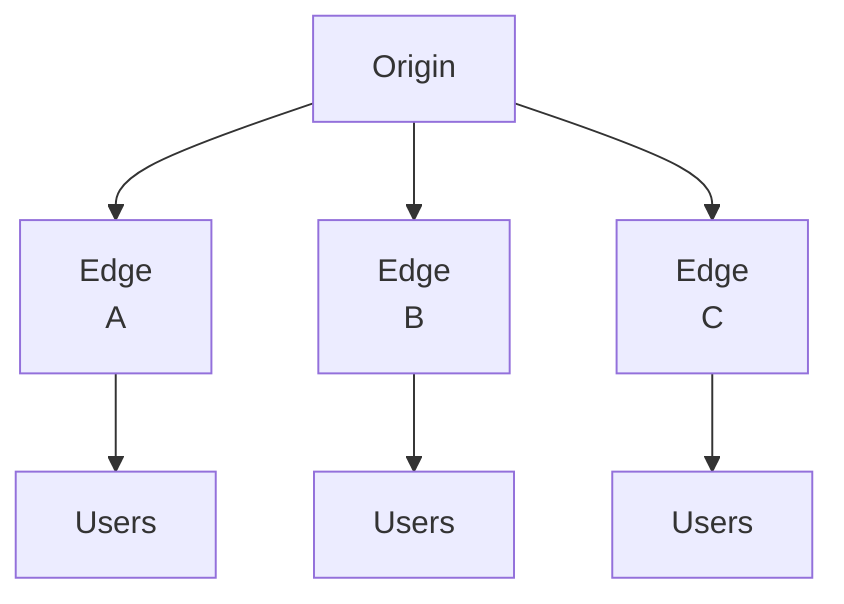

The CDN can cache content at its edge locations and serve repeated requests without contacting the origin every time.

> **A CDN improves content delivery by bringing eligible content closer to users and reducing repeated work at the origin.**

A CDN does not automatically make every request faster. The benefit depends on the content, user location, cache policy, and network conditions.

---

## 2. Beginner Analogy: Local Distribution Warehouses

Imagine a company that sells books from one central warehouse.

Without regional warehouses:

1. Every customer orders from the central warehouse.
2. Every delivery travels a long distance.
3. The central warehouse handles every request.

Now imagine the company places copies of popular books in regional warehouses.

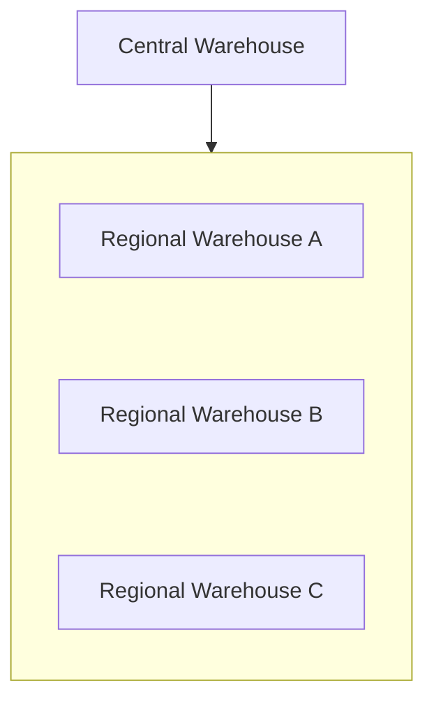

Customers can receive popular books from a nearby warehouse instead of waiting for a shipment from the center.

The analogy maps to a CDN:

| Distribution network | CDN |
|---|---|
| Central warehouse | Origin server |
| Regional warehouse | Edge location |
| Stored book | Cached content |
| Customer request | HTTP request |
| Restocking a warehouse | Fetching or refreshing content from the origin |

Not every book is stocked everywhere. If a regional warehouse does not have the requested book, it may need to obtain it from the central warehouse.

Similarly, a CDN cache miss may require a request to the origin.

---

## 3. What Is the Origin?

The **origin** is the source from which a CDN obtains content when it cannot serve the request from its cache or when the configured policy requires contacting the source.

An origin might be:

- A web server
- An application server
- Object storage
- Another supported HTTP endpoint

For example, an online learning platform might store course videos in object storage.

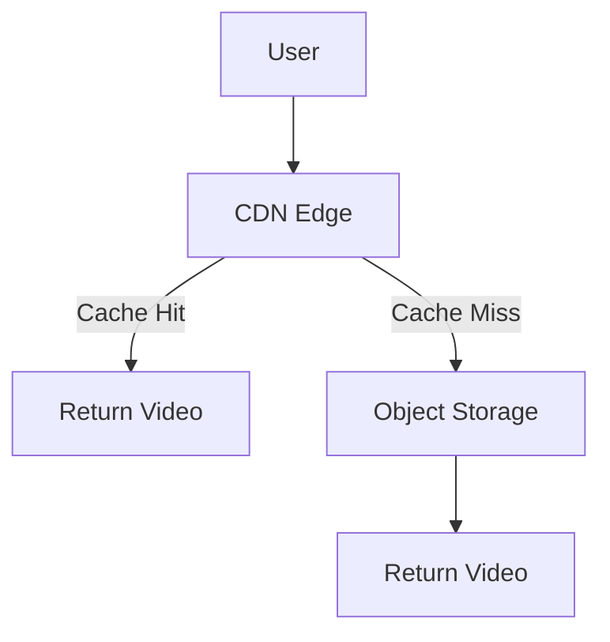

The exact fetch, caching, and response behavior depends on the CDN configuration.

The origin remains important even when most requests are served from the edge.

---

## 4. What Happens During a CDN Request?

Consider a user requesting:

```http
GET /images/course-thumbnail.webp
```

A simplified flow looks like this:

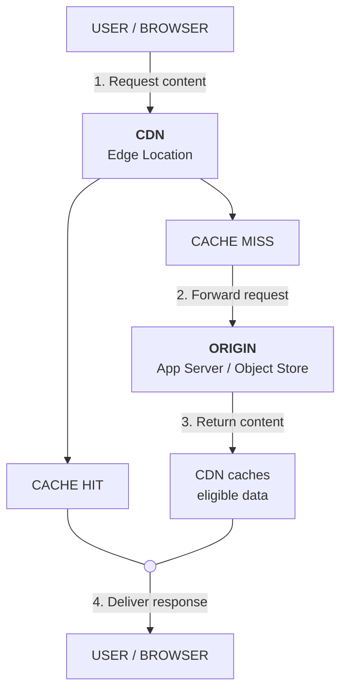

**How to read the diagram**

- Cache hit: The CDN already has a usable cached copy, so it can respond without contacting the origin.
- Cache miss: The CDN requests the content from the origin. Depending on the configuration, it may cache the response for later requests.
- Origin: The original source of the content, such as an application server or object storage.
- Important: Not every response is cacheable. Personalized or private content needs appropriate authorization and caching rules.

Key takeaway: A CDN can reduce user latency and origin workload when eligible content is served from the edge cache.

The first request may be slower because the edge needs to fetch the content.

Subsequent requests may be faster if the content remains cached and the requests can use that cache entry.

This is a simplified model. Real CDNs may use regional cache layers, request collapsing, revalidation, and other optimizations.

---

## 5. Cache Hit vs Cache Miss

### Cache hit

The requested representation is available in the edge cache and is suitable to serve under the current policy.

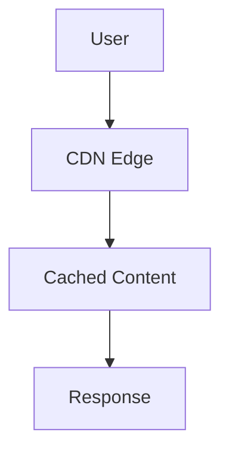

This can reduce origin requests and improve latency.

### Cache miss

The edge does not have a usable cached representation.

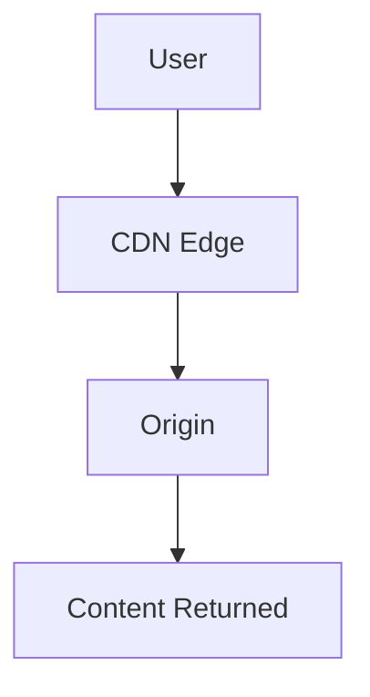

A miss may increase latency and origin load.

**Important:** A CDN does not necessarily cache every response. Cacheability depends on the content, request, response headers, and CDN rules.

---

## 6. What Content Should You Put Behind a CDN?

CDNs are commonly useful for content that can be reused across many requests.

| Content | Typical suitability |
|---|---|
| Logos and icons | Excellent |
| Versioned CSS and JavaScript | Excellent |
| Product images | Often excellent |
| Public course videos | Often excellent |
| Public documentation | Often good |
| Frequently changing public data | Depends on freshness requirements |
| Personalized account pages | Usually requires special care |
| Private financial information | Must not be exposed through unsafe shared caching |

A CDN may also accelerate dynamic requests through connection optimization, routing, or other provider-specific features. Those benefits are separate from caching static content.

Start by identifying which requests benefit from shared caching rather than placing every endpoint behind an aggressive cache policy.

---

## 7. Static vs Dynamic Content

### Static content

Static content usually remains unchanged for a meaningful period or can be published under a versioned URL.

Examples:

```text
/assets/app.8f32a1.js
/images/logo.svg
/videos/lesson-01.mp4
```

This content is often a good candidate for longer cache lifetimes.

### Dynamic content

Dynamic content may depend on:

- The authenticated user
- Current database state
- Request parameters
- Permissions
- Recent business events

For example:

```text
GET /api/my-account
```

The response may be different for every user.

Caching it incorrectly in a shared CDN cache could expose one user's data to another user.

> **Cacheability depends on both how often content changes and whether the response is safe to share.**

---

## 8. Cache-Control and Freshness

HTTP caching rules help determine how responses can be stored and reused.

For example:

```http
Cache-Control: public, max-age=3600
```

This indicates that a response can be stored by shared caches and is fresh for up to 3,600 seconds, subject to applicable caching rules.

A response such as:

```http
Cache-Control: private, max-age=60
```

is intended for private caches, not shared caches such as a CDN.

And:

```http
Cache-Control: no-store
```

instructs compliant caches not to store the response.

Actual behavior depends on the complete HTTP rules and any CDN-specific configuration. A CDN can also have custom policies, so origin headers and CDN rules must be designed consistently.

HTTP caching fundamentals are covered in **03.12 — HTTP Caching**.

---

## 9. Cache Keys: Which Requests Share a Cached Response?

A CDN needs a way to determine whether a request can use an existing cached representation.

This is related to its **cache key**.

Conceptually, a cache key may depend on:

```text
Host
Path
Selected query parameters
Selected headers
Other configured dimensions
```

For example:

```text
/products/42?currency=INR
```

may produce different content from:

```text
/products/42?currency=USD
```

If currency changes the response but the cache key ignores it, the CDN could serve the wrong representation.

The opposite problem is also possible: including unnecessary query parameters in the cache key can create many separate cache entries and reduce the hit rate.

**Cache keys are a correctness decision, not merely a performance setting.**

---

## 10. Cache Invalidation and Versioned Assets

Suppose a logo changes, but the CDN still has the old version cached.

Users may continue seeing the old logo until the cached entry expires or is invalidated.

There are two common approaches.

### Invalidation

Request that the CDN remove or refresh selected cached content.

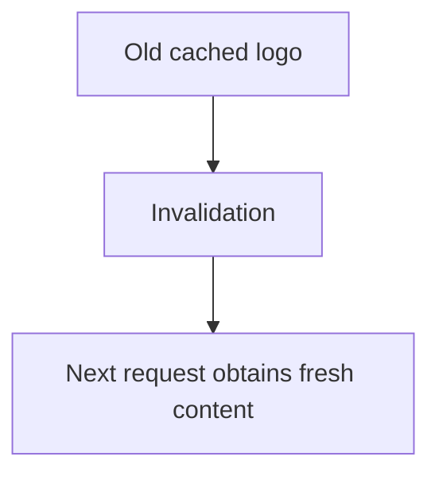

Invalidation timing and behavior depend on the provider.

### Versioned URLs

Publish a changed asset under a new URL:

```text
/assets/app-v1.js
/assets/app-v2.js
```

Or use content hashes:

```text
/assets/app.8f32a1.js
/assets/app.91cd44.js
```

The new URL creates a distinct cache key, avoiding dependence on invalidating the old URL before users can receive the new version.

Versioned assets are especially useful for long-lived caching.

---

## 11. CDN vs Application Cache vs Object Storage

These components serve different purposes.

| Component | Primary responsibility |
|---|---|
| Application cache | Reuse data during application processing |
| Database | Store and query authoritative structured data |
| Object storage | Store files and objects |
| CDN | Deliver eligible content efficiently to users |

A common architecture combines them:

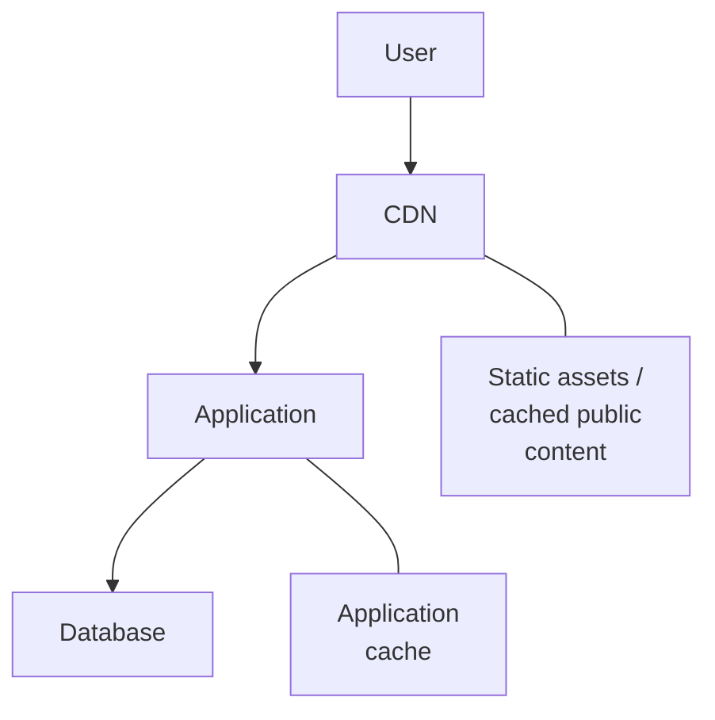

For large public files:

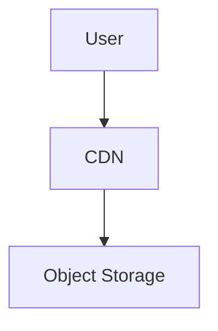

A CDN does not replace the origin storage or database. It reduces repeated work for suitable requests.

---

## 12. CDN and Network Distance

A CDN can reduce the distance between users and the content they request.

However, the actual latency improvement depends on:

- The user's location
- Which edge location serves the request
- Routing and network conditions
- Whether the content is cached
- The size of the response
- Whether the origin must be contacted

A cache hit can reduce both origin latency and the amount of work performed by the origin.

But a cache miss may still require a long-distance request.

A CDN also cannot eliminate all network latency or make a slow origin irrelevant for uncached requests.

---

## 13. Origin Protection

A CDN can reduce repeated requests reaching the origin when eligible content is cached.

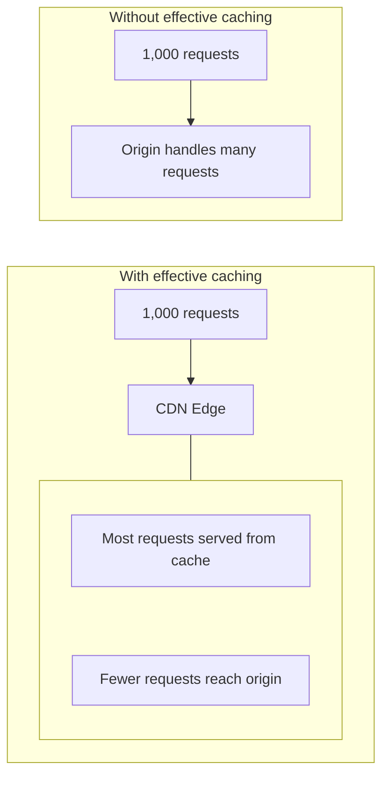

This can reduce origin load and help absorb bursts of demand.

However, a CDN is not automatically complete DDoS protection, and uncached or dynamic requests can still overwhelm an origin.

Use appropriate security controls, rate limits, capacity planning, and origin-access restrictions alongside CDN caching.

---

## 14. Security: Public and Private Content

A CDN is not a reason to make every file public.

For public assets, shared caching is often appropriate.

For private content, access control must remain part of the design.

Depending on the CDN and origin, private delivery can use mechanisms such as:

- Signed URLs
- Signed cookies
- Authenticated requests
- Origin access restrictions
- Short-lived authorization tokens

For example, a paid course video might be stored privately and delivered through a time-limited authorized URL.

The exact security model depends on the service and application.

Remember:

- A hard-to-guess URL is not a substitute for authorization.
- A cached response must not be shared across users unless it is safe to do so.
- Private origin storage should not become publicly accessible just because a CDN is used.

---

## 15. Failure Scenarios

A CDN can improve delivery, but it introduces another component to consider.

| Failure | Possible consequence |
|---|---|
| Edge cache miss | Request must fetch content from the origin |
| Origin unavailable | Uncached content may fail to load |
| Incorrect cache key | Wrong representation may be served |
| Stale cached content | Users see outdated data |
| Incorrect public-cache policy | Sensitive data may be exposed |
| CDN configuration error | Content may become unavailable or behave incorrectly |
| Origin overload | Misses can cause latency or failures |
| Certificate or DNS issue | Users may not reach the expected endpoint |

Some CDNs support serving stale content during certain origin failures, but this must be configured appropriately and may not be safe for all content.

Design fallback behavior based on the content's importance and freshness requirements.

---

## 16. Cost and Capacity

CDN pricing commonly involves some combination of:

- Data transferred to users
- Request volume
- Cache invalidations or other operations
- Additional security features
- Regional pricing differences
- Origin-to-CDN data transfer, depending on provider and architecture

A CDN may reduce origin compute and bandwidth costs, but it also adds service costs.

The result depends on traffic volume, response size, cache hit rate, user geography, and provider pricing.

Useful metrics include:

- Cache hit ratio
- Origin request rate
- Data transfer volume
- Request latency
- Origin errors
- CDN errors
- Cache age and freshness behavior

**Do not evaluate a CDN only by its cache hit ratio.** Correctness, user latency, origin load, security, and total cost matter too.

---

## 17. Hands-On Exercise: Accelerate an Online Learning Platform

Imagine your platform serves:

- Public course thumbnails
- CSS and JavaScript assets
- Public introductory videos
- Authenticated student dashboards
- Private course recordings

Design the CDN strategy.

### Step 1 — Decide what to cache

- [ ] Public thumbnails
- [ ] Versioned CSS and JavaScript
- [ ] Public introductory videos
- [ ] Authenticated dashboards
- [ ] Private course recordings

For each item, decide whether shared caching is safe and how long the content can remain fresh.

### Step 2 — Choose an origin

- [ ] Static files and videos may originate from object storage.
- [ ] Dynamic API responses may originate from the application.
- [ ] Private content requires an appropriate authorization model.

### Step 3 — Test failure scenarios

1. What happens when an edge location has a cache miss?
2. What happens if the origin is unavailable?
3. Could a personalized response be cached and shared incorrectly?
4. How will you publish an updated JavaScript file?
5. What happens when a private video URL expires?
6. How will you measure whether the CDN improves the system?

Your design should improve delivery without weakening access control or serving incorrect content.

---

## 18. Common Mistakes

- **Caching every response:** Some responses are personalized, sensitive, or too dynamic.
- **Ignoring cache keys:** Different requests may require different representations.
- **Setting long TTLs without a refresh strategy:** Content can remain stale.
- **Assuming a CDN replaces the origin:** Cache misses still need a source.
- **Treating a CDN as complete DDoS protection:** Additional controls may be required.
- **Making private content public for convenience:** Delivery optimization must not bypass authorization.
- **Ignoring origin protection:** Dynamic or uncached traffic can still overload the origin.
- **Assuming every request becomes faster:** Misses, routing, and origin latency still matter.
- **Ignoring cost:** Data transfer and request volume can affect total expense.

---

## 19. System Design View

A CDN changes where content can be served from and how often requests reach the origin.

Before adopting one, ask:

1. **Content:** Which responses are safe and useful to cache?
2. **Geography:** Are users far from the origin?
3. **Reuse:** Is the same content requested frequently?
4. **Freshness:** How quickly must updates become visible?
5. **Security:** Can the response safely be shared?
6. **Origin:** What happens on cache misses or origin failure?
7. **Performance:** Does measured latency improve?
8. **Cost:** Do delivery savings justify CDN costs?
9. **Operations:** How will cache behavior and configuration be monitored?

---

## 20. Quick Reference

| Concept | Meaning |
|---|---|
| CDN | Distributed network that accelerates delivery of eligible content |
| Origin | Source from which the CDN obtains content |
| Edge location | Distributed location that handles user requests and may cache content |
| Cache hit | Suitable content is available in the cache |
| Cache miss | A usable cached response is unavailable |
| Cache key | Information used to identify a cached representation |
| TTL | Maximum configured freshness lifetime for a cached entry |
| Invalidation | Request to remove or refresh cached content |
| Versioned asset | Asset published under a new URL when its content changes |
| Origin protection | Reducing repeated origin requests and applying controls to protect the source |
| Signed URL | URL granting time-limited or scoped access when supported and correctly configured |
| Cache hit ratio | Proportion of relevant requests served from cache |

---

## 21. Knowledge Check

**1. What is the primary purpose of a CDN?**

To deliver eligible content efficiently from distributed locations closer to users and reduce repeated work at the origin.

**2. What happens during a cache miss?**

The CDN may need to fetch content from the origin or follow another configured response path.

**3. Should every API response be cached publicly?**

No. Personalized or sensitive responses require careful cache policies and authorization.

**4. Why do cache keys matter?**

They determine which requests can share cached representations. Incorrect keys can cause wrong content to be served.

**5. Does a CDN replace object storage?**

No. Object storage can hold the original files while the CDN delivers cached copies.

**6. How can versioned assets help?**

A changed asset receives a new URL, allowing clients and caches to distinguish it from the previous version.

**7. Does a CDN guarantee that the origin cannot be overloaded?**

No. Uncached, dynamic, or abusive requests may still reach the origin.

---

## Remember

> **A CDN moves eligible content closer to users and reduces repeated work at the origin—but cache policy, freshness, authorization, and origin resilience remain essential.**

Cache content that is safe to share, make updates predictable, restrict private content appropriately, and measure the actual impact on latency, origin load, and cost.

**Next: 08.13 — IAM**
