# 08.13 — IAM (Identity and Access Management)

## Learning Objectives

By the end of this chapter, you should be able to:

- Explain what IAM does in a cloud environment.
- Distinguish identity, authentication, and authorization.
- Understand users, groups, roles, and policies.
- Apply the principle of least privilege.
- Understand how applications access cloud resources without embedded credentials.
- Recognize common IAM security mistakes.
- Design basic permissions for a cloud-based application.

---

## 1. What Is IAM?

**IAM stands for Identity and Access Management.**

It determines **who or what can perform which actions on which resources**.

Imagine an office building:

- An identity card identifies a person.
- A security check verifies that the card belongs to them.
- Access rules determine which rooms they can enter.
- Restricted areas remain inaccessible without permission.

Cloud IAM follows a similar idea.

A cloud environment contains resources such as:

- Virtual machines
- Databases
- Object storage buckets
- Message queues
- Functions
- Networking resources

IAM controls access to those resources.

> **IAM answers three questions: Who is making the request? What are they allowed to do? Which resources can they access?**

## 2. Identity, Authentication, and Authorization

These concepts are related but different.

| Concept | Question | Example |
|---|---|---|
| Identity | Who or what is requesting access? | An application running on a VM |
| Authentication | How is the identity verified? | A valid temporary credential |
| Authorization | What may the identity do? | Read objects from one bucket |
| Resource | What is being accessed? | A private storage bucket |
| Policy | What rules govern access? | Allow reading objects in that bucket |

Think of the flow:

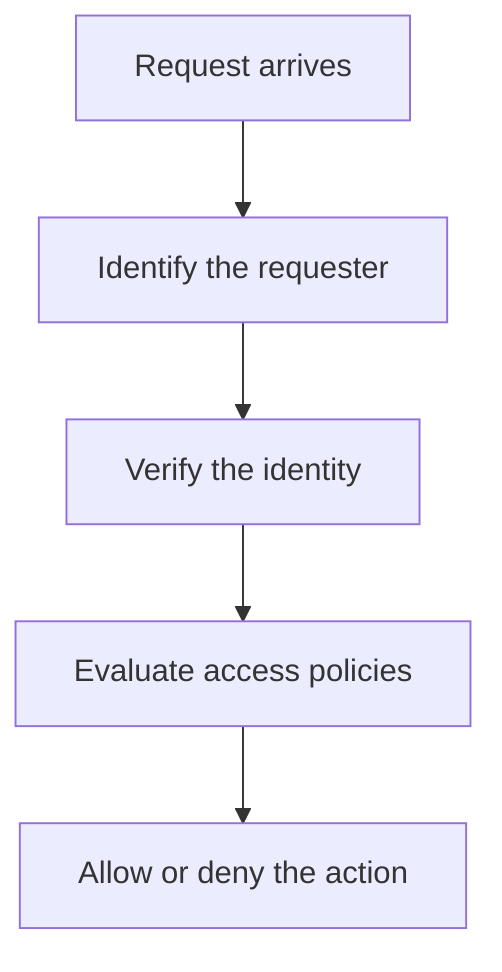

The exact evaluation process differs across cloud providers. Explicit denies, organizational restrictions, resource policies, and other controls may affect the final decision.

**Remember:** Authentication proves an identity; authorization determines its permissions.

---

## 3. Who or What Needs an Identity?

Cloud IAM is not only for human users. Applications and automated processes also need identities.

### Human identities

Examples:

- Developer
- System administrator
- Security auditor
- Billing operator
- Support engineer

### Workload identities

A workload is software running on infrastructure.

Examples:

- An application running on a virtual machine
- A serverless function
- A background worker
- A service that reads files from object storage

Both humans and workloads should receive only the permissions needed for their jobs.

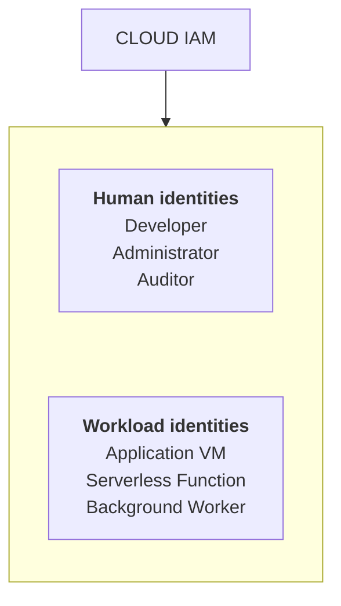

## 4. Users, Groups, Roles, and Policies

These terms describe different parts of access management.

| Term | Meaning | Example |
|---|---|---|
| **User** | An identity representing a person or account, depending on the provider | Developer account |
| **Group** | A collection of users managed together | Development team |
| **Role** | A set of permissions that an identity can receive or assume | Read-only support role |
| **Policy** | Rules describing allowed or denied access | Allow reading specific objects |

A simple structure might look like this:

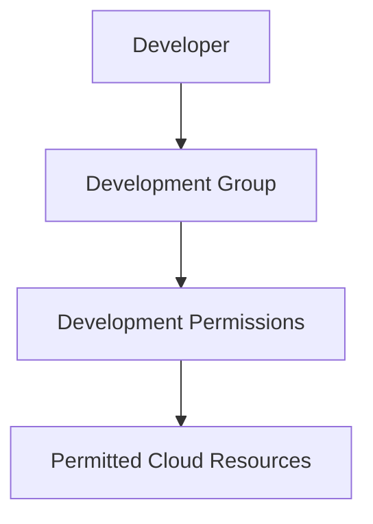

Roles are especially important for workloads and temporary access. Instead of embedding a permanent access key in application code, a workload can obtain credentials associated with an assigned role.

The precise meaning of users and roles varies by provider.

---

## 5. What Is an IAM Policy?

A policy defines the actions an identity can or cannot perform on resources, sometimes under specific conditions.

A useful mental model has four parts:

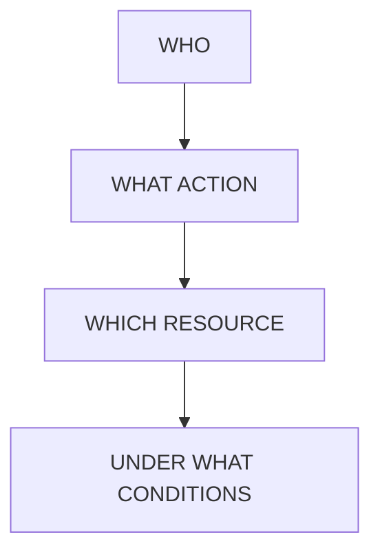

For example, imagine an application that uploads student assignments.

Its permissions might allow it to:

- Upload files to a designated bucket.
- Access only the required upload location.
- Operate only through its assigned workload identity.

It should not automatically be allowed to:

- Delete every file in the account.
- Read private certificates.
- Create administrator accounts.
- Change cloud-wide security settings.

A policy is not necessarily a simple list of permissions. Conditions and other policies may further restrict access.

---

## 6. The Principle of Least Privilege

**Least privilege** means granting only the permissions required to perform a task.

Suppose a background worker sends email notifications.

It needs permission to use the approved email service. It does not necessarily need access to the production database, payment credentials, or infrastructure administration.

Compare the two approaches:

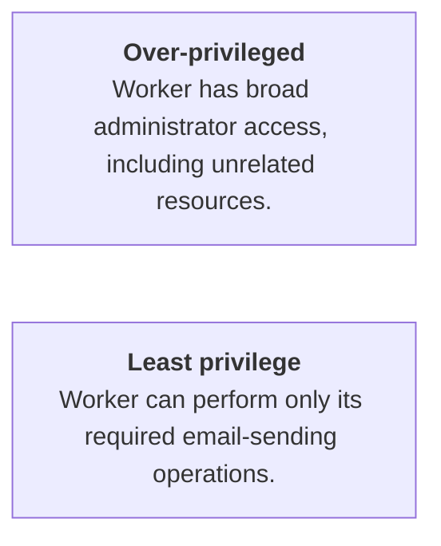

Least privilege reduces the damage caused by:

- Compromised credentials
- Application vulnerabilities
- Human mistakes
- Malicious insiders
- Incorrect automation

A practical rule:

> **Start with the smallest permission set that supports the task, then grant additional access only when justified.**

---

## 7. How Applications Access Cloud Resources

Consider a learning platform where students upload assignments to object storage.

A poor design embeds a long-lived cloud access key directly in the application code.

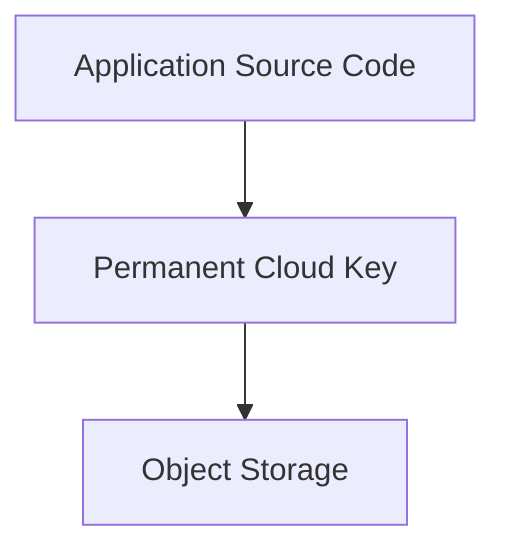

If the key leaks through a repository, log, or compromised server, someone else may be able to use its permissions.

A better design uses a **workload identity or role**.

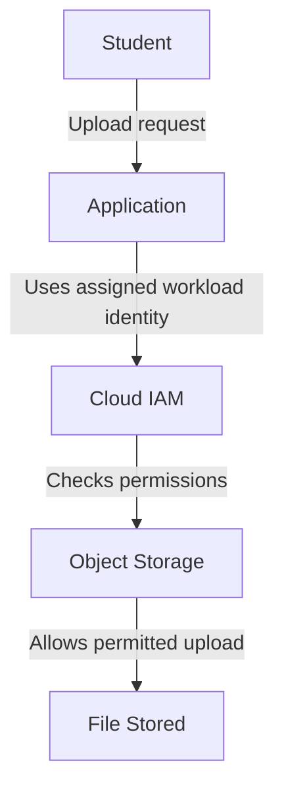

The application receives credentials through the cloud provider's supported identity mechanism rather than storing a permanent key in its source code.

The workload identity should be allowed to upload only to the intended location, with no unnecessary deletion or administration permissions.

**Important:** Exact mechanisms differ by provider. Examples include instance roles, managed identities, and service accounts.

---

## 8. Roles and Short-Lived Credentials

A workload often does not need a permanent credential.

Instead, its platform can provide **temporary credentials** associated with an assigned role.

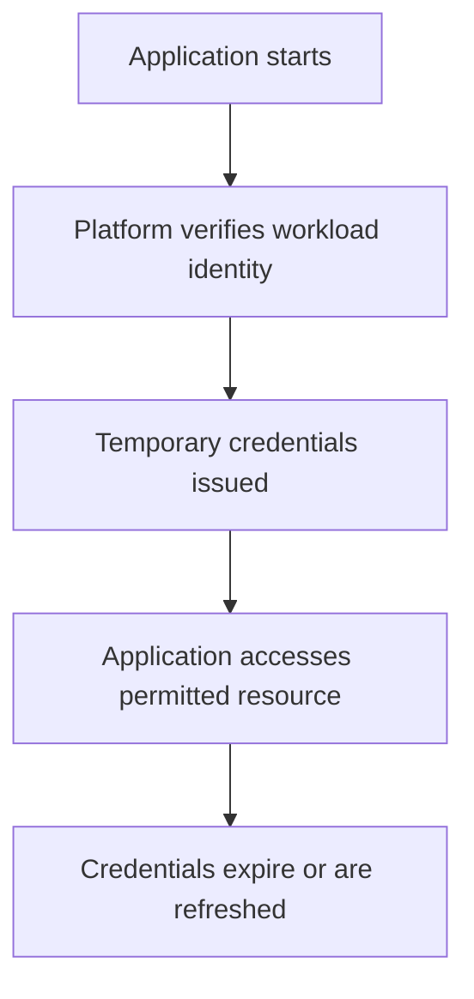

This reduces reliance on long-lived secrets and makes credential rotation easier to manage.

For human users, centralized identity providers and single sign-on (SSO) can provide a similar operational benefit: people can access approved cloud environments through managed identities rather than sharing account credentials.

Temporary credentials are not automatically safe. The role can still be dangerously over-privileged, and stolen credentials may be usable until they expire or are revoked.

---

## 9. IAM Is Not the Same as Application Authorization

This distinction is important because a system can have several layers of access control.

### Cloud IAM

Controls access to cloud resources and APIs.

Examples:

- Can the application read an object from storage?
- Can a deployment process create a virtual machine?
- Can an engineer modify a database configuration?

### Application authorization

Controls what a user may do inside your product.

Examples:

- Can this student view a particular course?
- Can this teacher edit their own course?
- Can this customer view this order?

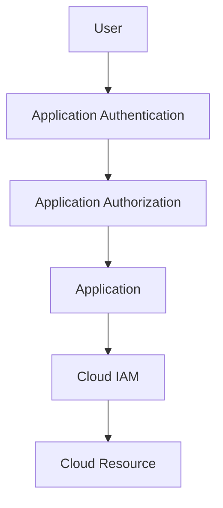

These layers protect different boundaries.

A user who can access your application should not automatically receive direct access to its cloud infrastructure. Similarly, an application workload's permission to read storage does not mean every application user should be able to read every stored file.

Both layers must enforce the intended access rules.

---

## 10. Common IAM Security Mistakes

| Mistake | Why it matters | Better approach |
|---|---|---|
| Granting `*` permissions broadly | Allows more actions or resources than necessary | Scope actions and resources |
| Sharing administrator accounts | Weakens accountability and makes revocation difficult | Use individual identities |
| Embedding permanent keys in code | Credentials can leak and remain usable | Use workload identities and temporary credentials |
| Skipping MFA for privileged human access | A stolen password may be enough to compromise the account | Require MFA where supported |
| Giving every service the same role | One compromised service can reach unrelated resources | Use separate workload identities |
| Never reviewing access | Old permissions accumulate | Review and remove unnecessary access |
| Ignoring audit logs | Suspicious or accidental actions are harder to investigate | Enable and review relevant activity logs |

IAM policies can also be affected by inherited permissions, organizational controls, resource-level policies, and conditions. Do not assume a single policy file tells the entire story.

---

## 11. IAM and Secrets Management

IAM and secrets management work together, but they solve different problems.

- **IAM** determines what an identity is allowed to access.
- **Secrets management** handles sensitive values such as API keys, passwords, and certificates.

For example, a workload role may allow an application to retrieve one secret from a secret manager. The application should not automatically be allowed to retrieve every secret in the account.

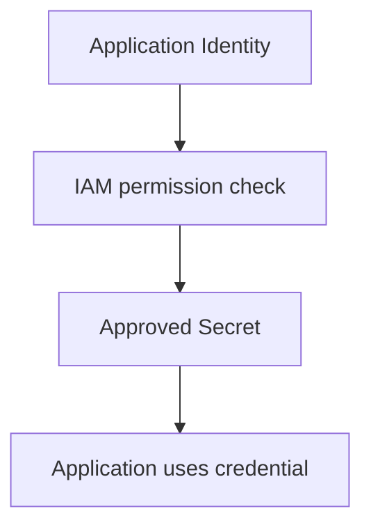

Avoid placing secrets in source code, public repositories, frontend JavaScript, or mobile application bundles. Anything shipped to a user's browser or device should be treated as potentially inspectable.

See **07.12 — Secrets Management** for the related credential-lifecycle concepts.

---

## 12. Hands-On Exercise: Design IAM for a Learning Platform

Imagine a cloud-hosted learning platform with:

- A development team
- An application server
- Private student certificates in object storage
- An operations team
- A billing team
- A security auditor

Assign permissions using least privilege.

**IAM permission planner**

Select an identity to inspect a possible permission boundary. This is a design exercise, not a live cloud configuration.

| Identity | Purpose | Allowed | Not allowed by default |
|---|---|---|---|
| Developer | Deploy and troubleshoot development resources | Manage approved development resources | Read production student certificates by default |
| Application workload | Run the learning platform | Read required course assets and upload assignment files | Manage cloud IAM or delete unrelated files |
| Support engineer | Help users troubleshoot | View approved operational diagnostics | Change billing settings or download all student files |
| Billing operator | Review cloud spending | View billing reports and cost data | Modify application data or IAM policies |
| Security auditor | Review access and security activity | Read relevant audit records and IAM configuration | Modify production resources by default |

**Ask before granting access**

- Which exact resource is required?
- Which actions are necessary?
- Can access be temporary?
- What would happen if these credentials leaked?
- How will usage be audited and access revoked?

### Exercise questions

1. Which role should be allowed to modify IAM policies?
2. Should the application workload be allowed to read every certificate?
3. What should happen when a developer leaves the team?
4. How would you investigate an unexpected object-storage access?

**Expected reasoning:** Privileged access should be tightly scoped and auditable. The application should access only the files required for its legitimate tasks. Departing users should lose access promptly, and audit records should help establish which identity performed an action.

---

## 13. A Practical IAM Review Checklist

Before deploying a cloud workload, ask:

- Does every person and workload use an identifiable account or identity?
- Are permissions limited to required actions and resources?
- Are privileged human accounts protected with MFA?
- Are workload credentials short-lived where supported?
- Are permanent keys avoided when a role or managed identity is available?
- Are development and production access separated?
- Can access be revoked quickly?
- Are relevant actions logged and reviewed?
- Are unused identities and permissions removed?
- Have resource policies and inherited permissions been considered?

---

## Key Principle

> **IAM is the access-control boundary for cloud resources. Every identity should have only the permissions it needs, for the resources it needs, for as long as it needs them.**

A cloud deployment can be highly available and fast yet still be insecure if identities and permissions are poorly designed.

Security must be part of the architecture, not a cleanup task at the end.

---

## Quick Reference

| Term | Meaning |
|---|---|
| IAM | Identity and Access Management |
| Identity | A person, workload, or other entity requesting access |
| Authentication | Verifying an identity |
| Authorization | Deciding which actions are permitted |
| Policy | Rules governing access |
| Role | A permission set an identity can receive or assume |
| Workload identity | An identity assigned to an application or automated process |
| Least privilege | Granting only the access required |
| Temporary credentials | Credentials valid for a limited period |
| MFA | Multi-factor authentication |
| SSO | Single sign-on through a centralized identity provider |
| Audit log | Record of relevant actions and access events |

---

## Knowledge Check

1. What three questions does IAM help answer?
2. How does authentication differ from authorization?
3. Why should an application use a workload identity instead of embedding a permanent cloud key?
4. Why is least privilege important even when an application is trusted?
5. How does cloud IAM differ from authorization inside your application?
6. What should you review when an identity has unexpectedly broad access?

### Answers

1. Who is requesting access, what action is being attempted, and which resource is involved?
2. Authentication verifies identity; authorization determines what that identity may do.
3. Workload identity mechanisms reduce exposure of long-lived credentials and allow access to be centrally controlled and revoked.
4. Applications can contain vulnerabilities or be compromised; limited permissions reduce the potential damage.
5. Cloud IAM governs cloud resources and APIs; application authorization governs access to application features and user data.
6. The identity's policies, assigned roles, inherited permissions, resource policies, conditions, and relevant audit records.

---

## Remember

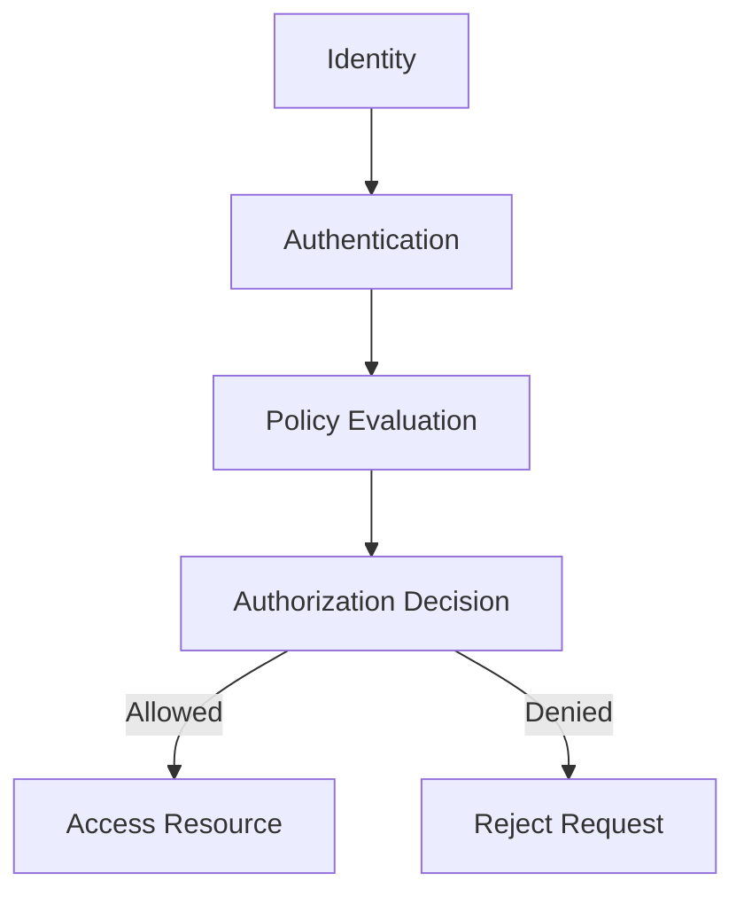

**Next: 08.14 — Infrastructure as Code**
