# 08.14 — Infrastructure as Code (IaC)

## Learning Objectives

By the end of this chapter, you should be able to:

- Explain what Infrastructure as Code (IaC) is and why it matters.
- Understand the difference between manual infrastructure setup and declarative configuration.
- Distinguish declarative and imperative infrastructure definitions.
- Understand the basic workflow of an IaC tool.
- Recognize the role of plans, state, version control, and repeatable deployments.
- Understand how IaC supports consistency, collaboration, and recovery.
- Recognize common IaC security and operational risks.

---

## 1. What Is Infrastructure as Code?

Imagine deploying a web application to the cloud. You need to create:

- A virtual machine or container service
- A network
- A database
- Object storage
- Security rules
- IAM permissions

You could create each resource manually through a cloud dashboard.

But if you need to repeat the setup for development, testing, and production, manual work becomes difficult to reproduce reliably.

**Infrastructure as Code (IaC)** means defining infrastructure through machine-readable configuration or code instead of relying entirely on manual setup.

Instead of clicking through a dashboard, you describe the infrastructure you want and use a tool to create or manage it.

> **IaC makes infrastructure changes repeatable, reviewable, and automatable.**

## 2. Manual Setup vs IaC

Imagine two developers creating the same application environment.

**Manual infrastructure**

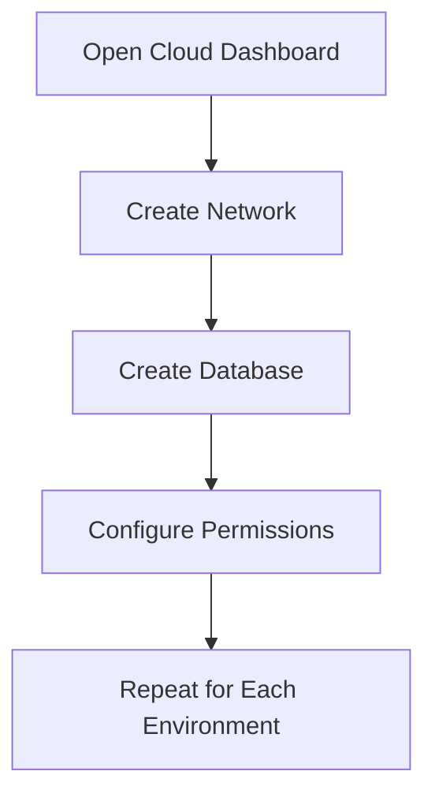

Risk: steps may be forgotten, configured differently, or become difficult to reproduce.

**Infrastructure as Code**

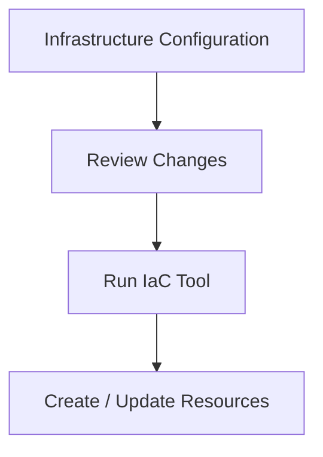

Benefit: infrastructure definitions can be reviewed, versioned, and reused.

Manual setup is not inherently wrong. It can be useful for experimentation or one-off tasks. IaC becomes especially valuable when infrastructure must be repeated, maintained, reviewed, or recreated reliably.

---

## 3. The Core Idea: Desired State

Suppose your application needs:

- One application service
- One private database
- One storage bucket
- A network that restricts database access

You can describe that desired configuration in code.

Conceptually:

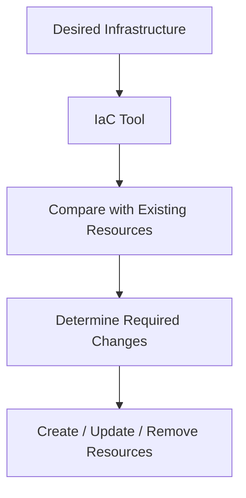

The tool attempts to make the real infrastructure match the defined configuration.

This is the **desired-state** model used by many declarative IaC tools.

The tool does not necessarily recreate everything on every run. It determines what changes are needed according to its configuration, state, and provider behavior.

---

## 4. Declarative vs Imperative IaC

There are two common ways to express infrastructure operations.

### Declarative

Describe **what the desired result should be**.

```yaml
application:
  instances: 2

database:
  publicly_accessible: false

storage:
  public_access: false
```

This is illustrative YAML, not a directly deployable configuration for a particular provider.

The tool determines how to create or update the resources.

### Imperative

Describe **the steps to perform**.

```text
1. Create a network
2. Create a private subnet
3. Create a database
4. Attach the database to the subnet
5. Apply access rules
```

Some infrastructure tools primarily use declarative configuration. Others allow imperative scripts or procedural logic. Many real-world systems combine both.

| Declarative | Imperative |
|---|---|
| Describes the desired result | Describes the operations |
| Tool determines the required changes | Script controls the sequence |
| Often supports reconciliation | Sequence and error handling matter |
| Example: define two instances | Example: run commands to create instances |

**Important:** Declarative does not mean risk-free. A valid configuration can still create an insecure or expensive environment.

---

## 5. Common IaC Tools

Different tools fit different ecosystems.

| Tool | General purpose |
|---|---|
| **Terraform** | Defines and manages infrastructure across many providers |
| **AWS CloudFormation** | Defines AWS infrastructure using templates |
| **Azure Bicep** | Defines Azure resources |
| **Google Cloud Deployment tools** | Automates Google Cloud infrastructure using supported configuration tools |
| **Ansible** | Automates configuration and operational tasks; can also manage infrastructure through modules |
| **Pulumi** | Defines infrastructure using general-purpose programming languages |

You do not need to learn all these tools at once.

For system design, first understand the common workflow and trade-offs. The syntax and state-management details depend on the chosen tool.

---

## 6. The Typical IaC Workflow

A common workflow looks like this:

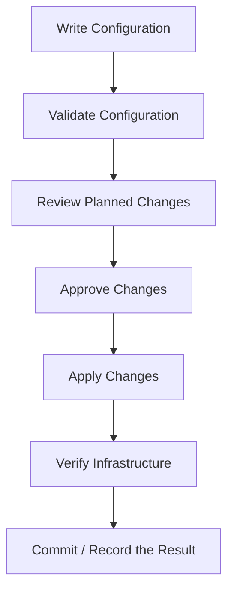

A typical Terraform workflow, for example, uses commands such as:

```bash
terraform init
terraform validate
terraform plan
terraform apply
```

At a high level:

- `init` prepares the working directory and providers.
- `validate` checks configuration structure and validity.
- `plan` previews proposed infrastructure changes.
- `apply` performs the approved changes.

Exact workflows vary by tool and project. A plan is valuable, but it is not a guarantee that every operation will succeed or that the environment will remain unchanged until application.

---

## 7. Why the Plan Matters

Imagine a small configuration change intended to update one application instance.

The planned result unexpectedly includes:

```text
Destroy production database
Recreate storage bucket
Replace application network
```

Applying that change without investigation could cause an outage or data loss.

A plan or change preview helps identify unexpected operations before they happen.

**Before applying infrastructure changes, ask:**

- Which resources will be created?
- Which will be modified?
- Which will be replaced or destroyed?
- Could replacement cause downtime?
- Could data be lost?
- Are permissions or network boundaries changing?

For production systems, infrastructure changes should generally go through review and approval appropriate to their risk.

---

## 8. Version Control for Infrastructure

IaC configuration is software and should usually be managed with version control.

For example:

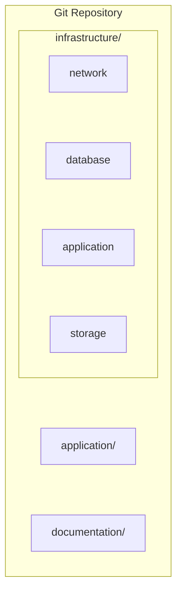

Version control provides:

- Change history
- Code review
- Collaboration
- Rollback references
- Traceability
- A place to document infrastructure decisions

A useful workflow is:

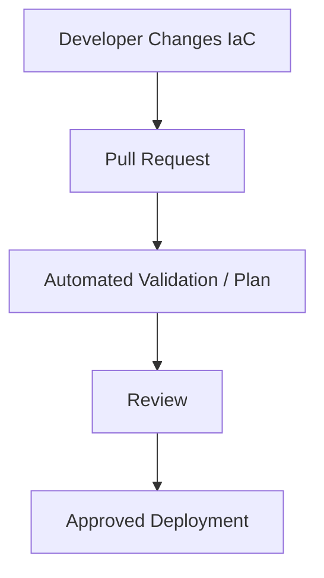

Rolling back an IaC commit does not always safely reverse the infrastructure changes. A later apply may still destroy or replace resources. Recovery must consider data, dependencies, and the tool's current state.

---

## 9. Infrastructure State

Some IaC tools maintain **state**: information linking the configuration to the real resources they manage.

Conceptually:

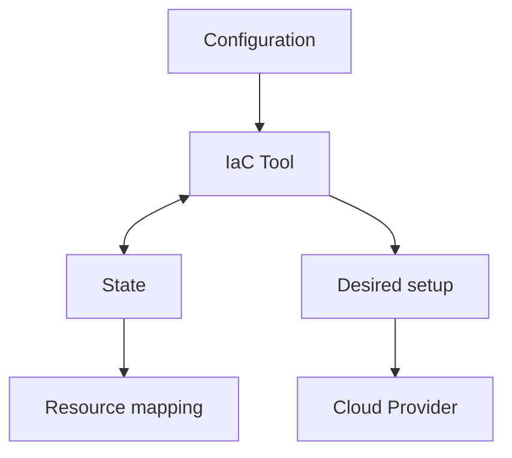

For example, state may help the tool understand that a declared database corresponds to a particular real database resource.

State is important because the tool uses it to determine what needs to change.

### Why state needs protection

Depending on the tool and resources, state can contain:

- Resource identifiers
- Infrastructure attributes
- Sensitive values

Treat state as potentially sensitive.

Good practices include:

- Use an appropriate remote state backend when needed.
- Restrict read and write access.
- Use locking where the backend and tool support it.
- Enable suitable encryption and backup protections.
- Avoid committing sensitive state files to a public repository.

**State is not the infrastructure itself, and it is not a backup of your application data.**

---

## 10. Idempotency and Repeatability

A useful property of automation is **idempotency**.

In simple terms, an operation is idempotent when repeating it produces the same intended result rather than repeatedly adding unintended effects.

For example, the desired infrastructure says:

```text
Application instances = 2
```

After the environment reaches that state, running the tool again should generally report no infrastructure changes if nothing relevant has changed.

```text
Run 1 → Create 2 instances
Run 2 → No changes required
Run 3 → No changes required
```

Actual behavior depends on the tool, provider, configuration, and external changes.

If someone manually modifies the cloud environment, the real state may drift away from the configuration.

This leads to the next concept.

---

## 11. Configuration Drift

**Configuration drift** occurs when actual infrastructure differs from the intended configuration.

Suppose your IaC defines:

```text
Database:
- Private access only
- Encryption enabled
```

Later, someone manually changes a setting in the cloud dashboard.

The actual environment might now be:

```text
Database:
- Public access enabled
- Encryption configuration changed
```

The environment no longer matches the intended definition.

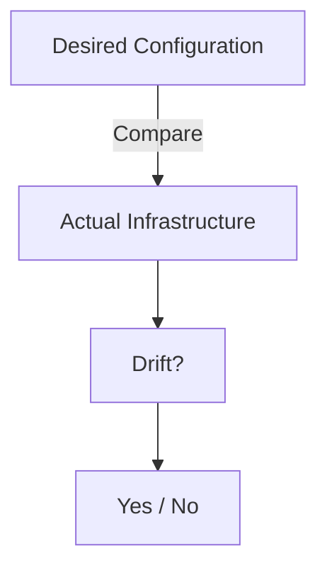

Drift can arise from:

- Manual dashboard changes
- Emergency fixes
- Changes made by another automation tool
- Provider-side defaults or behavior
- Incomplete deployment operations

IaC tools can often detect some drift, but detection is not always complete or immediate.

**A practical rule:** Make routine infrastructure changes through the approved IaC workflow, and document emergency changes so they can be reconciled afterward.

---

## 12. Environments: Development, Staging, Production

IaC helps create consistent environments.

For example:

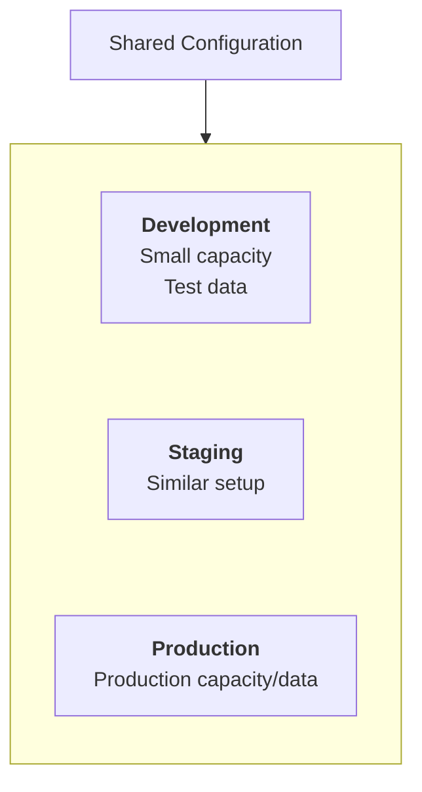

The environments may share reusable definitions while differing in:

- Resource sizes
- Network configuration
- Data sources
- Domain names
- Scaling limits
- Security policies

Consistency does not mean making production identical in every detail to development. Production may require stronger access controls, greater capacity, higher availability, and stricter change approval.

Avoid accidentally sharing production credentials or sensitive data with development environments.

---

## 13. IaC and Secrets

Infrastructure configuration often needs credentials or sensitive settings.

For example:

```text
Database password
API token
Private certificate
```

Do not place secrets directly into configuration files committed to version control.

Prefer approved secret-management mechanisms and secure identity-based access where supported.

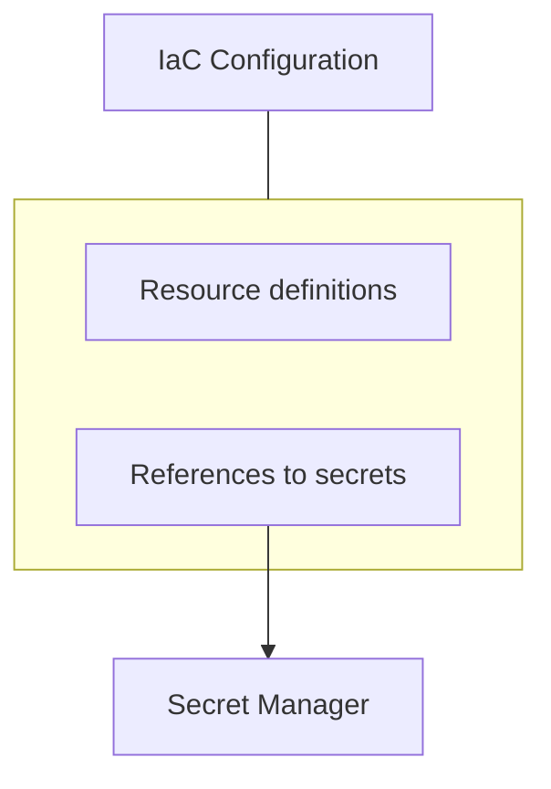

Be careful: a secret can still leak through state, deployment logs, command output, or CI/CD variables if they are handled incorrectly.

Use least privilege for both the IaC deployment identity and the application workload identity.

See **07.12 — Secrets Management** and **08.13 — IAM**.

---

## 14. IaC and CI/CD

IaC can be integrated into a deployment pipeline.

For example:

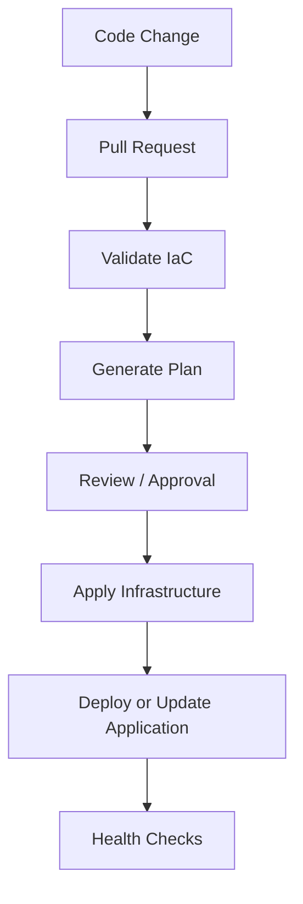

This allows infrastructure and application changes to follow a more consistent process.

However, **automatic deployment should not mean automatic approval of every infrastructure change**. Destructive, security-sensitive, or production-impacting changes may require explicit review.

Separate permissions for planning and applying changes where the tool and workflow support it.

---

## 15. Common Failure Modes and Trade-offs

| Risk | Consequence | Mitigation |
|---|---|---|
| Applying an unexpected plan | Outage or resource deletion | Review planned changes and protect critical resources |
| State exposed publicly | Infrastructure details or sensitive values leak | Restrict access and use secure state storage |
| Manual changes go untracked | Drift and inconsistent environments | Reconcile emergency changes through IaC |
| Broad deployment permissions | Compromised pipeline can alter the entire environment | Use a narrowly scoped deployment identity |
| Unreviewed automation | Dangerous changes reach production | Use risk-based approvals |
| One shared state for unrelated environments | Accidental cross-environment changes | Separate environments and state according to tool guidance |
| Treating IaC as a backup | Data cannot be recovered after deletion | Maintain and test independent data backups |
| Assuming every resource is replaceable | Stateful resources may lose data or cause downtime | Understand resource lifecycle and replacement behavior |

IaC improves control and repeatability, but it also makes changes easy to automate at scale—including mistakes. Review, permissions, testing, and recovery planning remain essential.

---

## 16. Hands-On Exercise: Define a Learning Platform

Imagine deploying Systemly as a cloud-hosted learning platform.

Its infrastructure needs:

- A public entry point
- An application runtime
- A private managed database
- Object storage for learning materials
- IAM permissions for the application
- Monitoring and logging

### Step 1 — Describe the desired state

Write a short resource list:

```text
Network:
- Public entry point
- Private application/database access

Application:
- Two instances for the exercise

Database:
- Private access
- Backup policy

Object storage:
- Private by default
- Application access scoped by IAM

Operations:
- Logs and health monitoring
```

These are design requirements, not provider-ready configuration.

### Step 2 — Identify dependencies

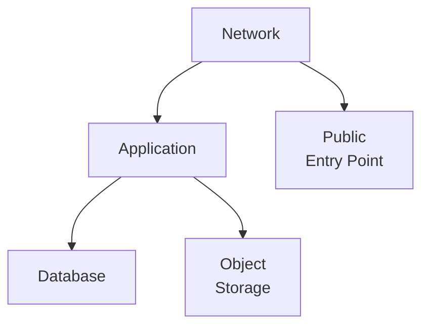

Ask which resources must exist before others can be configured.

### Step 3 — Review a hypothetical plan

Suppose your proposed change includes:

```text
Create: application instance
Modify: security group
Replace: production database
```

Should you apply it immediately?

No. Investigate why the database replacement is proposed, what data or availability could be affected, and whether a safer change is possible.

### Step 4 — Consider recovery

Ask:

- Can the infrastructure be recreated from version-controlled configuration?
- Is database data backed up independently?
- Is the state protected?
- Can the deployment identity modify only the resources it needs?
- How will you detect a failed deployment?

The goal is not to memorize IaC syntax. It is to understand how infrastructure becomes reproducible and how automated changes are controlled.

---

## 17. Practical IaC Checklist

Before applying a change, verify:

- [ ] The configuration passes validation.
- [ ] The planned changes are understood.
- [ ] Unexpected resource replacement or deletion is investigated.
- [ ] Secrets are not exposed in code, logs, or state.
- [ ] The deployment identity has limited permissions.
- [ ] State storage is protected and recoverable.
- [ ] The correct environment is selected.
- [ ] Critical data has an independent backup strategy.
- [ ] Appropriate approvals are complete.
- [ ] Post-deployment health and security checks are planned.

---

## Key Principle

> **Infrastructure as Code turns infrastructure definitions into versioned, reviewable, repeatable changes.**

It helps teams reproduce environments, collaborate safely, detect drift, and automate delivery.

But IaC does not automatically make infrastructure correct, secure, inexpensive, or highly available.

The quality of the result still depends on the design, permissions, review process, and recovery strategy.

---

## Quick Reference

| Concept | Meaning |
|---|---|
| Infrastructure as Code | Defining and managing infrastructure through code or machine-readable configuration |
| Desired state | The infrastructure configuration the system should reach |
| Declarative | Describe the intended result |
| Imperative | Describe the steps to perform |
| Plan | Preview of proposed infrastructure changes |
| State | Mapping and metadata used by some IaC tools to track managed resources |
| Idempotency | Repeating an operation does not create unintended repeated effects |
| Configuration drift | Difference between intended and actual infrastructure |
| Version control | Tracks infrastructure changes and supports review |
| CI/CD | Automates validation, approval, and deployment workflows |
| Deployment identity | Identity used by automation to change infrastructure |
| State backend | Storage location used for IaC state |

---

## Knowledge Check

1. What problem does IaC solve compared with relying entirely on manual setup?
2. How does declarative configuration differ from imperative instructions?
3. Why should a production plan be reviewed before applying it?
4. What is infrastructure state, and why must it be protected?
5. What is configuration drift?
6. Why is IaC not a substitute for database backups?
7. Why should the deployment identity have limited permissions?
8. Does version control automatically make rollback safe?

### Answers

1. IaC makes infrastructure definitions repeatable, reviewable, versionable, and automatable.
2. Declarative configuration describes the desired result; imperative instructions describe the steps to perform.
3. The plan may include unexpected changes, replacements, or deletions that can cause downtime or data loss.
4. State helps some tools map configuration to real resources and may contain sensitive information, so it needs controlled access and secure storage.
5. Drift occurs when actual infrastructure differs from the intended configuration.
6. IaC can recreate resources but generally does not contain the application data stored in them.
7. If the deployment identity is compromised or makes a mistake, limited permissions reduce the potential damage.
8. No. Reverting a configuration commit can still trigger destructive changes; rollback must account for resource lifecycle and data recovery.

---

## Remember

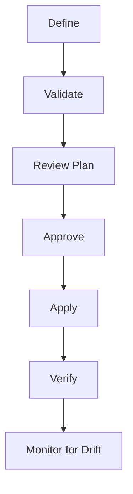

**Next: 08.15 — AWS Architecture Mapping**
