# 08.15 — AWS Architecture Mapping

## Learning Objectives

By the end of this chapter, you should be able to:

- Map common system-design components to AWS services.
- Understand how compute, networking, storage, databases, and messaging fit together in AWS.
- Distinguish similar services by their responsibilities.
- Trace a request through a basic AWS architecture.
- Recognize common architecture mistakes and single points of failure.
- Choose AWS services based on requirements rather than popularity.

---

## 1. What Is AWS Architecture Mapping?

In earlier chapters, you learned architecture concepts such as:

- Load balancers
- Application servers
- Object storage
- Managed databases
- Caching
- Message queues
- IAM
- Infrastructure as Code

These concepts describe **what a system needs to do**.

AWS provides services that implement many of these capabilities.

**AWS architecture mapping** means connecting a system-design requirement to an appropriate AWS service.

For example:

```text
System Requirement          AWS Service
------------------------------------------------
Receive HTTP traffic    →   Application Load Balancer
Run application code    →   EC2 / ECS / Lambda
Store uploaded files    →   Amazon S3
Store relational data   →   Amazon RDS
Cache frequently used data → Amazon ElastiCache
Queue background work   →   Amazon SQS
Control cloud access    →   AWS IAM
```

These are common mappings, not mandatory choices. The best service depends on the workload, operating model, performance requirements, cost, and constraints.

> **Learn the architectural responsibility first. Then select the AWS service that fulfills it.**

---

## 2. AWS as a Collection of Building Blocks

Imagine building a cloud-hosted learning platform.

You need a way to receive requests, execute application code, store data, deliver files, and process background work.

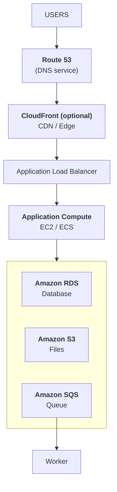

This diagram is illustrative. A real system may use different entry points, networking arrangements, compute services, and storage choices.

AWS does not replace system design. It gives you building blocks for implementing it.

---

## 3. Compute: Where Does Application Code Run?

Compute services provide resources for executing application logic.

| Requirement | Common AWS option | Basic idea |
|---|---|---|
| Full control over a virtual machine | **Amazon EC2** | Virtual server with an operating system |
| Run containers with managed orchestration | **Amazon ECS** | Deploy and manage containerized applications |
| Run Kubernetes workloads | **Amazon EKS** | Managed Kubernetes control plane |
| Execute event-driven functions | **AWS Lambda** | Run code in response to events or requests |
| Run containers without managing EC2 hosts directly | **AWS Fargate** | Serverless compute option for ECS or EKS tasks |

### How to choose

- Choose **EC2** when operating-system control or VM-based software is important.
- Consider **ECS** when you want to deploy containers without adopting Kubernetes.
- Consider **EKS** when Kubernetes capabilities and ecosystem compatibility justify its operational complexity.
- Consider **Lambda** for suitable event-driven or request-driven workloads.
- Consider **Fargate** when you want container execution without managing the underlying EC2 worker fleet.

These options overlap, but they are not interchangeable in every situation.

**Remember:** Lambda and Fargate are not the same thing. Lambda runs functions; Fargate provides compute for container tasks.

---

## 4. Networking: How Do Requests Reach the Application?

Cloud networking controls how resources communicate.

| Requirement | AWS service or feature | Responsibility |
|---|---|---|
| Isolated virtual network | **Amazon VPC** | Defines a logically isolated network |
| Public or private network placement | **VPC subnets and route tables** | Organizes network addresses and routing |
| Distribute incoming HTTP/HTTPS requests | **Application Load Balancer (ALB)** | Routes application-layer traffic |
| Distribute TCP or UDP traffic | **Network Load Balancer (NLB)** | Handles supported network-layer traffic |
| Resolve domain names | **Amazon Route 53** | DNS and domain routing capabilities |
| Allow private resources to initiate outbound IPv4 connections | **NAT Gateway** | Provides network address translation for outbound access |
| Control instance-level traffic | **Security groups** | Stateful virtual firewall rules |

A public subnet does not automatically make every resource publicly accessible. Routing, IP addressing, security rules, and the service's own configuration all matter.

### A simple request path

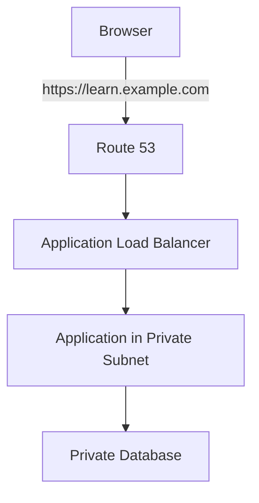

Route 53 resolves the name; it does not execute application code. The load balancer distributes requests; it does not replace the application server.

---

## 5. Storage: Where Does Data Live?

AWS provides different storage services for different access patterns.

| Requirement | AWS service | Best mental model |
|---|---|---|
| Disk attached to a virtual machine | **Amazon EBS** | Block storage |
| Shared file system for supported workloads | **Amazon EFS** | Managed network file system |
| Store images, videos, documents, and backups | **Amazon S3** | Object storage |
| Store structured, queryable application data | **Amazon RDS** or another suitable database | Database-managed records |

### Example: A learning platform

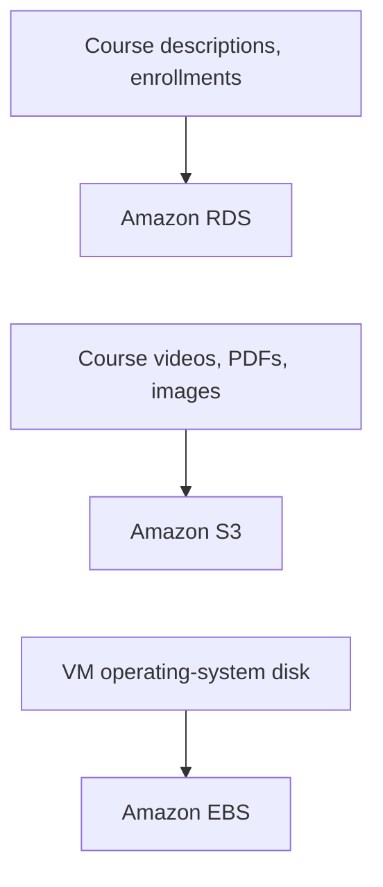

Do not choose storage solely because it can hold bytes.

Choose it based on access pattern, consistency needs, performance, durability, sharing requirements, and cost.

**Important:** S3 is object storage, not a drop-in replacement for a relational database or a normal attached disk.

---

## 6. Databases: Managed Data Services

A database service manages structured data and provides database-specific capabilities.

Common AWS options include:

- **Amazon RDS** — managed relational databases using supported database engines.
- **Amazon Aurora** — a relational database service compatible with MySQL or PostgreSQL interfaces.
- **Amazon DynamoDB** — a managed key-value and document database.
- **Amazon Redshift** — a data warehouse for analytical workloads.

### A basic decision guide

| Need | Starting point |
|---|---|
| Relational tables, joins, and transactions | RDS or Aurora |
| Key-based access with predictable access patterns at scale | DynamoDB |
| Analytical queries across large datasets | Redshift |

This is only a starting point. Relational and NoSQL choices should be driven by data modeling, query patterns, consistency requirements, capacity, and operational constraints.

Managed databases still require thoughtful design, access control, capacity planning, monitoring, and recovery testing.

---

## 7. Caching: Avoid Repeating Expensive Work

Caching stores reusable data so repeated requests can be served without repeating the full underlying operation.

**Amazon ElastiCache** provides managed caching capabilities, including supported Redis-compatible and Memcached options. Available engines and capabilities depend on the service offering and configuration.

A typical path:

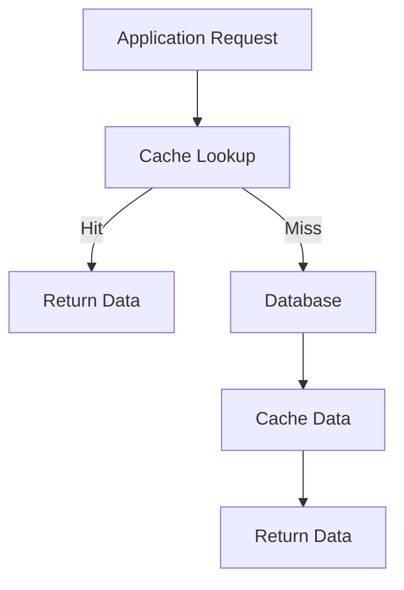

The application still needs a cache strategy:

- What should be cached?
- How long should it remain valid?
- How will stale data be handled?
- What happens if the cache is unavailable?
- Can a cache miss overload the database?

A managed cache does not automatically solve cache invalidation or consistency problems.

---

## 8. Asynchronous Work: Queues and Events

Some work should happen after the user-facing request finishes.

Examples:

- Sending email
- Processing uploaded files
- Generating reports
- Running scheduled jobs

**Amazon SQS** provides managed queues for decoupling producers and consumers.

**Amazon SNS** provides a publish/subscribe messaging service that can distribute messages to supported subscribers.

**Amazon EventBridge** helps route events between supported AWS services and applications.

A simplified flow:

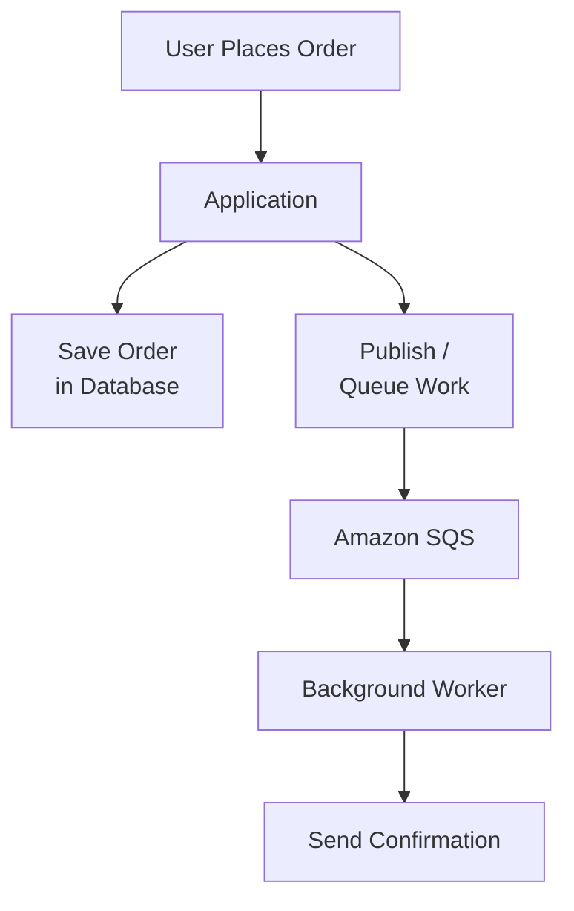

The exact architecture depends on how the application publishes messages and handles database-to-message consistency.

Remember:

- A queue is not the same as a pub/sub topic.
- Accepting a message does not prove that its business operation completed.
- Consumers should handle duplicate delivery safely when the delivery model permits duplicates.
- Retries, dead-letter handling, visibility timeouts, and backpressure require configuration and application design.

---

## 9. CDN and Edge Delivery

**Amazon CloudFront** is AWS's content delivery network (CDN).

It can deliver eligible content from edge locations closer to users and reduce repeated requests to the origin.

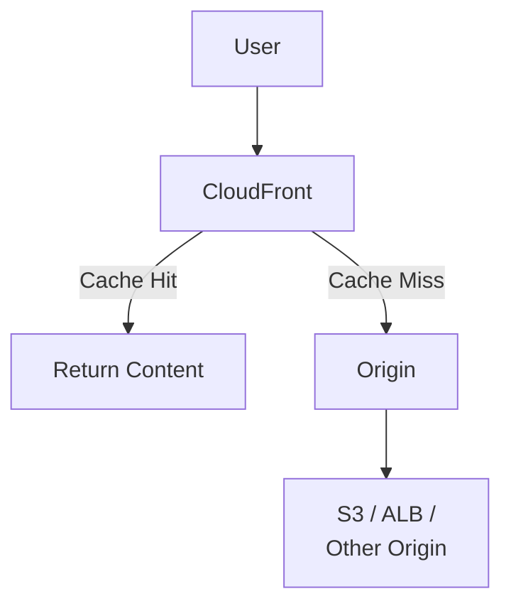

Common uses include:

- Images and static assets
- Public downloads
- Video delivery
- Selected API responses when caching is appropriate

Private and personalized content requires careful authorization and cache configuration. A CDN is not a substitute for application-level authorization or a complete DDoS protection strategy.

---

## 10. Identity and Access: AWS IAM

AWS IAM controls access to AWS services and resources.

It supports identities and permissions for human users, workloads, and other supported principals.

Examples:

- A deployment pipeline can update approved application resources.
- An application workload can read selected objects from S3.
- A developer can access a development environment.
- A security auditor can inspect permitted logs and configurations.

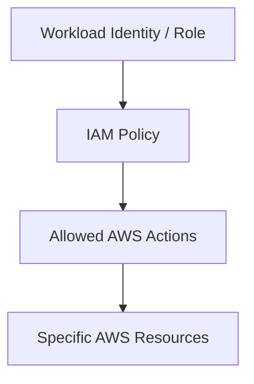

Prefer short-lived credentials and workload roles over embedding permanent access keys in application source code.

Use least privilege: an application that uploads assignment files should not automatically receive permission to delete every object in every bucket.

See **08.13 — IAM** for the underlying concepts.

---

## 11. Infrastructure as Code

**AWS CloudFormation** lets you define AWS resources using templates. Other IaC tools, including Terraform and Pulumi, can also manage AWS infrastructure.

For example, a team might version-control definitions for:

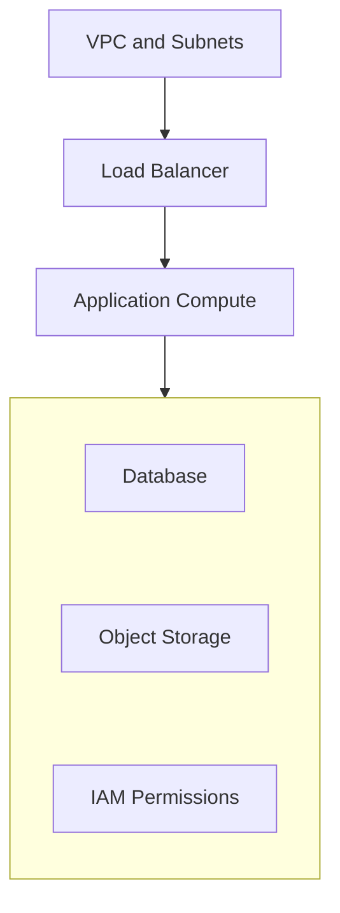

A typical workflow is:

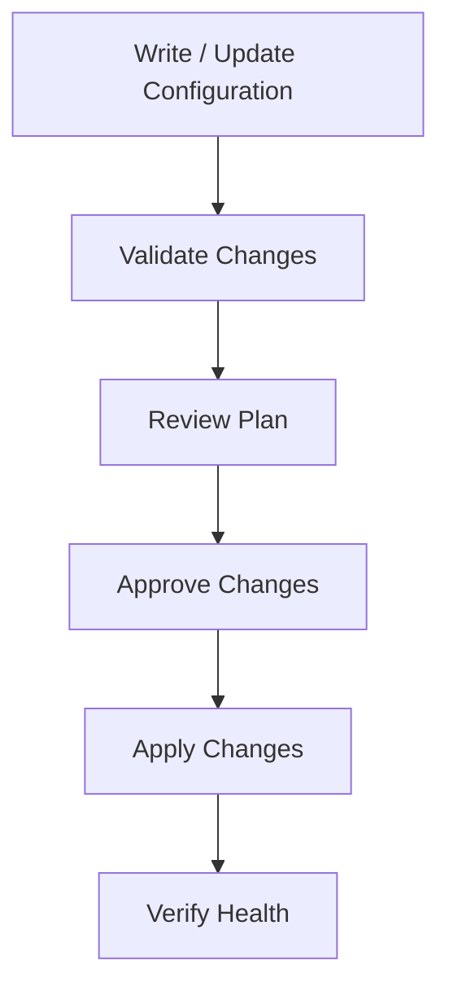

IaC makes infrastructure changes more repeatable and reviewable, but it does not automatically make changes safe. Resource replacement, state protection, permissions, and data recovery still matter.

---

## 12. Put the Services Together

Imagine designing a modest online learning platform.

### Requirements

- Students visit the website.
- The application serves course information.
- Videos and PDFs are stored separately from database records.
- Email notifications run asynchronously.
- Application and database access should be restricted.
- Infrastructure should be reproducible.

### One possible architecture

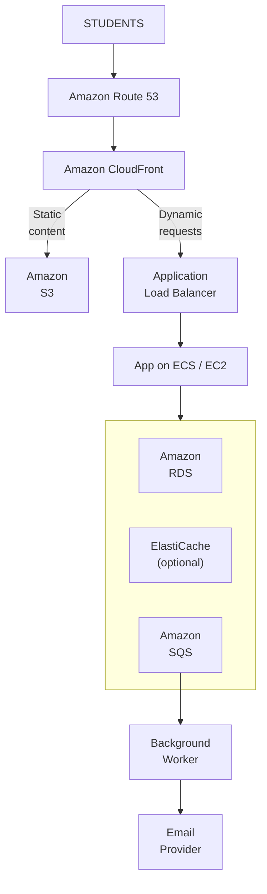

**Supporting controls:**

- VPC and security groups restrict network access.
- IAM grants narrowly scoped resource permissions.
- CloudWatch provides monitoring and logging capabilities.
- CloudFormation or another IaC tool defines repeatable infrastructure.
- Backup and recovery settings protect persistent data.

This is an illustrative starting point, not a recommendation to deploy every service. A small application may not need a cache, queue, or complex multi-tier setup on day one.

---

## 13. Failure Modes and Trade-offs

| Decision or mistake | Potential consequence | Design response |
|---|---|---|
| One application instance | Instance failure interrupts service | Add redundancy when availability requirements justify it |
| Public database access | Larger attack surface | Prefer private connectivity and restricted access |
| Too many services too early | Higher cost and operational complexity | Start with the smallest architecture that meets requirements |
| Unrestricted IAM permissions | Greater impact from compromised identities | Apply least privilege |
| No queue-consumer idempotency | Duplicate processing may cause repeated side effects | Make processing safe for duplicate deliveries |
| No tested database recovery | Data loss or prolonged recovery after failure | Define and test backup/restore procedures |
| Incorrect CDN cache rules | Stale or private data may be served incorrectly | Design cache keys and authorization carefully |
| Manual infrastructure changes | Configuration drift | Manage routine changes through IaC |

---

## 14. Hands-On Exercise: Map Requirements to AWS

Choose a service or design approach for each requirement.

**AWS service mapping quiz**

Select an answer for each requirement, then check your choices.

**1. Run a containerized PHP or Node.js application.**

- Amazon S3
- Amazon ECS
- Amazon RDS

<details>
<summary>Answer</summary>

**Amazon ECS.** ECS orchestrates containerized application workloads. Fargate can provide the compute layer without directly managing EC2 hosts.

</details>

**2. Store uploaded PDFs and course videos.**

- Amazon S3
- Amazon EBS
- Amazon Route 53

<details>
<summary>Answer</summary>

**Amazon S3.** S3 is object storage suited to files and media. Access permissions and lifecycle rules still need design.

</details>

**3. Store relational users, enrollments, and course records.**

- Amazon RDS
- Amazon CloudFront
- Amazon SQS

<details>
<summary>Answer</summary>

**Amazon RDS.** RDS provides managed relational database engines. Schema, queries, access, capacity, and recovery remain design responsibilities.

</details>

**4. Buffer background tasks for workers to process.**

- Amazon SQS
- Amazon EBS
- Amazon Route 53

<details>
<summary>Answer</summary>

**Amazon SQS.** SQS is a managed queue that decouples producers and consumers.

</details>

**5. Allow an application workload to read only approved S3 objects.**

- AWS IAM role and scoped policy
- Public bucket access
- Shared administrator access key

<details>
<summary>Answer</summary>

**AWS IAM role and scoped policy.** A workload identity with least-privilege permissions avoids broad shared credentials.

</details>

### Design reflection

Before deploying the platform, ask:

1. Which components must be private?
2. What happens if the application instance fails?
3. Can the database handle the expected workload?
4. Which tasks should be asynchronous?
5. Which resources need backups, and how will restoration be tested?
6. What is the simplest architecture that satisfies the availability, security, and cost requirements?

---

## Key Principle

> **AWS services are implementation choices for architectural responsibilities—not architecture by themselves.**

Start with the workload, requirements, constraints, and failure scenarios. Then map each need to a suitable service.

Do not add services merely because they are available. Every service introduces configuration, permissions, costs, dependencies, and operational considerations.

---

## Quick Reference

| Architectural responsibility | Common AWS mapping |
|---|---|
| DNS | Amazon Route 53 |
| CDN | Amazon CloudFront |
| Virtual server | Amazon EC2 |
| Container orchestration | Amazon ECS / Amazon EKS |
| Serverless functions | AWS Lambda |
| Container compute without managing EC2 hosts | AWS Fargate |
| Application-layer load balancing | Application Load Balancer |
| Virtual private network | Amazon VPC |
| Block storage | Amazon EBS |
| Shared file storage | Amazon EFS |
| Object storage | Amazon S3 |
| Managed relational database | Amazon RDS / Amazon Aurora |
| Key-value and document database | Amazon DynamoDB |
| Managed caching | Amazon ElastiCache |
| Queue | Amazon SQS |
| Pub/sub notifications | Amazon SNS |
| Event routing | Amazon EventBridge |
| Cloud identity and permissions | AWS IAM |
| Infrastructure templates | AWS CloudFormation |
| Monitoring and logs | Amazon CloudWatch |

---

## Knowledge Check

1. What is the difference between an architectural requirement and an AWS service?
2. When might ECS be a more suitable starting point than EKS?
3. Why is S3 not a direct replacement for a relational database?
4. What does an Application Load Balancer do?
5. Why should an application workload use a scoped IAM role?
6. What is the difference between SQS and SNS at a high level?
7. Does deploying a managed database remove the need for backups and recovery planning?
8. Why should you avoid adding every possible AWS service to a small application?

### Answers

1. A requirement describes what the system needs; a service is one possible implementation.
2. When the team needs container orchestration without the additional Kubernetes capabilities and operational complexity of EKS.
3. S3 stores objects and does not provide the same relational query, join, and transaction model as a relational database.
4. It distributes supported application-layer traffic to configured targets.
5. Scoped permissions reduce the potential damage from application vulnerabilities or leaked credentials.
6. SQS buffers messages in a queue for consumers; SNS distributes published messages to supported subscribers.
7. No. Backups, retention, recovery objectives, and restore testing still need to be designed.
8. Extra services increase cost, configuration, permissions, dependencies, and operational complexity.

---

## Remember

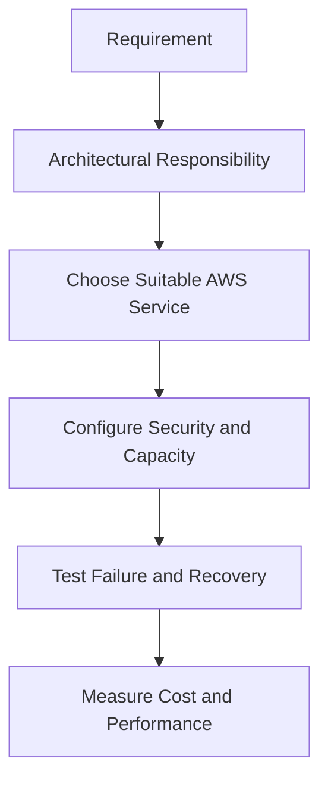

**Level 8 — Cloud Architecture: Complete.**

**Next: 09.01 — Reliability**
