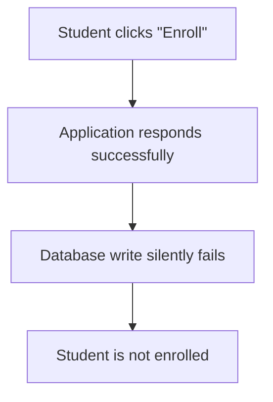
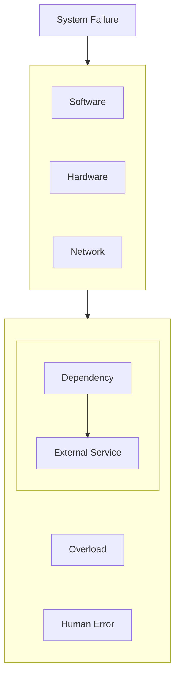
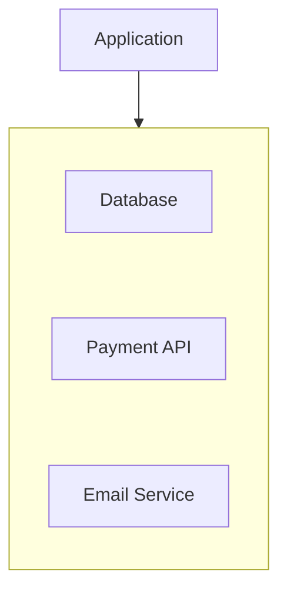
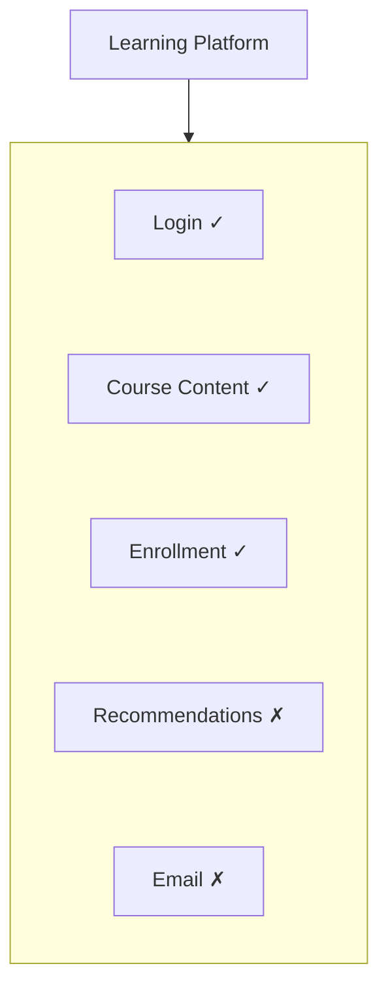
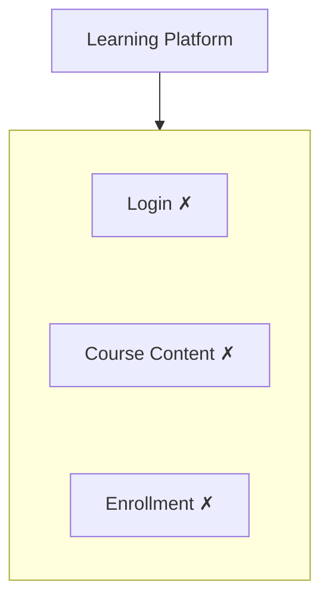
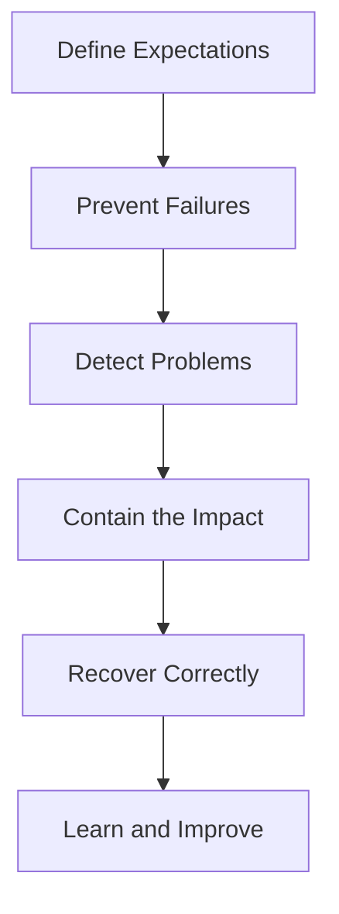
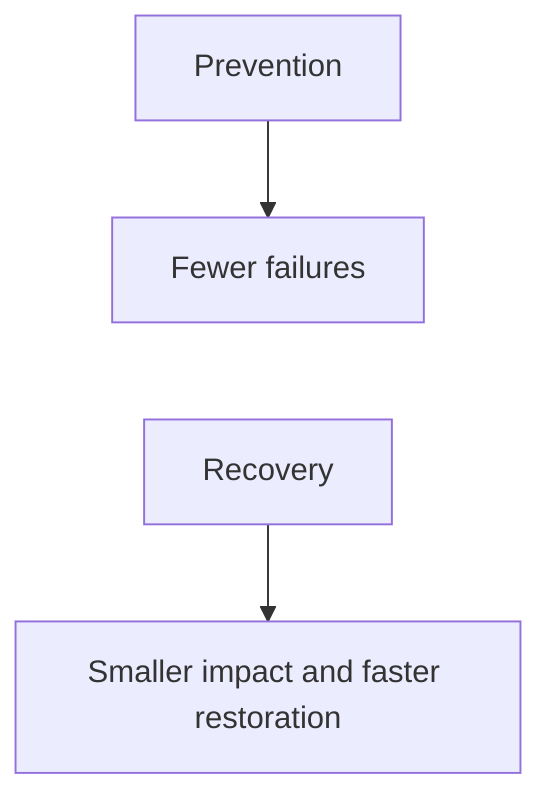
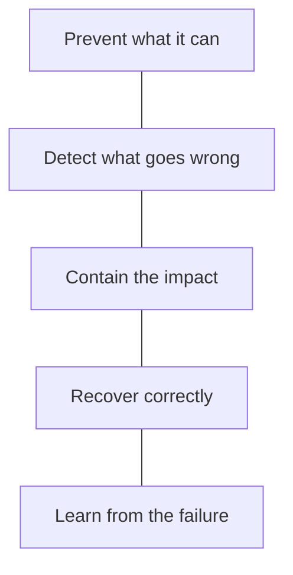
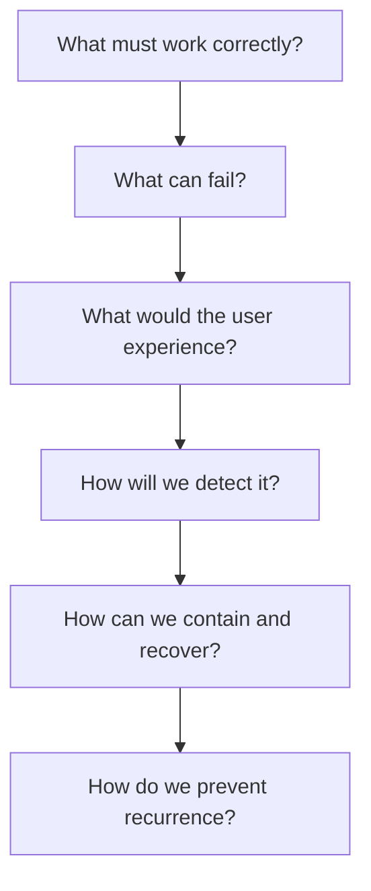

# 09.01 — Reliability

## Learning Objectives

By the end of this chapter, you should be able to:

- Explain reliability in simple terms.
- Distinguish reliability from availability, performance, and durability.
- Recognize common causes of system failures.
- Understand why reliability is a property of the whole system, not just individual components.
- Identify critical and non-critical failure scenarios.
- Understand the roles of prevention, detection, containment, and recovery.
- Evaluate reliability trade-offs when designing a system.

---

## 1. What Is Reliability?

Imagine an online learning platform.

Students use it to:

- Sign in.
- Enroll in courses.
- Watch lessons.
- Make payments.
- Receive course confirmations.

The platform might be running, but that doesn't automatically mean it is reliable.

Consider these situations:

- Students can sign in, but enrollment silently fails.
- A payment succeeds, but the order remains marked as unpaid.
- Videos play, but progress is not saved.
- The recommendation service fails, but lessons remain accessible.

The system is experiencing different kinds of failure. Some affect a minor feature; others affect essential business operations.

**Reliability** is the ability of a system to perform its required functions correctly and consistently over time under its expected operating conditions.

In simple words:

> **A reliable system keeps doing the job users depend on it to do.**

Reliability is not merely about keeping servers running. It is about delivering correct, dependable behavior.

---

## 2. Reliability Is More Than Uptime

A system can be reachable and still behave incorrectly.

For example:

From the student's perspective, the platform has failed—even though the website loaded and returned a response.

Compare two situations:

| Situation | Reliability concern |
|---|---|
| Website cannot be reached | Service failure |
| Website loads, but enrollment is incorrect | Correctness failure |
| Course video is temporarily unavailable | Partial service failure |
| Enrollment works, but confirmation email is delayed | Degraded non-critical feature |

The important question is not simply:

> "Is the server running?"

It is:

> **"Can the system perform its required functions correctly?"**

---

## 3. Reliability vs Availability

These concepts are related, but they are not interchangeable.

| Concept | Main question |
|---|---|
| **Reliability** | Does the system perform its required functions correctly over time? |
| **Availability** | Is the service usable when it is needed? |
| **Performance** | How quickly and efficiently does it respond? |
| **Durability** | Does stored data survive failures over time? |
| **Security** | Does the system protect resources and data against unauthorized actions? |

For example, a course platform might be available but unreliable if it frequently records enrollments incorrectly.

A database might be highly available but have poor durability if committed data can be lost under certain failures.

A system might be reliable for ordinary requests but too slow during peak traffic.

**Reliability is the broader concern of dependable, correct operation.** The other properties contribute to the overall experience in different ways.

We will examine availability separately in **09.02 — Availability**.

---

## 4. How Do Systems Become Unreliable?

Failures can originate from many places.

Common causes include:

- **Software defects:** Incorrect business logic or unexpected edge cases.
- **Hardware faults:** A machine, disk, or network device fails.
- **Network problems:** Components cannot communicate reliably.
- **Dependency failures:** A database or external API becomes unavailable.
- **Overload:** Demand exceeds available capacity.
- **Configuration mistakes:** An incorrect setting breaks a working system.
- **Deployment errors:** A new version introduces a defect.
- **Human errors:** A destructive operation or incorrect change affects production.

No single prevention technique eliminates all these risks.

A system needs several layers of protection.

---

## 5. Reliability Is a System Property

Imagine an application that depends on a database, a payment provider, and an email service.

Each component may work correctly in isolation, but the complete workflow can still fail.

For example:

1. The application creates an order.
2. The payment provider processes the payment.
3. The application times out before receiving confirmation.
4. The order remains in an uncertain state.

The issue is not necessarily that any one component is permanently broken. The problem arises from how the components interact and handle failure.

Reliability therefore depends on:

- Component behavior.
- Dependency relationships.
- Data consistency.
- Failure handling.
- Workload and capacity.
- Deployment and configuration.
- Detection and recovery procedures.

**A reliable component does not automatically make a reliable system.**

The system must handle failures between components, too.

---

## 6. Total Failure vs Partial Failure

A failure does not always bring down the entire application.

Consider a learning platform:

The recommendation and email services are failing, but students can still access courses and enroll.

This is a **partial failure**.

Compare it with:

Here, essential functions are unavailable.

The distinction matters because the response should match the impact.

- A failed recommendation service might be safely ignored temporarily.
- A failed enrollment operation needs a clear error or recovery path.
- An uncertain payment outcome requires reconciliation rather than blindly repeating the charge.

A well-designed system avoids turning every small failure into a complete outage.

---

## 7. The Four Parts of Reliability Engineering

Reliability is not achieved by hoping failures never happen. It is built through a repeatable process.

### 1. Define expectations

Identify the functions that must work and the consequences if they do not.

For example, course enrollment must be recorded correctly, while personalized recommendations may be optional.

### 2. Prevent failures

Reduce the likelihood of defects and operational mistakes through testing, validation, safe deployments, appropriate permissions, and careful configuration.

### 3. Detect problems

Use health checks, logs, metrics, alerts, and user-facing error signals to identify failures.

### 4. Contain and recover

Use appropriate techniques such as redundancy, failover, timeouts, retries, backups, and graceful degradation.

### 5. Learn and improve

Investigate incidents, identify underlying causes, and improve the system so similar failures are less likely or less damaging.

These practices work together. No individual technique guarantees reliability.

---

## 8. Failure Modes and Their Impact

A **failure mode** is a way a component or workflow can fail.

Before choosing a solution, identify the failure and understand its consequences.

| Component | Possible failure | Potential response |
|---|---|---|
| Application instance | Process crashes | Route requests to healthy instances and restart safely |
| Database | Becomes unavailable | Detect the failure and use an appropriate recovery strategy |
| Cache | Becomes unavailable | Fall back to the database if capacity permits |
| Message queue | Processing is delayed | Monitor backlog and apply backpressure |
| Email provider | Requests time out | Retry safely or queue delivery for later |
| New deployment | Introduces a defect | Roll back or roll forward using a controlled process |

These are examples, not universal fixes.

For instance, falling back from a cache to a database may be reasonable for a small workload. Under heavy traffic, it could overwhelm the database. The recovery strategy must account for the next component's capacity.

---

## 9. Preventing Failure vs Recovering from Failure

Two complementary approaches are important.

**Failure prevention** reduces the chance that something goes wrong.

Examples:

- Automated tests.
- Input validation.
- Code review.
- Configuration validation.
- Staged deployments.

**Failure recovery** helps the system return to correct operation when something does go wrong.

Examples:

- Restarting a failed process.
- Switching to a healthy instance.
- Restoring data from a backup.
- Replaying a safely designed asynchronous operation.
- Rolling back a defective deployment.

Neither approach is sufficient alone.

A system can still experience failures despite extensive testing. Conversely, recovery mechanisms cannot compensate for every defect, especially when data has been corrupted or an operation has produced an irreversible side effect.

---

## 10. Reliability Has Trade-offs

Making a system more reliable often requires additional engineering and operational work.

| Decision | Potential benefit | Cost or trade-off |
|---|---|---|
| Multiple application instances | Reduces dependence on one instance | More infrastructure and coordination |
| Database redundancy | Can improve recovery options | More complexity and possible consistency concerns |
| Automated testing | Catches defects before release | Development and maintenance effort |
| Backups | Supports data recovery | Storage cost and restore procedures |
| Graceful degradation | Preserves essential features | More application logic and testing |
| Safer deployments | Reduces release risk | Additional deployment machinery |

Reliability work should be guided by the consequences of failure.

A small personal blog and a payment processing platform do not need identical reliability strategies.

The goal is not to eliminate every imaginable failure at any cost.

It is to achieve a level of dependability appropriate to the system's requirements, risks, and budget.

---

## 11. Hands-On Exercise: Evaluate a Learning Platform

Imagine you are designing a platform where students purchase courses and watch lessons.

Classify each feature according to its importance, then decide what the system should do if that feature fails.

| Feature | If it fails, what should happen? |
|---|---|
| Login | Prevent unauthorized access and provide a clear error |
| Course enrollment | Avoid reporting success unless enrollment is correctly recorded |
| Payment | Preserve a way to determine the actual payment outcome |
| Video playback | Show a useful error and allow the student to retry |
| Recommendations | Continue showing the course page without recommendations |
| Confirmation email | Queue or retry delivery without duplicating the enrollment |

Now answer these questions:

1. Which failures must block the main workflow?
2. Which features can fail independently?
3. Which failures could cause incorrect or lost data?
4. Which operations require careful retry handling?
5. How would you detect a failure before many students report it?

The goal is to distinguish **failure impact** from **failure occurrence**. A rarely occurring payment error may deserve more attention than a frequent but harmless recommendation delay.

---

## 12. A Practical Reliability Checklist

When designing a system, ask:

- What functions must work correctly?
- What happens if each dependency fails?
- Can one component failure take down unrelated features?
- Can the system detect failures quickly?
- Can it recover without corrupting data?
- Are retries safe for the operation?
- Can overloaded dependencies be protected?
- Can a bad deployment be reversed?
- Are backups restorable and recovery procedures tested?
- Have the most important failure scenarios been exercised?

You do not need elaborate infrastructure for every application. Start with the failures that would cause the greatest harm and address those first.

---

## 13. Common Mistakes

**Mistake 1 — Equating reliability with uptime.**  
A system can remain reachable while producing incorrect results.

**Mistake 2 — Assuming components never fail.**  
Networks, databases, deployments, and external services can all fail.

**Mistake 3 — Treating every failure as a total outage.**  
Some failures can be isolated so that essential functions continue.

**Mistake 4 — Adding redundancy without testing recovery.**  
A second instance is useful only if the system can detect the failure and route work appropriately.

**Mistake 5 — Retrying every failed operation blindly.**  
A timeout does not prove that a side-effecting operation failed.

**Mistake 6 — Optimizing reliability without considering cost.**  
The right target depends on business impact and operational requirements.

---

## 14. Key Principle

> **Reliability means delivering correct, dependable behavior—not merely keeping components running.**

A reliable system is designed to:

The deeper lesson is that failures are normal possibilities in a real system. Good design makes them less likely, less damaging, easier to detect, and easier to recover from.

---

## 15. Quick Reference

| Concept | Meaning |
|---|---|
| Reliability | Ability to perform required functions correctly over time |
| Availability | Whether a service is usable when needed |
| Failure mode | A way a component or workflow can fail |
| Partial failure | Some functions fail while others continue |
| Failure prevention | Practices that reduce the likelihood of failure |
| Failure detection | Recognizing that something is wrong |
| Failure containment | Limiting the impact of a failure |
| Recovery | Returning to correct operation after a failure |
| Redundancy | Providing additional components or resources to reduce dependence on one |
| Graceful degradation | Preserving essential functions while optional features are unavailable |

---

## 16. Knowledge Check

**1. Can a website be available but unreliable?**  
Yes. It may respond to requests while performing essential operations incorrectly.

**2. Is reliability the same as availability?**  
No. Availability concerns whether a service is usable; reliability concerns dependable, correct operation over time.

**3. What is a partial failure?**  
A situation where some components or features fail while other parts of the system continue working.

**4. Why is reliability a system property?**  
Because correct behavior depends on components, dependencies, communication, data handling, and failure responses working together.

**5. Does redundancy guarantee reliability?**  
No. Redundancy can reduce dependence on a single component, but detection, routing, consistency, and recovery must also work.

**6. Why should reliability strategies depend on business impact?**  
Because failures have different consequences, and reliability improvements carry costs and complexity.

---

## Remember

When evaluating reliability, don't ask only:

> "How do we keep the server online?"

Ask:

**Next: 09.02 — Availability**
