# 09.02 — Availability

## Learning Objectives

By the end of this chapter, you should be able to:

- Explain availability in simple terms.
- Calculate availability and downtime.
- Understand common availability targets such as 99%, 99.9%, and 99.99%.
- Distinguish availability from reliability.
- Understand how redundancy and failover improve availability.
- Recognize single points of failure and maintenance-related downtime.
- Understand why component availability does not automatically equal system availability.
- Choose availability targets based on business requirements.

---

## 1. What Is Availability?

Imagine a student wants to watch a lesson on an online learning platform.

They open the website, but the application server is unavailable.

The student cannot use the service at that moment.

Now imagine the platform is accessible and responds to requests whenever students need it.

That is the central idea behind **availability**.

> **Availability measures the extent to which a service is usable when it is needed.**

A service may become unavailable because of:

- Application crashes.
- Database outages.
- Network failures.
- Failed deployments.
- Overloaded infrastructure.
- Configuration mistakes.
- Maintenance.
- Dependency failures.

Availability is about the service users experience—not merely whether a physical server is powered on.

---

## 2. How Is Availability Measured?

Availability is commonly expressed as a percentage.

The basic formula is:

$$
\text{Availability} =
\frac{\text{Uptime}}{\text{Total Observed Time}}
\times 100
$$

Here:

- **Uptime** is the time the service meets the defined availability criteria.
- **Total observed time** is the period being measured.

For a simple example, suppose a service is usable for 990 hours out of 1,000 hours.

$$
\frac{990}{1000}\times100 = 99\%
$$

Its availability over that observation period is **99%**.

The important detail is that a production service needs a clear definition of what counts as usable. A server responding to a health check does not necessarily mean users can complete important operations.

---

## 3. Availability Is Not the Same as Reliability

These concepts are closely related, but they answer different questions.

| Reliability | Availability |
|---|---|
| Does the system perform its required functions dependably over time? | Is the service usable when needed? |
| Includes concerns about correct behavior and failures. | Focuses on whether the service is available. |
| A workflow may fail even when the service responds. | A service may be available for most of the measurement period but experience outages. |

For example, a course platform could be available 99.9% of the time while occasionally recording incorrect enrollments.

Its availability figure alone would not reveal those correctness failures.

Similarly, a system might recover quickly after frequent failures, producing high availability while still having poor reliability for certain operations.

**Availability is an important part of dependable service, but it does not describe every aspect of reliability.**

---

## 4. What Do Availability Nines Mean?

You will often hear phrases such as:

- Two nines.
- Three nines.
- Four nines.
- Five nines.

They refer to the number of nines in an availability percentage.

| Availability target | Name |
|---|---|
| 99% | Two nines |
| 99.9% | Three nines |
| 99.99% | Four nines |
| 99.999% | Five nines |

As the number of nines increases, the permitted downtime becomes smaller.

For example, 99% availability permits substantially more downtime than 99.9%.

That sounds like a small numerical difference, but it can represent many additional hours of service availability over a year.

---

## 5. Availability Targets and Downtime

A useful way to understand an availability target is to convert it into an approximate downtime budget.

Assuming a 365-day year and that the service is measured continuously:

| Availability | Approximate downtime per year |
|---|---:|
| 99% | 3 days, 15 hours, 36 minutes |
| 99.9% | 8 hours, 46 minutes |
| 99.99% | 52 minutes, 34 seconds |
| 99.999% | 5 minutes, 15 seconds |

These are mathematical estimates, not guarantees about when outages will happen.

A service with a 99.9% annual availability target could experience one long outage or several shorter outages and still have the same aggregate downtime.

The table also assumes that all time is included in the measurement. A service agreement may define its measurement window, exclusions, and qualifying failures differently.

**The more ambitious the availability target, the less room there is for outages.**

---

## 6. Availability Calculator

Use this table to explore how an availability target translates into an approximate downtime budget.

**Approximate downtime budget**

| Availability target | One day | One week | 30-day month | 365-day year |
|---|---:|---:|---:|---:|
| 99% — Two nines | 14.4 minutes | 1 hr 41 min | 7 hr 12 min | 87 hr 36 min |
| 99.9% — Three nines | 1.44 minutes | 10.08 minutes | 43.2 minutes | 8 hr 46 min |
| 99.99% — Four nines | 0.144 minutes | 1.008 minutes | 4.32 minutes | 52.56 minutes |
| 99.999% — Five nines | 0.014 minutes | 0.101 minutes | 0.432 minutes | 5.256 minutes |

Assumes continuous measurement and no excluded downtime.

This is a planning aid. It does not predict the number, timing, or duration of future outages.

---

## 7. Why Does Availability Matter?

Availability directly affects whether users can complete their tasks.

Consider an e-commerce platform:

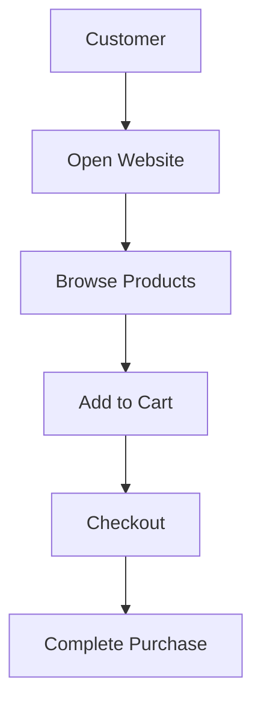

If checkout becomes unavailable during peak shopping hours, the business may lose sales even if the website remains accessible.

Different operations also have different levels of importance.

For a learning platform:

- Login may be essential.
- Course playback may be essential to active students.
- Recommendations may be optional.
- Confirmation emails may be delayed without immediately blocking the purchase.

Availability planning should therefore consider **which service or user journey must remain usable**.

---

## 8. What Is a Single Point of Failure?

A **single point of failure (SPOF)** is a component whose failure can prevent an important part—or all—of the system from functioning.

Consider:

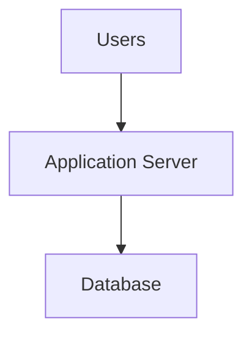

If there is only one application server and it crashes, users may lose access.

If the application server is duplicated but both instances depend on one unavailable database, the database remains a single point of failure.

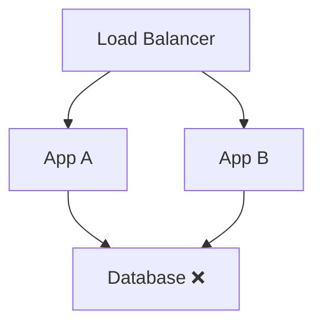

The two application instances do not protect the system from database failure.

This illustrates an important principle:

> **Adding redundancy to one component does not eliminate a single point of failure elsewhere in the request path.**

---

## 9. How Redundancy Improves Availability

Redundancy means having additional components or resources available when one component fails.

Instead of one application instance:

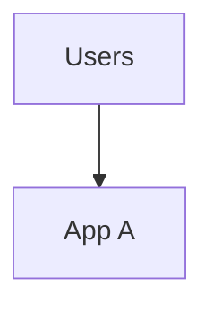

we can deploy two:

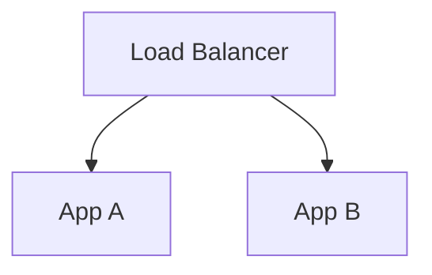

If App A fails and the load balancer detects the failure, requests may be routed to App B.

This can reduce the impact of an individual instance failure.

However, redundancy helps only when the remaining components can actually handle the workload and the failure can be detected and handled correctly.

Two instances that share a failing dependency or the same failure domain may still fail together.

---

## 10. How Failover Helps

**Failover** is the process of switching work to an alternative component when the current component becomes unavailable or unsuitable.

For example:

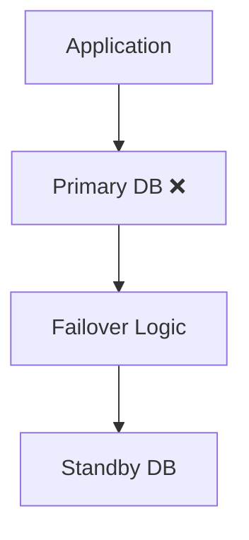

A database failover can improve availability when the primary database fails and a suitable standby is ready.

But failover is not instantaneous or guaranteed to be seamless.

It can involve:

- Failure detection.
- Promotion or activation of a standby.
- Connection changes.
- Client reconnection.
- Data consistency checks.
- Recovery of in-flight operations.

During that process, some requests may fail or time out.

Failover is therefore a recovery mechanism, not proof that downtime has been eliminated.

---

## 11. Component Availability vs System Availability

A system often depends on multiple components.

Consider a simplified request path:

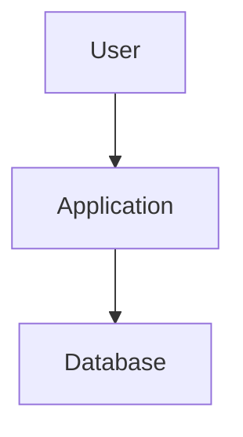

If both the application and database must be working for the request to succeed, the request depends on both.

Under a simplified model where failures are independent and both components must be available:

$$
A_{\text{system}} = A_{\text{app}} \times A_{\text{database}}
$$

Suppose:

- Application availability = 99.9%.
- Database availability = 99.9%.

Then:

$$
0.999 \times 0.999 = 0.998001
$$

That is approximately **99.8001%** availability for the combined path under these assumptions.

This is lower than either component's individual availability because the path needs both to work.

The formula is a simplified model. Real systems may have correlated failures, redundancy, retries, caching, graceful degradation, and different measurement boundaries.

The key lesson is:

> **A system's availability depends on its architecture and the relationships between its components—not just the availability of its best component.**

---

## 12. Required vs Optional Dependencies

Not every component must be available for every feature to work.

Consider:

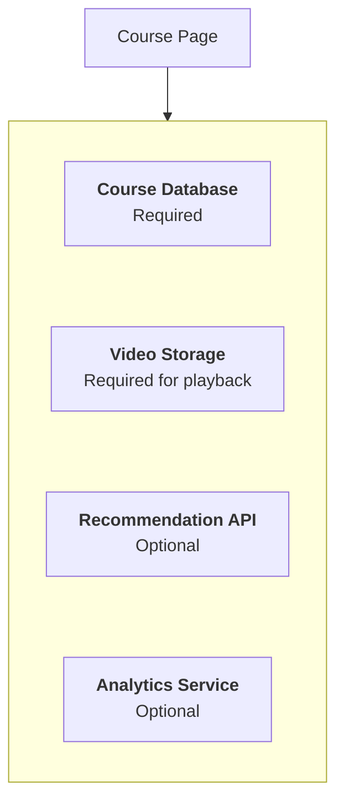

If the recommendation API fails, the course page can still be displayed without recommendations.

If the course database fails, the page may not have the information needed to render correctly.

This leads to a useful design technique:

- Identify required dependencies.
- Identify optional dependencies.
- Define the behavior when each dependency fails.
- Prevent optional failures from blocking essential functionality.

This is closely related to **09.07 — Graceful Degradation**.

---

## 13. Maintenance and Deployment Affect Availability

Availability can be reduced by operational mistakes as well as infrastructure failures.

For example:

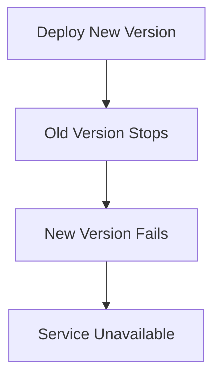

Safer deployment approaches may include:

- Rolling deployments.
- Blue-green deployments.
- Canary releases.
- Health checks before routing traffic.
- Automated rollback.

These approaches can reduce deployment risk, but each has implementation costs and limitations.

For example, a rolling deployment can still cause problems if the new version introduces an incompatible database change.

Availability planning must account for the entire release process, not just runtime infrastructure.

---

## 14. Availability Is Not the Same as Capacity

A service can be available but too overloaded to provide a useful response.

For example:

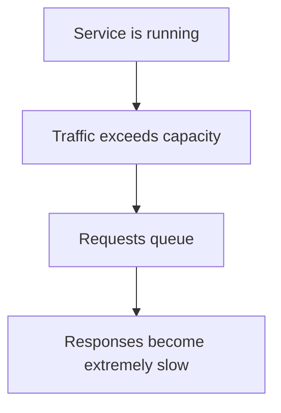

Technically, some requests may still succeed. But users may experience timeouts or be unable to complete their tasks.

This is why availability should be defined in terms of meaningful service behavior, not merely process status.

Capacity planning, load management, timeouts, and rate limiting all contribute to availability under load.

---

## 15. A Practical Availability Design Exercise

Imagine your learning platform has these components:

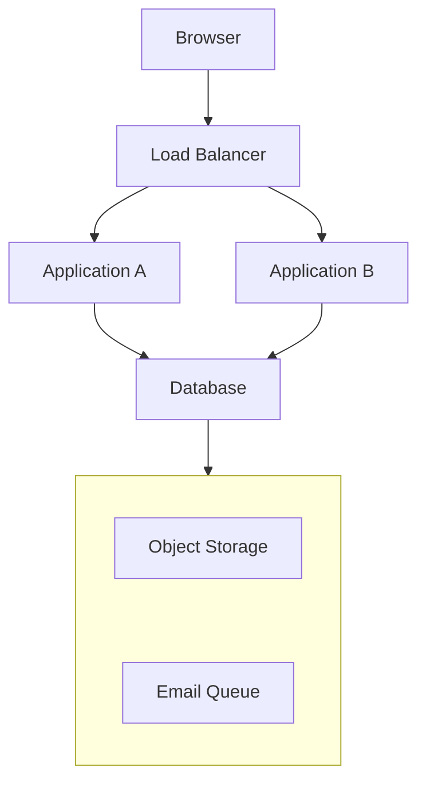

Consider the following failures:

| Failure | Possible impact | Design question |
|---|---|---|
| Application A crashes | Some requests fail temporarily | Can traffic reach Application B? |
| Database is unavailable | Enrollment and course metadata may fail | What recovery or failover capability exists? |
| Object storage is unavailable | Videos may not play | Can metadata pages remain accessible? |
| Email queue is delayed | Confirmations arrive late | Can enrollment succeed independently of email delivery? |
| Load balancer fails | Both application instances may become unreachable | Is the entry point itself redundant? |

For each failure, answer:

1. Does it make the whole service unavailable or only one feature?
2. Is there an alternative component?
3. Can the system detect the failure?
4. How long might recovery take?
5. Could the remaining infrastructure handle the additional workload?

The goal is to find where availability depends on a single component or an untested recovery path.

---

## 16. Choosing an Availability Target

Not every system needs five nines.

Consider these examples:

| System | Possible priority |
|---|---|
| Personal portfolio | Low operational cost may matter more than strict uptime |
| Internal reporting dashboard | Short interruptions may be acceptable |
| Online learning platform | Availability during lessons, enrollment, and exams matters |
| Payment processing service | Outages can directly affect transactions and revenue |
| Emergency response service | Availability requirements may be extremely demanding |

These are illustrative, not prescribed targets.

A realistic target should reflect:

- Business impact of downtime.
- User expectations.
- Financial and operational costs.
- Recovery capabilities.
- Dependency limitations.
- Contractual or regulatory requirements.

Higher targets often require more redundancy, testing, automation, and operational discipline.

**Do not choose an availability target just because it sounds impressive. Choose one the architecture and operating model can support.**

---

## 17. Common Mistakes

**Mistake 1 — Measuring server uptime instead of user-visible availability.**  
A running process does not guarantee successful user operations.

**Mistake 2 — Assuming two instances guarantee high availability.**  
They may share a database, network, configuration error, or failure domain.

**Mistake 3 — Ignoring dependencies.**  
A highly available application can still fail when a required dependency is unavailable.

**Mistake 4 — Assuming failover is instantaneous.**  
Detection, promotion, reconnection, and recovery can take time.

**Mistake 5 — Treating every feature as equally critical.**  
Optional features may be allowed to fail without making the main service unavailable.

**Mistake 6 — Choosing an unrealistic target.**  
An ambitious availability target without the budget, architecture, and operational capability to support it is not a useful plan.

---

## 18. Key Principle

> **Availability is about whether users can use the service when they need it—not simply whether the infrastructure is running.**

To improve availability:

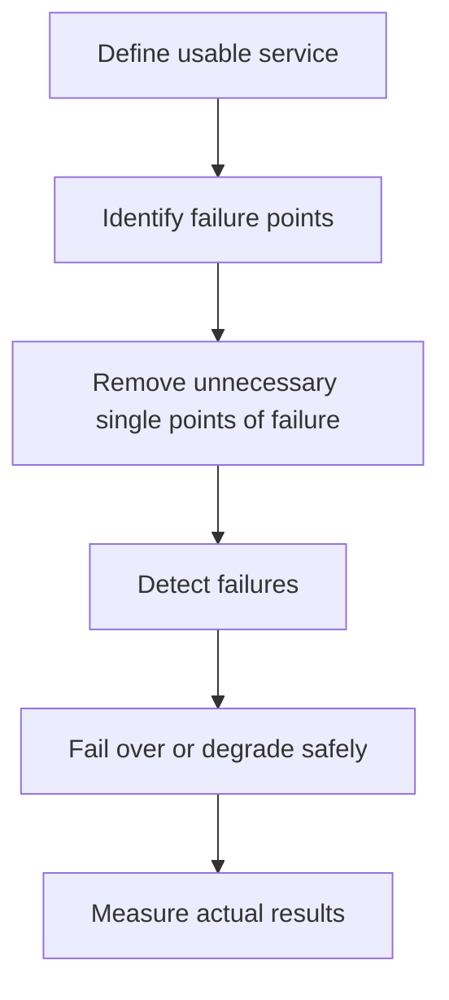

Every improvement should be evaluated against the actual user journey and the cost of achieving the target.

---

## 19. Quick Reference

| Concept | Meaning |
|---|---|
| Availability | Extent to which a service is usable when needed |
| Uptime | Time the service meets the defined usable-state criteria |
| Downtime | Time the service does not meet those criteria |
| Availability target | Desired availability percentage over a defined period |
| Nines | Informal description of availability targets such as 99.9% |
| Single point of failure | Component whose failure can prevent an important service from working |
| Redundancy | Additional components or resources that can reduce dependence on one component |
| Failover | Switching work to an alternative component |
| Partial availability | Some features work while others are unavailable |
| Graceful degradation | Preserving essential functionality when optional capabilities fail |

---

## 20. Knowledge Check

**1. What does availability measure?**  
Whether a service is usable when it is needed, according to its defined criteria.

**2. Approximately how much downtime does 99.9% availability permit in a 365-day year?**  
About 8 hours and 46 minutes.

**3. Does 99.9% availability guarantee correct business operations?**  
No. Availability alone does not measure every aspect of correctness or reliability.

**4. Why can two highly available components produce a lower-availability request path?**  
If both are required and their failures are independent, the probability that both are available is the product of their individual availability probabilities.

**5. Why doesn't adding two application instances eliminate every single point of failure?**  
They may still depend on one database, load balancer, network, or other shared component.

**6. Why can a system be available but unusably slow?**  
The system may be running but overloaded, causing long queues, timeouts, and failed user operations.

**7. Should every system target five nines?**  
No. The target should match business needs, risks, cost, and the architecture's actual capabilities.

---

## Remember

Availability is not just a property of a server. It is an outcome of the entire service architecture, including dependencies, redundancy, failure detection, recovery, and capacity.

**Next: 09.03 — Redundancy**
