# 09.03 — Redundancy

## Learning Objectives

By the end of this chapter, you should be able to:

- Explain redundancy and why systems use it.
- Identify single points of failure.
- Distinguish active-active and active-passive redundancy.
- Understand component, data, and infrastructure redundancy.
- Recognize shared failure domains that undermine redundancy.
- Understand the cost and complexity of redundant systems.
- Design a basic redundancy strategy for a web application.

---

## 1. What Is Redundancy?

Imagine an online learning platform running on one application server.

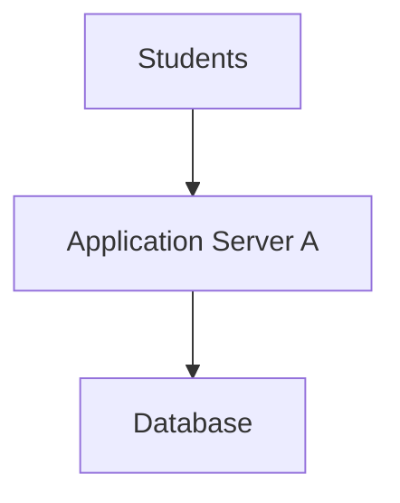

If Application Server A crashes, students may lose access to the platform.

Now add another application server:

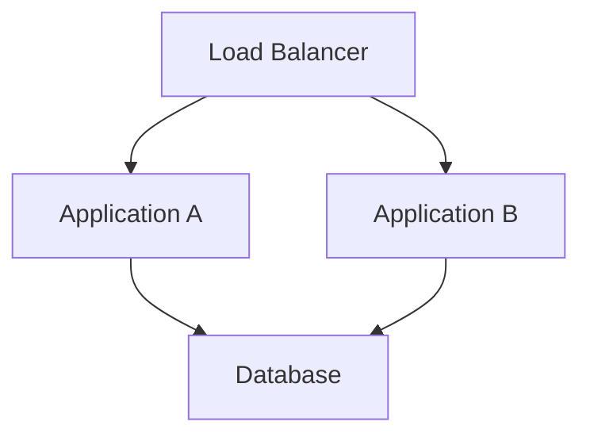

If Application A fails, the load balancer may direct requests to Application B.

The second application instance provides an alternative when the first one fails.

This is **redundancy**.

> **Redundancy means providing additional components, resources, or paths so that the system does not depend entirely on a single one.**

Redundancy is a way to reduce the impact of failures. It does not eliminate every possible failure.

---

## 2. The Problem: A Single Point of Failure

A **single point of failure (SPOF)** is a component whose failure can prevent an important part—or all—of a system from working.

Consider:

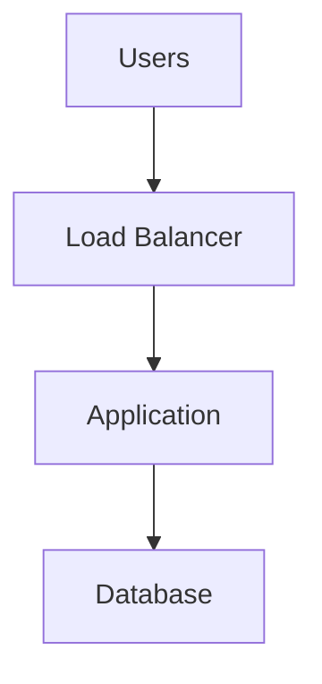

Suppose the application has two instances, but both depend on one database.

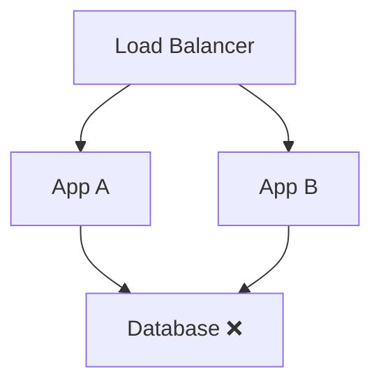

Both application instances may be healthy, but neither can complete database-dependent operations.

The database remains a single point of failure.

**Lesson:** Adding redundancy to one component does not remove single points of failure elsewhere in the request path.

---

## 3. Where Can Redundancy Exist?

Redundancy can be introduced at several layers.

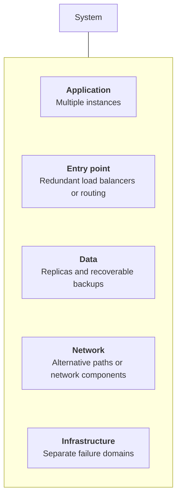

Examples include:

- Multiple application instances.
- Primary and standby database instances.
- Replicated data.
- Multiple network paths.
- Redundant load-balancing infrastructure.
- Compute resources distributed across availability zones.

The correct choice depends on what can fail and what the system needs to preserve.

---

## 4. Active-Active Redundancy

In an **active-active** arrangement, multiple instances serve traffic at the same time.

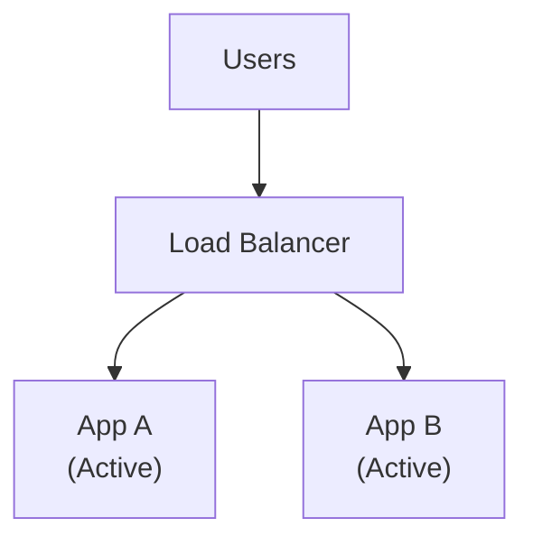

Both instances handle requests during normal operation.

If App A fails, App B may continue serving requests.

### Benefits

- Both instances contribute useful capacity.
- Traffic can be distributed across instances.
- There may be less unused compute capacity during normal operation.

### Trade-offs

- Traffic must be routed correctly.
- Shared state and dependencies must be handled carefully.
- Remaining instances must have enough capacity when one fails.
- A shared bug or bad configuration can affect both instances.

Active-active is useful when multiple instances should handle normal traffic and help absorb the loss of one instance.

---

## 5. Active-Passive Redundancy

In an **active-passive** arrangement, one component serves the workload while another is available to take over.

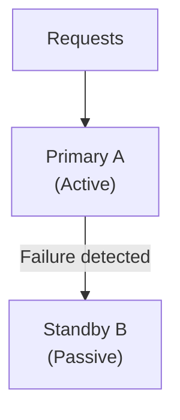

The standby may receive no normal production traffic, or it may perform limited supporting work.

When the active component fails, the system attempts to activate or promote the standby.

### Benefits

- The standby can provide an alternative during failure.
- Some designs simplify which component is responsible for writes.
- It can be suitable for primary-standby database architectures.

### Trade-offs

- Standby capacity may sit partly unused.
- Failover can take time.
- The standby may be out of date or incorrectly configured.
- The system must prevent conflicting active primaries where relevant.

Active-passive is useful when a designated primary is preferred but a backup component is needed.

---

## 6. Active-Active vs Active-Passive

| Consideration | Active-active | Active-passive |
|---|---|---|
| Normal workload | Multiple instances serve traffic | Primary normally serves traffic |
| Capacity usage | Multiple instances contribute | Standby may be partly idle |
| Failure response | Remaining instances continue if capable | Standby must take over |
| Main challenge | Coordination, capacity, shared failures | Failover, standby readiness, state synchronization |
| Common use | Stateless application instances | Primary-standby databases or services |

Neither design is universally better.

For a stateless web application, active-active instances are often practical.

For a stateful component that benefits from a single active writer, active-passive may be more suitable.

The decision depends on the workload, consistency requirements, recovery objectives, and operational capabilities.

---

## 7. Redundancy Must Include Capacity

Suppose one application instance can safely handle 100 requests per second.

Two instances appear to provide:

```text
2 × 100 = 200 requests/sec
```

But imagine the system normally receives 180 requests per second.

```text
Normal traffic: 180 req/sec

App A: 90 req/sec
App B: 90 req/sec
```

If App A fails, App B may receive all 180 requests per second—even though its capacity is 100.

```text
App A: FAILED

App B:
  Incoming: 180 req/sec
  Capacity: 100 req/sec
```

The second instance exists, but the service may still become overloaded.

This is why redundancy must consider **failure capacity**, not just the number of components.

A system needs enough remaining capacity to handle the workload after a failure, or it needs a deliberate way to reduce non-essential work or reject excess traffic safely.

---

## 8. Redundancy and Failure Domains

A **failure domain** is a group of components that may be affected by the same failure.

Consider two application instances:

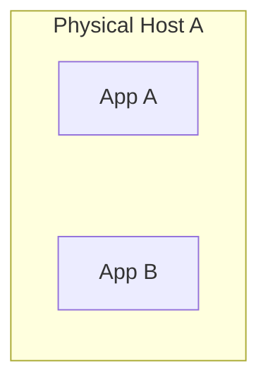

They are separate application instances, but if the host fails, both may fail together.

Now consider:

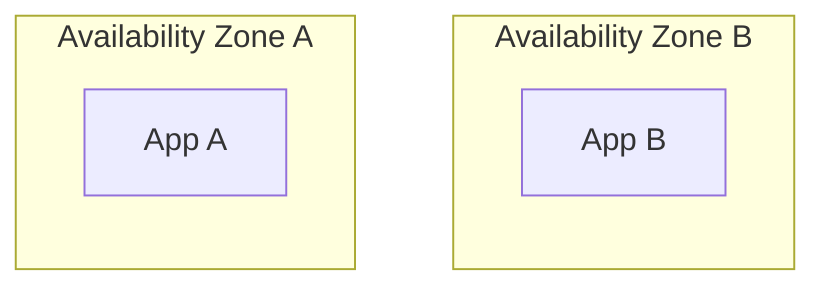

Separating instances across availability zones can reduce exposure to certain zone-level failures.

However, they may still share other dependencies, such as:

- A database deployed in one zone.
- A common network or routing configuration.
- A shared identity or configuration service.
- A defective software release.

**Redundancy is stronger when the redundant components do not share the failure being addressed.**

Distribution helps only when it separates the relevant risks.

---

## 9. Data Redundancy Is Different

Application instances are often relatively easy to duplicate because they can run the same code.

Data is more complicated.

Suppose:

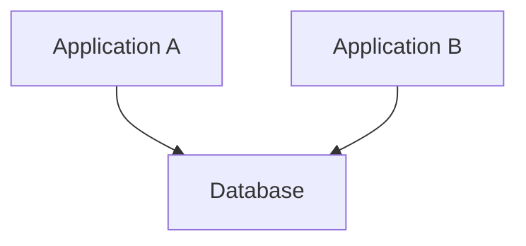

Adding another application instance does not protect the stored data if the database fails.

A database may use replication:

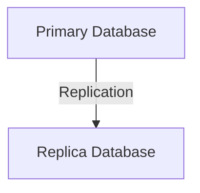

The replica can support certain recovery or read-scaling strategies, depending on the database architecture.

But replication is not the same as a backup.

If an application accidentally deletes important records and that deletion is replicated, both copies may lose the data.

A recoverable backup provides a separate recovery path for such cases.

| Technique | Primary purpose | Important limitation |
|---|---|---|
| Application redundancy | Continue serving requests after an instance failure | Does not protect database data |
| Database replication | Maintain another database copy and support selected recovery or read patterns | Replication lag and replicated mistakes can matter |
| Backup | Restore data to a recoverable point | Restoration takes time and must be tested |

These techniques solve different problems and may be used together.

---

## 10. Redundancy and Shared Dependencies

Consider a system with two application instances and one external payment provider.

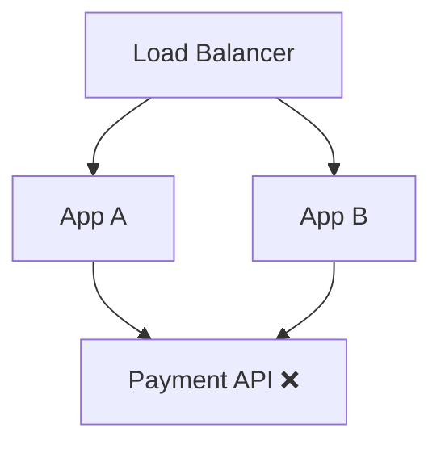

Both application instances depend on the same payment API.

If the provider becomes unavailable, adding more application instances does not solve the problem.

The application may need to:

- Stop initiating new payment attempts temporarily.
- Use timeouts to bound waiting.
- Preserve uncertain payment outcomes.
- Retry only when safe.
- Allow unrelated features to continue where possible.

A different provider may be an option in some architectures, but switching providers safely can be difficult because payment state, credentials, APIs, and transaction semantics differ.

**Do not add redundant components blindly. First identify the failure that redundancy is intended to address.**

---

## 11. Redundancy and Failover

Redundancy provides an alternative component. **Failover** is the process of switching work to that alternative.

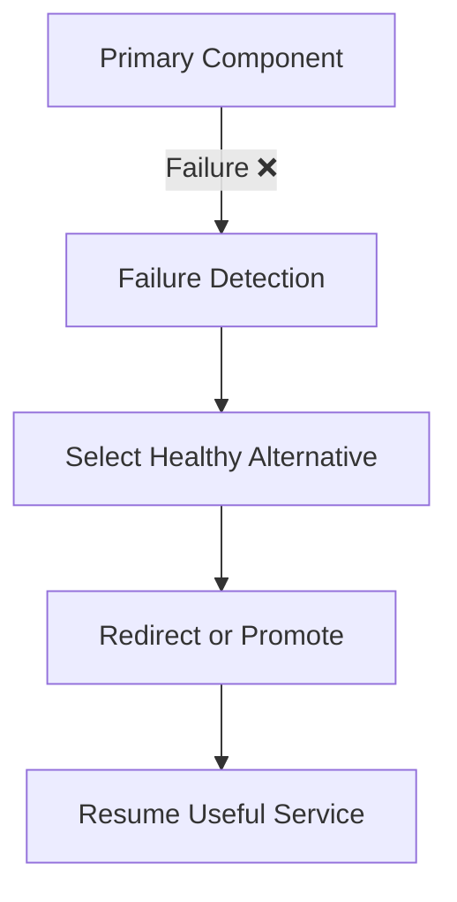

Each step can introduce problems.

- Detection may be delayed or incorrect.
- The alternative may not be healthy.
- Connections may need to be re-established.
- In-flight operations may fail.
- Data may not be fully synchronized.
- The alternative may not have enough capacity.

Therefore, redundancy without tested failover may provide less protection than expected.

Failover is covered in more detail in **09.05 — Failover**.

---

## 12. Redundancy Has a Cost

Adding more components can improve resilience, but it also introduces costs.

| Benefit | Potential cost |
|---|---|
| Alternative capacity | Additional infrastructure expense |
| Reduced dependence on one instance | More routing and health-check logic |
| Separate failure domains | More complex networking and deployment |
| Data replication | Replication lag and consistency concerns |
| Standby resources | Idle or partially used capacity |
| More recovery options | More operational procedures and testing |

Redundancy can also create false confidence. Two components running the same defective code may fail together. Two copies of data may contain the same incorrect records.

The goal is not to duplicate everything.

The goal is to provide enough independent capacity and recovery options for the failures that matter.

---

## 13. Hands-On Exercise: Design Redundancy for a Learning Platform

Start with this architecture:

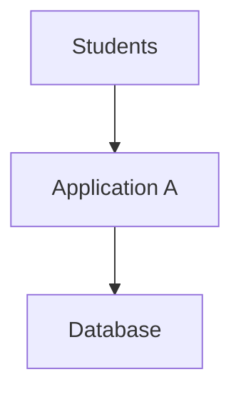

The platform supports login, enrollment, payments, and video playback.

### Step 1 — Identify the risks

- Application A crashes.
- The database becomes unavailable.
- A deployment introduces a defect.
- Video storage becomes unavailable.
- The payment provider times out.

### Step 2 — Propose alternatives

For example:

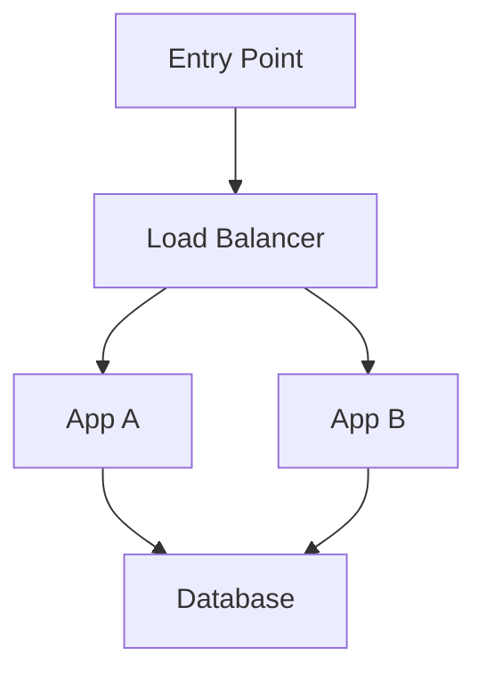

Then consider what additional protections are needed for the database, entry point, and external dependencies.

### Step 3 — Test your reasoning

Answer these questions:

1. If App A fails, can App B handle all essential traffic?
2. If the database fails, can either application instance complete enrollment?
3. If the payment provider fails, can students still browse courses?
4. If both instances receive a defective deployment, does instance redundancy help?
5. Are the instances separated across the failure domains relevant to your risks?

The exercise is complete when you can explain **which failure each redundant component protects against—and which failures it does not protect against**.

---

## 14. Common Mistakes

**Mistake 1 — Assuming more instances automatically mean high availability.**  
Instances may share a database, host, network, or defective release.

**Mistake 2 — Ignoring remaining capacity.**  
The surviving instances may become overloaded after a failure.

**Mistake 3 — Confusing replication with backup.**  
Replicated mistakes can spread to replicas.

**Mistake 4 — Assuming a standby is ready.**  
Its configuration, data freshness, capacity, and activation process need validation.

**Mistake 5 — Duplicating components without a clear failure scenario.**  
Redundancy adds costs and complexity; tie it to a real risk.

**Mistake 6 — Forgetting shared dependencies.**  
Redundant application instances cannot compensate for every shared dependency failure.

---

## 15. Key Principle

> **Redundancy reduces dependence on individual components, but it only protects against failures that the architecture can survive.**

A practical design process is:

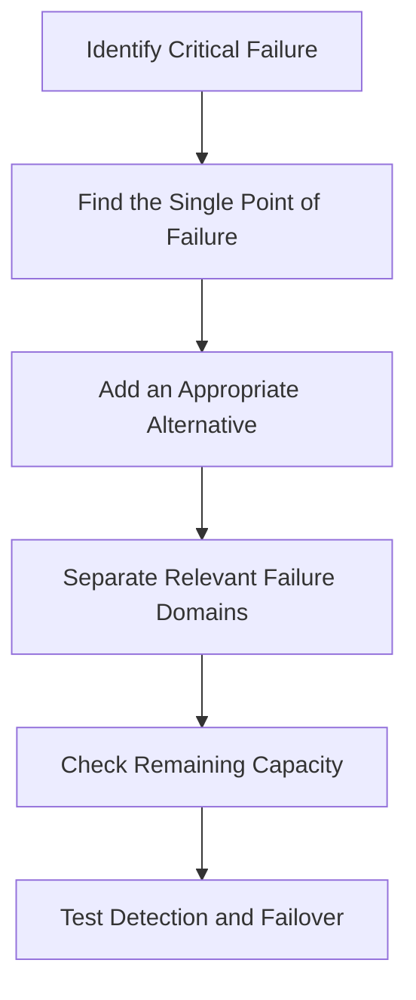

Redundancy is not a component count. It is a deliberate strategy for reducing the impact of specific failures.

---

## 16. Quick Reference

| Concept | Meaning |
|---|---|
| Redundancy | Additional components or resources that reduce dependence on one component |
| Single Point of Failure | A component whose failure can interrupt an important service |
| Active-active | Multiple instances serve traffic simultaneously |
| Active-passive | One instance is active while another is available to take over |
| Failure domain | Components that may be affected by the same failure |
| Failover | Switching work to an alternative component |
| Replication | Maintaining copies of data across components |
| Backup | A recoverable copy used to restore data |
| Failure capacity | Ability of the remaining system to handle work after a component fails |

---

## 17. Knowledge Check

**1. What is redundancy?**  
Providing additional components, resources, or paths so the system is not entirely dependent on one.

**2. What is a single point of failure?**  
A component whose failure can prevent an important part of the system from working.

**3. What is the main difference between active-active and active-passive?**  
Active-active components serve traffic simultaneously; active-passive normally relies on a primary and uses a standby when needed.

**4. Why can two application instances still be insufficient?**  
They may share a failed dependency, a failure domain, or insufficient total capacity.

**5. Is database replication a replacement for backups?**  
No. Replication helps maintain additional copies, while backups provide a separate recovery path for data loss or corruption.

**6. Does redundancy guarantee zero downtime?**  
No. Detection, failover, capacity, shared dependencies, and in-flight operations can still cause interruptions.

**7. What should you decide before adding redundancy?**  
Identify the failure scenario, the impact to prevent, and whether the alternative can actually keep the required service working.

---

## Remember

When you add a second component, ask:

- What failure does it protect against?
- Is it independent of the original component's failure domain?
- Can it handle the workload if the original fails?
- Can the system detect the failure and switch safely?
- What shared dependencies remain?

**Next: 09.04 — Fault Tolerance**
