# 09.04 — Fault Tolerance

## Learning Objectives

By the end of this chapter, you should be able to:

- Explain fault tolerance in simple terms.
- Distinguish fault tolerance from reliability, availability, and redundancy.
- Understand how systems continue operating when components fail.
- Recognize the roles of failure detection, isolation, and recovery.
- Understand graceful degradation and fault containment.
- Identify the limitations and costs of fault-tolerant designs.
- Design a basic fault-tolerance strategy for a web application.

---

## 1. What Is Fault Tolerance?

Imagine an online learning platform running two application instances.

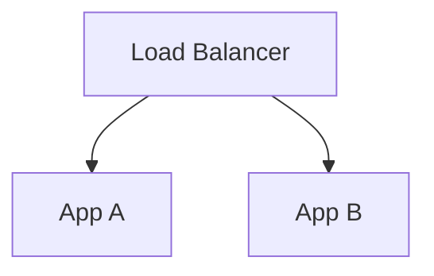

App A crashes.

Because App B is healthy and the load balancer can route requests to it, students can continue using the platform.

The system has tolerated a component failure.

**Fault tolerance** is the ability of a system to continue providing its required functionality despite specified faults.

In simple words:

> **A fault-tolerant system is designed to keep doing useful work even when something goes wrong.**

The phrase *specified faults* matters. No system can tolerate every possible failure. A design may survive one application instance failing but still fail if the database, network, or entire region becomes unavailable.

---

## 2. Fault, Error, and Failure

These terms describe different stages of a problem.

- **Fault:** The underlying cause of a problem, such as a defective software change or failed disk.
- **Error:** An incorrect internal state or computation caused by a fault.
- **Failure:** The system's externally observable behavior no longer meets its requirements.

Consider a payment workflow:

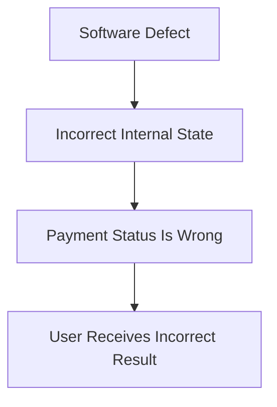

Not every fault causes a visible failure. A redundant component may mask a fault before users notice it.

For example, one application instance may crash, but another instance may continue serving requests.

The fault occurred; the system-level failure may have been avoided.

---

## 3. Fault Tolerance vs Related Concepts

These concepts work together, but they are not interchangeable.

| Concept | Main purpose |
|---|---|
| **Reliability** | Deliver correct, dependable behavior over time. |
| **Availability** | Keep the service usable when needed. |
| **Redundancy** | Provide alternative components or resources. |
| **Fault tolerance** | Continue providing required functionality despite specified faults. |
| **Fault recovery** | Restore normal or acceptable operation after a failure. |

For example, two application instances provide redundancy.

If one fails and the other keeps serving requests, the system demonstrates fault tolerance for that particular failure.

If users experience an interruption while the failed instance is replaced, the system may recover successfully without being fully fault-tolerant for that event.

**Redundancy provides options; fault tolerance is about how the system behaves when a fault occurs.**

---

## 4. How Does Fault Tolerance Work?

A fault-tolerant design usually combines several capabilities.

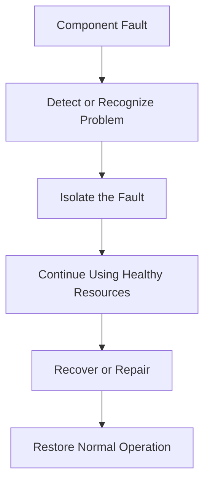

Depending on the architecture, some steps may happen automatically or nearly simultaneously.

For example:

1. An application instance stops responding.
2. Health checks identify it as unhealthy.
3. The load balancer stops sending it new requests.
4. Healthy instances continue serving traffic.
5. The failed instance is restarted or replaced.
6. Capacity returns to normal.

This process does not guarantee that every in-flight request succeeds. The goal is to preserve the required service despite the specified failure.

---

## 5. Fault Tolerance at Different Layers

A system may tolerate faults at one layer but not another.

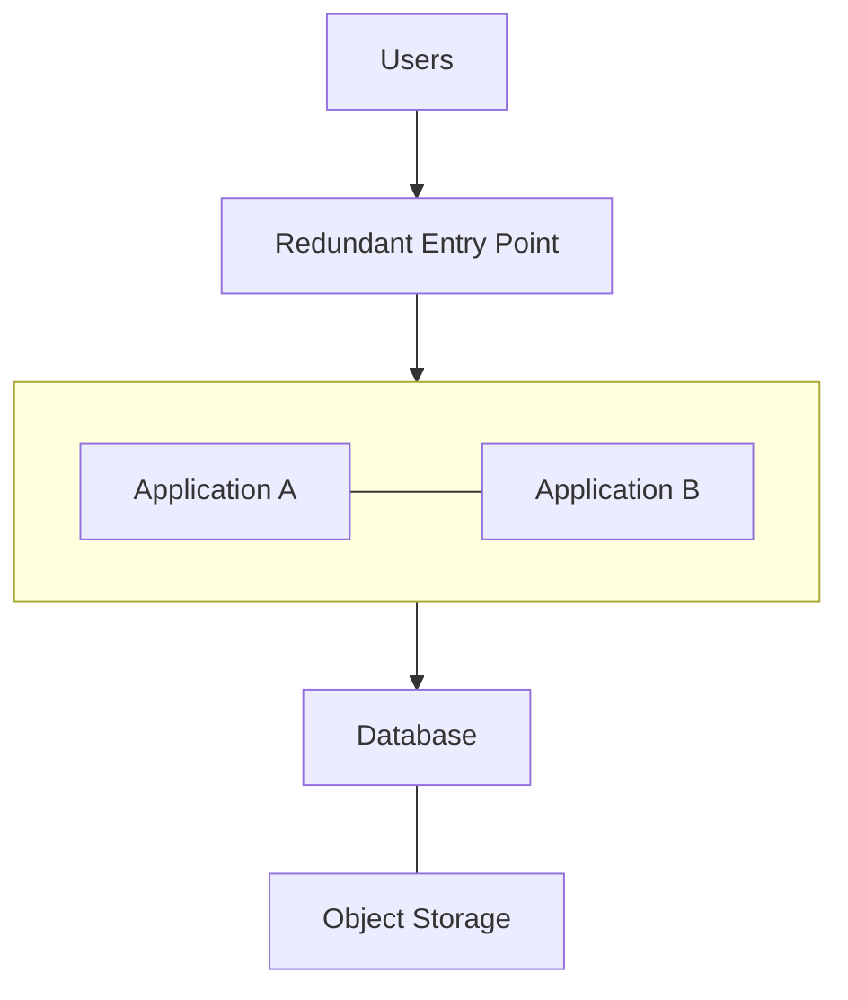

Possible strategies include:

| Layer | Fault-tolerance approach |
|---|---|
| Application | Multiple instances and health-based routing |
| Database | Appropriate replication and failover design |
| Network | Alternative paths or redundant network components |
| Cache | Rebuild cached data or fall back safely when possible |
| Messaging | Durable messages, acknowledgments, and retry handling |
| Storage | Replication, versioning, backups, and tested recovery |

The appropriate strategy depends on the component's role and the consequences of failure.

For example, a cache may be replaceable because its contents can be rebuilt. A database containing authoritative payment records requires a more careful recovery strategy.

---

## 6. Fault Isolation: Stop One Failure From Spreading

A system becomes harder to protect when a single fault affects many unrelated operations.

Imagine a recommendation service becomes slow.

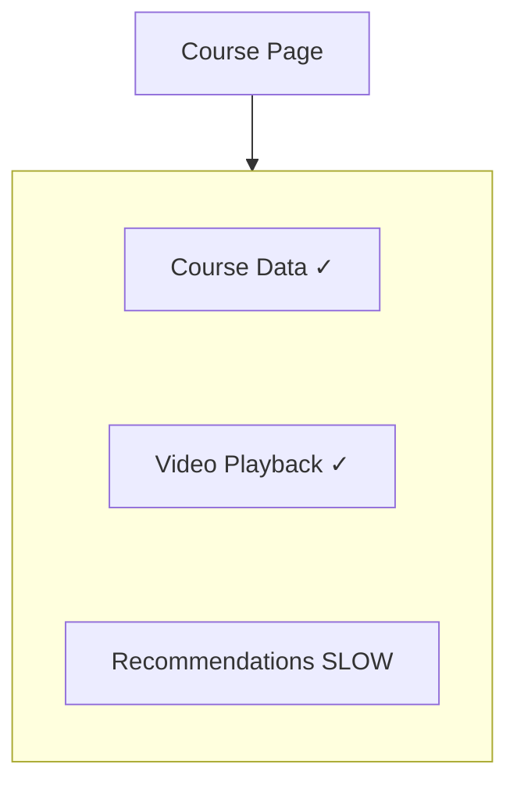

If every course-page request waits indefinitely for recommendations, the slow dependency may occupy application workers and cause the entire page to become slow.

A better design may use:

- Timeouts to bound waiting.
- A circuit breaker to stop repeatedly calling a failing dependency.
- A fallback or omission for optional recommendations.
- Separate resource limits where appropriate.

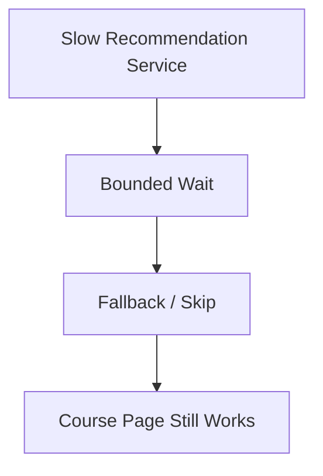

This is **fault containment**: limiting the impact of a problem so it does not unnecessarily spread through the system.

The goal is not to hide every failure. Essential operations must still report errors when they cannot complete correctly.

---

## 7. Fault Tolerance and Graceful Degradation

Sometimes the system cannot preserve every feature, but it can preserve the most important ones.

Consider a course page:

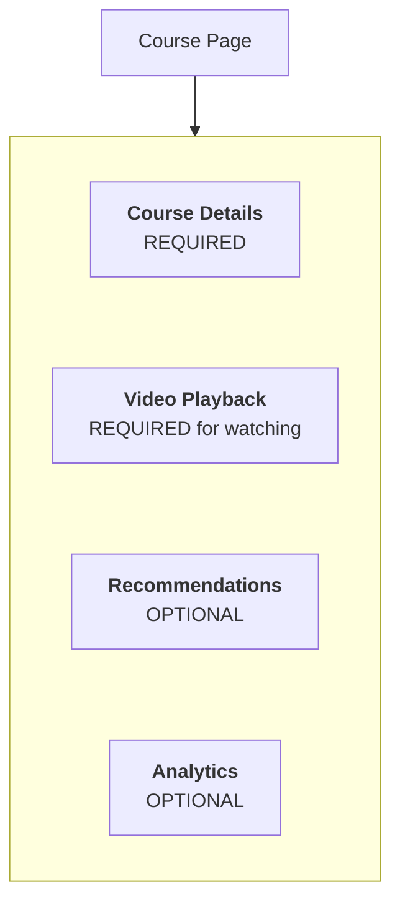

If analytics fails, the page can still work.

If recommendations fail, the platform may show the course without them.

If the course database fails, the platform may be unable to display authoritative course information.

This leads to two different outcomes:

**Full functionality continues:** the system tolerates the fault without losing the required behavior.

**Reduced functionality continues:** the system degrades gracefully, preserving essential capabilities while optional features are unavailable.

Graceful degradation is one way to improve fault tolerance at the user-experience level, but it does not make every failure tolerable.

---

## 8. Fault Tolerance Is Not the Same as Retry

Suppose an application calls a payment provider and receives a timeout.

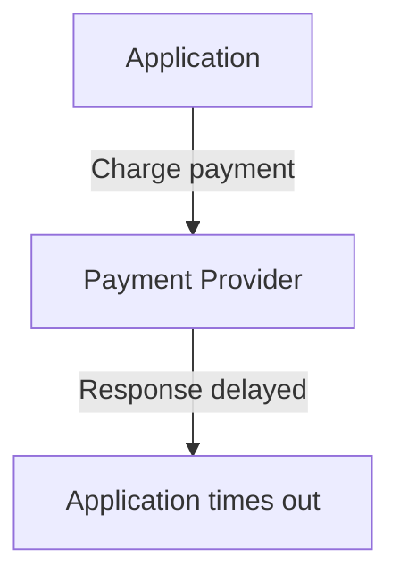

The payment may already have succeeded.

Blindly retrying the charge could create a duplicate payment.

A safer approach may involve:

1. Using an idempotency key supported by the provider.
2. Checking the transaction's status.
3. Retrying only under defined conditions.
4. Reconciling uncertain outcomes.

Retries can help recover from transient failures, but they can also increase load or repeat side effects.

**A retry is a recovery technique, not a guarantee of fault tolerance.**

The operation and its side effects determine whether retrying is safe.

---

## 9. Active-Active Fault Tolerance

With active-active application instances, multiple instances serve requests simultaneously.

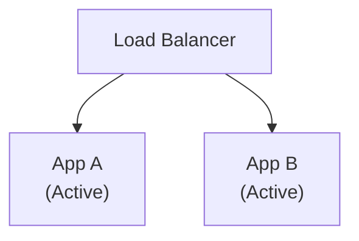

If App A fails, App B can continue handling requests if:

- The failure is detected.
- Traffic is routed correctly.
- App B has enough capacity.
- Required dependencies remain available.
- The application does not depend on state held only in App A's memory.

This can tolerate an individual instance failure.

However, it may not tolerate:

- A shared database outage.
- A defective release affecting both instances.
- A common network failure.
- A workload increase that overloads App B.

Fault tolerance must be evaluated against specific failure scenarios.

---

## 10. Fault Tolerance in Stateful Systems

Stateful systems require additional care because they manage important information.

Consider a primary database and a replica:

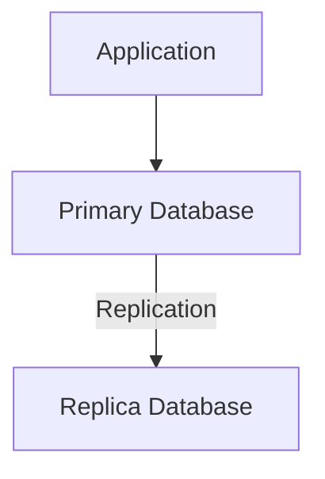

If the primary fails, the replica may be promoted.

But several questions matter:

- Has the latest committed data reached the replica?
- Can the system prevent conflicting writes?
- How long does promotion take?
- Can clients reconnect?
- What happens to transactions in progress?

Depending on the replication design, some recently acknowledged writes may not have reached the replica before failure.

Therefore, **database redundancy does not automatically guarantee zero data loss or zero interruption**.

Fault tolerance for stateful components depends on the consistency guarantees and recovery mechanisms the system actually provides.

---

## 11. Failure Domains Matter

Two redundant components may still be affected by the same event.

For example:

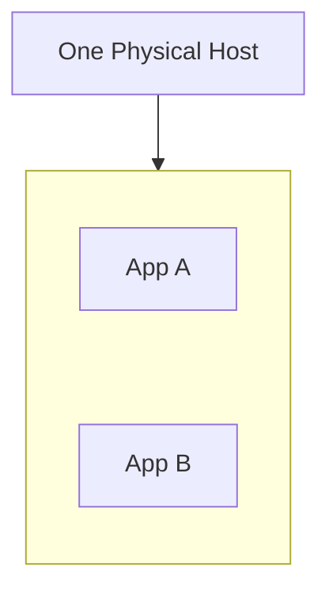

A host failure can take down both instances.

Distributing them across separate hosts reduces that particular risk.

Distributing resources across availability zones may reduce exposure to some zone-level failures.

However, shared dependencies, incorrect configuration, software defects, and broader outages can still affect multiple locations.

A good design asks:

> **Which specific failures are these components independent enough to survive?**

The answer matters more than simply counting instances.

---

## 12. Fault Tolerance Has Limits

A system designed to survive one instance failure may not survive several simultaneous failures.

Suppose:

```text
3 Application Instances
```

The system loses one instance and continues.

Then traffic spikes, and a second instance fails.

The remaining instance may not have sufficient capacity.

Fault-tolerance claims should therefore specify their assumptions.

For example:

- Can tolerate one application-instance failure.
- Can continue serving read-only pages during an email-provider outage.
- Can recover from a primary database failure within a defined recovery objective.

These statements are more useful than saying:

> "The system is fault-tolerant."

A good design defines **which faults it tolerates, what functionality remains, and what recovery is expected**.

---

## 13. The Cost of Fault Tolerance

Fault tolerance often requires extra infrastructure and more complex behavior.

| Technique | Benefit | Trade-off |
|---|---|---|
| Multiple application instances | Tolerates some instance failures | Extra capacity and routing complexity |
| Database replication | Provides another data copy and possible failover path | Replication lag and consistency concerns |
| Timeouts and circuit breakers | Contain slow or failing dependencies | Requests may fail earlier or use fallbacks |
| Durable messaging | Preserves work across certain failures | Duplicate delivery and operational complexity |
| Multi-zone deployment | Reduces some shared infrastructure risks | Higher cost and more complex operations |
| Graceful degradation | Keeps essential features usable | Additional code paths and testing |

The objective is not to tolerate every imaginable fault regardless of cost.

It is to protect the operations whose failure would have unacceptable consequences.

---

## 14. Hands-On Exercise: Make a Learning Platform Fault-Tolerant

Start with this architecture:

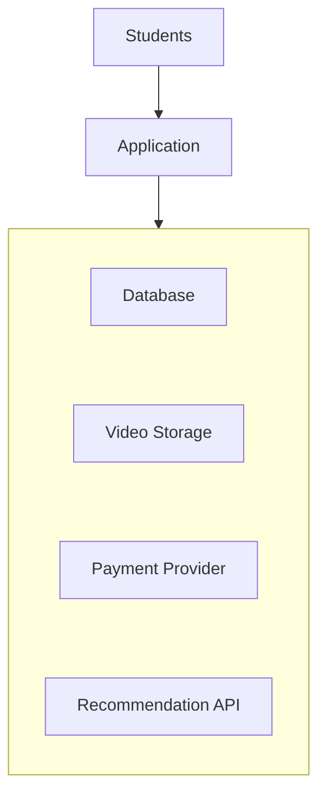

For each failure, define the expected behavior.

| Failure scenario | Design response |
|---|---|
| Application process crashes | Route new requests to another healthy instance, if available |
| Recommendation API becomes slow | Bound waiting and omit recommendations when appropriate |
| Payment response times out | Preserve the uncertain outcome and reconcile safely |
| Database becomes unavailable | Return a clear error for operations requiring authoritative data; use an appropriate recovery strategy |
| Video storage becomes unavailable | Explain the playback failure and allow a safe retry |
| New release breaks enrollment | Detect the issue and roll back or roll forward safely |

Now answer:

1. Which faults can the system tolerate without interrupting the main workflow?
2. Which faults require temporary loss of functionality?
3. Which faults create uncertainty about whether an operation succeeded?
4. Which dependencies could spread a failure to unrelated features?
5. What assumptions does each proposed recovery mechanism depend on?

The goal is to define the behavior under failure, not merely add another server.

---

## 15. Common Mistakes

**Mistake 1 — Equating redundancy with fault tolerance.**  
Extra components help only if the system can use them when a fault occurs.

**Mistake 2 — Claiming the system can survive every failure.**  
Fault tolerance is always relative to specified faults and assumptions.

**Mistake 3 — Ignoring shared dependencies.**  
Multiple application instances may still fail together when a required dependency fails.

**Mistake 4 — Retrying operations without considering side effects.**  
A timeout does not prove that a payment or other write operation failed.

**Mistake 5 — Allowing optional dependencies to block essential features.**  
A slow analytics or recommendation service should not automatically take down a critical user journey.

**Mistake 6 — Ignoring remaining capacity.**  
A surviving instance must be able to handle the workload that remains.

**Mistake 7 — Testing only the healthy path.**  
Fault tolerance must be validated by exercising realistic failure scenarios.

---

## 16. Key Principle

> **Fault tolerance is the ability to preserve required functionality despite specified faults.**

A practical design process is:

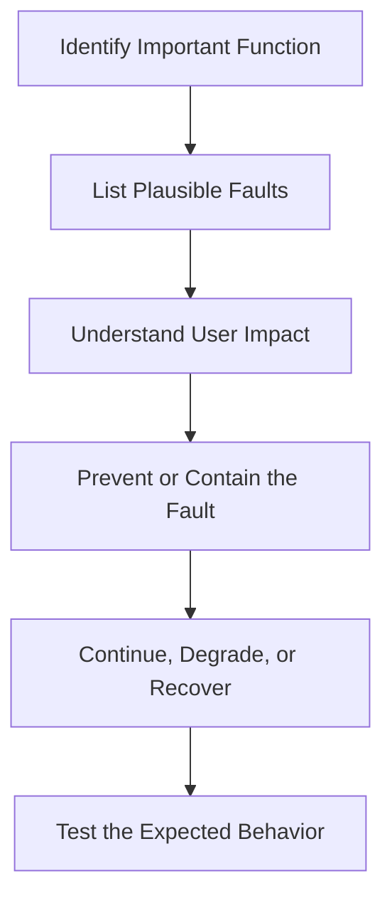

Do not promise that a system will never fail.

Define the failures it should survive, the behavior users should experience, and the recovery process when those limits are exceeded.

---

## 17. Quick Reference

| Concept | Meaning |
|---|---|
| Fault tolerance | Continuing required functionality despite specified faults |
| Fault | Underlying cause of a problem |
| Error | Incorrect internal state or computation |
| Failure | Observable behavior that violates requirements |
| Fault containment | Limiting how far a fault's effects spread |
| Active-active | Multiple components serve traffic simultaneously |
| Active-passive | A standby can take over from an active component |
| Graceful degradation | Preserving essential functionality while reducing optional capabilities |
| Failover | Switching work to an alternative component |
| Recovery | Restoring normal or acceptable operation |
| Failure domain | Components potentially affected by the same failure |

---

## 18. Knowledge Check

**1. What is fault tolerance?**  
The ability to continue providing required functionality despite specified faults.

**2. Does redundancy automatically provide fault tolerance?**  
No. Failure detection, routing, capacity, dependency design, and state handling must also work.

**3. What is fault containment?**  
Limiting the impact of a fault so it does not unnecessarily affect other components or features.

**4. How does graceful degradation help?**  
It allows essential functions to continue while optional or less critical features are unavailable.

**5. Why is a payment timeout especially difficult?**  
The payment may have succeeded even though the caller did not receive a response, so blindly retrying can cause duplicate side effects.

**6. Why should fault-tolerance claims specify assumptions?**  
A system may tolerate one instance failure but not a shared database outage, multiple simultaneous failures, or a bad deployment.

**7. What should be tested in a fault-tolerant system?**  
Failure detection, isolation, remaining capacity, user-visible behavior, data correctness, and recovery.

---

## Remember

A fault-tolerant system is not one that never experiences faults.

It is one that has been deliberately designed and tested to keep delivering the required functionality when particular faults occur.

**Next: 09.05 — Failover**
