# 09.05 — Failover

## Learning Objectives

By the end of this chapter, you should be able to:

- Explain failover and why systems use it.
- Understand the steps involved in a failover process.
- Distinguish automatic failover from manual failover.
- Understand active-active and active-passive failover.
- Recognize failover risks involving data consistency, split brain, and capacity.
- Understand the difference between failover and failback.
- Design and evaluate a basic failover strategy.

---

## 1. What Is Failover?

Imagine an online learning platform with two application instances.

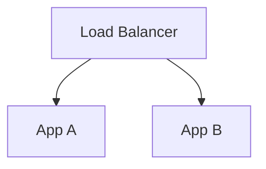

App A normally handles requests, but suddenly crashes.

The system detects the problem and directs new requests to App B.

This process is called **failover**.

> **Failover is the process of switching work from a failed or unhealthy component to an alternative component.**

The alternative might be:

- Another application instance.
- A standby database.
- A different network path.
- A backup service or infrastructure location.

Failover helps reduce the impact of component failures. It does not guarantee zero interruption or zero data loss.

---

## 2. Why Is Failover Necessary?

Without an alternative, a component failure may interrupt the entire dependent workflow.

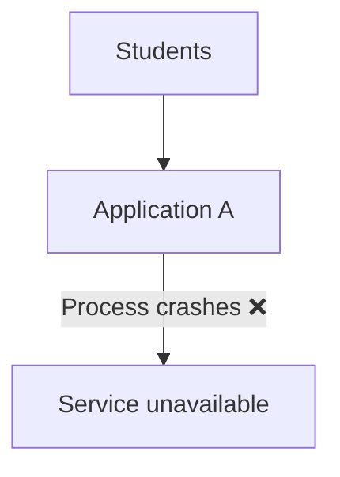

With failover:

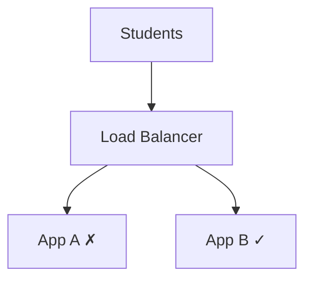

If App B is healthy, reachable, and has sufficient capacity, the system can continue serving new requests.

Failover is particularly valuable when:

- The component supports an important user journey.
- An alternative is available.
- The failure can be detected.
- Switching is safe and practical.
- The remaining system can handle the workload.

---

## 3. The Failover Process

A typical failover process involves several steps.

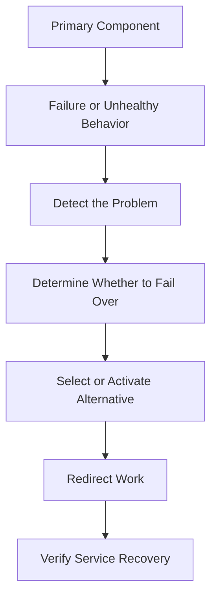

For example, with an application server:

1. A health check detects that App A is not responding correctly.
2. The load balancer marks App A as unhealthy.
3. New requests stop being routed to App A.
4. Requests are sent to healthy instances.
5. App A may be restarted or replaced.
6. Monitoring verifies that service behavior has recovered.

Not every architecture follows these steps in exactly this order. Some use service discovery, orchestration, database promotion, or other mechanisms.

The key idea is that **failover requires more than having a backup—it requires a working process for switching to it**.

---

## 4. Automatic vs Manual Failover

### Automatic failover

The system detects a failure and switches to an alternative without requiring an operator to initiate the switch.

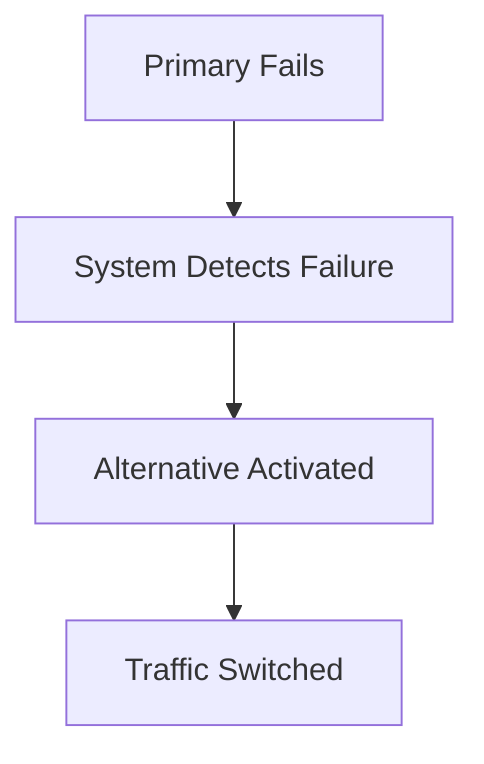

**Advantages**
- Can reduce recovery delay.
- Can operate outside staffed hours.
- Reduces the need for immediate manual intervention.

**Trade-offs**
- Incorrect failure detection can trigger an unnecessary switch.
- Automation can repeat mistakes if its logic is defective.
- The alternative may not be ready or sufficiently provisioned.

### Manual failover

An operator investigates and initiates the switch.

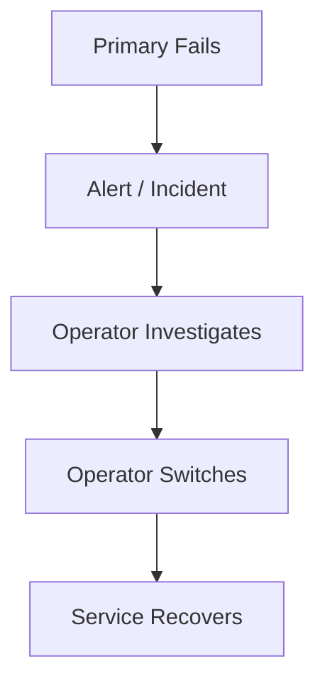

**Advantages**
- Allows human judgment for ambiguous or risky situations.
- Can be appropriate when switching has serious data or business consequences.

**Trade-offs**
- Recovery depends on detection, communication, and operator response.
- Human decisions can take time.
- Procedures may fail if they are outdated or untested.

The choice depends on the component, consequences of switching, confidence in detection, and operational maturity.

---

## 5. Application Failover

Application failover is often relatively straightforward when instances are stateless.

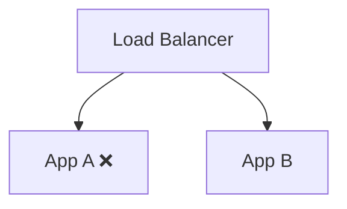

If App A fails, the load balancer can route new requests to App B.

However, several conditions must hold:

- App B is healthy.
- App B can access the required dependencies.
- Session or workflow state is not trapped only in App A's memory.
- App B has enough capacity.
- The routing layer itself is functioning.

Failover does not automatically preserve a request that was already executing on App A. That request may fail and need to be retried safely by the client.

**New requests may recover quickly while in-flight requests still fail.**

---

## 6. Database Failover

Database failover is more complicated because databases manage persistent state.

Consider a primary database with a standby replica.

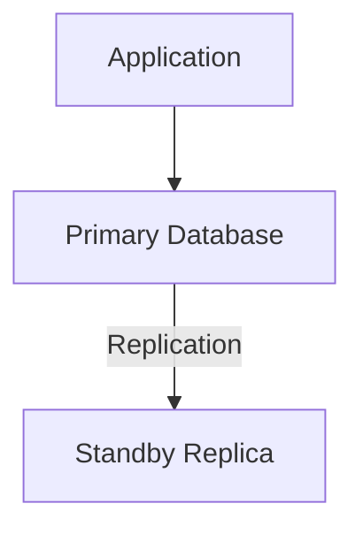

If the primary fails, the standby may be promoted to become the new primary.

Conceptually:

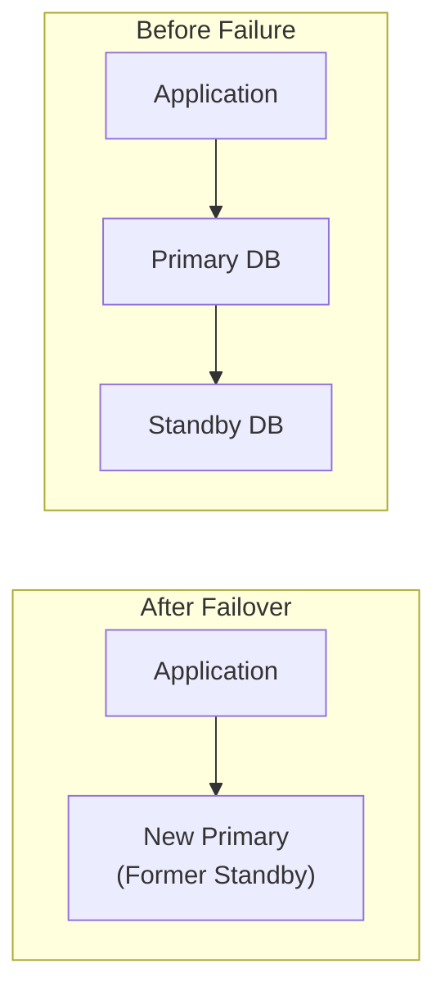

The application or database infrastructure must direct new database operations to the promoted primary.

Important questions include:

- Is the standby sufficiently up to date?
- Can it safely accept writes?
- How is the old primary prevented from accepting conflicting writes?
- How do applications discover the new primary?
- What happens to transactions that were in progress?
- How long does promotion and reconnection take?

Database failover behavior depends heavily on the database technology and replication configuration.

---

## 7. Failover Does Not Guarantee Zero Data Loss

Suppose a primary database acknowledges a write before the standby has received it.

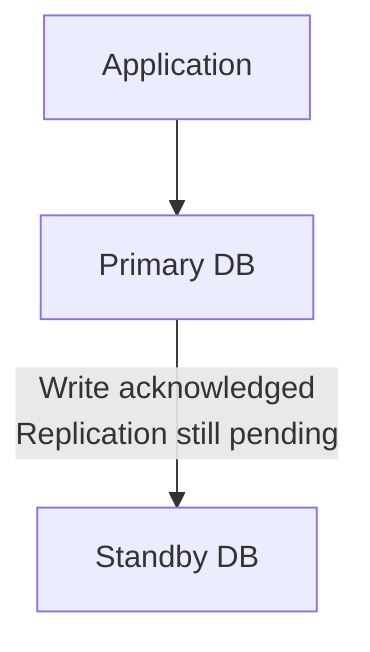

Now the primary fails before the write reaches the standby.

If the standby is promoted, the most recent acknowledged write may be missing.

This is possible with some asynchronous replication configurations.

Synchronous replication can provide stronger durability guarantees, but it can introduce additional latency and availability trade-offs. The exact guarantees depend on the database and configuration.

Therefore, database failover must be evaluated separately for:

- Service interruption.
- Data loss risk.
- Consistency.
- Recovery time.

**A successful failover does not automatically mean every recent write survived.**

---

## 8. Split Brain: When Both Sides Believe They Are Primary

One of the most dangerous failover problems is **split brain**.

Imagine a primary database becomes unreachable from the application, but it is still running.

The system promotes a standby.

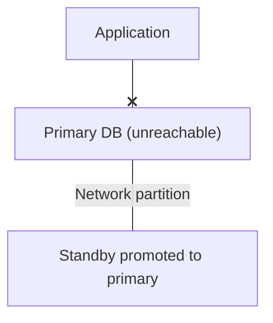

If the original primary continues accepting writes while the new primary also accepts writes, the system may have two active writers.

```text
Writer A ---> Data A

Writer B ---> Data B
```

Their states can diverge.

This can lead to conflicting updates and difficult reconciliation.

Preventing split brain may require:

- Reliable leader-election or promotion rules.
- Quorum or coordination mechanisms where appropriate.
- Fencing the old primary so it cannot continue writing.
- Carefully controlled access to the write path.

A timeout or missed health check alone is not always enough to prove that a component has permanently failed.

---

## 9. Failover and Failure Detection

Failover depends on recognizing when the current component should no longer receive work.

For example:

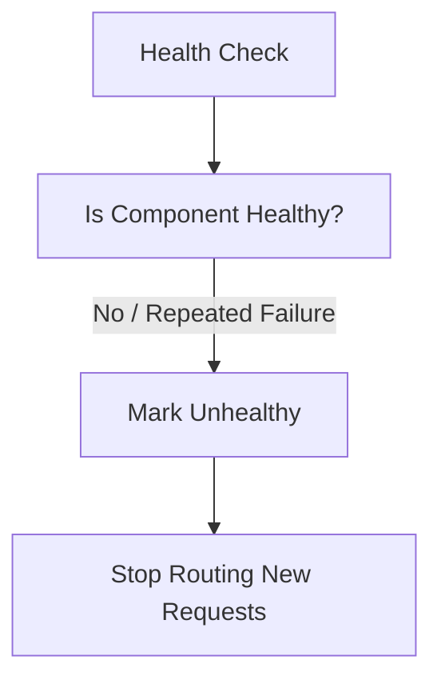

Detection must balance two risks.

**Detect too slowly:** Users may continue sending requests to a failed component.

**Detect too aggressively:** Temporary latency or a brief network issue may cause a healthy component to be removed unnecessarily.

Production systems often use multiple checks, thresholds, and recovery rules to reduce false decisions.

The appropriate design depends on the component and the failure being detected.

---

## 10. Failover and Capacity

Suppose two application instances can each handle 100 requests per second.

Normal traffic is 140 requests per second.

```text
App A: 70 req/sec
App B: 70 req/sec
```

App A fails.

App B now receives approximately 140 requests per second, exceeding its assumed capacity.

```text
App A: FAILED

App B:
Incoming traffic = 140 req/sec
Capacity          = 100 req/sec
```

The failover mechanism worked, but the service may still become overloaded.

This is why failover design must consider **how much work the remaining system can handle**.

Possible approaches include:

- Provisioning sufficient spare capacity.
- Scaling healthy instances.
- Reducing optional work.
- Applying load shedding or rate limits.
- Prioritizing critical operations.

Failover redirects work; it does not create unlimited capacity.

---

## 11. Failover vs Failback

These terms describe opposite transitions.

**Failover:** Switch away from the failed or unhealthy component to an alternative.

**Failback:** Return work to the original component—or another designated preferred component—after recovery.

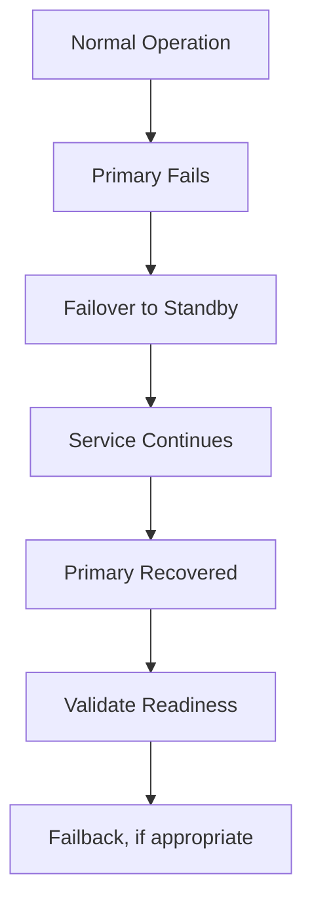

Failback should not happen blindly.

Before returning traffic, the system may need to:

- Verify the original component is healthy.
- Reconcile or synchronize data.
- Confirm that it cannot conflict with the active component.
- Restore sufficient capacity.
- Choose a safe switching time.

Sometimes the system stays on the new primary until a later maintenance window. Immediate failback is not always necessary or desirable.

---

## 12. Failover and Graceful Degradation

Sometimes there is no safe or practical alternative component.

In that situation, the system may preserve essential functions by reducing functionality.

For example, if the recommendation service fails:

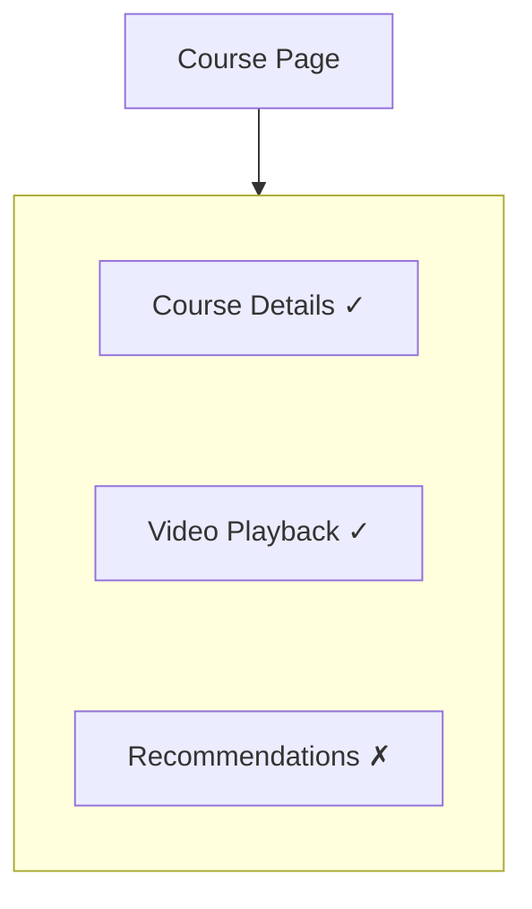

The system can continue without recommendations.

That is graceful degradation, not necessarily failover.

The distinction:

- **Failover:** Switch work to an alternative.
- **Graceful degradation:** Continue with reduced functionality when some capabilities are unavailable.

A system may use both techniques in the same architecture.

---

## 13. Failover Has a Recovery Time

Failover is not always instantaneous.

The total interruption can include:

```text
Failure Detection
        +
Decision / Coordination
        +
Alternative Activation
        +
Routing / Reconnection
        +
Application Recovery
```

Each stage may take time.

For example, database promotion and application reconnection may take longer than removing an unhealthy application instance from a load balancer.

The amount of interruption depends on the architecture and operational setup.

This is why a failover design should be tested and measured rather than judged by the existence of a standby alone.

Recovery objectives will be covered later in **09.10 — RPO** and **09.11 — RTO**.

---

## 14. Common Failover Mistakes

**Mistake 1 — Assuming a backup automatically takes over.**  
The system needs detection, switching logic, and a working alternative.

**Mistake 2 — Assuming failover means zero downtime.**  
Detection and switching can interrupt requests.

**Mistake 3 — Ignoring data freshness.**  
A standby may not contain every recent write.

**Mistake 4 — Ignoring split brain.**  
The original component may still be active when a replacement is promoted.

**Mistake 5 — Ignoring capacity.**  
The alternative may not handle the entire workload.

**Mistake 6 — Automatically failing back as soon as the primary returns.**  
The original component may not be synchronized or safe to reactivate.

**Mistake 7 — Testing only the happy path.**  
Failover should be exercised under realistic failures, including dependency loss and network partitions where relevant.

---

## 15. Hands-On Exercise: Plan Failover for a Learning Platform

Consider:

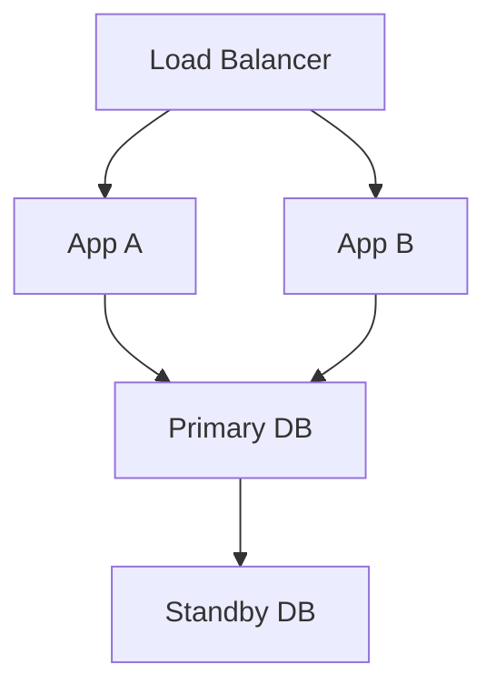

Assume:

- Both application instances normally serve traffic.
- The database has a standby replica.
- Enrollment writes require the database.
- Recommendations use an external service.

Evaluate these scenarios:

| Scenario | Questions to answer |
|---|---|
| App A crashes | Can App B handle the workload? What happens to in-flight requests? |
| Primary DB fails | How is the standby promoted? Could recent writes be missing? |
| App A loses network access to the database | How do you distinguish this from a database-wide failure? |
| Original primary recovers | How do you prevent conflicting writes before reusing it? |
| Recommendation service fails | Is failover necessary, or can the feature be skipped? |

For each scenario, document:

1. How the failure is detected.
2. What component takes over, if any.
3. What users experience during the transition.
4. Whether data loss or duplicate operations are possible.
5. How recovery is verified.

A good failover plan defines the behavior before an incident occurs.

---

## 16. Key Principle

> **Failover is a controlled transition to an alternative component—not simply the presence of a backup.**

A practical failover strategy should answer:

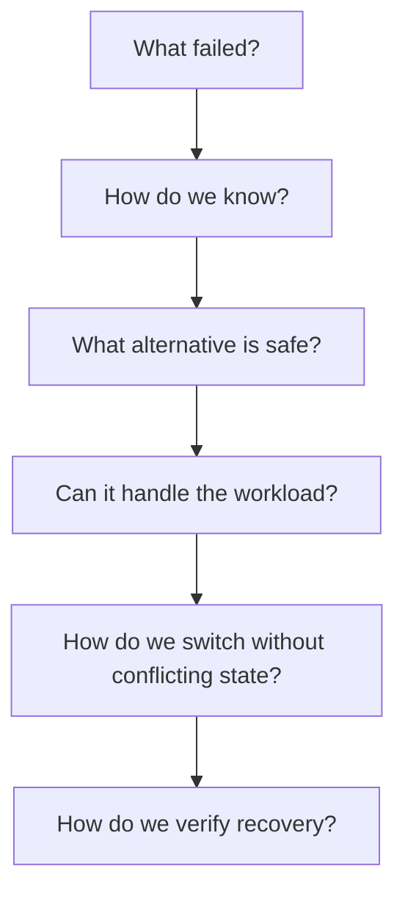

Failover improves resilience only when the alternative is ready, the transition is safe, and the system can operate within the remaining capacity and consistency constraints.

---

## 17. Quick Reference

| Concept | Meaning |
|---|---|
| Failover | Switching work to an alternative after a failure or unhealthy condition |
| Automatic failover | System initiates the switch automatically |
| Manual failover | An operator initiates the switch |
| Active-active | Multiple components serve traffic simultaneously |
| Active-passive | A standby takes over from an active component |
| Failback | Returning work to a recovered or preferred component |
| Split brain | Multiple components incorrectly act as the authoritative primary |
| Replication lag | Delay before changes reach a replica |
| Failure detection | Determining whether a component should be considered unhealthy |
| Recovery time | Time required to restore acceptable service after disruption |

---

## 18. Knowledge Check

**1. What is failover?**  
Switching work from a failed or unhealthy component to an alternative.

**2. Why is failover not always automatic?**  
Some transitions involve data consistency, safety, business consequences, or uncertain failure detection that require operator judgment.

**3. Does database failover guarantee zero data loss?**  
No. The result depends on replication guarantees and whether recent writes reached the promoted standby.

**4. What is split brain?**  
A situation in which multiple components incorrectly act as the active primary, potentially accepting conflicting writes.

**5. What is failback?**  
Returning work to a recovered or preferred component after a failover.

**6. Why must failover account for capacity?**  
The surviving resources may become overloaded when they inherit the failed component's workload.

**7. Is showing a course page without recommendations a failover?**  
Not necessarily. It is graceful degradation unless the system actually switches to an alternative recommendation component.

---

## Remember

A backup is only useful if the system can switch to it safely and the alternative can provide the required service.

**Next: 09.06 — Health Checks**
