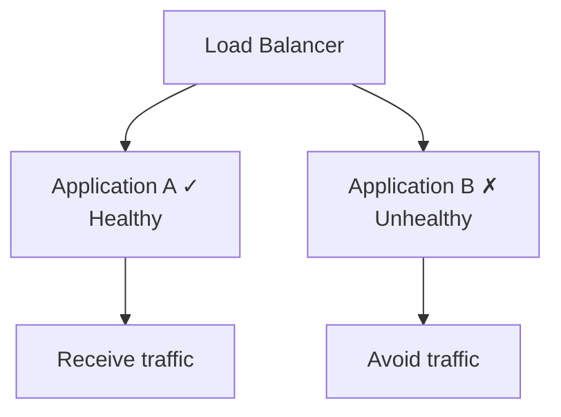
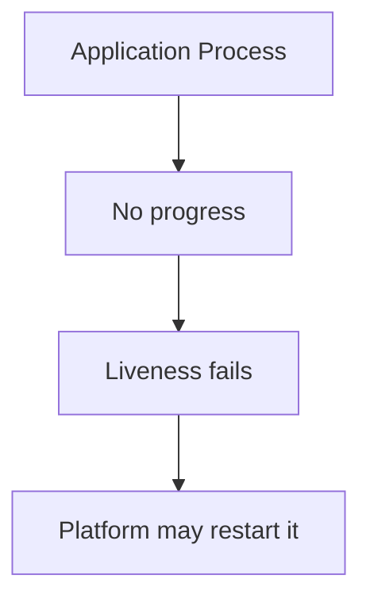
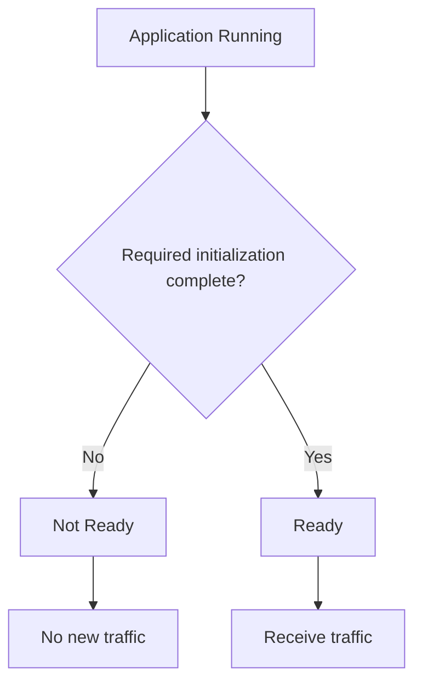
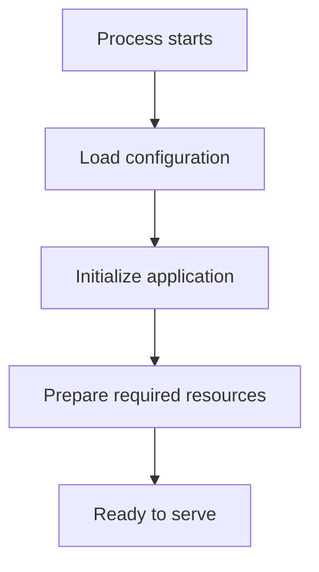
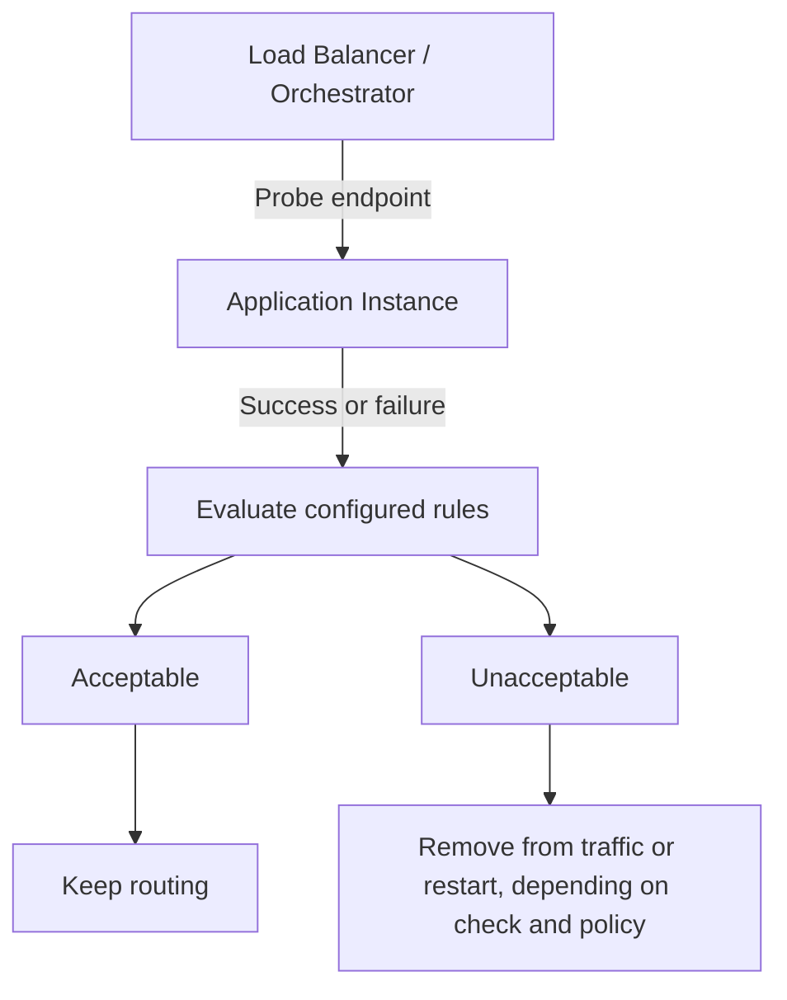
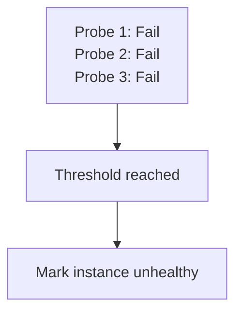
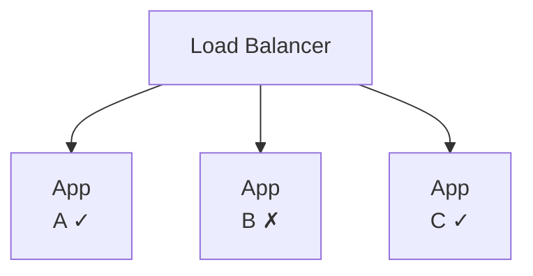
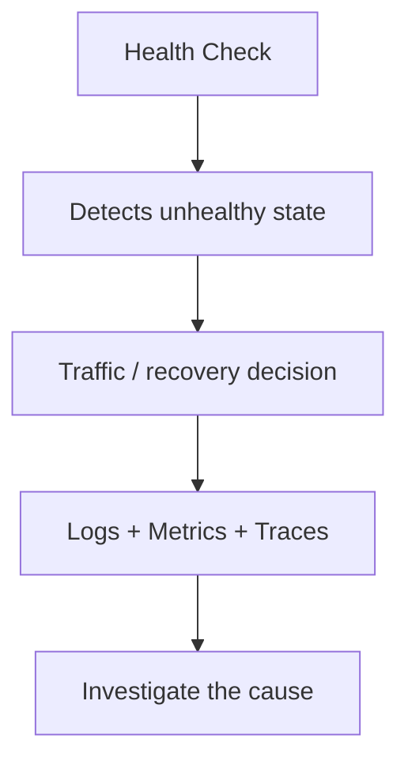
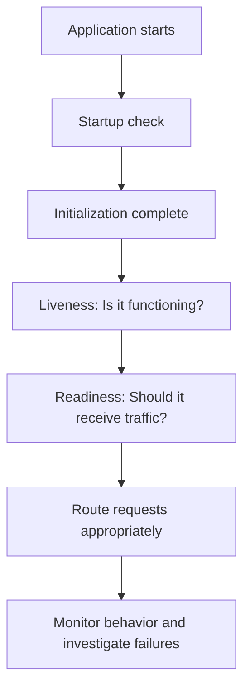

# 09.06 — Health Checks

## Learning Objectives

By the end of this chapter, you should be able to:

- Explain why systems use health checks.
- Distinguish **liveness, readiness, and startup checks**.
- Understand how health checks influence load balancing, restarts, and failover.
- Identify false positives, false negatives, and health-check flapping.
- Design checks without overwhelming dependencies.
- Understand why a healthy process is not necessarily a healthy service.

---

## 1. What Is a Health Check?

A **health check** is a signal or test used to assess whether a component is functioning well enough for a particular purpose.

For example, a load balancer needs to know which application instances should receive requests.



Without health checks, a load balancer might continue sending requests to an instance that has crashed or become unable to serve them.

> **A health check helps a system decide what to do with a component. It does not necessarily explain why the component is unhealthy.**

---

## 2. Three Important Types of Health Checks

Many orchestration platforms distinguish between three checks: **liveness, readiness, and startup**. Their exact behavior depends on the platform and configuration.

| Check | Main question | Typical response to failure |
|---|---|---|
| **Liveness** | Is the process alive and making progress? | Restart the process, depending on platform policy |
| **Readiness** | Can this instance accept traffic right now? | Stop routing new traffic to it |
| **Startup** | Has the application finished initializing? | Delay normal liveness/readiness decisions until startup succeeds |

These checks solve different problems. They should not automatically share the same logic.

---

## 3. Liveness — Is It Alive?

A liveness check asks whether the application process is alive and functioning well enough to continue running.

Imagine an application process becomes stuck:



A simple endpoint might be:

```http
GET /livez
```

A successful response indicates that the process appears alive.

### Important limitation

A process can be alive but unable to serve useful requests.

For example:

```text
Application process: Alive
Database connections: Exhausted
User requests: Failing
```

A liveness check alone may still pass.

Also, a liveness check should generally avoid depending on remote services such as the database. If the database goes down, restarting every application instance may create unnecessary restart loops without fixing the database.

---

## 4. Readiness — Can It Receive Traffic?

A readiness check asks whether an application instance is currently prepared to handle requests.

For example, the application might be running but still:

- Loading required configuration.
- Initializing essential resources.
- Establishing required connections.
- Recovering from a temporary local problem.

A readiness endpoint might be:

```http
GET /readyz
```

Conceptually:



If readiness fails, a load balancer or orchestrator can stop sending new requests to that instance.

**Readiness failure does not necessarily mean the process should be restarted.** The process may be running correctly but temporarily unable to accept work.

---

## 5. Startup — Has It Finished Initializing?

Some applications need extra time to start.

For example:



If liveness checks begin too aggressively, the platform might repeatedly restart an application that is simply taking longer than expected to initialize.

A startup check can protect this period.

For example:

```http
GET /startupz
```

The platform can defer normal liveness decisions until startup succeeds.

> **Startup checks protect initialization. Liveness checks detect a process that is no longer functioning properly. Readiness checks determine whether it should receive traffic.**

---

## 6. One Application, Three Different Answers

Consider an application that has just started.

| Situation | Liveness | Readiness | Startup |
|---|---|---|---|
| Initializing normally | Pass | Fail | Not yet passed |
| Fully initialized and serving | Pass | Pass | Pass |
| Running but temporarily unable to serve requests | Pass | Fail | Pass |
| Process stuck and unable to make progress | May fail | May fail | Already passed |
| Process has crashed | Fails or cannot be reached | Fails or cannot be reached | Fails or cannot be reached |

The exact results depend on the checks and platform.

The important lesson is that **one successful health check cannot answer every health-related question**.

---

## 7. How Health Checks Work in Practice

A typical flow looks like this:



A health check might run every few seconds. The system may require multiple consecutive failures before taking action.

For example:



Thresholds and timing help avoid reacting to every temporary delay.

---

## 8. Health Checks and Failover

Health checks often provide the signals used by load balancers and failover mechanisms.

Suppose there are three application instances:



If App B fails its readiness checks, the load balancer can stop routing new requests to it.

This is **traffic removal**, not necessarily a complete failover to a different architecture. The remaining instances continue serving traffic if they have enough capacity.

Remember the previous chapter's capacity example: removing one unhealthy instance can overload the remaining instances if they cannot handle the extra traffic.

A health check can therefore improve routing decisions, but it cannot create capacity that does not exist.

---

## 9. What Should a Health Check Test?

The answer depends on the purpose of the check.

### Liveness check

Prefer a lightweight test of whether the process is making progress.

It should not usually perform an expensive database query or call several external APIs on every probe.

### Readiness check

Test whether the instance can handle the requests it is expected to receive.

For example, if the application cannot serve any essential request without its database, database connectivity may be relevant to readiness.

However, if an optional recommendations service is unavailable, the application may still be able to serve product pages. Making every instance unready because recommendations are down could unnecessarily take the entire application out of service.

### Startup check

Test whether the required initialization has completed.

Do not assume that the process accepting a TCP connection means the application is fully initialized.

---

## 10. Deep Checks vs Lightweight Checks

A health check can be too shallow or too expensive.

| Approach | Risk |
|---|---|
| Check only that the process responds | The application may respond while core operations are broken |
| Run several database queries on every probe | Health checks can add unnecessary database load |
| Call every external dependency | An optional dependency outage may mark all instances unhealthy |
| Test a representative, essential capability | More useful, but still not proof that every operation works |

Health checks should be **purposeful and lightweight**.

A separate monitoring or synthetic test can verify end-to-end user journeys, such as completing a checkout or enrolling in a course.

---

## 11. Failure Modes

Health checks can create problems when designed poorly.

| Problem | What happens | Better approach |
|---|---|---|
| Check is too shallow | Broken functionality appears healthy | Test the right capability at the right layer |
| Check is too aggressive | Temporary delays cause traffic removal or restarts | Tune intervals, timeouts, thresholds, and grace periods |
| Startup takes longer than expected | Healthy instances repeatedly restart | Configure startup handling appropriately |
| Optional dependency fails | All instances are incorrectly marked unready | Distinguish essential from optional dependencies |
| Check overloads the database | Monitoring adds pressure during an incident | Keep probes cheap and control their frequency |
| Flapping | An instance repeatedly switches between healthy and unhealthy | Use suitable thresholds and investigate intermittent failures |
| Only HTTP 200 is checked | The endpoint works while business operations fail | Combine health checks with application-level monitoring |

### Health-check flapping

Flapping means an instance repeatedly changes state:

```text
Healthy → Unhealthy → Healthy → Unhealthy
```

This can happen when a check is too sensitive to temporary latency or a dependency is unstable.

The result may be unnecessary traffic shifts, restarts, and additional load on the remaining instances.

---

## 12. Health Checks Are Signals, Not Diagnosis

Suppose an application fails readiness checks.

That tells you:

> "This instance should not currently receive new traffic."

It does not tell you whether the cause is:

- Database connection exhaustion.
- A configuration error.
- Memory pressure.
- A stuck worker pool.
- A required dependency outage.
- An application bug.

To find the cause, use logs, metrics, traces, and alerts.



Health checks and observability complement each other. One helps make an operational decision; the other helps explain what is happening.

---

## 13. Health Checks vs Timeouts and Monitoring

| Concept | Main purpose |
|---|---|
| Health check | Assess whether a component is suitable for a particular role |
| Timeout | Bound how long an operation is allowed to wait |
| Monitoring | Track system behavior and alert on relevant conditions |
| Synthetic check | Test a user-visible journey from an external perspective |
| Failover | Switch work to an alternative component |

For example, a database request can time out even while the application process remains alive. The application may fail readiness if that database is essential to serving requests, but it should not necessarily fail liveness.

---

## 14. Hands-On Exercise — Learning Platform

Imagine a learning platform with:

- An application server.
- A database storing courses and enrollments.
- A cache for frequently accessed course details.
- An optional recommendations service.

Decide how each condition should affect the application.

| Condition | Liveness | Readiness | Possible action |
|---|---|---|---|
| Application process is stuck | May fail | May fail | Restart if the platform's liveness policy requires it |
| Application is still initializing | May pass | Fail | Wait for startup to complete |
| Required database is unavailable | Usually still pass if the process is functioning | May fail | Stop routing traffic if essential requests cannot be served |
| Cache is unavailable but database fallback works | Usually pass | Often pass | Continue with reduced performance; monitor database load |
| Recommendations service is unavailable | Usually pass | Often pass | Serve the core page without recommendations |
| Application can respond but enrollment operations are broken | May pass | A basic readiness check may also pass | Detect through deeper monitoring or synthetic tests |

These are design choices, not universal rules. The correct behavior depends on which functions the application promises to provide.

### Your task

For each dependency, ask:

1. Is it required for the application process to keep running?
2. Is it required to serve the requests routed to this instance?
3. Can the application continue with a fallback?
4. Would marking every instance unready make the outage worse?

The goal is not to mark every problem as unhealthy. The goal is to make the right operational decision.

---

## 15. Practical Design Checklist

Before deploying health checks, verify:

- [ ] Liveness, readiness, and startup have distinct purposes.
- [ ] Startup behavior allows realistic initialization time.
- [ ] Liveness does not trigger restart loops because of an unrelated dependency outage.
- [ ] Readiness reflects the ability to serve the expected requests.
- [ ] Optional dependencies can fail without unnecessarily removing all service.
- [ ] Probe frequency, timeout, and failure thresholds are appropriate.
- [ ] Health checks do not create excessive work or dependency load.
- [ ] Traffic removal and restart behavior are understood.
- [ ] Logs and metrics help explain failed checks.
- [ ] The remaining instances have enough capacity when an instance is removed.

---

## 16. Common Mistakes

**Mistake 1 — Treating all health checks as the same.**

A process can be alive but not ready, or still starting.

**Mistake 2 — Restarting an application whenever a dependency is unavailable.**

A database outage may require traffic management and investigation, not repeated application restarts.

**Mistake 3 — Checking only whether HTTP responds.**

A response does not prove that important business operations work.

**Mistake 4 — Making every dependency mandatory.**

Optional capabilities should not necessarily determine whether the core application is ready.

**Mistake 5 — Assuming health checks guarantee availability.**

They can detect problems and guide routing, but they cannot prevent every failure or guarantee sufficient capacity.

**Mistake 6 — Ignoring the cost of removing an instance.**

If the remaining instances cannot handle the load, correct health detection can still be followed by an outage.

---

## 17. Key Principle

> **Separate three questions: Is the process alive? Is it ready to receive traffic? Has it finished starting?**

A reliable system uses health checks to make appropriate routing and recovery decisions—not to pretend that every failure can be detected perfectly.

Health checks should be lightweight, reflect the purpose of the component, and work alongside capacity planning and observability.

---

## 18. Quick Reference

| Term | Meaning |
|---|---|
| Health check | Test or signal used to assess a component's condition |
| Liveness | Whether a process appears to be functioning |
| Readiness | Whether an instance should receive traffic |
| Startup check | Whether initialization has completed |
| Probe | A check sent to a component |
| Failure threshold | Number or pattern of failures required before action |
| Flapping | Repeated changes between healthy and unhealthy states |
| False positive | A healthy component is incorrectly marked unhealthy |
| False negative | An unhealthy component is incorrectly marked healthy |
| Grace period | Time allowed for expected startup or recovery behavior |
| Synthetic check | Test of a user-visible operation or journey |

---

## 19. Knowledge Check

**1. Can a process be alive but not ready?**

Yes. It may still be initializing or unable to serve requests.

**2. What is the main difference between liveness and readiness?**

Liveness helps determine whether a process should continue running; readiness helps determine whether it should receive traffic.

**3. Why use a startup check?**

To allow an application to initialize without premature liveness-triggered restarts.

**4. Should an unavailable optional recommendations service necessarily make every application instance unready?**

No. If the core application can continue without recommendations, it may be better to degrade gracefully.

**5. Why can overly aggressive health checks make an outage worse?**

They can trigger unnecessary restarts or remove too many instances, reducing available capacity.

**6. Does a passing health check prove that every business operation works?**

No. Health checks cover specific conditions; monitoring and synthetic tests can check additional behavior.

**7. What should you do when a health check fails?**

Apply the appropriate routing or recovery policy, then use observability data to investigate the cause.

---

## Remember



**Next: 09.07 — Graceful Degradation**
