# 09.07 — Graceful Degradation

## Learning Objectives

By the end of this chapter, you should be able to:

- Explain graceful degradation and why it matters.
- Distinguish graceful degradation from fault tolerance, failover, and high availability.
- Identify essential and optional system capabilities.
- Design fallbacks for unavailable dependencies.
- Understand the risks of stale data, hidden failures, and overloaded fallbacks.
- Recognize when a system should degrade and when it must fail safely.
- Design a simple degradation strategy for a real application.

---

## 1. What Is Graceful Degradation?

Imagine an online learning platform.

Students can normally:

- Browse courses.
- Enroll in courses.
- Watch lessons.
- View recommendations.
- Receive notifications.

Now suppose the recommendation service becomes unavailable.

Should the entire platform stop working?

Not necessarily.

The platform could continue displaying courses and allow students to enroll, while temporarily hiding recommendations.

That is **graceful degradation**.

> **Graceful degradation means preserving essential functionality when part of a system becomes unavailable or performs poorly, even if some features become limited.**

The goal is not to pretend that nothing failed.

The goal is to keep the most important user journeys working.

---

## 2. A Simple Example

Consider a product page with three dependencies:

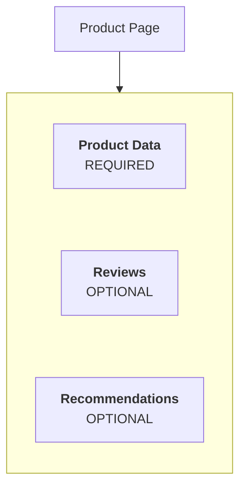

Suppose the recommendation service fails.

Without graceful degradation:

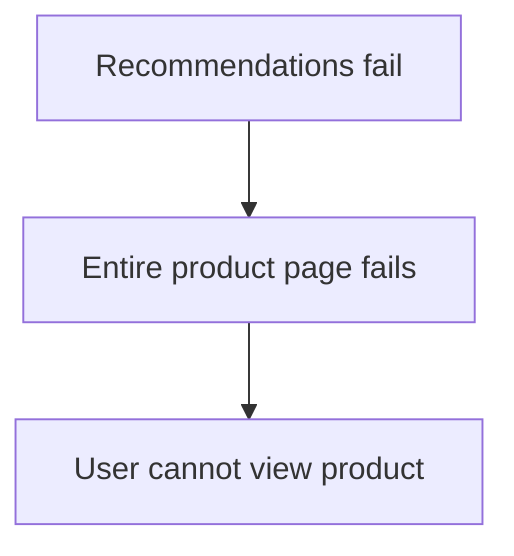

With graceful degradation:

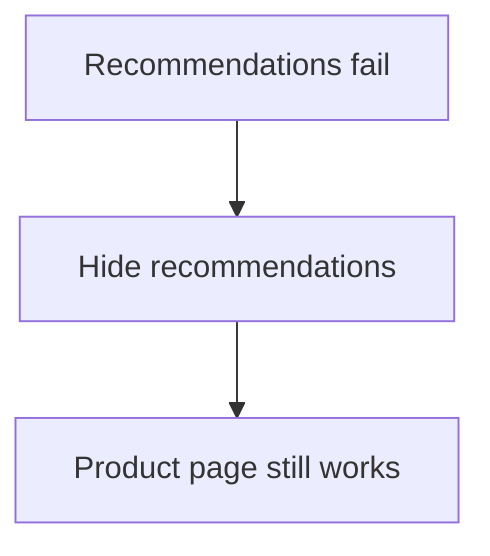

The system has lost one capability, but preserved the main purpose of the page.

---

## 3. Essential vs Optional Functionality

Graceful degradation starts by deciding what the system must preserve.

Not every feature has equal importance.

| Function | Typical importance | Possible degradation behavior |
|---|---|---|
| View product details | Essential to the product page | Return an error if required product data is unavailable |
| Complete payment | Critical to a purchase | Fail safely if payment status cannot be established |
| Show recommendations | Optional | Hide the section |
| Show decorative animation | Optional | Disable the animation |
| Send a promotional email | Often non-critical to the immediate request | Queue for later delivery |
| Display course progress | Important to learners | Show the last known value only if clearly identified as potentially stale |

These classifications depend on the product and operation.

For example, email may be optional for displaying a page but essential for a workflow that requires verified email ownership.

**Importance is determined by the user journey and business rules, not by the technology used.**

---

## 4. How Graceful Degradation Works

A common flow is:

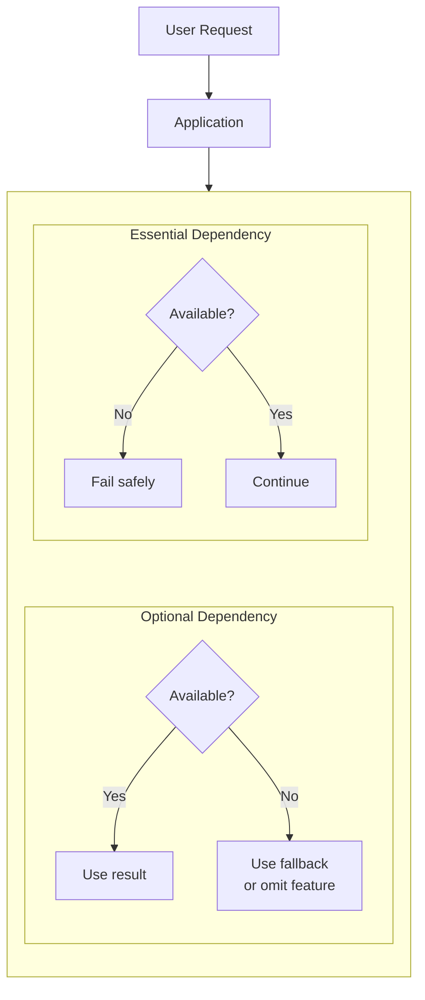

The key decision happens before an outage:

> **What should the application do if this dependency cannot provide its result?**

If that decision is left until the failure occurs, the application may have no safe fallback.

---

## 5. Common Degradation Strategies

Different failures require different responses.

| Strategy | Example | Main consideration |
|---|---|---|
| Omit an optional feature | Hide recommendations | Make the missing feature non-blocking |
| Use cached data | Show recently cached course details | Data may be stale |
| Queue work for later | Queue a welcome email | Delivery is delayed, not completed |
| Reduce quality | Serve a lower-resolution image | Preserve usability while reducing resource needs |
| Limit expensive features | Temporarily disable advanced search filters | Clearly define what remains available |
| Return a partial response | Show product details without reviews | Make missing information clear where necessary |
| Reject safely | Decline an operation when its correctness cannot be guaranteed | Do not invent a successful result |

A fallback is useful only if it preserves the intended correctness and safety of the operation.

---

## 6. Graceful Degradation vs Failover

These concepts are related but different.

### Failover

Switches work from a failed component to an alternative.

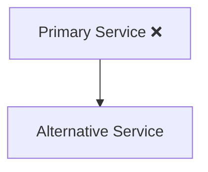

### Graceful degradation

Preserves core functionality even when some capability is lost.

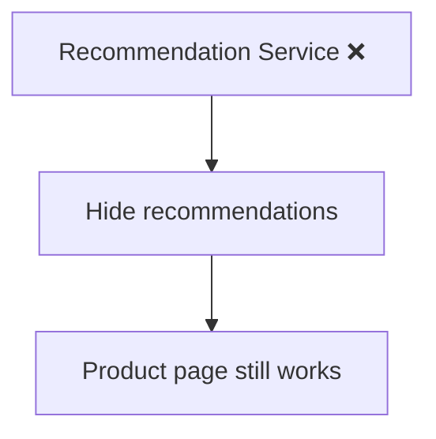

A system can use both:

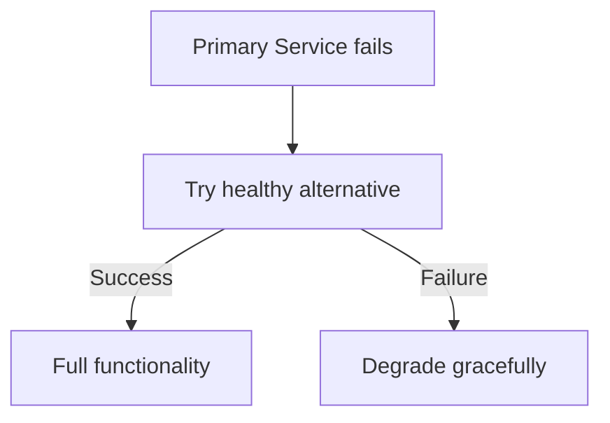

Failover tries to preserve the capability. Graceful degradation accepts that some capability may be unavailable.

---

## 7. Graceful Degradation vs Fault Tolerance

**Fault tolerance** is the ability to continue required functions despite specified faults.

**Graceful degradation** is one way to preserve useful service when full functionality is unavailable.

For example:

- Two application instances can provide redundancy and support fault tolerance.
- Hiding recommendations during a recommendation-service outage is graceful degradation.
- A system might use both to preserve essential user journeys.

Graceful degradation does not automatically mean the system is fault-tolerant in every respect. Some failures may still prevent essential operations.

---

## 8. Graceful Degradation vs High Availability

High availability focuses on keeping a service usable when needed.

Graceful degradation focuses on what the service can still do when some capabilities fail.

Imagine a course platform:

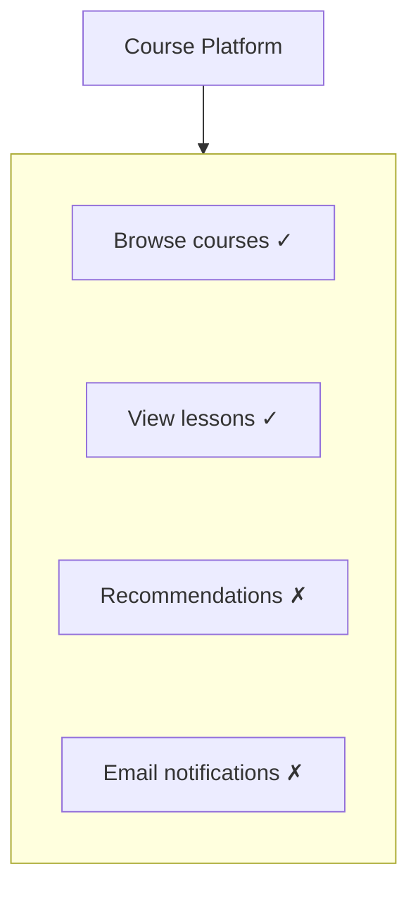

The platform may remain available for its primary purpose, despite offering fewer features.

However, if enrollment and payment are both unavailable, a platform advertised as supporting enrollment may not meet its availability requirements—even if the homepage still loads.

**Availability must be measured against defined user-visible functionality, not merely whether a server returns HTTP 200.**

---

## 9. Fallbacks Must Be Designed in Advance

A fallback is an alternative behavior used when the normal path cannot complete.

Consider course recommendations:

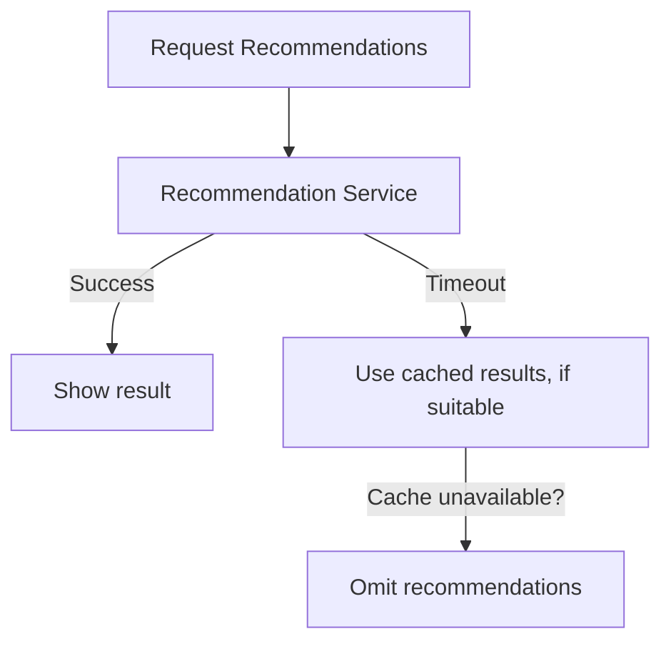

The system needs a defined response for both the normal path and fallback failures.

If the fallback depends on another service that is also unavailable, the fallback may fail too.

A robust design considers this possibility rather than assuming the fallback always works.

---

## 10. Cached Data as a Fallback

Caching can help preserve functionality during a dependency outage.

For example:

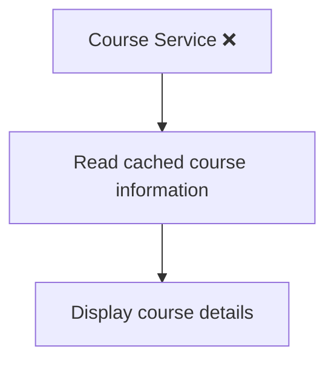

But cached data introduces a correctness question:

> **Is the old information safe to show?**

| Data | Potential fallback |
|---|---|
| Course description | Cached value may be acceptable |
| Product image | Cached image may be acceptable |
| Product stock | Must be treated carefully because it may have changed |
| Account balance | Stale data can mislead users |
| Payment status | Must not be guessed from a cache |

A fallback should not quietly present outdated data as authoritative.

For important data, the system may need to show that information is temporarily unavailable rather than risk making an incorrect decision.

---

## 11. Never Degrade Into an Unsafe Success

Some operations must not pretend to succeed when the result is unknown.

Consider a payment:

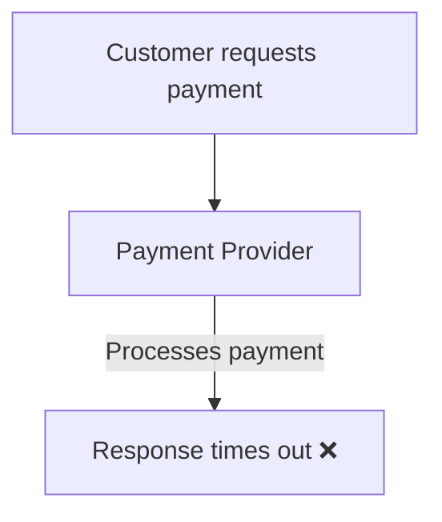

The application does not know whether the payment succeeded.

An unsafe fallback would be:

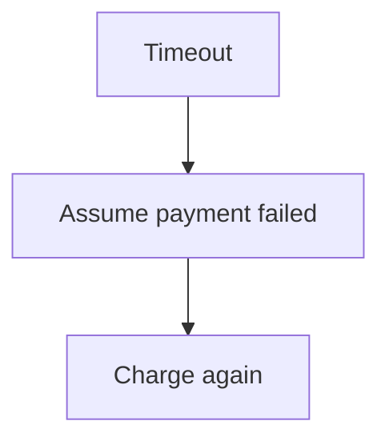

That could cause a duplicate charge.

Another unsafe response would be to tell the customer the payment definitely succeeded without confirmation.

A safer approach is to:

1. Record that the outcome is uncertain.
2. Avoid blindly repeating the charge.
3. Reconcile the operation using the provider's supported status-checking mechanism or a reliable callback.
4. Present an appropriate pending or unknown status until the outcome is established.

> **Graceful degradation must preserve correctness. A less complete but honest response is better than a fabricated success.**

---

## 12. Timeouts and Graceful Degradation

Graceful degradation often works together with timeouts.

Suppose recommendations take too long:

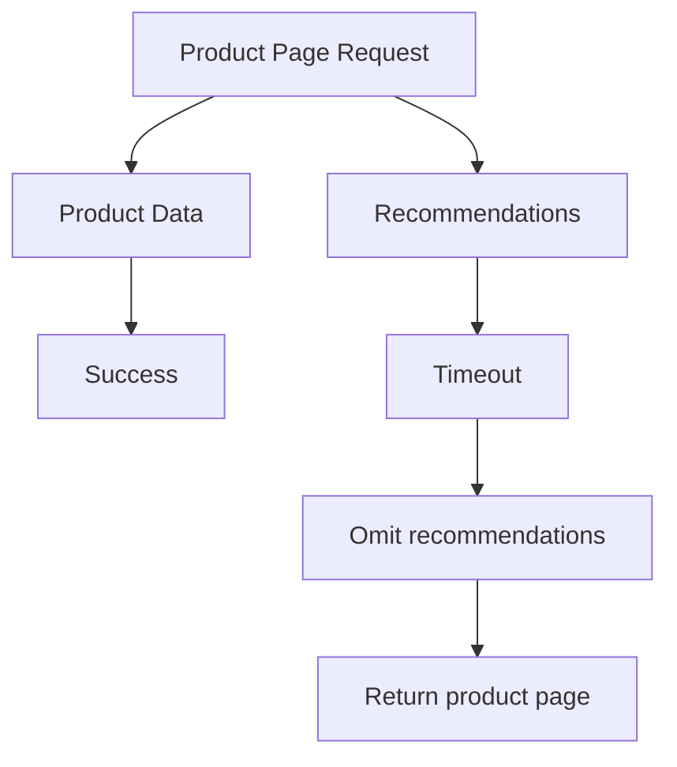

The recommendation timeout should fit within the overall request deadline.

Otherwise, the application might wait so long that the entire page request fails before the fallback can help.

Timeouts establish the waiting boundary. Graceful degradation determines what useful behavior remains after that boundary is reached.

---

## 13. Protect the Fallback Path

A fallback can become overloaded during an outage.

Suppose a recommendation service normally handles requests, but every application instance starts querying the same backup database when it fails.

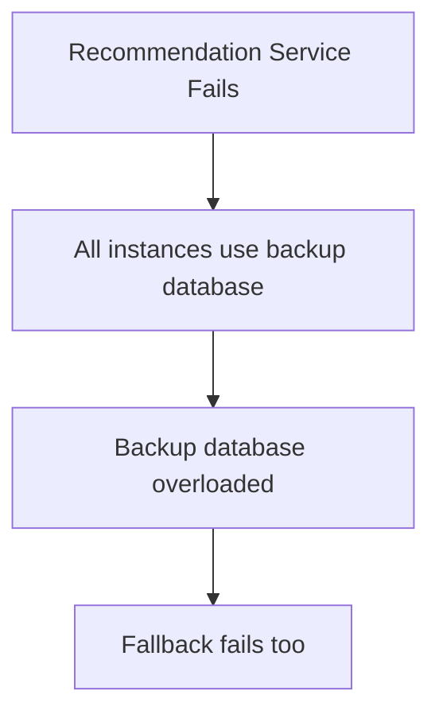

The fallback has become a new bottleneck.

Possible protections include:

- Cache suitable results.
- Limit concurrent fallback work.
- Apply timeouts.
- Avoid repeated expensive attempts.
- Use a circuit breaker where appropriate.
- Return a partial response when safe.

The important principle is:

> **A fallback must have a capacity and failure strategy of its own.**

---

## 14. Degradation Should Be Visible

Graceful degradation should not conceal important failures.

For example, a product page might omit recommendations without displaying a disruptive error. That can be reasonable because recommendations are optional.

But if course progress cannot be saved, silently showing a success message is dangerous.

Use behavior appropriate to the user impact:

- Omit optional content when its absence is harmless.
- Indicate when data is stale or incomplete.
- Show a clear error when an essential operation cannot be completed.
- Show a pending state when the outcome is uncertain.
- Log and monitor failures even when the user experience remains usable.

A system can provide a smooth experience while still reporting operational problems to its operators.

---

## 15. Graceful Degradation and Dependency Design

Consider an online learning platform:

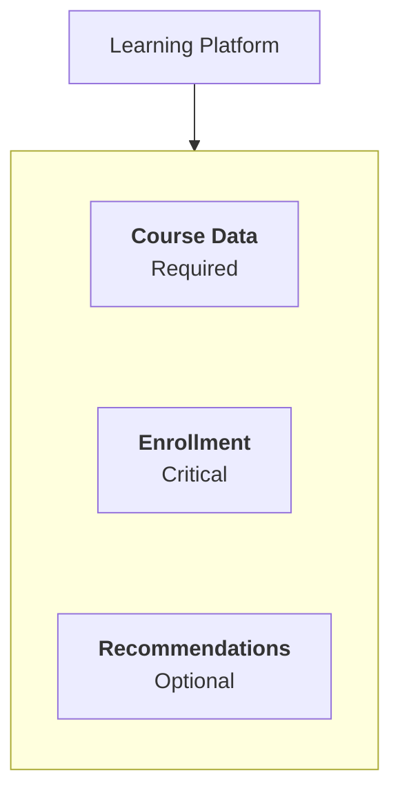

If recommendations fail, the platform can continue serving courses and enrollment.

If enrollment storage fails, the platform may still display course information but must not claim that an enrollment was successfully saved.

This distinction helps prevent optional dependencies from taking down core features.

It also prevents a system from claiming full functionality when an essential operation is broken.

---

## 16. Hands-On Exercise — Learning Platform

Your learning platform supports:

- Browsing courses.
- Enrolling in courses.
- Viewing lesson videos.
- Showing recommendations.
- Sending welcome emails.
- Saving lesson progress.

Decide what should happen when each dependency fails.

| Failure | Possible behavior | Why |
|---|---|---|
| Recommendation service unavailable | Hide recommendations or use suitable cached results | Core browsing can continue |
| Email provider unavailable | Queue the email for later delivery | Email delivery can often be asynchronous |
| Video CDN unavailable | Show a clear playback error and retry option | Do not pretend the lesson played |
| Progress database unavailable | Clearly report that progress could not be saved; retry safely where appropriate | Silent loss of progress would mislead the learner |
| Enrollment result is uncertain | Show pending status and reconcile the result | Avoid duplicate enrollment or false confirmation |
| Course catalog database unavailable | Use a safe, sufficiently fresh cache if permitted; otherwise show an error | Do not invent or silently misrepresent catalog data |

### Your design task

For each failure, answer:

1. Is the affected capability essential to the current user action?
2. Can the application provide a safe fallback?
3. Could the fallback return stale or incorrect data?
4. Could fallback traffic overload another dependency?
5. What should the user see?
6. What should the system log or measure?

The objective is to preserve useful behavior without sacrificing correctness.

---

## 17. Common Mistakes

**Mistake 1 — Treating every failure as a total outage.**

An optional feature may fail while the core application remains usable.

**Mistake 2 — Treating every failure as optional.**

Payment, enrollment, or data-saving operations may require a safe failure instead of a fallback.

**Mistake 3 — Using stale data without considering its meaning.**

Cached product descriptions and cached account balances have very different risks.

**Mistake 4 — Assuming the fallback cannot fail.**

Fallbacks consume resources and may depend on other systems.

**Mistake 5 — Hiding important failures from users.**

A smooth interface must not falsely claim that a critical operation succeeded.

**Mistake 6 — Ignoring capacity during degradation.**

Fallback paths can overload databases and other shared dependencies.

**Mistake 7 — Confusing degradation with recovery.**

The system may continue with reduced functionality while the original dependency remains broken.

---

## 18. Key Principle

> **When full functionality is impossible, preserve the most important functionality that can still be delivered correctly and safely.**

Graceful degradation requires explicit decisions about:

- What is essential.
- What is optional.
- Which fallbacks are safe.
- Which data can be stale.
- When to return an error.
- How to protect the remaining system.
- How to communicate and observe degraded behavior.

---

## 19. Quick Reference

| Concept | Meaning |
|---|---|
| Graceful degradation | Preserving essential functionality while some capabilities are unavailable |
| Fallback | Alternative behavior used when the normal path fails |
| Partial response | Returning the useful portion of a result when safe |
| Stale data | Data that may no longer reflect the current authoritative state |
| Essential dependency | A dependency required for a particular operation to be completed correctly |
| Optional dependency | A dependency whose failure need not block core functionality |
| Failover | Switching work to an alternative component |
| Fault tolerance | Continuing required functions despite specified faults |
| Degraded mode | Operating with reduced functionality or quality |
| Safe failure | Refusing or delaying an operation rather than claiming an unverified result |

---

## 20. Knowledge Check

**1. What is graceful degradation?**

Preserving essential functionality when some features or dependencies become unavailable.

**2. How is it different from failover?**

Failover switches work to an alternative component. Graceful degradation allows the system to continue with reduced functionality when full functionality cannot be maintained.

**3. Should a recommendations outage necessarily prevent a customer from viewing a product?**

No, if recommendations are optional and the product page can be served correctly without them.

**4. Why might cached data be an unsafe fallback?**

The data may be stale. Showing stale stock, account balances, or payment status as authoritative can cause incorrect decisions.

**5. What should happen when a payment outcome is uncertain?**

The system should represent the outcome as pending or unknown and reconcile it safely rather than blindly retrying or claiming success.

**6. Why can fallback logic make an outage worse?**

Many requests may shift to the same fallback dependency, overloading it and causing further failures.

**7. Does graceful degradation mean the system is fully healthy?**

No. It means useful functionality remains available despite a known limitation. The degraded state should still be monitored.

---

## Remember

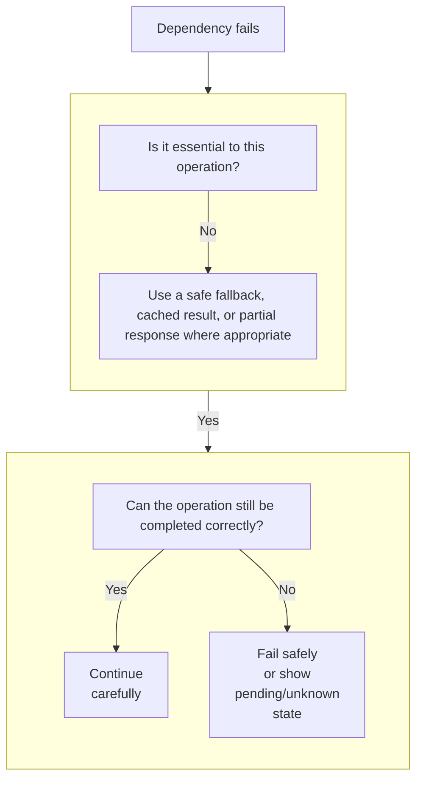

**Next: 09.08 — Backups**
