# 09.08 — Backups

## Learning Objectives

By the end of this chapter, you should be able to:

- Explain what a backup is and why systems need one.
- Distinguish backups from replication, redundancy, and high availability.
- Understand full, incremental, and differential backups.
- Design a basic backup schedule and retention policy.
- Understand why backups must be protected against corruption and deletion.
- Explain why restore testing is essential.
- Design a basic backup strategy for a real application.

---

## 1. What Is a Backup?

A **backup** is a recoverable copy of data kept so it can be restored after data loss, corruption, accidental deletion, or another damaging event.

Imagine your application stores student enrollment records in a database.

One day, a developer accidentally runs:

```sql
DELETE FROM enrollments;
```

The records disappear.

If the system has only its current database, the deleted data may be unrecoverable.

If a suitable backup exists, the team may be able to restore the lost data.

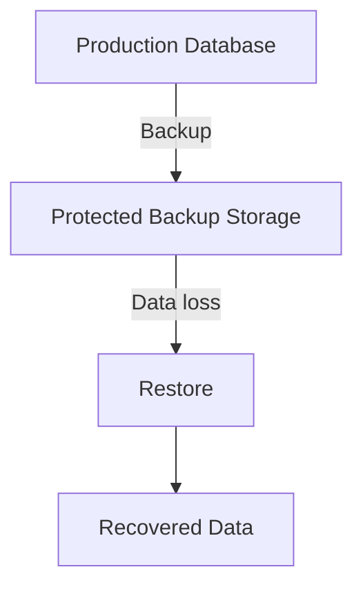

> **A backup is a recovery resource. Its purpose is to give you a way to recover data that the active system can no longer provide correctly.**

A backup does not prevent every failure. It provides an option for recovery after certain failures occur.

---

## 2. Why Do Systems Need Backups?

Data can be lost or damaged in many ways.

| Incident | Example |
|---|---|
| Human error | An administrator deletes the wrong table |
| Application bug | A faulty deployment overwrites valid records |
| Data corruption | Stored data becomes unusable |
| Ransomware | An attacker encrypts production data |
| Infrastructure failure | Storage becomes unavailable or damaged |
| Malicious activity | Someone intentionally deletes records |
| Incorrect migration | A schema or data migration damages existing information |
| Account compromise | An attacker deletes both production data and accessible recovery copies |

Different incidents require different recovery methods.

For example, replacing a failed disk may restore infrastructure, but it will not recover records that an application accidentally deleted yesterday.

Backups protect against a different class of problem than ordinary availability mechanisms.

---

## 3. Backup vs Redundancy vs Replication

These concepts are related, but they solve different problems.

| Concept | Primary purpose | Limitation |
|---|---|---|
| **Redundancy** | Provide alternative components or resources | Both components can share a failure |
| **Replication** | Maintain copies of data across systems | Damaging changes may propagate to replicas |
| **Backup** | Preserve recoverable historical data | Recovery may take time |
| **Failover** | Switch work to an alternative component | Does not necessarily recover deleted or corrupted data |

Consider an application with a primary database and a replica.

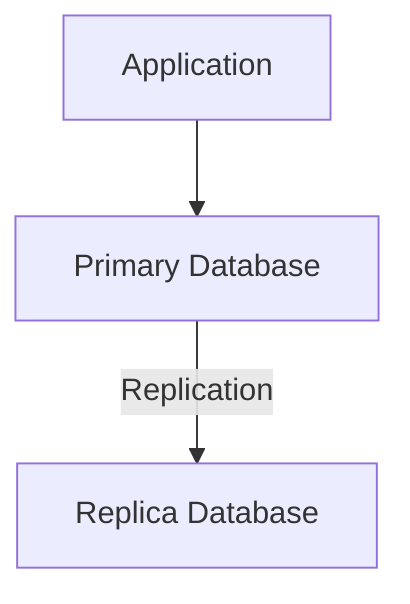

Now suppose the application accidentally deletes all enrollment records.

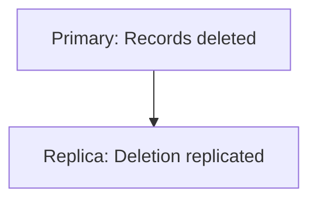

The replica may faithfully reproduce the damage.

A separate backup from before the incident may still contain the original records.

> **Replication helps maintain copies of current data. Backups help recover earlier valid data states.**

A resilient system often needs both.

---

## 4. What Can You Back Up?

Backups are not limited to database tables.

A real application may need to protect several kinds of information.

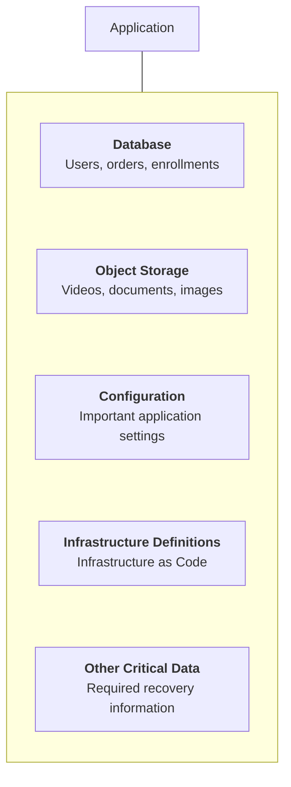

Not everything requires the same backup strategy.

For example:

- A database may need transaction-consistent backups and point-in-time recovery.
- Uploaded documents may need versioning or independent copies.
- Infrastructure definitions may already be stored in version control, but their required state and dependencies still need protection.
- Secrets need secure recovery and rotation procedures; they should not simply be copied into an ordinary backup without appropriate protection.

Start by identifying what must be recovered, not by blindly backing up every resource.

---

## 5. Full Backup

A **full backup** copies the complete selected dataset at the time of the backup.

For example:

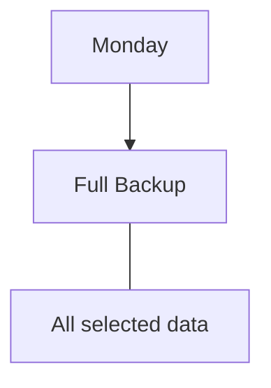

### Advantages

- Provides a straightforward recovery starting point.
- Does not require combining multiple earlier incremental backups.
- Can simplify restoration.

### Trade-offs

- May take longer to create.
- Can consume significant storage.
- Repeated full backups may transfer large amounts of unchanged data.

A full backup is not necessarily a copy of every resource in the entire system. Its scope depends on what the backup process includes.

---

## 6. Incremental Backup

An **incremental backup** stores changes made since the previous backup in the relevant backup chain.

Example:

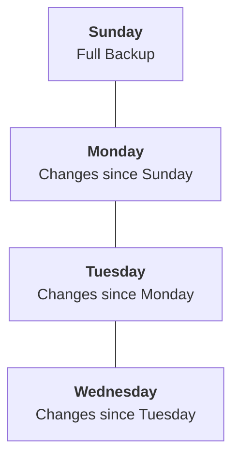

To restore Wednesday's state, a system may need:

```text
Sunday Full Backup
        +
Monday Increment
        +
Tuesday Increment
        +
Wednesday Increment
```

### Advantages

- Often requires less storage for each backup.
- Can reduce backup time and data transfer.

### Trade-offs

- Recovery can depend on several backup components.
- A missing or unusable required component can complicate recovery.
- Restoration procedures need to understand the backup chain.

The exact behavior depends on the backup product and its implementation.

---

## 7. Differential Backup

A **differential backup** stores changes made since the most recent full backup.

Example:

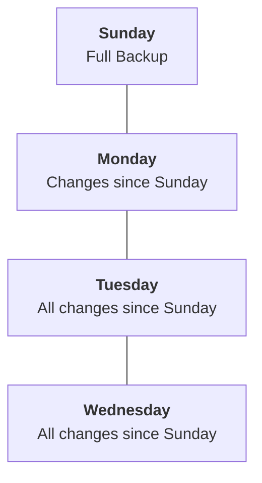

To restore Wednesday's state, the typical process requires:

```text
Sunday Full Backup
        +
Wednesday Differential Backup
```

### Advantages

- Recovery can require fewer backup components than an incremental chain.
- Can simplify restoration compared with some incremental strategies.

### Trade-offs

- Differential backups can grow larger as more changes accumulate.
- They can require more storage and transfer than daily incrementals.

### Quick comparison

| Type | Captures changes since | Typical recovery inputs |
|---|---|---|
| Full | Everything in the selected scope | Full backup |
| Incremental | Previous backup | Full backup plus required incremental chain |
| Differential | Last full backup | Full backup plus latest differential |

These are common models. Specific backup systems may implement different variations.

---

## 8. Backup Frequency

How often should you back up?

It depends on how much data the business can afford to lose.

Suppose enrollment data changes continuously.

If you create a backup only once every 24 hours, a failure may destroy a day's worth of changes that cannot be recovered from that backup alone.

```text
08:00  Backup
   |
   | New enrollment records
   | New enrollment records
   | New enrollment records
   |
18:00  Database failure
```

The backup from 08:00 does not contain later changes.

More frequent backups can reduce the potential data-loss window, but frequency alone does not determine recovery capability.

Transaction logs, continuous backups, or point-in-time recovery can provide finer recovery points where supported and correctly configured.

The design question is:

> **How much recent data can the business afford to lose?**

---

## 9. Recovery Point Objective (RPO)

The **Recovery Point Objective (RPO)** describes the maximum targeted amount of data loss measured in time after a disruptive incident.

For example:

```text
Latest recoverable state: 10:00
Incident:                10:20
```

The recovery point is 20 minutes behind the incident.

If the system has an RPO of 20 minutes, this result meets that target. If its RPO is 5 minutes, it does not.

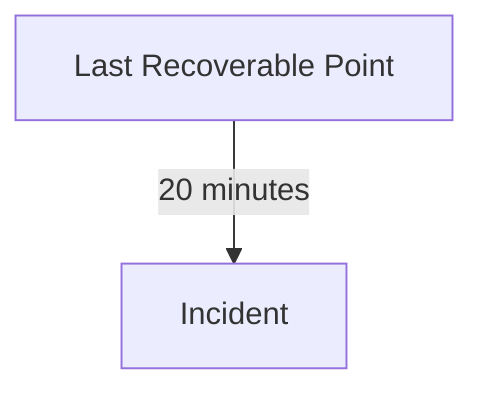

A smaller RPO generally requires a way to capture or preserve changes more frequently.

RPO is not the same as backup frequency in every architecture, because transaction logs and other recovery mechanisms may preserve changes between scheduled backups.

See **09.10 — RPO** for a deeper treatment.

---

## 10. Recovery Time Objective (RTO)

The **Recovery Time Objective (RTO)** describes the targeted time within which a system or service should be restored after a disruption.

Imagine:

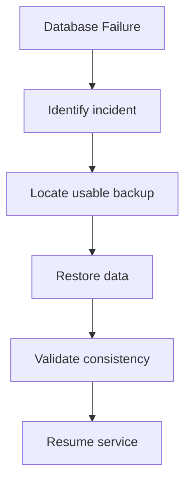

If the entire recovery takes six hours, it does not meet an RTO of one hour.

A backup may exist and still be inadequate for the required recovery time if restoration takes too long.

See **09.11 — RTO** for more detail.

**RPO asks how far back you may need to recover. RTO asks how long recovery may take.**

---

## 11. Backups Need a Retention Policy

A backup strategy must define how long backups are retained.

For example:

```text
Every day    → Daily backups
Every week   → Weekly recovery points
Every month  → Monthly recovery points
```

This is only an illustrative schedule, not a universal recommendation.

Retention matters because some incidents are discovered long after they happen.

Suppose an application has been silently corrupting records for two weeks.

If every backup older than one day has already been deleted, the latest backups may all contain corrupted data.

Longer retention can preserve earlier recovery points, but it also increases storage, management, and potentially compliance costs.

A retention policy should consider:

- Business recovery needs.
- How long corruption might remain undetected.
- Legal and regulatory requirements.
- Data sensitivity and privacy obligations.
- Storage costs.
- Deletion and retention requirements.

---

## 12. The 3-2-1 Backup Principle

A widely used backup guideline is the **3-2-1 rule**:

- Keep **3 copies** of important data, including the primary copy.
- Use **2 different storage types or media**.
- Keep **1 copy off-site**.

Conceptually:

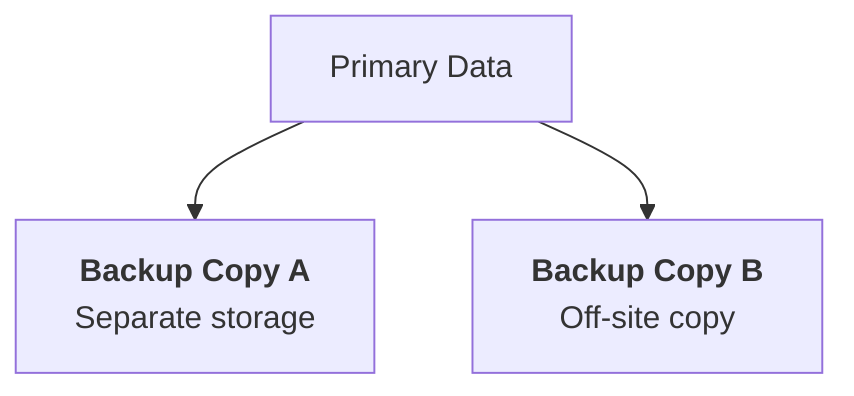

The purpose is to reduce the chance that one incident destroys every copy.

For example, keeping production data and all backups in the same storage account with identical permissions may leave them vulnerable to the same accidental deletion or account compromise.

The 3-2-1 rule is a useful baseline, not a complete security or recovery plan. Modern implementations may also emphasize immutable copies, access isolation, and tested restoration.

---

## 13. Protect Backups From Attackers

Backups can be a target.

If an attacker gains administrative access and can delete both production data and all backup copies, the backup strategy may fail exactly when it is needed.

Useful protections include:

- Separate backup access permissions from ordinary production permissions.
- Restrict who can delete backup copies.
- Encrypt sensitive backup data.
- Store copies in a separate failure domain where appropriate.
- Use immutable or write-protected backups where suitable.
- Keep recovery credentials and procedures secure.
- Monitor backup deletion, configuration changes, and failed jobs.
- Test restoration using controlled access.

A backup should not automatically inherit all the same risks as the production system.

> **A backup that an attacker can easily destroy along with production data provides weaker protection than an isolated, protected recovery copy.**

Encryption protects confidentiality, but it does not by itself prevent deletion or guarantee that a backup can be restored.

---

## 14. Backups vs Snapshots

A **snapshot** captures the state of a storage resource or system at a particular point in time, according to the platform's snapshot semantics.

A snapshot can be useful for rapid recovery or creating a consistent point-in-time copy.

However:

- A snapshot may remain in the same account or region as production.
- It may depend on the underlying storage system.
- It may not capture a consistent application state unless the process supports it.
- It may be subject to the same administrative permissions or deletion risks.

A snapshot can be part of a backup strategy, but the word *snapshot* alone does not guarantee independent, protected recovery.

| Snapshot | Independent backup |
|---|---|
| Captures a point-in-time state | Preserves recoverable data |
| May support fast rollback | May support recovery after broader incidents |
| May share production risks | Can be isolated from production risks |
| Consistency depends on implementation | Consistency also depends on backup method and scope |

Some snapshot systems provide strong backup protections. Evaluate the actual design rather than relying on the label.

---

## 15. Database Backups Must Be Consistent

Consider a system where enrollment records and payment records are stored in related tables.

A backup that captures these records at incompatible points in time may produce a state that does not make sense when restored.

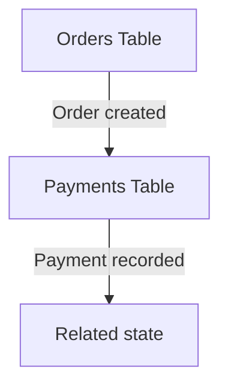

If the backup captures the order but not the corresponding payment state—or captures related systems at incompatible points—the restored application may require reconciliation.

Database backup tools may use transaction-aware mechanisms, snapshots, logs, or other approaches to preserve consistency. The correct procedure depends on the database and storage architecture.

For systems spanning multiple databases or external services, a single database backup may not capture the entire business state consistently.

Plan how related data will be reconciled after restoration.

---

## 16. Point-in-Time Recovery

Some database systems support **point-in-time recovery (PITR)**.

Instead of restoring only to the time of the last scheduled backup, the system can restore to a selected earlier point using a base backup and retained transaction logs or equivalent recovery data.

Example:

```text
09:00  Valid database state
10:00  Backup
10:15  Accidental data deletion
10:20  Incident detected
```

If the recovery system has the required backup and logs, it may be possible to restore to a point just before 10:15.

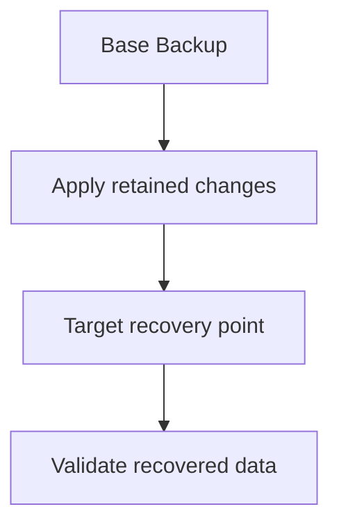

PITR can reduce data loss, but it depends on correct configuration, retained recovery data, and successful restoration procedures.

It is not automatically available just because scheduled backups exist.

---

## 17. Restoring a Backup

Creating a backup is only half the job.

The other half is restoring it.

A basic recovery procedure might look like this:

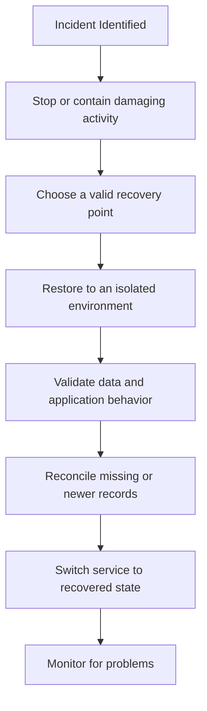

The exact steps depend on the incident.

For ransomware, for example, you should investigate and contain the compromise before reconnecting recovered systems to an environment that may still be compromised.

For accidental deletion, point-in-time recovery or restoring to a separate environment may allow the team to recover specific records without blindly replacing all current data.

**Do not assume that restoring an entire old backup is always the safest recovery method.** It can overwrite valid changes made after that backup.

---

## 18. Test Restores, Not Just Backup Jobs

A backup job reporting success proves only that the job reported success.

It does not prove that the resulting data is complete, consistent, accessible, or usable by the application.

A restore test should verify that:

- The backup can be accessed.
- The restore process completes.
- Required tables, files, and records exist.
- Data consistency checks pass.
- The application can use the restored data.
- Required credentials and dependencies are available.
- Recovery completes within the target RTO.
- The recovered point meets the target RPO.

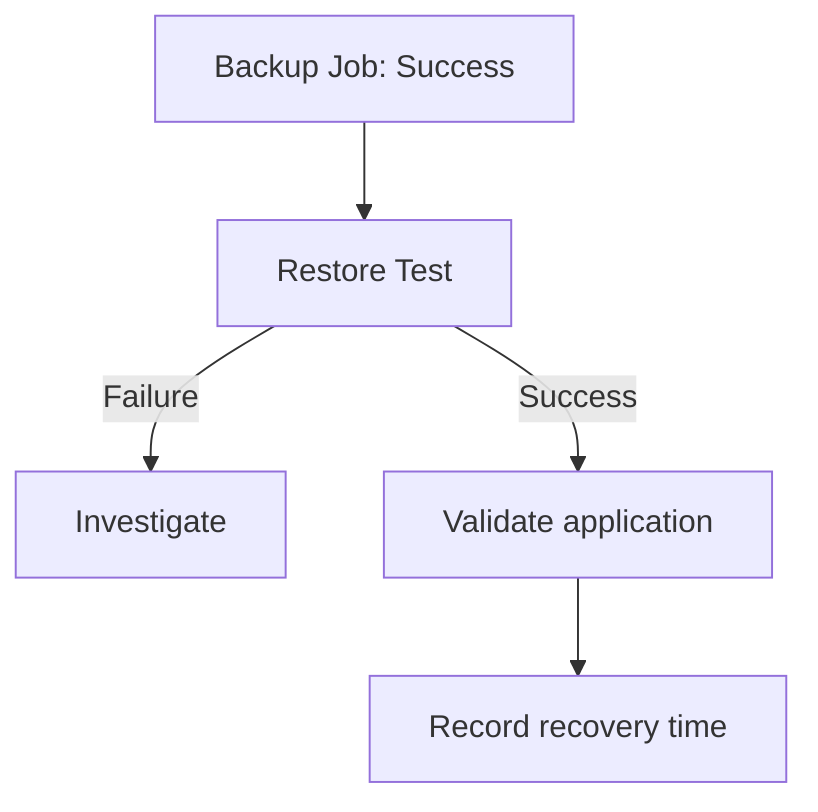

Restore tests should be performed regularly and safely, typically in an isolated environment. Their frequency and scope should reflect business risk and recovery requirements.

---

## 19. Common Backup Failure Modes

| Failure mode | Why it matters | Protection |
|---|---|---|
| Backup job silently fails | No usable recent recovery point | Monitor jobs and alert on failures |
| Backup is corrupted | Data cannot be restored correctly | Verify integrity and test restoration |
| All copies share one failure domain | One incident can destroy every copy | Separate copies and access boundaries |
| Backups are deleted too soon | Older clean recovery points disappear | Define and enforce retention |
| Encryption key is lost | Encrypted backup may become inaccessible | Protect and test key recovery |
| Restore takes too long | RTO target is missed | Test and optimize recovery procedures |
| Backup contains corrupted data | Restoration reintroduces the damage | Retain historical recovery points and validate data |
| Application dependencies are missing | Restored data alone is insufficient | Document and test the complete recovery process |

---

## 20. Hands-On Exercise — Learning Platform

Imagine Systemly's learning platform stores:

- User accounts and course enrollments in a database.
- Uploaded course materials in object storage.
- Configuration and infrastructure definitions in separate systems.

The business requirements are:

- Enrollment records must not be lost beyond the agreed RPO.
- The platform must recover within its agreed RTO.
- Backups must survive accidental deletion of production resources.
- Restoration must be tested before a real incident.

Design a basic strategy.

### Step 1 — Identify recovery scope

| Resource | What needs protection? |
|---|---|
| Database | Accounts, enrollments, course records, transactions |
| Object storage | Uploaded files and other required assets |
| Configuration | Critical application settings |
| Infrastructure | Reproducible infrastructure definitions and recovery dependencies |

### Step 2 — Define recovery requirements

Write down:

```text
RPO = How much recent data loss is acceptable?
RTO = How long can recovery take?
Retention = How far back must recovery points be available?
```

Do not choose values arbitrarily. Derive them from the business requirements.

### Step 3 — Choose protection mechanisms

Consider:

- Scheduled backups.
- Transaction logs or PITR where supported.
- Independent copies.
- Restricted backup deletion permissions.
- Appropriate encryption.
- Retention policies.
- Restore testing.

### Step 4 — Simulate an incident

Suppose an administrator accidentally deletes enrollment records at 14:00.

Answer:

1. Which recovery point would you choose?
2. Could you recover only the affected data?
3. How would you validate the restored enrollments?
4. What happens to valid enrollments created after the selected recovery point?
5. How would you prove that the RPO and RTO were met?

The exercise is complete when you can explain the recovery procedure—not merely name a backup service.

---

## 21. Common Mistakes

**Mistake 1 — Assuming replication replaces backups.**

Replication may copy accidental deletions and corruption.

**Mistake 2 — Assuming a successful backup job guarantees recovery.**

The backup may be incomplete, inaccessible, or impossible to restore within the required time.

**Mistake 3 — Keeping every backup beside production.**

Shared accounts, permissions, or failure domains can expose every copy to the same incident.

**Mistake 4 — Ignoring retention.**

If corruption is discovered late, recent backups may already contain the damaged data.

**Mistake 5 — Ignoring recovery time.**

A very large backup may take too long to restore for the business requirement.

**Mistake 6 — Restoring blindly over production.**

An old backup can overwrite valid data created after the recovery point.

**Mistake 7 — Backing up data without its recovery dependencies.**

Credentials, configuration, encryption keys, and procedures may also be required.

---

## 22. Key Principle

> **A backup strategy is complete only when the required data can be restored correctly, securely, and within the required recovery objectives.**

A reliable backup strategy defines:

- What must be protected.
- How often changes are captured.
- How long recovery points are retained.
- Where independent copies are stored.
- Who can access or delete them.
- How restoration works.
- How recovery is tested.

---

## 23. Quick Reference

| Concept | Meaning |
|---|---|
| Backup | Recoverable copy of selected data |
| Full backup | Copy of the complete selected dataset |
| Incremental backup | Changes since the previous backup |
| Differential backup | Changes since the last full backup |
| Retention | How long recovery points are kept |
| Snapshot | Point-in-time state of a resource or system |
| Point-in-time recovery | Restoring to a selected earlier point using available recovery data |
| RPO | Target for the maximum acceptable data-loss window |
| RTO | Target for the time required to restore service |
| Immutable backup | Backup protected against alteration or deletion for a defined period or under defined controls |
| Restore test | Verification that backed-up data can actually be recovered and used |
| Recovery point | The state of data to which a system is restored |

---

## 24. Knowledge Check

**1. Why do systems need backups if they already have database replicas?**

Replicas can reproduce deletions and corruption. Backups can preserve earlier valid recovery points.

**2. What is the difference between incremental and differential backups?**

Incremental backups capture changes since the previous backup; differential backups capture changes since the last full backup.

**3. What does RPO describe?**

The target for how much recent data loss, measured in time, can be accepted.

**4. What does RTO describe?**

The target for how long recovery can take.

**5. Why is a snapshot not automatically a complete backup strategy?**

It may share production failure risks, lack required application consistency, or be insufficient for broader recovery needs.

**6. Why should restore tests be performed?**

To verify that data is accessible, consistent, usable, and recoverable within the required time.

**7. Why can retention be important when corruption is discovered late?**

Older recovery points may be the only copies of valid data from before the corruption occurred.

---

## Remember

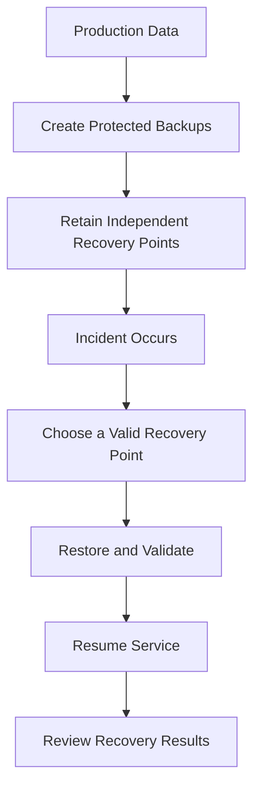

**Next: 09.09 — Disaster Recovery**
