# 09.09 — Disaster Recovery

## Learning Objectives

By the end of this chapter, you should be able to:

- Explain what disaster recovery (DR) means.
- Distinguish disaster recovery from backups, high availability, and failover.
- Identify common disaster scenarios and their recovery requirements.
- Understand the role of recovery sites, infrastructure, data, and procedures.
- Connect disaster recovery planning to RPO and RTO.
- Understand recovery strategies and their cost trade-offs.
- Design and test a basic disaster recovery plan.

---

## 1. What Is Disaster Recovery?

Imagine an online learning platform running on cloud infrastructure.

One day, a major regional outage makes its application servers, database, and supporting services unavailable.

The team cannot simply restart one application instance. It must recover the service using available infrastructure, data, configuration, and operational procedures.

That is the purpose of **disaster recovery (DR)**.

> **Disaster recovery is the planned process of restoring systems, data, and essential business operations after a major disruptive incident.**

A disaster may involve:

- A cloud region becoming unavailable.
- Large-scale data corruption.
- Ransomware or account compromise.
- Accidental deletion of critical resources.
- A major deployment or configuration failure.
- Physical damage to infrastructure.
- A failure that affects an entire business-critical environment.

The goal is to restore the service to an acceptable operating state within defined recovery objectives.

---

## 2. Backup vs Disaster Recovery

These concepts work together, but they are not interchangeable.

| Backup | Disaster recovery |
|---|---|
| Preserves recoverable copies of data | Restores systems and business operations |
| Focuses on recovery points and retained data | Covers infrastructure, data, configuration, dependencies, people, and procedures |
| May be used to recover a deleted record | May involve rebuilding an entire application environment |
| Must be restorable | Must coordinate a complete recovery process |

Consider this scenario:

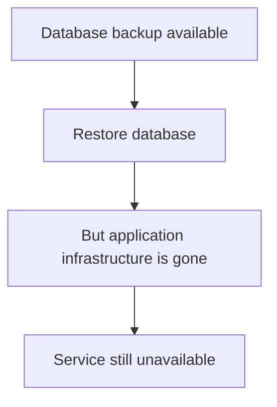

The database may be recoverable, but the application also needs compute, networking, configuration, permissions, and other dependencies.

A complete recovery plan considers all the components required to resume service.

---

## 3. Disaster Recovery vs High Availability

**High availability (HA)** tries to keep a service usable when individual components fail.

**Disaster recovery** prepares the system to recover after a disruptive incident, potentially involving a large part of the infrastructure.

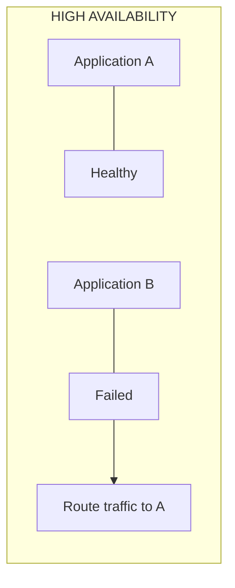

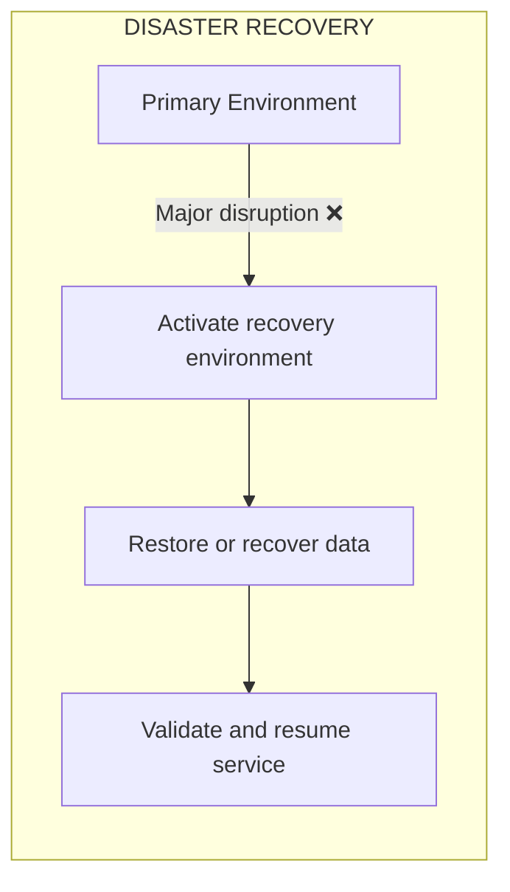

High availability and disaster recovery can overlap. The distinction is the scope of the incident and the recovery objective.

A second application instance in the same failure domain may help with a process crash but may not protect against a regional outage.

A disaster recovery environment may also take longer to activate than an ordinary high-availability failover.

---

## 4. Common Disaster Scenarios

Different incidents require different recovery actions.

| Scenario | Example | Possible recovery approach |
|---|---|---|
| Application infrastructure failure | A deployment breaks the production environment | Roll back or rebuild infrastructure |
| Database corruption | A faulty script damages records | Restore a valid backup or use point-in-time recovery |
| Cloud region outage | The primary region becomes unavailable | Activate a prepared environment in another region, if required |
| Ransomware | Production data and accessible backups are compromised | Contain the attack and recover from protected, verified copies |
| Accidental deletion | Critical resources are deleted | Recreate resources and restore required data |
| Configuration failure | Incorrect network or access rules block the service | Restore known-good configuration and validate access |
| Loss of a critical external dependency | A provider becomes unavailable | Use an alternative where feasible or operate in a safe degraded mode |

There is no single recovery procedure for every disaster.

The first step is identifying what failed, what remains trustworthy, and what the business needs restored first.

---

## 5. The Main Components of Disaster Recovery

A practical DR plan typically addresses six areas.

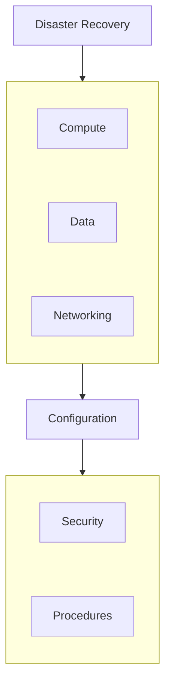

### Compute

How will the application run if the primary environment is unavailable?

### Data

Where are the recoverable database records, files, and other required data?

### Networking

How will users and services reach the recovered environment?

### Configuration

Can the required infrastructure and application settings be recreated?

### Security

Are identities, permissions, encryption keys, and recovery credentials available and protected?

### Procedures

Who declares the incident, makes recovery decisions, validates the recovered system, and communicates its status?

A recovery plan that covers only compute or only data is incomplete.

---

## 6. Disaster Recovery Strategies

Organizations can prepare recovery environments in different ways.

The following are common strategy categories. Exact definitions and terminology vary between organizations and providers.

### Strategy A — Backup and Restore

The organization retains backups and rebuilds the environment when needed.

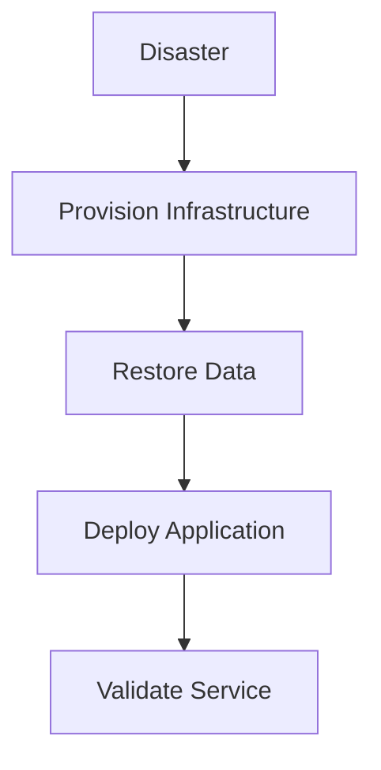

**Advantages**
- Often lower ongoing infrastructure cost.
- Straightforward for systems that can tolerate longer recovery.

**Trade-offs**
- Infrastructure must be recreated.
- Large datasets can take time to restore.
- Configuration and dependency mistakes can delay recovery.

### Strategy B — Pilot Light

A minimal recovery environment is maintained with essential components prepared. Additional capacity and services are activated during a disaster.

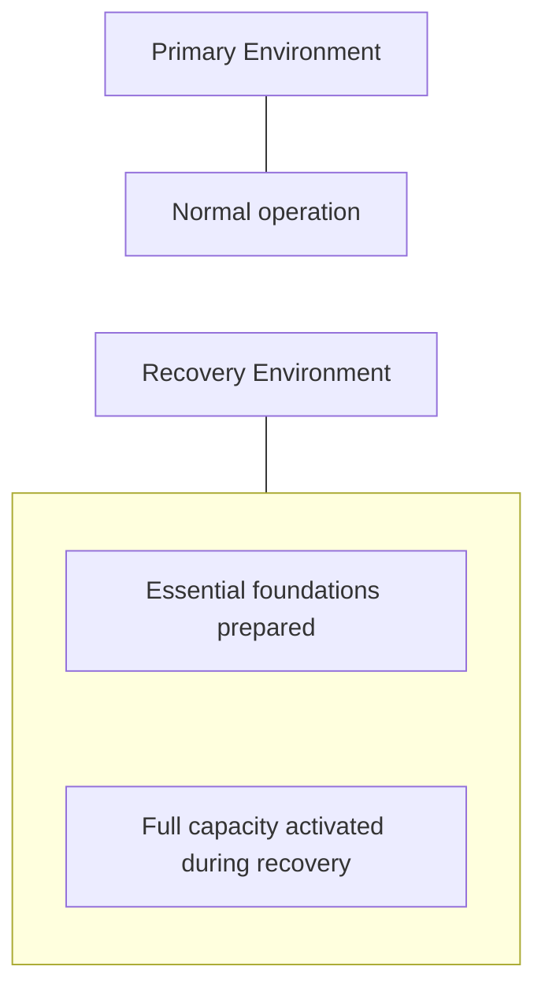

**Advantages**
- Less infrastructure may need to run continuously than in a fully duplicated environment.
- Some foundational recovery work is already prepared.

**Trade-offs**
- Activation and scaling are still required.
- Dependencies and recovery steps must be tested.

### Strategy C — Warm Standby

A smaller but functioning version of the system runs in the recovery environment.

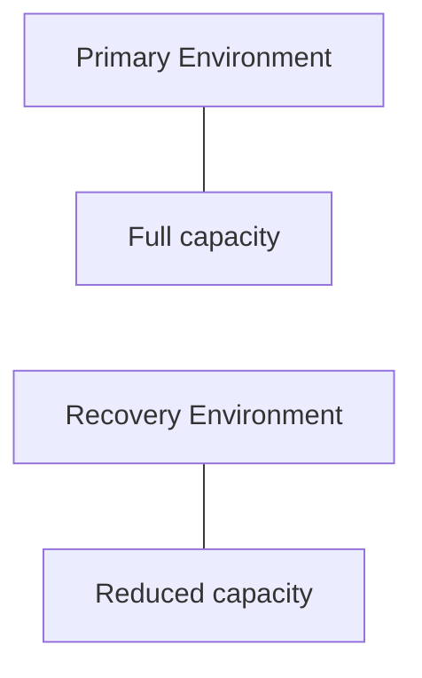

During a disaster, the recovery environment is scaled up and traffic is redirected.

**Advantages**
- More components are already running.
- Recovery can be faster than rebuilding everything from scratch.

**Trade-offs**
- Ongoing infrastructure cost.
- Data synchronization and scaling still require careful handling.

### Strategy D — Hot Standby or Active-Active

A second environment is already running and may be able to take over quickly. In an active-active design, multiple environments serve traffic concurrently.

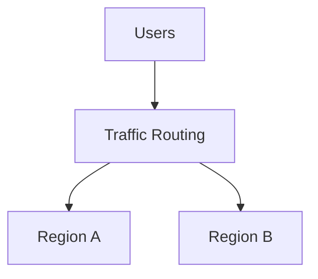

**Advantages**
- Potentially faster recovery.
- Some active-active designs continue serving traffic while one environment fails.

**Trade-offs**
- Higher infrastructure and operational cost.
- Data consistency, traffic routing, and conflict handling can be more complicated.
- Two running environments do not guarantee that both have correct or current data.

Terminology such as *hot standby* and *active-active* can vary. Focus on how much is already running, how quickly it can serve traffic, and what data it contains.

---

## 7. Comparing Recovery Strategies

| Strategy | Relative ongoing cost | Typical recovery effort | Operational complexity |
|---|---|---|---|
| Backup and restore | Lower | Rebuild and restore | Lower to moderate |
| Pilot light | Low to moderate | Activate and scale prepared components | Moderate |
| Warm standby | Moderate to high | Scale and redirect traffic | Moderate to high |
| Hot standby / active-active | High | Switch or rebalance traffic, depending on design | High |

These are relative tendencies, not guaranteed prices or recovery times.

Actual cost and recovery speed depend on:

- Data volume.
- Infrastructure provisioning time.
- Replication behavior.
- Network and DNS changes.
- Automation.
- Validation requirements.
- Team readiness.
- Required capacity.

**Choose a strategy from the recovery requirements, not from the assumption that the most elaborate strategy is always best.**

---

## 8. RPO and RTO Define Recovery Requirements

Two concepts guide disaster recovery planning.

### Recovery Point Objective (RPO)

RPO defines the target for how much data loss, measured in time, is acceptable.

Example:

```text
Incident occurs:          14:00
Latest recoverable state: 13:50

Potential recovery gap:   10 minutes
```

If the agreed RPO is five minutes, this recovery point is insufficient.

### Recovery Time Objective (RTO)

RTO defines the target time within which service should be restored after a disruption.

```text
14:00  Incident begins
14:10  Recovery environment ready
14:20  Data restored
14:30  Validation completed
14:35  Service restored
```

If the RTO is 30 minutes, this recovery takes too long.

| Requirement | Question |
|---|---|
| RPO | How much recent data can we afford to lose? |
| RTO | How long can the service remain unavailable? |

A strategy that meets RTO but loses too much data is not sufficient. Neither is a strategy that preserves data but takes too long to restore service.

See **09.10 — RPO** and **09.11 — RTO** for dedicated chapters.

---

## 9. Disaster Recovery Is More Than Data Replication

Suppose a database replicates data to another region.

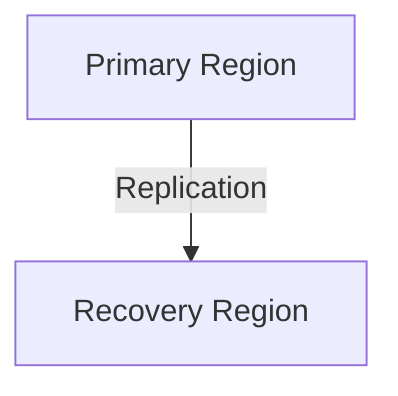

This improves the recovery options, but replication alone is not a complete DR plan.

Consider the following questions:

- Is the recovery environment capable of running the application?
- Are network routes and access permissions configured?
- Are secrets and encryption keys available?
- Is the replicated data sufficiently current?
- Can the team redirect traffic?
- Can the service handle the expected load?
- How will the recovered system be validated?

Replication also may propagate unwanted changes or corruption. A backup or point-in-time recovery mechanism may still be necessary.

> **A copy of the data is not the same as a functioning recovery environment.**

---

## 10. Infrastructure as Code Helps Recovery

Suppose the production environment contains:

- Application instances.
- Load balancers.
- Networking rules.
- Database resources.
- Storage.
- Permissions.

Rebuilding these resources manually during an incident can be slow and error-prone.

Infrastructure as Code (IaC) can define the required environment in version-controlled files.

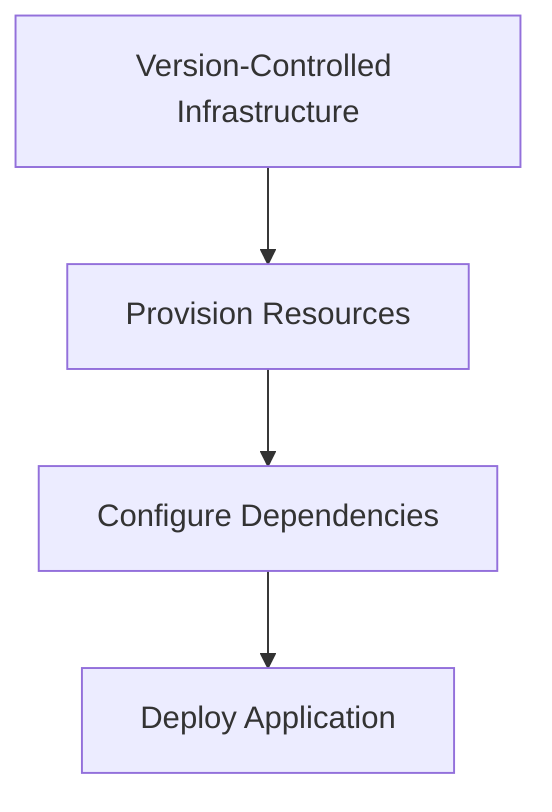

IaC can make environment reconstruction more repeatable.

However, it does not automatically recover database contents, secrets, external service state, or every manual operational dependency.

Recovery procedures should identify which resources are recreated, which are restored, and which must be obtained or validated separately.

---

## 11. Traffic Switching and Validation

Even after a recovery environment is ready, users must reach it.

A simplified recovery sequence is:

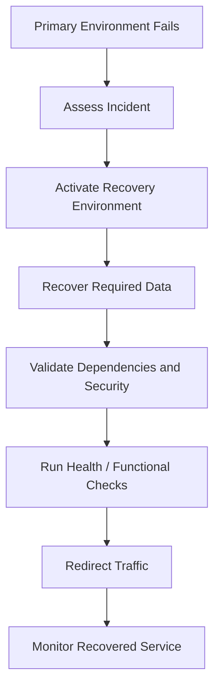

Depending on the architecture, traffic switching may involve a load balancer, DNS, routing, or another traffic-management mechanism.

DNS changes may take time to be observed because of caching and configured TTLs. Other routing methods have their own behavior.

Do not assume that changing a DNS record instantly moves every user to the recovery environment.

### What should be validated?

At minimum, verify:

- Application instances are running.
- Required data is accessible and sufficiently current.
- Authentication and authorization work.
- Essential user journeys succeed.
- Dependencies are reachable.
- Capacity is sufficient.
- Monitoring and alerting are active.

A page returning HTTP 200 does not prove that enrollment, payment, or data-saving operations work correctly.

---

## 12. Disaster Recovery and Security

A disaster may be caused by a security incident rather than an infrastructure failure.

For example, an attacker could compromise production credentials and delete accessible backups.

Recovery must not simply reconnect restored systems to an environment that remains compromised.

A security-aware recovery process may need to:

1. Contain the incident.
2. Identify trusted recovery points.
3. Preserve evidence where required.
4. Restore from protected copies.
5. Revoke or rotate compromised credentials.
6. Rebuild affected infrastructure from trusted definitions.
7. Validate security controls before reopening access.
8. Monitor for signs of reinfection or renewed compromise.

Recovery speed matters, but restoring an insecure environment can repeat the disaster.

---

## 13. Common Disaster Recovery Mistakes

| Mistake | Consequence | Better approach |
|---|---|---|
| Treating backups as the complete DR plan | Data exists, but the application cannot run | Plan for the full service and its dependencies |
| Never testing recovery | Actual restoration time and correctness remain unknown | Perform controlled recovery exercises |
| Assuming replication prevents data loss | Corruption or deletion may propagate | Maintain suitable independent recovery points |
| Rebuilding everything manually | Recovery becomes slow and error-prone | Automate repeatable infrastructure steps |
| Ignoring security recovery | Compromised access can damage the recovered environment | Include credential recovery and incident containment |
| Switching traffic before validation | Users reach a broken or inconsistent service | Validate essential operations before reopening |
| Underestimating recovery capacity | The recovered service overloads under real traffic | Plan and test capacity for the recovery environment |
| Assuming failover and DR are identical | Large-scale recovery requirements are missed | Design for the scope of each failure scenario |

---

## 14. Hands-On Exercise — Learning Platform

Imagine the learning platform runs in a primary cloud region.

It uses:

- An application service.
- A relational database.
- Object storage for course materials.
- A managed cache.
- A message queue for notifications.
- Infrastructure defined as code.

The primary region becomes unavailable.

### Step 1 — Identify what must be recovered

| Component | Recovery consideration |
|---|---|
| Application | Recreate or activate compute and deploy the correct version |
| Database | Recover data to an acceptable point |
| Course materials | Ensure required objects are accessible in the recovery environment |
| Cache | Usually rebuildable if it contains only disposable cached data |
| Message queue | Determine which pending messages must be preserved or replayed |
| Configuration | Recreate networking and application configuration |
| Secrets and permissions | Ensure required access is available securely |

### Step 2 — Choose a recovery strategy

Choose among backup and restore, pilot light, warm standby, or hot standby/active-active.

Explain your choice using:

- Required RTO.
- Required RPO.
- Data volume.
- Infrastructure cost.
- Operational complexity.

### Step 3 — Define the recovery sequence

Write down the order in which you would:

1. Declare the incident and select the recovery environment.
2. Provision or activate required infrastructure.
3. Restore or validate data.
4. Verify permissions, secrets, and dependencies.
5. Test essential user journeys.
6. Redirect traffic.
7. Monitor the recovered system.

### Step 4 — Define success

A successful recovery is not simply “the server started.”

Define measurable conditions, such as:

- Students can authenticate.
- Course data is available.
- Existing enrollments are correct.
- Required user operations work.
- Recovery completed within the RTO.
- Data loss stayed within the RPO.

**Exercise outcome:** A recovery plan that can be executed and tested—not just a diagram of a second region.

---

## 15. Disaster Recovery Checklist

- [ ] Critical services and data are identified.
- [ ] RPO and RTO requirements are documented.
- [ ] Recovery strategy is selected based on business needs.
- [ ] Required backups and independent recovery copies exist.
- [ ] Data replication and consistency assumptions are understood.
- [ ] Infrastructure can be recreated or activated.
- [ ] Configuration, credentials, and permissions can be recovered securely.
- [ ] Network and traffic-switching procedures are documented.
- [ ] Recovery capacity is sufficient for the expected workload.
- [ ] Essential business operations have validation tests.
- [ ] Roles and decision-making responsibilities are clear.
- [ ] Recovery exercises are performed and results recorded.
- [ ] Lessons from each exercise are incorporated into the plan.

---

## 16. Key Principle

> **Disaster recovery is the coordinated restoration of a working service after a major disruption—not merely the restoration of data.**

A good DR strategy connects:

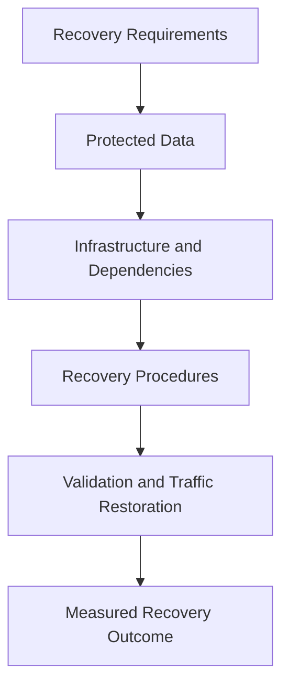

The strategy should be proportionate to the business impact of an outage and the cost of recovery.

---

## 17. Quick Reference

| Concept | Meaning |
|---|---|
| Disaster Recovery (DR) | Planned restoration of systems and operations after a major disruption |
| Backup and Restore | Rebuilding or restoring service using retained recovery data |
| Pilot Light | Minimal prepared recovery environment with components activated as needed |
| Warm Standby | Reduced-capacity environment already running |
| Hot Standby | Prepared environment intended for rapid activation or takeover |
| Active-Active | Multiple environments serving traffic concurrently |
| RPO | Target for maximum acceptable data loss |
| RTO | Target for time to restore service |
| Recovery Environment | Infrastructure used to restore or resume service |
| Recovery Exercise | Test of recovery procedures under controlled conditions |
| Failover | Switching work to an alternative component or environment |
| Infrastructure as Code | Version-controlled definitions used to create and manage infrastructure |

---

## 18. Knowledge Check

**1. What is disaster recovery?**

The planned process of restoring systems, data, and essential operations after a major disruptive incident.

**2. How is DR different from backups?**

Backups preserve recoverable data. DR coordinates the restoration of the complete service, including infrastructure, dependencies, configuration, and procedures.

**3. How is DR different from high availability?**

High availability focuses on maintaining service through component failures. DR addresses recovery from larger disruptions that may affect a substantial part of the environment.

**4. Why is replication alone insufficient?**

It may replicate corruption or deletion, and it does not guarantee that a functioning application environment is available.

**5. What is the difference between RPO and RTO?**

RPO defines the acceptable data-loss window; RTO defines the target time for restoring service.

**6. Why is Infrastructure as Code useful in DR?**

It makes rebuilding infrastructure more repeatable, but it does not replace data backups or the need to recover secrets and external state.

**7. How do you know a DR plan works?**

By executing controlled recovery exercises, validating essential operations, and measuring actual recovery time and data loss.

---

## Remember

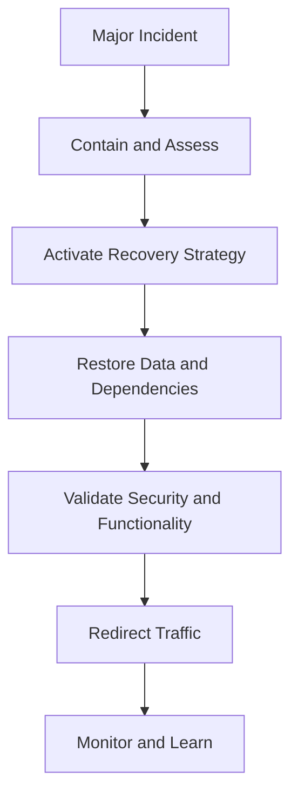

**Next: 09.10 — RPO**
