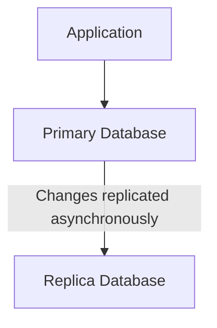
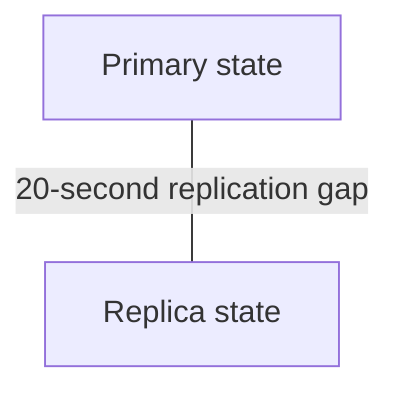
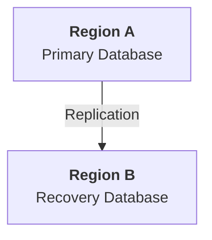
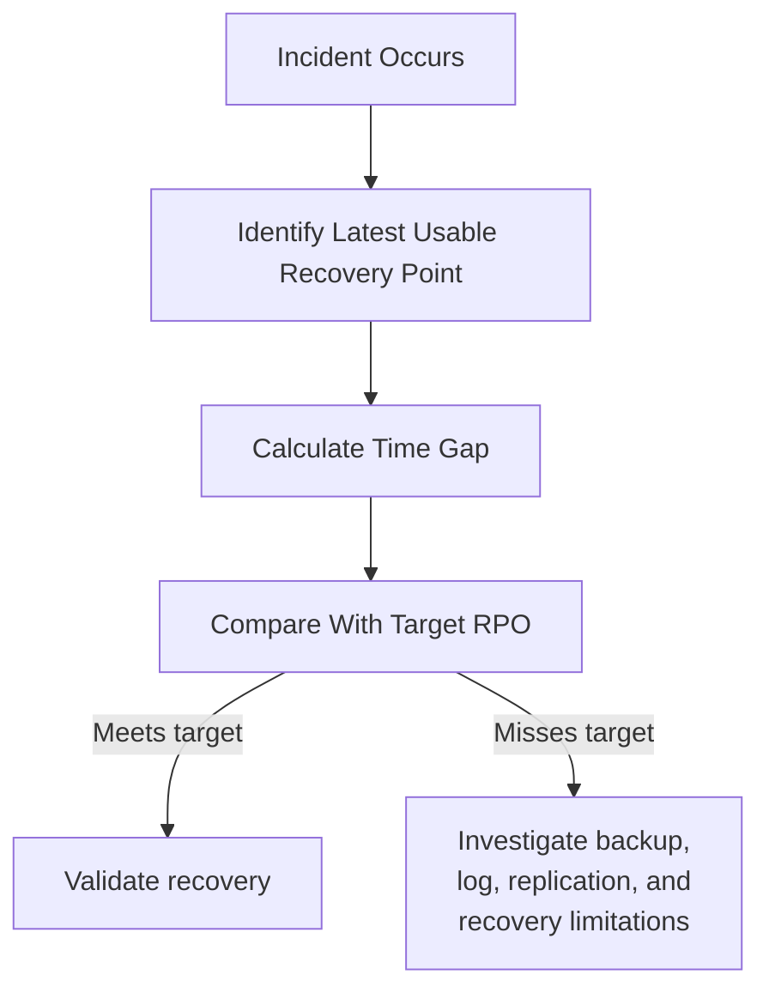

# 09.10 — Recovery Point Objective (RPO)

## Learning Objectives

By the end of this chapter, you should be able to:

- Explain what Recovery Point Objective (RPO) means.
- Calculate the potential data-loss window after an incident.
- Distinguish RPO from Recovery Time Objective (RTO).
- Understand how backups and replication affect recoverable data.
- Choose an RPO based on business requirements.
- Recognize why replication does not always guarantee zero data loss.
- Apply RPO to a realistic application.

---

## 1. What Is RPO?

**Recovery Point Objective (RPO)** defines the target for the maximum acceptable amount of data loss, measured in time, after a disruptive incident.

In simple words:

> **How far back can we afford to recover our data?**

Imagine a learning platform stores student enrollments in a database.

The database fails at 14:00, but the latest usable recovery point is 13:50.

```text
13:50                     14:00
  |-------------------------|
 Latest recoverable        Incident
 state
```

The recovery point is 10 minutes behind the incident.

If the business has an RPO of 10 minutes, this recovery point meets the target. If its RPO is 2 minutes, it does not.

The exact data loss depends on which changes occurred during that interval and whether other recovery mechanisms preserved them.

---

## 2. RPO Is About Data Loss, Not Downtime

RPO answers:

> **How much recent data can we afford to lose?**

RTO answers:

> **How long can the service remain unavailable?**

Consider this timeline:

```text
14:00  Incident begins
14:05  Latest recoverable data point
14:30  Service restored
```

Potential data-loss window:

```text
14:00 - 14:05 = 5 minutes
```

Recovery duration:

```text
14:00 - 14:30 = 30 minutes
```

So the observed data-loss window is 5 minutes, while the recovery takes 30 minutes.

| Objective | What it measures |
|---|---|
| **RPO** | Acceptable data-loss window |
| **RTO** | Target time to restore service |

A system can meet its RPO but miss its RTO. It can also restore service quickly while losing too much data.

Both objectives matter.

---

## 3. RPO as a Timeline

Suppose a database receives changes continuously.

```text
10:00  Backup
10:05  New enrollments
10:10  Course progress updates
10:15  More enrollments
10:20  Database failure
```

If the latest usable recovery point is 10:00, the recovery process may lose changes made during the following 20 minutes.

```text
Latest recoverable point             Incident
          |                              |
          v                              v
        10:00 ------------------------- 10:20
                    20 minutes
```

If the target RPO is 5 minutes, this backup alone is insufficient for that incident.

The system needs a more recent recoverable point or another mechanism that preserves changes between scheduled backups.

---

## 4. How Do We Calculate the Data-Loss Window?

For a simple incident, calculate:

$$
\text{Observed Data-Loss Window}
=
\text{Incident Time}
-
\text{Latest Recoverable Point}
$$

Example:

```text
Incident time:               16:40
Latest recoverable point:    16:32
```

Therefore:

```text
16:40 - 16:32 = 8 minutes
```

The observed data-loss window is 8 minutes.

If the target RPO is 5 minutes, the recovery point misses the target by 3 minutes.

**Important:** This calculation measures the time gap, not the exact number of lost records or transactions. Some intervals may contain little activity; others may contain thousands of changes.

---

## 5. Backups and RPO

Backup frequency influences RPO, but the two are not identical.

Imagine scheduled backups every hour:

```text
10:00  Backup
11:00  Backup
12:00  Backup
12:45  Incident
```

If the 12:00 backup is usable, the latest backup is 45 minutes behind the incident.

A one-hour backup interval can therefore produce a data-loss window of nearly one hour, depending on the timing of the incident and backup success.

```text
Backup interval: 1 hour
Potential gap:   Approaching 1 hour
```

This is a simplified model. Failed backups, backup consistency, transaction logs, and other recovery mechanisms affect the actual result.

> **A backup schedule should be designed around the required RPO—not chosen without considering how much data loss is acceptable.**

---

## 6. Different Ways to Meet an RPO

Systems can preserve recovery points through several mechanisms.

| Mechanism | How it helps | Important limitation |
|---|---|---|
| Periodic backups | Preserve earlier copies of data | Changes since the last usable backup may be lost |
| Transaction logs / point-in-time recovery | Preserve changes between base backups | Depends on retained, usable logs and correct configuration |
| Database replication | Copies changes to another database | Asynchronous replication may lag |
| Synchronous replication | Waits for defined replica acknowledgments before confirming certain writes | Adds latency and may affect write availability |
| Application event history | May allow reconstruction of some state | Only works if events capture the necessary changes and can be replayed correctly |

No mechanism automatically guarantees a particular RPO in every failure scenario.

The recovery process must be configured, monitored, and tested against the required objective.

---

## 7. RPO and Replication Lag

Consider a primary database and an asynchronous replica.



The primary may confirm a write before the replica has received it.

Suppose:

```text
Primary's latest confirmed write: 14:00:00
Replica's latest applied write:   13:59:40
```

The replica is 20 seconds behind.

If the primary is lost and the replica becomes the recovery source, some recent writes may not be present.



This is why **replication lag matters when designing RPO**.

The exact risk depends on the replication mechanism, failure mode, and whether the latest changes can be recovered elsewhere.

---

## 8. Does Synchronous Replication Guarantee Zero Data Loss?

Synchronous replication can reduce the risk of losing acknowledged writes by requiring acknowledgment from another system before a write is considered complete under the configured protocol.

However, the guarantee depends on the database's exact semantics and failure scenario.

Questions to ask include:

- Which replicas must acknowledge the write?
- What exactly does acknowledgment guarantee?
- Can an acknowledged replica's data still be lost?
- How is the new primary selected?
- Can the system recover the most recent committed state?
- What happens when a required replica becomes unavailable?

Synchronous replication can also increase latency and may limit write availability when the required acknowledgment cannot be obtained.

> **Zero-data-loss claims must be tied to a defined failure model and tested recovery procedure.**

Do not assume that choosing a replication option automatically proves an RPO of zero for every possible incident.

---

## 9. RPO Depends on Business Importance

Not all data has the same recovery requirement.

Consider an e-commerce platform:

| Data | Possible RPO priority | Reason |
|---|---|---|
| Payment and financial records | Very strict | Lost or inconsistent transactions can have serious consequences |
| Order records | Very strict | Customers and fulfillment depend on accurate orders |
| Course progress | Depends on product requirements | Losing progress may harm the learner experience |
| Product catalog descriptions | May tolerate a wider window | Some content can potentially be recreated |
| Recommendations cache | Often low recovery priority | Cached results may be regenerated |
| Analytics aggregates | Depends on business needs | Some metrics can be recomputed from retained source data |

These are illustrative priorities, not universal targets.

For example, a catalog update may need a strict RPO if it changes safety-critical product information. A recommendations cache may not need traditional backup at all if it can be rebuilt safely.

The correct question is:

> **What is the business impact if changes made during this time window are lost?**

---

## 10. RPO Is Not the Same as Backup Frequency

Suppose backups run every hour, but the database also retains transaction logs that allow recovery to a selected point between backups.

```text
10:00  Base backup
10:15  Transaction log
10:30  Transaction log
10:45  Transaction log
11:00  Next backup
```

If the base backup and required logs are available, the system may recover to a point much closer to the incident than the last full backup alone would allow.

Therefore:

```text
Backup interval ≠ Guaranteed RPO
```

The real recovery point depends on the entire recovery design:

- Backup completion and integrity.
- Log retention.
- Replication behavior.
- Failure type.
- Recovery tooling.
- The ability to restore to the intended point.

Measure actual recovery capability instead of inferring it from one configuration value.

---

## 11. RPO and Multi-Region Architecture

Suppose a service operates in two geographic regions.



A second region can help with regional failures, but the RPO depends on how data is replicated and recovered.

If replication is asynchronous, Region B may not contain the latest writes when Region A becomes unavailable.

A multi-region design must consider:

- Replication lag.
- Network partitions.
- Which region is authoritative.
- Promotion rules.
- Conflicting writes.
- Data consistency.
- Whether recent transactions can be reconciled.

A second region improves recovery options, but it does not automatically imply zero data loss.

---

## 12. RPO and Accidental Deletion

Consider a developer accidentally deletes course enrollments at 15:00.

The latest backup is from 14:00.

Restoring that backup may recover the deleted enrollments, but it may also omit valid enrollments created between 14:00 and 15:00.

```text
14:00             15:00
  |-----------------|
 Backup          Deletion
  |
  +--- Valid changes during this interval
```

A safer recovery might involve restoring to a separate environment, recovering the affected records, and reconciling them with valid later changes.

Point-in-time recovery can help when the necessary logs and recovery data are available.

The best recovery method depends on whether the incident affects the whole dataset or only a subset.

---

## 13. RPO Must Be Verified

A configured RPO is a target, not proof of capability.

To verify it:

1. Define the acceptable data-loss window.
2. Identify which backup and replication mechanisms support it.
3. Monitor backup success and replication lag.
4. Verify the retention of required recovery data.
5. Test restoring to an appropriate recovery point.
6. Measure the actual gap after a controlled exercise.
7. Investigate any gap that exceeds the target.

For example:

```text
Target RPO: 5 minutes
Observed recovery gap: 2 minutes
```

The exercise meets the RPO target for the tested scenario.

But one successful exercise does not prove every failure scenario will meet the same target. Different incidents may have different recovery behavior.

---

## 14. Hands-On Exercise — Learning Platform

Imagine a learning platform stores enrollment records in a database.

The business sets:

```text
Target RPO: 5 minutes
```

The database fails at 14:30.

Evaluate each recovery scenario.

| Scenario | Incident time | Latest recoverable point | Observed gap | Meets 5-minute RPO? |
|---|---|---|---|---|
| A | 14:30 | 14:28 | 2 minutes | Yes |
| B | 14:30 | 14:24 | 6 minutes | No |
| C | 14:30 | 14:30 | 0 minutes | Yes, for the tested scenario |
| D | 14:30 | 14:10 | 20 minutes | No |

### Your task

For each scenario:

1. Calculate the time gap.
2. Decide whether the target is met.
3. Identify which recovery mechanisms might improve the result.
4. Explain what monitoring would reveal a growing risk.
5. Consider whether the same RPO is appropriate for course descriptions, enrollments, and payment records.

Remember: the time gap is not the exact count of lost transactions.

---

## 15. Common Mistakes

**Mistake 1 — Confusing RPO with RTO.**

RPO concerns data loss; RTO concerns recovery duration.

**Mistake 2 — Assuming backup frequency guarantees RPO.**

Logs, backup integrity, replication, and recovery procedures also matter.

**Mistake 3 — Assuming replicas always contain the latest data.**

Asynchronous replication can lag behind the primary.

**Mistake 4 — Applying the same RPO to every dataset.**

Different business functions have different consequences when data is lost.

**Mistake 5 — Assuming RPO zero means no risk under every scenario.**

A zero-data-loss target must specify the failure model and recovery guarantees.

**Mistake 6 — Defining an RPO without testing recovery.**

The configured target is not proof that the system can meet it.

---

## 16. Key Principle

> **RPO is a business-driven limit on how much recent data a system can afford to lose.**

It influences backup frequency, transaction-log retention, replication strategy, recovery design, and cost.

A stricter RPO can require more frequent data protection, more infrastructure, additional network coordination, and more operational complexity.

Choose the target based on the impact of data loss, then verify that the recovery design can meet it.

---

## 17. Quick Reference

| Concept | Meaning |
|---|---|
| RPO | Target for the maximum acceptable data-loss window |
| RTO | Target for time to restore service |
| Recovery point | The state of data to which the system can recover |
| Backup interval | Time between scheduled backups |
| Replication lag | Delay between changes on a source and their application to a replica |
| Point-in-time recovery | Recovering to a selected earlier point using retained recovery data |
| Synchronous replication | Replication that waits for specified acknowledgments before confirming a write under the configured protocol |
| Asynchronous replication | Replication that allows the source to proceed without waiting for all replica updates |
| Data-loss window | Time between the incident and the latest usable recovery point |
| Recovery exercise | Test used to measure whether recovery objectives can be met |

---

## 18. Knowledge Check

**1. What does RPO measure?**

The target for how much recent data loss, measured in time, can be accepted after a disruption.

**2. An incident occurs at 12:00, and the latest recoverable point is 11:56. What is the observed data-loss window?**

Four minutes.

**3. Does an hourly backup schedule guarantee an RPO of one hour or less?**

No. Backup failures, recovery-data integrity, timing, and the full recovery design determine the actual recoverable point.

**4. Why can asynchronous replication miss recent writes?**

The source may confirm a write before the replica has received and applied it.

**5. Does multi-region deployment guarantee zero data loss?**

No. Replication, promotion, consistency, and recovery behavior determine the data-loss risk.

**6. Why might payment records need a stricter RPO than a recommendations cache?**

The consequences of losing financial records are usually much greater, while a cache may be safely rebuilt.

**7. How do you know whether an RPO target is achievable?**

Monitor the protection mechanisms and verify the recovery point through controlled restoration exercises.

---

## Remember



**Next: 09.11 — RTO**
