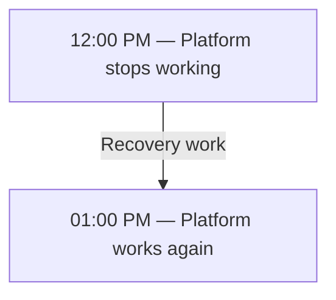
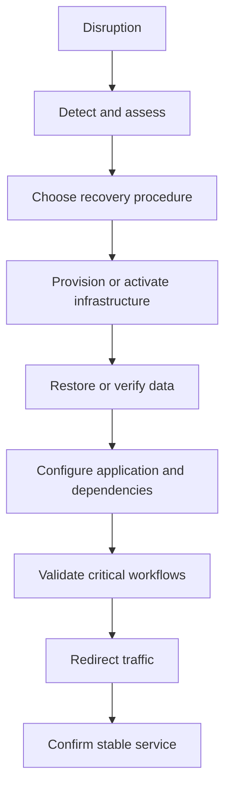
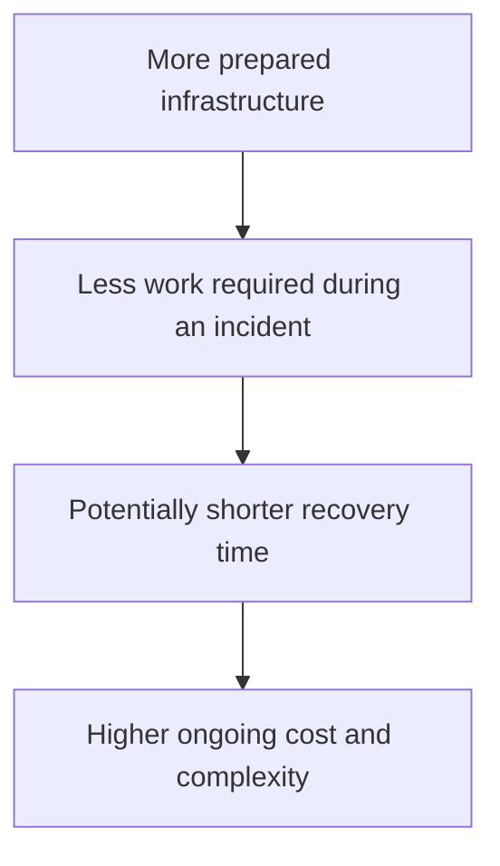
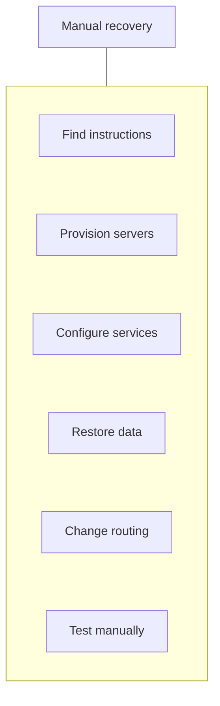
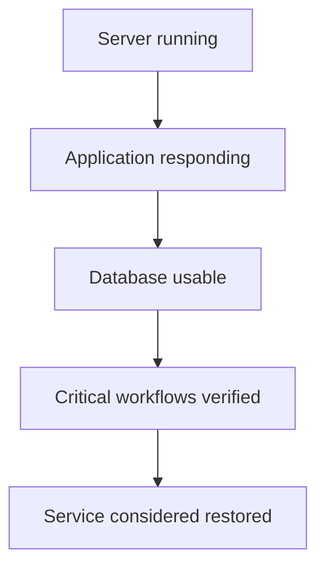
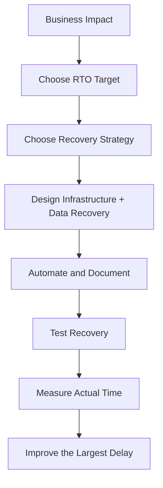
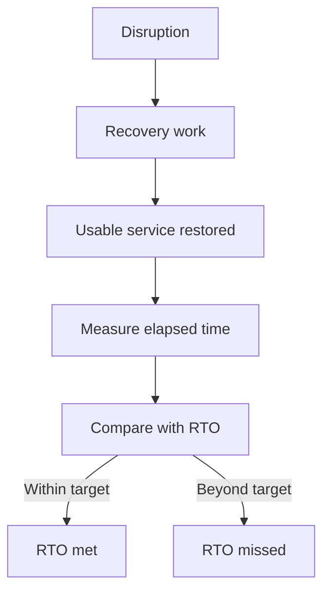

# 09.11 — RTO (Recovery Time Objective)

## Learning Objectives

By the end of this chapter, you should be able to:

- Explain what **RTO** means.
- Distinguish RTO from RPO and MTTR.
- Calculate recovery time from an incident timeline.
- Understand which activities contribute to recovery time.
- Recognize how architecture choices affect RTO.
- Define meaningful recovery targets for different services.
- Understand why recovery exercises are necessary.

---

# 1. What Is RTO?

**RTO (Recovery Time Objective)** is the target maximum amount of time a system can remain disrupted before its service must be restored.

In simple words:

> **RTO answers: How quickly must we get the service working again?**

Imagine an online learning platform becomes unavailable.



The recovery took 60 minutes.

If the business has an RTO of 45 minutes, the recovery missed its target by 15 minutes.

**Important:** RTO is a target, not a guarantee. The actual recovery time must be measured and tested.

---

# 2. RTO vs RPO

RTO and RPO are related, but they answer different questions.

| Concept | Main question | Focus |
|---|---|---|
| **RTO** | How long can the service be unavailable? | Recovery time |
| **RPO** | How much recent data can we afford to lose? | Data loss |

Remember:

```text
RTO → How quickly must service return?

RPO → How far back can recovered data be?
```

For example, an e-commerce platform might have:

```text
RTO = 1 hour
RPO = 5 minutes
```

This means the recovery target is to restore usable service within one hour, while limiting data loss to a five-minute recovery window.

Meeting one target does not automatically mean the other was met.

---

# 3. How Is Recovery Time Measured?

Consider this incident timeline:

```text
02:00 PM — Service disruption begins
02:05 PM — Team detects the problem
02:15 PM — Recovery decision is made
02:30 PM — Infrastructure is ready
02:45 PM — Data restoration is complete
03:00 PM — Business workflows are verified
03:10 PM — Service is restored
```

If the organization measures recovery from the beginning of the disruption:

```text
Recovery time = 03:10 − 02:00
              = 70 minutes
```

If the target RTO is 60 minutes:

```text
Actual recovery = 70 minutes
Target RTO      = 60 minutes

Target missed by 10 minutes
```

The exact start and end points must be defined by the organization. For example, the clock might begin when the disruption starts or when the incident is formally declared.

The end point should represent **usable service**, not merely a running server.

---

# 4. Recovery Is More Than Restarting a Server

A common mistake is assuming recovery means turning the application back on.

A working service may require several activities:



Every step can consume time.

For example, a server might start in two minutes, but restoring a large database and validating payments might take another 45 minutes.

**The RTO must account for the entire recovery process.**

---

# 5. What Determines RTO?

Several factors influence how quickly a service can recover.

| Factor | Why it matters |
|---|---|
| Infrastructure provisioning | New servers and networks may take time to prepare. |
| Data restoration | Large databases can take a long time to restore. |
| Configuration and secrets | Missing settings or credentials can block startup. |
| Dependency availability | The application may depend on databases or external services. |
| Traffic routing | DNS, load balancers, and network changes can delay access. |
| Validation | Teams must confirm that important operations actually work. |
| Human decisions | Approvals and unclear responsibilities can delay recovery. |
| Recovery capacity | A restored system must handle the required workload. |
| Runbooks | Missing or outdated instructions increase recovery time. |

A recovery design should address these constraints before an incident happens.

---

# 6. How Architecture Affects RTO

Different disaster-recovery approaches have different recovery characteristics.

| Strategy | Recovery approach | Typical trade-off |
|---|---|---|
| **Backup and restore** | Rebuild infrastructure and restore data when needed. | Lower ongoing cost, potentially longer recovery. |
| **Pilot light** | Keep essential components ready; scale up during recovery. | Moderate cost and recovery effort. |
| **Warm standby** | Keep a reduced but working environment ready. | Faster recovery, ongoing infrastructure cost. |
| **Hot standby / Active-active** | Keep an alternate environment running or serving traffic. | Potentially fast recovery, greater complexity and cost. |

These are general patterns, not guaranteed recovery times. Actual RTO depends on data size, automation, dependencies, validation, and the failure scenario.

Conceptually:



The goal is not to choose the most expensive strategy. It is to choose one that meets the business's recovery needs.

---

# 7. RTO Must Be Based on Business Impact

Different parts of the same application may need different recovery targets.

Imagine a learning platform:

| Function | Business importance | Example target RTO |
|---|---|---:|
| Student login | Critical | 30 minutes |
| Course enrollment | Critical | 30 minutes |
| Video progress tracking | Important | 2 hours |
| Recommendation feature | Optional | 8 hours |

These values are illustrative, not universal recommendations.

The business should decide how much disruption each function can tolerate.

For example, recommendations might be unavailable for several hours without preventing students from learning. Enrollment may have a much lower tolerance because it directly affects revenue and access.

**Set recovery targets according to business impact, not just technical convenience.**

---

# 8. RTO and RPO Are Independent

A system can meet one target while missing the other.

Suppose:

```text
Target RTO = 60 minutes
Target RPO = 5 minutes
```

Consider four outcomes:

| Outcome | RTO | RPO | Result |
|---|---|---|---|
| A | Met | Met | Both targets achieved. |
| B | Met | Missed | Service returned on time, but too much data was lost. |
| C | Missed | Met | Data loss stayed within target, but service returned too late. |
| D | Missed | Missed | Neither target was achieved. |

For example, restoring a database backup might bring service back within an hour but lose 20 minutes of recent data. The RTO is met, but the five-minute RPO is missed.

This is why recovery planning must track both objectives.

---

# 9. RTO vs MTTR

You may also encounter **MTTR**, commonly expanded as *Mean Time to Repair* or *Mean Time to Recover*, depending on the organization.

| Term | Meaning |
|---|---|
| **RTO** | The recovery-time target the system is expected to meet. |
| **MTTR** | An observed average repair or recovery duration, according to the metric's definition. |

For example:

```text
RTO target = 60 minutes

Observed recovery durations:
Incident A = 30 minutes
Incident B = 50 minutes
Incident C = 90 minutes
```

Average recovery duration:

```text
MTTR = (30 + 50 + 90) / 3
     = 56.7 minutes
```

The average is below the 60-minute target, but Incident C still took 90 minutes.

**An acceptable average does not prove that every incident meets the RTO.** The metric definition and individual recovery results both matter.

---

# 10. How to Reduce Recovery Time

A team can reduce recovery time by removing avoidable delays.

Useful practices include:

- Automate infrastructure provisioning.
- Keep recovery procedures documented and current.
- Maintain tested backups and recovery mechanisms.
- Store configuration and infrastructure definitions safely.
- Make ownership and escalation paths clear.
- Preconfigure alternate environments where justified.
- Automate traffic switching where safe.
- Test critical business workflows after recovery.
- Measure each stage of recovery to find delays.

For example:



With a tested, automated procedure, several of these steps can become faster and more repeatable.

Automation does not eliminate the need for validation or safe decision-making.

---

# 11. Recovery Validation Matters

Suppose the application responds with HTTP 200.

Does that prove recovery is complete?

Not necessarily.

The login page might load while enrollment is broken. The database might be reachable while payment processing fails.

A recovery check should verify the functions that define usable service.



The organization should explicitly define which checks determine the end of the RTO clock.

---

# 12. Recovery Exercises

A documented RTO is only a target until recovery has been tested.

A recovery exercise helps answer:

- Can the team follow the recovery procedure?
- Are backups actually restorable?
- Are required credentials available?
- Can infrastructure be recreated?
- Do dependencies work in the recovery environment?
- How long does traffic switching take?
- Can the system handle expected traffic afterward?

A simple exercise might be:

```text
1. Declare a simulated outage.
2. Follow the recovery runbook.
3. Restore the service in a safe environment.
4. Test critical workflows.
5. Record elapsed recovery time.
6. Compare actual time with RTO.
7. Fix the largest delay.
8. Repeat the exercise.
```

Exercises should be scoped safely. Do not create a production outage merely to test a recovery procedure without appropriate planning and authorization.

---

# 13. Hands-On Exercise: Learning Platform

Imagine a learning platform with:

```text
Target RTO = 45 minutes
Target RPO = 5 minutes
```

During a recovery exercise, the team records:

| Activity | Duration |
|---|---:|
| Detect and declare incident | 5 minutes |
| Activate recovery environment | 10 minutes |
| Restore and verify data | 15 minutes |
| Configure dependencies | 5 minutes |
| Validate login and enrollment | 8 minutes |
| Redirect traffic and confirm stability | 4 minutes |

Total:

```text
5 + 10 + 15 + 5 + 8 + 4 = 47 minutes
```

The exercise took 47 minutes.

```text
Target RTO   = 45 minutes
Actual time  = 47 minutes
Difference   = 2 minutes over target
```

### Your task

1. Did the team meet its RTO?
2. Which recovery activity took the longest?
3. If that activity were reduced by five minutes, would the exercise meet the RTO?
4. What additional evidence would you need to determine whether the RPO was met?

### Answers

1. No. Recovery took two minutes longer than the target.
2. Restoring and verifying data took 15 minutes.
3. Yes. The total would fall to 42 minutes, assuming other durations remain unchanged.
4. You need to know the incident's data-loss boundary and the latest usable recovery point. Recovery duration alone cannot establish whether the RPO was met.

---

# 14. Common Mistakes

- **Treating RTO as a guarantee:** It is a target that must be validated through testing.
- **Measuring only server startup:** The service must be usable according to defined criteria.
- **Confusing RTO with RPO:** One measures recovery time; the other measures acceptable data loss.
- **Ignoring manual steps:** Approvals, credentials, and unclear procedures can dominate recovery.
- **Assuming replication guarantees fast recovery:** The alternate data may need verification, and infrastructure or routing may still be unavailable.
- **Choosing an arbitrary target:** Recovery objectives should reflect business impact.
- **Relying on average recovery time alone:** Individual incidents can exceed the target.
- **Never testing recovery:** Untested plans may fail when they are needed.

---

# 15. System Design View

RTO is a requirement that influences architecture.



If the business requires a very short RTO, restoring everything from scratch may not be sufficient. A prepared alternate environment or automated failover may be justified.

If the business can tolerate a longer outage, a simpler and less expensive recovery strategy may be entirely appropriate.

There is no universally correct RTO or recovery architecture.

---

# 16. Quick Reference

| Concept | Meaning |
|---|---|
| RTO | Target maximum time to restore usable service after a disruption |
| RPO | Target for the maximum acceptable data-loss window |
| Actual recovery time | Measured duration from the defined start to the defined restoration point |
| MTTR | Observed average repair or recovery duration, depending on definition |
| Recovery validation | Checking that critical service functions work |
| Recovery runbook | Documented procedure for restoring service |
| Recovery exercise | A planned test of recovery procedures and capabilities |

### Mental model



---

# 17. Knowledge Check

### Question 1

What does RTO measure?

**Answer:** The target maximum time allowed to restore usable service after a disruption.

### Question 2

How is RTO different from RPO?

**Answer:** RTO concerns recovery duration; RPO concerns the acceptable data-loss window.

### Question 3

If a service returns after 70 minutes and the RTO is 60 minutes, was the target met?

**Answer:** No. Recovery exceeded the target by 10 minutes.

### Question 4

Does restarting a server mean the service has recovered?

**Answer:** Not necessarily. Critical workflows, dependencies, data, and traffic routing may still need verification.

### Question 5

Why can backup-and-restore recovery take longer than using a prepared standby?

**Answer:** Backup-and-restore may require infrastructure provisioning and data restoration during the incident, while a standby environment may already be partially or fully prepared.

### Question 6

Why should recovery be tested?

**Answer:** Testing reveals whether the procedure works in practice and measures whether the target can be achieved.

---

# Remember

> **RTO is about how quickly usable service must return—not merely how quickly a server starts.**

A reliable recovery strategy defines the target, accounts for every recovery step, tests the complete process, and improves the delays that prevent the system from meeting its objective.

**Next: 09.12 — Multi-AZ**
