# 09.12 — Multi-AZ

## Learning Objectives

By the end of this chapter, you should be able to:

- Explain what an **Availability Zone (AZ)** is.
- Understand how Multi-AZ architecture improves resilience.
- Distinguish Multi-AZ from multi-region architecture.
- Understand active-active and primary-standby deployment patterns across AZs.
- Identify shared dependencies and failure modes that Multi-AZ cannot eliminate.
- Understand the relationship between Multi-AZ, failover, RTO, and RPO.
- Recognize the cost and complexity trade-offs of deploying across multiple AZs.

---

# 1. What Is an Availability Zone?

An **Availability Zone (AZ)** is an isolated infrastructure location within a cloud region.

A cloud region may contain multiple AZs.

Each AZ has its own infrastructure and is designed to reduce the likelihood that a localized failure will affect every AZ in the region.

Conceptually:

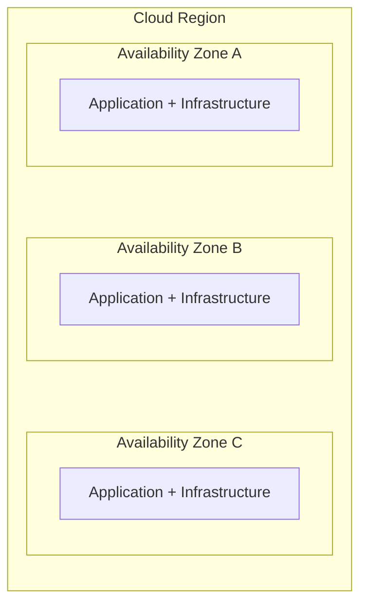

The exact physical design and isolation guarantees vary by cloud provider.

For system design, remember:

> **An AZ is a failure-isolation boundary within a region—not a completely independent geographic region.**

---

# 2. The Problem: One Availability Zone

Imagine your application runs entirely inside one AZ.

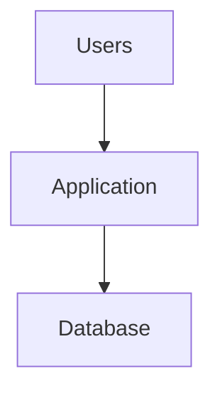

Everything depends on the infrastructure in that location.

If the AZ experiences a major outage:

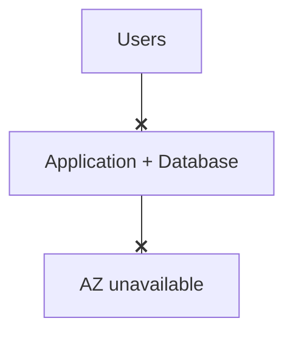

The entire service may become unavailable, even if the application code itself is correct.

This is a **failure-domain problem**: too much of the system depends on one location.

---

# 3. The Multi-AZ Solution

With Multi-AZ, critical components are deployed across multiple AZs.

A simplified application architecture might look like this:

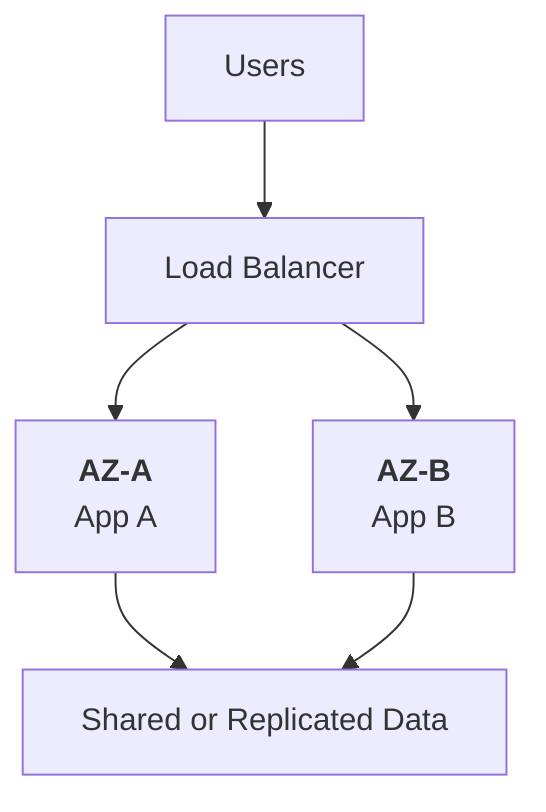

If AZ-A becomes unavailable, the system may continue serving requests through AZ-B.

However, this only works if the required data, networking, dependencies, and remaining capacity are also available.

**Deploying application servers across multiple AZs is not enough if a critical database or network component remains a single point of failure.**

---

# 4. What Multi-AZ Protects Against

Multi-AZ is primarily designed to improve resilience against failures affecting a single availability zone.

Examples include:

- A localized power or cooling failure.
- Infrastructure or networking problems within an AZ.
- Loss of access to resources hosted in one AZ.
- Certain maintenance events or localized infrastructure disruptions.

The intended outcome is:

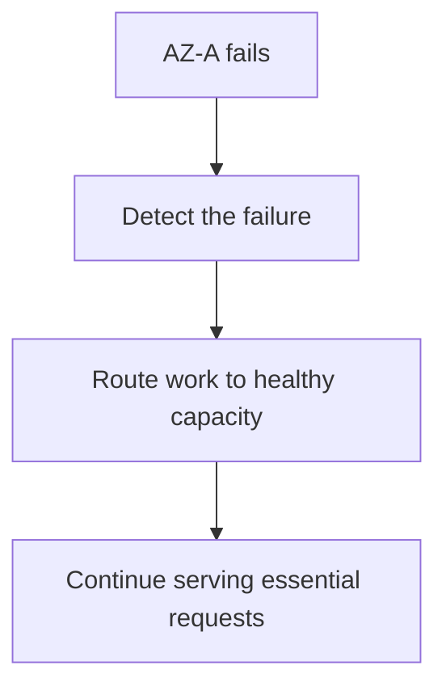

This is not automatic in every architecture. The system needs suitable redundancy, health detection, routing, capacity, and recovery behavior.

---

# 5. Multi-AZ Deployment Patterns

Two common patterns are active-active and primary-standby.

## Pattern A — Active-active application instances

Both AZs actively serve requests.

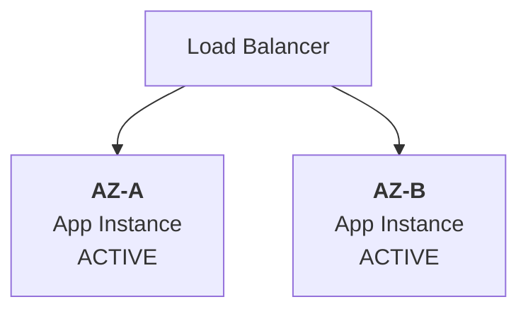

Advantages:

- Both AZs serve normal traffic.
- Capacity is already in use.
- Traffic can be redirected when one instance or AZ fails.

Trade-offs:

- Both AZs must have enough capacity for the intended workload.
- Application state must be handled appropriately.
- Data consistency and shared dependencies still need attention.

## Pattern B — Primary-standby database

One database instance handles writes while another is prepared to take over.

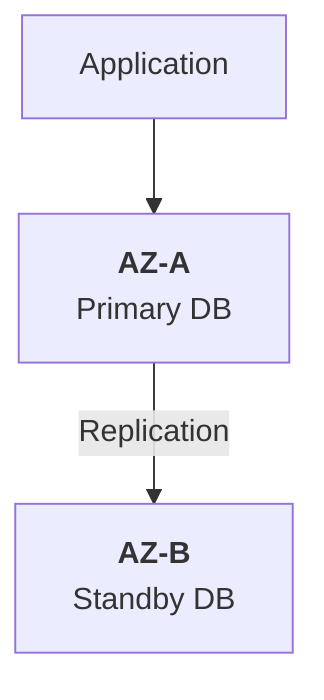

If the primary fails, the standby may be promoted.

The application must then connect to the new primary.

Trade-offs:

- The standby may require promotion and reconnection.
- Replication lag can affect data loss.
- Failover can cause temporary interruption.
- The database service must handle promotion and prevent conflicting writers safely.

Some managed database products use Multi-AZ deployments primarily for availability and failover rather than for distributing read traffic. Product-specific behavior matters.

---

# 6. What Happens When an AZ Fails?

Consider a two-AZ application deployment.

Before the failure:

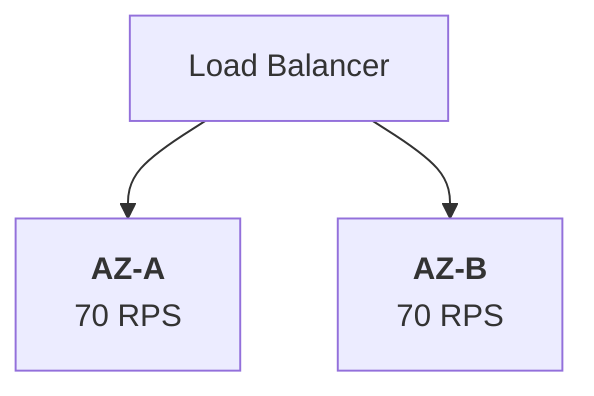

Assume each AZ can safely handle 100 requests per second.

Normal traffic is:

```text
Total = 140 RPS
```

Now AZ-A fails.

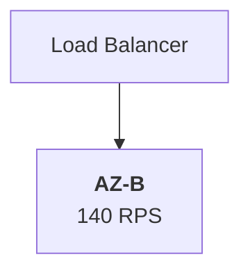

AZ-B receives all 140 RPS, but its capacity is only 100 RPS.

The remaining AZ becomes overloaded.

Possible consequences:

- Increased latency.
- Request timeouts.
- Higher error rates.
- Exhausted database connections.
- Cascading failures.

The system had redundancy, but not enough surviving capacity.

**Resilience requires both redundancy and sufficient capacity after a failure.**

---

# 7. Capacity Planning for Multi-AZ

A useful question is:

> Can the surviving AZs handle the required workload if one AZ becomes unavailable?

Suppose there are three AZs.

Each can handle 100 RPS.

Normal traffic is 180 RPS, distributed evenly:

```text
AZ-A = 60 RPS
AZ-B = 60 RPS
AZ-C = 60 RPS
```

If AZ-A fails and traffic is redistributed:

```text
AZ-B = 90 RPS
AZ-C = 90 RPS
```

Both surviving AZs remain within their assumed 100 RPS capacity.

This is a more resilient arrangement for that workload.

Real capacity planning must also consider CPU, memory, connections, database throughput, traffic bursts, and failure-related overhead.

---

# 8. Multi-AZ Does Not Automatically Protect Your Data

Suppose the application runs across AZ-A and AZ-B, but the database exists only in AZ-A.

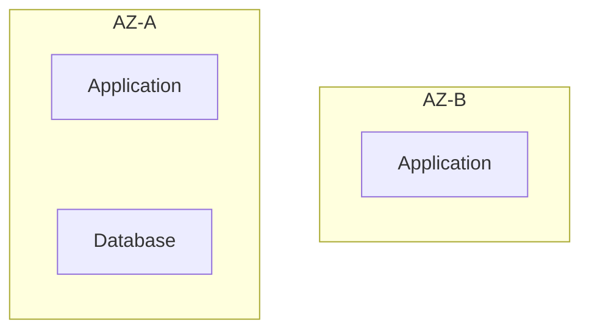

If AZ-A fails, the database may become unavailable even though the application in AZ-B is healthy.

The application cannot complete database-dependent operations.

A resilient design must consider the data layer too.

Even with a replicated database:

- Replication may lag.
- Recent writes may be missing from the promoted replica.
- Replication may propagate accidental changes or corruption.
- Database recovery and promotion may take time.

Multi-AZ does not automatically guarantee zero data loss.

---

# 9. Multi-AZ and RTO/RPO

Multi-AZ can help achieve recovery objectives, but it does not guarantee that targets will be met.

Recall:

- **RTO:** Target time to restore usable service.
- **RPO:** Target for the maximum acceptable data-loss window.

A suitable Multi-AZ design may reduce recovery time because alternate infrastructure is already available.

Its RPO depends on the data-replication and recovery mechanism.

| Design characteristic | Possible effect |
|---|---|
| Healthy alternate application capacity | Reduces the work needed to restore application traffic. |
| Automated health detection and routing | Can reduce detection and redirection delays. |
| Synchronous data replication | Can reduce data-loss exposure for acknowledged writes under supported failure conditions, but may add latency and affect availability. |
| Asynchronous replication | Can reduce replication overhead but may leave recent writes behind. |
| Manual recovery steps | Can increase RTO. |
| Insufficient surviving capacity | Can prevent the service from recovering successfully. |

The architecture must be tested against the actual RTO and RPO targets.

---

# 10. Multi-AZ vs Multi-Region

These designs address different failure boundaries.

| Multi-AZ | Multi-Region |
|---|---|
| Spreads resources across AZs within one region. | Spreads resources across geographically separate regions. |
| Primarily protects against AZ-level failures. | Can help protect against region-wide failures. |
| Usually has less geographic distance between components. | May introduce greater network latency and more complex data coordination. |
| Often simpler to operate. | Usually requires more involved routing, data, and recovery design. |

Conceptually:

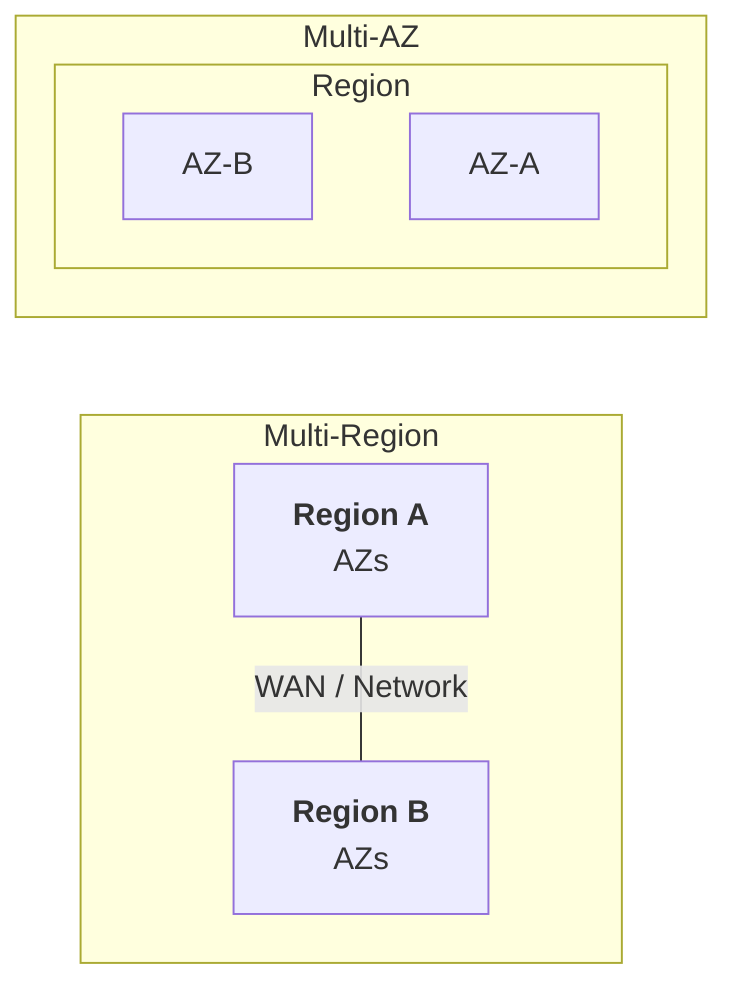

Multi-AZ is not a substitute for a regional disaster-recovery strategy when region-wide failure is within the threat model.

---

# 11. What Multi-AZ Does Not Automatically Protect Against

Some failures affect every AZ or bypass AZ-level isolation.

Examples include:

- A region-wide cloud service outage.
- A faulty deployment rolled out to all AZs.
- A software bug affecting every application instance.
- Incorrect shared configuration.
- Compromised credentials.
- Accidental deletion or corruption replicated across the deployment.
- A shared external dependency becoming unavailable.
- A regional network or control-plane issue affecting required operations.

For example:

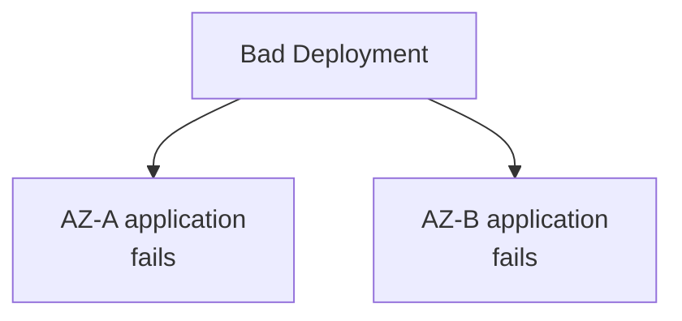

Both AZs can be healthy at the infrastructure level while the application is broken.

This is why resilience also needs safe deployments, backups, monitoring, access controls, and disaster recovery.

---

# 12. Failure Domains and Shared Dependencies

Multi-AZ works best when critical dependencies do not all fail together.

Consider:

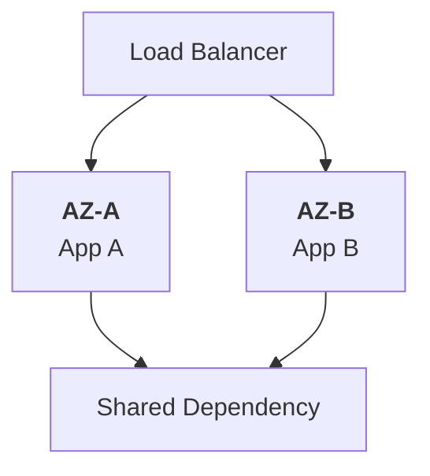

If the shared dependency fails, both application instances may be unable to serve requests.

The dependency may be:

- A database.
- A central authentication service.
- A shared network component.
- A regional API endpoint.
- A configuration service.

Ask:

> If one AZ disappears, which components remain available, and which shared dependencies can still stop the entire service?

This question is more valuable than simply counting the number of AZs.

---

# 13. Cost and Complexity

Multi-AZ often requires additional infrastructure and operational work.

Costs may include:

- Additional compute capacity.
- Replicated data storage.
- Cross-AZ network traffic.
- Load balancing.
- Managed database deployment charges.
- Monitoring and testing.
- More complicated deployment and troubleshooting.

The architecture also needs to handle:

- Health detection.
- Traffic redistribution.
- Data consistency.
- Connection recovery.
- Capacity after failure.
- Failback when a failed AZ returns.

The goal is not to deploy everywhere by default.

It is to choose a resilience level that matches the service's business importance and recovery objectives.

---

# 14. Hands-On Exercise: Learning Platform

Imagine a learning platform deployed across two AZs.

Each AZ can handle 120 RPS.

Normal traffic is 180 RPS, split evenly.

```text
AZ-A = 90 RPS
AZ-B = 90 RPS
Capacity per AZ = 120 RPS
```

Then AZ-A fails.

### Your task

1. How much traffic must AZ-B handle?
2. Can AZ-B serve all traffic within its assumed capacity?
3. What would happen if normal traffic were 250 RPS?
4. Does this deployment guarantee zero data loss?

### Answers

1. AZ-B must handle 180 RPS.
2. No. Its capacity is 120 RPS, so the assumed capacity is insufficient.
3. AZ-B would need to handle 250 RPS after AZ-A fails, which exceeds its capacity even further.
4. No. Data-loss exposure depends on the database replication and recovery design.

### Design improvement

Possible improvements include:

- Increasing per-AZ capacity.
- Adding a third AZ with enough surviving capacity.
- Reducing optional workload during a failure.
- Using graceful degradation for nonessential features.
- Testing database failover and application reconnection.

Each option has cost and complexity trade-offs.

---

# 15. Common Mistakes

- **Running multiple application instances in one AZ and calling it Multi-AZ:** Multiple instances do not provide AZ-level isolation if they share the same AZ.
- **Protecting only the application tier:** A single critical database or dependency can remain a single point of failure.
- **Ignoring surviving capacity:** Healthy instances may still become overloaded after traffic shifts.
- **Assuming replication means zero data loss:** Replication lag and failure semantics matter.
- **Confusing Multi-AZ with Multi-Region:** They address different failure boundaries.
- **Assuming infrastructure health means application health:** A bad deployment can break every AZ.
- **Ignoring recovery tests:** Failover, reconnection, and data behavior need validation.
- **Treating Multi-AZ as a backup:** Redundancy does not replace independent, recoverable backups.

---

# 16. System Design View

Use this decision sequence when evaluating Multi-AZ:

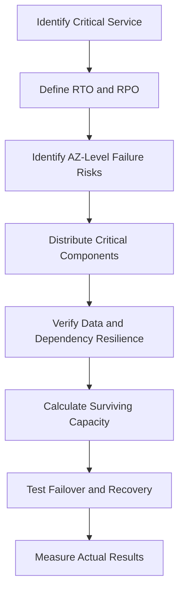

Multi-AZ is an architectural strategy, not a checkbox.

A good design accounts for the application, data, networking, dependencies, capacity, and recovery procedure as one system.

---

# 17. Quick Reference

| Concept | Meaning |
|---|---|
| Availability Zone | Isolated infrastructure location within a cloud region |
| Multi-AZ | Deploying across multiple AZs to reduce dependence on one zone |
| Active-active | Multiple instances serve traffic simultaneously |
| Primary-standby | One instance serves the primary role while another can take over |
| Failure domain | Boundary within which a failure may affect components |
| Surviving capacity | Workload the remaining healthy resources can handle after a failure |
| RTO | Target time to restore usable service |
| RPO | Target for the maximum acceptable data-loss window |
| Multi-Region | Deploying across separate geographic cloud regions |

---

# 18. Knowledge Check

### Question 1

What is an Availability Zone?

**Answer:** An isolated infrastructure location within a cloud region, designed to reduce shared failure risk.

### Question 2

What problem does Multi-AZ primarily address?

**Answer:** It reduces dependence on one AZ and can help the service continue operating through an AZ-level failure.

### Question 3

Why is deploying application servers across two AZs insufficient by itself?

**Answer:** A critical database, network component, or external dependency may still be a single point of failure.

### Question 4

Does Multi-AZ guarantee zero data loss?

**Answer:** No. Data-loss exposure depends on replication, recovery, and the failure scenario.

### Question 5

Why must surviving capacity be calculated?

**Answer:** The remaining AZs must handle the required workload after one AZ becomes unavailable.

### Question 6

How is Multi-AZ different from Multi-Region?

**Answer:** Multi-AZ spreads resources within one region; Multi-Region spreads resources across geographically separate regions and can address region-wide failures.

### Question 7

Does Multi-AZ replace backups?

**Answer:** No. It helps with availability, while backups provide a recovery path for lost or corrupted data.

---

# Remember

> **Multi-AZ reduces dependence on a single availability zone, but resilience requires more than distributing servers.**

Critical data, shared dependencies, surviving capacity, traffic routing, and recovery procedures must all work together.

**Next: 09.13 — Multi-Region**
