# 09.13 — Multi-Region

## Learning Objectives

By the end of this chapter, you should be able to:

- Explain what a multi-region architecture is.
- Understand which failures multi-region deployments can help protect against.
- Distinguish active-passive from active-active regional designs.
- Understand regional traffic routing and data replication.
- Recognize the trade-offs between availability, consistency, latency, and cost.
- Connect multi-region design to RTO and RPO.
- Identify when multi-region architecture is justified.

---

# 1. What Is Multi-Region?

A **multi-region architecture** deploys application infrastructure across two or more geographically separate cloud regions.

A region is a geographic area containing cloud infrastructure and typically multiple Availability Zones (AZs).

For example:

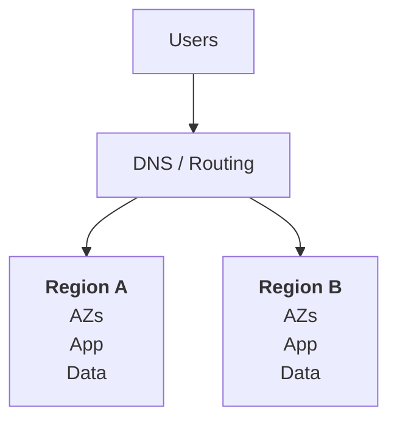

The purpose is to reduce dependence on a single region.

If Region A becomes unavailable, the system may continue operating through Region B.

> **Multi-region architecture is primarily about resilience across geographic failure boundaries.**

It can also improve user latency when traffic is served from a region closer to the user, but that requires an appropriate routing and data design.

---

# 2. Why Is Multi-AZ Sometimes Not Enough?

Multi-AZ spreads infrastructure across multiple Availability Zones within one region.

That helps protect against many localized infrastructure failures.

But a regional failure can affect multiple AZs together.

Examples include:

- A major regional cloud-service outage.
- Regional networking problems.
- A regional configuration or control-plane issue.
- A regional service dependency becoming unavailable.
- A disaster affecting infrastructure across the region.

Consider:

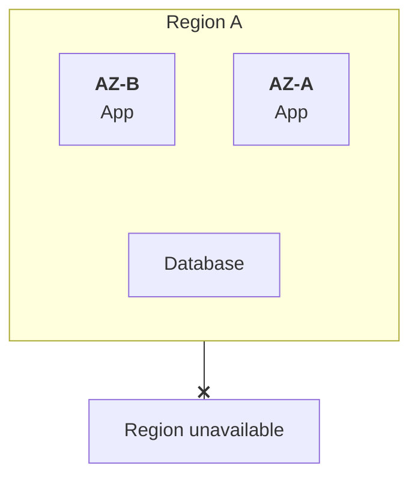

Both AZs may become inaccessible even though they were independently designed.

A second region can provide another place to run the service.

However, **multi-region only helps if the required application, data, configuration, networking, and dependencies are available in that region too.**

---

# 3. Multi-Region Is More Than Two Copies of an Application

Suppose you deploy the application in two regions:

```text
Region A → Application
Region B → Application
```

That alone does not make the complete service region-resilient.

What if:

- The database exists only in Region A?
- Authentication depends on a service available only in Region A?
- Region B lacks production secrets or configuration?
- The routing system cannot direct traffic to Region B?
- Region B cannot handle the full workload?

The service may still fail when Region A becomes unavailable.

A complete design evaluates all critical dependencies.

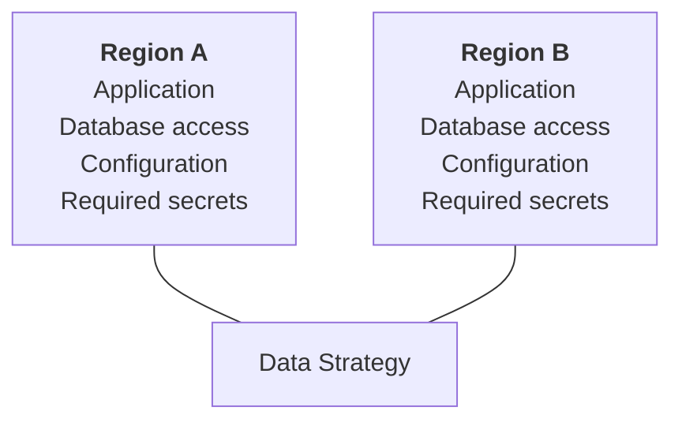

The data strategy is particularly important because two regions need a defined way to maintain and recover application state.

---

# 4. Pattern A — Active-Passive

In an **active-passive** design, one region normally serves production traffic while another region is prepared to take over.

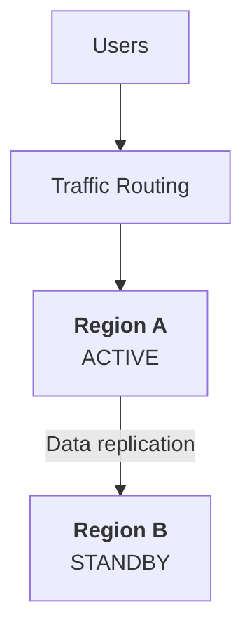

If Region A fails:

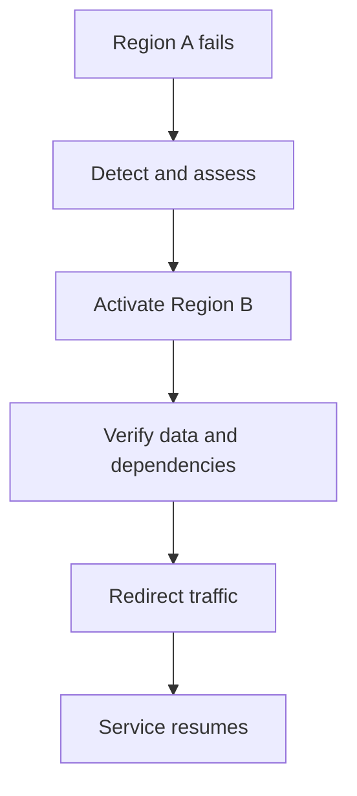

The standby region might be:

- A backup-and-restore environment.
- A pilot-light environment with essential components ready.
- A warm standby with reduced capacity.
- A fully provisioned environment waiting for traffic.

### Advantages

- Usually simpler than active-active.
- Can have one clear primary writer for data.
- May cost less than running full production capacity in both regions.

### Trade-offs

- Recovery may take longer.
- Standby capacity may need to scale up.
- Data replication may lag.
- Traffic switching and validation can take time.

Active-passive does not automatically mean passive infrastructure is completely idle.

---

# 5. Pattern B — Active-Active

In an **active-active** design, multiple regions serve production traffic simultaneously.

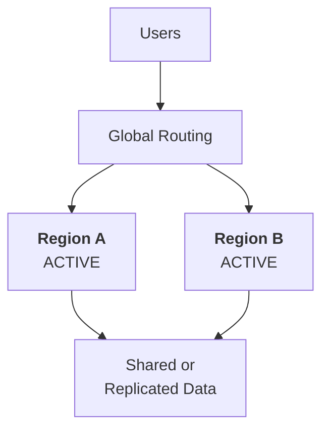

Traffic might be routed based on:

- Geographic proximity.
- Regional health.
- Available capacity.
- Application requirements.
- A combination of routing policies.

### Advantages

- Both regions contribute capacity during normal operation.
- Some users may experience lower latency.
- A surviving region may already be serving production traffic.

### Trade-offs

- Both regions need enough capacity to absorb redistributed traffic.
- Concurrent writes introduce data-consistency challenges.
- Conflicts and duplicate operations need careful handling.
- Testing, deployments, monitoring, and operations become more complex.

> **Active-active can improve availability, but it does not automatically make data coordination easier.**

---

# 6. Active-Passive vs Active-Active

| Consideration | Active-passive | Active-active |
|---|---|---|
| Normal traffic | Primarily one region | Multiple regions |
| Failover | Usually required | May involve traffic redistribution |
| Data writes | Often one primary writer | May involve multiple writers |
| Cost | Can be lower | Often higher |
| Operational complexity | Generally lower | Generally higher |
| Regional capacity | Standby may need activation or scaling | Capacity is already serving traffic |
| Data conflicts | Can be simpler with one writer | Can be more challenging |
| Typical fit | Recovery-focused workloads | Workloads needing continuous regional service or lower latency |

These are common patterns, not absolute rules. A passive region can be fully provisioned, and an active-active system can still use one primary database writer.

---

# 7. Global Traffic Routing

A multi-region application needs a way to direct users to a suitable region.

A simplified architecture:

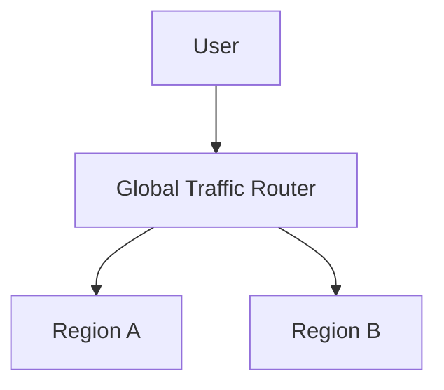

Routing can use mechanisms such as:

- DNS-based routing.
- Global load balancing.
- Anycast-based network routing.
- Application-level regional selection.

The choice depends on the cloud provider, network design, application protocol, and recovery requirements.

## Health-aware routing

A routing layer may stop sending new traffic to an unhealthy region.

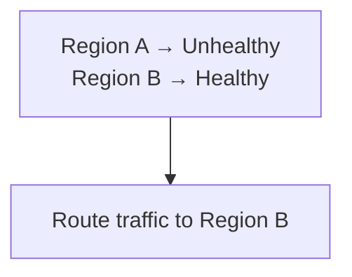

But health detection and routing are not instantaneous in every architecture.

DNS caching, existing connections, client behavior, and health-check thresholds can delay the transition.

Also, a routing system cannot fix an unavailable database or missing dependency in the destination region.

---

# 8. The Hard Part: Data Across Regions

Application instances can often be recreated in another region.

Data is more difficult.

Suppose users place orders in Region A.

Region B needs access to the relevant order data if it is expected to take over.

A common approach is replication:

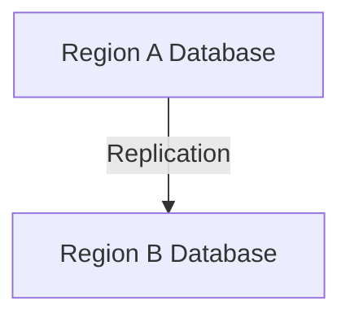

Replication keeps copies of data synchronized to some degree, depending on the mechanism.

But **replication does not always mean both copies contain exactly the same data at every moment**.

The behavior depends on whether replication is synchronous or asynchronous and on the database's guarantees.

---

# 9. Synchronous vs Asynchronous Replication

## Asynchronous replication

The primary acknowledges a write before the replica has necessarily received it.

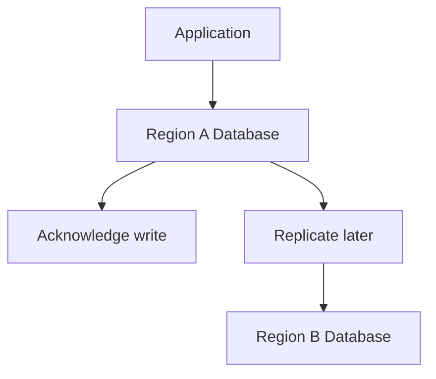

If Region A fails before the latest write reaches Region B, that write may be lost during recovery.

### Trade-off

- Can reduce the write-path latency compared with waiting for remote acknowledgment.
- Can leave a replication gap during failure.

## Synchronous replication

The write acknowledgment waits for the required replica or replicas to confirm the write according to the system's defined guarantee.

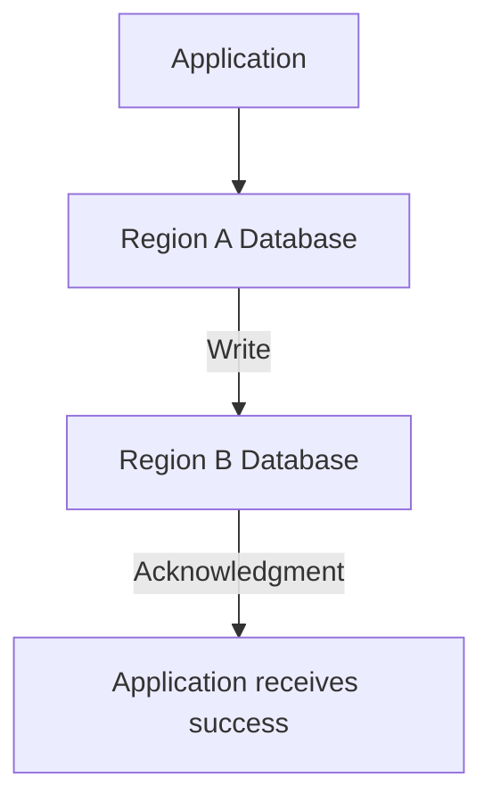

This can reduce data-loss exposure for acknowledged writes under the supported failure model.

### Trade-off

- Adds cross-region communication latency.
- May reduce write availability when required replicas or network paths are unavailable.
- Exact guarantees depend on the database and replication configuration.

Not every database supports synchronous replication across regions with the desired behavior.

---

# 10. Multi-Region Does Not Guarantee Zero Data Loss

Consider:

```text
14:00:00 — Order created in Region A
14:00:01 — Region A fails
14:00:03 — Replica receives the order
```

If Region A fails before the order reaches the replica, Region B may not have that order.

The actual result depends on the replication mechanism and timing.

This connects directly to **09.10 — RPO**.

```text
RPO = 0
```

is a demanding requirement. It requires an architecture and failure model that support zero loss of acknowledged writes for the failures being considered.

Simply deploying in two regions does not achieve that guarantee.

Even synchronous replication needs careful analysis of what is acknowledged, which failures are covered, and what happens during network partitions.

---

# 11. Multi-Region and RTO

Multi-region architecture can reduce recovery time because an alternate region may already be available.

But the RTO still includes:

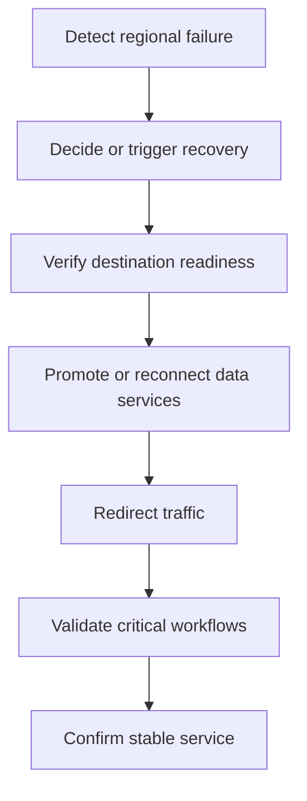

A pre-running active-active system may avoid some activation steps, but it can still experience data, routing, or dependency problems.

An active-passive design may need to promote a database, scale capacity, or perform validation before traffic is switched.

**Measure recovery time through the complete service-restoration process, not just the time needed to change a routing record.**

---

# 12. Capacity During a Regional Failure

Suppose two regions each have a safe capacity of 1,000 RPS.

Normal traffic is 1,400 RPS, split evenly:

```text
Region A = 700 RPS
Region B = 700 RPS
```

Now Region A fails.

Region B must handle:

```text
1,400 RPS
```

But its capacity is only:

```text
1,000 RPS
```

The system has a second region but cannot serve the entire workload within its assumed capacity.

Possible consequences include increased latency, errors, and cascading failures.

A resilient design may need to:

- Increase regional capacity.
- Reserve enough headroom for failover.
- Reduce optional work during a regional incident.
- Apply rate limits.
- Prioritize critical operations.

This is the same principle you learned in redundancy and Multi-AZ design:

> **Surviving infrastructure must have enough capacity to handle the workload it is expected to inherit.**

---

# 13. Data Conflicts in Active-Active Systems

Imagine the same user can update an account in both regions while network communication between them is disrupted.

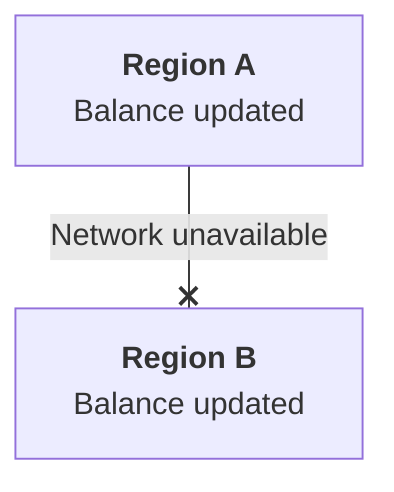

If both regions accept conflicting writes, the system needs a defined rule for resolving them.

Possible strategies depend on the data model and business requirements:

- One authoritative writer for each record or partition.
- Conflict detection and explicit resolution.
- Versioning or conditional writes.
- Carefully designed application-level merge rules.
- A database system that provides the required coordination guarantees.

Not every type of data can be safely merged.

For example, two independent text edits might be mergeable under specific rules. Two conflicting money transfers require stronger business and consistency guarantees.

> **Active-active traffic handling is not the same as safely supporting multi-region writes.**

---

# 14. Network Partitions and Regional Independence

Regions communicate over networks, and those connections can fail or become unreliable.

A regional network partition may leave both regions running while preventing them from coordinating.

The system must decide what each region is allowed to do during that condition.

For example:

- Continue serving read-only requests.
- Accept writes only in an authoritative region.
- Reject operations requiring unavailable coordination.
- Allow selected operations using explicitly defined consistency rules.

The correct choice depends on the business operation.

For payments, account balances, and inventory reservations, accepting conflicting writes can be more harmful than temporarily rejecting some requests.

This is one reason multi-region data design is more complicated than copying infrastructure.

---

# 15. What Multi-Region Does Not Automatically Protect Against

Multi-region architecture cannot prevent every failure.

Examples include:

- A faulty release deployed to all regions.
- Compromised credentials used in every region.
- Data corruption replicated across regions.
- An application bug affecting all instances.
- A shared identity or payment provider outage.
- Incorrect global routing configuration.
- A region-independent dependency failure.

For example:

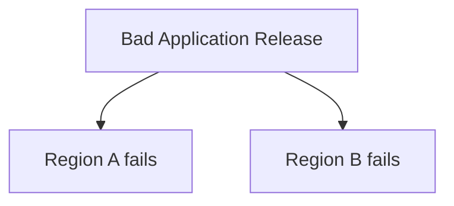

Geographic redundancy does not protect against a common software defect.

Other safeguards remain necessary:

- Backups and restore tests.
- Safe deployment and rollback procedures.
- Independent security controls.
- Monitoring and alerting.
- Disaster-recovery runbooks.
- Testing of critical workflows.

---

# 16. Cost and Operational Complexity

A multi-region architecture introduces more than duplicate compute resources.

It may require:

- Additional infrastructure and database capacity.
- Cross-region data transfer.
- Replication and coordination.
- Global routing and health checks.
- Region-specific configuration and secrets.
- Deployment coordination.
- More complex monitoring and troubleshooting.
- Regular regional failover exercises.

It also introduces questions such as:

```text
Which region owns writes?

What happens during a network partition?

How is traffic redirected?

How is data verified?

How does the recovered region rejoin?

Can the surviving region handle all traffic?
```

If the system does not have a real regional-resilience requirement, this complexity may not be justified.

---

# 17. When Does Multi-Region Make Sense?

Multi-region may be justified when:

- A regional outage would cause unacceptable business impact.
- The required RTO cannot reasonably be met with a single-region design.
- Geographic distribution improves user latency.
- Business or regulatory requirements call for geographic separation.
- The business can support the additional infrastructure and operational complexity.

It may be unnecessary when:

- A regional outage is an acceptable risk.
- A tested backup-and-restore strategy meets the RTO.
- The application is small and has limited availability requirements.
- The team cannot safely operate and test the additional architecture.
- Data consistency requirements make the proposed design unsuitable.

A single-region, Multi-AZ architecture with reliable backups may be a better choice for many systems.

**The objective is to meet the requirement—not to maximize the number of regions.**

---

# 18. Hands-On Exercise: E-Commerce Platform

Imagine an e-commerce platform with two regions.

```text
Region A capacity = 2,000 RPS
Region B capacity = 1,500 RPS

Normal total traffic = 2,400 RPS
```

Traffic is split:

```text
Region A = 1,400 RPS
Region B = 1,000 RPS
```

The business defines:

```text
RTO = 15 minutes
RPO = 1 minute
```

During an incident, Region A becomes unavailable.

### Your task

1. How much traffic must Region B handle after the failure?
2. Can Region B handle the full workload within its stated capacity?
3. If traffic switching takes two minutes but database promotion takes twelve minutes afterward, can the service meet the 15-minute RTO if validation takes another four minutes?
4. If asynchronous replication is 90 seconds behind at the failure, is the one-minute RPO necessarily met?
5. Name two design improvements.

### Answers

1. Region B must handle 2,400 RPS.
2. No. Its capacity is 1,500 RPS, leaving a 900 RPS shortfall.
3. No. The sequential steps take 18 minutes in total: 2 + 12 + 4.
4. No. A 90-second replication gap can exceed the one-minute data-loss target, depending on the actual recoverable state.
5. Possible improvements include increasing Region B capacity, reducing failover and validation time, improving the replication strategy, or defining a safe reduced-functionality mode.

The key lesson is that **traffic routing, capacity, data recovery, and validation must all fit the recovery objectives**.

---

# 19. Common Mistakes

- **Assuming two regions automatically mean high availability:** Critical dependencies may still exist in only one region.
- **Treating replication as a backup:** Corruption and accidental deletion may also be replicated.
- **Assuming multi-region means zero data loss:** Replication guarantees and failure conditions matter.
- **Ignoring regional capacity:** The surviving region may overload.
- **Assuming active-active solves write conflicts:** Multi-region write coordination needs an explicit design.
- **Ignoring network partitions:** Regions may be running but unable to coordinate safely.
- **Forgetting common-mode failures:** Bad releases, credentials, and shared dependencies can affect every region.
- **Never testing regional recovery:** The architecture may not meet its RTO or RPO in practice.
- **Using multi-region without a business requirement:** Cost and complexity can outweigh the benefit.

---

# 20. System Design View

Use this decision sequence when considering multi-region:

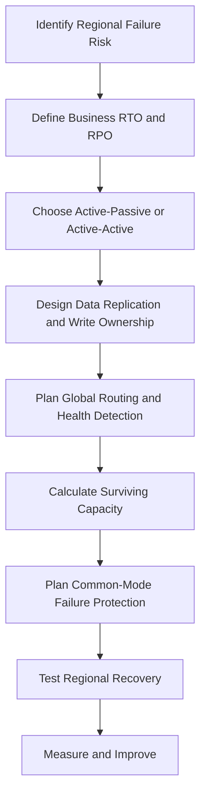

A multi-region design is successful only when the complete service can recover within its intended constraints.

---

# 21. Quick Reference

| Concept | Meaning |
|---|---|
| Multi-Region | Deploying critical infrastructure across separate geographic regions |
| Active-passive | One region normally serves traffic while another is prepared to take over |
| Active-active | Multiple regions serve production traffic simultaneously |
| Global routing | Directing users or requests to suitable regions |
| Replication lag | Delay before changes become available at a replica |
| Synchronous replication | Write acknowledgment waits for required replication confirmation |
| Asynchronous replication | Writes can be acknowledged before replication completes |
| Regional failover | Switching service operation to another region |
| RTO | Target time to restore usable service |
| RPO | Target for the maximum acceptable data-loss window |
| Common-mode failure | A shared cause that affects multiple supposedly redundant components |

---

# 22. Knowledge Check

### Question 1

What is the primary purpose of multi-region architecture?

**Answer:** To reduce dependence on a single geographic region and help the service withstand certain region-wide failures.

### Question 2

How does active-passive differ from active-active?

**Answer:** Active-passive normally serves traffic from one region while another is prepared to take over. Active-active serves production traffic from multiple regions.

### Question 3

Why is data replication a major design concern?

**Answer:** Regions need usable data during recovery, but replication can lag and multi-region writes can introduce consistency and conflict problems.

### Question 4

Does multi-region guarantee zero data loss?

**Answer:** No. That depends on the data architecture, replication guarantees, and the failure scenario.

### Question 5

Why must the surviving region have sufficient capacity?

**Answer:** It may need to handle the failed region's workload in addition to its own.

### Question 6

Can a faulty deployment break both regions?

**Answer:** Yes. Geographic redundancy does not prevent common software or configuration failures.

### Question 7

When might single-region Multi-AZ be a better choice?

**Answer:** When its recovery capabilities meet the business requirements and multi-region complexity and cost are not justified.

---

# Remember

> **Multi-region architecture can protect against regional failures, but only when the application, data, dependencies, routing, and surviving capacity are designed to work together.**

Start with the business's recovery requirements. Then choose the simplest architecture that can meet them, and test it under realistic failure conditions.

**Next: 09.14 — Disaster Scenarios**
