# 09.14 — Disaster Scenarios

## Learning Objectives

By the end of this chapter, you should be able to:

- Identify common disaster scenarios in distributed systems.
- Distinguish component failures from regional and data disasters.
- Analyze the impact of a failure on critical user journeys.
- Apply redundancy, failover, backups, RTO, and RPO appropriately.
- Recognize common-mode failures that affect redundant components.
- Build a practical disaster-response plan.
- Evaluate recovery strategies using realistic scenarios.

---

# 1. What Is a Disaster Scenario?

A **disaster scenario** describes a serious failure or disruption and explores how the system responds.

Examples include:

- A database becomes unavailable.
- An entire availability zone fails.
- A cloud region becomes inaccessible.
- Data is accidentally deleted.
- A faulty deployment breaks production.
- An attacker corrupts or encrypts important data.

The purpose is not to predict every possible failure.

It is to ask:

> **If this happens, what breaks, what continues working, and how do we recover?**

A disaster scenario connects architecture decisions to real consequences.

---

# 2. A Simple Scenario Analysis Model

Use this sequence to analyze a failure:

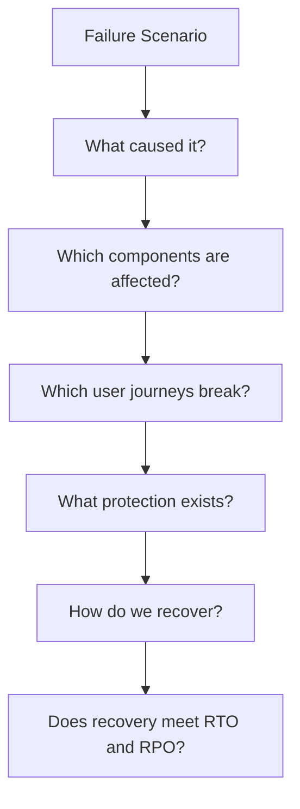

For example, a database outage might leave the application servers healthy while preventing users from enrolling in courses.

Looking only at server health would miss the actual business impact.

---

# 3. Scenario 1 — Application Server Failure

Imagine an application runs on two instances behind a load balancer.

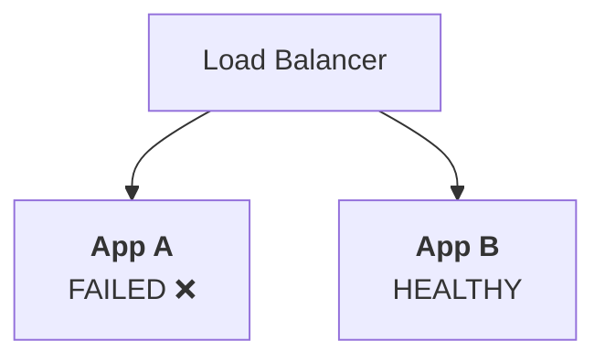

## What can happen?

If App A fails, new requests may be routed to App B.

But App B must have enough capacity to handle the additional workload.

## Possible protection

- Multiple application instances.
- Health checks.
- Automatic traffic redistribution.
- Stateless application design.
- Sufficient surviving capacity.

## What can still go wrong?

- Both instances may have a shared dependency failure.
- App B may become overloaded.
- In-flight requests to App A may fail.
- Local state on App A may be lost.

**Lesson:** Multiple application instances help only when the rest of the request path and the remaining capacity support continued service.

---

# 4. Scenario 2 — Database Failure

Suppose the application depends on a single database.

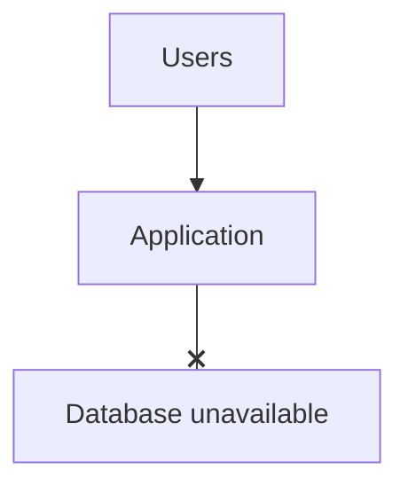

The application may still respond to some requests, but database-dependent operations can fail.

For example:

- Login may fail if user records cannot be read.
- Enrollment may fail if course and enrollment data are unavailable.
- Payment processing may become uncertain if the database fails during a transaction.

## Possible protection

- Database replication or a managed standby.
- Tested backups.
- Point-in-time recovery where supported.
- Connection timeouts.
- Health monitoring.
- A documented failover procedure.

## Important distinction

Failover can restore access to a database replica, while backups can help recover from data loss or corruption.

These solve different problems.

A replica may also be missing recent writes or contain changes that should not have been replicated.

**Lesson:** Database availability and data recoverability must be designed separately.

---

# 5. Scenario 3 — Availability Zone Failure

Imagine an application deployed across two AZs.

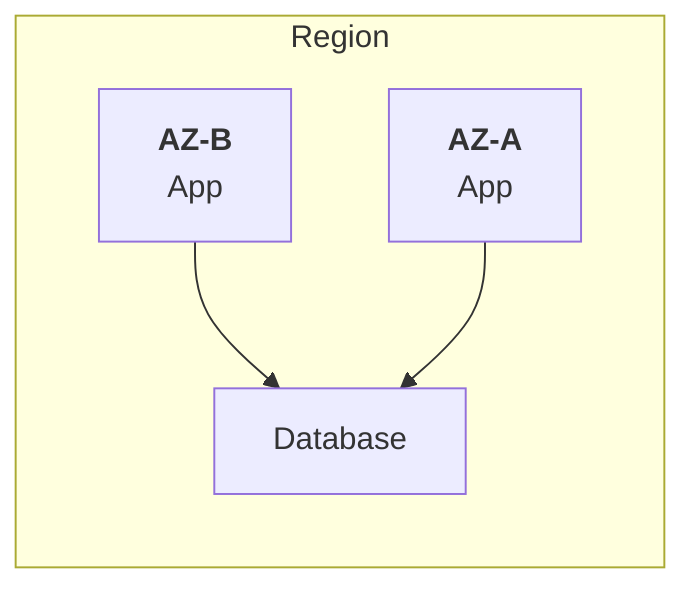

AZ-A becomes unavailable.

The system must continue through AZ-B if the required components remain available.

## Possible protection

- Multi-AZ deployment.
- Health-aware routing.
- Database failover across AZs.
- Enough capacity in surviving AZs.
- Tested connection recovery.

## What can still go wrong?

- The database may remain unavailable.
- The surviving AZ may be overloaded.
- Failover may take longer than the RTO.
- Recent writes may be missing from a replica.

**Lesson:** Multi-AZ reduces dependence on one zone, but it does not automatically guarantee uninterrupted service or zero data loss.

---

# 6. Scenario 4 — Entire Region Failure

Suppose the primary cloud region becomes unavailable.

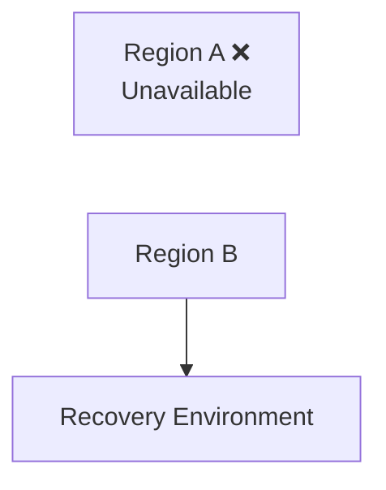

A Multi-AZ architecture within Region A may not be sufficient.

## Possible protection

- A tested multi-region recovery strategy.
- Application infrastructure prepared in another region.
- A defined data-replication strategy.
- Global or regional traffic-routing procedures.
- Recovery credentials and configuration.
- Sufficient capacity in the destination region.

## What can still go wrong?

- Region B may not have the latest data.
- Its capacity may be insufficient.
- Traffic routing may take time.
- Dependencies may exist only in Region A.
- The recovery procedure may require manual steps.

**Lesson:** A second region is useful only if it can operate the required service independently enough to meet the recovery objectives.

---

# 7. Scenario 5 — Accidental Data Deletion

A developer accidentally executes:

```sql
DELETE FROM courses;
```

The database is still online.

Health checks may pass.

The application may even return successful HTTP responses.

But important data is missing.

This is a **data integrity and recovery problem**, not necessarily an availability problem.

## Possible protection

- Database backups.
- Point-in-time recovery.
- Restricted production permissions.
- Approval for destructive operations.
- Audit logs.
- Tested restoration procedures.

## Recovery approach

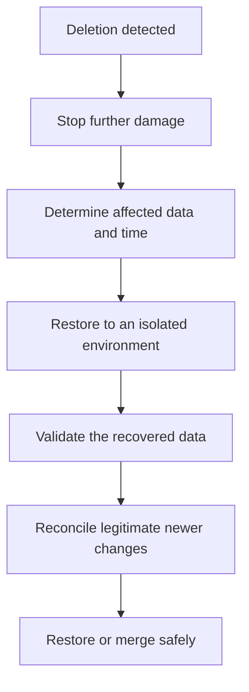

Restoring an entire database may overwrite valid changes made after the recovery point. Depending on the database and backup design, selective recovery or reconciliation may be safer.

**Lesson:** A system can be available while its data is incorrect.

---

# 8. Scenario 6 — Data Corruption or Ransomware

Suppose an attacker compromises credentials and corrupts data or encrypts production files.

A replicated copy may receive the same harmful changes.

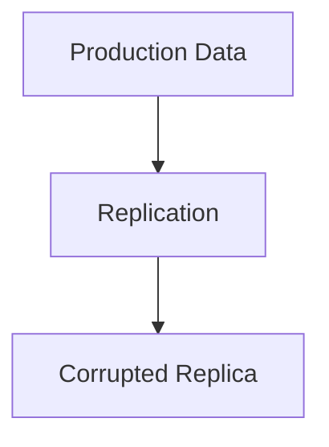

Replication alone is not protection against every destructive event.

## Possible protection

- Immutable or otherwise protected backups.
- Separate backup permissions.
- Strong authentication and access controls.
- Audit logging and monitoring.
- Isolated recovery environments.
- Tested restoration procedures.
- Incident containment and credential rotation.

## Recovery considerations

The team must determine when the compromise began, which data can be trusted, and whether the attacker still has access.

Restoring data without removing the attacker's access can lead to another compromise.

**Lesson:** Recovery from a security incident requires containment and trustworthy recovery points—not just restarting services.

---

# 9. Scenario 7 — Faulty Deployment

A new release contains a bug that prevents users from enrolling in courses.

Both AZs are healthy, and the database is available.

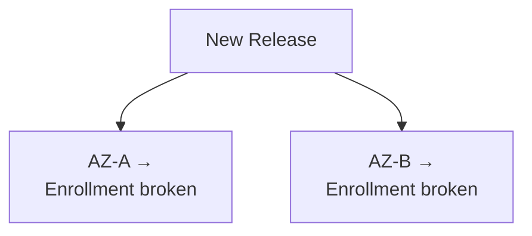

Infrastructure redundancy does not protect against a defect deployed everywhere.

## Possible protection

- Automated tests.
- Staged or canary deployments.
- Progressive rollout.
- Monitoring of critical workflows.
- Fast rollback.
- Database migration compatibility.

## Recovery approach

1. Confirm the release is responsible.
2. Stop further rollout.
3. Roll back or deploy a verified fix.
4. Validate enrollment and related workflows.
5. Monitor error rates and user impact.

A rollback may be unsafe if the release performed an incompatible database migration. Deployment and data-change strategies must be designed together.

**Lesson:** Redundancy protects against certain infrastructure failures, not necessarily shared software defects.

---

# 10. Scenario 8 — External Dependency Failure

Imagine the learning platform depends on an external email provider.

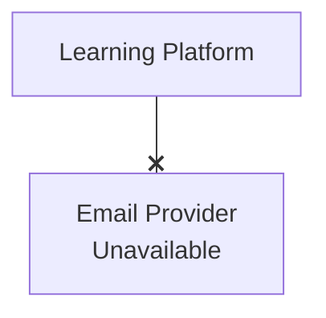

Students may still be able to browse courses and study, even though confirmation emails cannot be sent.

The correct response depends on whether email is essential to the affected operation.

## Possible protection

- Timeouts.
- Controlled retries.
- A queue for email delivery.
- Monitoring and alerting.
- A fallback provider where justified.
- Graceful degradation.

For example, course enrollment might succeed while confirmation email delivery is queued for later.

However, a payment provider or identity service may be a more critical dependency. Its failure may require a different response.

**Lesson:** Classify dependencies by business importance and define safe behavior for each failure.

---

# 11. Scenario 9 — Traffic Surge and Capacity Failure

Not every disaster begins with a broken component.

A sudden traffic surge can overwhelm a healthy system.

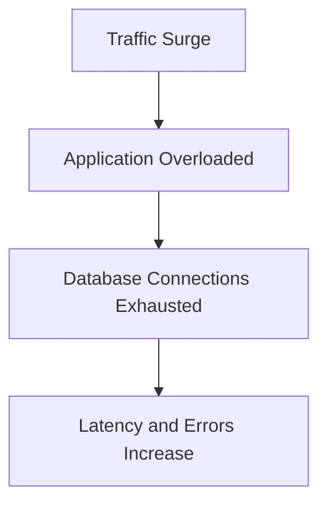

## Possible protection

- Capacity planning.
- Rate limiting.
- Load shedding.
- Autoscaling where appropriate.
- Caching.
- Queue-based processing for suitable work.
- Graceful degradation.

Autoscaling is not instantaneous and may not solve a database bottleneck. More application instances can actually increase pressure on a constrained database.

**Lesson:** Resilience must account for overload, not only component failure.

---

# 12. Scenario 10 — Configuration or Credential Failure

Suppose a production secret expires or a configuration change breaks database connectivity.

Multiple application instances may fail simultaneously.

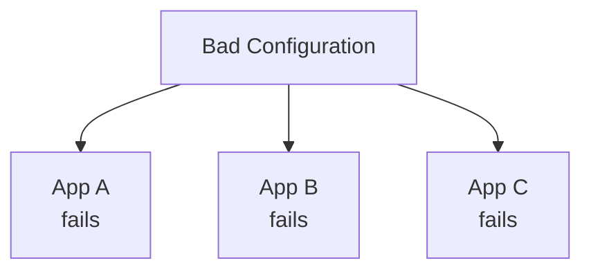

Adding more instances does not solve the shared problem.

## Possible protection

- Versioned configuration.
- Controlled changes and approvals.
- Secret rotation procedures.
- Validation before rollout.
- Monitoring of authentication and connection errors.
- A tested rollback path.

**Lesson:** Common-mode failures can defeat otherwise redundant architectures.

---

# 13. Compare the Scenarios

| Scenario | Primary risk | Relevant protection |
|---|---|---|
| Application instance failure | Lost compute capacity | Multiple instances, health checks |
| Database failure | Data access unavailable | Database failover, backups |
| AZ failure | Local infrastructure unavailable | Multi-AZ |
| Regional outage | Entire region inaccessible | Multi-region recovery |
| Accidental deletion | Data loss | Backups, point-in-time recovery |
| Corruption or ransomware | Data becomes untrustworthy | Isolated backups, security controls |
| Faulty deployment | Application behavior breaks | Safe rollout, rollback |
| External service outage | Dependency unavailable | Timeouts, queues, fallback |
| Traffic surge | Capacity exhausted | Rate limiting, capacity planning |
| Bad configuration | Multiple components fail together | Validation, versioning, rollback |

No single resilience mechanism protects against every scenario.

---

# 14. Build a Disaster Recovery Plan

A practical plan should identify the failure, its impact, and the actions needed to recover.

Use this structure:

| Question | What to document |
|---|---|
| What failed? | The affected component or service |
| How do we detect it? | Alerts, monitoring, user reports |
| What is the impact? | Which critical workflows are unavailable or incorrect |
| What can contain it? | Isolation, rollback, traffic changes, access revocation |
| What recovery path exists? | Failover, restore, rebuild, or fallback |
| What are the RTO and RPO? | Recovery-time and data-loss targets |
| How do we validate recovery? | Critical business workflows and data checks |
| Who is responsible? | Incident owner and recovery roles |
| How do we learn? | Timeline, root cause, and corrective actions |

The plan should be accessible during the incident and should not depend entirely on a system that may itself be unavailable.

---

# 15. Prioritize by Business Impact

Not every failure deserves the same response.

Imagine a learning platform:

| Function | Example impact | Possible response |
|---|---|---|
| Student login | Students cannot access learning | Prioritize recovery |
| Course enrollment | Students cannot enroll | Prioritize recovery |
| Payment processing | Financial operations affected | Recover carefully; reconcile uncertain outcomes |
| Video progress tracking | Some progress updates unavailable | Preserve or recover progress according to requirements |
| Recommendations | Optional feature unavailable | Disable temporarily |

This classification should be decided before an incident.

Do not assume a feature is optional merely because it is technically separate. Its business role determines its criticality.

---

# 16. Hands-On Exercise: Regional Outage

Imagine a learning platform with the following design:

```text
Region A:
- Application
- Primary database

Region B:
- Application
- Asynchronous database replica
```

The business targets are:

```text
RTO = 30 minutes
RPO = 2 minutes
```

A regional outage occurs. The team records:

| Recovery activity | Duration |
|---|---:|
| Detect and declare incident | 4 minutes |
| Activate Region B services | 6 minutes |
| Promote and verify database | 8 minutes |
| Redirect traffic | 3 minutes |
| Validate critical workflows | 5 minutes |

Assume these activities occur sequentially.

Total recovery time:

```text
4 + 6 + 8 + 3 + 5 = 26 minutes
```

### Your task

1. Does the recovery meet the RTO?
2. Does this timeline prove the RPO was met?
3. What happens if Region B cannot handle the full traffic load?
4. What should the team investigate after recovery?

### Answers

1. Yes. The measured recovery time is 26 minutes, within the 30-minute target.
2. No. The timeline describes recovery duration, not the amount of data lost. The recovered data and replication gap must be examined.
3. The service may become overloaded even though traffic has been redirected. The team may need more capacity or safe load shedding.
4. Investigate the incident timeline, replication state, capacity, recovery bottlenecks, failed steps, and improvements to the recovery plan.

---

# 17. A Practical Disaster Response Sequence

During a serious incident, recovery should be controlled rather than improvised.

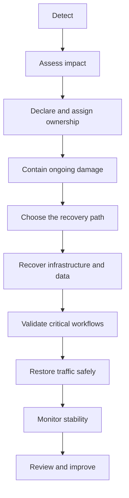

The sequence is a guide, not a rigid rule. During some incidents, containment must happen immediately; in others, safe failover may be the fastest way to restore service.

For security incidents, preserving evidence and preventing continued unauthorized access can be as important as restoring availability.

---

# 18. Common Mistakes

- **Planning only for server failure:** Data, regional, security, deployment, and overload failures also matter.
- **Assuming redundancy prevents data loss:** Replicas may contain missing or corrupted data.
- **Restoring without validating:** A running application may still have broken business workflows.
- **Ignoring shared dependencies:** A common failure can affect every redundant instance.
- **Failing to contain damage:** Recovery may be undone if the underlying cause remains active.
- **Treating every feature as equally critical:** Recovery priorities should reflect business impact.
- **Never rehearsing recovery:** Documentation alone does not prove the procedure works.
- **Ignoring actual recovery measurements:** Without measured evidence, RTO and RPO compliance remains uncertain.
- **Failing to learn afterward:** Repeated incidents are likely if root causes and recovery gaps remain unaddressed.

---

# 19. System Design View

Disaster planning connects the reliability concepts from this level:

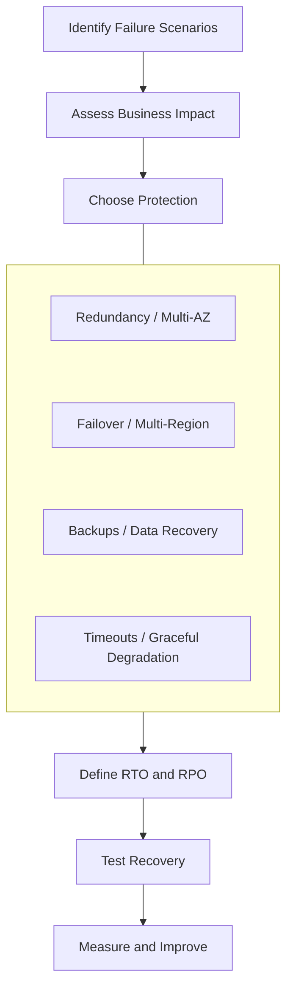

The right protection depends on the failure being addressed.

For example:

- Multi-AZ helps with certain zone-level failures.
- Multi-region can help with regional failures.
- Backups help recover data that replicas may also have lost or corrupted.
- Graceful degradation preserves essential functions when optional dependencies fail.
- Safe deployment practices reduce the impact of faulty releases.

These mechanisms complement one another rather than replacing one another.

---

# 20. Quick Reference

| Concept | Meaning |
|---|---|
| Disaster scenario | A defined failure situation used to analyze system impact and recovery |
| Failure domain | Boundary within which a failure may affect components |
| Common-mode failure | A shared cause that affects multiple redundant components |
| Failover | Switching operation to an alternative component or environment |
| Backup recovery | Restoring data from a recoverable copy |
| RTO | Target time to restore usable service |
| RPO | Target for the maximum acceptable data-loss window |
| Containment | Limiting further damage or spread |
| Recovery validation | Verifying that required functions and data work correctly |
| Runbook | Documented operational steps for handling an incident |

---

# 21. Knowledge Check

### Question 1

What is a disaster scenario?

**Answer:** A defined failure situation used to evaluate impact, protection, and recovery.

### Question 2

Why is database failure different from accidental data deletion?

**Answer:** Database failure may make data temporarily inaccessible; accidental deletion may leave the database online while important data is missing.

### Question 3

Why might Multi-AZ fail to protect against a faulty deployment?

**Answer:** The same defect can be deployed to every AZ and break all instances simultaneously.

### Question 4

Why is replication not a replacement for backups?

**Answer:** Replication can copy accidental deletion or corruption to other copies, while a suitable independent backup can provide an earlier recovery point.

### Question 5

Why should critical workflows be tested after recovery?

**Answer:** Infrastructure can be running while important business operations remain broken.

### Question 6

What should happen after a disaster recovery exercise?

**Answer:** Compare actual results with recovery targets, identify the largest gaps, and improve the design and procedure.

---

# Remember

> **A disaster plan is useful only when it describes how the actual service will be restored—not just how individual servers will be restarted.**

Analyze realistic failures, prioritize critical user journeys, select protection appropriate to each risk, and verify recovery through safe exercises.

**Next: 09.15 — Chaos Engineering**
