# 09.15 — Chaos Engineering

## Learning Objectives

By the end of this chapter, you should be able to:

- Explain what chaos engineering is and why it matters.
- Distinguish chaos engineering from ordinary testing.
- Understand how to form and test a reliability hypothesis.
- Recognize common chaos experiments.
- Understand blast radius, steady state, and rollback conditions.
- Run a basic, controlled failure experiment.
- Identify safety rules for testing production systems.

---

# 1. What Is Chaos Engineering?

A system may look reliable during normal operation but fail when a dependency disappears, a server crashes, or a network becomes unreliable.

**Chaos engineering is the disciplined practice of introducing controlled failures to discover weaknesses in a system before those weaknesses cause a real incident.**

For example, suppose an application runs on three instances.

You believe that if one instance fails, the remaining instances will continue serving users.

That belief is a hypothesis. Chaos engineering gives you a way to test it.

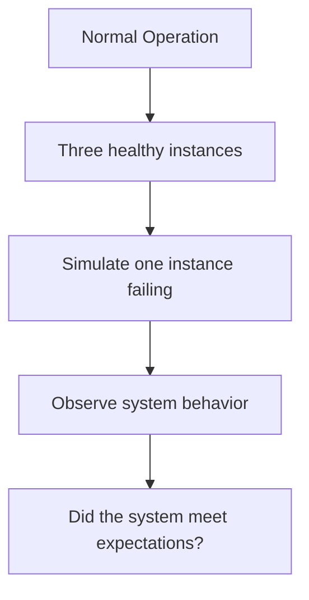

The goal is not to break systems for entertainment.

The goal is to **discover whether the system behaves as designed when something goes wrong**.

---

# 2. Why Is Chaos Engineering Necessary?

Architecture diagrams show how a system is intended to work.

They do not prove that it will behave correctly during a failure.

Consider a multi-instance application:

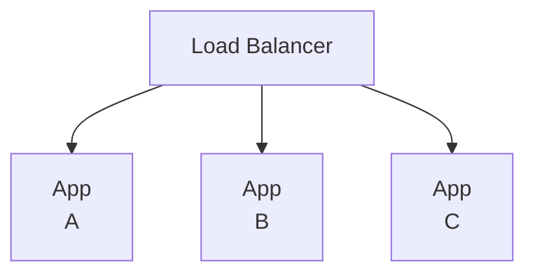

The design says that if App A fails, the load balancer should route traffic to App B and App C.

But several things could go wrong:

- The health check detects the failure too slowly.
- The load balancer continues sending requests to App A.
- App B and App C lack enough capacity.
- All instances depend on the same failing database.
- Requests start timing out.
- Retries increase the load on the database.

Without testing, these weaknesses might remain hidden until a real incident.

> **Designed resilience is an intention. Tested resilience is evidence.**

---

# 3. Chaos Engineering vs Ordinary Testing

Both are useful, but they answer different questions.

| Ordinary testing | Chaos engineering |
|---|---|
| Checks expected application behavior. | Checks system behavior under injected failures. |
| Tests functions, features, and defined cases. | Tests assumptions about resilience and recovery. |
| Often uses controlled test inputs. | Deliberately introduces faults such as latency or instance failure. |
| Asks, "Does this feature work?" | Asks, "Does the system remain acceptable when something fails?" |

They are complementary, not competing practices.

For example, a unit test can verify that an error is handled correctly. A chaos experiment can test whether the whole application remains available when a real dependency becomes unreachable.

---

# 4. The Core Concepts

## 4.1 Hypothesis

A **hypothesis** is a specific, testable expectation about system behavior.

Example:

> If one application instance becomes unavailable, the load balancer will stop routing traffic to it, and the remaining instances will continue serving requests within the agreed latency and error-rate limits.

A vague hypothesis such as "the system should be reliable" is difficult to test.

## 4.2 Steady State

**Steady state** describes the normal, acceptable behavior of the system that you want to preserve.

It may be defined using measurements such as:

- Successful request rate.
- Response latency.
- Error rate.
- Queue depth.
- Business operation success rate.

Example:

```text
Before the experiment:

Successful requests >= 99%
p95 latency < 300 ms
Checkout operations succeed
```

These numbers are illustrative. Real thresholds should come from the service's requirements and observed behavior.

## 4.3 Fault Injection

**Fault injection** means deliberately introducing a failure or abnormal condition.

Examples:

- Stop an application instance.
- Add network latency.
- Block access to a test dependency.
- Restart a worker.
- Simulate a database connection failure.

## 4.4 Blast Radius

The **blast radius** is the amount of the system or number of users that could be affected by an experiment or failure.

A safe experiment tries to limit its blast radius.

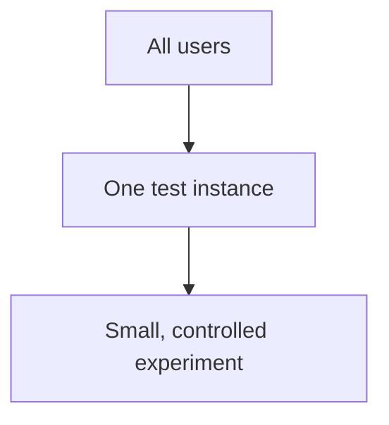

## 4.5 Rollback or Abort Condition

An experiment needs a clear stopping rule.

For example:

```text
If error rate exceeds 2%
or p95 latency exceeds 1 second:

Stop the experiment
and restore normal operation.
```

The thresholds are examples, not universal standards.

---

# 5. The Chaos Engineering Process

A useful experiment follows a repeatable process.

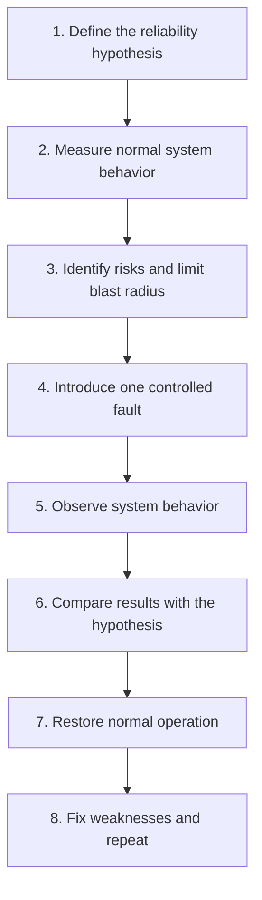

The experiment is useful even if the hypothesis turns out to be wrong. Discovering an unexpected failure is valuable—as long as the experiment is controlled.

---

# 6. Common Chaos Experiments

Different experiments test different assumptions.

| Experiment | What it tests |
|---|---|
| Stop one application instance | Health checks, load balancing, and spare capacity |
| Stop a background worker | Queue durability and worker recovery |
| Add network latency | Timeout behavior and latency sensitivity |
| Make a dependency unavailable | Fallbacks and graceful degradation |
| Restart a database replica | Failover and reconnection behavior |
| Delay message processing | Queue growth and backlog recovery |
| Simulate an availability-zone outage | Multi-AZ resilience and remaining capacity |

Not every experiment should be performed in production. Start with a safe environment and choose the environment according to the risk and the question being tested.

---

# 7. Example: One Application Instance Fails

Suppose an online store has three application instances.


Your hypothesis:

> If App A fails, the other instances will continue handling requests without unacceptable errors or latency.

### Experiment

1. Record normal request success rate and latency.
2. Confirm App B and App C are healthy.
3. Stop App A in a controlled test environment.
4. Send representative traffic.
5. Observe routing, errors, latency, and capacity.
6. Restart App A and verify recovery.

### Possible result

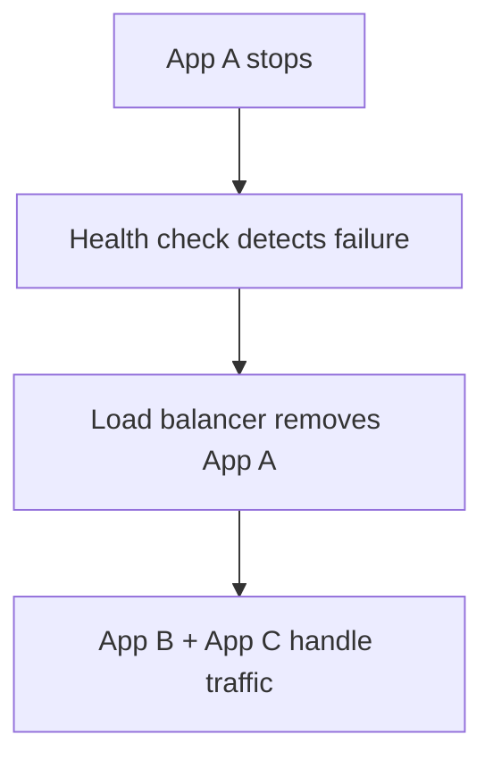

But what if App B and App C become overloaded?

Then the experiment has revealed a capacity weakness.

**Having redundant instances is not enough if the surviving instances cannot handle the workload.**

---

# 8. Example: External Dependency Becomes Slow

Imagine a product page calls a recommendation service.

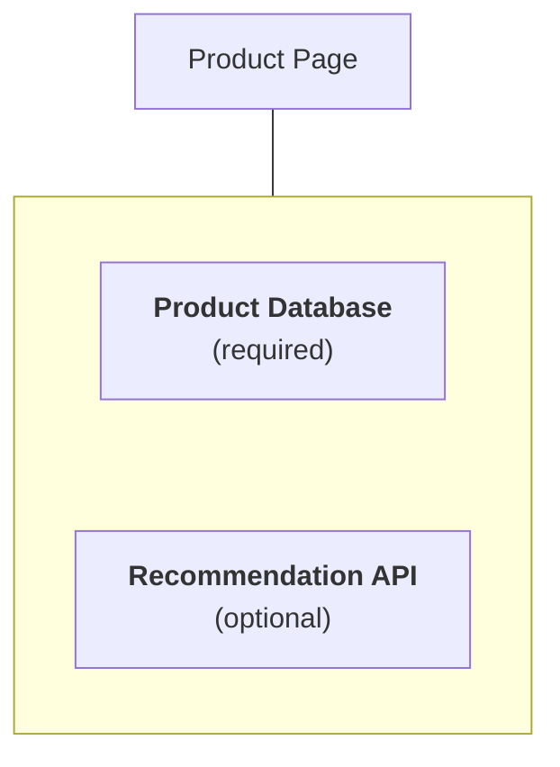

Your hypothesis:

> If the recommendation API becomes slow, the product page will still load without recommendations.

Introduce controlled latency to the recommendation dependency.

Observe:

- Does the request respect its timeout?
- Does the page return useful product information?
- Do retries create additional load?
- Are application workers held up unnecessarily?
- Does the error rate remain within acceptable limits?

Expected behavior:

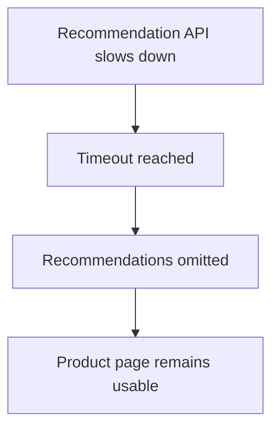

If the whole page fails because an optional recommendation service is slow, the experiment has exposed a graceful-degradation weakness.

---

# 9. Example: Background Worker Failure

Suppose orders are processed asynchronously.

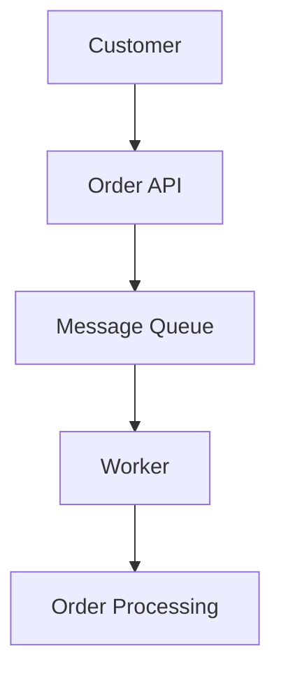

Your hypothesis:

> If a worker crashes after receiving a message, the order will not be silently lost.

A controlled experiment can stop a worker while it is processing a test message.

Check:

- Is the message retained or redelivered according to the queue's configuration?
- Can another worker resume processing?
- Could the operation happen twice?
- Are failed messages visible to operators?
- Can the system recover from the resulting backlog?

This experiment tests more than worker availability. It also tests message durability, acknowledgment behavior, idempotency, and observability.

Do not assume that every queue automatically guarantees safe redelivery or exactly-once business effects.

---

# 10. Chaos Engineering and Disaster Recovery

Chaos engineering and disaster recovery are related, but they are not the same.

| Disaster recovery | Chaos engineering |
|---|---|
| Defines how service is restored after a major disruption. | Tests assumptions about resilience and recovery. |
| Includes backups, recovery procedures, alternate infrastructure, RTO, and RPO. | Introduces controlled faults and observes system behavior. |
| Asks, "How will we recover?" | Asks, "Does our recovery design actually work?" |

For example, a disaster recovery plan may say that the application can be restored in another region.

A controlled recovery exercise can test whether the team can actually restore the application, recover usable data, redirect traffic, and meet the recovery objectives.

A plan that has never been tested may contain hidden assumptions.

---

# 11. Safety Rules

Chaos engineering must be controlled. The purpose is to learn, not to create an avoidable outage.

Before running an experiment:

- **Define the hypothesis.** Know exactly what you are testing.
- **Choose a safe environment.** Prefer local, test, or staging environments when they can answer the question.
- **Limit the blast radius.** Begin with one instance, one dependency, or a small group of test users.
- **Measure before and during the experiment.** Otherwise, you cannot tell what changed.
- **Set abort conditions.** Decide in advance when to stop.
- **Prepare recovery steps.** Know how to restore normal operation.
- **Coordinate with responsible teams.** Avoid unexpected experiments on shared infrastructure.
- **Protect data and security.** Never inject faults into systems or data you are not authorized to affect.

Production experiments require additional controls, appropriate authorization, monitoring, and a clear plan to stop the experiment.

---

# 12. Chaos Engineering Is Not Random Destruction

A common misconception is:

> "Chaos engineering means randomly breaking production."

That is not the goal.

A useful experiment is designed around a question.

For example:

```text
Question:
Can the application survive losing one instance?

Fault:
Stop one instance.

Expected behavior:
Traffic moves to healthy instances.

Measurements:
Error rate, p95 latency, available capacity.

Abort condition:
Errors exceed the agreed safety threshold.

Learning:
Identify any failure that violates the hypothesis.
```

Randomness is not required. The important part is controlled experimentation and evidence.

---

# 13. What Chaos Engineering Cannot Prove

One successful experiment does not prove that a system is completely reliable.

It only provides evidence about the specific conditions tested.

For example, successfully stopping one application instance does not prove resilience against:

- A complete region outage.
- Database corruption.
- Compromised credentials.
- A faulty deployment affecting every instance.
- A traffic surge beyond surviving capacity.
- Multiple simultaneous failures.

Real systems have many failure modes, and their behavior changes as the architecture evolves.

> **Test the failures that matter most, and repeat experiments when the system changes.**

---

# 14. A Lightweight Hands-On Exercise

Use a local or staging application with two application instances behind a load balancer. If your environment does not support that setup, perform the exercise as a tabletop simulation.

### Scenario

One application instance suddenly becomes unavailable.

### Your task

1. Write down the expected behavior before introducing the fault.
2. Record baseline request success rate and latency.
3. Stop one instance, or simulate its failure in your test setup.
4. Send representative requests.
5. Observe how quickly the failure is detected.
6. Check whether remaining capacity is sufficient.
7. Restore the instance.
8. Document what worked, what failed, and what you would change.

Use this table:

| Question | Your observation |
|---|---|
| Was the failure detected? | |
| Did traffic reach the failed instance? | |
| Did errors increase? | |
| Did latency increase? | |
| Could the remaining instances handle the load? | |
| Did service recover as expected? | |
| What should be improved? | |

The exercise is complete when you have evidence about the hypothesis—not merely when the instance is running again.

---

# 15. System Design View

Chaos engineering helps validate the resilience properties introduced throughout Level 9.

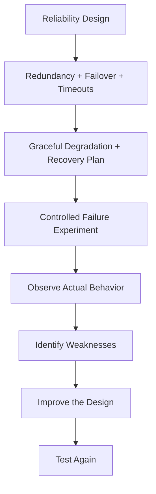

It is a feedback loop between architecture and operational evidence.

The experiment may reveal that the problem is not the failed component itself, but an assumption elsewhere—for example, insufficient spare capacity, a shared dependency, a timeout mismatch, or an untested recovery procedure.

---

# 16. Common Mistakes

- **Testing without a hypothesis:** The results are difficult to interpret.
- **Starting with a large blast radius:** A small experiment is easier to control.
- **Ignoring baseline measurements:** You cannot compare behavior reliably.
- **No abort condition:** The experiment can continue after the system becomes unsafe.
- **Testing only instance failure:** Other failure modes may be more important.
- **Assuming one successful test proves reliability:** Untested failure modes remain.
- **Ignoring recovery:** Restoring the component is not the same as verifying the service.
- **Running unauthorized production experiments:** This creates unnecessary operational risk.

---

# 17. Key Principle

> **Chaos engineering tests whether a system behaves as expected when controlled failures occur.**

The goal is to replace assumptions with evidence.

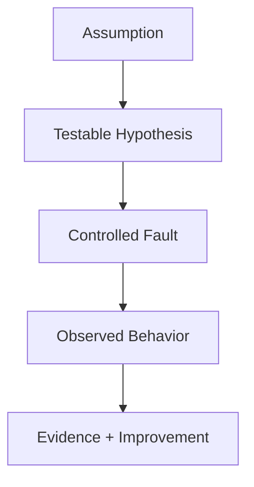

Resilience is not established by an architecture diagram alone. It must also be validated through realistic, carefully controlled experiments.

---

# 18. Quick Reference

| Concept | Meaning |
|---|---|
| Chaos engineering | Controlled failure experiments to discover resilience weaknesses |
| Hypothesis | A specific, testable expectation about system behavior |
| Steady state | The acceptable behavior measured before and during an experiment |
| Fault injection | Deliberately introducing a fault or abnormal condition |
| Blast radius | The portion of the system that could be affected |
| Abort condition | A predefined threshold or event that stops the experiment |
| Recovery validation | Confirming that the service is usable after recovery |
| Experiment | A controlled test that produces evidence about system behavior |

---

# 19. Knowledge Check

### Question 1

What is chaos engineering?

**Answer:** The controlled introduction of faults to discover weaknesses in a system's resilience.

### Question 2

Why define a hypothesis before an experiment?

**Answer:** It states the expected behavior and gives the experiment a measurable purpose.

### Question 3

What is blast radius?

**Answer:** The amount of the system or number of users that could be affected by a fault or experiment.

### Question 4

Why measure steady state?

**Answer:** It establishes a baseline so you can determine whether the experiment changed system behavior.

### Question 5

Does one successful experiment prove that a system is reliable?

**Answer:** No. It provides evidence only for the specific conditions tested.

### Question 6

How does chaos engineering relate to disaster recovery?

**Answer:** Disaster recovery defines the recovery capability and procedures; chaos engineering can test whether those capabilities behave as expected under controlled failures.

---

# 20. Level 9 Summary — Reliability & Recovery

Level 9 explored how systems continue operating, handle failures, and recover when disruptions occur.

| Topic | Core question |
|---|---|
| Reliability | Does the system perform its required function correctly over time? |
| Availability | Can users access the service when they need it? |
| Redundancy | What alternative capacity or component exists? |
| Fault Tolerance | Can the system continue despite a component failure? |
| Failover | How does work move to a healthy alternative? |
| Health Checks | How do we assess component health? |
| Graceful Degradation | Can essential functionality continue when optional functionality fails? |
| Backups | Can usable data be recovered? |
| Disaster Recovery | How do we restore the service after a major disruption? |
| RPO | How much data loss is acceptable? |
| RTO | How quickly must usable service be restored? |
| Multi-AZ | Can the system withstand an availability-zone failure? |
| Multi-Region | Can the system withstand a regional disruption? |
| Disaster Scenarios | Which disruptions could affect the system, and what would happen? |
| Chaos Engineering | Do controlled experiments support our assumptions about resilience? |

## Final Mental Model

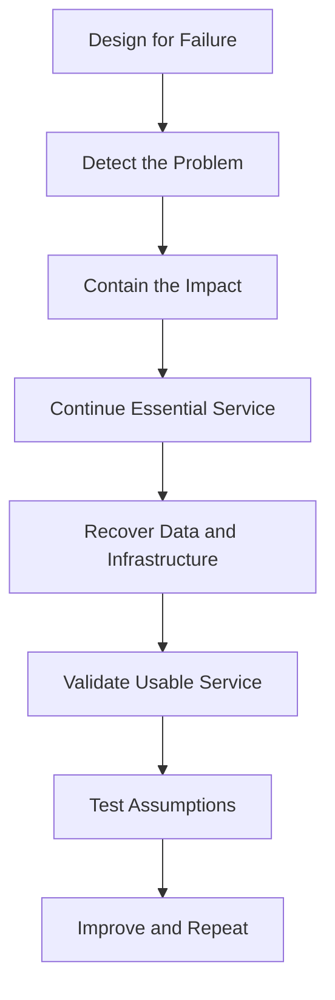

**Remember:** Reliable systems are not systems that never fail. They are systems designed to handle expected failures, limit their impact, and recover within acceptable boundaries—and whose behavior has been tested.

**Next: Level 10 — Observability**
