# 10.01 — Observability Fundamentals

## Learning Objectives

By the end of this chapter, you should be able to:

- Explain observability in practical system-design terms.
- Distinguish observability, monitoring, and debugging.
- Understand the role of metrics, logs, and distributed traces.
- Connect telemetry to real user and business outcomes.
- Understand instrumentation, context, and correlation.
- Recognize the limits and costs of collecting telemetry.
- Follow a basic evidence-driven incident investigation.

---

# 1. What Is Observability?

**Observability is the ability to understand a system's internal behavior using evidence produced by that system.**

Imagine a user reports:

> "I cannot complete checkout."

That statement describes a problem, but it does not identify the cause.

Possible causes include:

- The application is overloaded.
- The database is slow.
- The payment provider is unavailable.
- A connection pool is exhausted.
- A recent deployment introduced a bug.
- A network request is timing out.

Observability helps you investigate these possibilities systematically.

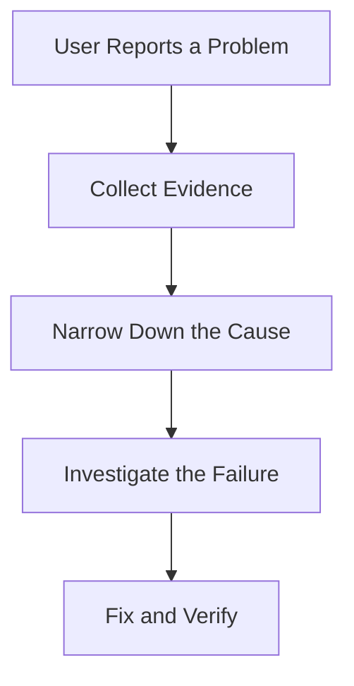

Without sufficient evidence, engineers often guess, change multiple things at once, and struggle to identify which change actually helped.

---

# 2. Observability, Monitoring, and Debugging

These concepts are related, but they serve different purposes.

| Concept | Main purpose | Example |
|---|---|---|
| Observability | Understand system behavior from its outputs. | Investigate why checkout became slow. |
| Monitoring | Track known conditions and detect problems. | Alert when the checkout error rate exceeds a threshold. |
| Debugging | Investigate and isolate a particular defect. | Find the code path causing an incorrect order total. |

Think of their relationship like this:

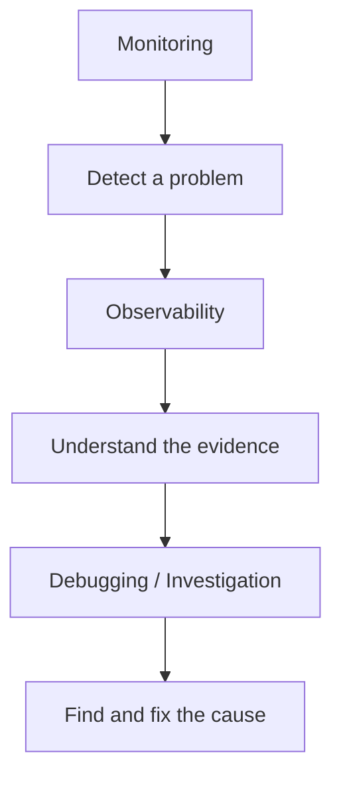

This is a useful mental model, not a strict sequence. Engineers may debug locally, investigate traces first, or discover problems through logs.

**Monitoring tells you when something needs attention. Observability helps you understand the behavior behind the signal.**

---

# 3. The Three Common Observability Signals

Observability is commonly introduced through three types of telemetry.

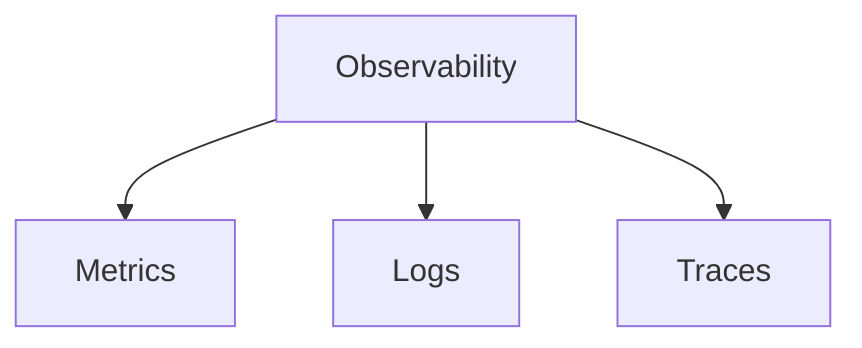

## Metrics — What is changing?

Metrics are numerical measurements collected over time.

Examples:

```text
Request rate:      800 requests/sec
Error rate:        2%
CPU utilization:   75%
p95 latency:       600 ms
```

They help identify trends, anomalies, and capacity constraints.

## Logs — What happened?

Logs record events.

```text
ERROR payment_timeout
order_id=ORD-1042
duration_ms=3000
```

They help investigate specific errors and understand what occurred.

## Traces — Where did the time go?

Traces follow a request through operations and services.

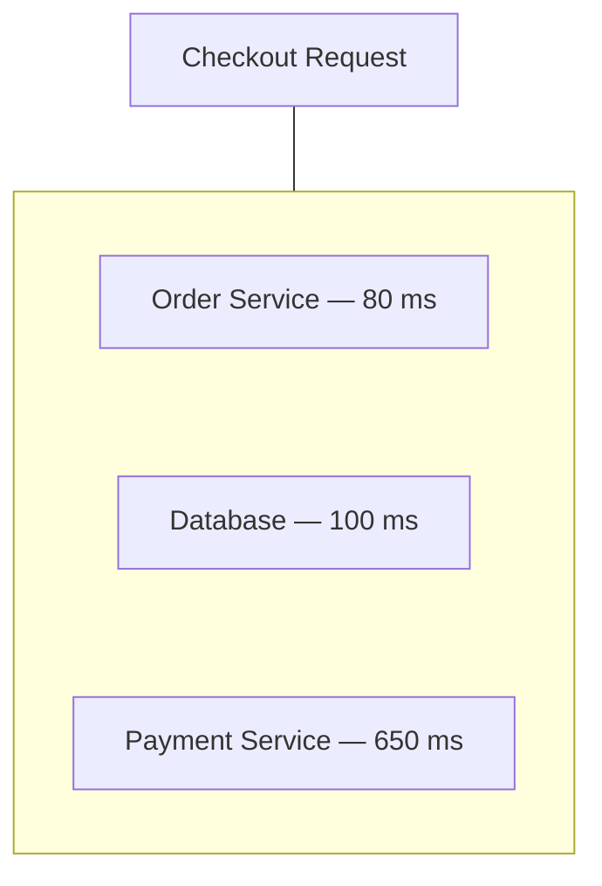

They help identify slow operations and dependencies.

The three signals complement each other. None is a complete replacement for the others.

---

# 4. Telemetry: Evidence Produced by the System

**Telemetry** is the operational data a system emits so its behavior can be observed.

It can include:

- Metrics.
- Logs.
- Traces.
- Runtime and infrastructure measurements.
- Events describing important system activity.

Consider a Node.js API.

The application can emit a metric for request duration, log an unexpected exception, and create trace spans for database and external API calls.

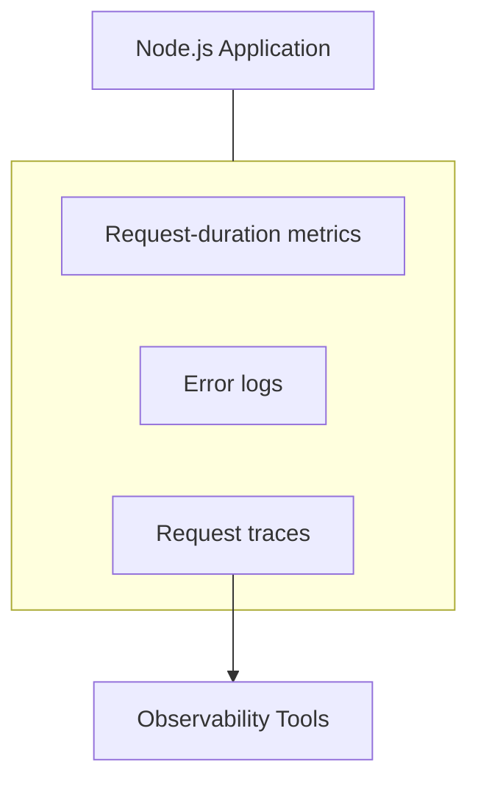

The application must be instrumented to produce useful telemetry. Some infrastructure and runtimes provide automatic instrumentation, while application-specific behavior often needs additional instrumentation.

---

# 5. Instrumentation

**Instrumentation** means adding the ability to measure and report what a system is doing.

For example, an application might record:

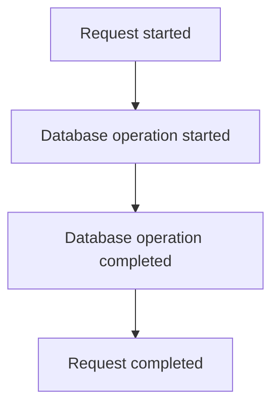

From this information, you can derive request duration and database-operation duration.

Instrumentation can be:

- **Manual:** Developers explicitly record important events or measurements.
- **Automatic:** Libraries or agents collect supported information with limited code changes.
- **Infrastructure-level:** Platforms collect CPU, memory, network, and other resource measurements.

Automatic instrumentation can save effort, but it does not automatically explain business-specific behavior such as why an order was rejected.

Good instrumentation answers meaningful questions without creating unnecessary noise or overhead.

---

# 6. Observability Must Connect to User Experience

A server can appear healthy while users experience problems.

For example:

```text
CPU utilization:       35%
Memory utilization:    50%
Server health check:   Healthy
Checkout success rate: 70%
```

The infrastructure looks acceptable, but checkout is failing for many users.

This is why system-level measurements should be connected to **user-visible outcomes**.

Useful questions include:

- Can users log in?
- Can customers complete checkout?
- Are orders being created successfully?
- Are pages responding within acceptable limits?
- Are background jobs finishing on time?

Resource metrics matter, but they do not replace measurements of actual service behavior.

---

# 7. Symptoms, Evidence, and Root Causes

Suppose users report slow course pages.

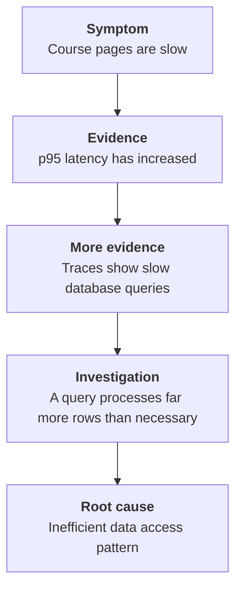

This is an illustrative investigation, not a universal diagnosis.

The important distinction is:

- **Symptom:** What users or operators notice.
- **Evidence:** What measurements and records reveal.
- **Root cause:** The underlying reason the problem occurs.

A high CPU reading may be evidence of a problem, but it is not automatically the root cause. You may still need to discover what is consuming the CPU.

---

# 8. Context and Correlation

Telemetry becomes more useful when different records can be connected.

Suppose a request produces:

```text
Request ID: req-abc123
```

That identifier may appear in application logs and related request metadata.

A distributed trace may have its own trace ID, with individual spans identified separately.

Conceptually:

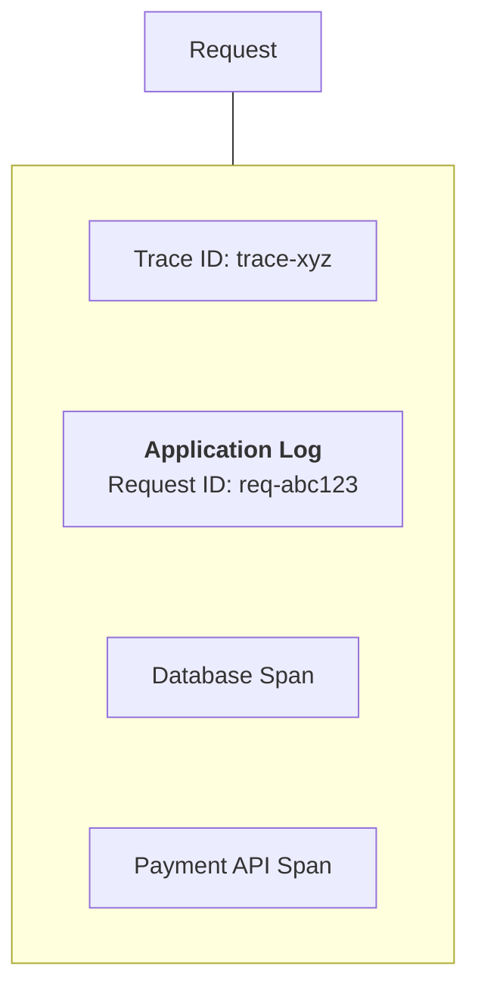

This makes it easier to connect an error to the request and operations involved.

A few important distinctions:

- A **request ID** identifies a request within a defined scope.
- A **trace ID** groups related spans in a distributed trace.
- A **span ID** identifies an individual operation within that trace.

These identifiers are not automatically interchangeable. Systems must propagate and record them correctly for correlation to work.

---

# 9. Observability Across Multiple Services

In a distributed system, a single user action may cross several services.

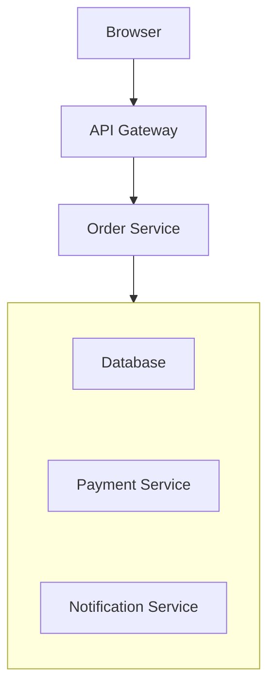

If the request fails, checking only the Order Service may not reveal the problem.

Distributed tracing helps follow the request across supported services. Logs and metrics add further evidence.

However, tracing depends on proper context propagation and instrumentation. A missing span does not necessarily mean an operation never occurred.

---

# 10. A Practical Investigation

Imagine your learning platform's enrollment endpoint is slow.

### Step 1 — Identify the user-visible problem

```text
Enrollment requests are taking too long.
```

### Step 2 — Check service-level metrics

```text
Request rate: Normal
Error rate:   Slightly elevated
p95 latency:  1.2 seconds
```

### Step 3 — Inspect representative traces

```text
API processing:       100 ms
Database operation:  900 ms
Other work:           200 ms
```

### Step 4 — Inspect relevant logs and database evidence

You discover that the enrollment query is waiting on a lock held by another transaction.

### Step 5 — Investigate the underlying cause

The team examines why the transaction remains open and whether it can be shortened safely.

### Step 6 — Verify the change

Compare latency, lock waits, error rate, and enrollment success before and after the fix.

The lesson is not that every slow query is caused by locks. It is that each step narrows the investigation using evidence.

---

# 11. Observability Has Costs

Collecting telemetry is not free.

It can consume:

- CPU and memory.
- Network bandwidth.
- Storage.
- Ingestion and processing capacity.
- Engineering and operational time.

For example, recording every database parameter and every request payload may generate enormous volumes of data while exposing sensitive information.

A sensible strategy prioritizes information that helps answer important questions.

### Useful practices

- Use structured, searchable logs.
- Record errors and meaningful events.
- Measure key user-facing operations.
- Sample high-volume traces where appropriate.
- Retain telemetry according to its operational value.
- Avoid secrets and unnecessary personal data.
- Monitor the cost and health of the observability pipeline itself.

Sampling must be designed carefully: aggressive sampling can hide rare but important failures.

---

# 12. Common Mistakes

- **Observing only infrastructure:** Healthy servers do not guarantee successful user operations.
- **Collecting telemetry without a purpose:** More data can create more noise and cost.
- **Treating a symptom as a root cause:** High CPU or latency requires further investigation.
- **Failing to correlate records:** Unrelated logs are harder to connect to a specific request.
- **Assuming automatic instrumentation is complete:** Business-specific operations may remain invisible.
- **Ignoring privacy and security:** Telemetry must not expose credentials or unnecessary sensitive data.
- **Making a change without verification:** Improvement must be demonstrated with measurements.

---

# 13. System Design View

Observability is a feedback mechanism for operating and evolving a system.

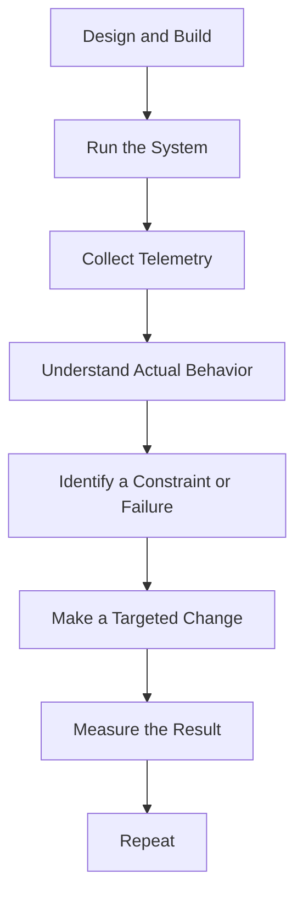

This connects directly to Systemly's central philosophy:

> **Understand → Model → Decide → Build → Measure → Scale → Recover → Evolve**

Observability helps engineers understand what the deployed system actually does, rather than relying only on how they expected it to behave.

---

# 14. Key Principle

> **Observability is useful when it helps answer an operational question and supports a better engineering decision.**

The goal is not to collect the most data.

The goal is to collect enough trustworthy, relevant evidence to understand behavior, diagnose problems, and verify improvements.

---

# 15. Quick Reference

| Concept | Meaning |
|---|---|
| Observability | Understanding internal system behavior from its outputs |
| Monitoring | Tracking known conditions and detecting problems |
| Debugging | Investigating a defect to isolate its cause |
| Telemetry | Operational data emitted by a system |
| Instrumentation | Enabling a system to produce useful telemetry |
| Metric | Numerical measurement over time |
| Log | Record of an event |
| Trace | Connected view of operations for a request |
| Span | One operation within a trace |
| Request ID | Identifier used to correlate a request within a defined scope |
| Trace ID | Identifier grouping spans in a distributed trace |
| Root Cause | Underlying reason a problem occurs |

---

# 16. Knowledge Check

### Question 1

What is observability?

**Answer:** The ability to understand system behavior through the evidence the system emits.

### Question 2

How does observability differ from monitoring?

**Answer:** Monitoring tracks known conditions and alerts on signals; observability helps investigate system behavior and explain unexpected outcomes.

### Question 3

What is instrumentation?

**Answer:** Adding or enabling mechanisms that collect and emit useful information about system operation.

### Question 4

Why are request and trace identifiers useful?

**Answer:** They help connect relevant logs, spans, and events to the same request or distributed operation.

### Question 5

Can a system have healthy CPU and memory readings while users experience failures?

**Answer:** Yes. Application errors, dependency failures, authorization problems, or business-workflow failures may occur even when infrastructure resources appear healthy.

### Question 6

Why should telemetry collection be selective?

**Answer:** Excessive or irrelevant telemetry increases cost, overhead, noise, and potential privacy risk.

---

# Remember

When a system behaves unexpectedly:

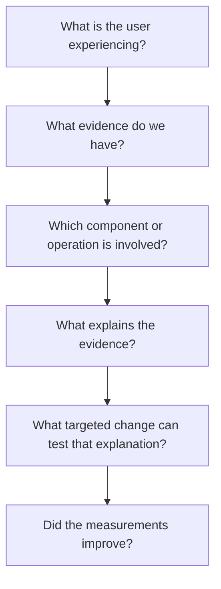

**Next: 10.02 — Metrics**
